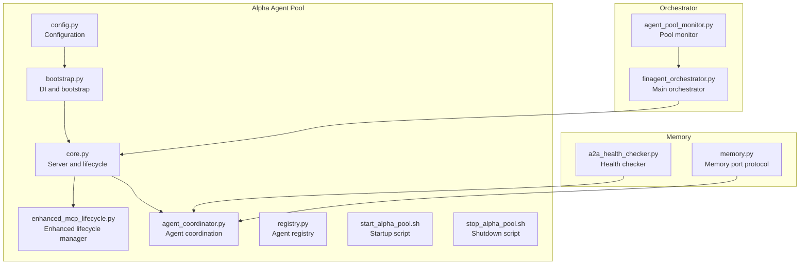
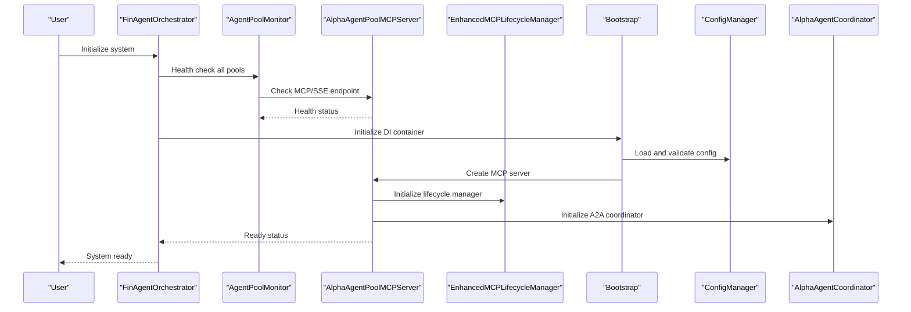
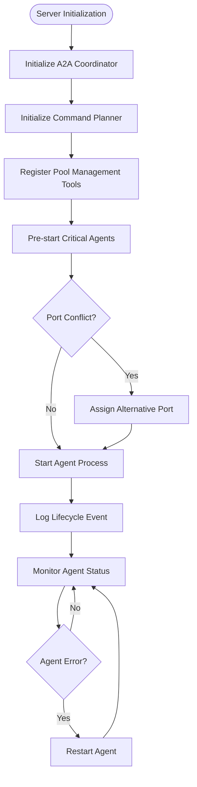
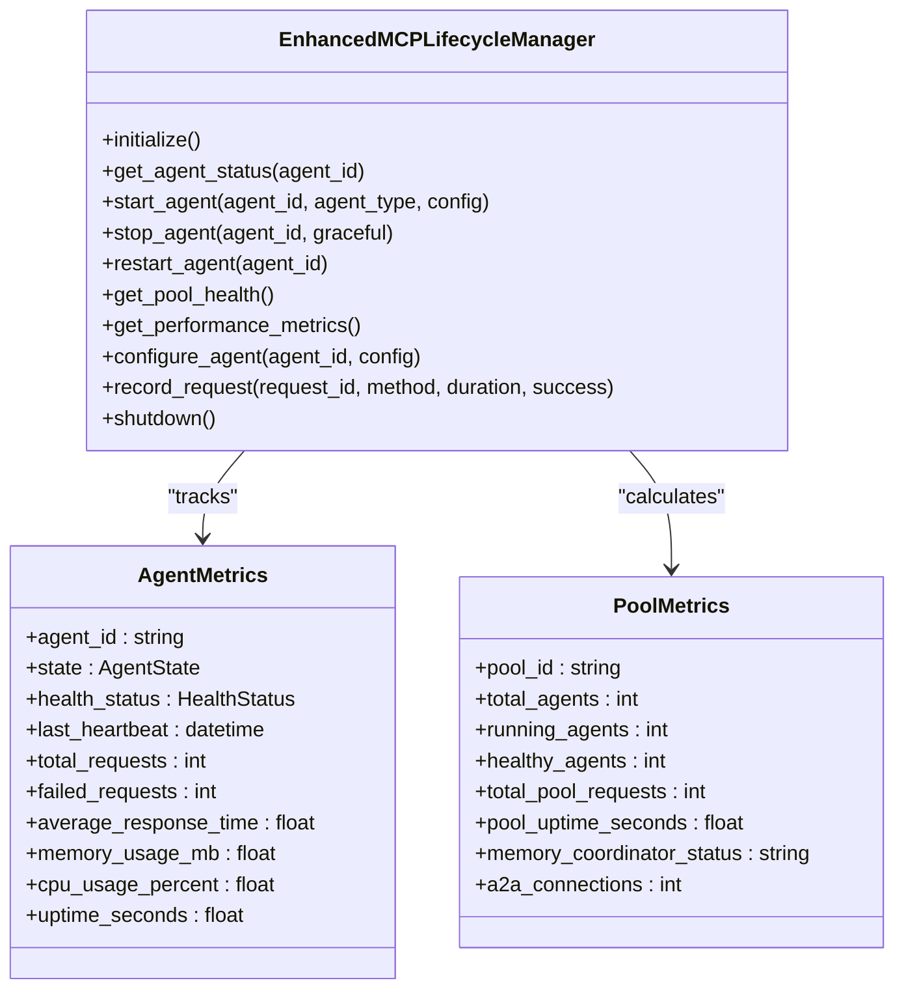
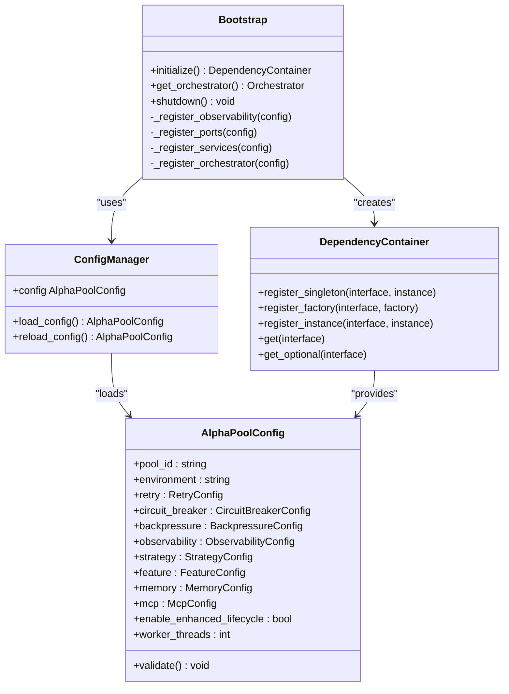
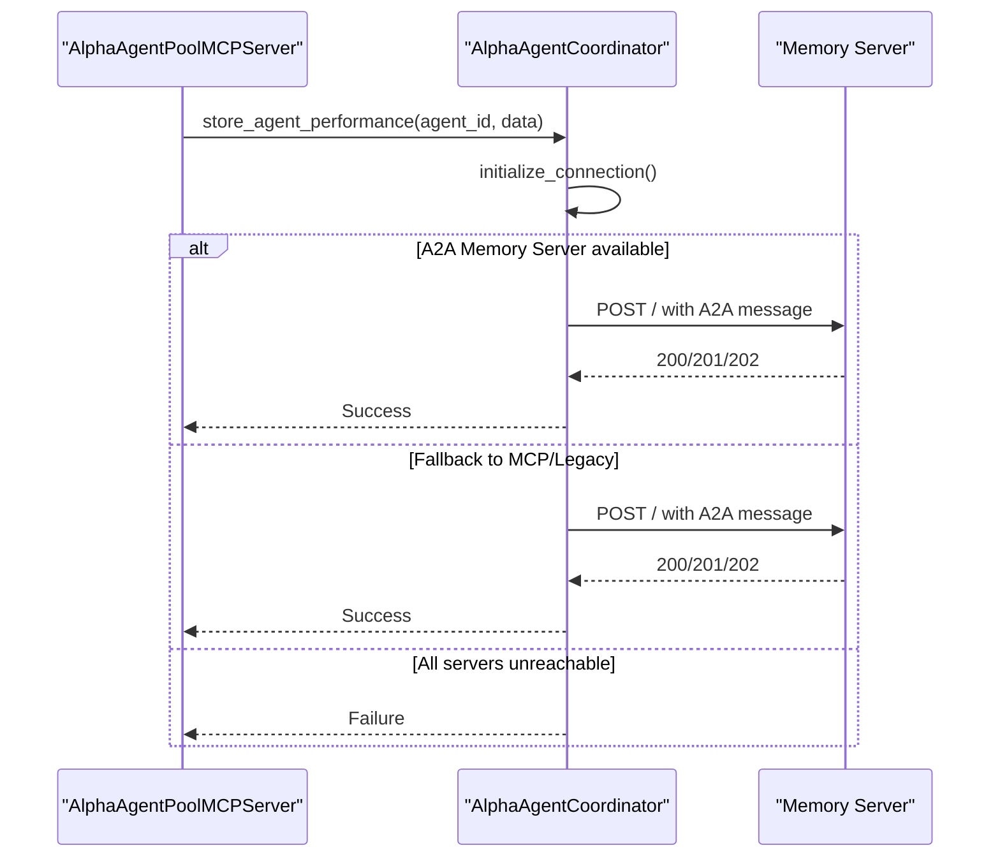
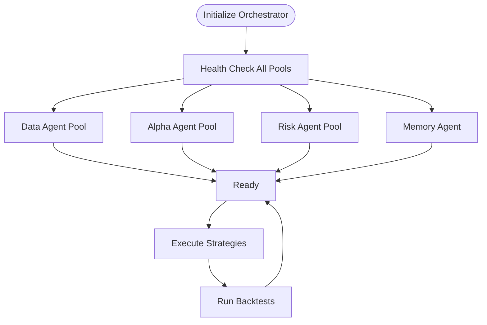
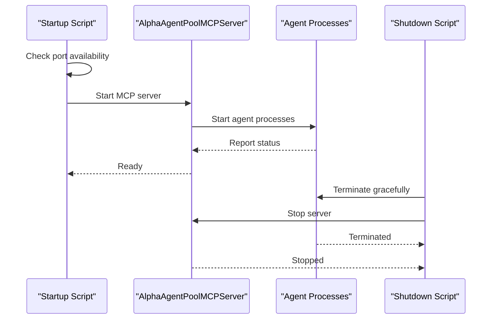
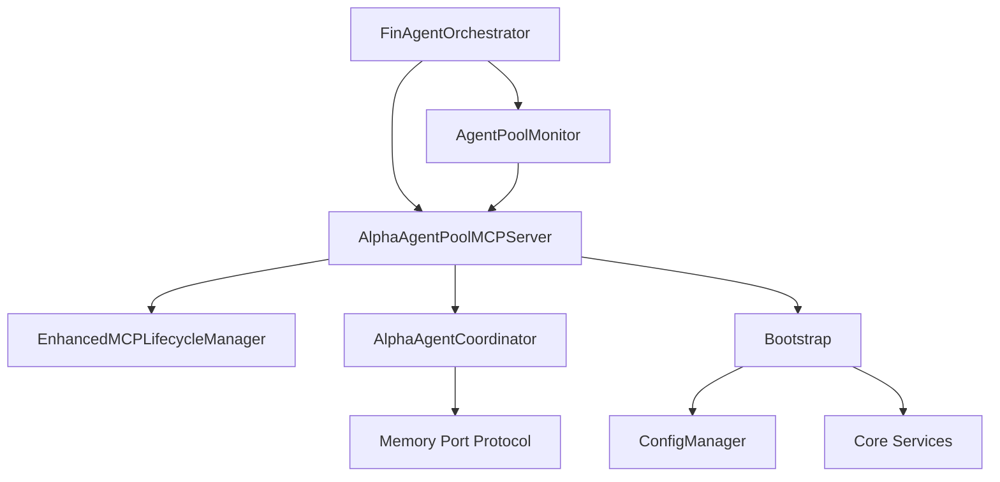

# Agent Lifecycle Management

<cite>
**Referenced Files in This Document**
- [core.py](file://FinAgents/agent_pools/alpha_agent_pool/core.py)
- [enhanced_mcp_lifecycle.py](file://FinAgents/agent_pools/alpha_agent_pool/enhanced_mcp_lifecycle.py)
- [bootstrap.py](file://FinAgents/agent_pools/alpha_agent_pool/runtime/bootstrap.py)
- [config.py](file://FinAgents/agent_pools/alpha_agent_pool/runtime/config.py)
- [agent_coordinator.py](file://FinAgents/agent_pools/alpha_agent_pool/agent_coordinator.py)
- [registry.py](file://FinAgents/agent_pools/alpha_agent_pool/registry.py)
- [start_alpha_pool.sh](file://FinAgents/agent_pools/alpha_agent_pool/start_alpha_pool.sh)
- [stop_alpha_pool.sh](file://FinAgents/agent_pools/alpha_agent_pool/stop_alpha_pool.sh)
- [finagent_orchestrator.py](file://FinAgents/orchestrator/core/finagent_orchestrator.py)
- [agent_pool_monitor.py](file://FinAgents/orchestrator/core/agent_pool_monitor.py)
- [a2a_health_checker.py](file://FinAgents/memory/a2a_health_checker.py)
- [memory.py](file://FinAgents/agent_pools/alpha_agent_pool/core/ports/memory.py)
</cite>

## Table of Contents
1. [Introduction](#introduction)
2. [Project Structure](#project-structure)
3. [Core Components](#core-components)
4. [Architecture Overview](#architecture-overview)
5. [Detailed Component Analysis](#detailed-component-analysis)
6. [Dependency Analysis](#dependency-analysis)
7. [Performance Considerations](#performance-considerations)
8. [Troubleshooting Guide](#troubleshooting-guide)
9. [Conclusion](#conclusion)

## Introduction
This document provides comprehensive documentation for agent lifecycle management in the agentic trading application, focusing on the Alpha Agent Pool and its integration with the broader system. It covers the complete lifecycle from initialization and dependency resolution to coordinated startup, dynamic scaling, graceful shutdown, and integration with monitoring and restart mechanisms. The goal is to equip both technical and non-technical readers with a clear understanding of how agent pools are orchestrated, how dependencies are resolved, and how the system maintains reliability and performance under varying conditions.

## Project Structure
The agent lifecycle management spans several modules within the Alpha Agent Pool and integrates with the orchestrator and memory subsystems:
- Alpha Agent Pool core server and lifecycle management
- Dependency injection and configuration management
- Agent coordination and memory integration
- Startup/shutdown scripts and monitoring utilities
- Orchestrator-level coordination and health monitoring

**Diagram sources**
- [core.py:431-800](file://FinAgents/agent_pools/alpha_agent_pool/core.py#L431-L800)
- [enhanced_mcp_lifecycle.py:83-153](file://FinAgents/agent_pools/alpha_agent_pool/enhanced_mcp_lifecycle.py#L83-L153)
- [bootstrap.py:75-234](file://FinAgents/agent_pools/alpha_agent_pool/runtime/bootstrap.py#L75-L234)
- [config.py:83-119](file://FinAgents/agent_pools/alpha_agent_pool/runtime/config.py#L83-L119)
- [agent_coordinator.py:26-74](file://FinAgents/agent_pools/alpha_agent_pool/agent_coordinator.py#L26-L74)
- [registry.py:1-55](file://FinAgents/agent_pools/alpha_agent_pool/registry.py#L1-L55)
- [start_alpha_pool.sh:1-357](file://FinAgents/agent_pools/alpha_agent_pool/start_alpha_pool.sh#L1-L357)
- [stop_alpha_pool.sh:1-254](file://FinAgents/agent_pools/alpha_agent_pool/stop_alpha_pool.sh#L1-L254)
- [finagent_orchestrator.py:106-224](file://FinAgents/orchestrator/core/finagent_orchestrator.py#L106-L224)
- [agent_pool_monitor.py:44-91](file://FinAgents/orchestrator/core/agent_pool_monitor.py#L44-L91)
- [a2a_health_checker.py:24-50](file://FinAgents/memory/a2a_health_checker.py#L24-L50)
- [memory.py:6-17](file://FinAgents/agent_pools/alpha_agent_pool/core/ports/memory.py#L6-L17)

**Section sources**
- [core.py:1-2562](file://FinAgents/agent_pools/alpha_agent_pool/core.py#L1-L2562)
- [enhanced_mcp_lifecycle.py:1-619](file://FinAgents/agent_pools/alpha_agent_pool/enhanced_mcp_lifecycle.py#L1-L619)
- [bootstrap.py:1-234](file://FinAgents/agent_pools/alpha_agent_pool/runtime/bootstrap.py#L1-L234)
- [config.py:1-257](file://FinAgents/agent_pools/alpha_agent_pool/runtime/config.py#L1-L257)
- [agent_coordinator.py:1-449](file://FinAgents/agent_pools/alpha_agent_pool/agent_coordinator.py#L1-L449)
- [registry.py:1-55](file://FinAgents/agent_pools/alpha_agent_pool/registry.py#L1-L55)
- [start_alpha_pool.sh:1-357](file://FinAgents/agent_pools/alpha_agent_pool/start_alpha_pool.sh#L1-L357)
- [stop_alpha_pool.sh:1-254](file://FinAgents/agent_pools/alpha_agent_pool/stop_alpha_pool.sh#L1-L254)
- [finagent_orchestrator.py:1-1823](file://FinAgents/orchestrator/core/finagent_orchestrator.py#L1-L1823)
- [agent_pool_monitor.py:1-527](file://FinAgents/orchestrator/core/agent_pool_monitor.py#L1-L527)
- [a2a_health_checker.py:1-335](file://FinAgents/memory/a2a_health_checker.py#L1-L335)
- [memory.py:1-17](file://FinAgents/agent_pools/alpha_agent_pool/core/ports/memory.py#L1-L17)

## Core Components
This section outlines the primary components responsible for agent lifecycle management and their roles:
- AlphaAgentPoolMCPServer: Central server managing agent lifecycle, A2A memory coordination, and MCP tool registration.
- EnhancedMCPLifecycleManager: Provides agent state management, health monitoring, metrics collection, and graceful shutdown.
- Bootstrap and DependencyContainer: Handles dependency injection, configuration registration, and orchestrator creation.
- ConfigManager and AlphaPoolConfig: Manages configuration loading, validation, and environment overrides.
- AlphaAgentCoordinator: Coordinates agent performance storage and memory operations with A2A protocol.
- AgentPoolMonitor and FinAgentOrchestrator: Provide system-wide monitoring, health checks, and coordinated startup sequences.
- Startup/Shutdown Scripts: Manage process lifecycle, port conflict detection, and cleanup.

**Section sources**
- [core.py:431-800](file://FinAgents/agent_pools/alpha_agent_pool/core.py#L431-L800)
- [enhanced_mcp_lifecycle.py:83-153](file://FinAgents/agent_pools/alpha_agent_pool/enhanced_mcp_lifecycle.py#L83-L153)
- [bootstrap.py:75-234](file://FinAgents/agent_pools/alpha_agent_pool/runtime/bootstrap.py#L75-L234)
- [config.py:83-119](file://FinAgents/agent_pools/alpha_agent_pool/runtime/config.py#L83-L119)
- [agent_coordinator.py:26-74](file://FinAgents/agent_pools/alpha_agent_pool/agent_coordinator.py#L26-L74)
- [agent_pool_monitor.py:44-91](file://FinAgents/orchestrator/core/agent_pool_monitor.py#L44-L91)
- [finagent_orchestrator.py:106-224](file://FinAgents/orchestrator/core/finagent_orchestrator.py#L106-L224)
- [start_alpha_pool.sh:55-96](file://FinAgents/agent_pools/alpha_agent_pool/start_alpha_pool.sh#L55-L96)
- [stop_alpha_pool.sh:94-118](file://FinAgents/agent_pools/alpha_agent_pool/stop_alpha_pool.sh#L94-L118)

## Architecture Overview
The agent lifecycle architecture centers around the Alpha Agent Pool MCP Server, which integrates with:
- Enhanced lifecycle management for agent state and health
- Dependency injection for services and ports
- Memory coordination via A2A protocol
- Orchestrator-level monitoring and coordinated startup
- Startup/shutdown scripts for robust process management

**Diagram sources**
- [finagent_orchestrator.py:201-224](file://FinAgents/orchestrator/core/finagent_orchestrator.py#L201-L224)
- [agent_pool_monitor.py:83-112](file://FinAgents/orchestrator/core/agent_pool_monitor.py#L83-L112)
- [core.py:477-527](file://FinAgents/agent_pools/alpha_agent_pool/core.py#L477-L527)
- [enhanced_mcp_lifecycle.py:130-153](file://FinAgents/agent_pools/alpha_agent_pool/enhanced_mcp_lifecycle.py#L130-L153)
- [bootstrap.py:84-109](file://FinAgents/agent_pools/alpha_agent_pool/runtime/bootstrap.py#L84-L109)
- [config.py:212-229](file://FinAgents/agent_pools/alpha_agent_pool/runtime/config.py#L212-L229)
- [agent_coordinator.py:75-108](file://FinAgents/agent_pools/alpha_agent_pool/agent_coordinator.py#L75-L108)

## Detailed Component Analysis

### Alpha Agent Pool Server Lifecycle
The AlphaAgentPoolMCPServer orchestrates agent lifecycle operations, including:
- Agent startup sequencing and port conflict resolution
- A2A memory coordinator initialization
- Agent registry and status tracking
- Command planner for DAG-based execution and recovery

Key responsibilities:
- Synchronous and asynchronous agent startup
- Port availability checks and alternative port assignment
- Agent lifecycle event logging and performance tracking
- Integration with agent coordinator for cross-agent learning

**Diagram sources**
- [core.py:573-794](file://FinAgents/agent_pools/alpha_agent_pool/core.py#L573-L794)
- [core.py:681-753](file://FinAgents/agent_pools/alpha_agent_pool/core.py#L681-L753)
- [core.py:795-800](file://FinAgents/agent_pools/alpha_agent_pool/core.py#L795-L800)

**Section sources**
- [core.py:431-800](file://FinAgents/agent_pools/alpha_agent_pool/core.py#L431-L800)
- [core.py:573-794](file://FinAgents/agent_pools/alpha_agent_pool/core.py#L573-L794)

### Enhanced MCP Lifecycle Management
The EnhancedMCPLifecycleManager extends MCP server capabilities with:
- Agent state tracking and health monitoring
- Performance metrics collection and reporting
- Graceful shutdown and recovery procedures
- A2A coordinator integration for agent registration/unregistration

Lifecycle features:
- Agent state transitions (INITIALIZING → RUNNING → STOPPING → STOPPED)
- Health scoring and alerting for critical conditions
- Request monitoring and performance analytics
- Dynamic agent scaling and configuration updates

**Diagram sources**
- [enhanced_mcp_lifecycle.py:83-153](file://FinAgents/agent_pools/alpha_agent_pool/enhanced_mcp_lifecycle.py#L83-L153)
- [enhanced_mcp_lifecycle.py:42-81](file://FinAgents/agent_pools/alpha_agent_pool/enhanced_mcp_lifecycle.py#L42-L81)

**Section sources**
- [enhanced_mcp_lifecycle.py:83-153](file://FinAgents/agent_pools/alpha_agent_pool/enhanced_mcp_lifecycle.py#L83-L153)
- [enhanced_mcp_lifecycle.py:154-423](file://FinAgents/agent_pools/alpha_agent_pool/enhanced_mcp_lifecycle.py#L154-L423)
- [enhanced_mcp_lifecycle.py:424-571](file://FinAgents/agent_pools/alpha_agent_pool/enhanced_mcp_lifecycle.py#L424-L571)

### Dependency Injection and Configuration
The bootstrap and configuration system ensures reliable dependency resolution:
- DependencyContainer supports singleton, factory, and instance registrations
- ConfigManager loads configuration from YAML or environment variables with validation
- Orchestrator creation leverages injected services and ports

**Diagram sources**
- [bootstrap.py:24-73](file://FinAgents/agent_pools/alpha_agent_pool/runtime/bootstrap.py#L24-L73)
- [bootstrap.py:75-234](file://FinAgents/agent_pools/alpha_agent_pool/runtime/bootstrap.py#L75-L234)
- [config.py:14-119](file://FinAgents/agent_pools/alpha_agent_pool/runtime/config.py#L14-L119)
- [config.py:205-229](file://FinAgents/agent_pools/alpha_agent_pool/runtime/config.py#L205-L229)

**Section sources**
- [bootstrap.py:24-109](file://FinAgents/agent_pools/alpha_agent_pool/runtime/bootstrap.py#L24-L109)
- [config.py:14-119](file://FinAgents/agent_pools/alpha_agent_pool/runtime/config.py#L14-L119)
- [config.py:205-229](file://FinAgents/agent_pools/alpha_agent_pool/runtime/config.py#L205-L229)

### Agent Coordination and Memory Integration
The AlphaAgentCoordinator provides:
- Fallback connection strategy to A2A/MCP/Legacy memory servers
- Agent performance and strategy insight storage
- Cross-agent learning pattern storage
- Comprehensive health monitoring and statistics

Integration points:
- A2A protocol compliant message sending
- HTTP client-based memory operations
- Operation statistics and success rate calculations

**Diagram sources**
- [agent_coordinator.py:125-187](file://FinAgents/agent_pools/alpha_agent_pool/agent_coordinator.py#L125-L187)
- [agent_coordinator.py:188-244](file://FinAgents/agent_pools/alpha_agent_pool/agent_coordinator.py#L188-L244)
- [agent_coordinator.py:246-359](file://FinAgents/agent_pools/alpha_agent_pool/agent_coordinator.py#L246-L359)

**Section sources**
- [agent_coordinator.py:26-108](file://FinAgents/agent_pools/alpha_agent_pool/agent_coordinator.py#L26-L108)
- [agent_coordinator.py:125-244](file://FinAgents/agent_pools/alpha_agent_pool/agent_coordinator.py#L125-L244)
- [agent_coordinator.py:246-359](file://FinAgents/agent_pools/alpha_agent_pool/agent_coordinator.py#L246-L359)

### Orchestrator-Level Monitoring and Coordination
The orchestrator provides:
- System-wide health checks for all agent pools
- Coordinated startup sequences with dependency awareness
- MCP protocol connectivity validation
- Execution context management and metrics tracking

**Diagram sources**
- [finagent_orchestrator.py:201-224](file://FinAgents/orchestrator/core/finagent_orchestrator.py#L201-L224)
- [finagent_orchestrator.py:273-287](file://FinAgents/orchestrator/core/finagent_orchestrator.py#L273-L287)
- [agent_pool_monitor.py:353-374](file://FinAgents/orchestrator/core/agent_pool_monitor.py#L353-L374)

**Section sources**
- [finagent_orchestrator.py:106-224](file://FinAgents/orchestrator/core/finagent_orchestrator.py#L106-L224)
- [agent_pool_monitor.py:83-112](file://FinAgents/orchestrator/core/agent_pool_monitor.py#L83-L112)
- [agent_pool_monitor.py:353-374](file://FinAgents/orchestrator/core/agent_pool_monitor.py#L353-L374)

### Startup and Shutdown Procedures
The system provides robust process lifecycle management:
- Startup script with port conflict detection and alternative port assignment
- Comprehensive cleanup with graceful termination and force kill fallback
- PID tracking and process monitoring
- Automated restart capability through orchestrator

**Diagram sources**
- [start_alpha_pool.sh:55-96](file://FinAgents/agent_pools/alpha_agent_pool/start_alpha_pool.sh#L55-L96)
- [start_alpha_pool.sh:283-330](file://FinAgents/agent_pools/alpha_agent_pool/start_alpha_pool.sh#L283-L330)
- [stop_alpha_pool.sh:94-118](file://FinAgents/agent_pools/alpha_agent_pool/stop_alpha_pool.sh#L94-L118)
- [stop_alpha_pool.sh:120-232](file://FinAgents/agent_pools/alpha_agent_pool/stop_alpha_pool.sh#L120-L232)

**Section sources**
- [start_alpha_pool.sh:55-96](file://FinAgents/agent_pools/alpha_agent_pool/start_alpha_pool.sh#L55-L96)
- [start_alpha_pool.sh:283-330](file://FinAgents/agent_pools/alpha_agent_pool/start_alpha_pool.sh#L283-L330)
- [stop_alpha_pool.sh:94-118](file://FinAgents/agent_pools/alpha_agent_pool/stop_alpha_pool.sh#L94-L118)
- [stop_alpha_pool.sh:120-232](file://FinAgents/agent_pools/alpha_agent_pool/stop_alpha_pool.sh#L120-L232)

## Dependency Analysis
The agent lifecycle system exhibits clear separation of concerns with well-defined dependencies:
- Core server depends on lifecycle manager and agent coordinator
- Bootstrap depends on configuration and registers services
- Orchestrator depends on agent pool monitor and MCP clients
- Memory integration depends on A2A protocol compliance

**Diagram sources**
- [core.py:477-527](file://FinAgents/agent_pools/alpha_agent_pool/core.py#L477-L527)
- [enhanced_mcp_lifecycle.py:96-128](file://FinAgents/agent_pools/alpha_agent_pool/enhanced_mcp_lifecycle.py#L96-L128)
- [bootstrap.py:78-109](file://FinAgents/agent_pools/alpha_agent_pool/runtime/bootstrap.py#L78-L109)
- [config.py:205-229](file://FinAgents/agent_pools/alpha_agent_pool/runtime/config.py#L205-L229)
- [finagent_orchestrator.py:142-163](file://FinAgents/orchestrator/core/finagent_orchestrator.py#L142-L163)
- [agent_pool_monitor.py:49-71](file://FinAgents/orchestrator/core/agent_pool_monitor.py#L49-L71)
- [memory.py:6-17](file://FinAgents/agent_pools/alpha_agent_pool/core/ports/memory.py#L6-L17)

**Section sources**
- [core.py:477-527](file://FinAgents/agent_pools/alpha_agent_pool/core.py#L477-L527)
- [bootstrap.py:78-109](file://FinAgents/agent_pools/alpha_agent_pool/runtime/bootstrap.py#L78-L109)
- [finagent_orchestrator.py:142-163](file://FinAgents/orchestrator/core/finagent_orchestrator.py#L142-L163)
- [memory.py:6-17](file://FinAgents/agent_pools/alpha_agent_pool/core/ports/memory.py#L6-L17)

## Performance Considerations
Key performance characteristics and optimization strategies:
- Port conflict detection prevents startup failures and reduces retries
- Asynchronous agent startup with timeout handling improves resilience
- Health monitoring with configurable intervals balances overhead and responsiveness
- Memory usage tracking and CPU utilization monitoring enable capacity planning
- Graceful shutdown minimizes resource leaks and ensures clean state transitions

Resource allocation strategies:
- Worker threads configuration for concurrent operations
- Backpressure policies to prevent overload during high-load scenarios
- Retry policies with exponential backoff for transient failures
- Circuit breaker patterns to protect downstream services

## Troubleshooting Guide
Common issues and resolution strategies:
- Port conflicts: The startup script detects occupied ports and assigns alternatives automatically
- Agent startup failures: Enhanced lifecycle manager provides detailed error logging and recovery actions
- Memory connectivity issues: A2A health checker validates protocol compliance and provides diagnostic information
- Process cleanup problems: Shutdown script includes graceful termination followed by force kill fallback
- Orchestrator monitoring failures: Agent pool monitor validates MCP connectivity and provides system status summaries

Diagnostic tools:
- A2A health checker for protocol-compliant health validation
- Agent pool monitor for system-wide status and connectivity validation
- Lifecycle manager metrics for performance and error rate analysis
- Startup/shutdown scripts for process tracking and cleanup verification

**Section sources**
- [start_alpha_pool.sh:55-96](file://FinAgents/agent_pools/alpha_agent_pool/start_alpha_pool.sh#L55-L96)
- [enhanced_mcp_lifecycle.py:475-508](file://FinAgents/agent_pools/alpha_agent_pool/enhanced_mcp_lifecycle.py#L475-L508)
- [a2a_health_checker.py:34-120](file://FinAgents/memory/a2a_health_checker.py#L34-L120)
- [agent_pool_monitor.py:399-454](file://FinAgents/orchestrator/core/agent_pool_monitor.py#L399-L454)
- [stop_alpha_pool.sh:94-118](file://FinAgents/agent_pools/alpha_agent_pool/stop_alpha_pool.sh#L94-L118)

## Conclusion
The agent lifecycle management system provides a robust, scalable foundation for multi-agent financial strategy orchestration. Through comprehensive dependency injection, enhanced lifecycle management, and integrated monitoring, the system ensures reliable agent operations, efficient resource utilization, and smooth integration with the broader trading ecosystem. The combination of automated startup/shutdown procedures, health monitoring, and graceful recovery mechanisms enables the system to maintain high availability and performance under diverse operating conditions.