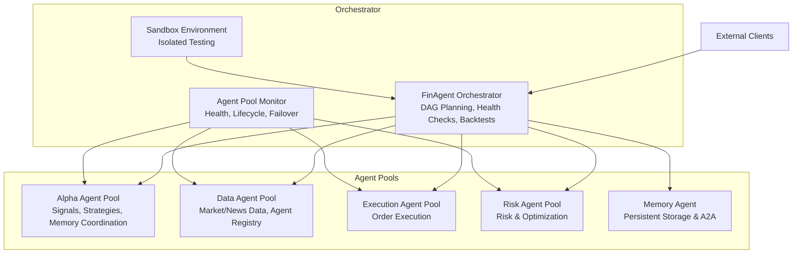
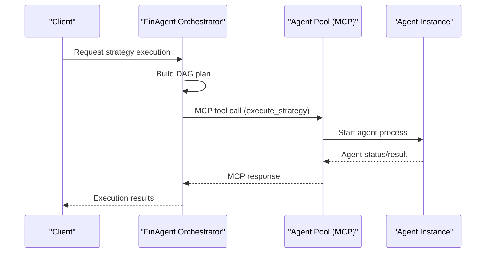
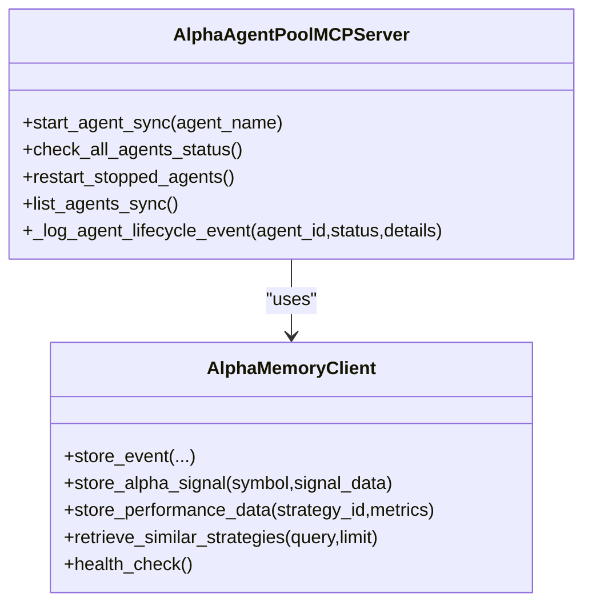
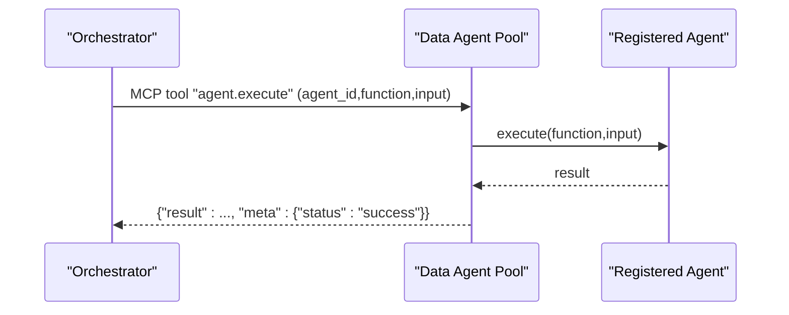
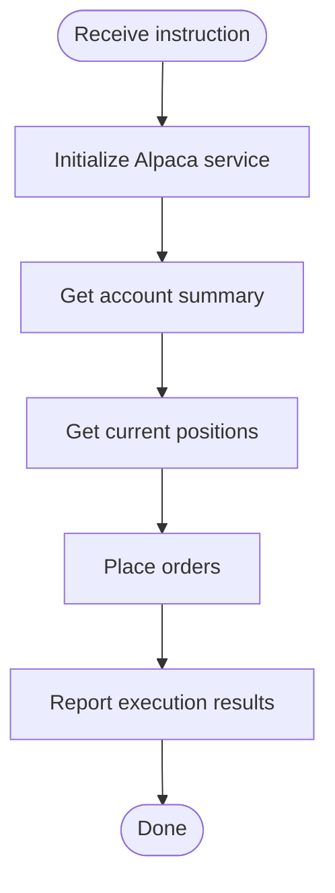
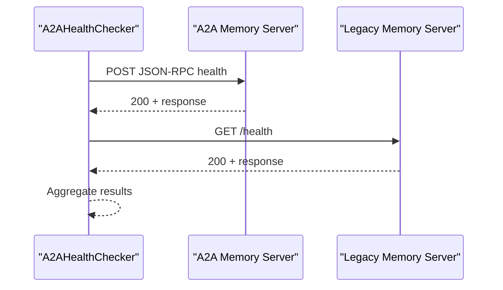
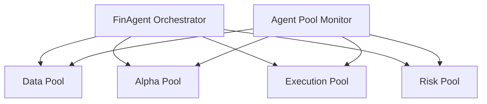
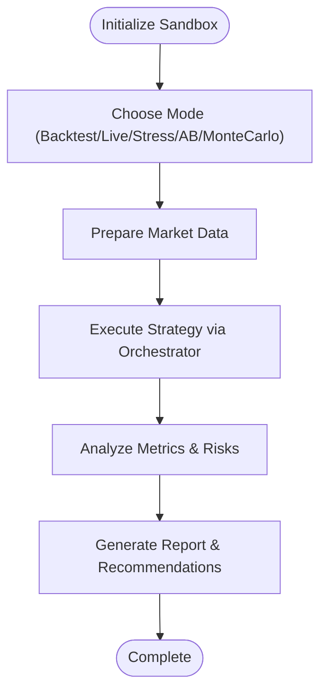
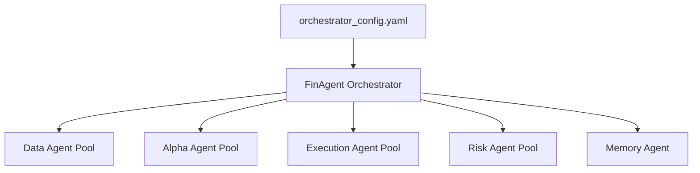

# Agent Pool Architecture

<cite>
**Referenced Files in This Document**
- [alpha_agent_pool/core.py](file://FinAgents/agent_pools/alpha_agent_pool/core.py)
- [alpha_agent_pool/__init__.py](file://FinAgents/agent_pools/alpha_agent_pool/__init__.py)
- [alpha_agent_pool/alpha_memory_client.py](file://FinAgents/agent_pools/alpha_agent_pool/alpha_memory_client.py)
- [alpha_agent_pool/enhanced_mcp_server.py](file://FinAgents/agent_pools/alpha_agent_pool/enhanced_mcp_server.py)
- [alpha_agent_pool/mcp_config.yaml](file://FinAgents/agent_pools/alpha_agent_pool/mcp_config.yaml)
- [data_agent_pool/mcp_server.py](file://FinAgents/agent_pools/data_agent_pool/mcp_server.py)
- [execution_agent_demo/execution_agent_demo/execution_agent.py](file://FinAgents/agent_pools/execution_agent_demo/execution_agent_demo/execution_agent.py)
- [risk_agent_pool/__init__.py](file://FinAgents/agent_pools/risk_agent_pool/__init__.py)
- [orchestrator/core/finagent_orchestrator.py](file://FinAgents/orchestrator/core/finagent_orchestrator.py)
- [orchestrator/core/agent_pool_monitor.py](file://FinAgents/orchestrator/core/agent_pool_monitor.py)
- [orchestrator/core/sandbox_environment.py](file://FinAgents/orchestrator/core/sandbox_environment.py)
- [orchestrator/config/orchestrator_config.yaml](file://FinAgents/orchestrator/config/orchestrator_config.yaml)
- [memory/a2a_health_checker.py](file://FinAgents/memory/a2a_health_checker.py)
</cite>

## Table of Contents
1. [Introduction](#introduction)
2. [Project Structure](#project-structure)
3. [Core Components](#core-components)
4. [Architecture Overview](#architecture-overview)
5. [Detailed Component Analysis](#detailed-component-analysis)
6. [Dependency Analysis](#dependency-analysis)
7. [Performance Considerations](#performance-considerations)
8. [Troubleshooting Guide](#troubleshooting-guide)
9. [Conclusion](#conclusion)
10. [Appendices](#appendices)

## Introduction
This document describes the agent pool system architecture coordinating multiple specialized agent pools for agentic trading. It explains the agent pool types (DATA, ALPHA, EXECUTION, MEMORY), their communication via Model Context Protocol (MCP), and the orchestrator’s role in health monitoring, failover, sandbox testing, and lifecycle management. It also covers agent pool registration, dynamic scaling, performance monitoring, discovery, and inter-agent communication patterns.

## Project Structure
The agent pool system is organized around modular pools, each exposing MCP endpoints and managing specialized agents:
- ALPHA agent pool: signal generation, strategy development, and memory coordination
- DATA agent pool: market and alternative data ingestion and agent execution
- EXECUTION agent pool: order execution and portfolio actions
- RISK agent pool: risk modeling and portfolio optimization
- MEMORY: persistent memory and A2A coordination
- ORCHESTRATOR: central control plane for health, monitoring, sandbox, and backtesting

**Diagram sources**
- [orchestrator/core/finagent_orchestrator.py:106-224](file://FinAgents/orchestrator/core/finagent_orchestrator.py#L106-L224)
- [orchestrator/core/agent_pool_monitor.py:44-96](file://FinAgents/orchestrator/core/agent_pool_monitor.py#L44-L96)
- [orchestrator/core/sandbox_environment.py:500-550](file://FinAgents/orchestrator/core/sandbox_environment.py#L500-L550)

**Section sources**
- [orchestrator/core/finagent_orchestrator.py:106-224](file://FinAgents/orchestrator/core/finagent_orchestrator.py#L106-L224)
- [orchestrator/core/agent_pool_monitor.py:44-96](file://FinAgents/orchestrator/core/agent_pool_monitor.py#L44-L96)
- [orchestrator/core/sandbox_environment.py:500-550](file://FinAgents/orchestrator/core/sandbox_environment.py#L500-L550)

## Core Components
- Alpha Agent Pool MCP Server: central orchestration with MCP endpoints, agent lifecycle management, and memory integration
- Data Agent Pool MCP Server: agent registry and execution via MCP resources
- Execution Agent: order execution and account operations
- Risk Agent Pool: risk modeling and optimization
- Memory Agent: persistent memory and A2A health checks
- Orchestrator: DAG planning, health monitoring, sandbox, and backtesting
- Agent Pool Monitor: health checks, lifecycle control, and failover
- Sandbox Environment: isolated testing and performance evaluation

**Section sources**
- [alpha_agent_pool/core.py:431-800](file://FinAgents/agent_pools/alpha_agent_pool/core.py#L431-L800)
- [data_agent_pool/mcp_server.py:14-68](file://FinAgents/agent_pools/data_agent_pool/mcp_server.py#L14-L68)
- [execution_agent_demo/execution_agent_demo/execution_agent.py:209-239](file://FinAgents/agent_pools/execution_agent_demo/execution_agent_demo/execution_agent.py#L209-L239)
- [risk_agent_pool/__init__.py:11-15](file://FinAgents/agent_pools/risk_agent_pool/__init__.py#L11-L15)
- [memory/a2a_health_checker.py:24-120](file://FinAgents/memory/a2a_health_checker.py#L24-L120)
- [orchestrator/core/finagent_orchestrator.py:106-224](file://FinAgents/orchestrator/core/finagent_orchestrator.py#L106-L224)
- [orchestrator/core/agent_pool_monitor.py:44-96](file://FinAgents/orchestrator/core/agent_pool_monitor.py#L44-L96)
- [orchestrator/core/sandbox_environment.py:500-550](file://FinAgents/orchestrator/core/sandbox_environment.py#L500-L550)

## Architecture Overview
The system uses MCP for standardized agent communication and SSE for streaming. The orchestrator coordinates DAG-based workflows across pools, performs health checks, and runs sandbox tests. Each pool exposes MCP tools/resources for agent execution and lifecycle management.

**Diagram sources**
- [orchestrator/core/finagent_orchestrator.py:291-351](file://FinAgents/orchestrator/core/finagent_orchestrator.py#L291-L351)
- [alpha_agent_pool/enhanced_mcp_server.py:222-335](file://FinAgents/agent_pools/alpha_agent_pool/enhanced_mcp_server.py#L222-L335)

**Section sources**
- [orchestrator/core/finagent_orchestrator.py:291-351](file://FinAgents/orchestrator/core/finagent_orchestrator.py#L291-L351)
- [alpha_agent_pool/enhanced_mcp_server.py:222-335](file://FinAgents/agent_pools/alpha_agent_pool/enhanced_mcp_server.py#L222-L335)

## Detailed Component Analysis

### Alpha Agent Pool
The Alpha Agent Pool provides:
- MCP server with tools for signal generation, factor discovery, strategy configuration, backtesting, and memory submission
- Agent lifecycle management (start, status, restart)
- Memory client for alpha-related events and semantic search
- Enhanced MCP server with HTTP endpoints for health/status/info/tools/SSE

**Diagram sources**
- [alpha_agent_pool/core.py:656-794](file://FinAgents/agent_pools/alpha_agent_pool/core.py#L656-L794)
- [alpha_agent_pool/alpha_memory_client.py:18-244](file://FinAgents/agent_pools/alpha_agent_pool/alpha_memory_client.py#L18-L244)

**Section sources**
- [alpha_agent_pool/core.py:431-800](file://FinAgents/agent_pools/alpha_agent_pool/core.py#L431-L800)
- [alpha_agent_pool/alpha_memory_client.py:18-244](file://FinAgents/agent_pools/alpha_agent_pool/alpha_memory_client.py#L18-L244)
- [alpha_agent_pool/enhanced_mcp_server.py:222-335](file://FinAgents/agent_pools/alpha_agent_pool/enhanced_mcp_server.py#L222-L335)
- [alpha_agent_pool/mcp_config.yaml:1-6](file://FinAgents/agent_pools/alpha_agent_pool/mcp_config.yaml#L1-L6)

### Data Agent Pool
The Data Agent Pool exposes MCP tools for agent execution and dynamic registration, enabling discovery and heartbeat mechanisms.

**Diagram sources**
- [data_agent_pool/mcp_server.py:17-30](file://FinAgents/agent_pools/data_agent_pool/mcp_server.py#L17-L30)

**Section sources**
- [data_agent_pool/mcp_server.py:14-68](file://FinAgents/agent_pools/data_agent_pool/mcp_server.py#L14-L68)

### Execution Agent Pool
The Execution Agent demonstrates order execution and account operations via tools, with mock fallbacks for environments without live trading credentials.

**Diagram sources**
- [execution_agent_demo/execution_agent_demo/execution_agent.py:129-208](file://FinAgents/agent_pools/execution_agent_demo/execution_agent_demo/execution_agent.py#L129-L208)

**Section sources**
- [execution_agent_demo/execution_agent_demo/execution_agent.py:209-239](file://FinAgents/agent_pools/execution_agent_demo/execution_agent_demo/execution_agent.py#L209-L239)

### Risk Agent Pool
The Risk Agent Pool provides risk modeling and optimization capabilities through its exported core and registry.

**Section sources**
- [risk_agent_pool/__init__.py:11-15](file://FinAgents/agent_pools/risk_agent_pool/__init__.py#L11-L15)

### Memory Agent and Health Checking
The memory system supports A2A health checks and legacy endpoints, with a dedicated health checker utility.

**Diagram sources**
- [memory/a2a_health_checker.py:34-120](file://FinAgents/memory/a2a_health_checker.py#L34-L120)

**Section sources**
- [memory/a2a_health_checker.py:183-287](file://FinAgents/memory/a2a_health_checker.py#L183-L287)

### Orchestrator and Agent Pool Monitor
The orchestrator coordinates agent pools, performs health checks, and runs backtests. The Agent Pool Monitor manages lifecycle and health checks.

**Diagram sources**
- [orchestrator/core/finagent_orchestrator.py:141-163](file://FinAgents/orchestrator/core/finagent_orchestrator.py#L141-L163)
- [orchestrator/core/agent_pool_monitor.py:56-73](file://FinAgents/orchestrator/core/agent_pool_monitor.py#L56-L73)

**Section sources**
- [orchestrator/core/finagent_orchestrator.py:273-287](file://FinAgents/orchestrator/core/finagent_orchestrator.py#L273-L287)
- [orchestrator/core/agent_pool_monitor.py:83-96](file://FinAgents/orchestrator/core/agent_pool_monitor.py#L83-L96)

### Sandbox Environment
The Sandbox Environment enables isolated testing across historical backtests, live simulations, stress tests, A/B tests, and Monte Carlo simulations, integrating with the orchestrator.

**Diagram sources**
- [orchestrator/core/sandbox_environment.py:633-714](file://FinAgents/orchestrator/core/sandbox_environment.py#L633-L714)

**Section sources**
- [orchestrator/core/sandbox_environment.py:500-550](file://FinAgents/orchestrator/core/sandbox_environment.py#L500-L550)

## Dependency Analysis
Agent pools communicate primarily via MCP and SSE. The orchestrator maintains explicit connections to each pool and performs health checks. Configuration files define pool capabilities and timeouts.

**Diagram sources**
- [orchestrator/config/orchestrator_config.yaml:34-88](file://FinAgents/orchestrator/config/orchestrator_config.yaml#L34-L88)
- [orchestrator/core/finagent_orchestrator.py:141-163](file://FinAgents/orchestrator/core/finagent_orchestrator.py#L141-L163)

**Section sources**
- [orchestrator/config/orchestrator_config.yaml:34-88](file://FinAgents/orchestrator/config/orchestrator_config.yaml#L34-L88)
- [orchestrator/core/finagent_orchestrator.py:141-163](file://FinAgents/orchestrator/core/finagent_orchestrator.py#L141-L163)

## Performance Considerations
- MCP SSE transport reduces latency for streaming updates
- Agent pool health checks and retries prevent cascading failures
- Sandbox environment isolates performance testing from production
- Configuration supports timeouts and retry attempts per pool

[No sources needed since this section provides general guidance]

## Troubleshooting Guide
Common issues and resolutions:
- MCP connectivity failures: verify endpoints and SSE availability
- Agent pool unresponsive: use Agent Pool Monitor to start/restart pools
- Memory system health: use A2A Health Checker for A2A vs legacy endpoints
- Sandbox test failures: validate market data preparation and orchestrator backtest execution

**Section sources**
- [orchestrator/core/agent_pool_monitor.py:232-293](file://FinAgents/orchestrator/core/agent_pool_monitor.py#L232-L293)
- [memory/a2a_health_checker.py:183-287](file://FinAgents/memory/a2a_health_checker.py#L183-L287)
- [orchestrator/core/sandbox_environment.py:633-714](file://FinAgents/orchestrator/core/sandbox_environment.py#L633-L714)

## Conclusion
The agent pool architecture leverages MCP and SSE for standardized, scalable communication across specialized pools. The orchestrator coordinates workflows, monitors health, and provides sandbox testing. Robust lifecycle management, memory integration, and monitoring enable reliable, maintainable agentic trading systems.

[No sources needed since this section summarizes without analyzing specific files]

## Appendices

### Agent Pool Types and Capabilities
- DATA: market/news/economic data fetching, agent registry and heartbeat
- ALPHA: signal generation, factor discovery, strategy configuration, backtesting, memory integration
- EXECUTION: order execution, account operations
- RISK: risk assessment, portfolio optimization
- MEMORY: persistent storage, A2A coordination, health checks

**Section sources**
- [orchestrator/config/orchestrator_config.yaml:35-88](file://FinAgents/orchestrator/config/orchestrator_config.yaml#L35-L88)
- [data_agent_pool/mcp_server.py:17-63](file://FinAgents/agent_pools/data_agent_pool/mcp_server.py#L17-L63)
- [alpha_agent_pool/enhanced_mcp_server.py:136-199](file://FinAgents/agent_pools/alpha_agent_pool/enhanced_mcp_server.py#L136-L199)

### Communication Protocols
- MCP tools/resources for agent execution and lifecycle
- SSE endpoints for streaming messages
- HTTP endpoints for health/status/info/tools

**Section sources**
- [data_agent_pool/mcp_server.py:17-68](file://FinAgents/agent_pools/data_agent_pool/mcp_server.py#L17-L68)
- [alpha_agent_pool/enhanced_mcp_server.py:57-221](file://FinAgents/agent_pools/alpha_agent_pool/enhanced_mcp_server.py#L57-L221)

### Agent Pool Registration and Discovery
- Dynamic registration via MCP resource endpoints
- Heartbeat tracking for liveness
- Registry-based lookup for agent execution

**Section sources**
- [data_agent_pool/mcp_server.py:35-63](file://FinAgents/agent_pools/data_agent_pool/mcp_server.py#L35-L63)

### Dynamic Scaling and Failover
- Agent Pool Monitor supports start/stop/restart with health verification
- Orchestrator health checks per pool with timeouts and retries
- Sandbox environment for validating scaling and failover behavior

**Section sources**
- [orchestrator/core/agent_pool_monitor.py:232-352](file://FinAgents/orchestrator/core/agent_pool_monitor.py#L232-L352)
- [orchestrator/core/finagent_orchestrator.py:273-287](file://FinAgents/orchestrator/core/finagent_orchestrator.py#L273-L287)
- [orchestrator/core/sandbox_environment.py:500-550](file://FinAgents/orchestrator/core/sandbox_environment.py#L500-L550)

### Performance Monitoring
- Orchestrator metrics: total/executed/backtests, active agents, memory events
- Agent Pool Monitor: response times, error counts, system status summary
- Sandbox metrics: tests executed, total time, success rates, performance benchmarks

**Section sources**
- [orchestrator/core/finagent_orchestrator.py:176-184](file://FinAgents/orchestrator/core/finagent_orchestrator.py#L176-L184)
- [orchestrator/core/agent_pool_monitor.py:376-398](file://FinAgents/orchestrator/core/agent_pool_monitor.py#L376-L398)
- [orchestrator/core/sandbox_environment.py:514-522](file://FinAgents/orchestrator/core/sandbox_environment.py#L514-L522)