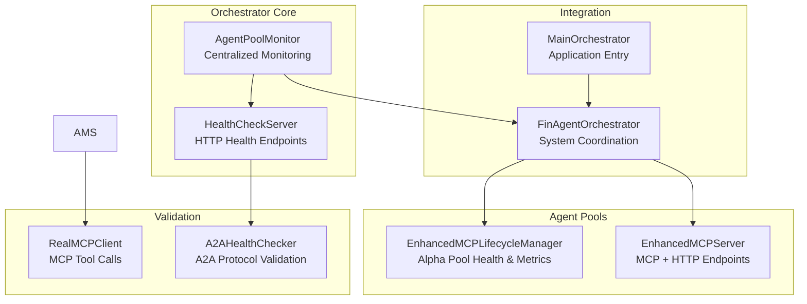
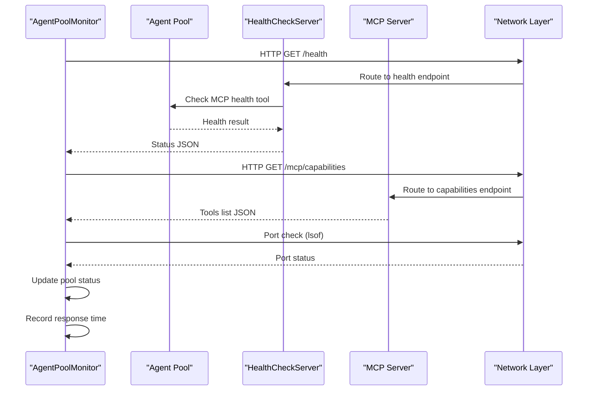
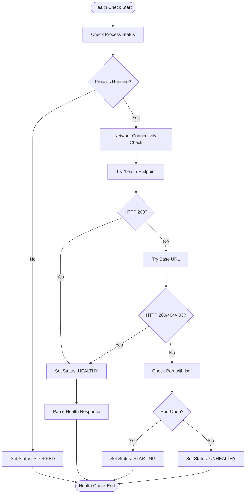
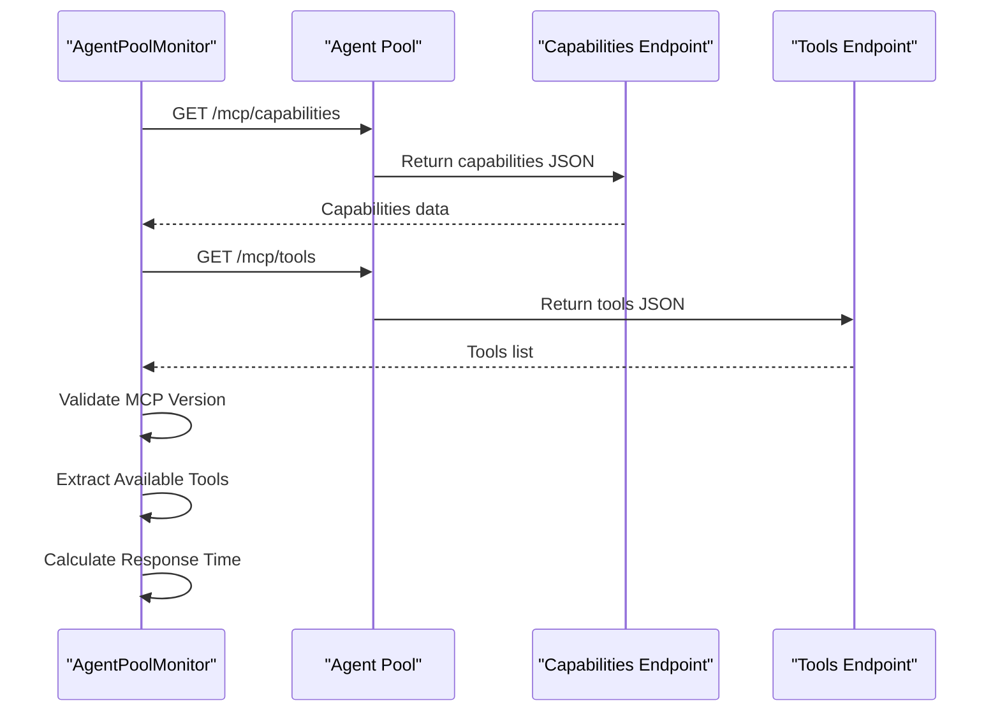
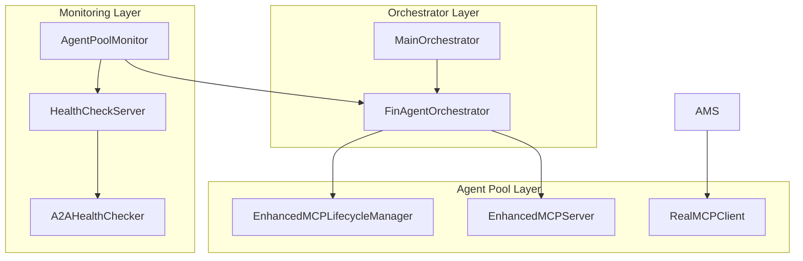

# Agent Pool Health Monitoring

<cite>
**Referenced Files in This Document**
- [agent_pool_monitor.py](file://FinAgents/orchestrator/core/agent_pool_monitor.py)
- [health_server.py](file://FinAgents/orchestrator/core/health_server.py)
- [enhanced_mcp_lifecycle.py](file://FinAgents/agent_pools/alpha_agent_pool/enhanced_mcp_lifecycle.py)
- [enhanced_mcp_server.py](file://FinAgents/agent_pools/alpha_agent_pool/enhanced_mcp_server.py)
- [real_mcp_client.py](file://FinAgents/agent_pools/alpha_agent_pool/real_mcp_client.py)
- [a2a_health_checker.py](file://FinAgents/memory/a2a_health_checker.py)
- [finagent_orchestrator.py](file://FinAgents/orchestrator/core/finagent_orchestrator.py)
- [main_orchestrator.py](file://FinAgents/orchestrator/main_orchestrator.py)
</cite>

## Table of Contents
1. [Introduction](#introduction)
2. [Project Structure](#project-structure)
3. [Core Components](#core-components)
4. [Architecture Overview](#architecture-overview)
5. [Detailed Component Analysis](#detailed-component-analysis)
6. [Dependency Analysis](#dependency-analysis)
7. [Performance Considerations](#performance-considerations)
8. [Troubleshooting Guide](#troubleshooting-guide)
9. [Conclusion](#conclusion)

## Introduction
This document provides comprehensive documentation for the agent pool health monitoring system in the FinAgent ecosystem. It focuses on the AgentPoolMonitor class implementation, covering pool status tracking (healthy, starting, unhealthy, stopped, error), health check mechanisms, automatic failover capabilities, MCP protocol validation, network connectivity checks, and process lifecycle management. It also explains health check intervals, response time monitoring, error handling strategies, examples of pool registration, status updates, troubleshooting failed connections, health server integration, and system status reporting mechanisms.

## Project Structure
The agent pool health monitoring system spans several modules:
- Orchestrator core: AgentPoolMonitor for centralized monitoring and lifecycle management
- Health server: Standalone HTTP server exposing health endpoints for agent pools
- Alpha agent pool: Enhanced MCP lifecycle and server with comprehensive health tools
- Real MCP client: Demonstrates MCP protocol usage and validation
- A2A health checker: Validates A2A protocol servers using proper JSON-RPC format
- Orchestrator integration: Main orchestrator and application entry points

**Diagram sources**
- [agent_pool_monitor.py:44-527](file://FinAgents/orchestrator/core/agent_pool_monitor.py#L44-L527)
- [health_server.py:14-179](file://FinAgents/orchestrator/core/health_server.py#L14-L179)
- [enhanced_mcp_lifecycle.py:83-571](file://FinAgents/agent_pools/alpha_agent_pool/enhanced_mcp_lifecycle.py#L83-L571)
- [enhanced_mcp_server.py:22-375](file://FinAgents/agent_pools/alpha_agent_pool/enhanced_mcp_server.py#L22-L375)
- [finagent_orchestrator.py:106-800](file://FinAgents/orchestrator/core/finagent_orchestrator.py#L106-L800)
- [main_orchestrator.py:50-475](file://FinAgents/orchestrator/main_orchestrator.py#L50-L475)
- [real_mcp_client.py:14-412](file://FinAgents/agent_pools/alpha_agent_pool/real_mcp_client.py#L14-L412)
- [a2a_health_checker.py:24-335](file://FinAgents/memory/a2a_health_checker.py#L24-L335)

**Section sources**
- [agent_pool_monitor.py:1-527](file://FinAgents/orchestrator/core/agent_pool_monitor.py#L1-L527)
- [health_server.py:1-179](file://FinAgents/orchestrator/core/health_server.py#L1-L179)

## Core Components
This section details the primary components involved in agent pool health monitoring and management.

### AgentPoolMonitor
The AgentPoolMonitor class provides centralized monitoring and lifecycle management for agent pools. It tracks pool status, performs health checks, validates MCP connectivity, manages process lifecycles, and reports system status.

Key capabilities:
- Pool registration and configuration management
- Continuous health monitoring with configurable intervals
- Network connectivity validation (HTTP endpoints, base URLs, port checks)
- MCP protocol validation (capabilities and tools endpoints)
- Process lifecycle management (start, stop, restart)
- System status reporting and summaries

Status tracking:
- HEALTHY: Pool is responsive and functional
- STARTING: Pool process is starting but health endpoint not ready
- UNHEALTHY: Pool responds but indicates issues
- STOPPED: Pool process not running
- ERROR: Exception occurred during monitoring

**Section sources**
- [agent_pool_monitor.py:22-527](file://FinAgents/orchestrator/core/agent_pool_monitor.py#L22-L527)

### HealthCheckServer
The HealthCheckServer provides a standalone HTTP server for agent pool health monitoring. It exposes endpoints for health checks, MCP capabilities, and detailed status information.

Endpoints:
- /health: Basic health check with MCP tool availability detection
- /mcp/capabilities: MCP capabilities and tool listing
- /status: Detailed server status and agent endpoints

**Section sources**
- [health_server.py:14-179](file://FinAgents/orchestrator/core/health_server.py#L14-L179)

### EnhancedMCPLifecycleManager
The EnhancedMCPLifecycleManager extends FastMCP server functionality with comprehensive agent pool management, including:
- Agent state management and monitoring
- Health checking and alerting
- Resource usage tracking
- Performance metrics collection
- Graceful shutdown and recovery
- A2A protocol coordination

**Section sources**
- [enhanced_mcp_lifecycle.py:83-571](file://FinAgents/agent_pools/alpha_agent_pool/enhanced_mcp_lifecycle.py#L83-L571)

### RealMCPClient
The RealMCPClient demonstrates MCP protocol usage by calling actual server functions through MCP tools. It validates MCP functionality end-to-end.

**Section sources**
- [real_mcp_client.py:14-412](file://FinAgents/agent_pools/alpha_agent_pool/real_mcp_client.py#L14-L412)

### A2AHealthChecker
The A2AHealthChecker validates A2A protocol servers using proper JSON-RPC format instead of HTTP GET requests, preventing 405 errors and ensuring accurate health assessment.

**Section sources**
- [a2a_health_checker.py:24-335](file://FinAgents/memory/a2a_health_checker.py#L24-L335)

## Architecture Overview
The agent pool health monitoring system follows a layered architecture with clear separation of concerns:

**Diagram sources**
- [agent_pool_monitor.py:113-209](file://FinAgents/orchestrator/core/agent_pool_monitor.py#L113-L209)
- [health_server.py:29-108](file://FinAgents/orchestrator/core/health_server.py#L29-L108)
- [enhanced_mcp_lifecycle.py:321-354](file://FinAgents/agent_pools/alpha_agent_pool/enhanced_mcp_lifecycle.py#L321-L354)

The system architecture supports:
- Asynchronous health checking with configurable intervals
- Multi-layered validation (HTTP endpoints, MCP tools, port checks)
- Process lifecycle management with graceful shutdown
- Comprehensive error handling and status reporting
- Integration with orchestrator for system-wide monitoring

## Detailed Component Analysis

### AgentPoolMonitor Implementation
The AgentPoolMonitor class implements a comprehensive health monitoring solution with the following key features:

#### Pool Registration and Configuration
- Initializes pools from configuration with URL parsing and port extraction
- Supports multiple agent pools with different capabilities
- Maintains pool metadata including version, capabilities, and response times

#### Health Check Mechanisms
The health check process follows a hierarchical approach:

**Diagram sources**
- [agent_pool_monitor.py:129-209](file://FinAgents/orchestrator/core/agent_pool_monitor.py#L129-L209)

#### MCP Protocol Validation
The MCP validation process ensures protocol compliance:

**Diagram sources**
- [agent_pool_monitor.py:399-453](file://FinAgents/orchestrator/core/agent_pool_monitor.py#L399-L453)

#### Process Lifecycle Management
The lifecycle management supports:
- Starting agent pools with configurable startup timeouts
- Stopping pools with graceful termination and force kill fallback
- Restart operations with proper cleanup
- Process monitoring using psutil and system commands

**Section sources**
- [agent_pool_monitor.py:232-351](file://FinAgents/orchestrator/core/agent_pool_monitor.py#L232-L351)

### HealthCheckServer Integration
The HealthCheckServer provides standardized health endpoints for agent pools:

#### Endpoint Implementation
- `/health`: Returns health status with MCP tool availability detection
- `/mcp/capabilities`: Lists available MCP tools and capabilities
- `/status`: Provides detailed server status and agent endpoint information

#### MCP Tool Integration
The server can call agent pool health check tools directly when available, falling back to basic health checks if MCP tools are not present.

**Section sources**
- [health_server.py:29-130](file://FinAgents/orchestrator/core/health_server.py#L29-L130)

### EnhancedMCPLifecycleManager
The EnhancedMCPLifecycleManager provides advanced monitoring capabilities:

#### Agent State Management
- Tracks individual agent states (initializing, running, paused, error, stopping, stopped)
- Monitors agent health status (healthy, warning, critical, unknown)
- Records performance metrics including response times and resource usage

#### Health Monitoring Loop
- Periodic health checks with configurable intervals
- Stale agent detection based on heartbeat timestamps
- Error rate monitoring and alert generation
- Automatic critical alert management

#### Performance Tracking
- Request history with timestamps and durations
- Aggregate metrics calculation
- Memory and CPU usage monitoring
- Request recording with success/failure tracking

**Section sources**
- [enhanced_mcp_lifecycle.py:475-542](file://FinAgents/agent_pools/alpha_agent_pool/enhanced_mcp_lifecycle.py#L475-L542)

### RealMCPClient Validation
The RealMCPClient demonstrates practical MCP protocol usage:

#### Tool Call Validation
- Calls actual MCP tools through the server
- Validates tool parameters and responses
- Handles various MCP tool types (signal generation, factor discovery, strategy development)

#### End-to-End Testing
- Comprehensive test suites for MCP functionality
- Real-world scenario testing
- Error handling and recovery demonstration

**Section sources**
- [real_mcp_client.py:29-334](file://FinAgents/agent_pools/alpha_agent_pool/real_mcp_client.py#L29-L334)

## Dependency Analysis
The agent pool health monitoring system exhibits clear dependency relationships:

**Diagram sources**
- [agent_pool_monitor.py:44-527](file://FinAgents/orchestrator/core/agent_pool_monitor.py#L44-L527)
- [health_server.py:14-179](file://FinAgents/orchestrator/core/health_server.py#L14-L179)
- [enhanced_mcp_lifecycle.py:83-571](file://FinAgents/agent_pools/alpha_agent_pool/enhanced_mcp_lifecycle.py#L83-L571)
- [enhanced_mcp_server.py:22-375](file://FinAgents/agent_pools/alpha_agent_pool/enhanced_mcp_server.py#L22-L375)
- [finagent_orchestrator.py:106-800](file://FinAgents/orchestrator/core/finagent_orchestrator.py#L106-L800)
- [main_orchestrator.py:50-475](file://FinAgents/orchestrator/main_orchestrator.py#L50-L475)
- [a2a_health_checker.py:24-335](file://FinAgents/memory/a2a_health_checker.py#L24-L335)
- [real_mcp_client.py:14-412](file://FinAgents/agent_pools/alpha_agent_pool/real_mcp_client.py#L14-L412)

The dependencies show:
- Centralized monitoring (AgentPoolMonitor) depends on health endpoints
- Agent pools provide enhanced lifecycle management
- Orchestrator coordinates system-wide monitoring
- Validation clients demonstrate protocol compliance

**Section sources**
- [finagent_orchestrator.py:273-287](file://FinAgents/orchestrator/core/finagent_orchestrator.py#L273-L287)
- [main_orchestrator.py:173-187](file://FinAgents/orchestrator/main_orchestrator.py#L173-L187)

## Performance Considerations
The agent pool health monitoring system incorporates several performance optimization strategies:

### Health Check Intervals
- Configurable intervals (default 30 seconds) to balance responsiveness and resource usage
- Asynchronous health checking prevents blocking operations
- Exponential backoff for failed connections reduces load

### Response Time Monitoring
- Precise timing measurements for health checks and MCP validations
- Response time tracking for performance analysis
- Timeout management to prevent hanging operations

### Resource Management
- Process monitoring using efficient system calls (lsof)
- Graceful shutdown procedures to prevent resource leaks
- Memory-efficient status tracking and reporting

### Concurrency Patterns
- Async/await patterns for non-blocking I/O operations
- Concurrent health checks across multiple pools
- Thread pool management for heavy operations

## Troubleshooting Guide

### Common Connection Issues
1. **Port Not Accessible**: Check firewall settings and port availability
2. **Health Endpoint Failure**: Verify MCP server is running and serving endpoints
3. **MCP Protocol Errors**: Ensure proper JSON-RPC format and tool registration

### Process Management Problems
1. **Failed to Start**: Check process dependencies and configuration
2. **Unable to Stop**: Use force kill as fallback option
3. **Process Not Responding**: Monitor with system tools (psutil, lsof)

### MCP Validation Failures
1. **Capabilities Endpoint Error**: Verify MCP server initialization
2. **Tool List Failure**: Check tool registration and permissions
3. **Protocol Mismatch**: Ensure compatible MCP versions

### Health Server Integration
1. **Server Startup Issues**: Check port conflicts and permissions
2. **Background Thread Problems**: Verify event loop management
3. **Endpoint Routing**: Confirm proper route setup

**Section sources**
- [agent_pool_monitor.py:189-204](file://FinAgents/orchestrator/core/agent_pool_monitor.py#L189-L204)
- [health_server.py:132-146](file://FinAgents/orchestrator/core/health_server.py#L132-L146)
- [a2a_health_checker.py:104-118](file://FinAgents/memory/a2a_health_checker.py#L104-L118)

## Conclusion
The agent pool health monitoring system provides a comprehensive solution for managing and monitoring agent pools in the FinAgent ecosystem. Through the AgentPoolMonitor class, HealthCheckServer integration, EnhancedMCPLifecycleManager capabilities, and MCP protocol validation, the system ensures reliable operation of distributed agent pools. The architecture supports scalable monitoring, automatic failover, and detailed performance tracking while maintaining flexibility for different deployment scenarios.

Key strengths of the system include:
- Multi-layered health validation (network, MCP, process)
- Comprehensive status tracking and reporting
- Automatic lifecycle management
- Protocol-compliant validation
- Scalable architecture supporting multiple agent pools

The system provides a solid foundation for production deployments requiring robust agent pool monitoring and management capabilities.