# Model Context Protocol (MCP) Integration

<cite>
**Referenced Files in This Document**
- [mcp_interface_specification.md](file://FinAgents/agent_pools/data_agent_pool/mcp_interface_specification.md)
- [mcp_server.py](file://FinAgents/agent_pools/data_agent_pool/mcp_server.py)
- [mcp_adapter.py](file://FinAgents/agent_pools/data_agent_pool/agents/equity/mcp_adapter.py)
- [yfinance_server.py](file://FinAgents/agent_pools/data_agent_pool/agents/equity/yfinance_server.py)
- [use_yfinance_mcp.py](file://FinAgents/agent_pools/data_agent_pool/agents/equity/use_yfinance_mcp.py)
- [mcp_server.py](file://FinAgents/memory/mcp_server.py)
- [enhanced_mcp_server.py](file://FinAgents/agent_pools/alpha_agent_pool/enhanced_mcp_server.py)
- [enhanced_mcp_lifecycle.py](file://FinAgents/agent_pools/alpha_agent_pool/enhanced_mcp_lifecycle.py)
- [strategy_adapter.py](file://FinAgents/agent_pools/alpha_agent_pool/agents/adapters/mcp_client/strategy_adapter.py)
- [adapter.py](file://FinAgents/agent_pools/alpha_agent_pool/agents/adapters/mcp_server/adapter.py)
- [mcp_nl_interface.py](file://FinAgents/orchestrator/core/mcp_nl_interface.py)
- [mcp_config.yaml](file://FinAgents/agent_pools/alpha_agent_pool/mcp_config.yaml)
- [real_mcp_client.py](file://FinAgents/agent_pools/alpha_agent_pool/real_mcp_client.py)
- [core_new.py](file://FinAgents/agent_pools/data_agent_pool/core_new.py)
</cite>

## Table of Contents
1. [Introduction](#introduction)
2. [Project Structure](#project-structure)
3. [Core Components](#core-components)
4. [Architecture Overview](#architecture-overview)
5. [Detailed Component Analysis](#detailed-component-analysis)
6. [Dependency Analysis](#dependency-analysis)
7. [Performance Considerations](#performance-considerations)
8. [Troubleshooting Guide](#troubleshooting-guide)
9. [Conclusion](#conclusion)
10. [Appendices](#appendices)

## Introduction
This document explains the Model Context Protocol (MCP) integration within the agent pool system. It covers MCP specification implementation, capability negotiation, tool discovery, server setup, client configuration, bidirectional communication patterns, protocol validation, error handling, connection management, and performance monitoring for MCP-enabled agent pools. It also includes examples of MCP tool registration, capability querying, and inter-agent communication workflows.

## Project Structure
The MCP integration spans multiple agent pools and orchestrator components:
- Data Agent Pool: MCP server exposing generic agent.execute and resource endpoints, plus specialized adapters for market data.
- Alpha Agent Pool: Enhanced MCP server with HTTP endpoints and lifecycle management.
- Memory Agent Pool: Dedicated MCP server for memory operations with unified database integration.
- Orchestrator: Natural language interface that bridges MCP and agent pools.
- Clients: Adapters and real clients for resilient MCP invocation.

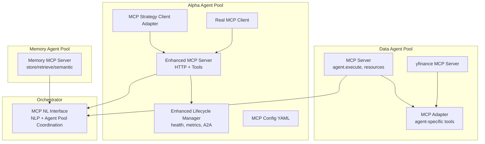

**Diagram sources**
- [mcp_server.py:1-68](file://FinAgents/agent_pools/data_agent_pool/mcp_server.py#L1-L68)
- [mcp_adapter.py:1-61](file://FinAgents/agent_pools/data_agent_pool/agents/equity/mcp_adapter.py#L1-L61)
- [yfinance_server.py:1-350](file://FinAgents/agent_pools/data_agent_pool/agents/equity/yfinance_server.py#L1-L350)
- [enhanced_mcp_server.py:1-375](file://FinAgents/agent_pools/alpha_agent_pool/enhanced_mcp_server.py#L1-L375)
- [enhanced_mcp_lifecycle.py:1-619](file://FinAgents/agent_pools/alpha_agent_pool/enhanced_mcp_lifecycle.py#L1-L619)
- [strategy_adapter.py:1-202](file://FinAgents/agent_pools/alpha_agent_pool/agents/adapters/mcp_client/strategy_adapter.py#L1-L202)
- [mcp_config.yaml:1-6](file://FinAgents/agent_pools/alpha_agent_pool/mcp_config.yaml#L1-L6)
- [real_mcp_client.py:1-412](file://FinAgents/agent_pools/alpha_agent_pool/real_mcp_client.py#L1-L412)
- [mcp_server.py:1-418](file://FinAgents/memory/mcp_server.py#L1-L418)
- [mcp_nl_interface.py:1-497](file://FinAgents/orchestrator/core/mcp_nl_interface.py#L1-L497)

**Section sources**
- [mcp_server.py:1-68](file://FinAgents/agent_pools/data_agent_pool/mcp_server.py#L1-L68)
- [enhanced_mcp_server.py:1-375](file://FinAgents/agent_pools/alpha_agent_pool/enhanced_mcp_server.py#L1-L375)
- [mcp_server.py:1-418](file://FinAgents/memory/mcp_server.py#L1-L418)
- [mcp_nl_interface.py:1-497](file://FinAgents/orchestrator/core/mcp_nl_interface.py#L1-L497)

## Core Components
- Data Agent Pool MCP Server: Provides a generic agent.execute tool and resource endpoints for registration and heartbeats, backed by a registry.
- Data Agent MCP Adapter: Wraps an agent and exposes its functions as MCP tools with automatic registration.
- yfinance MCP Server: Demonstrates MCP tool/resource definitions for market data retrieval and CSV export.
- Alpha Agent Pool Enhanced MCP Server: FastAPI + FastMCP with HTTP endpoints (/tools, /health, /status, /sse) and core alpha tools.
- Alpha Agent Pool Lifecycle Manager: Agent state management, health monitoring, metrics, and A2A coordination.
- Memory MCP Server: Unified database-backed MCP server for memory operations with health and statistics.
- MCP NL Interface: Natural language bridge to agent pools with system status queries and action execution.
- MCP Client Adapters: Resilient adapters for strategy execution via MCP with retries, timeouts, and observability.
- MCP Config and Real Client: Configuration and end-to-end client for real functionality testing.

**Section sources**
- [mcp_server.py:1-68](file://FinAgents/agent_pools/data_agent_pool/mcp_server.py#L1-L68)
- [mcp_adapter.py:1-61](file://FinAgents/agent_pools/data_agent_pool/agents/equity/mcp_adapter.py#L1-L61)
- [yfinance_server.py:1-350](file://FinAgents/agent_pools/data_agent_pool/agents/equity/yfinance_server.py#L1-L350)
- [enhanced_mcp_server.py:1-375](file://FinAgents/agent_pools/alpha_agent_pool/enhanced_mcp_server.py#L1-L375)
- [enhanced_mcp_lifecycle.py:1-619](file://FinAgents/agent_pools/alpha_agent_pool/enhanced_mcp_lifecycle.py#L1-L619)
- [mcp_server.py:1-418](file://FinAgents/memory/mcp_server.py#L1-L418)
- [mcp_nl_interface.py:1-497](file://FinAgents/orchestrator/core/mcp_nl_interface.py#L1-L497)
- [strategy_adapter.py:1-202](file://FinAgents/agent_pools/alpha_agent_pool/agents/adapters/mcp_client/strategy_adapter.py#L1-L202)
- [mcp_config.yaml:1-6](file://FinAgents/agent_pools/alpha_agent_pool/mcp_config.yaml#L1-L6)
- [real_mcp_client.py:1-412](file://FinAgents/agent_pools/alpha_agent_pool/real_mcp_client.py#L1-L412)

## Architecture Overview
The MCP-enabled agent pools implement a layered architecture:
- Transport: SSE (Server-Sent Events) for streaming MCP messages; HTTP endpoints for diagnostics and tool listings.
- Protocol: JSON-RPC over MCP with tool definitions and resource URIs.
- Servers: FastMCP-based servers per pool with lifecycle and health management.
- Clients: Adapters and orchestrator clients invoking MCP tools with resilience and observability.
- Inter-Agent Communication: Through shared MCP servers and the orchestrator’s natural language interface.

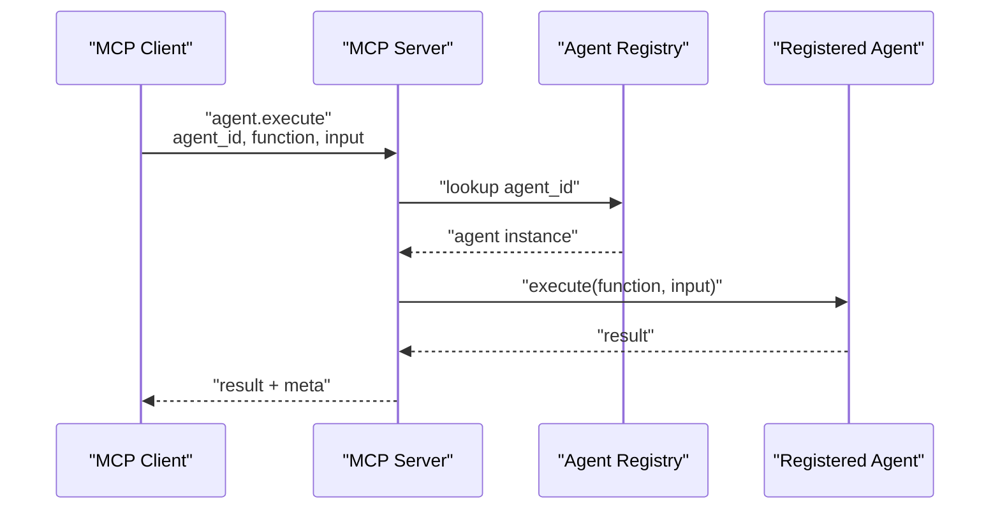

**Diagram sources**
- [mcp_server.py:17-30](file://FinAgents/agent_pools/data_agent_pool/mcp_server.py#L17-L30)

**Section sources**
- [mcp_server.py:1-68](file://FinAgents/agent_pools/data_agent_pool/mcp_server.py#L1-L68)
- [mcp_interface_specification.md:20-61](file://FinAgents/agent_pools/data_agent_pool/mcp_interface_specification.md#L20-L61)

## Detailed Component Analysis

### Data Agent Pool MCP Server
- Purpose: Generic MCP server for executing registered agents’ functions and managing agent lifecycle via resources.
- Tools and Resources:
  - Tool: agent.execute with parameters agent_id, function, input; returns result and metadata.
  - Resource: register://{agent_id} for dynamic registration.
  - Resource: heartbeat://{agent_id} for liveness tracking.
- Transport: Streamable HTTP app exported for MCP transport.

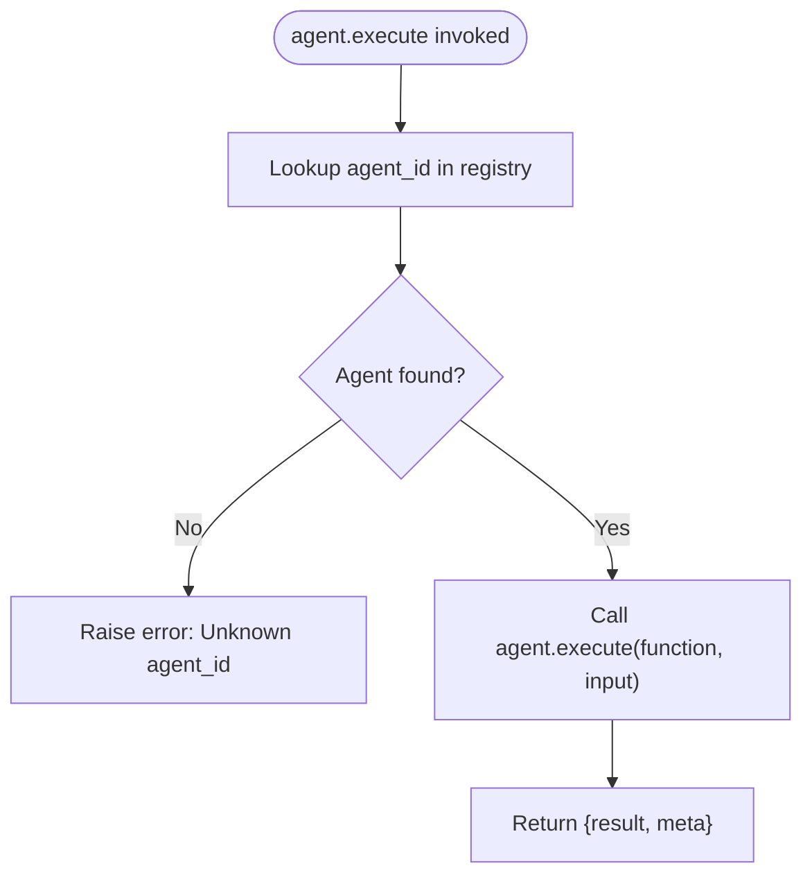

**Diagram sources**
- [mcp_server.py:17-30](file://FinAgents/agent_pools/data_agent_pool/mcp_server.py#L17-L30)

**Section sources**
- [mcp_server.py:1-68](file://FinAgents/agent_pools/data_agent_pool/mcp_server.py#L1-L68)
- [mcp_interface_specification.md:20-61](file://FinAgents/agent_pools/data_agent_pool/mcp_interface_specification.md#L20-L61)

### Data Agent MCP Adapter
- Purpose: Wrap an agent and automatically register its methods as MCP tools.
- Example Tools:
  - health_check
  - fetch_market_data(symbol, start, end, interval, force_refresh)
  - analyze_company(symbol)
  - identify_leaders(n)
  - process_intent(query) if available
- Transport: Streamable HTTP transport.

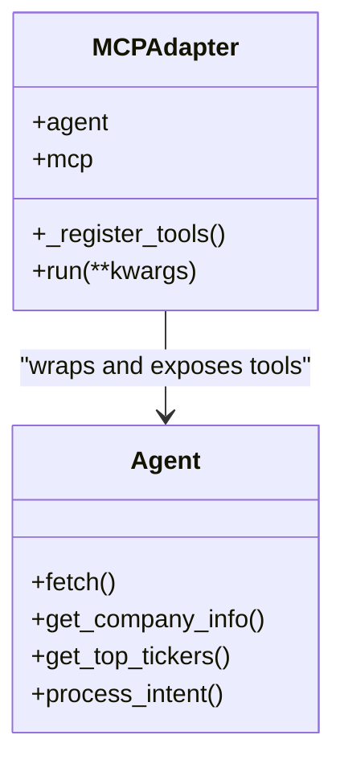

**Diagram sources**
- [mcp_adapter.py:1-61](file://FinAgents/agent_pools/data_agent_pool/agents/equity/mcp_adapter.py#L1-L61)

**Section sources**
- [mcp_adapter.py:1-61](file://FinAgents/agent_pools/data_agent_pool/agents/equity/mcp_adapter.py#L1-L61)

### yfinance MCP Server
- Purpose: Demonstrate MCP tool and resource definitions for market data retrieval and CSV export.
- Tools:
  - get_historical_data: Historical OHLCV data with optional CSV output.
  - get_stock_metric: Specific metric retrieval using yfinance field names.
- Resources: finance://{symbol}/info for reading current stock information.

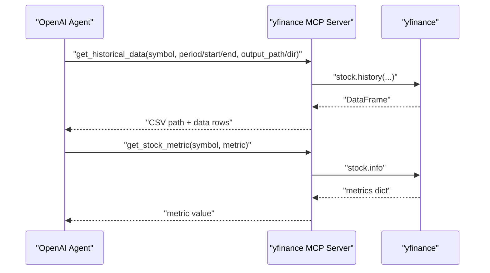

**Diagram sources**
- [yfinance_server.py:229-336](file://FinAgents/agent_pools/data_agent_pool/agents/equity/yfinance_server.py#L229-L336)
- [use_yfinance_mcp.py:94-196](file://FinAgents/agent_pools/data_agent_pool/agents/equity/use_yfinance_mcp.py#L94-L196)

**Section sources**
- [yfinance_server.py:1-350](file://FinAgents/agent_pools/data_agent_pool/agents/equity/yfinance_server.py#L1-L350)
- [use_yfinance_mcp.py:1-233](file://FinAgents/agent_pools/data_agent_pool/agents/equity/use_yfinance_mcp.py#L1-L233)

### Alpha Agent Pool Enhanced MCP Server
- Purpose: FastAPI + FastMCP server with HTTP endpoints and core alpha tools.
- HTTP Endpoints:
  - / (root): server info and available endpoints.
  - /health: health check.
  - /status: detailed status.
  - /info: server information.
  - /tools: list available MCP tools.
  - /sse: SSE endpoint for MCP transport.
- MCP Tools:
  - generate_alpha_signals, discover_alpha_factors, develop_strategy_configuration
  - run_comprehensive_backtest, submit_strategy_to_memory, run_integrated_backtest
  - validate_strategy_performance

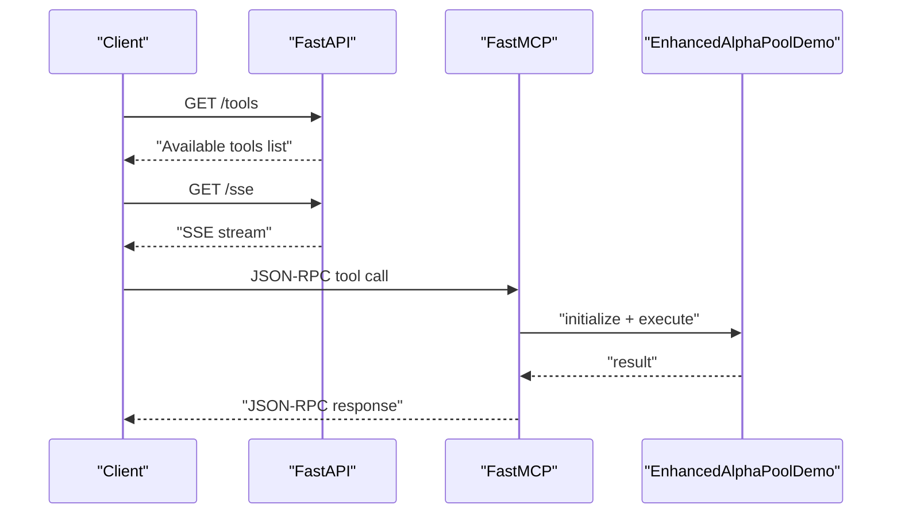

**Diagram sources**
- [enhanced_mcp_server.py:57-221](file://FinAgents/agent_pools/alpha_agent_pool/enhanced_mcp_server.py#L57-L221)
- [enhanced_mcp_server.py:222-335](file://FinAgents/agent_pools/alpha_agent_pool/enhanced_mcp_server.py#L222-L335)

**Section sources**
- [enhanced_mcp_server.py:1-375](file://FinAgents/agent_pools/alpha_agent_pool/enhanced_mcp_server.py#L1-L375)

### Alpha Agent Pool Enhanced Lifecycle Manager
- Purpose: Comprehensive lifecycle management for agent pools with health monitoring, metrics, and A2A coordination.
- Tools:
  - get_agent_status, start_agent, stop_agent, restart_agent
  - get_pool_health, get_performance_metrics, configure_agent
- Metrics: AgentMetrics and PoolMetrics for state, health, request history, and performance.

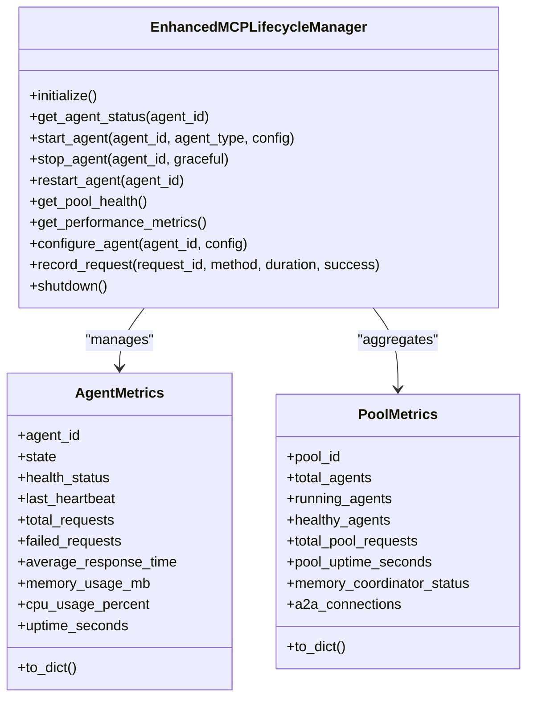

**Diagram sources**
- [enhanced_mcp_lifecycle.py:83-525](file://FinAgents/agent_pools/alpha_agent_pool/enhanced_mcp_lifecycle.py#L83-L525)

**Section sources**
- [enhanced_mcp_lifecycle.py:1-619](file://FinAgents/agent_pools/alpha_agent_pool/enhanced_mcp_lifecycle.py#L1-L619)

### Memory MCP Server
- Purpose: Dedicated MCP server for memory operations with unified database integration.
- Tools:
  - store_memory, retrieve_memory, semantic_search
  - get_statistics, health_check, create_relationship
- Endpoints:
  - /health: health status.
  - /: server info and tool list.

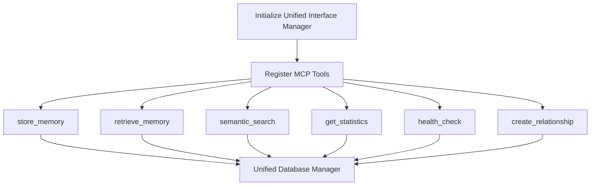

**Diagram sources**
- [mcp_server.py:114-287](file://FinAgents/memory/mcp_server.py#L114-L287)

**Section sources**
- [mcp_server.py:1-418](file://FinAgents/memory/mcp_server.py#L1-L418)

### MCP Natural Language Interface
- Purpose: Bridge natural language requests to agent pools with system status awareness and action execution.
- Tools:
  - process_natural_language, chat_with_system
  - execute_strategy_from_description, get_system_status_summary
- Behavior: Extracts agent pool endpoints, checks health, parses intents, and executes actions.

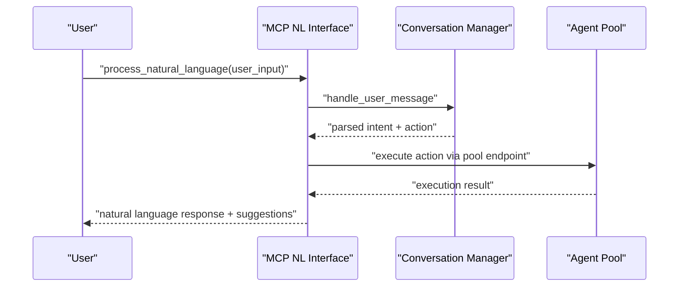

**Diagram sources**
- [mcp_nl_interface.py:59-251](file://FinAgents/orchestrator/core/mcp_nl_interface.py#L59-L251)
- [mcp_nl_interface.py:318-378](file://FinAgents/orchestrator/core/mcp_nl_interface.py#L318-L378)

**Section sources**
- [mcp_nl_interface.py:1-497](file://FinAgents/orchestrator/core/mcp_nl_interface.py#L1-L497)

### MCP Client Adapters and Real Client
- MCP Strategy Client Adapter: Resilient adapter with retry, circuit breaker, timeout, and observability for strategy execution.
- Real MCP Client: End-to-end client for real functionality testing across alpha tools.

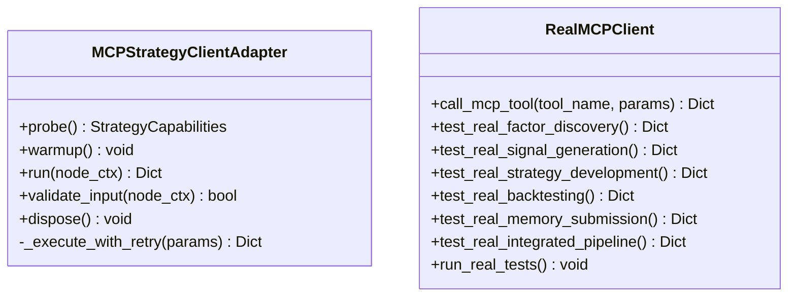

**Diagram sources**
- [strategy_adapter.py:14-202](file://FinAgents/agent_pools/alpha_agent_pool/agents/adapters/mcp_client/strategy_adapter.py#L14-L202)
- [real_mcp_client.py:14-412](file://FinAgents/agent_pools/alpha_agent_pool/real_mcp_client.py#L14-L412)

**Section sources**
- [strategy_adapter.py:1-202](file://FinAgents/agent_pools/alpha_agent_pool/agents/adapters/mcp_client/strategy_adapter.py#L1-L202)
- [real_mcp_client.py:1-412](file://FinAgents/agent_pools/alpha_agent_pool/real_mcp_client.py#L1-L412)

### MCP Configuration and Server Startup
- Configuration: MCP server URLs and transports defined in YAML.
- Server Startup: Data Agent Pool server prints registered tools and runs with SSE transport.

**Section sources**
- [mcp_config.yaml:1-6](file://FinAgents/agent_pools/alpha_agent_pool/mcp_config.yaml#L1-L6)
- [core_new.py:148-168](file://FinAgents/agent_pools/data_agent_pool/core_new.py#L148-L168)

## Dependency Analysis
- Data Agent Pool depends on a registry for agent lookup and execution.
- Alpha Agent Pool integrates FastMCP with FastAPI for HTTP and MCP transport.
- Memory MCP Server depends on unified database and interface managers.
- Orchestrator’s NL interface depends on agent pool endpoints and HTTP clients.
- Clients depend on MCP tool names and parameter schemas defined in servers.

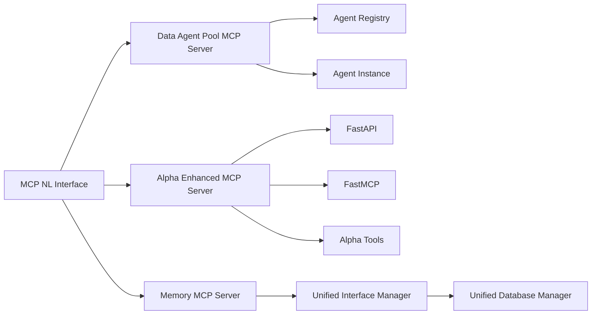

**Diagram sources**
- [mcp_server.py:1-68](file://FinAgents/agent_pools/data_agent_pool/mcp_server.py#L1-L68)
- [enhanced_mcp_server.py:1-375](file://FinAgents/agent_pools/alpha_agent_pool/enhanced_mcp_server.py#L1-L375)
- [mcp_server.py:1-418](file://FinAgents/memory/mcp_server.py#L1-L418)
- [mcp_nl_interface.py:1-497](file://FinAgents/orchestrator/core/mcp_nl_interface.py#L1-L497)

**Section sources**
- [mcp_server.py:1-68](file://FinAgents/agent_pools/data_agent_pool/mcp_server.py#L1-L68)
- [enhanced_mcp_server.py:1-375](file://FinAgents/agent_pools/alpha_agent_pool/enhanced_mcp_server.py#L1-L375)
- [mcp_server.py:1-418](file://FinAgents/memory/mcp_server.py#L1-L418)
- [mcp_nl_interface.py:1-497](file://FinAgents/orchestrator/core/mcp_nl_interface.py#L1-L497)

## Performance Considerations
- SSE Transport: Efficient for streaming MCP messages; ensure keep-alive and heartbeat handling.
- HTTP Endpoints: Use caching headers and lightweight responses for /tools and /health.
- Resilience: Implement retries, timeouts, and circuit breakers in client adapters.
- Metrics: Track request counts, durations, error rates, and agent health for proactive scaling.
- A2A Coordination: Monitor connections and memory coordinator status for cross-agent reliability.

[No sources needed since this section provides general guidance]

## Troubleshooting Guide
- Connection Issues:
  - Verify MCP server URL and transport in configuration.
  - Confirm SSE endpoint availability and CORS settings.
- Tool Not Found:
  - Use /tools endpoint to list available tools.
  - Ensure tool names match server definitions.
- Health Checks:
  - Use /health and /status endpoints for diagnostics.
  - For Memory MCP Server, use /health for database connectivity.
- Error Handling:
  - Clients should catch exceptions and return structured error responses.
  - Lifecycle manager records request history for debugging.

**Section sources**
- [mcp_config.yaml:1-6](file://FinAgents/agent_pools/alpha_agent_pool/mcp_config.yaml#L1-L6)
- [enhanced_mcp_server.py:57-116](file://FinAgents/agent_pools/alpha_agent_pool/enhanced_mcp_server.py#L57-L116)
- [mcp_server.py:298-331](file://FinAgents/memory/mcp_server.py#L298-L331)
- [strategy_adapter.py:122-158](file://FinAgents/agent_pools/alpha_agent_pool/agents/adapters/mcp_client/strategy_adapter.py#L122-L158)

## Conclusion
The MCP integration enables standardized, protocol-compliant communication across agent pools. Servers expose tools and resources, clients invoke them with resilience, and the orchestrator coordinates natural language-driven workflows. The enhanced lifecycle and memory servers provide robust monitoring and unified persistence, while SSE and HTTP transports ensure efficient bidirectional communication.

[No sources needed since this section summarizes without analyzing specific files]

## Appendices

### MCP Tool Registration Examples
- Data Agent Pool: agent.execute registered dynamically; resources for registration and heartbeat.
- Data Agent Adapter: automatic tool registration for agent functions.
- yfinance Server: tool definitions for historical data and metrics retrieval.
- Alpha Enhanced Server: core alpha tools exposed via MCP.
- Memory Server: memory operations as MCP tools.

**Section sources**
- [mcp_server.py:17-63](file://FinAgents/agent_pools/data_agent_pool/mcp_server.py#L17-L63)
- [mcp_adapter.py:13-58](file://FinAgents/agent_pools/data_agent_pool/agents/equity/mcp_adapter.py#L13-L58)
- [yfinance_server.py:65-227](file://FinAgents/agent_pools/data_agent_pool/agents/equity/yfinance_server.py#L65-L227)
- [enhanced_mcp_server.py:222-335](file://FinAgents/agent_pools/alpha_agent_pool/enhanced_mcp_server.py#L222-L335)
- [mcp_server.py:142-287](file://FinAgents/memory/mcp_server.py#L142-L287)

### Capability Querying and Discovery
- Use /tools endpoint to list available tools.
- Use /health and /status for runtime diagnostics.
- Use resource endpoints for registration and heartbeat.

**Section sources**
- [enhanced_mcp_server.py:136-199](file://FinAgents/agent_pools/alpha_agent_pool/enhanced_mcp_server.py#L136-L199)
- [mcp_server.py:35-63](file://FinAgents/agent_pools/data_agent_pool/mcp_server.py#L35-L63)

### Inter-Agent Communication Workflows
- Through shared MCP servers and orchestrator’s NL interface.
- Use agent pool endpoints to coordinate actions and status checks.

**Section sources**
- [mcp_nl_interface.py:252-317](file://FinAgents/orchestrator/core/mcp_nl_interface.py#L252-L317)

### Protocol Validation and Error Handling
- Validate tool names and parameters against server definitions.
- Implement structured error responses and logging.
- Use health endpoints to validate connectivity and readiness.

**Section sources**
- [strategy_adapter.py:122-158](file://FinAgents/agent_pools/alpha_agent_pool/agents/adapters/mcp_client/strategy_adapter.py#L122-L158)
- [mcp_server.py:298-331](file://FinAgents/memory/mcp_server.py#L298-L331)

### Connection Management and Transport
- SSE transport for MCP streaming.
- HTTP endpoints for diagnostics and tool listing.
- Unified ASGI app composition for MCP + HTTP.

**Section sources**
- [enhanced_mcp_server.py:200-221](file://FinAgents/agent_pools/alpha_agent_pool/enhanced_mcp_server.py#L200-L221)
- [mcp_server.py:349-370](file://FinAgents/memory/mcp_server.py#L349-L370)

### Performance Monitoring for MCP-Enabled Agent Pools
- Track request metrics, error rates, and agent health.
- Use lifecycle manager metrics and HTTP endpoints for visibility.
- Monitor A2A coordinator and memory connections.

**Section sources**
- [enhanced_mcp_lifecycle.py:508-542](file://FinAgents/agent_pools/alpha_agent_pool/enhanced_mcp_lifecycle.py#L508-L542)
- [enhanced_mcp_server.py:96-116](file://FinAgents/agent_pools/alpha_agent_pool/enhanced_mcp_server.py#L96-L116)