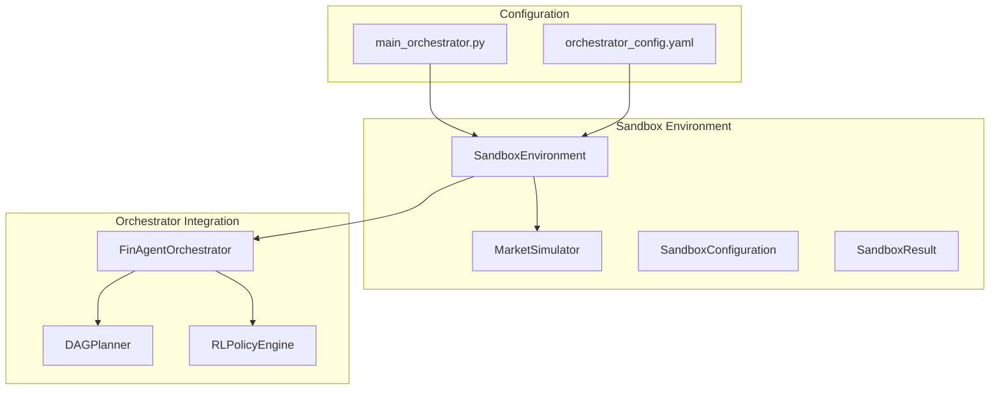
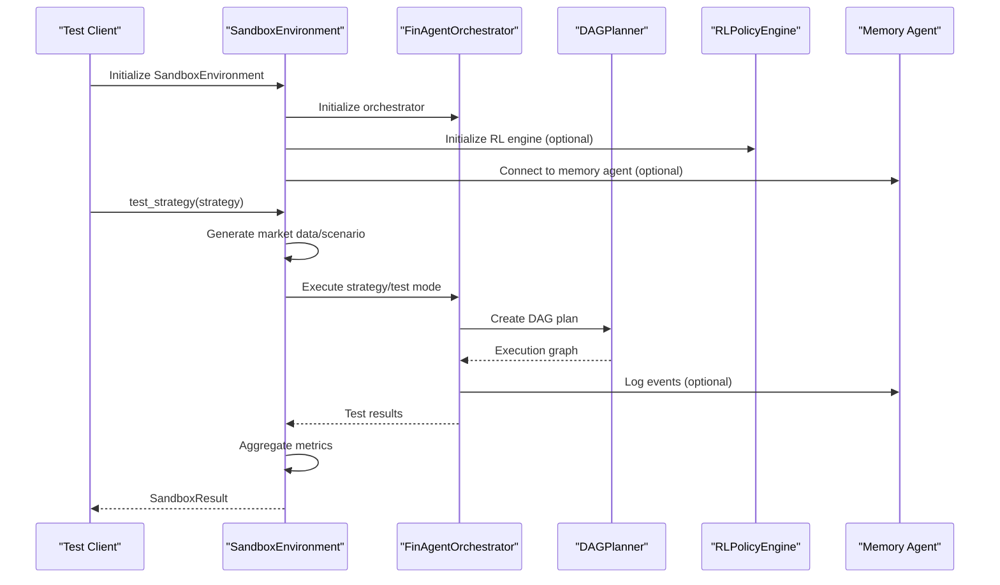
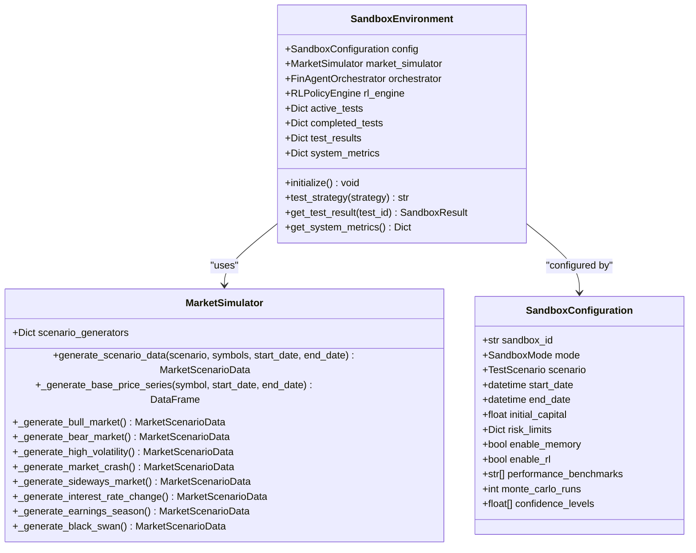
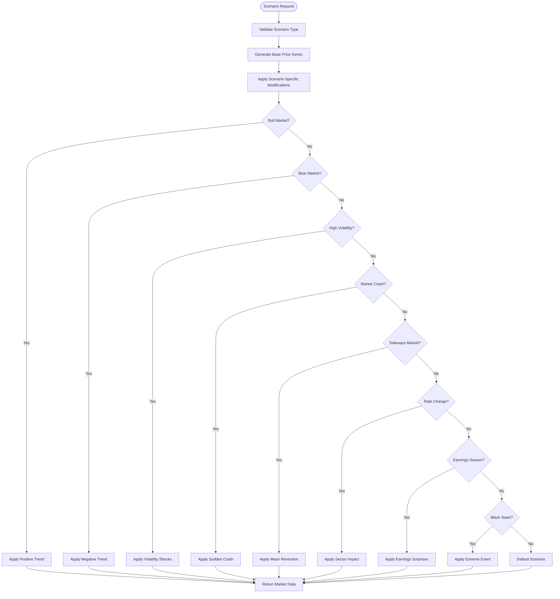
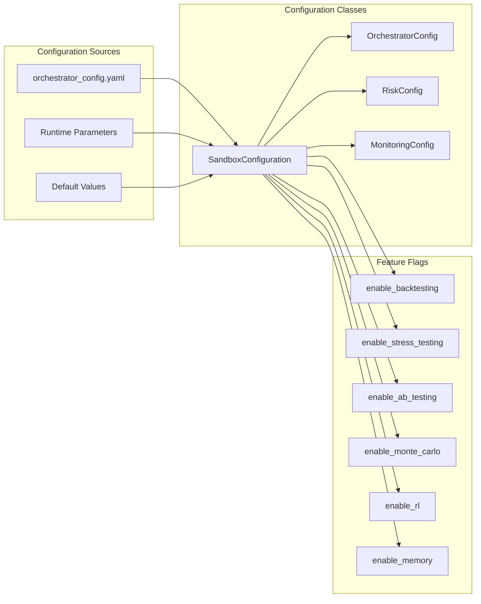
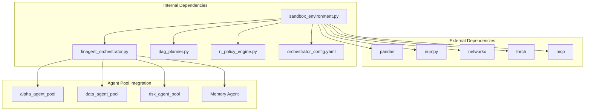

# Sandbox Environment Management

<cite>
**Referenced Files in This Document**
- [sandbox_environment.py](file://FinAgents/orchestrator/core/sandbox_environment.py)
- [finagent_orchestrator.py](file://FinAgents/orchestrator/core/finagent_orchestrator.py)
- [dag_planner.py](file://FinAgents/orchestrator/core/dag_planner.py)
- [rl_policy_engine.py](file://FinAgents/orchestrator/core/rl_policy_engine.py)
- [orchestrator_config.yaml](file://FinAgents/orchestrator/config/orchestrator_config.yaml)
- [main_orchestrator.py](file://FinAgents/orchestrator/main_orchestrator.py)
- [bootstrap.py](file://FinAgents/agent_pools/alpha_agent_pool/runtime/bootstrap.py)
</cite>

## Table of Contents
1. [Introduction](#introduction)
2. [Project Structure](#project-structure)
3. [Core Components](#core-components)
4. [Architecture Overview](#architecture-overview)
5. [Detailed Component Analysis](#detailed-component-analysis)
6. [Dependency Analysis](#dependency-analysis)
7. [Performance Considerations](#performance-considerations)
8. [Troubleshooting Guide](#troubleshooting-guide)
9. [Conclusion](#conclusion)

## Introduction
This document provides comprehensive documentation for the sandbox environment system that enables isolated testing and development of agent pools within the FinAgent ecosystem. The sandbox offers controlled environments for validating trading strategies, evaluating agent interactions, and benchmarking system performance under various market conditions. It supports multiple testing modes including historical backtesting, live simulation, stress testing, A/B testing, and Monte Carlo simulations, integrating with the orchestrator's DAG planner, RL engines, and memory systems.

## Project Structure
The sandbox environment is implemented within the orchestrator core and integrates with the broader FinAgent architecture:

**Diagram sources**
- [sandbox_environment.py:500-550](file://FinAgents/orchestrator/core/sandbox_environment.py#L500-L550)
- [finagent_orchestrator.py:106-200](file://FinAgents/orchestrator/core/finagent_orchestrator.py#L106-L200)
- [orchestrator_config.yaml:178-231](file://FinAgents/orchestrator/config/orchestrator_config.yaml#L178-L231)

**Section sources**
- [sandbox_environment.py:1-918](file://FinAgents/orchestrator/core/sandbox_environment.py#L1-L918)
- [finagent_orchestrator.py:1-800](file://FinAgents/orchestrator/core/finagent_orchestrator.py#L1-L800)
- [orchestrator_config.yaml:1-356](file://FinAgents/orchestrator/config/orchestrator_config.yaml#L1-L356)

## Core Components
The sandbox environment system comprises several key components that work together to provide comprehensive testing capabilities:

### SandboxEnvironment
The main orchestrating component that manages test lifecycle, resource allocation, and result aggregation. It initializes the orchestrator, manages test execution across different modes, and maintains system metrics.

### MarketSimulator
Generates synthetic market data and scenario-specific market conditions for testing. Supports multiple market regimes including bull markets, bear markets, high volatility, crashes, and black swan events.

### SandboxConfiguration
Defines the testing parameters including mode, scenario, time ranges, capital allocation, risk limits, and feature toggles for memory and RL integration.

### SandboxResult
Encapsulates test results including performance metrics, risk measurements, stress test outcomes, and system metrics for analysis and reporting.

**Section sources**
- [sandbox_environment.py:500-918](file://FinAgents/orchestrator/core/sandbox_environment.py#L500-L918)

## Architecture Overview
The sandbox environment architecture demonstrates tight integration with the orchestrator system and multiple testing modes:

**Diagram sources**
- [sandbox_environment.py:524-618](file://FinAgents/orchestrator/core/sandbox_environment.py#L524-L618)
- [finagent_orchestrator.py:201-224](file://FinAgents/orchestrator/core/finagent_orchestrator.py#L201-L224)
- [dag_planner.py:189-247](file://FinAgents/orchestrator/core/dag_planner.py#L189-L247)

The architecture supports multiple execution modes through a unified interface, enabling seamless switching between historical backtesting, live simulation, stress testing, A/B testing, and Monte Carlo simulations.

**Section sources**
- [sandbox_environment.py:46-118](file://FinAgents/orchestrator/core/sandbox_environment.py#L46-L118)
- [finagent_orchestrator.py:106-200](file://FinAgents/orchestrator/core/finagent_orchestrator.py#L106-L200)

## Detailed Component Analysis

### SandboxEnvironment Implementation
The SandboxEnvironment class serves as the primary controller for all sandbox operations, managing test lifecycle and coordinating with other system components.

**Diagram sources**
- [sandbox_environment.py:500-550](file://FinAgents/orchestrator/core/sandbox_environment.py#L500-L550)
- [sandbox_environment.py:120-160](file://FinAgents/orchestrator/core/sandbox_environment.py#L120-L160)
- [sandbox_environment.py:67-88](file://FinAgents/orchestrator/core/sandbox_environment.py#L67-L88)

#### Test Execution Modes
The sandbox supports five distinct testing modes, each designed for specific validation scenarios:

**Historical Backtest Mode**: Executes strategies against historical market data with comprehensive performance analysis and risk metrics calculation.

**Live Simulation Mode**: Tests strategies in simulated real-time execution environments, validating agent coordination and execution workflows.

**Stress Test Mode**: Evaluates system resilience under extreme market conditions including crashes, volatility spikes, and liquidity crises.

**A/B Test Mode**: Compares multiple strategy variants to determine optimal parameter configurations and performance differences.

**Monte Carlo Mode**: Performs statistical analysis through repeated random sampling to estimate probability distributions of outcomes.

**Section sources**
- [sandbox_environment.py:551-870](file://FinAgents/orchestrator/core/sandbox_environment.py#L551-L870)

### Market Scenario Generation
The MarketSimulator component generates realistic market conditions for testing through sophisticated scenario modeling:

**Diagram sources**
- [sandbox_environment.py:135-159](file://FinAgents/orchestrator/core/sandbox_environment.py#L135-L159)
- [sandbox_environment.py:218-497](file://FinAgents/orchestrator/core/sandbox_environment.py#L218-L497)

Each scenario type applies specific mathematical transformations to generate realistic market conditions while maintaining statistical consistency and economic plausibility.

**Section sources**
- [sandbox_environment.py:120-497](file://FinAgents/orchestrator/core/sandbox_environment.py#L120-L497)

### Configuration Management
The sandbox environment integrates with the orchestrator's configuration system to provide flexible deployment options:

**Diagram sources**
- [orchestrator_config.yaml:178-231](file://FinAgents/orchestrator/config/orchestrator_config.yaml#L178-L231)
- [sandbox_environment.py:67-88](file://FinAgents/orchestrator/core/sandbox_environment.py#L67-L88)

**Section sources**
- [orchestrator_config.yaml:178-231](file://FinAgents/orchestrator/config/orchestrator_config.yaml#L178-L231)
- [sandbox_environment.py:67-88](file://FinAgents/orchestrator/core/sandbox_environment.py#L67-L88)

## Dependency Analysis
The sandbox environment system exhibits well-defined dependencies that support modularity and maintainability:

**Diagram sources**
- [sandbox_environment.py:21-42](file://FinAgents/orchestrator/core/sandbox_environment.py#L21-L42)
- [finagent_orchestrator.py:30-48](file://FinAgents/orchestrator/core/finagent_orchestrator.py#L30-L48)
- [dag_planner.py:41-57](file://FinAgents/orchestrator/core/dag_planner.py#L41-L57)

The dependency structure ensures loose coupling between components while maintaining clear interfaces for testing and extension.

**Section sources**
- [sandbox_environment.py:21-42](file://FinAgents/orchestrator/core/sandbox_environment.py#L21-L42)
- [finagent_orchestrator.py:30-48](file://FinAgents/orchestrator/core/finagent_orchestrator.py#L30-L48)

## Performance Considerations
The sandbox environment implements several performance optimization strategies:

### Asynchronous Execution
All sandbox operations utilize asynchronous programming patterns to maximize throughput and minimize resource contention. The test execution methods are designed as coroutines that can be scheduled independently.

### Memory Management
The system employs efficient data structures for test tracking and result storage, with automatic cleanup of completed test artifacts to prevent memory leaks.

### Parallel Processing
Multiple test scenarios can be executed concurrently, leveraging Python's asyncio capabilities for optimal resource utilization.

### Resource Isolation
Each sandbox instance maintains separate state management, preventing interference between concurrent tests and ensuring reproducible results.

## Troubleshooting Guide
Common issues and their resolutions when working with the sandbox environment:

### Initialization Failures
**Problem**: Sandbox fails to initialize orchestrator components
**Solution**: Verify orchestrator configuration in YAML file and ensure all required services are available. Check network connectivity to agent pools and memory agents.

### Market Data Generation Issues
**Problem**: Synthetic market data generation produces unrealistic results
**Solution**: Review scenario parameters and adjust volatility multipliers or trend factors. Validate date ranges and ensure sufficient trading days for analysis.

### Test Execution Errors
**Problem**: Strategies fail during test execution with cryptic errors
**Solution**: Enable verbose logging to capture detailed error traces. Check agent pool availability and verify strategy parameter compatibility.

### Performance Bottlenecks
**Problem**: Sandbox tests execute slowly or consume excessive resources
**Solution**: Reduce test scope by limiting symbols or time ranges. Disable unnecessary features like RL integration for basic testing scenarios.

**Section sources**
- [sandbox_environment.py:613-617](file://FinAgents/orchestrator/core/sandbox_environment.py#L613-L617)
- [main_orchestrator.py:133-137](file://FinAgents/orchestrator/main_orchestrator.py#L133-L137)

## Conclusion
The sandbox environment system provides a comprehensive solution for isolated testing and development within the FinAgent ecosystem. Its modular architecture, extensive testing modes, and deep integration with the orchestrator system enable thorough validation of trading strategies and agent interactions. The system's flexibility allows for customization across different deployment scenarios while maintaining performance and reliability standards essential for production environments.

The sandbox environment represents a critical component in the FinAgent architecture, bridging the gap between development and production deployment through rigorous testing methodologies and comprehensive performance analysis capabilities.