# Agent System Architecture

<cite>
**Referenced Files in This Document**
- [FinAgent Orchestrator](file://FinAgents/orchestrator/core/finagent_orchestrator.py)
- [DAG Planner](file://FinAgents/orchestrator/core/dag_planner.py)
- [Agent Pool Monitor](file://FinAgents/orchestrator/core/agent_pool_monitor.py)
- [MCP Natural Language Interface](file://FinAgents/orchestrator/core/mcp_nl_interface.py)
- [Alpha Agent Pool Orchestrator](file://FinAgents/agent_pools/alpha_agent_pool/core/services/orchestrator.py)
- [Alpha Agent Pool Models](file://FinAgents/agent_pools/alpha_agent_pool/core/domain/models.py)
- [Alpha Agent Pool Planner](file://FinAgents/agent_pools/alpha_agent_pool/core/services/planner.py)
- [Alpha Agent Pool Executor](file://FinAgents/agent_pools/alpha_agent_pool/core/services/executor.py)
- [Alpha Agent Pool Registry](file://FinAgents/agent_pools/alpha_agent_pool/registry.py)
- [Risk Agent Pool](file://FinAgents/agent_pools/risk_agent_pool/core.py)
- [Data Agent Pool Main](file://FinAgents/agent_pools/data_agent_pool/main.py)
- [Data Agent Pool Registry](file://FinAgents/agent_pools/data_agent_pool/registry.py)
- [Memory A2A Server](file://FinAgents/memory/a2a_server.py)
- [Memory Interface](file://FinAgents/memory/interface.py)
</cite>

## Table of Contents
1. [Introduction](#introduction)
2. [Project Structure](#project-structure)
3. [Core Components](#core-components)
4. [Architecture Overview](#architecture-overview)
5. [Detailed Component Analysis](#detailed-component-analysis)
6. [Dependency Analysis](#dependency-analysis)
7. [Performance Considerations](#performance-considerations)
8. [Troubleshooting Guide](#troubleshooting-guide)
9. [Conclusion](#conclusion)

## Introduction
This document explains the multi-agent trading platform architecture centered around a sophisticated orchestrator that coordinates specialized agent pools for data ingestion, alpha generation, risk management, and transaction cost optimization. It details the Model Context Protocol (MCP) communication framework, agent registration and lifecycle management, task execution planning via Directed Acyclic Graphs (DAGs), memory integration patterns, state management, and fault tolerance mechanisms. The goal is to provide a comprehensive yet accessible guide for both technical and non-technical readers.

## Project Structure
The system is organized into:
- Orchestrator core: Central coordination, DAG planning, MCP integration, and backtesting
- Agent pools: Specialized domains (data, alpha, risk, transaction costs)
- Memory subsystem: Persistent knowledge graph and agent-to-agent protocol
- Frontend/backend: Web APIs and UI for monitoring and control

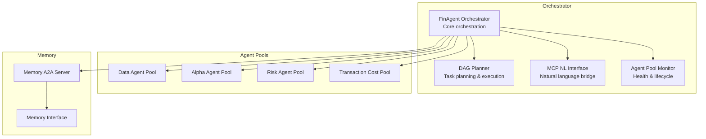

**Diagram sources**
- [FinAgent Orchestrator:106-200](file://FinAgents/orchestrator/core/finagent_orchestrator.py#L106-L200)
- [DAG Planner:189-247](file://FinAgents/orchestrator/core/dag_planner.py#L189-L247)
- [MCP Natural Language Interface:21-44](file://FinAgents/orchestrator/core/mcp_nl_interface.py#L21-L44)
- [Agent Pool Monitor:44-95](file://FinAgents/orchestrator/core/agent_pool_monitor.py#L44-L95)
- [Memory A2A Server:78-111](file://FinAgents/memory/a2a_server.py#L78-L111)

**Section sources**
- [FinAgent Orchestrator:1-200](file://FinAgents/orchestrator/core/finagent_orchestrator.py#L1-L200)
- [DAG Planner:1-120](file://FinAgents/orchestrator/core/dag_planner.py#L1-L120)
- [MCP Natural Language Interface:1-60](file://FinAgents/orchestrator/core/mcp_nl_interface.py#L1-L60)
- [Agent Pool Monitor:1-60](file://FinAgents/orchestrator/core/agent_pool_monitor.py#L1-L60)
- [Memory A2A Server:1-60](file://FinAgents/memory/a2a_server.py#L1-L60)

## Core Components
- Central orchestrator: Initializes components, registers MCP tools, manages execution contexts, logs memory events, and runs backtests.
- DAG planner: Translates strategies and natural language into executable task graphs with dependencies across agent pools.
- MCP NL interface: Bridges natural language to actionable orchestrator commands and system status reporting.
- Agent pool monitor: Validates MCP connectivity, health-checks pools, and supports lifecycle operations.
- Alpha agent pool: Synchronous intake with asynchronous execution, queue-based task orchestration, deterministic planning, and execution pipeline.
- Risk agent pool: OpenAI-integrated context decompression, agent registry, and MCP task distribution.
- Memory subsystem: A2A-compliant server with graph memory operations and MCP tool integration.

**Section sources**
- [FinAgent Orchestrator:106-200](file://FinAgents/orchestrator/core/finagent_orchestrator.py#L106-L200)
- [DAG Planner:189-247](file://FinAgents/orchestrator/core/dag_planner.py#L189-L247)
- [MCP Natural Language Interface:21-44](file://FinAgents/orchestrator/core/mcp_nl_interface.py#L21-L44)
- [Agent Pool Monitor:44-95](file://FinAgents/orchestrator/core/agent_pool_monitor.py#L44-L95)
- [Alpha Agent Pool Orchestrator:13-66](file://FinAgents/agent_pools/alpha_agent_pool/core/services/orchestrator.py#L13-L66)
- [Risk Agent Pool:137-188](file://FinAgents/agent_pools/risk_agent_pool/core.py#L137-L188)
- [Memory A2A Server:78-111](file://FinAgents/memory/a2a_server.py#L78-L111)

## Architecture Overview
The orchestrator coordinates four primary agent pools and integrates memory for learning and persistence. MCP serves as the backbone for inter-agent communication, enabling natural language-driven workflows and standardized tool invocation.

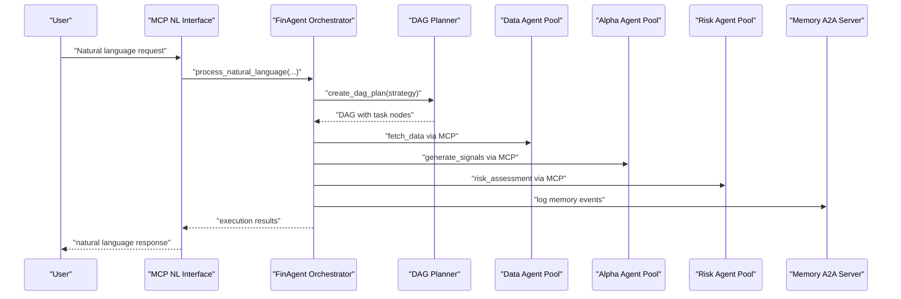

**Diagram sources**
- [MCP Natural Language Interface:62-118](file://FinAgents/orchestrator/core/mcp_nl_interface.py#L62-L118)
- [FinAgent Orchestrator:288-351](file://FinAgents/orchestrator/core/finagent_orchestrator.py#L288-L351)
- [DAG Planner:396-476](file://FinAgents/orchestrator/core/dag_planner.py#L396-L476)
- [Memory A2A Server:228-285](file://FinAgents/memory/a2a_server.py#L228-L285)

## Detailed Component Analysis

### Central Orchestrator
The orchestrator initializes the MCP server, maintains agent pool connections, tracks execution contexts, and exposes tools for strategy execution, backtesting, and status reporting. It integrates memory logging and monitors pool health.

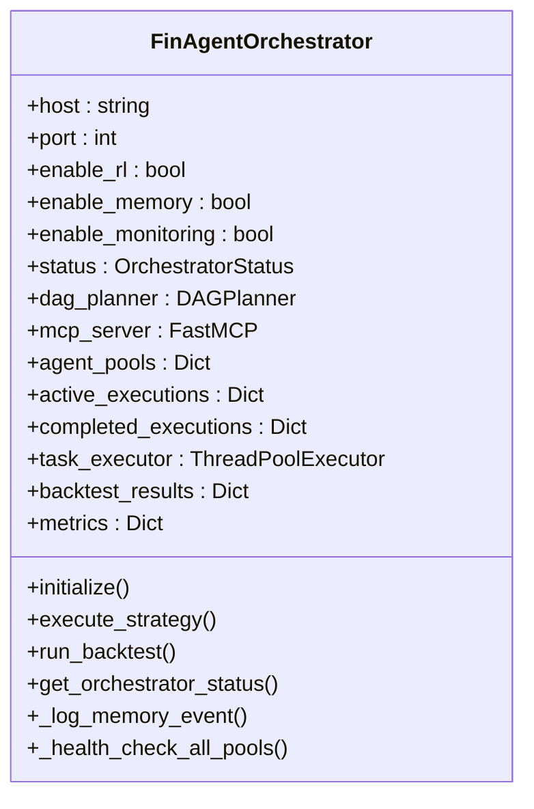

**Diagram sources**
- [FinAgent Orchestrator:106-200](file://FinAgents/orchestrator/core/finagent_orchestrator.py#L106-L200)

**Section sources**
- [FinAgent Orchestrator:106-200](file://FinAgents/orchestrator/core/finagent_orchestrator.py#L106-L200)
- [FinAgent Orchestrator:201-287](file://FinAgents/orchestrator/core/finagent_orchestrator.py#L201-L287)
- [FinAgent Orchestrator:288-441](file://FinAgents/orchestrator/core/finagent_orchestrator.py#L288-L441)

### DAG Planner and Task Execution
The DAG planner transforms strategies and natural language into executable task graphs. It defines task nodes, agent pool types, and status transitions, enabling coordinated execution across pools with memory and LLM enhancements.

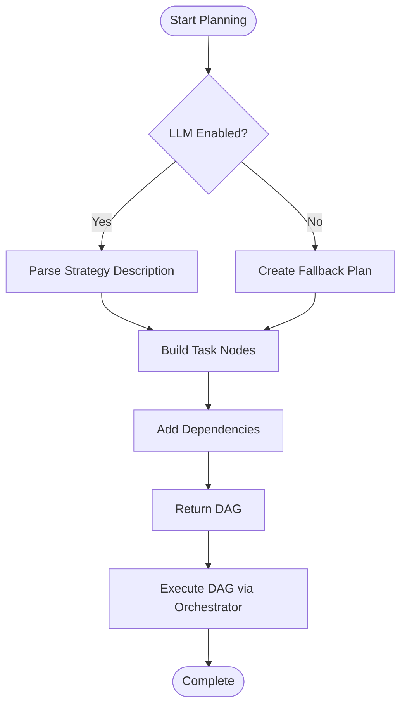

**Diagram sources**
- [DAG Planner:286-322](file://FinAgents/orchestrator/core/dag_planner.py#L286-L322)
- [DAG Planner:396-476](file://FinAgents/orchestrator/core/dag_planner.py#L396-L476)

**Section sources**
- [DAG Planner:189-247](file://FinAgents/orchestrator/core/dag_planner.py#L189-L247)
- [DAG Planner:286-322](file://FinAgents/orchestrator/core/dag_planner.py#L286-L322)
- [DAG Planner:396-476](file://FinAgents/orchestrator/core/dag_planner.py#L396-L476)

### Agent Pool Architecture
- Data Agent Pool: Registers and loads multiple providers (crypto, equities, news) with configuration-driven loading and optional MCP server startup.
- Alpha Agent Pool: Queue-based synchronous intake with an asynchronous worker, deterministic planning, and execution pipeline.
- Risk Agent Pool: OpenAI-powered context decompression, agent registry, and MCP task distribution for risk analysis.
- Transaction Cost Pool: Specialized for pre/post-trade analytics, venue analysis, and optimization.

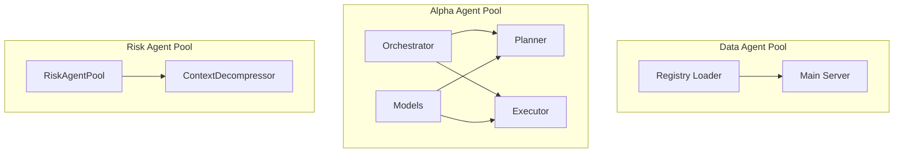

**Diagram sources**
- [Data Agent Pool Registry:89-141](file://FinAgents/agent_pools/data_agent_pool/registry.py#L89-L141)
- [Data Agent Pool Main:1-6](file://FinAgents/agent_pools/data_agent_pool/main.py#L1-L6)
- [Alpha Agent Pool Orchestrator:13-66](file://FinAgents/agent_pools/alpha_agent_pool/core/services/orchestrator.py#L13-L66)
- [Alpha Agent Pool Planner:9-51](file://FinAgents/agent_pools/alpha_agent_pool/core/services/planner.py#L9-L51)
- [Alpha Agent Pool Executor:12-63](file://FinAgents/agent_pools/alpha_agent_pool/core/services/executor.py#L12-L63)
- [Alpha Agent Pool Models:7-70](file://FinAgents/agent_pools/alpha_agent_pool/core/domain/models.py#L7-L70)
- [Risk Agent Pool:137-188](file://FinAgents/agent_pools/risk_agent_pool/core.py#L137-L188)

**Section sources**
- [Data Agent Pool Registry:89-141](file://FinAgents/agent_pools/data_agent_pool/registry.py#L89-L141)
- [Data Agent Pool Main:1-6](file://FinAgents/agent_pools/data_agent_pool/main.py#L1-L6)
- [Alpha Agent Pool Orchestrator:13-66](file://FinAgents/agent_pools/alpha_agent_pool/core/services/orchestrator.py#L13-L66)
- [Alpha Agent Pool Planner:9-51](file://FinAgents/agent_pools/alpha_agent_pool/core/services/planner.py#L9-L51)
- [Alpha Agent Pool Executor:12-63](file://FinAgents/agent_pools/alpha_agent_pool/core/services/executor.py#L12-L63)
- [Alpha Agent Pool Models:7-70](file://FinAgents/agent_pools/alpha_agent_pool/core/domain/models.py#L7-L70)
- [Risk Agent Pool:137-188](file://FinAgents/agent_pools/risk_agent_pool/core.py#L137-L188)

### MCP Communication Framework
MCP enables standardized tool invocation across pools and the orchestrator. The NL interface parses natural language and routes actions to orchestrator endpoints, while the orchestrator validates pool health and executes tasks.

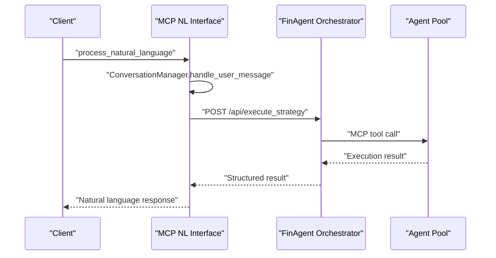

**Diagram sources**
- [MCP Natural Language Interface:62-118](file://FinAgents/orchestrator/core/mcp_nl_interface.py#L62-L118)
- [FinAgent Orchestrator:288-351](file://FinAgents/orchestrator/core/finagent_orchestrator.py#L288-L351)

**Section sources**
- [MCP Natural Language Interface:21-44](file://FinAgents/orchestrator/core/mcp_nl_interface.py#L21-L44)
- [FinAgent Orchestrator:288-351](file://FinAgents/orchestrator/core/finagent_orchestrator.py#L288-L351)

### Memory Integration Patterns
The memory subsystem provides persistent knowledge via a graph database and A2A protocol. The orchestrator logs memory events, and the MCP client demonstrates tool-based memory operations.

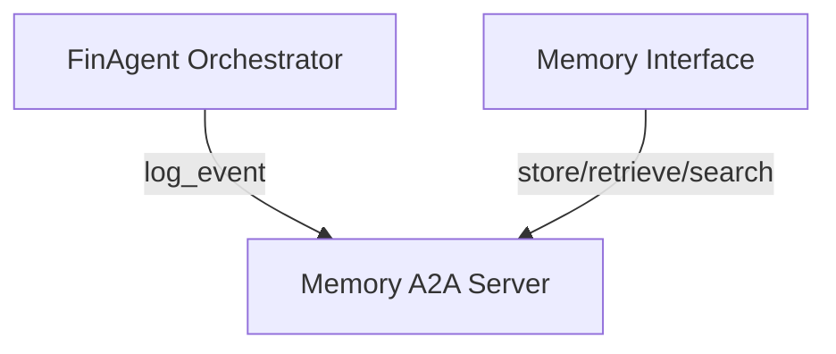

**Diagram sources**
- [FinAgent Orchestrator:239-272](file://FinAgents/orchestrator/core/finagent_orchestrator.py#L239-L272)
- [Memory A2A Server:78-111](file://FinAgents/memory/a2a_server.py#L78-L111)
- [Memory Interface:26-150](file://FinAgents/memory/interface.py#L26-L150)

**Section sources**
- [FinAgent Orchestrator:239-272](file://FinAgents/orchestrator/core/finagent_orchestrator.py#L239-L272)
- [Memory A2A Server:78-111](file://FinAgents/memory/a2a_server.py#L78-L111)
- [Memory Interface:26-150](file://FinAgents/memory/interface.py#L26-L150)

### Agent Registration and Lifecycle Management
- Data Agent Pool: Preloads agents from configs and optionally starts MCP servers per agent.
- Alpha Agent Pool: Minimal registry and configuration loader for agent mounting.
- Risk Agent Pool: Context decompressor and agent registry with OpenAI integration.

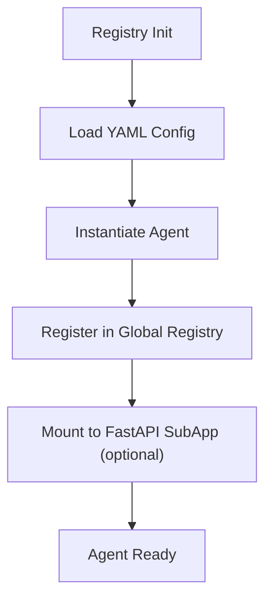

**Diagram sources**
- [Data Agent Pool Registry:89-141](file://FinAgents/agent_pools/data_agent_pool/registry.py#L89-L141)
- [Alpha Agent Pool Registry:30-55](file://FinAgents/agent_pools/alpha_agent_pool/registry.py#L30-L55)
- [Risk Agent Pool:189-206](file://FinAgents/agent_pools/risk_agent_pool/core.py#L189-L206)

**Section sources**
- [Data Agent Pool Registry:89-141](file://FinAgents/agent_pools/data_agent_pool/registry.py#L89-L141)
- [Alpha Agent Pool Registry:30-55](file://FinAgents/agent_pools/alpha_agent_pool/registry.py#L30-L55)
- [Risk Agent Pool:189-206](file://FinAgents/agent_pools/risk_agent_pool/core.py#L189-L206)

### Task Execution Planning
The Alpha agent pool demonstrates deterministic planning and execution:
- Planner constructs a DAG from task features and strategy parameters.
- Executor dispatches nodes to feature, strategy, and validation ports.
- Results aggregated into a unified signal format.

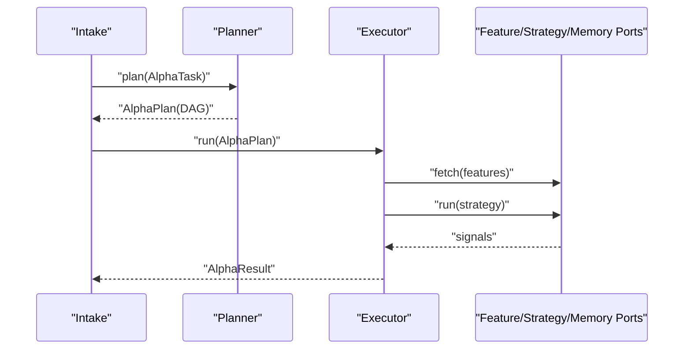

**Diagram sources**
- [Alpha Agent Pool Planner:12-49](file://FinAgents/agent_pools/alpha_agent_pool/core/services/planner.py#L12-L49)
- [Alpha Agent Pool Executor:24-61](file://FinAgents/agent_pools/alpha_agent_pool/core/services/executor.py#L24-L61)
- [Alpha Agent Pool Models:7-70](file://FinAgents/agent_pools/alpha_agent_pool/core/domain/models.py#L7-L70)

**Section sources**
- [Alpha Agent Pool Planner:9-51](file://FinAgents/agent_pools/alpha_agent_pool/core/services/planner.py#L9-L51)
- [Alpha Agent Pool Executor:12-63](file://FinAgents/agent_pools/alpha_agent_pool/core/services/executor.py#L12-L63)
- [Alpha Agent Pool Models:7-70](file://FinAgents/agent_pools/alpha_agent_pool/core/domain/models.py#L7-L70)

### Agent Collaboration Patterns and Workflow Orchestration
Common collaboration patterns include:
- Data → Alpha → Risk → Execution loops with memory feedback
- Natural language to strategy translation via NL interface to orchestrator
- Parallel execution of independent tasks within DAG constraints
- Adaptive learning by updating memory and replanning

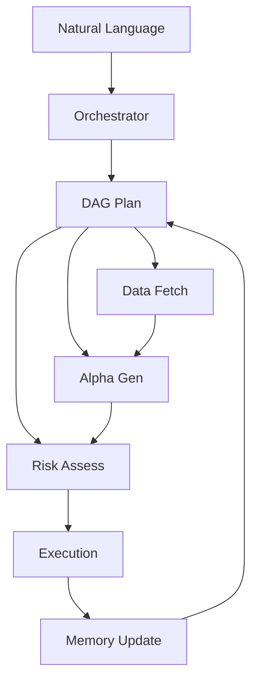

**Diagram sources**
- [MCP Natural Language Interface:162-219](file://FinAgents/orchestrator/core/mcp_nl_interface.py#L162-L219)
- [FinAgent Orchestrator:288-351](file://FinAgents/orchestrator/core/finagent_orchestrator.py#L288-L351)
- [DAG Planner:498-645](file://FinAgents/orchestrator/core/dag_planner.py#L498-L645)

**Section sources**
- [MCP Natural Language Interface:162-219](file://FinAgents/orchestrator/core/mcp_nl_interface.py#L162-L219)
- [FinAgent Orchestrator:288-351](file://FinAgents/orchestrator/core/finagent_orchestrator.py#L288-L351)
- [DAG Planner:498-645](file://FinAgents/orchestrator/core/dag_planner.py#L498-L645)

## Dependency Analysis
The orchestrator depends on MCP for inter-agent communication, DAG planning for task orchestration, and memory for persistence. Agent pools depend on their respective registries and configuration loaders. The memory subsystem integrates with graph databases and MCP tools.

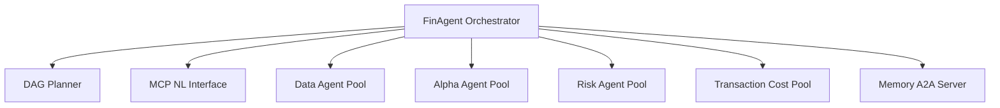

**Diagram sources**
- [FinAgent Orchestrator:106-200](file://FinAgents/orchestrator/core/finagent_orchestrator.py#L106-L200)
- [DAG Planner:189-247](file://FinAgents/orchestrator/core/dag_planner.py#L189-L247)
- [MCP Natural Language Interface:21-44](file://FinAgents/orchestrator/core/mcp_nl_interface.py#L21-L44)

**Section sources**
- [FinAgent Orchestrator:106-200](file://FinAgents/orchestrator/core/finagent_orchestrator.py#L106-L200)
- [DAG Planner:189-247](file://FinAgents/orchestrator/core/dag_planner.py#L189-L247)
- [MCP Natural Language Interface:21-44](file://FinAgents/orchestrator/core/mcp_nl_interface.py#L21-L44)

## Performance Considerations
- Asynchronous execution: Use asyncio for I/O-bound tasks and MCP sessions to minimize latency.
- Concurrency controls: ThreadPoolExecutor and asyncio gather for parallel task execution.
- Backpressure and retries: Implement retry policies and circuit breakers at pool boundaries.
- Memory efficiency: Batch memory operations and prune stale entries periodically.
- Monitoring: Track pool health, response times, and execution metrics for proactive scaling.

## Troubleshooting Guide
- MCP connectivity: Use the agent pool monitor to validate endpoints and capabilities.
- Memory availability: Confirm memory agent initialization and database health checks.
- Strategy execution: Inspect orchestrator logs for tool invocation errors and memory event attribution.
- Pool lifecycle: Restart unhealthy pools and verify SSE endpoints for MCP services.

**Section sources**
- [Agent Pool Monitor:399-454](file://FinAgents/orchestrator/core/agent_pool_monitor.py#L399-L454)
- [FinAgent Orchestrator:239-272](file://FinAgents/orchestrator/core/finagent_orchestrator.py#L239-L272)
- [Memory A2A Server:342-370](file://FinAgents/memory/a2a_server.py#L342-L370)

## Conclusion
The multi-agent trading platform leverages MCP for standardized inter-agent communication, DAG planning for precise task orchestration, and memory for persistent learning. The central orchestrator coordinates specialized pools, manages lifecycles, and ensures fault tolerance through health checks and logging. This architecture supports scalable collaboration, adaptive learning, and robust execution across data, alpha, risk, and transaction cost domains.