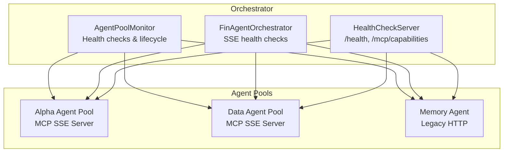
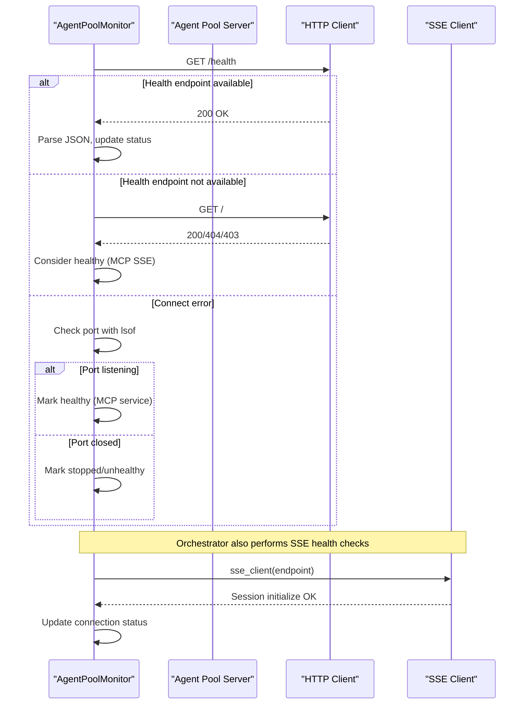
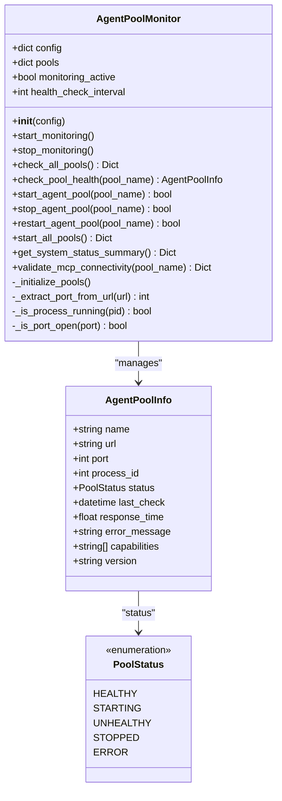
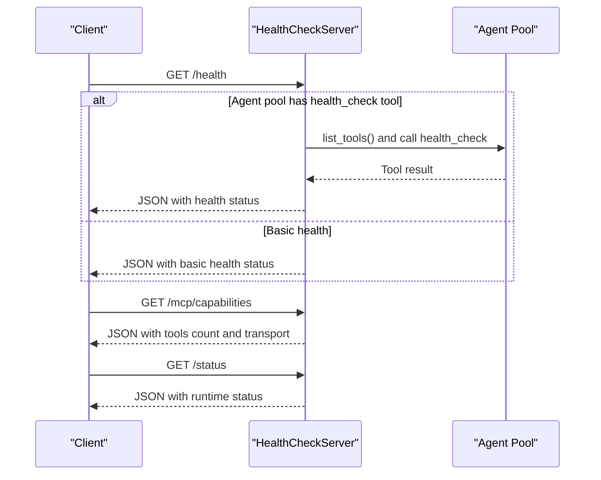
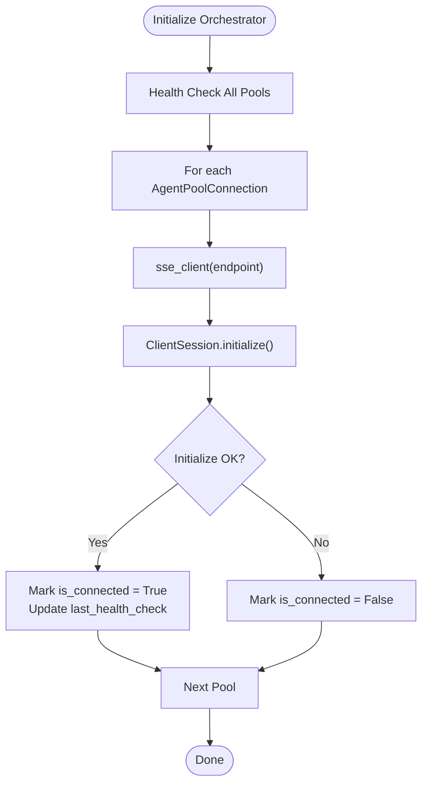
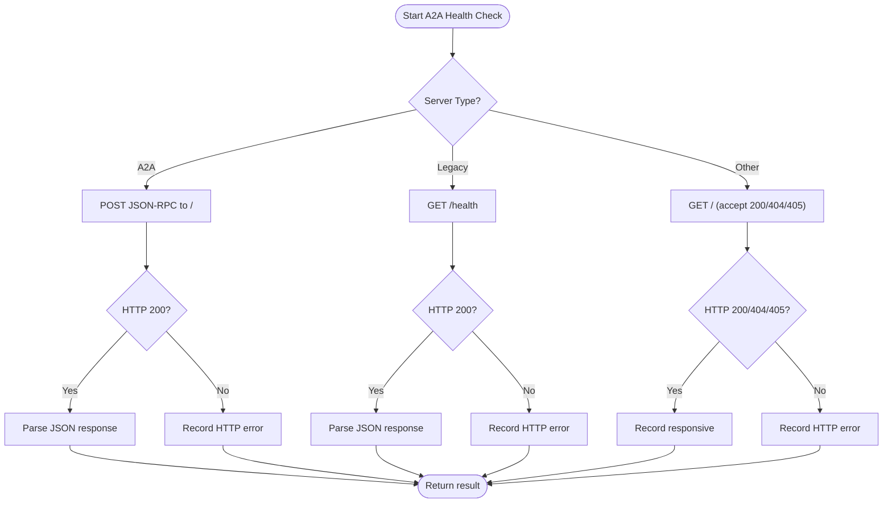
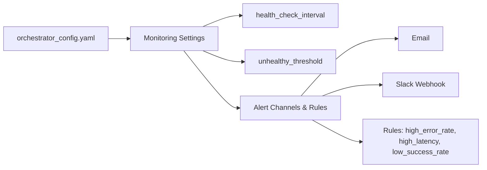
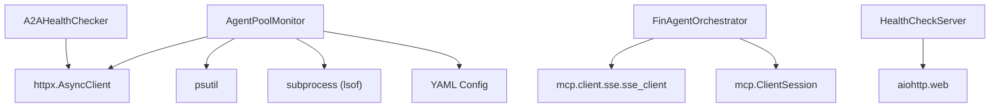

# Agent Pool Monitoring and Health Checks

<cite>
**Referenced Files in This Document**
- [agent_pool_monitor.py](file://FinAgents/orchestrator/core/agent_pool_monitor.py)
- [health_server.py](file://FinAgents/orchestrator/core/health_server.py)
- [finagent_orchestrator.py](file://FinAgents/orchestrator/core/finagent_orchestrator.py)
- [orchestrator_config.yaml](file://FinAgents/orchestrator/config/orchestrator_config.yaml)
- [a2a_health_checker.py](file://FinAgents/memory/a2a_health_checker.py)
- [core.py](file://FinAgents/agent_pools/alpha_agent_pool/core.py)
- [core.py](file://FinAgents/agent_pools/data_agent_pool/core.py)
- [main_orchestrator.py](file://FinAgents/orchestrator/main_orchestrator.py)
</cite>

## Table of Contents
1. [Introduction](#introduction)
2. [Project Structure](#project-structure)
3. [Core Components](#core-components)
4. [Architecture Overview](#architecture-overview)
5. [Detailed Component Analysis](#detailed-component-analysis)
6. [Dependency Analysis](#dependency-analysis)
7. [Performance Considerations](#performance-considerations)
8. [Troubleshooting Guide](#troubleshooting-guide)
9. [Conclusion](#conclusion)

## Introduction
This document describes the agent pool monitoring system that ensures reliable communication and operation across all FinAgent pools. It explains the monitoring architecture, health check intervals, connection validation, and status tracking mechanisms. It documents the AgentPoolConnection data class configuration, health check implementation using SSE clients, and automatic reconnection strategies. It also covers the monitoring dashboard functionality, alerting mechanisms, and failure recovery procedures. Examples of monitoring configuration, custom health check implementations, and integration with the main orchestrator status management are included, along with performance considerations for high-frequency monitoring and scaling strategies for multiple agent pools.

## Project Structure
The monitoring system spans several modules:
- Orchestrator core monitors agent pools and integrates with SSE-based health checks
- Agent pool servers expose health endpoints and MCP capabilities
- Configuration defines monitoring intervals, alerting, and thresholds
- A dedicated A2A health checker validates A2A protocol servers

**Diagram sources**
- [agent_pool_monitor.py:44-210](file://FinAgents/orchestrator/core/agent_pool_monitor.py#L44-L210)
- [health_server.py:14-179](file://FinAgents/orchestrator/core/health_server.py#L14-L179)
- [finagent_orchestrator.py:106-287](file://FinAgents/orchestrator/core/finagent_orchestrator.py#L106-L287)

**Section sources**
- [agent_pool_monitor.py:1-527](file://FinAgents/orchestrator/core/agent_pool_monitor.py#L1-L527)
- [health_server.py:1-179](file://FinAgents/orchestrator/core/health_server.py#L1-L179)
- [finagent_orchestrator.py:106-287](file://FinAgents/orchestrator/core/finagent_orchestrator.py#L106-L287)

## Core Components
- AgentPoolMonitor: Periodic health checks, process/port validation, and lifecycle management for agent pools
- HealthCheckServer: Exposes HTTP endpoints for health, MCP capabilities, and status
- FinAgentOrchestrator: Performs SSE-based health checks against agent pools and tracks connection status
- A2AHealthChecker: Validates A2A protocol servers using JSON-RPC over HTTP
- Configuration: Defines monitoring intervals, alerting channels, thresholds, and pool endpoints

Key responsibilities:
- Continuous health monitoring with configurable intervals
- Process and port verification alongside HTTP/SSE connectivity
- Automatic restart and recovery actions
- Integration with orchestrator status reporting and alerting

**Section sources**
- [agent_pool_monitor.py:44-351](file://FinAgents/orchestrator/core/agent_pool_monitor.py#L44-L351)
- [health_server.py:14-179](file://FinAgents/orchestrator/core/health_server.py#L14-L179)
- [finagent_orchestrator.py:64-163](file://FinAgents/orchestrator/core/finagent_orchestrator.py#L64-L163)
- [a2a_health_checker.py:24-120](file://FinAgents/memory/a2a_health_checker.py#L24-L120)
- [orchestrator_config.yaml:258-292](file://FinAgents/orchestrator/config/orchestrator_config.yaml#L258-L292)

## Architecture Overview
The monitoring architecture combines periodic polling, SSE-based health checks, and HTTP endpoints to validate agent pool connectivity and capabilities.

**Diagram sources**
- [agent_pool_monitor.py:113-209](file://FinAgents/orchestrator/core/agent_pool_monitor.py#L113-L209)
- [finagent_orchestrator.py:273-286](file://FinAgents/orchestrator/core/finagent_orchestrator.py#L273-L286)

## Detailed Component Analysis

### AgentPoolMonitor
The AgentPoolMonitor class provides:
- Pool registration and configuration from YAML
- Health check scheduling with configurable intervals
- Process and port validation
- HTTP-based health checks with fallback to SSE base URL and port checks
- Lifecycle management: start, stop, restart agent pools
- System status summary and MCP connectivity validation

**Diagram sources**
- [agent_pool_monitor.py:22-551](file://FinAgents/orchestrator/core/agent_pool_monitor.py#L22-L551)

**Section sources**
- [agent_pool_monitor.py:44-351](file://FinAgents/orchestrator/core/agent_pool_monitor.py#L44-L351)

### HealthCheckServer
The HealthCheckServer exposes:
- /health: MCP-aware health check with optional MCP tool invocation
- /mcp/capabilities: Lists MCP tools and transport info
- /status: Runtime status with agent endpoints

**Diagram sources**
- [health_server.py:29-130](file://FinAgents/orchestrator/core/health_server.py#L29-L130)

**Section sources**
- [health_server.py:14-179](file://FinAgents/orchestrator/core/health_server.py#L14-L179)

### FinAgentOrchestrator SSE Health Checks
The orchestrator performs SSE-based health checks against agent pools using MCP SSE clients. It tracks connection status and last health check timestamps per pool.

**Diagram sources**
- [finagent_orchestrator.py:273-286](file://FinAgents/orchestrator/core/finagent_orchestrator.py#L273-L286)

**Section sources**
- [finagent_orchestrator.py:64-163](file://FinAgents/orchestrator/core/finagent_orchestrator.py#L64-L163)
- [finagent_orchestrator.py:273-286](file://FinAgents/orchestrator/core/finagent_orchestrator.py#L273-L286)

### A2A Health Checker
The A2AHealthChecker validates A2A protocol servers using JSON-RPC over HTTP, with fallbacks for legacy memory servers and basic connectivity checks.

**Diagram sources**
- [a2a_health_checker.py:34-286](file://FinAgents/memory/a2a_health_checker.py#L34-L286)

**Section sources**
- [a2a_health_checker.py:24-286](file://FinAgents/memory/a2a_health_checker.py#L24-L286)

### Monitoring Configuration and Alerting
Configuration supports:
- Monitoring enablement and Prometheus/Grafana ports
- Health check intervals and unhealthy thresholds
- Alert channels (email, Slack) and alert rules (error rate, latency, success rate windows)

**Diagram sources**
- [orchestrator_config.yaml:258-292](file://FinAgents/orchestrator/config/orchestrator_config.yaml#L258-L292)

**Section sources**
- [orchestrator_config.yaml:258-292](file://FinAgents/orchestrator/config/orchestrator_config.yaml#L258-L292)

### Agent Pool Integration Examples
- Alpha Agent Pool: MCP SSE server on port 8081 with health endpoints and tool registration
- Data Agent Pool: MCP SSE server on port 8001 with agent monitoring and automatic restart logic
- Memory Agent: Legacy HTTP endpoints for health and status

**Section sources**
- [core.py:477-571](file://FinAgents/agent_pools/alpha_agent_pool/core.py#L477-L571)
- [core.py:81-128](file://FinAgents/agent_pools/data_agent_pool/core.py#L81-L128)
- [health_server.py:29-130](file://FinAgents/orchestrator/core/health_server.py#L29-L130)

## Dependency Analysis
The monitoring system depends on:
- HTTP and SSE clients for connectivity validation
- Process and port checks for lifecycle management
- Configuration-driven pool registration and thresholds
- Agent pool servers exposing health and MCP capabilities

**Diagram sources**
- [agent_pool_monitor.py:6-16](file://FinAgents/orchestrator/core/agent_pool_monitor.py#L6-L16)
- [finagent_orchestrator.py:30-32](file://FinAgents/orchestrator/core/finagent_orchestrator.py#L30-L32)
- [health_server.py:9-21](file://FinAgents/orchestrator/core/health_server.py#L9-L21)
- [a2a_health_checker.py:13-32](file://FinAgents/memory/a2a_health_checker.py#L13-L32)

**Section sources**
- [agent_pool_monitor.py:6-16](file://FinAgents/orchestrator/core/agent_pool_monitor.py#L6-L16)
- [finagent_orchestrator.py:30-32](file://FinAgents/orchestrator/core/finagent_orchestrator.py#L30-L32)
- [health_server.py:9-21](file://FinAgents/orchestrator/core/health_server.py#L9-L21)
- [a2a_health_checker.py:13-32](file://FinAgents/memory/a2a_health_checker.py#L13-L32)

## Performance Considerations
- Health check intervals: Tune health_check_interval to balance responsiveness and overhead
- Concurrency: Use asynchronous HTTP clients and SSE sessions to minimize blocking
- Retry and timeout policies: Configure timeouts and retry attempts per pool to handle transient failures
- Port checks: Use lightweight port checks (lsof) to avoid expensive connection attempts
- Caching: Cache MCP capabilities and versions to reduce repeated network calls
- Scalability: For many pools, stagger startup and health checks; consider parallelism with rate limits

[No sources needed since this section provides general guidance]

## Troubleshooting Guide
Common issues and resolutions:
- Health endpoint not available: The monitor falls back to SSE base URL and port checks
- Connection failures: Verify port accessibility and process status; use process and port validators
- MCP tool validation: Use MCP capabilities and tools endpoints to confirm tool availability
- SSE initialization errors: Confirm SSE endpoints are reachable and initialize correctly
- Alert thresholds exceeded: Review alert rules and adjust thresholds based on observed behavior

**Section sources**
- [agent_pool_monitor.py:113-209](file://FinAgents/orchestrator/core/agent_pool_monitor.py#L113-L209)
- [finagent_orchestrator.py:273-286](file://FinAgents/orchestrator/core/finagent_orchestrator.py#L273-L286)
- [a2a_health_checker.py:183-253](file://FinAgents/memory/a2a_health_checker.py#L183-L253)

## Conclusion
The agent pool monitoring system provides robust health checks, lifecycle management, and integration with SSE-based and HTTP-based endpoints. It supports automatic recovery, alerting, and scalable operation across multiple agent pools. Proper configuration of intervals, thresholds, and alerting channels ensures reliable operation under varying loads and failure conditions.