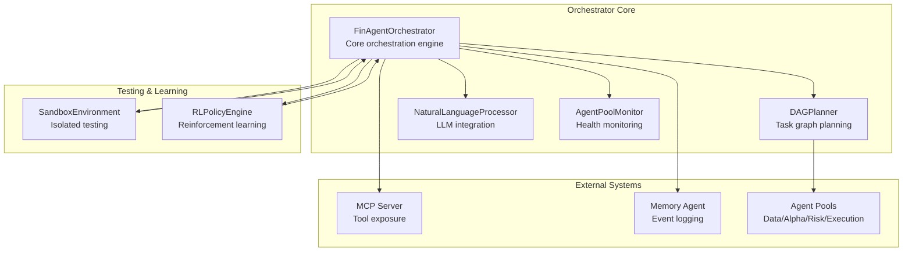
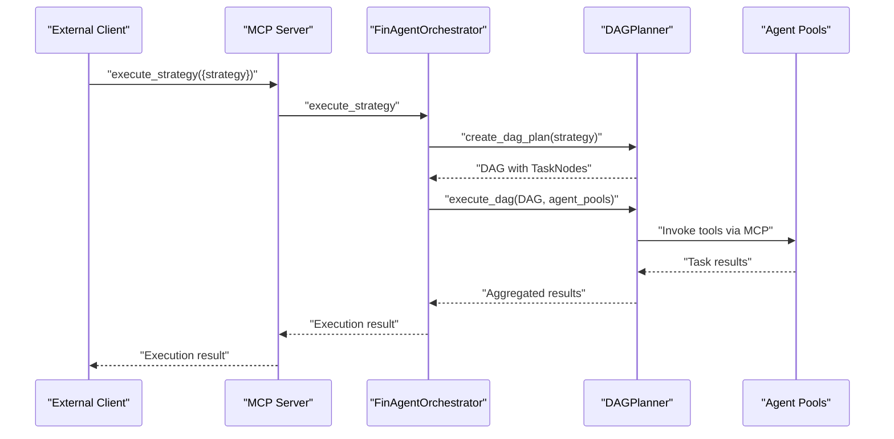
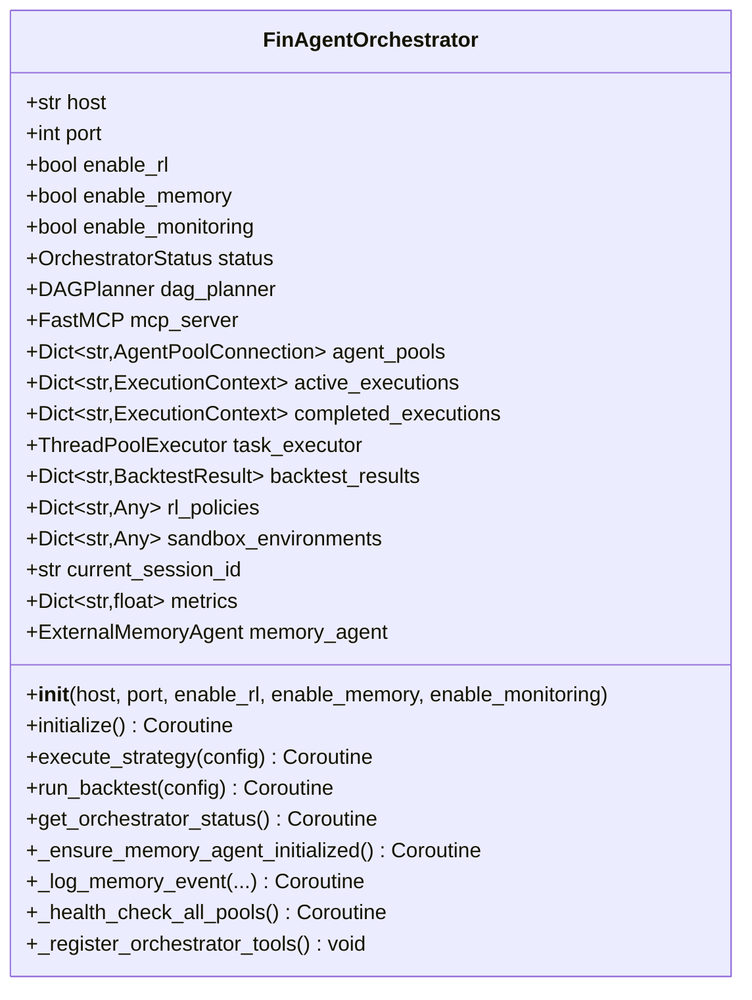
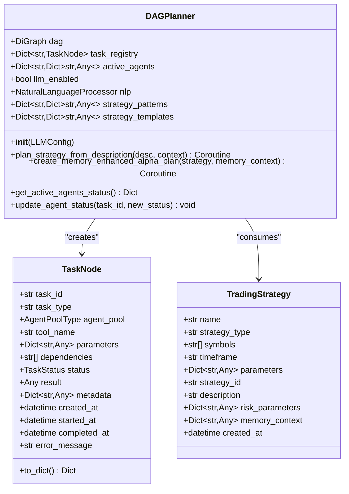
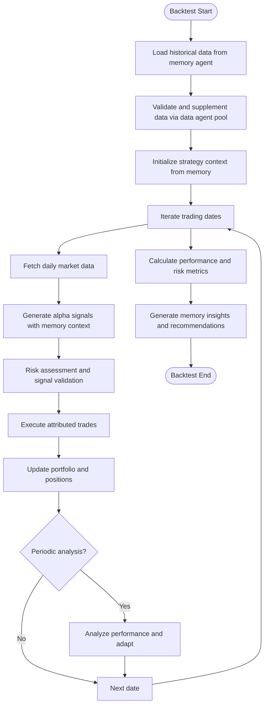
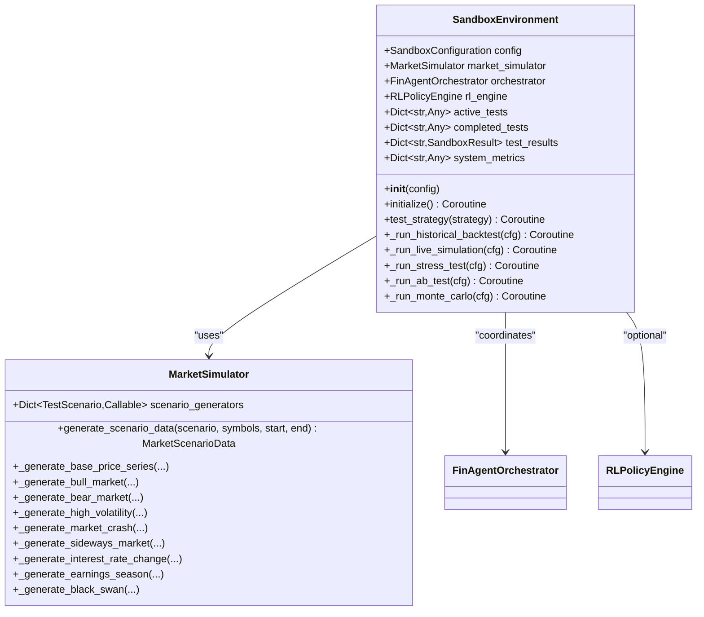
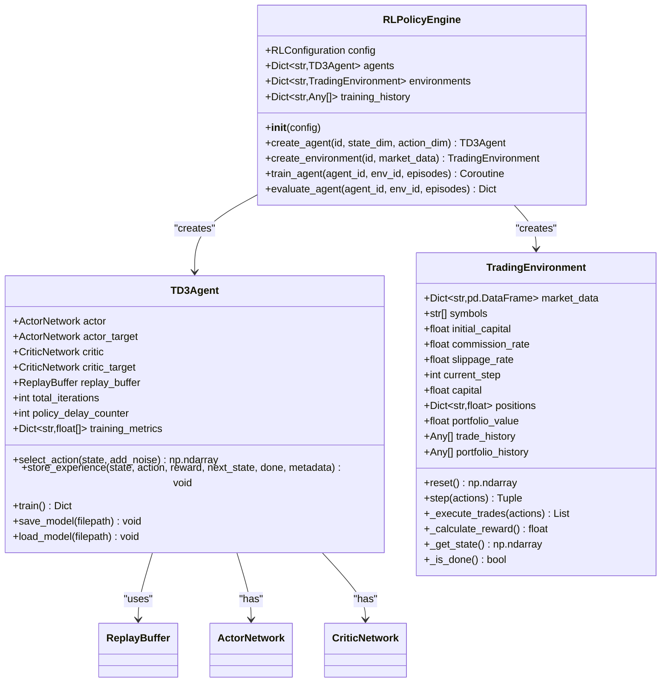
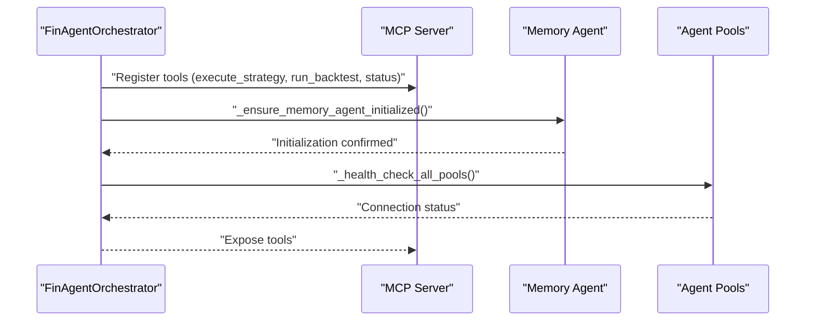
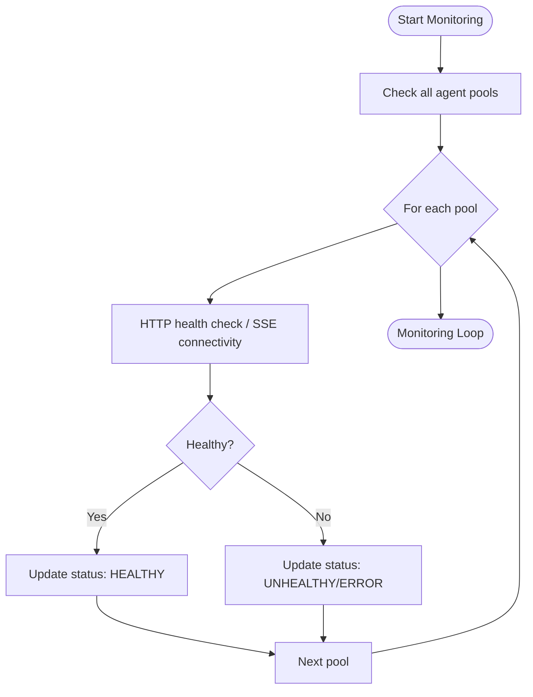
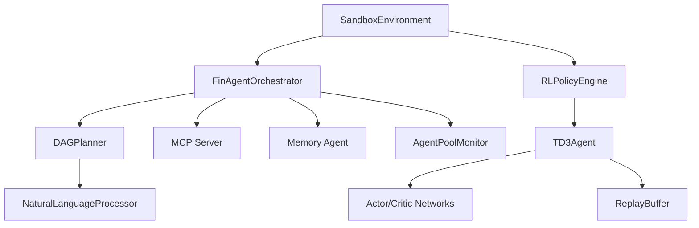

# Central Orchestrator Engine

<cite>
**Referenced Files in This Document**
- [finagent_orchestrator.py](file://FinAgents/orchestrator/core/finagent_orchestrator.py)
- [dag_planner.py](file://FinAgents/orchestrator/core/dag_planner.py)
- [sandbox_environment.py](file://FinAgents/orchestrator/core/sandbox_environment.py)
- [rl_policy_engine.py](file://FinAgents/orchestrator/core/rl_policy_engine.py)
- [main_orchestrator.py](file://FinAgents/orchestrator/main_orchestrator.py)
- [llm_integration.py](file://FinAgents/orchestrator/core/llm_integration.py)
- [agent_pool_monitor.py](file://FinAgents/orchestrator/core/agent_pool_monitor.py)
- [orchestrator_config.yaml](file://FinAgents/orchestrator/config/orchestrator_config.yaml)
</cite>

## Table of Contents
1. [Introduction](#introduction)
2. [Project Structure](#project-structure)
3. [Core Components](#core-components)
4. [Architecture Overview](#architecture-overview)
5. [Detailed Component Analysis](#detailed-component-analysis)
6. [Dependency Analysis](#dependency-analysis)
7. [Performance Considerations](#performance-considerations)
8. [Troubleshooting Guide](#troubleshooting-guide)
9. [Conclusion](#conclusion)

## Introduction
This document provides comprehensive technical documentation for the central orchestrator engine that serves as the brain of the FinAgent ecosystem. The FinAgentOrchestrator class coordinates multi-agent pools, executes DAG-based strategies, integrates memory and reinforcement learning, and supports sandbox testing environments. It exposes MCP tools for strategy execution, backtesting, and system monitoring, while maintaining robust status management and error handling.

## Project Structure
The orchestrator system is organized around a core orchestrator engine, a DAG planner for task decomposition, a sandbox environment for testing, and an RL policy engine for adaptive learning. Supporting modules include LLM integration for natural language processing, agent pool monitoring, and configuration management.

**Diagram sources**
- [finagent_orchestrator.py:106-200](file://FinAgents/orchestrator/core/finagent_orchestrator.py#L106-L200)
- [dag_planner.py:189-247](file://FinAgents/orchestrator/core/dag_planner.py#L189-L247)
- [sandbox_environment.py:500-550](file://FinAgents/orchestrator/core/sandbox_environment.py#L500-L550)
- [rl_policy_engine.py:660-690](file://FinAgents/orchestrator/core/rl_policy_engine.py#L660-L690)
- [agent_pool_monitor.py:44-82](file://FinAgents/orchestrator/core/agent_pool_monitor.py#L44-L82)

**Section sources**
- [finagent_orchestrator.py:1-200](file://FinAgents/orchestrator/core/finagent_orchestrator.py#L1-L200)
- [dag_planner.py:1-120](file://FinAgents/orchestrator/core/dag_planner.py#L1-L120)
- [sandbox_environment.py:1-120](file://FinAgents/orchestrator/core/sandbox_environment.py#L1-L120)
- [rl_policy_engine.py:1-120](file://FinAgents/orchestrator/core/rl_policy_engine.py#L1-L120)
- [agent_pool_monitor.py:1-82](file://FinAgents/orchestrator/core/agent_pool_monitor.py#L1-L82)

## Core Components
- FinAgentOrchestrator: Central orchestration engine managing initialization, status transitions, MCP tool registration, execution contexts, backtesting, and memory integration.
- DAGPlanner: Creates and executes task graphs from strategies, with LLM-enhanced planning and memory-aware alpha generation.
- SandboxEnvironment: Provides isolated testing modes including historical backtests, live simulations, stress tests, A/B tests, and Monte Carlo simulations.
- RLPolicyEngine: Implements TD3-based reinforcement learning for trading policy optimization with experience replay and reward shaping.
- NaturalLanguageProcessor: Enables intent recognition and structured action translation for human-friendly strategy orchestration.
- AgentPoolMonitor: Validates agent pool health and MCP connectivity, supporting lifecycle management.
- Configuration: YAML-based system configuration covering orchestrator, agent pools, DAG planner, RL engine, sandbox, memory agent, monitoring, and security.

**Section sources**
- [finagent_orchestrator.py:106-200](file://FinAgents/orchestrator/core/finagent_orchestrator.py#L106-L200)
- [dag_planner.py:189-247](file://FinAgents/orchestrator/core/dag_planner.py#L189-L247)
- [sandbox_environment.py:500-550](file://FinAgents/orchestrator/core/sandbox_environment.py#L500-L550)
- [rl_policy_engine.py:660-690](file://FinAgents/orchestrator/core/rl_policy_engine.py#L660-L690)
- [llm_integration.py:41-120](file://FinAgents/orchestrator/core/llm_integration.py#L41-L120)
- [agent_pool_monitor.py:44-82](file://FinAgents/orchestrator/core/agent_pool_monitor.py#L44-L82)
- [orchestrator_config.yaml:1-120](file://FinAgents/orchestrator/config/orchestrator_config.yaml#L1-L120)

## Architecture Overview
The orchestrator exposes an MCP server with tools for strategy execution, backtesting, and status reporting. It coordinates agent pools via SSE-based MCP connections, maintains execution contexts, and integrates memory events for observability. The DAG planner transforms strategies into executable task graphs, while the RL engine and sandbox environment support adaptive learning and comprehensive testing.

**Diagram sources**
- [finagent_orchestrator.py:291-350](file://FinAgents/orchestrator/core/finagent_orchestrator.py#L291-L350)
- [dag_planner.py:396-475](file://FinAgents/orchestrator/core/dag_planner.py#L396-L475)

**Section sources**
- [finagent_orchestrator.py:288-440](file://FinAgents/orchestrator/core/finagent_orchestrator.py#L288-L440)
- [dag_planner.py:286-322](file://FinAgents/orchestrator/core/dag_planner.py#L286-L322)

## Detailed Component Analysis

### FinAgentOrchestrator Class
The orchestrator initializes MCP server, DAG planner, agent pool connections, execution contexts, and metrics. It registers MCP tools for strategy execution, backtesting, and status queries. It logs memory events, performs health checks across agent pools, and tracks performance metrics.

Key responsibilities:
- Initialization and status management (INITIALIZING, READY, EXECUTING, BACKTESTING, ERROR, SHUTDOWN)
- MCP tool registration for execute_strategy, run_backtest, and get_orchestrator_status
- Execution context tracking for active/completed executions
- Memory agent integration for event logging and session management
- Agent pool health checks via SSE-based MCP connections
- Metrics collection for total/executed/failed executions and active agents

**Diagram sources**
- [finagent_orchestrator.py:106-200](file://FinAgents/orchestrator/core/finagent_orchestrator.py#L106-L200)

**Section sources**
- [finagent_orchestrator.py:114-200](file://FinAgents/orchestrator/core/finagent_orchestrator.py#L114-L200)
- [finagent_orchestrator.py:201-287](file://FinAgents/orchestrator/core/finagent_orchestrator.py#L201-L287)
- [finagent_orchestrator.py:288-440](file://FinAgents/orchestrator/core/finagent_orchestrator.py#L288-L440)

### DAG Planner and Task Execution
The DAG planner constructs task graphs from strategies, enabling LLM-enhanced planning and memory-aware alpha generation. It defines TaskNode, TaskStatus, AgentPoolType, TradingStrategy, and BacktestConfiguration data models. The planner supports both traditional and LLM-assisted planning, with memory-enhanced alpha plans and dependency resolution.

**Diagram sources**
- [dag_planner.py:189-247](file://FinAgents/orchestrator/core/dag_planner.py#L189-L247)
- [dag_planner.py:84-129](file://FinAgents/orchestrator/core/dag_planner.py#L84-L129)
- [dag_planner.py:131-158](file://FinAgents/orchestrator/core/dag_planner.py#L131-L158)

**Section sources**
- [dag_planner.py:189-247](file://FinAgents/orchestrator/core/dag_planner.py#L189-L247)
- [dag_planner.py:286-322](file://FinAgents/orchestrator/core/dag_planner.py#L286-L322)
- [dag_planner.py:498-645](file://FinAgents/orchestrator/core/dag_planner.py#L498-L645)

### Backtesting Framework
The orchestrator runs comprehensive backtests with memory integration and adaptive learning. The backtest simulation loads historical data, validates and supplements data via data agent pools, generates alpha signals with memory context, assesses risk, executes attributed trades, and calculates performance and risk metrics. It periodically logs progress and generates memory insights and improvement recommendations.

**Diagram sources**
- [finagent_orchestrator.py:442-673](file://FinAgents/orchestrator/core/finagent_orchestrator.py#L442-L673)

**Section sources**
- [finagent_orchestrator.py:442-673](file://FinAgents/orchestrator/core/finagent_orchestrator.py#L442-L673)

### Sandbox Environment
The sandbox environment provides isolated testing across multiple modes: historical backtest, live simulation, stress test, A/B test, and Monte Carlo. It generates market scenarios, runs strategies, collects performance metrics, and produces comparative results. It integrates with the orchestrator and optionally with the RL engine for policy evaluation.

**Diagram sources**
- [sandbox_environment.py:500-550](file://FinAgents/orchestrator/core/sandbox_environment.py#L500-L550)
- [sandbox_environment.py:120-160](file://FinAgents/orchestrator/core/sandbox_environment.py#L120-L160)

**Section sources**
- [sandbox_environment.py:500-550](file://FinAgents/orchestrator/core/sandbox_environment.py#L500-L550)
- [sandbox_environment.py:120-160](file://FinAgents/orchestrator/core/sandbox_environment.py#L120-L160)

### Reinforcement Learning Integration
The RL policy engine implements TD3 with actor-critic networks, experience replay, and reward shaping. It supports configurable reward functions, multi-objective optimization, and memory-enhanced sampling. The engine integrates with the trading environment to train policies for position sizing and market regime adaptation.

**Diagram sources**
- [rl_policy_engine.py:660-690](file://FinAgents/orchestrator/core/rl_policy_engine.py#L660-L690)
- [rl_policy_engine.py:236-276](file://FinAgents/orchestrator/core/rl_policy_engine.py#L236-L276)
- [rl_policy_engine.py:404-428](file://FinAgents/orchestrator/core/rl_policy_engine.py#L404-L428)

**Section sources**
- [rl_policy_engine.py:660-690](file://FinAgents/orchestrator/core/rl_policy_engine.py#L660-L690)
- [rl_policy_engine.py:236-276](file://FinAgents/orchestrator/core/rl_policy_engine.py#L236-L276)
- [rl_policy_engine.py:404-428](file://FinAgents/orchestrator/core/rl_policy_engine.py#L404-L428)

### MCP Server Integration and Memory Agent Communication
The orchestrator exposes MCP tools for strategy execution and backtesting, and integrates with the memory agent for event logging and session management. Agent pool health is validated via SSE-based MCP connections, ensuring reliable coordination across distributed agent pools.

**Diagram sources**
- [finagent_orchestrator.py:201-287](file://FinAgents/orchestrator/core/finagent_orchestrator.py#L201-L287)
- [finagent_orchestrator.py:288-440](file://FinAgents/orchestrator/core/finagent_orchestrator.py#L288-L440)

**Section sources**
- [finagent_orchestrator.py:201-287](file://FinAgents/orchestrator/core/finagent_orchestrator.py#L201-L287)
- [finagent_orchestrator.py:288-440](file://FinAgents/orchestrator/core/finagent_orchestrator.py#L288-L440)

### Agent Pool Coordination Mechanism
Agent pools are monitored and validated for health and MCP connectivity. The orchestrator maintains connections to data, alpha, risk, and transaction cost agent pools, performing periodic health checks and logging status for observability.

**Diagram sources**
- [agent_pool_monitor.py:97-111](file://FinAgents/orchestrator/core/agent_pool_monitor.py#L97-L111)
- [agent_pool_monitor.py:113-209](file://FinAgents/orchestrator/core/agent_pool_monitor.py#L113-L209)

**Section sources**
- [agent_pool_monitor.py:97-111](file://FinAgents/orchestrator/core/agent_pool_monitor.py#L97-L111)
- [agent_pool_monitor.py:113-209](file://FinAgents/orchestrator/core/agent_pool_monitor.py#L113-L209)

### Configuration Management
The orchestrator uses a comprehensive YAML configuration covering:
- Orchestrator core settings (host/port, concurrency, timeouts, feature flags)
- Agent pool configurations (URLs, capabilities, timeouts)
- DAG planner settings (depth, parallelism, caching)
- RL engine configuration (algorithm, hyperparameters, reward functions)
- Sandbox environment settings (modes, risk limits, performance benchmarks)
- Memory agent configuration (storage, indexing, filtering)
- Monitoring and alerting (Prometheus/Grafana, thresholds)
- Security and development settings

**Section sources**
- [orchestrator_config.yaml:1-356](file://FinAgents/orchestrator/config/orchestrator_config.yaml#L1-L356)

## Dependency Analysis
The orchestrator engine exhibits layered dependencies:
- Core orchestration depends on DAG planner, MCP server, memory agent, and agent pool monitor
- DAG planner depends on LLM integration for enhanced planning
- Sandbox environment depends on orchestrator and optionally RL engine
- RL policy engine depends on PyTorch and implements TD3 with actor-critic networks

**Diagram sources**
- [finagent_orchestrator.py:138-139](file://FinAgents/orchestrator/core/finagent_orchestrator.py#L138-L139)
- [dag_planner.py:56-57](file://FinAgents/orchestrator/core/dag_planner.py#L56-L57)
- [rl_policy_engine.py:236-276](file://FinAgents/orchestrator/core/rl_policy_engine.py#L236-L276)

**Section sources**
- [finagent_orchestrator.py:138-139](file://FinAgents/orchestrator/core/finagent_orchestrator.py#L138-L139)
- [dag_planner.py:56-57](file://FinAgents/orchestrator/core/dag_planner.py#L56-L57)
- [rl_policy_engine.py:236-276](file://FinAgents/orchestrator/core/rl_policy_engine.py#L236-L276)

## Performance Considerations
- Concurrency: ThreadPoolExecutor with configurable worker count for task execution
- Asynchronous MCP operations: SSE-based client sessions for agent pool communication
- Caching and optimization: DAG planner caching and orchestrator caching flags
- Metrics tracking: Execution counts, success/failure rates, and active agent monitoring
- RL training efficiency: Experience replay buffer, delayed policy updates, and soft target updates

[No sources needed since this section provides general guidance]

## Troubleshooting Guide
Common issues and resolutions:
- Agent pool unresponsive: Use agent pool monitor to validate health and MCP connectivity; restart pools if necessary
- Memory agent initialization failures: Graceful fallback when memory integration is unavailable; verify memory agent URL and session management
- Backtest errors: Inspect memory events logged during simulation for error attribution; review market data availability and synthetic data fallback
- RL training instability: Adjust TD3 hyperparameters (policy noise, noise clip, policy delay); ensure adequate replay buffer size
- Configuration problems: Validate orchestrator_config.yaml for correct URLs, timeouts, and feature flags

**Section sources**
- [agent_pool_monitor.py:399-453](file://FinAgents/orchestrator/core/agent_pool_monitor.py#L399-L453)
- [finagent_orchestrator.py:225-271](file://FinAgents/orchestrator/core/finagent_orchestrator.py#L225-L271)
- [finagent_orchestrator.py:615-630](file://FinAgents/orchestrator/core/finagent_orchestrator.py#L615-L630)
- [rl_policy_engine.py:301-372](file://FinAgents/orchestrator/core/rl_policy_engine.py#L301-L372)

## Conclusion
The FinAgent orchestrator engine provides a robust, extensible foundation for coordinating multi-agent trading systems. Its MCP-based tooling, DAG planning, memory integration, and sandbox testing capabilities enable comprehensive strategy development, execution, and evaluation. The RL integration and adaptive learning features support continuous improvement, while the monitoring and configuration systems ensure operational reliability.