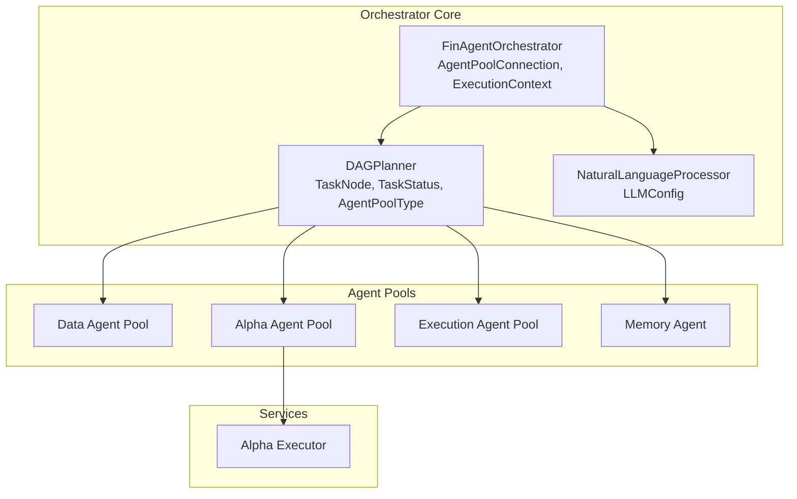
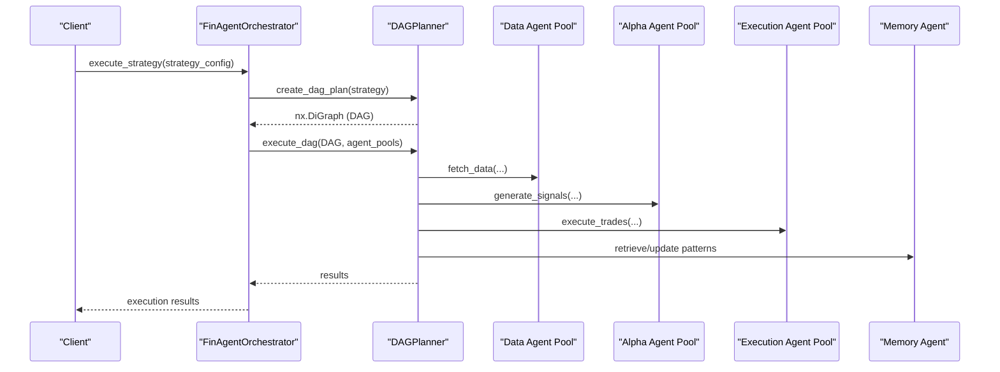
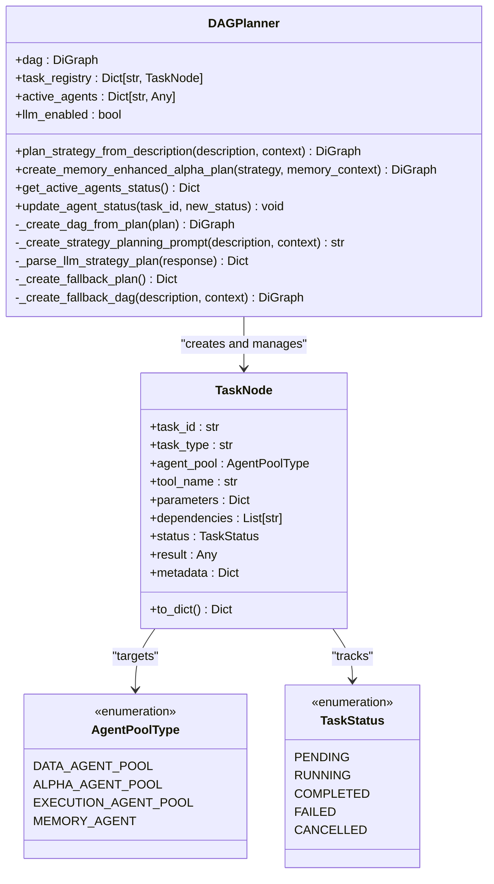
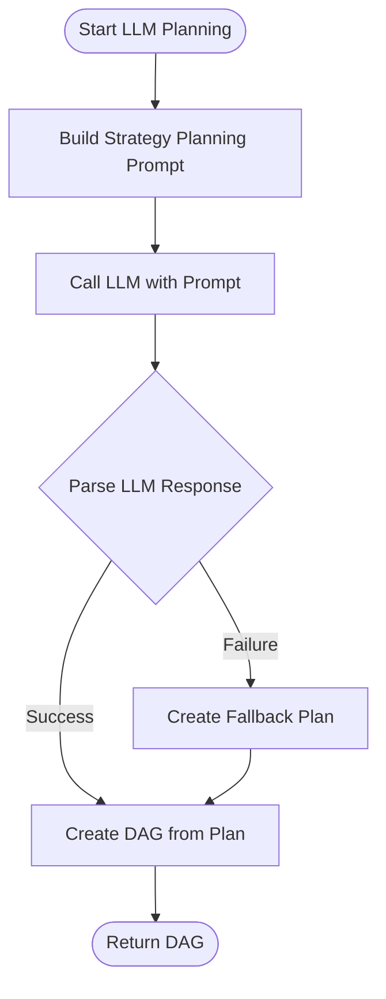
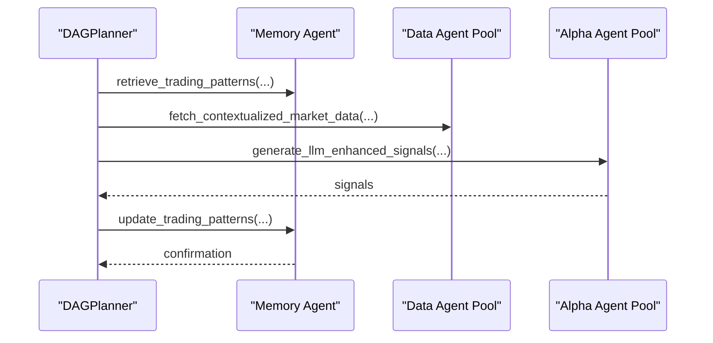
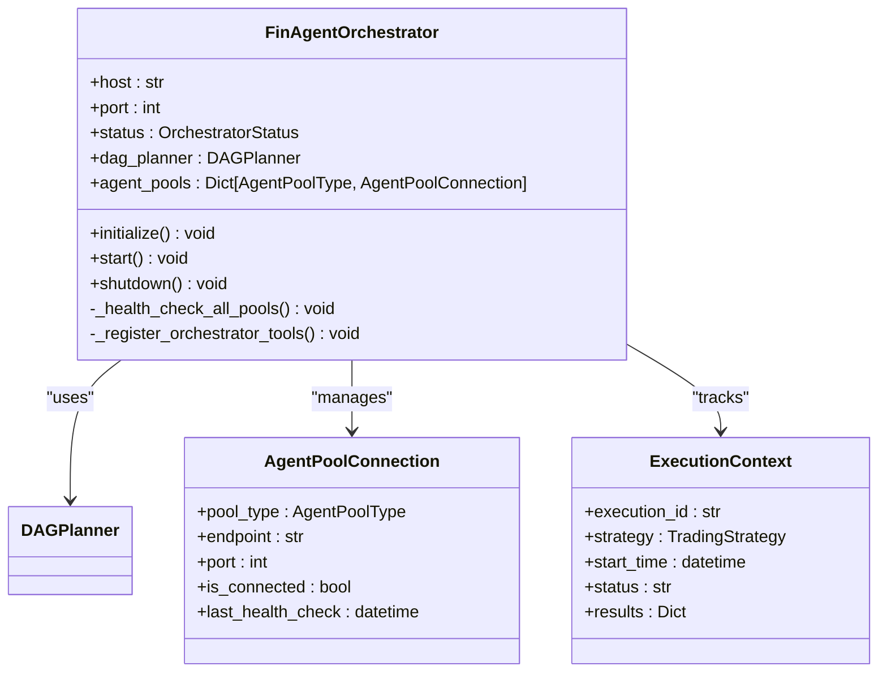
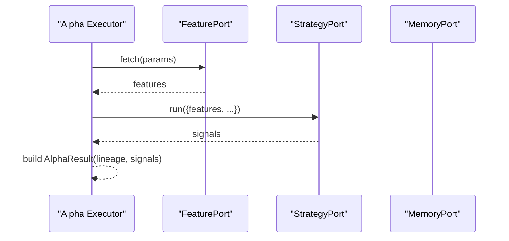
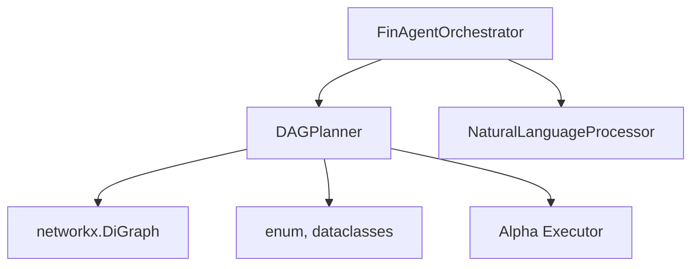

# DAG Planner and Task Execution

<cite>
**Referenced Files in This Document**
- [dag_planner.py](file://FinAgents/orchestrator/core/dag_planner.py)
- [finagent_orchestrator.py](file://FinAgents/orchestrator/core/finagent_orchestrator.py)
- [llm_integration.py](file://FinAgents/orchestrator/core/llm_integration.py)
- [executor.py](file://FinAgents/agent_pools/alpha_agent_pool/core/services/executor.py)
- [executor.py](file://FinAgents/agent_pools/alpha_agent_pool/corepkg/services/executor.py)
</cite>

## Table of Contents
1. [Introduction](#introduction)
2. [Project Structure](#project-structure)
3. [Core Components](#core-components)
4. [Architecture Overview](#architecture-overview)
5. [Detailed Component Analysis](#detailed-component-analysis)
6. [Dependency Analysis](#dependency-analysis)
7. [Performance Considerations](#performance-considerations)
8. [Troubleshooting Guide](#troubleshooting-guide)
9. [Conclusion](#conclusion)

## Introduction
This document explains the DAG Planner system that powers task execution flows in the FinAgent orchestrator. It focuses on the DAGPlanner class, including task node creation, dependency resolution, parallel scheduling, and execution monitoring. It also documents the TaskNode data structure, TaskStatus enumeration, and AgentPoolType classifications. The document covers the create_dag_plan method for converting strategy configurations into executable task graphs, the execution pipeline across agent pools, and error handling mechanisms. Examples of complex execution workflows, dependency chains, and performance optimization strategies are included, along with integration details for agent pool connections and real-time execution tracking.

## Project Structure
The DAG Planner resides in the orchestrator core and integrates with the FinAgent orchestrator, LLM integration, and agent pool executors. The orchestrator coordinates agent pools, manages execution contexts, and logs memory events for backtesting and performance analysis.

**Diagram sources**
- [dag_planner.py:189-675](file://FinAgents/orchestrator/core/dag_planner.py#L189-L675)
- [finagent_orchestrator.py:106-200](file://FinAgents/orchestrator/core/finagent_orchestrator.py#L106-L200)
- [llm_integration.py:41-120](file://FinAgents/orchestrator/core/llm_integration.py#L41-L120)
- [executor.py:12-63](file://FinAgents/agent_pools/alpha_agent_pool/core/services/executor.py#L12-L63)

**Section sources**
- [dag_planner.py:189-248](file://FinAgents/orchestrator/core/dag_planner.py#L189-L248)
- [finagent_orchestrator.py:106-200](file://FinAgents/orchestrator/core/finagent_orchestrator.py#L106-L200)

## Core Components
- DAGPlanner: Creates and manages execution DAGs, supports LLM-enhanced planning, and tracks active agents.
- TaskNode: Represents a single task with attributes for type, agent pool, tool, parameters, dependencies, status, and timestamps.
- TaskStatus: Enumerates task lifecycle states (pending, running, completed, failed, cancelled).
- AgentPoolType: Classifies agent pools (data, alpha, execution, memory).
- FinAgentOrchestrator: Coordinates DAG execution, connects to agent pools, and manages execution contexts and memory logging.

**Section sources**
- [dag_planner.py:67-117](file://FinAgents/orchestrator/core/dag_planner.py#L67-L117)
- [dag_planner.py:76-82](file://FinAgents/orchestrator/core/dag_planner.py#L76-L82)
- [dag_planner.py:189-248](file://FinAgents/orchestrator/core/dag_planner.py#L189-L248)
- [finagent_orchestrator.py:106-175](file://FinAgents/orchestrator/core/finagent_orchestrator.py#L106-L175)

## Architecture Overview
The DAG Planner transforms strategy descriptions into executable task graphs and coordinates execution across agent pools. The orchestrator initializes connections to agent pools, registers tools, and supervises execution with memory logging and performance tracking.

**Diagram sources**
- [finagent_orchestrator.py:288-351](file://FinAgents/orchestrator/core/finagent_orchestrator.py#L288-L351)
- [dag_planner.py:396-475](file://FinAgents/orchestrator/core/dag_planner.py#L396-L475)

**Section sources**
- [finagent_orchestrator.py:138-168](file://FinAgents/orchestrator/core/finagent_orchestrator.py#L138-L168)
- [finagent_orchestrator.py:273-287](file://FinAgents/orchestrator/core/finagent_orchestrator.py#L273-L287)

## Detailed Component Analysis

### DAGPlanner Class
The DAGPlanner builds execution graphs from strategy descriptions and manages task execution across agent pools. It supports:
- LLM-enhanced planning via NaturalLanguageProcessor
- Traditional planning with fallbacks
- Memory-enhanced alpha generation DAGs
- Active agent tracking and status updates

Key methods and responsibilities:
- plan_strategy_from_description: Converts natural language strategy descriptions into DAGs using LLM prompts and parsing.
- _create_dag_from_plan: Builds TaskNode graph from structured plans and sets up dependencies.
- create_memory_enhanced_alpha_plan: Specialized DAG for memory-guided alpha generation with feedback loops.
- get_active_agents_status and update_agent_status: Monitor and update agent pool activity.
- _create_fallback_plan and _create_fallback_dag: Provide resilient planning when LLM parsing fails.

**Diagram sources**
- [dag_planner.py:189-675](file://FinAgents/orchestrator/core/dag_planner.py#L189-L675)
- [dag_planner.py:84-128](file://FinAgents/orchestrator/core/dag_planner.py#L84-L128)
- [dag_planner.py:76-82](file://FinAgents/orchestrator/core/dag_planner.py#L76-L82)
- [dag_planner.py:67-74](file://FinAgents/orchestrator/core/dag_planner.py#L67-L74)

**Section sources**
- [dag_planner.py:286-322](file://FinAgents/orchestrator/core/dag_planner.py#L286-L322)
- [dag_planner.py:396-475](file://FinAgents/orchestrator/core/dag_planner.py#L396-L475)
- [dag_planner.py:498-645](file://FinAgents/orchestrator/core/dag_planner.py#L498-L645)
- [dag_planner.py:477-496](file://FinAgents/orchestrator/core/dag_planner.py#L477-L496)
- [dag_planner.py:647-675](file://FinAgents/orchestrator/core/dag_planner.py#L647-L675)

### TaskNode Data Structure
TaskNode encapsulates all task metadata and execution state:
- Identity: task_id, tool_name
- Execution: task_type, agent_pool, parameters
- Dependencies: dependencies list linking to prerequisite task IDs
- Lifecycle: status, timestamps (created_at, started_at, completed_at), error_message
- Metadata: arbitrary key-value context for planning and attribution
- Serialization: to_dict converts enums and datetime objects for persistence/logging

Complexity considerations:
- Dependency resolution runs in O(V + E) for DAG traversal.
- Status updates and timestamps support real-time monitoring.

**Section sources**
- [dag_planner.py:84-128](file://FinAgents/orchestrator/core/dag_planner.py#L84-L128)

### TaskStatus and AgentPoolType
- TaskStatus: Standardized lifecycle states enabling robust execution monitoring and recovery.
- AgentPoolType: Classifies agent pools to route tasks appropriately and track resource allocation.

**Section sources**
- [dag_planner.py:67-74](file://FinAgents/orchestrator/core/dag_planner.py#L67-L74)
- [dag_planner.py:76-82](file://FinAgents/orchestrator/core/dag_planner.py#L76-L82)

### LLM Integration for Planning
The DAGPlanner optionally uses NaturalLanguageProcessor to:
- Construct prompts that define strategy decomposition
- Parse LLM responses into structured plans
- Fall back to traditional planning when LLM parsing fails

**Diagram sources**
- [dag_planner.py:286-322](file://FinAgents/orchestrator/core/dag_planner.py#L286-L322)
- [dag_planner.py:323-368](file://FinAgents/orchestrator/core/dag_planner.py#L323-L368)
- [dag_planner.py:370-394](file://FinAgents/orchestrator/core/dag_planner.py#L370-L394)
- [llm_integration.py:41-120](file://FinAgents/orchestrator/core/llm_integration.py#L41-L120)

**Section sources**
- [dag_planner.py:286-322](file://FinAgents/orchestrator/core/dag_planner.py#L286-L322)
- [dag_planner.py:323-394](file://FinAgents/orchestrator/core/dag_planner.py#L323-L394)
- [llm_integration.py:41-120](file://FinAgents/orchestrator/core/llm_integration.py#L41-L120)

### Memory-Enhanced Alpha Plan
The create_memory_enhanced_alpha_plan method constructs a four-stage DAG:
1. Memory Pattern Retrieval: Loads historical patterns for context.
2. Enhanced Data Fetching: Retrieves contextualized market data guided by memory.
3. LLM-Enhanced Alpha Generation: Produces signals using memory and LLM enhancements.
4. Memory Learning Update: Updates patterns based on outcomes.

**Diagram sources**
- [dag_planner.py:498-645](file://FinAgents/orchestrator/core/dag_planner.py#L498-L645)

**Section sources**
- [dag_planner.py:498-645](file://FinAgents/orchestrator/core/dag_planner.py#L498-L645)

### Orchestrator Integration and Agent Pool Connections
The orchestrator maintains AgentPoolConnection configurations for each pool type and performs health checks. It registers MCP tools to execute strategies and backtests, manages execution contexts, and logs memory events for performance and attribution.

**Diagram sources**
- [finagent_orchestrator.py:106-175](file://FinAgents/orchestrator/core/finagent_orchestrator.py#L106-L175)
- [finagent_orchestrator.py:64-75](file://FinAgents/orchestrator/core/finagent_orchestrator.py#L64-L75)
- [finagent_orchestrator.py:77-88](file://FinAgents/orchestrator/core/finagent_orchestrator.py#L77-L88)

**Section sources**
- [finagent_orchestrator.py:106-175](file://FinAgents/orchestrator/core/finagent_orchestrator.py#L106-L175)
- [finagent_orchestrator.py:273-287](file://FinAgents/orchestrator/core/finagent_orchestrator.py#L273-L287)
- [finagent_orchestrator.py:288-351](file://FinAgents/orchestrator/core/finagent_orchestrator.py#L288-L351)

### Alpha Executor Integration
Alpha agent pools use an Executor to run plans composed of feature fetching, strategy execution, and validation nodes. The executor aggregates signals and maintains lineage for traceability.

**Diagram sources**
- [executor.py:12-63](file://FinAgents/agent_pools/alpha_agent_pool/core/services/executor.py#L12-L63)
- [executor.py:12-56](file://FinAgents/agent_pools/alpha_agent_pool/corepkg/services/executor.py#L12-L56)

**Section sources**
- [executor.py:12-63](file://FinAgents/agent_pools/alpha_agent_pool/core/services/executor.py#L12-L63)
- [executor.py:12-56](file://FinAgents/agent_pools/alpha_agent_pool/corepkg/services/executor.py#L12-L56)

## Dependency Analysis
- DAGPlanner depends on NetworkX for DAG construction and Python’s enum/dataclass for typed structures.
- Orchestrator depends on DAGPlanner and LLM integration for strategy execution.
- Alpha executor depends on feature and strategy ports for plan execution.

**Diagram sources**
- [dag_planner.py:49-50](file://FinAgents/orchestrator/core/dag_planner.py#L49-L50)
- [dag_planner.py:198-247](file://FinAgents/orchestrator/core/dag_planner.py#L198-L247)
- [finagent_orchestrator.py:34-34](file://FinAgents/orchestrator/core/finagent_orchestrator.py#L34-L34)
- [executor.py:6-9](file://FinAgents/agent_pools/alpha_agent_pool/core/services/executor.py#L6-L9)

**Section sources**
- [dag_planner.py:49-50](file://FinAgents/orchestrator/core/dag_planner.py#L49-L50)
- [finagent_orchestrator.py:34-34](file://FinAgents/orchestrator/core/finagent_orchestrator.py#L34-L34)

## Performance Considerations
- Parallelism: Tasks with no dependencies can run concurrently; dependency resolution ensures correctness.
- Memory usage: DAGs scale with number of tasks and edges; consider pruning unused nodes after execution.
- LLM overhead: Prompt building and parsing add latency; batch or cache responses when feasible.
- Agent pool throughput: Monitor pool health and adjust worker counts; implement retries and timeouts.
- Monitoring: Track task timestamps and statuses for bottleneck identification.

[No sources needed since this section provides general guidance]

## Troubleshooting Guide
Common issues and resolutions:
- LLM parsing failures: The planner falls back to a basic momentum plan when LLM JSON parsing fails.
- Agent pool unavailability: Health checks mark pools as disconnected; orchestrator proceeds with fallbacks or partial execution.
- Execution errors: Task status transitions to failed with error messages; memory events capture error details for analysis.
- Backtesting anomalies: Memory logging records errors and progress; use insights to tune agent parameters and DAG structure.

**Section sources**
- [dag_planner.py:318-322](file://FinAgents/orchestrator/core/dag_planner.py#L318-L322)
- [finagent_orchestrator.py:273-287](file://FinAgents/orchestrator/core/finagent_orchestrator.py#L273-L287)
- [finagent_orchestrator.py:615-631](file://FinAgents/orchestrator/core/finagent_orchestrator.py#L615-L631)

## Conclusion
The DAG Planner provides a robust foundation for transforming strategies into executable task graphs, coordinating multi-agent execution, and integrating memory and LLM enhancements. Its design supports resilience via fallbacks, scalability through parallel execution, and observability through detailed logging and status tracking. By leveraging agent pool connections and memory insights, the orchestrator enables sophisticated trading workflows with real-time monitoring and continuous learning.