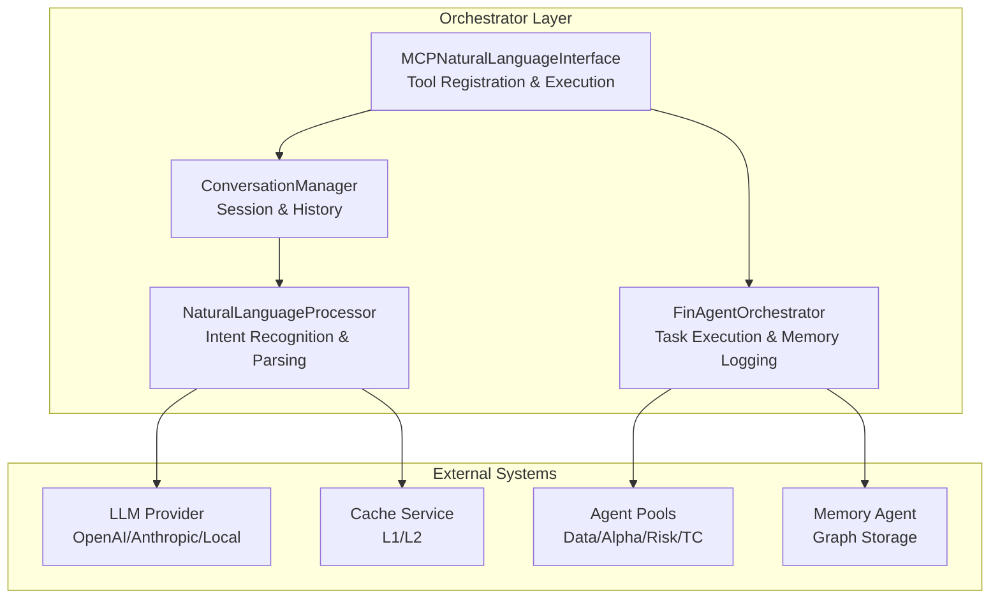
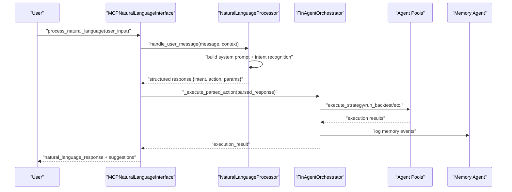
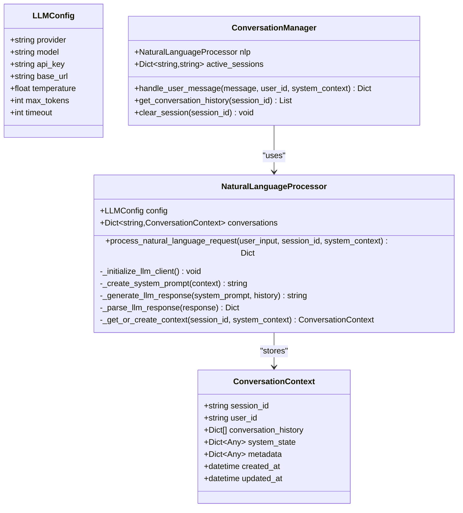
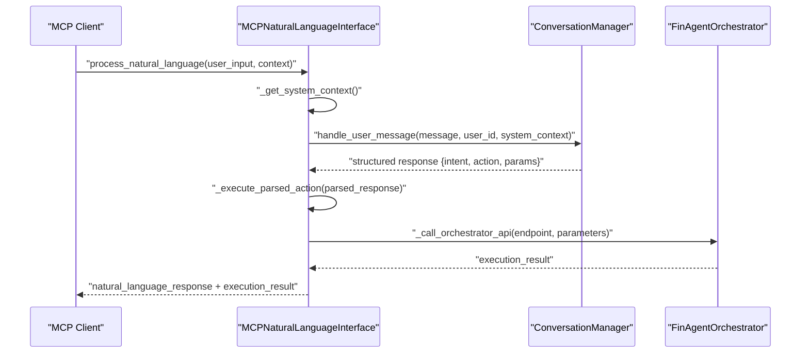
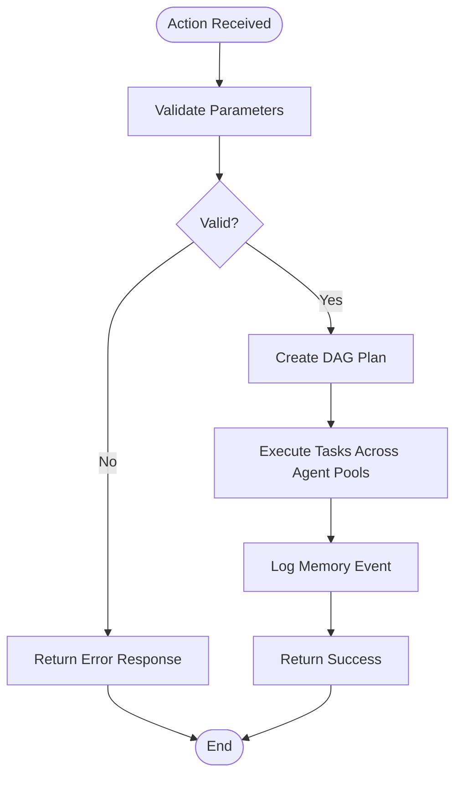
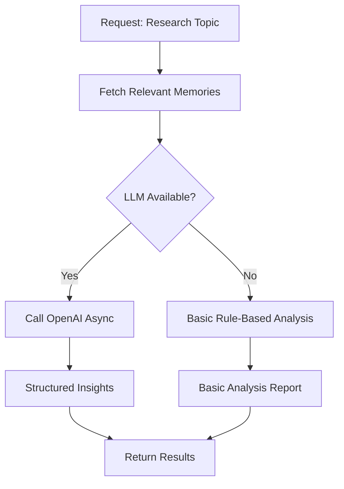
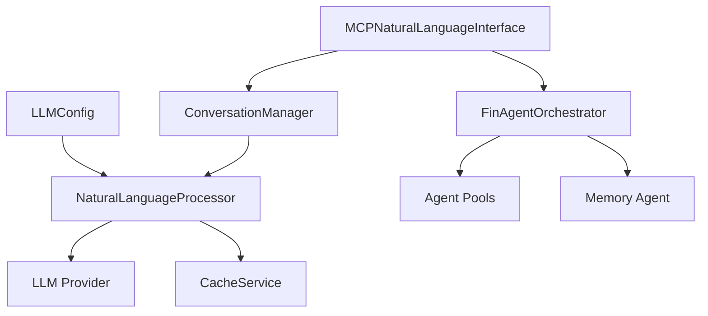

# LLM Integration and Natural Language Processing

<cite>
**Referenced Files in This Document**
- [llm_integration.py](file://FinAgents/orchestrator/core/llm_integration.py)
- [mcp_nl_interface.py](file://FinAgents/orchestrator/core/mcp_nl_interface.py)
- [finagent_orchestrator.py](file://FinAgents/orchestrator/core/finagent_orchestrator.py)
- [llm_research_service.py](file://FinAgents/memory/llm_research_service.py)
- [cache_service.py](file://backend/cache/cache_service.py)
- [orchestrator_config.yaml](file://FinAgents/orchestrator/config/orchestrator_config.yaml)
- [interface.py](file://FinAgents/memory/interface.py)
- [optimized_prompts.json](file://examples/optimized_prompts.json)
</cite>

## Table of Contents
1. [Introduction](#introduction)
2. [Project Structure](#project-structure)
3. [Core Components](#core-components)
4. [Architecture Overview](#architecture-overview)
5. [Detailed Component Analysis](#detailed-component-analysis)
6. [Dependency Analysis](#dependency-analysis)
7. [Performance Considerations](#performance-considerations)
8. [Troubleshooting Guide](#troubleshooting-guide)
9. [Conclusion](#conclusion)
10. [Appendices](#appendices)

## Introduction
This document describes the LLM integration layer that powers natural language processing within the FinAgent orchestrator. It explains how user intent is extracted from natural language, how prompts are engineered for clarity and actionability, and how responses are parsed and executed across agent pools. It also covers integration with external language models, caching strategies for LLM responses, cost optimization techniques, and adaptive learning through memory systems. Practical examples illustrate prompt templates, response formatting, and error handling for robust operation.

## Project Structure
The LLM integration spans three primary areas:
- Natural Language Processing (NLP) and intent parsing
- MCP-based natural language interface for orchestration
- Memory-backed research and adaptive learning

**Diagram sources**
- [llm_integration.py:41-128](file://FinAgents/orchestrator/core/llm_integration.py#L41-L128)
- [mcp_nl_interface.py:21-118](file://FinAgents/orchestrator/core/mcp_nl_interface.py#L21-L118)
- [finagent_orchestrator.py:106-200](file://FinAgents/orchestrator/core/finagent_orchestrator.py#L106-L200)

**Section sources**
- [llm_integration.py:1-469](file://FinAgents/orchestrator/core/llm_integration.py#L1-L469)
- [mcp_nl_interface.py:1-497](file://FinAgents/orchestrator/core/mcp_nl_interface.py#L1-L497)
- [finagent_orchestrator.py:1-800](file://FinAgents/orchestrator/core/finagent_orchestrator.py#L1-L800)

## Core Components
- LLMConfig: Encapsulates provider, model, credentials, and runtime parameters.
- NaturalLanguageProcessor: Orchestrates system prompts, intent recognition, and response parsing.
- ConversationManager: Manages multi-turn sessions, context persistence, and history.
- MCPNaturalLanguageInterface: Exposes MCP tools for natural language processing, strategy execution, and system status reporting.
- FinAgentOrchestrator: Executes parsed actions, logs outcomes to memory, and coordinates agent pools.
- LLMResearchService: Provides LLM-powered memory analysis and research insights.
- CacheService: Implements 2-level caching (L1 in-memory + L2 Redis) to optimize hot-path data access.

**Section sources**
- [llm_integration.py:19-128](file://FinAgents/orchestrator/core/llm_integration.py#L19-L128)
- [mcp_nl_interface.py:21-118](file://FinAgents/orchestrator/core/mcp_nl_interface.py#L21-L118)
- [finagent_orchestrator.py:106-200](file://FinAgents/orchestrator/core/finagent_orchestrator.py#L106-L200)
- [llm_research_service.py:57-124](file://FinAgents/memory/llm_research_service.py#L57-L124)
- [cache_service.py:58-202](file://backend/cache/cache_service.py#L58-L202)

## Architecture Overview
The LLM integration pipeline transforms natural language into executable actions:
1. User input enters via MCP tools or direct calls.
2. NaturalLanguageProcessor builds a system prompt and extracts intent with structured parameters.
3. ConversationManager maintains context across sessions.
4. MCPNaturalLanguageInterface executes parsed actions against the orchestrator and agent pools.
5. FinAgentOrchestrator performs DAG planning, task execution, and memory logging.
6. Memory and cache layers support context preservation and performance optimization.

**Diagram sources**
- [mcp_nl_interface.py:62-118](file://FinAgents/orchestrator/core/mcp_nl_interface.py#L62-L118)
- [llm_integration.py:59-128](file://FinAgents/orchestrator/core/llm_integration.py#L59-L128)
- [finagent_orchestrator.py:291-351](file://FinAgents/orchestrator/core/finagent_orchestrator.py#L291-L351)

## Detailed Component Analysis

### Natural Language Processor
Responsibilities:
- Initialize LLM client based on configuration.
- Maintain conversation context per session.
- Construct system prompts embedding current system state.
- Recognize intent from user input and produce structured JSON.
- Parse and validate LLM responses, ensuring required fields and confidence bounds.

Key behaviors:
- System prompt composition pulls from current system context to guide accurate intent recognition.
- Intent detection uses keyword matching heuristics to map user requests to supported intents.
- Response parsing enforces schema compliance and sanitizes confidence values.

**Diagram sources**
- [llm_integration.py:19-128](file://FinAgents/orchestrator/core/llm_integration.py#L19-L128)
- [llm_integration.py:364-405](file://FinAgents/orchestrator/core/llm_integration.py#L364-L405)

**Section sources**
- [llm_integration.py:41-128](file://FinAgents/orchestrator/core/llm_integration.py#L41-L128)
- [llm_integration.py:130-194](file://FinAgents/orchestrator/core/llm_integration.py#L130-L194)
- [llm_integration.py:195-363](file://FinAgents/orchestrator/core/llm_integration.py#L195-L363)

### MCP Natural Language Interface
Responsibilities:
- Register MCP tools for natural language processing, strategy execution, and system status.
- Aggregate system context from agent pools to inform LLM prompts.
- Execute parsed actions by calling orchestrator APIs or managing agent pools.
- Provide conversational chat and strategy-from-description capabilities.

Key flows:
- process_natural_language: Parses user input, executes action, and returns natural language summary.
- chat_with_system: Maintains conversational context and returns intent/confidence.
- execute_strategy_from_description: Converts free-form strategy descriptions into executable plans.
- get_system_status_summary: Generates a natural language summary of system health.

**Diagram sources**
- [mcp_nl_interface.py:62-118](file://FinAgents/orchestrator/core/mcp_nl_interface.py#L62-L118)
- [mcp_nl_interface.py:318-353](file://FinAgents/orchestrator/core/mcp_nl_interface.py#L318-L353)
- [mcp_nl_interface.py:354-379](file://FinAgents/orchestrator/core/mcp_nl_interface.py#L354-L379)

**Section sources**
- [mcp_nl_interface.py:21-118](file://FinAgents/orchestrator/core/mcp_nl_interface.py#L21-L118)
- [mcp_nl_interface.py:252-283](file://FinAgents/orchestrator/core/mcp_nl_interface.py#L252-L283)
- [mcp_nl_interface.py:318-379](file://FinAgents/orchestrator/core/mcp_nl_interface.py#L318-L379)

### FinAgent Orchestrator Integration
Responsibilities:
- Execute parsed actions (e.g., strategy execution, backtesting).
- Log execution events to memory with rich metadata for attribution and learning.
- Coordinate agent pools and maintain system metrics.

Key integrations:
- execute_strategy: Creates DAG plan, executes tasks, and logs outcomes.
- run_backtest: Runs comprehensive simulations with memory and risk integration.
- Memory logging: Events tagged for optimization, system, and performance insights.

**Diagram sources**
- [finagent_orchestrator.py:291-351](file://FinAgents/orchestrator/core/finagent_orchestrator.py#L291-L351)
- [finagent_orchestrator.py:442-674](file://FinAgents/orchestrator/core/finagent_orchestrator.py#L442-L674)

**Section sources**
- [finagent_orchestrator.py:291-351](file://FinAgents/orchestrator/core/finagent_orchestrator.py#L291-L351)
- [finagent_orchestrator.py:442-674](file://FinAgents/orchestrator/core/finagent_orchestrator.py#L442-L674)

### LLM Research Service (Memory-Integrated)
Responsibilities:
- Provide LLM-powered analysis of memory data for research insights.
- Fall back to rule-based analysis when LLM is unavailable.
- Enhance semantic search results with LLM relevance scoring.

Key capabilities:
- analyze_memory_patterns: Identifies patterns and relationships in memory data.
- semantic_memory_search: Combines raw retrieval with LLM enhancement.
- generate_research_insights: Produces structured research reports grounded in memory.
- analyze_memory_relationships: Detects causal and thematic connections across memories.

**Diagram sources**
- [llm_research_service.py:166-232](file://FinAgents/memory/llm_research_service.py#L166-L232)
- [llm_research_service.py:306-335](file://FinAgents/memory/llm_research_service.py#L306-L335)

**Section sources**
- [llm_research_service.py:57-124](file://FinAgents/memory/llm_research_service.py#L57-L124)
- [llm_research_service.py:166-232](file://FinAgents/memory/llm_research_service.py#L166-L232)
- [llm_research_service.py:306-335](file://FinAgents/memory/llm_research_service.py#L306-L335)

### Prompt Engineering Framework
Prompt design ensures deterministic intent extraction and structured outputs:
- System prompt defines role, capabilities, response format, and supported intents.
- Intent recognition leverages keyword matching to map user requests to canonical actions.
- Response parsing validates JSON schema and normalizes confidence scores.

Examples of prompt templates and response formatting are documented in:
- System prompt construction and supported intents
- Response schema enforcement and fallback handling

**Section sources**
- [llm_integration.py:145-194](file://FinAgents/orchestrator/core/llm_integration.py#L145-L194)
- [llm_integration.py:214-334](file://FinAgents/orchestrator/core/llm_integration.py#L214-L334)
- [llm_integration.py:336-363](file://FinAgents/orchestrator/core/llm_integration.py#L336-L363)
- [optimized_prompts.json:1-5](file://examples/optimized_prompts.json#L1-L5)

### Response Parsing Mechanisms
Parsing ensures robust handling of both structured and unstructured LLM outputs:
- JSON decoding with fallback to free-text explanation when invalid.
- Required field validation and confidence normalization.
- Structured suggestion lists for follow-up actions.

**Section sources**
- [llm_integration.py:336-363](file://FinAgents/orchestrator/core/llm_integration.py#L336-L363)

### Integration with Memory Systems
Memory integration supports:
- Context preservation across sessions via ConversationContext.
- Attribution logging for decisions and outcomes.
- Graph-based retrieval and relationship analysis for research.

Integration points:
- ConversationManager persists context per session.
- FinAgentOrchestrator logs memory events with tags and metadata.
- MCPNaturalLanguageInterface aggregates system context from agent pools.

**Section sources**
- [llm_integration.py:130-143](file://FinAgents/orchestrator/core/llm_integration.py#L130-L143)
- [finagent_orchestrator.py:239-272](file://FinAgents/orchestrator/core/finagent_orchestrator.py#L239-L272)
- [mcp_nl_interface.py:252-283](file://FinAgents/orchestrator/core/mcp_nl_interface.py#L252-L283)
- [interface.py:26-150](file://FinAgents/memory/interface.py#L26-L150)

### Adaptive Learning Capabilities
Adaptive learning emerges from:
- Memory-backed decision attribution enabling performance analysis.
- Periodic backtest analysis and improvement recommendations.
- Rule-based fallback ensuring continuity when LLM is unavailable.

**Section sources**
- [finagent_orchestrator.py:582-591](file://FinAgents/orchestrator/core/finagent_orchestrator.py#L582-L591)
- [llm_research_service.py:385-448](file://FinAgents/memory/llm_research_service.py#L385-L448)

## Dependency Analysis

**Diagram sources**
- [llm_integration.py:19-50](file://FinAgents/orchestrator/core/llm_integration.py#L19-L50)
- [mcp_nl_interface.py:27-46](file://FinAgents/orchestrator/core/mcp_nl_interface.py#L27-L46)
- [finagent_orchestrator.py:138-163](file://FinAgents/orchestrator/core/finagent_orchestrator.py#L138-L163)
- [cache_service.py:83-96](file://backend/cache/cache_service.py#L83-L96)

**Section sources**
- [llm_integration.py:19-50](file://FinAgents/orchestrator/core/llm_integration.py#L19-L50)
- [mcp_nl_interface.py:27-46](file://FinAgents/orchestrator/core/mcp_nl_interface.py#L27-L46)
- [finagent_orchestrator.py:138-163](file://FinAgents/orchestrator/core/finagent_orchestrator.py#L138-L163)
- [cache_service.py:83-96](file://backend/cache/cache_service.py#L83-L96)

## Performance Considerations
- LLM cost optimization:
  - Use concise system prompts and targeted keyword matching to reduce token usage.
  - Prefer lower-cost models for routine tasks; reserve higher-capability models for complex reasoning.
  - Implement fallbacks (rule-based analysis) to avoid LLM calls when unavailable.
- Caching strategies:
  - Leverage 2-level cache (L1 in-memory + L2 Redis) for hot-path data to minimize latency.
  - Apply short TTLs for real-time signals and market data to balance freshness and throughput.
- Conversation pruning:
  - Limit recent history length to reduce context size and cost.
- Asynchronous execution:
  - Use async HTTP clients and non-blocking LLM calls to improve throughput.

[No sources needed since this section provides general guidance]

## Troubleshooting Guide
Common issues and resolutions:
- LLM provider misconfiguration:
  - Verify provider, model, and API key in configuration; ensure base URL is set if using custom endpoints.
- Intent parsing failures:
  - Confirm user input contains recognizable keywords mapped to supported intents.
  - Validate response parsing handles malformed JSON gracefully.
- Orchestrator API errors:
  - Inspect returned error codes and details; confirm agent pool endpoints are reachable.
- Memory availability:
  - Ensure memory agent is enabled and reachable; verify storage backend configuration.
- Cache connectivity:
  - Check Redis availability and network reachability; degrade gracefully to in-memory cache.

**Section sources**
- [llm_integration.py:52-58](file://FinAgents/orchestrator/core/llm_integration.py#L52-L58)
- [mcp_nl_interface.py:354-379](file://FinAgents/orchestrator/core/mcp_nl_interface.py#L354-L379)
- [llm_research_service.py:306-335](file://FinAgents/memory/llm_research_service.py#L306-L335)
- [cache_service.py:83-104](file://backend/cache/cache_service.py#L83-L104)

## Conclusion
The LLM integration layer in FinAgent provides a robust, extensible foundation for natural language processing. By combining structured prompts, intent recognition, and response parsing with MCP-based orchestration and memory-backed learning, it enables intuitive user interactions, reliable action execution, and continuous system improvement. The caching and fallback strategies ensure performance and resilience across diverse deployment environments.

## Appendices

### Configuration Reference
- Orchestrator configuration includes LLM settings, agent pool endpoints, and monitoring parameters.
- MCP tool registration exposes natural language processing and strategy execution capabilities.

**Section sources**
- [orchestrator_config.yaml:7-30](file://FinAgents/orchestrator/config/orchestrator_config.yaml#L7-L30)
- [mcp_nl_interface.py:27-46](file://FinAgents/orchestrator/core/mcp_nl_interface.py#L27-L46)

### Example Prompt Templates and Response Formats
- System prompt template for intent recognition and response schema.
- Example response JSON structure with intent, action, parameters, confidence, explanation, and suggestions.
- Agent-specific prompt templates for specialized roles.

**Section sources**
- [llm_integration.py:145-194](file://FinAgents/orchestrator/core/llm_integration.py#L145-L194)
- [llm_integration.py:214-334](file://FinAgents/orchestrator/core/llm_integration.py#L214-L334)
- [optimized_prompts.json:1-5](file://examples/optimized_prompts.json#L1-L5)