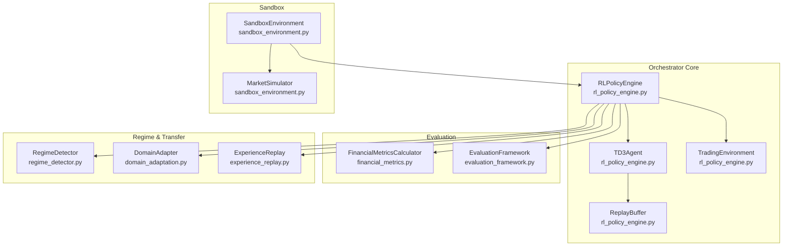
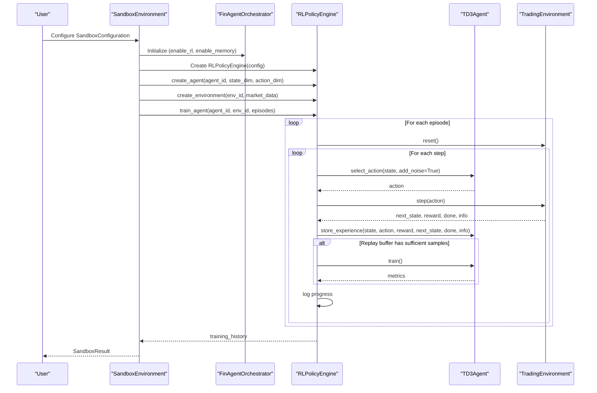
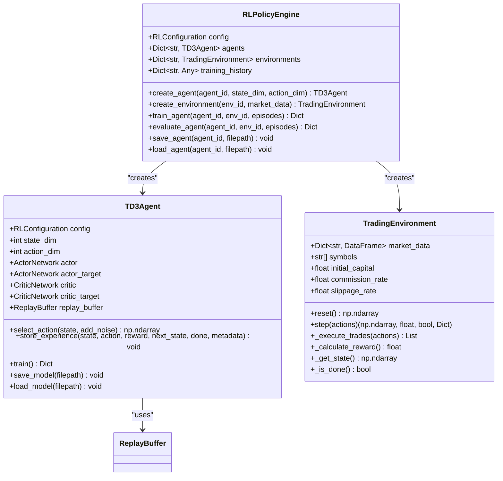
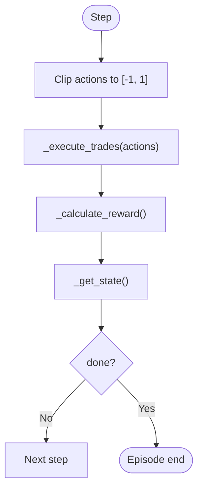
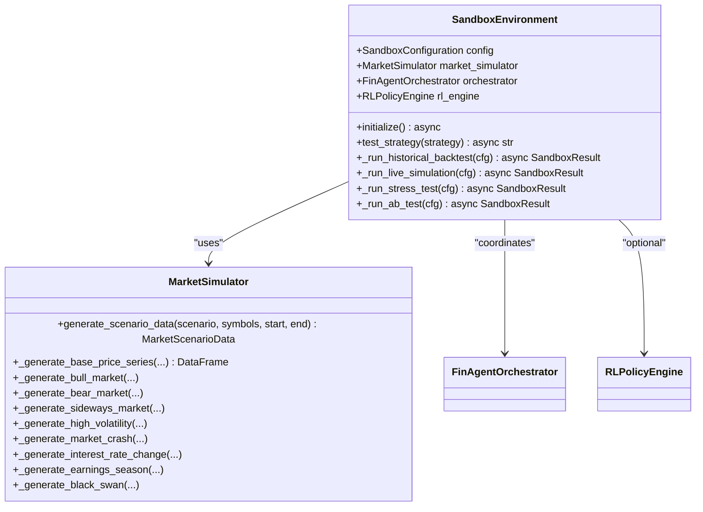
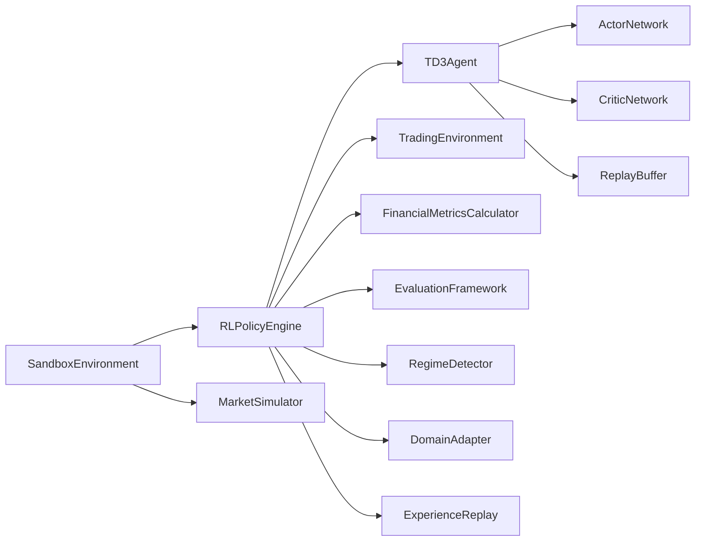

# Reinforcement Learning Policy Engine

<cite>
**Referenced Files in This Document**
- [rl_policy_engine.py](file://FinAgents/orchestrator/core/rl_policy_engine.py)
- [sandbox_environment.py](file://FinAgents/orchestrator/core/sandbox_environment.py)
- [regime_detector.py](file://backend/market/regime_detector.py)
- [domain_adaptation.py](file://FinAgents/research/domain_agents/domain_adaptation.py)
- [experience_replay.py](file://FinAgents/research/memory_learning/experience_replay.py)
- [financial_metrics.py](file://FinAgents/research/evaluation/financial_metrics.py)
- [evaluation_framework.py](file://FinAgents/next_gen_system/evaluation/evaluation_framework.py)
- [run_live_trading.py](file://FinAgents/agent_pools/execution_agent_demo/execution_agent_demo/run_live_trading.py)
</cite>

## Table of Contents
1. [Introduction](#introduction)
2. [Project Structure](#project-structure)
3. [Core Components](#core-components)
4. [Architecture Overview](#architecture-overview)
5. [Detailed Component Analysis](#detailed-component-analysis)
6. [Dependency Analysis](#dependency-analysis)
7. [Performance Considerations](#performance-considerations)
8. [Troubleshooting Guide](#troubleshooting-guide)
9. [Conclusion](#conclusion)
10. [Appendices](#appendices)

## Introduction
This document describes the reinforcement learning (RL) policy engine designed for adaptive decision-making in trading scenarios. It explains the RL algorithm implementations, policy networks, reward function design, training framework, exploration vs exploitation strategies, and policy optimization techniques. It also covers integration with backtesting environments, real-time policy adaptation, performance evaluation metrics, sandbox environment management, safety controls for RL experimentation, and transfer learning capabilities between different market regimes.

## Project Structure
The RL policy engine resides in the orchestrator core and integrates with sandbox environments, regime detection, and evaluation frameworks across the system.

**Diagram sources**
- [rl_policy_engine.py:660-883](file://FinAgents/orchestrator/core/rl_policy_engine.py#L660-L883)
- [sandbox_environment.py:500-699](file://FinAgents/orchestrator/core/sandbox_environment.py#L500-L699)
- [regime_detector.py:1-21](file://backend/market/regime_detector.py#L1-L21)
- [domain_adaptation.py:1-43](file://FinAgents/research/domain_agents/domain_adaptation.py#L1-L43)
- [experience_replay.py:129-432](file://FinAgents/research/memory_learning/experience_replay.py#L129-L432)
- [financial_metrics.py:1-80](file://FinAgents/research/evaluation/financial_metrics.py#L1-L80)
- [evaluation_framework.py:305-345](file://FinAgents/next_gen_system/evaluation/evaluation_framework.py#L305-L345)

**Section sources**
- [rl_policy_engine.py:1-883](file://FinAgents/orchestrator/core/rl_policy_engine.py#L1-L883)
- [sandbox_environment.py:1-918](file://FinAgents/orchestrator/core/sandbox_environment.py#L1-L918)

## Core Components
- RL Policy Engine: Central controller for creating agents, environments, and orchestrating training and evaluation.
- TD3 Agent: Implements Twin Delayed Deep Deterministic Policy Gradient with actor-critic networks, delayed policy updates, and target networks.
- Trading Environment: Simulates trading with realistic constraints (commission, slippage), state construction, and reward computation.
- Replay Buffer: Stores experiences and supports memory-enhanced sampling for improved learning stability.
- Sandbox Environment: Provides isolated testing modes (historical backtest, live simulation, stress test, A/B test, Monte Carlo) with scenario generation and risk limits.
- Regime Detection and Domain Adaptation: Enables regime-aware adjustments and transfer learning across market conditions.
- Evaluation Framework: Computes financial metrics and statistical significance for performance assessment.

**Section sources**
- [rl_policy_engine.py:660-883](file://FinAgents/orchestrator/core/rl_policy_engine.py#L660-L883)
- [sandbox_environment.py:500-699](file://FinAgents/orchestrator/core/sandbox_environment.py#L500-L699)

## Architecture Overview
The RL policy engine integrates tightly with the orchestrator and sandbox to support training, evaluation, and deployment in controlled environments. It leverages memory-enhanced experience replay and TD3’s twin critic architecture to stabilize policy learning in continuous action spaces.

**Diagram sources**
- [rl_policy_engine.py:692-757](file://FinAgents/orchestrator/core/rl_policy_engine.py#L692-L757)
- [sandbox_environment.py:551-617](file://FinAgents/orchestrator/core/sandbox_environment.py#L551-L617)

## Detailed Component Analysis

### RL Policy Engine
- Responsibilities:
  - Manage agent lifecycle (create, train, evaluate, save/load).
  - Coordinate environment creation and training loops.
  - Aggregate training history and expose evaluation metrics.
- Key behaviors:
  - Supports TD3 agent creation and training.
  - Exposes asynchronous training method for scalable execution.
  - Provides evaluation routine with Sharpe ratio and drawdown computation.

**Diagram sources**
- [rl_policy_engine.py:660-883](file://FinAgents/orchestrator/core/rl_policy_engine.py#L660-L883)

**Section sources**
- [rl_policy_engine.py:660-883](file://FinAgents/orchestrator/core/rl_policy_engine.py#L660-L883)

### TD3 Agent Implementation
- Networks:
  - ActorNetwork: maps state to continuous action in [-1, 1].
  - CriticNetwork: twin Q-networks for value estimation.
- Training:
  - Uses experience tuples (state, action, reward, next_state, done, metadata).
  - Implements delayed policy updates and target network soft updates.
  - Adds clipped noise to target actions for regularization.
- Exploration:
  - Adds Gaussian noise scaled by configuration during training.

**Diagram sources**
- [rl_policy_engine.py:441-467](file://FinAgents/orchestrator/core/rl_policy_engine.py#L441-L467)

**Section sources**
- [rl_policy_engine.py:236-388](file://FinAgents/orchestrator/core/rl_policy_engine.py#L236-L388)

### Trading Environment
- State construction:
  - Aggregates per-symbol features: returns, volatility, RSI, MACD, Bollinger position, volume ratio, price momentum, and portfolio weight.
  - Handles missing data by padding with zeros.
- Action interpretation:
  - Actions represent target portfolio weights in [-1, 1]; converts to trade sizes considering current prices and minimum thresholds.
- Reward design:
  - Risk-adjusted return based on recent portfolio returns normalized by realized volatility.
  - Penalties for drawdown exceeding a threshold to discourage large losses.
- Constraints:
  - Commission and slippage modeled per trade.
  - Episode termination on out-of-data or capital exhaustion.

**Section sources**
- [rl_policy_engine.py:404-658](file://FinAgents/orchestrator/core/rl_policy_engine.py#L404-L658)

### Replay Buffer and Memory Integration
- Memory-enhanced sampling:
  - Importance weights based on absolute reward magnitude and volatility metadata.
  - Weighted random sampling when enabled; otherwise uniform sampling.
- Capacity management:
  - Fixed-size buffer with deque for efficient FIFO eviction.

**Section sources**
- [rl_policy_engine.py:189-234](file://FinAgents/orchestrator/core/rl_policy_engine.py#L189-L234)

### Sandbox Environment and Safety Controls
- Modes:
  - Historical backtest, live simulation, stress test, A/B test, Monte Carlo.
- Scenario generation:
  - MarketSimulator creates synthetic scenarios (bull, bear, sideways, high volatility, crash, interest rate change, earnings season, black swan).
- Risk controls:
  - Configurable risk limits (max position size, max daily loss, max drawdown, VaR limit).
- Integration:
  - Initializes orchestrator and optional RL engine; executes strategies and collects performance and risk metrics.

**Diagram sources**
- [sandbox_environment.py:500-699](file://FinAgents/orchestrator/core/sandbox_environment.py#L500-L699)

**Section sources**
- [sandbox_environment.py:500-699](file://FinAgents/orchestrator/core/sandbox_environment.py#L500-L699)

### Regime Detection and Transfer Learning
- Regime detection:
  - Provides multi-timeframe regime identification and classification to inform strategy adaptation.
- Domain adaptation:
  - Maintains regime profiles and adjusts agent parameters based on historical performance in different regimes.
- Experience replay:
  - Advanced prioritization by reward, recency, and novelty supports transfer learning across regimes.

**Section sources**
- [regime_detector.py:1-21](file://backend/market/regime_detector.py#L1-L21)
- [domain_adaptation.py:1-43](file://FinAgents/research/domain_agents/domain_adaptation.py#L1-L43)
- [experience_replay.py:129-432](file://FinAgents/research/memory_learning/experience_replay.py#L129-L432)

### Evaluation Metrics and Reporting
- Financial metrics:
  - Includes Sharpe, Sortino, Calmar, Omega, max drawdown, volatility, win rate, profit factor, and regime performance.
- Evaluation framework:
  - Statistical tests (Student’s t-test, Jarque-Bera) and significance checks for performance comparisons.

**Section sources**
- [financial_metrics.py:1-80](file://FinAgents/research/evaluation/financial_metrics.py#L1-L80)
- [evaluation_framework.py:305-345](file://FinAgents/next_gen_system/evaluation/evaluation_framework.py#L305-L345)

## Dependency Analysis
- Internal dependencies:
  - RLPolicyEngine depends on TD3Agent and TradingEnvironment.
  - TD3Agent depends on ActorNetwork, CriticNetwork, and ReplayBuffer.
  - SandboxEnvironment coordinates orchestrator, RL engine, and market simulator.
- External integrations:
  - Pandas/Numpy for data/state handling.
  - PyTorch for neural networks and optimization.
  - Asynchronous execution for scalable training.

**Diagram sources**
- [rl_policy_engine.py:660-883](file://FinAgents/orchestrator/core/rl_policy_engine.py#L660-L883)
- [sandbox_environment.py:500-699](file://FinAgents/orchestrator/core/sandbox_environment.py#L500-L699)

**Section sources**
- [rl_policy_engine.py:660-883](file://FinAgents/orchestrator/core/rl_policy_engine.py#L660-L883)
- [sandbox_environment.py:500-699](file://FinAgents/orchestrator/core/sandbox_environment.py#L500-L699)

## Performance Considerations
- Network initialization and layer normalization improve training stability.
- TD3’s twin critics and delayed policy updates reduce overfitting and accelerate convergence.
- Replay buffer memory weighting prioritizes impactful experiences for faster learning.
- Environment reward shaping balances return, risk, and drawdown penalties to guide robust policies.
- Asynchronous training loop enables efficient utilization of compute resources.

[No sources needed since this section provides general guidance]

## Troubleshooting Guide
- Training instability:
  - Adjust exploration noise and policy noise; verify reward scaling and clipping bounds.
- Poor reward signal:
  - Reassess reward function parameters and penalties; ensure adequate volatility estimation.
- Overfitting concerns:
  - Increase replay buffer capacity; enable memory integration; monitor actor/critic loss trends.
- Sandbox failures:
  - Validate scenario parameters and risk limits; confirm orchestrator availability and ports.

**Section sources**
- [rl_policy_engine.py:301-372](file://FinAgents/orchestrator/core/rl_policy_engine.py#L301-L372)
- [sandbox_environment.py:613-617](file://FinAgents/orchestrator/core/sandbox_environment.py#L613-L617)

## Conclusion
The RL policy engine provides a robust, modular framework for training adaptive trading policies. It combines TD3 with memory-enhanced experience replay, realistic trading environments, and comprehensive evaluation metrics. The sandbox environment ensures safe experimentation, while regime detection and domain adaptation enable transfer learning across market conditions. Together, these components support scalable, reliable deployment of RL-driven trading strategies.

[No sources needed since this section summarizes without analyzing specific files]

## Appendices

### RL Agent Configuration Examples
- TD3 configuration with Sharpe-based reward and continuous action space:
  - Algorithm: TD3
  - Reward function: Sharpe ratio
  - State features: returns, volatility, RSI, MACD
  - Action space dimension: number of assets
  - Learning rate: small positive value
  - Batch size: moderate size for stability
  - Enable memory integration: true

**Section sources**
- [rl_policy_engine.py:867-874](file://FinAgents/orchestrator/core/rl_policy_engine.py#L867-L874)

### Reward Shaping for Trading Scenarios
- Risk-adjusted return: normalize portfolio returns by realized volatility.
- Drawdown penalty: penalize portfolios exceeding a predefined drawdown threshold.
- Transaction cost modeling: incorporate commission and slippage into state transitions.

**Section sources**
- [rl_policy_engine.py:557-592](file://FinAgents/orchestrator/core/rl_policy_engine.py#L557-L592)

### Integration with Orchestrator and Backtesting
- SandboxEnvironment initializes the orchestrator and optional RL engine, then runs strategies across multiple modes.
- Historical backtests integrate with orchestrator’s backtesting pipeline and collect performance/risk metrics.

**Section sources**
- [sandbox_environment.py:524-549](file://FinAgents/orchestrator/core/sandbox_environment.py#L524-L549)
- [sandbox_environment.py:633-672](file://FinAgents/orchestrator/core/sandbox_environment.py#L633-L672)

### Real-Time Policy Adaptation and Live Trading
- Live trading integration demonstrates execution agent usage and portfolio agent inference for practical deployments.

**Section sources**
- [run_live_trading.py:1-41](file://FinAgents/agent_pools/execution_agent_demo/execution_agent_demo/run_live_trading.py#L1-L41)