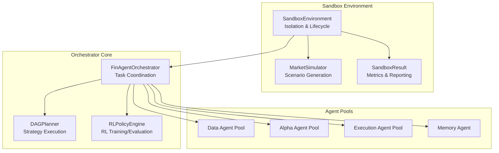
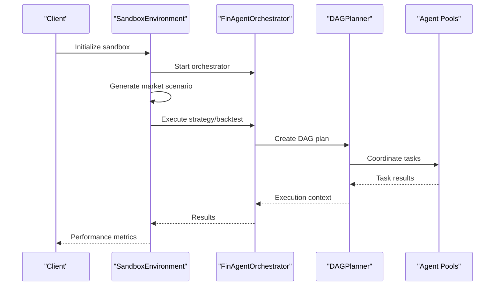
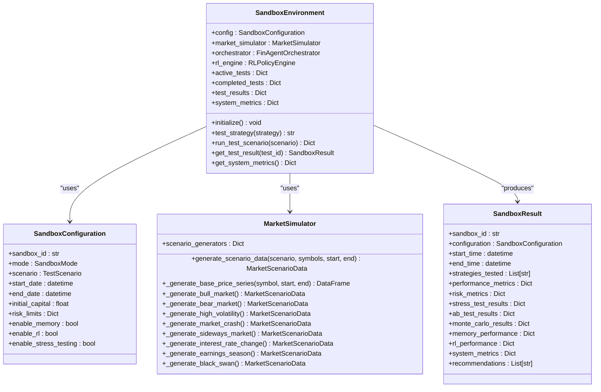
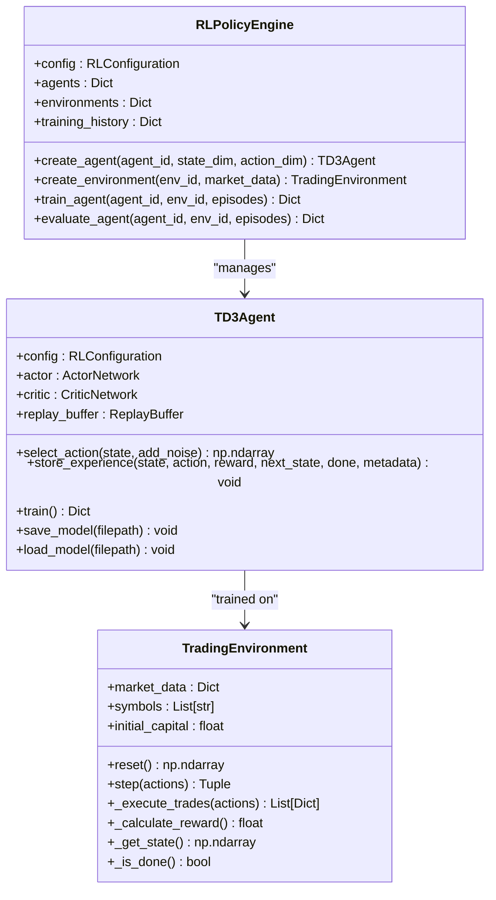
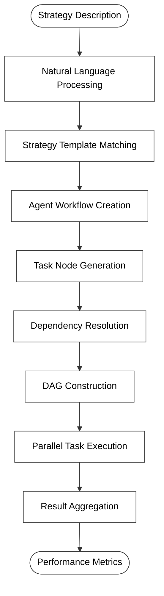
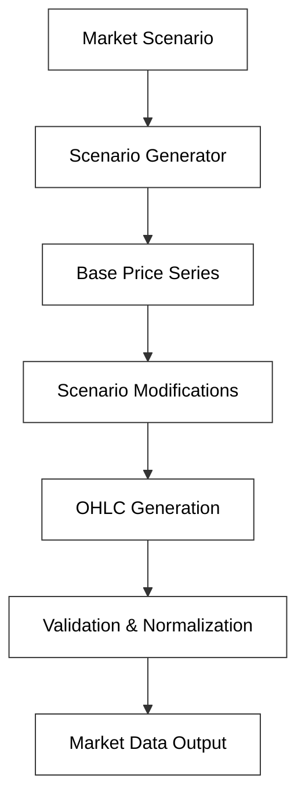
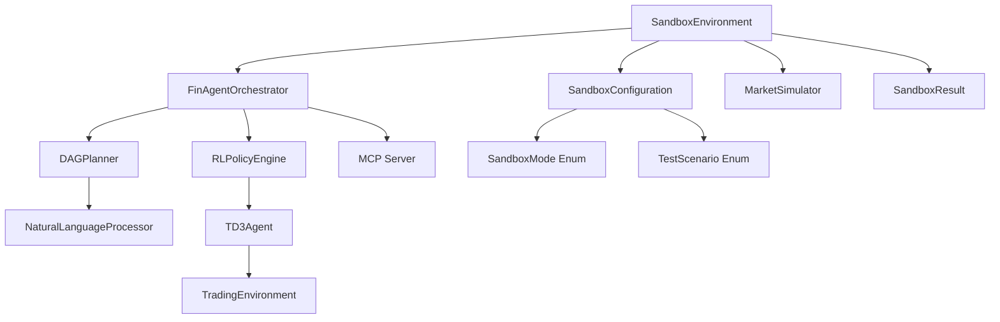

# Sandbox Environment Management

<cite>
**Referenced Files in This Document**
- [sandbox_environment.py](file://FinAgents/orchestrator/core/sandbox_environment.py)
- [finagent_orchestrator.py](file://FinAgents/orchestrator/core/finagent_orchestrator.py)
- [rl_policy_engine.py](file://FinAgents/orchestrator/core/rl_policy_engine.py)
- [dag_planner.py](file://FinAgents/orchestrator/core/dag_planner.py)
- [main_orchestrator.py](file://FinAgents/orchestrator/main_orchestrator.py)
- [orchestrator_config.yaml](file://FinAgents/orchestrator/config/orchestrator_config.yaml)
- [configuration_manager.py](file://FinAgents/memory/configuration_manager.py)
- [mcp_interface_specification.md](file://FinAgents/agent_pools/data_agent_pool/mcp_interface_specification.md)
- [deploy.sh](file://scripts/deploy.sh)
- [phase7_deployment_validation.py](file://tests/phase7_deployment_validation.py)
</cite>

## Table of Contents
1. [Introduction](#introduction)
2. [Project Structure](#project-structure)
3. [Core Components](#core-components)
4. [Architecture Overview](#architecture-overview)
5. [Detailed Component Analysis](#detailed-component-analysis)
6. [Dependency Analysis](#dependency-analysis)
7. [Performance Considerations](#performance-considerations)
8. [Security Considerations](#security-considerations)
9. [Troubleshooting Guide](#troubleshooting-guide)
10. [Conclusion](#conclusion)

## Introduction
This document provides comprehensive documentation for the sandbox environment system that enables isolated execution spaces for testing and validation of trading strategies. The sandbox integrates tightly with the orchestrator to support historical backtesting, live simulation, stress testing, A/B testing, and Monte Carlo simulations. It leverages reinforcement learning (RL) engines, memory agents, and MCP (Model Context Protocol) interfaces to deliver secure, reproducible, and scalable testing environments suitable for research, validation, and compliance verification.

## Project Structure
The sandbox environment is implemented within the orchestrator core and integrates with several subsystems:
- Sandbox environment orchestration and lifecycle management
- Market simulation engine for synthetic and scenario-based data
- RL policy engine for reinforcement learning-backed testing
- DAG planner for strategy decomposition and execution
- MCP-based agent pool integration for data, alpha, and execution agents
- Configuration management for environment-specific settings

**Diagram sources**
- [sandbox_environment.py:500-918](file://FinAgents/orchestrator/core/sandbox_environment.py#L500-L918)
- [finagent_orchestrator.py:106-800](file://FinAgents/orchestrator/core/finagent_orchestrator.py#L106-L800)
- [dag_planner.py:189-676](file://FinAgents/orchestrator/core/dag_planner.py#L189-L676)
- [rl_policy_engine.py:660-883](file://FinAgents/orchestrator/core/rl_policy_engine.py#L660-L883)

**Section sources**
- [sandbox_environment.py:1-918](file://FinAgents/orchestrator/core/sandbox_environment.py#L1-L918)
- [main_orchestrator.py:1-475](file://FinAgents/orchestrator/main_orchestrator.py#L1-L475)

## Core Components
The sandbox environment comprises several key components that work together to provide isolated, repeatable, and comprehensive testing:

- SandboxEnvironment: Manages sandbox lifecycle, orchestrates tests, and aggregates results
- MarketSimulator: Generates synthetic market data and scenario-based datasets
- SandboxConfiguration: Defines sandbox execution modes, risk limits, and performance benchmarks
- SandboxResult: Captures performance, risk, and system metrics for reporting
- RL Policy Engine: Provides reinforcement learning capabilities for policy training and evaluation
- DAG Planner: Decomposes strategies into executable task graphs with memory and LLM enhancements

These components integrate with MCP-based agent pools for data fetching, alpha generation, risk assessment, and execution, ensuring realistic and comprehensive testing scenarios.

**Section sources**
- [sandbox_environment.py:46-107](file://FinAgents/orchestrator/core/sandbox_environment.py#L46-L107)
- [rl_policy_engine.py:660-883](file://FinAgents/orchestrator/core/rl_policy_engine.py#L660-L883)
- [dag_planner.py:189-676](file://FinAgents/orchestrator/core/dag_planner.py#L189-L676)

## Architecture Overview
The sandbox architecture follows a layered design with clear separation of concerns:
- Presentation Layer: SandboxEnvironment and configuration management
- Execution Layer: MarketSimulator, DAGPlanner, and RL Policy Engine
- Integration Layer: MCP-based agent pool coordination
- Data Layer: Synthetic and scenario-based market data generation

**Diagram sources**
- [sandbox_environment.py:524-713](file://FinAgents/orchestrator/core/sandbox_environment.py#L524-L713)
- [finagent_orchestrator.py:288-420](file://FinAgents/orchestrator/core/finagent_orchestrator.py#L288-L420)
- [dag_planner.py:396-475](file://FinAgents/orchestrator/core/dag_planner.py#L396-L475)

## Detailed Component Analysis

### SandboxEnvironment Analysis
The SandboxEnvironment serves as the central coordinator for all sandbox activities, managing lifecycle, orchestration, and result aggregation.

**Diagram sources**
- [sandbox_environment.py:500-918](file://FinAgents/orchestrator/core/sandbox_environment.py#L500-L918)

#### Sandbox Modes and Scenarios
The sandbox supports multiple execution modes and predefined market scenarios:
- Historical Backtest: Validates strategies against historical data
- Live Simulation: Tests strategies in simulated real-time execution
- Stress Test: Evaluates resilience under adverse market conditions
- A/B Testing: Compares variant strategies statistically
- Monte Carlo: Performs probabilistic risk analysis

**Section sources**
- [sandbox_environment.py:46-118](file://FinAgents/orchestrator/core/sandbox_environment.py#L46-L118)

### RL Policy Engine Integration
The RL Policy Engine provides reinforcement learning capabilities for policy optimization and evaluation within the sandbox environment.

**Diagram sources**
- [rl_policy_engine.py:660-883](file://FinAgents/orchestrator/core/rl_policy_engine.py#L660-L883)

#### RL Configuration and Training
The RL engine supports multiple algorithms with configurable hyperparameters:
- TD3 (Twin Delayed Deep Deterministic Policy Gradient)
- SAC (Soft Actor-Critic)
- PPO (Proximal Policy Optimization)
- DDPG (Deep Deterministic Policy Gradient)

**Section sources**
- [rl_policy_engine.py:50-90](file://FinAgents/orchestrator/core/rl_policy_engine.py#L50-L90)
- [rl_policy_engine.py:692-757](file://FinAgents/orchestrator/core/rl_policy_engine.py#L692-L757)

### DAG Planner and Strategy Execution
The DAG Planner transforms natural language strategies into executable task graphs, coordinating multiple agent pools for comprehensive testing.

**Diagram sources**
- [dag_planner.py:286-475](file://FinAgents/orchestrator/core/dag_planner.py#L286-L475)

**Section sources**
- [dag_planner.py:189-676](file://FinAgents/orchestrator/core/dag_planner.py#L189-L676)

### Market Simulation Engine
The Market Simulator generates synthetic market data and scenario-based datasets for comprehensive testing across various market conditions.

**Diagram sources**
- [sandbox_environment.py:120-497](file://FinAgents/orchestrator/core/sandbox_environment.py#L120-L497)

#### Supported Market Scenarios
The simulator supports diverse market conditions:
- Bull Market: Uptrending markets with positive momentum
- Bear Market: Downtrending markets with negative momentum
- High Volatility: Markets with elevated price fluctuations
- Market Crash: Sudden sharp declines with recovery phases
- Sideways Market: Range-bound markets with mean reversion
- Interest Rate Change: Sector-specific impacts from monetary policy
- Earnings Season: Quarterly earnings surprises and reactions
- Black Swan: Rare, extreme market events

**Section sources**
- [sandbox_environment.py:120-497](file://FinAgents/orchestrator/core/sandbox_environment.py#L120-L497)

## Dependency Analysis
The sandbox environment has well-defined dependencies that ensure modularity and maintainability:

**Diagram sources**
- [sandbox_environment.py:500-918](file://FinAgents/orchestrator/core/sandbox_environment.py#L500-L918)
- [finagent_orchestrator.py:106-800](file://FinAgents/orchestrator/core/finagent_orchestrator.py#L106-L800)
- [dag_planner.py:189-676](file://FinAgents/orchestrator/core/dag_planner.py#L189-L676)
- [rl_policy_engine.py:660-883](file://FinAgents/orchestrator/core/rl_policy_engine.py#L660-L883)

**Section sources**
- [sandbox_environment.py:1-918](file://FinAgents/orchestrator/core/sandbox_environment.py#L1-L918)
- [finagent_orchestrator.py:1-800](file://FinAgents/orchestrator/core/finagent_orchestrator.py#L1-L800)

## Performance Considerations
The sandbox environment is designed with several performance optimization strategies:

### Resource Allocation Mechanisms
- Thread pool execution for concurrent task processing
- Configurable batch sizes for RL training and data processing
- Memory-efficient replay buffers with configurable capacity
- Asynchronous execution patterns for non-blocking operations

### Scaling Capabilities
- Horizontal scaling through multiple sandbox instances
- Configurable worker pools for task execution
- Load balancing across agent pools
- Caching mechanisms for frequently accessed data

### Performance Monitoring
- Built-in system metrics tracking
- Execution time measurement and reporting
- Memory usage monitoring
- Throughput calculations for task processing

**Section sources**
- [finagent_orchestrator.py:168-184](file://FinAgents/orchestrator/core/finagent_orchestrator.py#L168-L184)
- [rl_policy_engine.py:189-234](file://FinAgents/orchestrator/core/rl_policy_engine.py#L189-L234)

## Security Considerations
The sandbox environment implements multiple security measures to ensure data isolation and compliance:

### Containerization and Isolation
- Localhost-only orchestrator binding for sandbox environments
- Separate port assignments to prevent cross-contamination
- Process isolation through dedicated execution contexts
- Memory agent integration for secure data handling

### Data Protection
- Encrypted database connections in production environments
- API key management for external data providers
- Secure credential storage and rotation
- Audit logging for all sensitive operations

### Compliance Aspects
- Configurable logging levels per environment
- Structured logging for compliance reporting
- Data retention policies and cleanup procedures
- Environment-specific security configurations

**Section sources**
- [sandbox_environment.py:529-547](file://FinAgents/orchestrator/core/sandbox_environment.py#L529-L547)
- [configuration_manager.py:345-358](file://FinAgents/memory/configuration_manager.py#L345-L358)
- [orchestrator_config.yaml:296-313](file://FinAgents/orchestrator/config/orchestrator_config.yaml#L296-L313)

## Troubleshooting Guide
Common issues and their resolutions in the sandbox environment:

### Initialization Issues
- **Problem**: Sandbox fails to initialize
- **Solution**: Verify orchestrator connectivity and port availability
- **Diagnostic**: Check orchestrator logs and network connectivity

### Data Generation Problems
- **Problem**: Market data generation failures
- **Solution**: Validate scenario parameters and date ranges
- **Diagnostic**: Review MarketSimulator logs and data validation

### RL Training Failures
- **Problem**: RL agent training errors
- **Solution**: Check state/action dimension compatibility
- **Diagnostic**: Examine replay buffer contents and training metrics

### Performance Bottlenecks
- **Problem**: Slow execution times
- **Solution**: Optimize batch sizes and worker configurations
- **Diagnostic**: Monitor system metrics and resource utilization

**Section sources**
- [sandbox_environment.py:613-617](file://FinAgents/orchestrator/core/sandbox_environment.py#L613-L617)
- [finagent_orchestrator.py:220-223](file://FinAgents/orchestrator/core/finagent_orchestrator.py#L220-L223)

## Conclusion
The sandbox environment system provides a comprehensive, isolated testing platform for validating trading strategies across multiple market conditions. Its modular architecture, integrated RL capabilities, and MCP-based agent pool coordination enable thorough validation while maintaining security and compliance standards. The system's performance optimizations and scalability features make it suitable for both research and production validation scenarios.