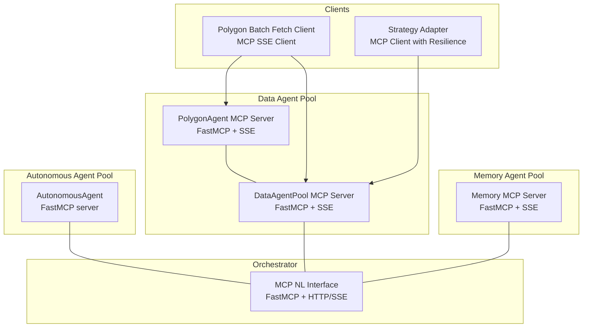
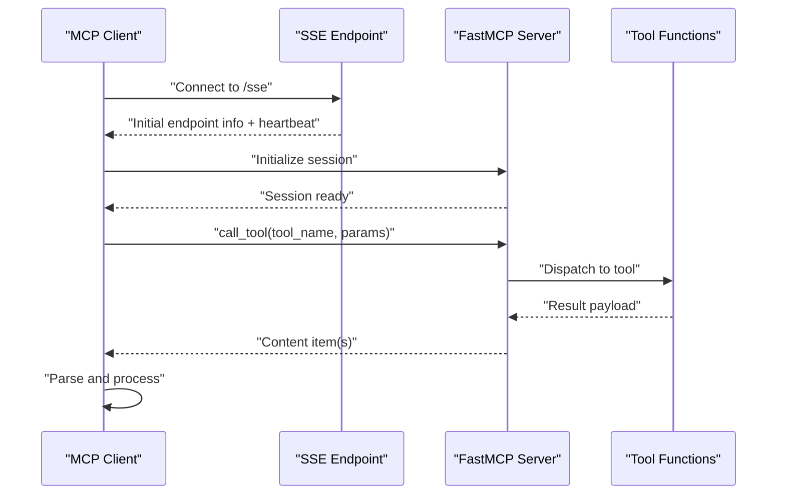
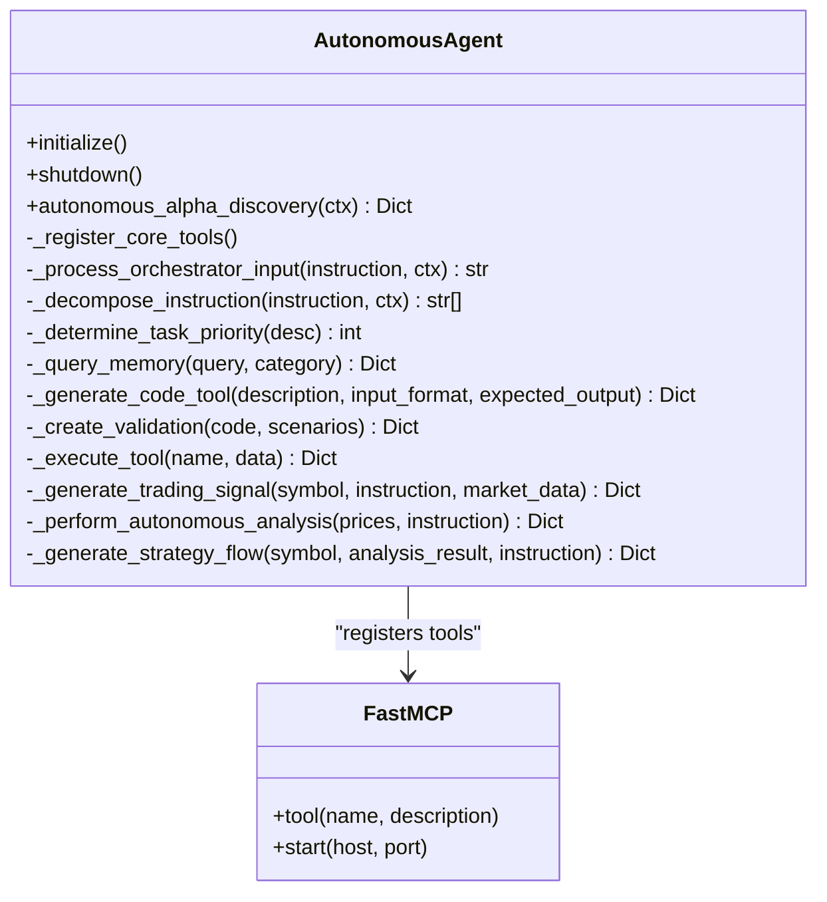
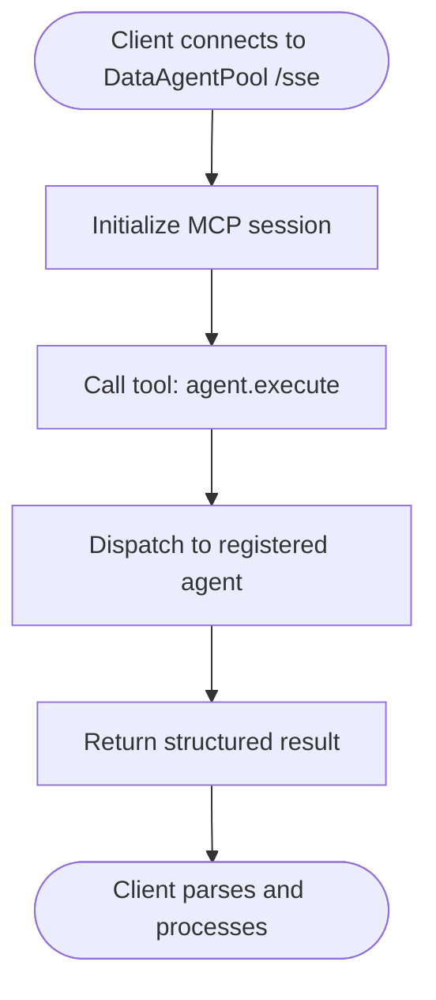
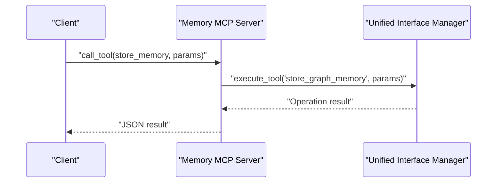
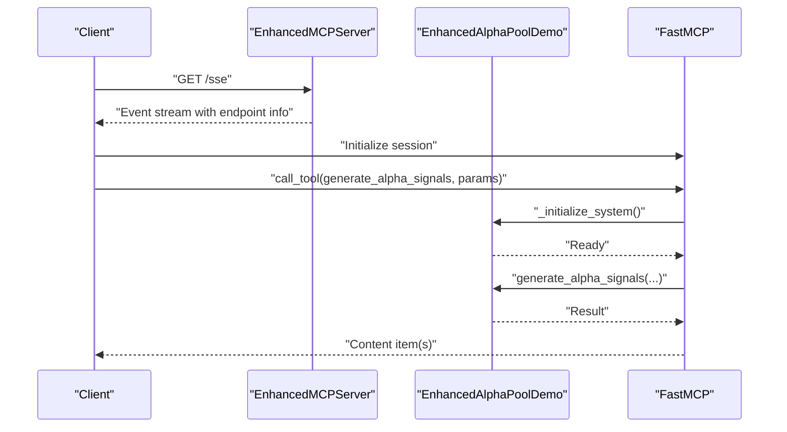
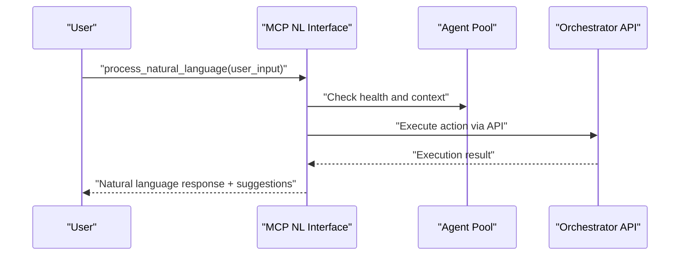
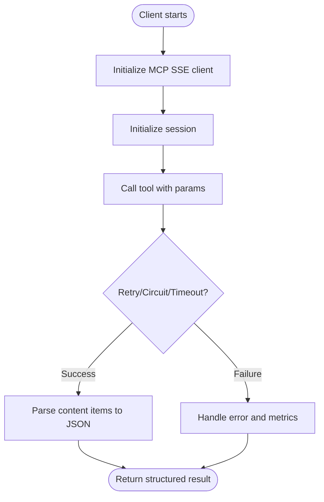
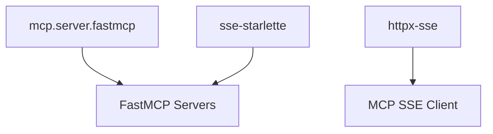

# Model Context Protocol (MCP)

<cite>
**Referenced Files in This Document**
- [autonomous_agent.py](file://FinAgents/agent_pools/alpha_agent_pool/agents/autonomous/autonomous_agent.py)
- [strategy_adapter.py](file://FinAgents/agent_pools/alpha_agent_pool/agents/adapters/mcp_client/strategy_adapter.py)
- [adapter.py](file://FinAgents/agent_pools/alpha_agent_pool/agents/adapters/mcp_server/adapter.py)
- [enhanced_mcp_server.py](file://FinAgents/agent_pools/alpha_agent_pool/enhanced_mcp_server.py)
- [real_mcp_client.py](file://FinAgents/agent_pools/alpha_agent_pool/real_mcp_client.py)
- [mcp_server.py](file://FinAgents/memory/mcp_server.py)
- [mcp_server.py](file://FinAgents/agent_pools/data_agent_pool/mcp_server.py)
- [mcp_config.yaml](file://FinAgents/agent_pools/alpha_agent_pool/mcp_config.yaml)
- [mcp_nl_interface.py](file://FinAgents/orchestrator/core/mcp_nl_interface.py)
- [polygon_batch_fetch_via_mcp.py](file://examples/polygon_batch_fetch_via_mcp.py)
- [uv.lock](file://uv.lock)
</cite>

## Table of Contents
1. [Introduction](#introduction)
2. [Project Structure](#project-structure)
3. [Core Components](#core-components)
4. [Architecture Overview](#architecture-overview)
5. [Detailed Component Analysis](#detailed-component-analysis)
6. [Dependency Analysis](#dependency-analysis)
7. [Performance Considerations](#performance-considerations)
8. [Troubleshooting Guide](#troubleshooting-guide)
9. [Conclusion](#conclusion)
10. [Appendices](#appendices)

## Introduction
This document describes the Model Context Protocol (MCP) communication framework used across the FinAgent ecosystem. It explains how MCP servers expose tools, how clients connect and invoke tools over Server-Sent Events (SSE), and how tool definitions, parameter validation, and response formatting are implemented. It also covers SSE integration, message serialization, error handling strategies, security considerations, rate limiting, and performance optimization techniques. Practical examples demonstrate custom MCP tool development and client–server communication patterns, along with debugging techniques.

## Project Structure
The MCP ecosystem spans multiple agent pools and orchestrator components:
- Autonomous agent exposes MCP tools for self-orchestrated tasks.
- Data agent pool coordinates market data agents and exposes MCP tools for market queries and batch operations.
- Memory agent pool provides graph memory tools via MCP.
- Orchestrator integrates a natural language interface that speaks MCP to coordinate agent pools.
- Example scripts demonstrate client usage with proper MCP SSE clients.

**Diagram sources**
- [autonomous_agent.py:83-436](file://FinAgents/agent_pools/alpha_agent_pool/agents/autonomous/autonomous_agent.py#L83-L436)
- [mcp_server.py:10-68](file://FinAgents/agent_pools/data_agent_pool/mcp_server.py#L10-L68)
- [mcp_server.py:130-290](file://FinAgents/memory/mcp_server.py#L130-L290)
- [mcp_nl_interface.py:42-413](file://FinAgents/orchestrator/core/mcp_nl_interface.py#L42-L413)
- [polygon_batch_fetch_via_mcp.py:31-311](file://examples/polygon_batch_fetch_via_mcp.py#L31-L311)
- [strategy_adapter.py:24-202](file://FinAgents/agent_pools/alpha_agent_pool/agents/adapters/mcp_client/strategy_adapter.py#L24-L202)

**Section sources**
- [autonomous_agent.py:83-436](file://FinAgents/agent_pools/alpha_agent_pool/agents/autonomous/autonomous_agent.py#L83-L436)
- [mcp_server.py:10-68](file://FinAgents/agent_pools/data_agent_pool/mcp_server.py#L10-L68)
- [mcp_server.py:130-290](file://FinAgents/memory/mcp_server.py#L130-L290)
- [mcp_nl_interface.py:42-413](file://FinAgents/orchestrator/core/mcp_nl_interface.py#L42-L413)
- [polygon_batch_fetch_via_mcp.py:31-311](file://examples/polygon_batch_fetch_via_mcp.py#L31-L311)
- [strategy_adapter.py:24-202](file://FinAgents/agent_pools/alpha_agent_pool/agents/adapters/mcp_client/strategy_adapter.py#L24-L202)

## Core Components
- MCP Server Implementations
  - Autonomous agent MCP server with tool decorators for orchestrator input, memory queries, code generation, validation, task status, tool execution, and strategy signal generation.
  - Data agent pool MCP server with tools for agent execution, registration, heartbeats, and export of a streamable HTTP app.
  - Memory agent pool MCP server with tools for memory storage, retrieval, semantic search, statistics, health checks, and relationship creation.
  - Enhanced MCP server with additional HTTP endpoints (/, /health, /status, /info, /tools, /sse) and tool definitions for alpha signal generation, factor discovery, strategy configuration, backtesting, and memory submission.
  - Natural Language Interface MCP server that translates natural language into actionable orchestrator commands and executes them against agent pools.

- MCP Client Implementations
  - Strategy adapter client with retry, circuit breaker, and timeout policies, plus observability counters and histograms.
  - Real MCP client that exercises the enhanced MCP server’s tools and validates end-to-end functionality.
  - Example polygon batch fetch client using proper MCP SSE client libraries to call tools on DataAgentPool and PolygonAgent.

- Configuration
  - YAML configuration specifying MCP server endpoints and transport (SSE).

**Section sources**
- [autonomous_agent.py:317-436](file://FinAgents/agent_pools/alpha_agent_pool/agents/autonomous/autonomous_agent.py#L317-L436)
- [mcp_server.py:10-68](file://FinAgents/agent_pools/data_agent_pool/mcp_server.py#L10-L68)
- [mcp_server.py:142-287](file://FinAgents/memory/mcp_server.py#L142-L287)
- [enhanced_mcp_server.py:222-335](file://FinAgents/agent_pools/alpha_agent_pool/enhanced_mcp_server.py#L222-L335)
- [mcp_nl_interface.py:59-251](file://FinAgents/orchestrator/core/mcp_nl_interface.py#L59-L251)
- [strategy_adapter.py:24-202](file://FinAgents/agent_pools/alpha_agent_pool/agents/adapters/mcp_client/strategy_adapter.py#L24-L202)
- [real_mcp_client.py:14-72](file://FinAgents/agent_pools/alpha_agent_pool/real_mcp_client.py#L14-L72)
- [polygon_batch_fetch_via_mcp.py:31-311](file://examples/polygon_batch_fetch_via_mcp.py#L31-L311)
- [mcp_config.yaml:1-6](file://FinAgents/agent_pools/alpha_agent_pool/mcp_config.yaml#L1-L6)

## Architecture Overview
The MCP architecture centers around FastMCP servers exposing tools that clients invoke over SSE. Clients use the MCP SSE client library to establish a streaming connection, initialize the session, and call tools. Responses are returned as structured content items that clients parse into JSON.

**Diagram sources**
- [polygon_batch_fetch_via_mcp.py:70-98](file://examples/polygon_batch_fetch_via_mcp.py#L70-L98)
- [mcp_server.py:10-68](file://FinAgents/agent_pools/data_agent_pool/mcp_server.py#L10-L68)
- [mcp_server.py:130-290](file://FinAgents/memory/mcp_server.py#L130-L290)

**Section sources**
- [polygon_batch_fetch_via_mcp.py:70-98](file://examples/polygon_batch_fetch_via_mcp.py#L70-L98)
- [mcp_server.py:10-68](file://FinAgents/agent_pools/data_agent_pool/mcp_server.py#L10-L68)
- [mcp_server.py:130-290](file://FinAgents/memory/mcp_server.py#L130-L290)

## Detailed Component Analysis

### Autonomous Agent MCP Server
- Purpose: Self-orchestrating agent that exposes tools for receiving orchestrator inputs, querying memory, generating and validating analysis tools, managing tasks, and producing strategy flows.
- Tool Registration: Uses FastMCP decorators to register tools with names, descriptions, and typed parameters.
- Behavior: Implements validation, persistence, and structured output generation for strategy flows compatible with the alpha agent ecosystem.

**Diagram sources**
- [autonomous_agent.py:52-436](file://FinAgents/agent_pools/alpha_agent_pool/agents/autonomous/autonomous_agent.py#L52-L436)

**Section sources**
- [autonomous_agent.py:52-436](file://FinAgents/agent_pools/alpha_agent_pool/agents/autonomous/autonomous_agent.py#L52-L436)

### Data Agent Pool MCP Server
- Purpose: Coordinates market data agents and exposes tools for agent execution, registration, heartbeats, and batch market data fetching.
- SSE Integration: Exposes a streamable HTTP app suitable for MCP over SSE.
- Tool Definitions: agent.execute, register://{agent_id}, heartbeat://{agent_id}.

**Diagram sources**
- [mcp_server.py:10-68](file://FinAgents/agent_pools/data_agent_pool/mcp_server.py#L10-L68)

**Section sources**
- [mcp_server.py:10-68](file://FinAgents/agent_pools/data_agent_pool/mcp_server.py#L10-L68)

### Memory Agent Pool MCP Server
- Purpose: Dedicated MCP server for memory operations with unified database integration.
- Tools: store_memory, retrieve_memory, semantic_search, get_statistics, health_check, create_relationship.
- SSE + HTTP: Provides both MCP protocol and additional HTTP endpoints (/, /health).

**Diagram sources**
- [mcp_server.py:142-176](file://FinAgents/memory/mcp_server.py#L142-L176)

**Section sources**
- [mcp_server.py:142-176](file://FinAgents/memory/mcp_server.py#L142-L176)

### Enhanced MCP Server (Alpha Agent Pool)
- Purpose: Extended MCP server with additional HTTP endpoints and tool definitions for alpha signal generation, factor discovery, strategy configuration, backtesting, and memory submission.
- SSE Endpoint: /sse streams endpoint info and periodic heartbeats.
- Tools: generate_alpha_signals, discover_alpha_factors, develop_strategy_configuration, run_comprehensive_backtest, submit_strategy_to_memory, run_integrated_backtest, validate_strategy_performance.

**Diagram sources**
- [enhanced_mcp_server.py:200-221](file://FinAgents/agent_pools/alpha_agent_pool/enhanced_mcp_server.py#L200-L221)
- [enhanced_mcp_server.py:222-335](file://FinAgents/agent_pools/alpha_agent_pool/enhanced_mcp_server.py#L222-L335)

**Section sources**
- [enhanced_mcp_server.py:200-221](file://FinAgents/agent_pools/alpha_agent_pool/enhanced_mcp_server.py#L200-L221)
- [enhanced_mcp_server.py:222-335](file://FinAgents/agent_pools/alpha_agent_pool/enhanced_mcp_server.py#L222-L335)

### MCP Natural Language Interface
- Purpose: Bridges natural language requests to agent pool actions via MCP tools.
- Tools: process_natural_language, chat_with_system, execute_strategy_from_description, get_system_status_summary.
- Integration: Probes agent pool health endpoints and orchestrates actions by calling orchestrator APIs.

**Diagram sources**
- [mcp_nl_interface.py:59-251](file://FinAgents/orchestrator/core/mcp_nl_interface.py#L59-L251)
- [mcp_nl_interface.py:354-378](file://FinAgents/orchestrator/core/mcp_nl_interface.py#L354-L378)

**Section sources**
- [mcp_nl_interface.py:59-251](file://FinAgents/orchestrator/core/mcp_nl_interface.py#L59-L251)
- [mcp_nl_interface.py:354-378](file://FinAgents/orchestrator/core/mcp_nl_interface.py#L354-L378)

### MCP Client Adapters and Examples
- Strategy Adapter: Wraps MCP tool invocation with retry, circuit breaker, timeout, and observability.
- Real MCP Client: Exercises enhanced MCP server tools and validates end-to-end functionality.
- Polygon Batch Fetch Client: Demonstrates proper MCP SSE client usage to call tools on DataAgentPool and PolygonAgent.

**Diagram sources**
- [strategy_adapter.py:85-158](file://FinAgents/agent_pools/alpha_agent_pool/agents/adapters/mcp_client/strategy_adapter.py#L85-L158)
- [real_mcp_client.py:29-72](file://FinAgents/agent_pools/alpha_agent_pool/real_mcp_client.py#L29-L72)
- [polygon_batch_fetch_via_mcp.py:70-98](file://examples/polygon_batch_fetch_via_mcp.py#L70-L98)

**Section sources**
- [strategy_adapter.py:85-158](file://FinAgents/agent_pools/alpha_agent_pool/agents/adapters/mcp_client/strategy_adapter.py#L85-L158)
- [real_mcp_client.py:29-72](file://FinAgents/agent_pools/alpha_agent_pool/real_mcp_client.py#L29-L72)
- [polygon_batch_fetch_via_mcp.py:70-98](file://examples/polygon_batch_fetch_via_mcp.py#L70-L98)

## Dependency Analysis
External dependencies relevant to MCP:
- mcp.server.fastmcp: FastMCP server implementation.
- httpx-sse: Server-sent events client for MCP.
- sse-starlette: SSE support for Starlette applications.

**Diagram sources**
- [uv.lock:142-148](file://uv.lock#L142-L148)
- [uv.lock:388-398](file://uv.lock#L388-L398)

**Section sources**
- [uv.lock:142-148](file://uv.lock#L142-L148)
- [uv.lock:388-398](file://uv.lock#L388-L398)

## Performance Considerations
- SSE Streaming: Use long-lived SSE connections to reduce overhead and enable real-time updates.
- Content Parsing: Ensure clients parse content items efficiently; avoid unnecessary JSON parsing loops.
- Retry and Backoff: Apply exponential backoff with jitter to prevent thundering herds during transient failures.
- Circuit Breaker: Protect upstream services from cascading failures by tripping under sustained errors.
- Timeout Policies: Enforce per-call timeouts to bound latency and resource usage.
- Rate Limiting: Implement client-side throttling (as seen in example scripts) to respect server limits.
- Observability: Track execution durations and failure rates to identify bottlenecks.

[No sources needed since this section provides general guidance]

## Troubleshooting Guide
- SSE Connectivity
  - Verify server endpoints and transports in configuration.
  - Confirm SSE endpoints are reachable and emit heartbeats.
- Tool Invocation
  - Ensure tools are registered and callable; check tool names and parameter schemas.
  - Parse content items correctly; handle missing or malformed content.
- Error Handling
  - Use circuit breaker states and retry logs to diagnose transient vs persistent failures.
  - Inspect observability metrics for execution durations and failure counts.
- Health Checks
  - Use /health endpoints to validate service readiness.
  - For MCP servers, confirm tool availability and database connectivity.

**Section sources**
- [mcp_config.yaml:1-6](file://FinAgents/agent_pools/alpha_agent_pool/mcp_config.yaml#L1-L6)
- [enhanced_mcp_server.py:200-221](file://FinAgents/agent_pools/alpha_agent_pool/enhanced_mcp_server.py#L200-L221)
- [strategy_adapter.py:122-158](file://FinAgents/agent_pools/alpha_agent_pool/agents/adapters/mcp_client/strategy_adapter.py#L122-L158)

## Conclusion
The FinAgent ecosystem leverages MCP as a unified protocol for exposing tools and orchestrating agent interactions. Servers built with FastMCP provide robust SSE transport, while clients use dedicated adapters and example scripts to invoke tools reliably. The architecture emphasizes resilience, observability, and extensibility, enabling autonomous agents, data coordination, memory management, and natural language-driven orchestration.

[No sources needed since this section summarizes without analyzing specific files]

## Appendices

### MCP Tool Definition Patterns
- Parameter Validation: Validate required fields and types before processing.
- Response Formatting: Return structured dictionaries or JSON-encoded strings consistently.
- Error Propagation: Raise or return errors with descriptive messages for clients to handle.

**Section sources**
- [autonomous_agent.py:456-480](file://FinAgents/agent_pools/alpha_agent_pool/agents/autonomous/autonomous_agent.py#L456-L480)
- [mcp_server.py:156-176](file://FinAgents/memory/mcp_server.py#L156-L176)

### Security Considerations
- Transport Security: Prefer HTTPS for production deployments.
- Authentication: Integrate authentication at reverse proxy or within MCP server if required.
- Authorization: Scope tool access to authorized callers; validate inputs rigorously.
- CORS: Configure CORS appropriately for web-based clients.

[No sources needed since this section provides general guidance]

### Rate Limiting Strategies
- Client-side Throttling: Space out requests to avoid overwhelming servers.
- Server-side Limits: Enforce quotas and backpressure policies at the MCP server.
- Adaptive Retries: Adjust retry delays based on server load and error types.

**Section sources**
- [polygon_batch_fetch_via_mcp.py:282](file://examples/polygon_batch_fetch_via_mcp.py#L282)