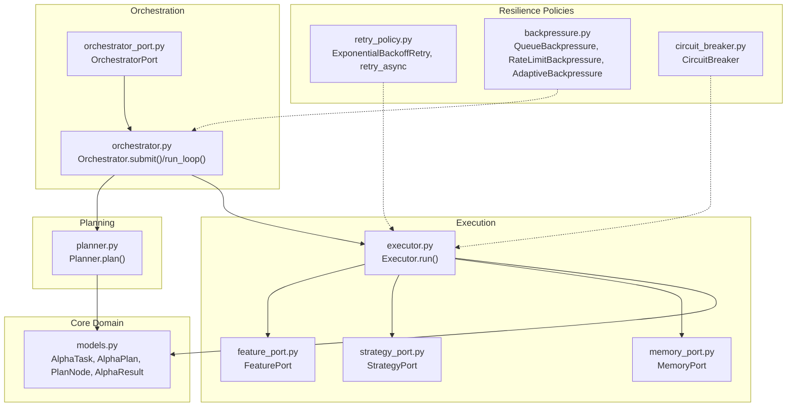
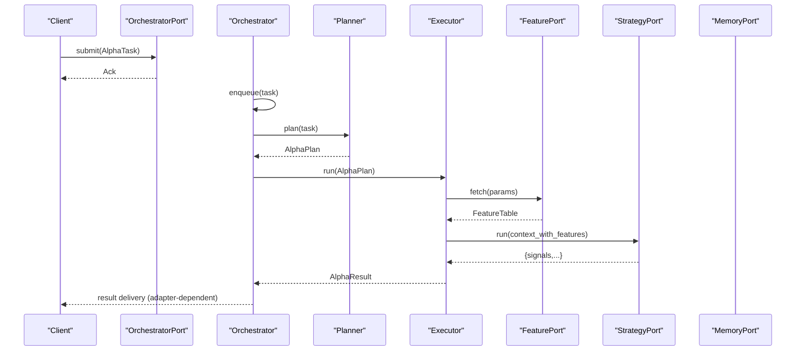
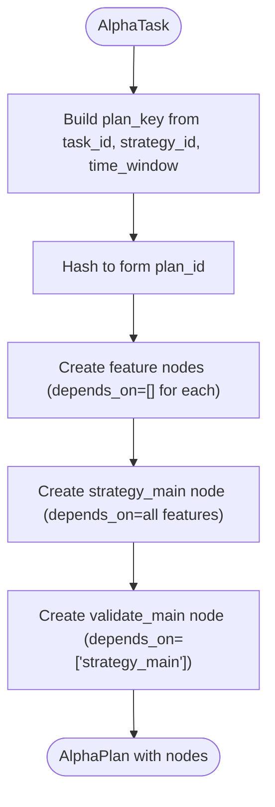
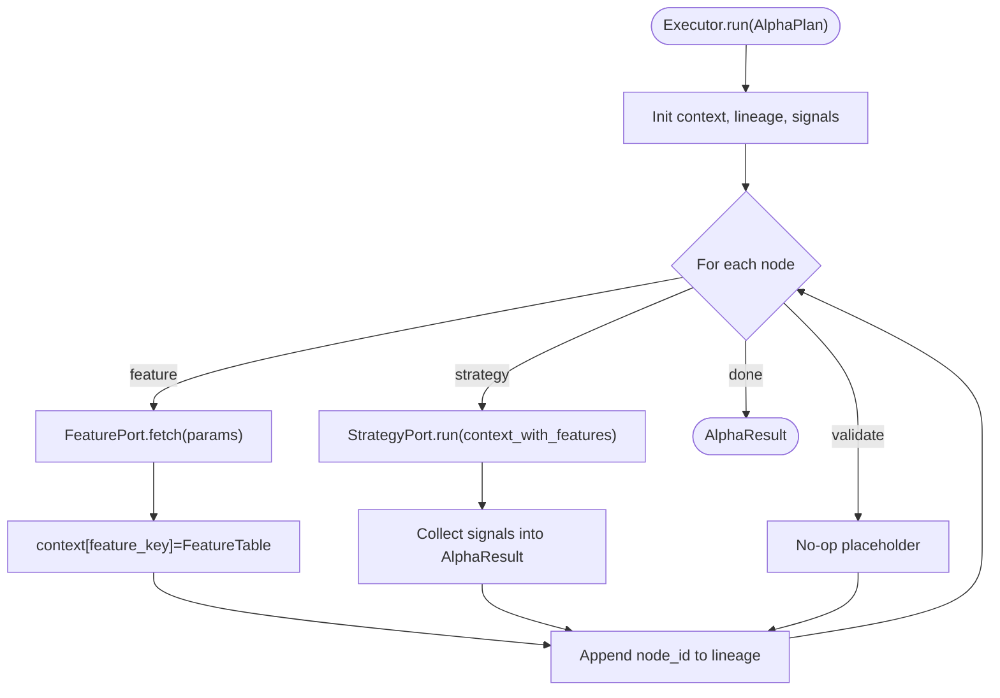
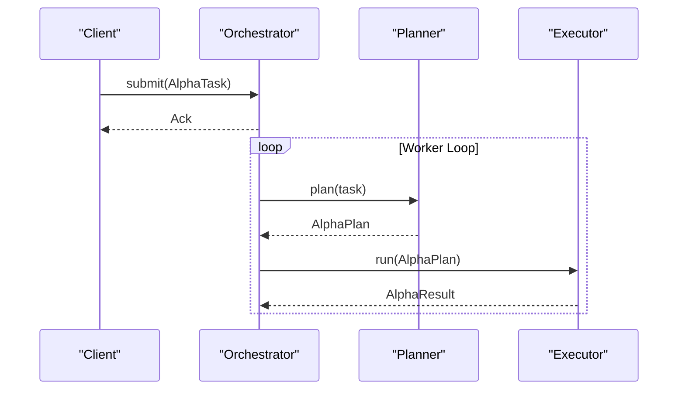
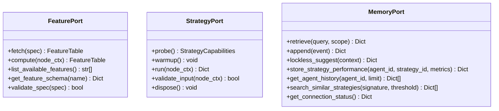
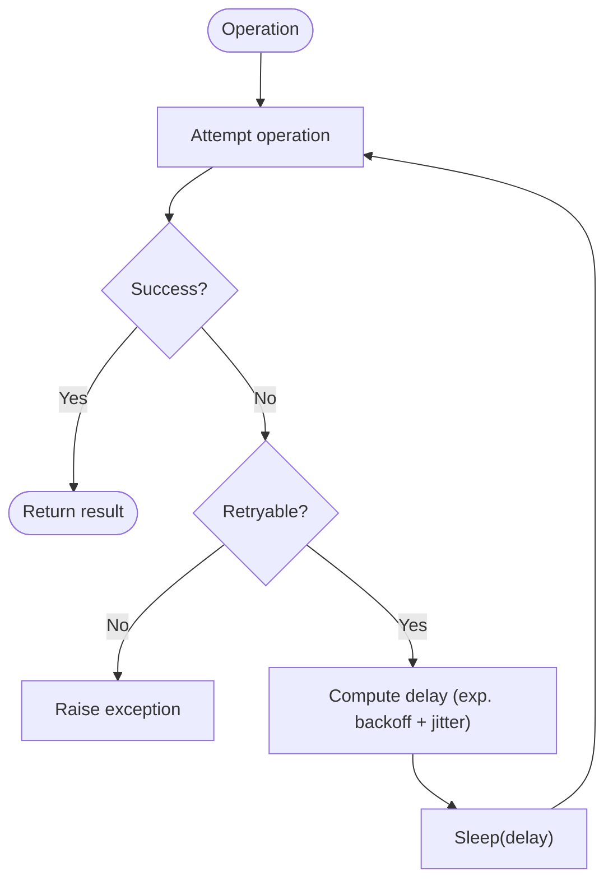
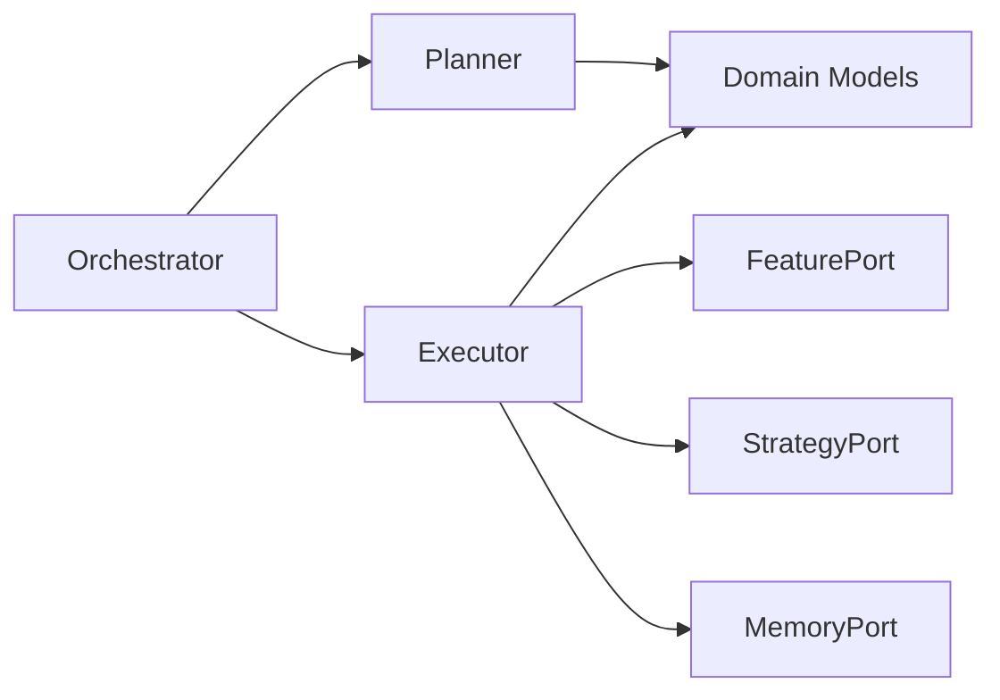

# Task Execution and Workflow Management

<cite>
**Referenced Files in This Document**
- [planner.py](file://FinAgents/agent_pools/alpha_agent_pool/core/services/planner.py)
- [executor.py](file://FinAgents/agent_pools/alpha_agent_pool/core/services/executor.py)
- [orchestrator.py](file://FinAgents/agent_pools/alpha_agent_pool/core/services/orchestrator.py)
- [models.py](file://FinAgents/agent_pools/alpha_agent_pool/core/domain/models.py)
- [orchestrator_port.py](file://FinAgents/agent_pools/alpha_agent_pool/core/ports/orchestrator.py)
- [feature_port.py](file://FinAgents/agent_pools/alpha_agent_pool/corepkg/ports/feature.py)
- [strategy_port.py](file://FinAgents/agent_pools/alpha_agent_pool/corepkg/ports/strategy.py)
- [memory_port.py](file://FinAgents/agent_pools/alpha_agent_pool/corepkg/ports/memory.py)
- [retry_policy.py](file://FinAgents/agent_pools/alpha_agent_pool/corepkg/policies/retry_policy.py)
- [backpressure.py](file://FinAgents/agent_pools/alpha_agent_pool/corepkg/policies/backpressure.py)
- [circuit_breaker.py](file://FinAgents/agent_pools/alpha_agent_pool/corepkg/policies/circuit_breaker.py)
- [test_core_functionality.py](file://FinAgents/agent_pools/alpha_agent_pool/tests/test_core_functionality.py)
</cite>

## Table of Contents
1. [Introduction](#introduction)
2. [Project Structure](#project-structure)
3. [Core Components](#core-components)
4. [Architecture Overview](#architecture-overview)
5. [Detailed Component Analysis](#detailed-component-analysis)
6. [Dependency Analysis](#dependency-analysis)
7. [Performance Considerations](#performance-considerations)
8. [Troubleshooting Guide](#troubleshooting-guide)
9. [Conclusion](#conclusion)
10. [Appendices](#appendices)

## Introduction
This document explains the task execution and workflow management system that orchestrates complex multi-agent operations. It focuses on the Directed Acyclic Graph (DAG) planner, task dependency resolution, execution context management, scheduling and parallelism strategies, resource allocation, workflow orchestration patterns, error propagation and recovery, integration with memory systems, real-time adaptation, and persistence mechanisms. The system is designed around a queue-backed orchestrator that plans tasks into deterministic DAGs and executes them asynchronously through pluggable ports for features, strategies, and memory.

## Project Structure
The workflow system resides primarily under the alpha agent pool’s core services and domain models, with policy and port abstractions supporting resilience and extensibility. The orchestrator coordinates planning and execution, while the planner constructs a DAG from task metadata and feature requirements. The executor resolves dependencies and invokes ports to produce results.

**Diagram sources**
- [models.py:7-70](file://FinAgents/agent_pools/alpha_agent_pool/core/domain/models.py#L7-L70)
- [planner.py:9-49](file://FinAgents/agent_pools/alpha_agent_pool/core/services/planner.py#L9-L49)
- [executor.py:12-56](file://FinAgents/agent_pools/alpha_agent_pool/core/services/executor.py#L12-L56)
- [feature_port.py:38-109](file://FinAgents/agent_pools/alpha_agent_pool/corepkg/ports/feature.py#L38-L109)
- [strategy_port.py:22-88](file://FinAgents/agent_pools/alpha_agent_pool/corepkg/ports/strategy.py#L22-L88)
- [memory_port.py:6-105](file://FinAgents/agent_pools/alpha_agent_pool/corepkg/ports/memory.py#L6-L105)
- [orchestrator.py:13-66](file://FinAgents/agent_pools/alpha_agent_pool/core/services/orchestrator.py#L13-L66)
- [orchestrator_port.py:8-17](file://FinAgents/agent_pools/alpha_agent_pool/core/ports/orchestrator.py#L8-L17)
- [retry_policy.py:12-164](file://FinAgents/agent_pools/alpha_agent_pool/corepkg/policies/retry_policy.py#L12-L164)
- [backpressure.py:17-164](file://FinAgents/agent_pools/alpha_agent_pool/corepkg/policies/backpressure.py#L17-L164)
- [circuit_breaker.py:23-42](file://FinAgents/agent_pools/alpha_agent_pool/corepkg/policies/circuit_breaker.py#L23-L42)

**Section sources**
- [planner.py:9-49](file://FinAgents/agent_pools/alpha_agent_pool/core/services/planner.py#L9-L49)
- [executor.py:12-56](file://FinAgents/agent_pools/alpha_agent_pool/core/services/executor.py#L12-L56)
- [orchestrator.py:13-66](file://FinAgents/agent_pools/alpha_agent_pool/core/services/orchestrator.py#L13-L66)
- [models.py:7-70](file://FinAgents/agent_pools/alpha_agent_pool/core/domain/models.py#L7-L70)
- [orchestrator_port.py:8-17](file://FinAgents/agent_pools/alpha_agent_pool/core/ports/orchestrator.py#L8-L17)
- [feature_port.py:38-109](file://FinAgents/agent_pools/alpha_agent_pool/corepkg/ports/feature.py#L38-L109)
- [strategy_port.py:22-88](file://FinAgents/agent_pools/alpha_agent_pool/corepkg/ports/strategy.py#L22-L88)
- [memory_port.py:6-105](file://FinAgents/agent_pools/alpha_agent_pool/corepkg/ports/memory.py#L6-L105)
- [retry_policy.py:12-164](file://FinAgents/agent_pools/alpha_agent_pool/corepkg/policies/retry_policy.py#L12-L164)
- [backpressure.py:17-164](file://FinAgents/agent_pools/alpha_agent_pool/corepkg/policies/backpressure.py#L17-L164)
- [circuit_breaker.py:23-42](file://FinAgents/agent_pools/alpha_agent_pool/corepkg/policies/circuit_breaker.py#L23-L42)

## Core Components
- Planner: Builds a deterministic DAG from an AlphaTask, sequencing feature retrieval before strategy execution and adding a validation node dependent on strategy output.
- Executor: Executes the DAG nodes asynchronously, maintaining execution context and collecting signals, with basic error handling and backoff.
- Orchestrator: Provides synchronous intake semantics via a queue and runs a background worker that plans tasks and executes them asynchronously.
- Ports: FeaturePort for data retrieval/computation, StrategyPort for alpha factor generation, and MemoryPort for distributed memory operations.
- Domain Models: Immutable data structures representing tasks, plans, nodes, results, and acknowledgments.
- Resilience Policies: Retry (exponential backoff), backpressure (queue/rate/adapt), and circuit breaker for fault tolerance.

**Section sources**
- [planner.py:9-49](file://FinAgents/agent_pools/alpha_agent_pool/core/services/planner.py#L9-L49)
- [executor.py:12-56](file://FinAgents/agent_pools/alpha_agent_pool/core/services/executor.py#L12-L56)
- [orchestrator.py:13-66](file://FinAgents/agent_pools/alpha_agent_pool/core/services/orchestrator.py#L13-L66)
- [models.py:7-70](file://FinAgents/agent_pools/alpha_agent_pool/core/domain/models.py#L7-L70)
- [feature_port.py:38-109](file://FinAgents/agent_pools/alpha_agent_pool/corepkg/ports/feature.py#L38-L109)
- [strategy_port.py:22-88](file://FinAgents/agent_pools/alpha_agent_pool/corepkg/ports/strategy.py#L22-L88)
- [memory_port.py:6-105](file://FinAgents/agent_pools/alpha_agent_pool/corepkg/ports/memory.py#L6-L105)
- [retry_policy.py:12-164](file://FinAgents/agent_pools/alpha_agent_pool/corepkg/policies/retry_policy.py#L12-L164)
- [backpressure.py:17-164](file://FinAgents/agent_pools/alpha_agent_pool/corepkg/policies/backpressure.py#L17-L164)
- [circuit_breaker.py:23-42](file://FinAgents/agent_pools/alpha_agent_pool/corepkg/policies/circuit_breaker.py#L23-L42)

## Architecture Overview
The system follows a queue-driven orchestration pattern:
- Clients submit tasks synchronously via the OrchestratorPort interface.
- The orchestrator enqueues tasks and delegates planning and execution to the Planner and Executor.
- The Planner produces a deterministic DAG with explicit dependencies.
- The Executor resolves dependencies and invokes ports, aggregating results into AlphaResult.
- Resilience policies govern retries, load management, and fault tolerance.

**Diagram sources**
- [orchestrator.py:53-55](file://FinAgents/agent_pools/alpha_agent_pool/core/services/orchestrator.py#L53-L55)
- [planner.py:12-49](file://FinAgents/agent_pools/alpha_agent_pool/core/services/planner.py#L12-L49)
- [executor.py:24-56](file://FinAgents/agent_pools/alpha_agent_pool/core/services/executor.py#L24-L56)
- [feature_port.py:45-58](file://FinAgents/agent_pools/alpha_agent_pool/corepkg/ports/feature.py#L45-L58)
- [strategy_port.py:46-66](file://FinAgents/agent_pools/alpha_agent_pool/corepkg/ports/strategy.py#L46-L66)
- [memory_port.py:13-42](file://FinAgents/agent_pools/alpha_agent_pool/corepkg/ports/memory.py#L13-L42)

## Detailed Component Analysis

### Planner: DAG Construction and Dependency Resolution
- Purpose: Convert an AlphaTask into a deterministic AlphaPlan DAG.
- Nodes:
  - Feature nodes: One per requested feature; no upstream dependencies.
  - Strategy node: Depends on all feature nodes.
  - Validation node: Depends on the strategy node.
- Deterministic plan_id: Derived from task identity and time window to enable caching and idempotent reprocessing.
- Dependency resolution: The DAG encodes strict ordering: features → strategy → validation.

**Diagram sources**
- [planner.py:10-49](file://FinAgents/agent_pools/alpha_agent_pool/core/services/planner.py#L10-L49)

**Section sources**
- [planner.py:9-49](file://FinAgents/agent_pools/alpha_agent_pool/core/services/planner.py#L9-L49)
- [models.py:19-33](file://FinAgents/agent_pools/alpha_agent_pool/core/domain/models.py#L19-L33)

### Executor: Execution Context, Parallelism, and Result Aggregation
- Execution model: Iterates through nodes in order, building a shared execution context keyed by feature identifiers.
- Feature execution: Calls FeaturePort.fetch with node parameters; stores results in context.
- Strategy execution: Calls StrategyPort.run with merged node parameters and context; aggregates signals into AlphaResult.
- Validation: Placeholder for consistency checks; currently no-op.
- Error handling: Catches exceptions during node execution, applies small delay, and continues to preserve pipeline throughput.
- Parallelism: The current implementation is single-threaded async execution. Parallelism across nodes is not implemented in the executor; dependencies enforce sequential execution.

**Diagram sources**
- [executor.py:20-56](file://FinAgents/agent_pools/alpha_agent_pool/core/services/executor.py#L20-L56)
- [feature_port.py:45-58](file://FinAgents/agent_pools/alpha_agent_pool/corepkg/ports/feature.py#L45-L58)
- [strategy_port.py:46-66](file://FinAgents/agent_pools/alpha_agent_pool/corepkg/ports/strategy.py#L46-L66)
- [models.py:35-62](file://FinAgents/agent_pools/alpha_agent_pool/core/domain/models.py#L35-L62)

**Section sources**
- [executor.py:12-56](file://FinAgents/agent_pools/alpha_agent_pool/core/services/executor.py#L12-L56)
- [feature_port.py:38-109](file://FinAgents/agent_pools/alpha_agent_pool/corepkg/ports/feature.py#L38-L109)
- [strategy_port.py:22-88](file://FinAgents/agent_pools/alpha_agent_pool/corepkg/ports/strategy.py#L22-L88)
- [models.py:35-62](file://FinAgents/agent_pools/alpha_agent_pool/core/domain/models.py#L35-L62)

### Orchestrator: Scheduling, Threading, and Idempotent Intake
- Synchronous intake: submit returns an Ack immediately, decoupling client from execution duration.
- Background worker: Runs an asyncio event loop, dequeues tasks, plans them, and executes them asynchronously.
- Error containment: Exceptions during planning/execution are caught and logged; queue task completion is ensured.
- Lifecycle: stop sets a stop event and waits for worker thread termination.

**Diagram sources**
- [orchestrator.py:33-51](file://FinAgents/agent_pools/alpha_agent_pool/core/services/orchestrator.py#L33-L51)
- [planner.py:12-49](file://FinAgents/agent_pools/alpha_agent_pool/core/services/planner.py#L12-L49)
- [executor.py:24-56](file://FinAgents/agent_pools/alpha_agent_pool/core/services/executor.py#L24-L56)

**Section sources**
- [orchestrator.py:13-66](file://FinAgents/agent_pools/alpha_agent_pool/core/services/orchestrator.py#L13-L66)
- [orchestrator_port.py:8-17](file://FinAgents/agent_pools/alpha_agent_pool/core/ports/orchestrator.py#L8-L17)

### Ports: Extensibility and Contracts
- FeaturePort: Defines fetch, compute, schema, and validation operations for market data and derived features.
- StrategyPort: Defines capability probing, warmup, run, input validation, and disposal for strategies.
- MemoryPort: Defines retrieval, append, suggestions, performance storage, history, similarity search, and connection status.

**Diagram sources**
- [feature_port.py:38-109](file://FinAgents/agent_pools/alpha_agent_pool/corepkg/ports/feature.py#L38-L109)
- [strategy_port.py:22-88](file://FinAgents/agent_pools/alpha_agent_pool/corepkg/ports/strategy.py#L22-L88)
- [memory_port.py:6-105](file://FinAgents/agent_pools/alpha_agent_pool/corepkg/ports/memory.py#L6-L105)

**Section sources**
- [feature_port.py:38-109](file://FinAgents/agent_pools/alpha_agent_pool/corepkg/ports/feature.py#L38-L109)
- [strategy_port.py:22-88](file://FinAgents/agent_pools/alpha_agent_pool/corepkg/ports/strategy.py#L22-L88)
- [memory_port.py:6-105](file://FinAgents/agent_pools/alpha_agent_pool/corepkg/ports/memory.py#L6-L105)

### Resilience Policies: Retry, Backpressure, and Circuit Breaker
- RetryPolicy: Abstract base with exponential backoff and jitter; retry_async and retry_sync wrappers.
- Backpressure: Queue-based, rate-limiting, and adaptive policies to manage load and prevent overload.
- CircuitBreaker: Monitors failures and opens after threshold; prevents cascading failures and allows recovery testing.

**Diagram sources**
- [retry_policy.py:90-126](file://FinAgents/agent_pools/alpha_agent_pool/corepkg/policies/retry_policy.py#L90-L126)

**Section sources**
- [retry_policy.py:12-164](file://FinAgents/agent_pools/alpha_agent_pool/corepkg/policies/retry_policy.py#L12-L164)
- [backpressure.py:17-164](file://FinAgents/agent_pools/alpha_agent_pool/corepkg/policies/backpressure.py#L17-L164)
- [circuit_breaker.py:23-42](file://FinAgents/agent_pools/alpha_agent_pool/corepkg/policies/circuit_breaker.py#L23-L42)

## Dependency Analysis
- Coupling:
  - Orchestrator depends on Planner and Executor.
  - Executor depends on FeaturePort, StrategyPort, and optionally MemoryPort.
  - Planner depends on domain models to construct AlphaPlan.
- Cohesion:
  - Each component encapsulates a single responsibility: planning, execution, orchestration, or policy/resilience.
- External dependencies:
  - asyncio for asynchronous execution.
  - queue and threading for orchestration worker and synchronization.
- Potential circular dependencies:
  - None observed among the analyzed modules.

**Diagram sources**
- [orchestrator.py:19-25](file://FinAgents/agent_pools/alpha_agent_pool/core/services/orchestrator.py#L19-L25)
- [planner.py:12-49](file://FinAgents/agent_pools/alpha_agent_pool/core/services/planner.py#L12-L49)
- [executor.py:19-22](file://FinAgents/agent_pools/alpha_agent_pool/core/services/executor.py#L19-L22)
- [models.py:7-70](file://FinAgents/agent_pools/alpha_agent_pool/core/domain/models.py#L7-L70)

**Section sources**
- [orchestrator.py:19-25](file://FinAgents/agent_pools/alpha_agent_pool/core/services/orchestrator.py#L19-L25)
- [planner.py:12-49](file://FinAgents/agent_pools/alpha_agent_pool/core/services/planner.py#L12-L49)
- [executor.py:19-22](file://FinAgents/agent_pools/alpha_agent_pool/core/services/executor.py#L19-L22)
- [models.py:7-70](file://FinAgents/agent_pools/alpha_agent_pool/core/domain/models.py#L7-L70)

## Performance Considerations
- Single-threaded async execution: The executor iterates nodes sequentially. To improve throughput on CPU-bound strategies, consider:
  - Parallel execution of independent nodes respecting dependencies.
  - Async concurrency with controlled concurrency limits.
- Backpressure: Use QueueBackpressure or AdaptiveBackpressure to prevent overload and maintain stability under bursty workloads.
- Retry backoff: Tune exponential backoff parameters to balance responsiveness and system load.
- Memory integration: Offload expensive computations to MemoryPort for caching and cross-agent knowledge sharing to reduce repeated work.
- Persistence: Use MemoryPort to persist strategy performance and agent histories for downstream analytics and recovery.

[No sources needed since this section provides general guidance]

## Troubleshooting Guide
- Task intake appears stalled:
  - Verify the orchestrator worker is alive and the queue is being processed.
  - Check for exceptions in the worker loop that might suppress errors silently.
- Strategy failures:
  - The executor catches exceptions and continues; inspect lineage and signals to diagnose partial failures.
  - Integrate retry_async with a RetryPolicy to handle transient failures.
- Overload scenarios:
  - Enable QueueBackpressure or RateLimitBackpressure to reject or throttle incoming tasks.
  - Monitor adaptive limits and adjust thresholds based on success rates.
- Circuit breaker tripping:
  - CircuitBreaker opens after repeated failures; monitor recovery_timeout and failure_threshold tuning.

**Section sources**
- [orchestrator.py:33-51](file://FinAgents/agent_pools/alpha_agent_pool/core/services/orchestrator.py#L33-L51)
- [executor.py:50-52](file://FinAgents/agent_pools/alpha_agent_pool/core/services/executor.py#L50-L52)
- [retry_policy.py:90-126](file://FinAgents/agent_pools/alpha_agent_pool/corepkg/policies/retry_policy.py#L90-L126)
- [backpressure.py:55-68](file://FinAgents/agent_pools/alpha_agent_pool/corepkg/policies/backpressure.py#L55-L68)
- [circuit_breaker.py:30-42](file://FinAgents/agent_pools/alpha_agent_pool/corepkg/policies/circuit_breaker.py#L30-L42)
- [test_core_functionality.py:378-393](file://FinAgents/agent_pools/alpha_agent_pool/tests/test_core_functionality.py#L378-L393)

## Conclusion
The system provides a clean separation of concerns: planning, execution, and orchestration, with strong port abstractions enabling modular extension. The DAG planner ensures deterministic, dependency-aware execution, while the executor’s current design emphasizes simplicity and resilience. Enhancements such as parallel execution of independent nodes, configurable concurrency, and deeper integration with memory and persistence would significantly boost throughput, adaptability, and operability in complex multi-agent environments.

[No sources needed since this section summarizes without analyzing specific files]

## Appendices

### Example: Creating a Complex Workflow
- Define an AlphaTask with multiple features and a strategy_id.
- Submit via OrchestratorPort.submit; receive Ack immediately.
- The orchestrator will:
  - Plan the task into a DAG with feature nodes, a strategy node, and a validation node.
  - Execute nodes in order, aggregating signals into AlphaResult.
- Monitor progress by inspecting lineage and signals in AlphaResult.

**Section sources**
- [models.py:7-17](file://FinAgents/agent_pools/alpha_agent_pool/core/domain/models.py#L7-L17)
- [planner.py:12-49](file://FinAgents/agent_pools/alpha_agent_pool/core/services/planner.py#L12-L49)
- [executor.py:24-56](file://FinAgents/agent_pools/alpha_agent_pool/core/services/executor.py#L24-L56)
- [orchestrator.py:53-55](file://FinAgents/agent_pools/alpha_agent_pool/core/services/orchestrator.py#L53-L55)

### Example: Error Propagation and Recovery
- Strategy failure during execution:
  - Executor continues to next node; lineage tracks attempted nodes.
  - Use retry_async with ExponentialBackoffRetry to retry transient failures.
- Persistent failures:
  - CircuitBreaker can prevent cascading failures; recover after recovery_timeout.
- Backpressure:
  - QueueBackpressure or AdaptiveBackpressure can reject or slow down submissions when thresholds are exceeded.

**Section sources**
- [executor.py:50-52](file://FinAgents/agent_pools/alpha_agent_pool/core/services/executor.py#L50-L52)
- [retry_policy.py:90-126](file://FinAgents/agent_pools/alpha_agent_pool/corepkg/policies/retry_policy.py#L90-L126)
- [circuit_breaker.py:30-42](file://FinAgents/agent_pools/alpha_agent_pool/corepkg/policies/circuit_breaker.py#L30-L42)
- [backpressure.py:55-68](file://FinAgents/agent_pools/alpha_agent_pool/corepkg/policies/backpressure.py#L55-L68)
- [test_core_functionality.py:358-376](file://FinAgents/agent_pools/alpha_agent_pool/tests/test_core_functionality.py#L358-L376)

### Real-Time Adaptation and Persistence
- Real-time adaptation:
  - Use MemoryPort to retrieve and suggest context-aware parameters for strategies.
  - Store strategy performance metrics and agent histories for feedback loops.
- Persistence:
  - Persist AlphaResult artifacts and lineage for auditability and replay.
  - Use MemoryPort to store and retrieve knowledge across agent pools.

**Section sources**
- [memory_port.py:13-95](file://FinAgents/agent_pools/alpha_agent_pool/corepkg/ports/memory.py#L13-L95)
- [models.py:48-62](file://FinAgents/agent_pools/alpha_agent_pool/core/domain/models.py#L48-L62)