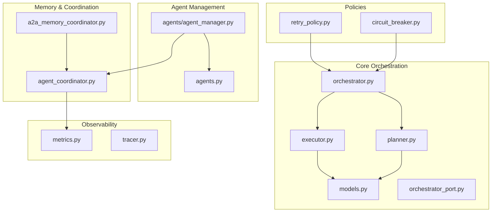
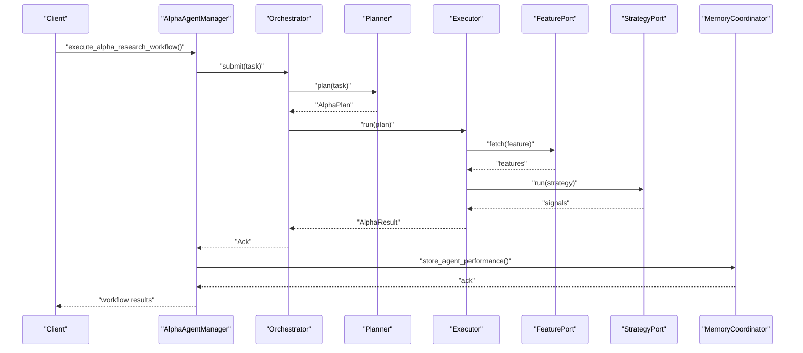
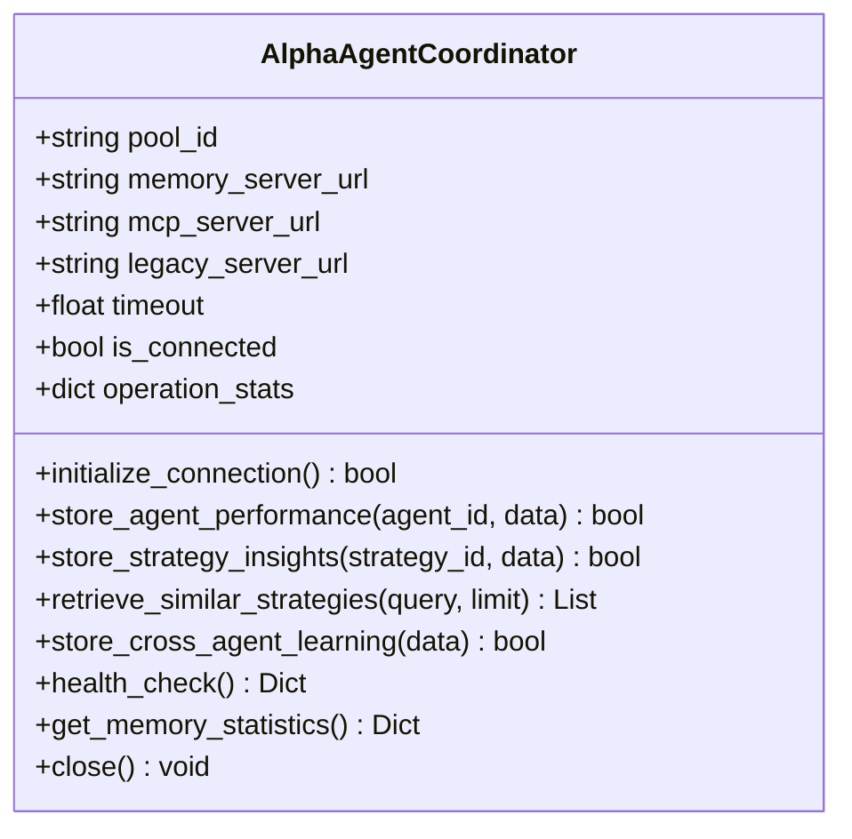
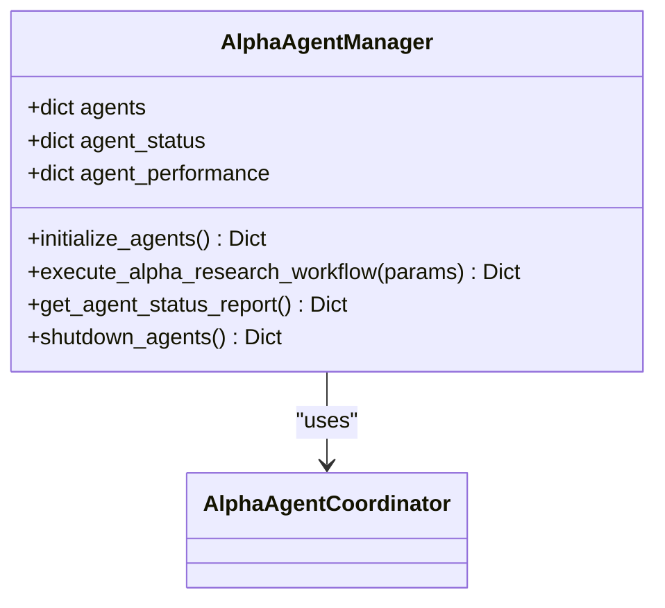
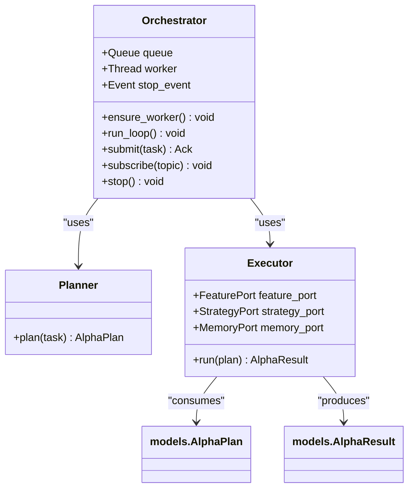
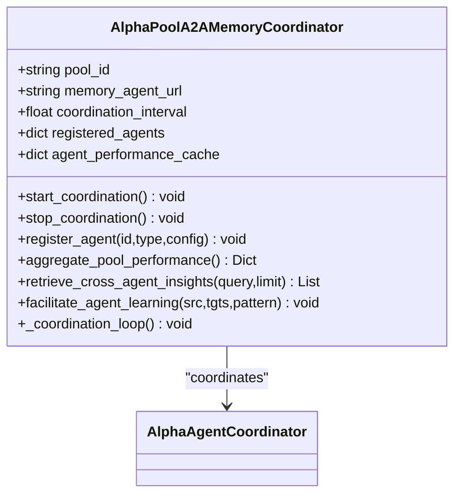
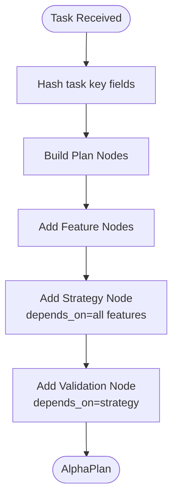
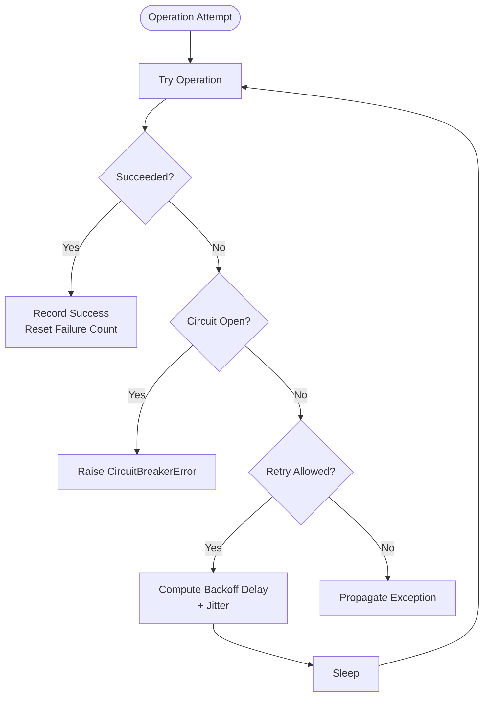
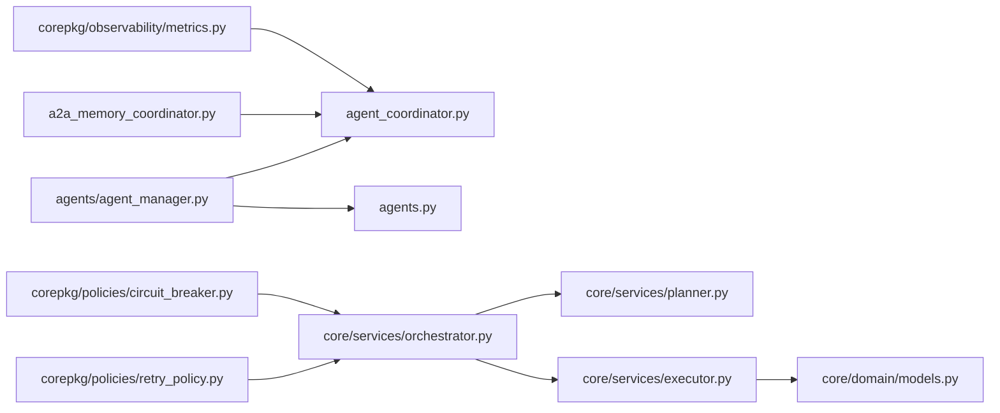

# Agent Coordination System

<cite>
**Referenced Files in This Document**
- [agent_coordinator.py](file://FinAgents/agent_pools/alpha_agent_pool/agent_coordinator.py)
- [agents.py](file://FinAgents/agent_pools/alpha_agent_pool/agents.py)
- [agent_manager.py](file://FinAgents/agent_pools/alpha_agent_pool/agents/agent_manager.py)
- [orchestrator.py](file://FinAgents/agent_pools/alpha_agent_pool/core/services/orchestrator.py)
- [planner.py](file://FinAgents/agent_pools/alpha_agent_pool/core/services/planner.py)
- [executor.py](file://FinAgents/agent_pools/alpha_agent_pool/core/services/executor.py)
- [models.py](file://FinAgents/agent_pools/alpha_agent_pool/core/domain/models.py)
- [orchestrator_port.py](file://FinAgents/agent_pools/alpha_agent_pool/core/ports/orchestrator.py)
- [alpha_pool.yaml](file://FinAgents/agent_pools/alpha_agent_pool/config/alpha_pool.yaml)
- [a2a_memory_coordinator.py](file://FinAgents/agent_pools/alpha_agent_pool/a2a_memory_coordinator.py)
- [retry_policy.py](file://FinAgents/agent_pools/alpha_agent_pool/corepkg/policies/retry_policy.py)
- [circuit_breaker.py](file://FinAgents/agent_pools/alpha_agent_pool/corepkg/policies/circuit_breaker.py)
- [metrics.py](file://FinAgents/agent_pools/alpha_agent_pool/corepkg/observability/metrics.py)
- [tracer.py](file://FinAgents/agent_pools/alpha_agent_pool/corepkg/observability/tracer.py)
</cite>

## Table of Contents
1. [Introduction](#introduction)
2. [Project Structure](#project-structure)
3. [Core Components](#core-components)
4. [Architecture Overview](#architecture-overview)
5. [Detailed Component Analysis](#detailed-component-analysis)
6. [Dependency Analysis](#dependency-analysis)
7. [Performance Considerations](#performance-considerations)
8. [Troubleshooting Guide](#troubleshooting-guide)
9. [Conclusion](#conclusion)

## Introduction
This document describes the agent coordination system responsible for centralized management and orchestration of alpha agents. It covers:
- Agent lifecycle management and monitoring
- Resource allocation and inter-agent communication
- Command planner for DAG-based task execution
- Recovery procedures using retry and circuit breaker policies
- Configuration management and observability (metrics and tracing)
- Operational troubleshooting and maintenance

The system integrates a pool-level memory coordinator, an orchestrator that plans and executes DAG-based tasks, and a manager that registers, starts, stops, and monitors specialized agents.

## Project Structure
The agent coordination system spans several modules:
- Core orchestration: planner, executor, orchestrator, and domain models
- Agent management: centralized manager coordinating theory-driven, empirical, and autonomous agents
- Memory coordination: A2A protocol-based memory bridge and pool coordinator
- Policies: retry and circuit breaker for resilience
- Observability: metrics and tracing utilities

**Diagram sources**
- [models.py:1-70](file://FinAgents/agent_pools/alpha_agent_pool/core/domain/models.py#L1-L70)
- [planner.py:1-51](file://FinAgents/agent_pools/alpha_agent_pool/core/services/planner.py#L1-L51)
- [executor.py:1-63](file://FinAgents/agent_pools/alpha_agent_pool/core/services/executor.py#L1-L63)
- [orchestrator.py:1-66](file://FinAgents/agent_pools/alpha_agent_pool/core/services/orchestrator.py#L1-L66)
- [orchestrator_port.py:1-17](file://FinAgents/agent_pools/alpha_agent_pool/core/ports/orchestrator.py#L1-L17)
- [agents/agent_manager.py:1-460](file://FinAgents/agent_pools/alpha_agent_pool/agents/agent_manager.py#L1-L460)
- [agents.py:1-163](file://FinAgents/agent_pools/alpha_agent_pool/agents.py#L1-L163)
- [agent_coordinator.py:1-449](file://FinAgents/agent_pools/alpha_agent_pool/agent_coordinator.py#L1-L449)
- [a2a_memory_coordinator.py:1-345](file://FinAgents/agent_pools/alpha_agent_pool/a2a_memory_coordinator.py#L1-L345)
- [retry_policy.py:1-164](file://FinAgents/agent_pools/alpha_agent_pool/corepkg/policies/retry_policy.py#L1-L164)
- [circuit_breaker.py:1-157](file://FinAgents/agent_pools/alpha_agent_pool/corepkg/policies/circuit_breaker.py#L1-L157)
- [metrics.py:1-248](file://FinAgents/agent_pools/alpha_agent_pool/corepkg/observability/metrics.py#L1-L248)
- [tracer.py:1-37](file://FinAgents/agent_pools/alpha_agent_pool/corepkg/observability/tracer.py#L1-L37)

**Section sources**
- [agent_coordinator.py:1-449](file://FinAgents/agent_pools/alpha_agent_pool/agent_coordinator.py#L1-L449)
- [agents/agent_manager.py:1-460](file://FinAgents/agent_pools/alpha_agent_pool/agents/agent_manager.py#L1-L460)
- [orchestrator.py:1-66](file://FinAgents/agent_pools/alpha_agent_pool/core/services/orchestrator.py#L1-L66)
- [planner.py:1-51](file://FinAgents/agent_pools/alpha_agent_pool/core/services/planner.py#L1-L51)
- [executor.py:1-63](file://FinAgents/agent_pools/alpha_agent_pool/core/services/executor.py#L1-L63)
- [models.py:1-70](file://FinAgents/agent_pools/alpha_agent_pool/core/domain/models.py#L1-L70)
- [orchestrator_port.py:1-17](file://FinAgents/agent_pools/alpha_agent_pool/core/ports/orchestrator.py#L1-L17)
- [alpha_pool.yaml:1-58](file://FinAgents/agent_pools/alpha_agent_pool/config/alpha_pool.yaml#L1-L58)
- [a2a_memory_coordinator.py:1-345](file://FinAgents/agent_pools/alpha_agent_pool/a2a_memory_coordinator.py#L1-L345)
- [retry_policy.py:1-164](file://FinAgents/agent_pools/alpha_agent_pool/corepkg/policies/retry_policy.py#L1-L164)
- [circuit_breaker.py:1-157](file://FinAgents/agent_pools/alpha_agent_pool/corepkg/policies/circuit_breaker.py#L1-L157)
- [metrics.py:1-248](file://FinAgents/agent_pools/alpha_agent_pool/corepkg/observability/metrics.py#L1-L248)
- [tracer.py:1-37](file://FinAgents/agent_pools/alpha_agent_pool/corepkg/observability/tracer.py#L1-L37)

## Core Components
- Agent Coordinator: Provides memory bridge connectivity, stores performance and strategy insights, retrieves similar strategies, and tracks operation statistics.
- Agent Manager: Registers, initializes, executes, and shuts down specialized agents (theory-driven, empirical, autonomous), aggregates insights, and reports status.
- Orchestrator: Synchronous intake with an internal queue and a background thread that runs an asyncio loop to plan and execute tasks.
- Planner: Builds a deterministic DAG plan from task metadata and feature requirements.
- Executor: Executes the plan by dispatching nodes to feature and strategy ports, collecting signals, and aggregating results.
- Memory Coordinator: Coordinates pool-level memory operations using the A2A protocol, aggregates performance, and facilitates cross-agent learning.
- Policies: Retry (exponential backoff with jitter) and Circuit Breaker for resilience.
- Observability: Metrics (counter/gauge/histogram) and tracing utilities.

**Section sources**
- [agent_coordinator.py:26-449](file://FinAgents/agent_pools/alpha_agent_pool/agent_coordinator.py#L26-L449)
- [agents/agent_manager.py:35-460](file://FinAgents/agent_pools/alpha_agent_pool/agents/agent_manager.py#L35-L460)
- [orchestrator.py:13-66](file://FinAgents/agent_pools/alpha_agent_pool/core/services/orchestrator.py#L13-L66)
- [planner.py:9-51](file://FinAgents/agent_pools/alpha_agent_pool/core/services/planner.py#L9-L51)
- [executor.py:12-63](file://FinAgents/agent_pools/alpha_agent_pool/core/services/executor.py#L12-L63)
- [a2a_memory_coordinator.py:38-345](file://FinAgents/agent_pools/alpha_agent_pool/a2a_memory_coordinator.py#L38-L345)
- [retry_policy.py:41-164](file://FinAgents/agent_pools/alpha_agent_pool/corepkg/policies/retry_policy.py#L41-L164)
- [circuit_breaker.py:23-157](file://FinAgents/agent_pools/alpha_agent_pool/corepkg/policies/circuit_breaker.py#L23-L157)
- [metrics.py:140-248](file://FinAgents/agent_pools/alpha_agent_pool/corepkg/observability/metrics.py#L140-L248)
- [tracer.py:3-37](file://FinAgents/agent_pools/alpha_agent_pool/corepkg/observability/tracer.py#L3-L37)

## Architecture Overview
The system orchestrates alpha research workflows by:
- Accepting tasks via an orchestrator port
- Planning DAG execution using a planner
- Executing nodes through feature and strategy ports
- Aggregating signals and results
- Storing performance and insights via the agent coordinator and memory coordinator
- Monitoring health and performance via observability utilities

**Diagram sources**
- [agents/agent_manager.py:162-310](file://FinAgents/agent_pools/alpha_agent_pool/agents/agent_manager.py#L162-L310)
- [orchestrator.py:53-55](file://FinAgents/agent_pools/alpha_agent_pool/core/services/orchestrator.py#L53-L55)
- [planner.py:12-49](file://FinAgents/agent_pools/alpha_agent_pool/core/services/planner.py#L12-L49)
- [executor.py:24-61](file://FinAgents/agent_pools/alpha_agent_pool/core/services/executor.py#L24-L61)
- [a2a_memory_coordinator.py:154-196](file://FinAgents/agent_pools/alpha_agent_pool/a2a_memory_coordinator.py#L154-L196)

## Detailed Component Analysis

### Agent Coordinator
The agent coordinator encapsulates memory bridge connectivity and operations:
- Initializes connections to memory servers with fallback order
- Stores agent performance, strategy insights, and cross-agent learning data
- Retrieves similar strategies using A2A protocol-compliant requests
- Tracks operation statistics and exposes health and statistics

**Diagram sources**
- [agent_coordinator.py:26-449](file://FinAgents/agent_pools/alpha_agent_pool/agent_coordinator.py#L26-L449)

**Section sources**
- [agent_coordinator.py:75-107](file://FinAgents/agent_pools/alpha_agent_pool/agent_coordinator.py#L75-L107)
- [agent_coordinator.py:125-186](file://FinAgents/agent_pools/alpha_agent_pool/agent_coordinator.py#L125-L186)
- [agent_coordinator.py:188-244](file://FinAgents/agent_pools/alpha_agent_pool/agent_coordinator.py#L188-L244)
- [agent_coordinator.py:246-304](file://FinAgents/agent_pools/alpha_agent_pool/agent_coordinator.py#L246-L304)
- [agent_coordinator.py:306-359](file://FinAgents/agent_pools/alpha_agent_pool/agent_coordinator.py#L306-L359)
- [agent_coordinator.py:361-411](file://FinAgents/agent_pools/alpha_agent_pool/agent_coordinator.py#L361-L411)
- [agent_coordinator.py:413-417](file://FinAgents/agent_pools/alpha_agent_pool/agent_coordinator.py#L413-L417)

### Agent Manager
The agent manager coordinates specialized agents:
- Initializes theory-driven (momentum, mean-reversion), empirical (data mining, ML pattern), and autonomous agents
- Executes a comprehensive alpha research workflow across agents
- Consolidates insights and generates performance summaries
- Provides status reporting and graceful shutdown

**Diagram sources**
- [agents/agent_manager.py:35-460](file://FinAgents/agent_pools/alpha_agent_pool/agents/agent_manager.py#L35-L460)
- [agent_coordinator.py:26-449](file://FinAgents/agent_pools/alpha_agent_pool/agent_coordinator.py#L26-L449)

**Section sources**
- [agents/agent_manager.py:69-161](file://FinAgents/agent_pools/alpha_agent_pool/agents/agent_manager.py#L69-L161)
- [agents/agent_manager.py:162-310](file://FinAgents/agent_pools/alpha_agent_pool/agents/agent_manager.py#L162-L310)
- [agents/agent_manager.py:311-388](file://FinAgents/agent_pools/alpha_agent_pool/agents/agent_manager.py#L311-L388)
- [agents/agent_manager.py:390-435](file://FinAgents/agent_pools/alpha_agent_pool/agents/agent_manager.py#L390-L435)

### Orchestrator, Planner, and Executor
The orchestrator coordinates task intake and execution:
- Orchestrator maintains a thread-safe queue and a background worker running an asyncio loop
- Planner constructs a DAG from task metadata and feature requirements
- Executor dispatches nodes to feature and strategy ports, aggregates signals, and produces results

**Diagram sources**
- [orchestrator.py:13-66](file://FinAgents/agent_pools/alpha_agent_pool/core/services/orchestrator.py#L13-L66)
- [planner.py:9-51](file://FinAgents/agent_pools/alpha_agent_pool/core/services/planner.py#L9-L51)
- [executor.py:12-63](file://FinAgents/agent_pools/alpha_agent_pool/core/services/executor.py#L12-L63)
- [models.py:7-70](file://FinAgents/agent_pools/alpha_agent_pool/core/domain/models.py#L7-L70)

**Section sources**
- [orchestrator.py:27-51](file://FinAgents/agent_pools/alpha_agent_pool/core/services/orchestrator.py#L27-L51)
- [planner.py:12-49](file://FinAgents/agent_pools/alpha_agent_pool/core/services/planner.py#L12-L49)
- [executor.py:24-61](file://FinAgents/agent_pools/alpha_agent_pool/core/services/executor.py#L24-L61)

### Memory Coordinator
The pool-level memory coordinator:
- Starts/stops coordination tasks and connects to memory via A2A protocol
- Registers agents, aggregates pool performance, retrieves cross-agent insights, and facilitates learning transfer
- Runs periodic coordination loops for health checks and statistics updates

**Diagram sources**
- [a2a_memory_coordinator.py:38-345](file://FinAgents/agent_pools/alpha_agent_pool/a2a_memory_coordinator.py#L38-L345)
- [agent_coordinator.py:26-449](file://FinAgents/agent_pools/alpha_agent_pool/agent_coordinator.py#L26-L449)

**Section sources**
- [a2a_memory_coordinator.py:81-117](file://FinAgents/agent_pools/alpha_agent_pool/a2a_memory_coordinator.py#L81-L117)
- [a2a_memory_coordinator.py:118-153](file://FinAgents/agent_pools/alpha_agent_pool/a2a_memory_coordinator.py#L118-L153)
- [a2a_memory_coordinator.py:154-196](file://FinAgents/agent_pools/alpha_agent_pool/a2a_memory_coordinator.py#L154-L196)
- [a2a_memory_coordinator.py:198-226](file://FinAgents/agent_pools/alpha_agent_pool/a2a_memory_coordinator.py#L198-L226)
- [a2a_memory_coordinator.py:228-258](file://FinAgents/agent_pools/alpha_agent_pool/a2a_memory_coordinator.py#L228-L258)
- [a2a_memory_coordinator.py:259-276](file://FinAgents/agent_pools/alpha_agent_pool/a2a_memory_coordinator.py#L259-L276)

### Command Planner (DAG-based Task Execution)
The planner builds a deterministic DAG:
- Feature nodes for each requested feature
- Strategy node depending on all features
- Validation node depending on the strategy

**Diagram sources**
- [planner.py:12-49](file://FinAgents/agent_pools/alpha_agent_pool/core/services/planner.py#L12-L49)

**Section sources**
- [planner.py:12-49](file://FinAgents/agent_pools/alpha_agent_pool/core/services/planner.py#L12-L49)

### Recovery Procedures (Retry and Circuit Breaker)
Resilience is achieved through:
- Exponential backoff retry with jitter for transient failures
- Circuit breaker to prevent cascading failures and allow recovery

**Diagram sources**
- [retry_policy.py:90-126](file://FinAgents/agent_pools/alpha_agent_pool/corepkg/policies/retry_policy.py#L90-L126)
- [circuit_breaker.py:85-149](file://FinAgents/agent_pools/alpha_agent_pool/corepkg/policies/circuit_breaker.py#L85-L149)

**Section sources**
- [retry_policy.py:41-87](file://FinAgents/agent_pools/alpha_agent_pool/corepkg/policies/retry_policy.py#L41-L87)
- [retry_policy.py:90-164](file://FinAgents/agent_pools/alpha_agent_pool/corepkg/policies/retry_policy.py#L90-L164)
- [circuit_breaker.py:23-84](file://FinAgents/agent_pools/alpha_agent_pool/corepkg/policies/circuit_breaker.py#L23-L84)
- [circuit_breaker.py:118-149](file://FinAgents/agent_pools/alpha_agent_pool/corepkg/policies/circuit_breaker.py#L118-L149)

### Configuration Management
Configuration is centralized in YAML:
- Pool identity, environment, and lifecycle toggles
- Retry, circuit breaker, and backpressure policies
- Observability settings (metrics, tracing, logging level)
- Strategy and feature execution parameters
- Memory and MCP server settings

**Section sources**
- [alpha_pool.yaml:1-58](file://FinAgents/agent_pools/alpha_agent_pool/config/alpha_pool.yaml#L1-L58)

### Performance Tracking and Observability
- Metrics collector supports counters, gauges, and histograms with thread-safe access
- Tracing utilities provide span wrappers for async and sync functions
- Agent coordinator tracks operation success/failure rates and uptime indicators

**Section sources**
- [metrics.py:140-248](file://FinAgents/agent_pools/alpha_agent_pool/corepkg/observability/metrics.py#L140-L248)
- [tracer.py:3-37](file://FinAgents/agent_pools/alpha_agent_pool/corepkg/observability/tracer.py#L3-L37)
- [agent_coordinator.py:387-411](file://FinAgents/agent_pools/alpha_agent_pool/agent_coordinator.py#L387-L411)

## Dependency Analysis
The following diagram highlights key dependencies among core components:

**Diagram sources**
- [agents/agent_manager.py:1-460](file://FinAgents/agent_pools/alpha_agent_pool/agents/agent_manager.py#L1-L460)
- [agent_coordinator.py:1-449](file://FinAgents/agent_pools/alpha_agent_pool/agent_coordinator.py#L1-L449)
- [agents.py:1-163](file://FinAgents/agent_pools/alpha_agent_pool/agents.py#L1-L163)
- [orchestrator.py:1-66](file://FinAgents/agent_pools/alpha_agent_pool/core/services/orchestrator.py#L1-L66)
- [planner.py:1-51](file://FinAgents/agent_pools/alpha_agent_pool/core/services/planner.py#L1-L51)
- [executor.py:1-63](file://FinAgents/agent_pools/alpha_agent_pool/core/services/executor.py#L1-L63)
- [models.py:1-70](file://FinAgents/agent_pools/alpha_agent_pool/core/domain/models.py#L1-L70)
- [a2a_memory_coordinator.py:1-345](file://FinAgents/agent_pools/alpha_agent_pool/a2a_memory_coordinator.py#L1-L345)
- [retry_policy.py:1-164](file://FinAgents/agent_pools/alpha_agent_pool/corepkg/policies/retry_policy.py#L1-L164)
- [circuit_breaker.py:1-157](file://FinAgents/agent_pools/alpha_agent_pool/corepkg/policies/circuit_breaker.py#L1-L157)
- [metrics.py:1-248](file://FinAgents/agent_pools/alpha_agent_pool/corepkg/observability/metrics.py#L1-L248)

**Section sources**
- [agents/agent_manager.py:1-460](file://FinAgents/agent_pools/alpha_agent_pool/agents/agent_manager.py#L1-L460)
- [agent_coordinator.py:1-449](file://FinAgents/agent_pools/alpha_agent_pool/agent_coordinator.py#L1-L449)
- [orchestrator.py:1-66](file://FinAgents/agent_pools/alpha_agent_pool/core/services/orchestrator.py#L1-L66)
- [planner.py:1-51](file://FinAgents/agent_pools/alpha_agent_pool/core/services/planner.py#L1-L51)
- [executor.py:1-63](file://FinAgents/agent_pools/alpha_agent_pool/core/services/executor.py#L1-L63)
- [models.py:1-70](file://FinAgents/agent_pools/alpha_agent_pool/core/domain/models.py#L1-L70)
- [a2a_memory_coordinator.py:1-345](file://FinAgents/agent_pools/alpha_agent_pool/a2a_memory_coordinator.py#L1-L345)
- [retry_policy.py:1-164](file://FinAgents/agent_pools/alpha_agent_pool/corepkg/policies/retry_policy.py#L1-L164)
- [circuit_breaker.py:1-157](file://FinAgents/agent_pools/alpha_agent_pool/corepkg/policies/circuit_breaker.py#L1-L157)
- [metrics.py:1-248](file://FinAgents/agent_pools/alpha_agent_pool/corepkg/observability/metrics.py#L1-L248)

## Performance Considerations
- Asynchronous execution: The orchestrator’s background worker uses an asyncio event loop to run executor tasks concurrently within a single-threaded design.
- Retry and backoff: Exponential backoff with jitter reduces thundering herds and improves resilience under transient failures.
- Circuit breaker: Prevents cascading failures by opening when thresholds are exceeded and allowing recovery after a timeout.
- Metrics and tracing: Use counters/gauges/histograms to monitor throughput, latency percentiles, and error rates; spans help correlate operations.

[No sources needed since this section provides general guidance]

## Troubleshooting Guide
Common issues and resolutions:
- Memory connectivity failures
  - Symptoms: Agent coordinator reports disconnected or returns errors on store/retrieve operations
  - Actions: Verify memory server URLs and ports; confirm fallback order; check health status and operation statistics
- Agent initialization failures
  - Symptoms: Partial or failed agent activation in the manager
  - Actions: Review agent-specific logs; ensure dependencies and credentials are available; confirm coordinator connectivity
- Orchestrator queue backpressure
  - Symptoms: Slow throughput or queue growth
  - Actions: Tune backpressure settings; adjust worker threads; apply rate limiting; monitor queue depth via metrics
- Circuit breaker activation
  - Symptoms: CircuitBreakerError exceptions
  - Actions: Inspect failure rates; investigate upstream service health; allow recovery timeout to elapse; consider manual reset after stabilization
- Retry exhaustion
  - Symptoms: Operations fail after repeated attempts
  - Actions: Increase max attempts or adjust backoff parameters; address root causes (network, upstream service)

**Section sources**
- [agent_coordinator.py:361-385](file://FinAgents/agent_pools/alpha_agent_pool/agent_coordinator.py#L361-L385)
- [agents/agent_manager.py:69-161](file://FinAgents/agent_pools/alpha_agent_pool/agents/agent_manager.py#L69-L161)
- [alpha_pool.yaml:20-24](file://FinAgents/agent_pools/alpha_agent_pool/config/alpha_pool.yaml#L20-L24)
- [circuit_breaker.py:100-108](file://FinAgents/agent_pools/alpha_agent_pool/corepkg/policies/circuit_breaker.py#L100-L108)
- [retry_policy.py:113-126](file://FinAgents/agent_pools/alpha_agent_pool/corepkg/policies/retry_policy.py#L113-L126)

## Conclusion
The agent coordination system provides a robust, configurable, and observable framework for managing alpha agents. It integrates memory coordination, DAG-based planning and execution, resilience policies, and comprehensive monitoring to support reliable and scalable alpha research operations.

[No sources needed since this section summarizes without analyzing specific files]