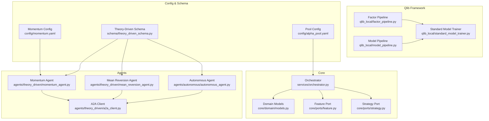
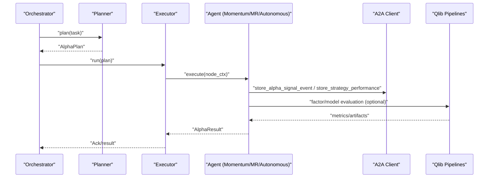
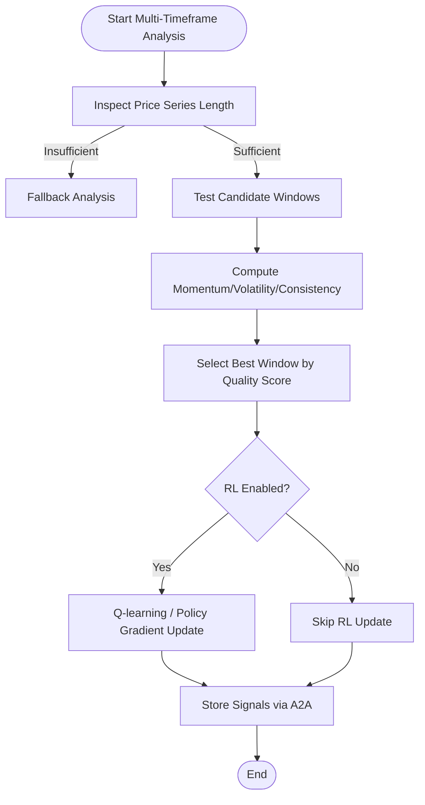
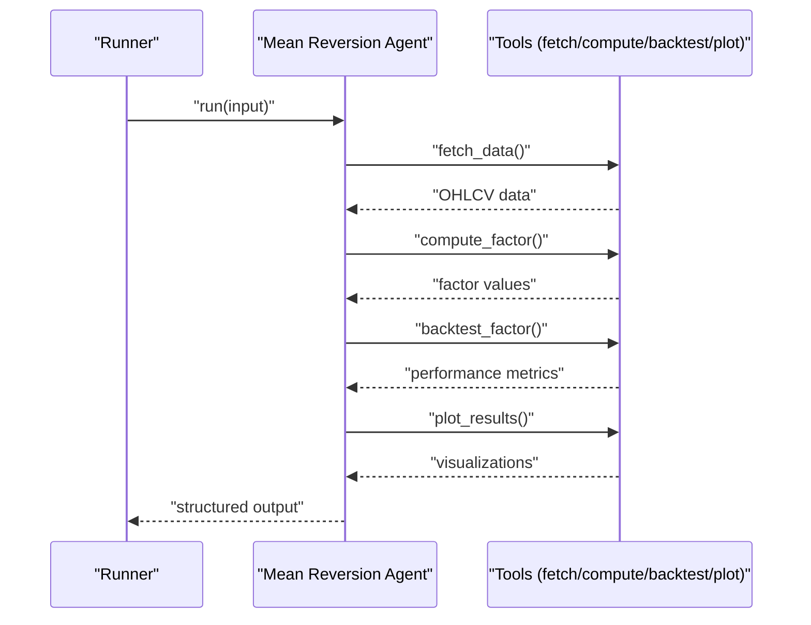
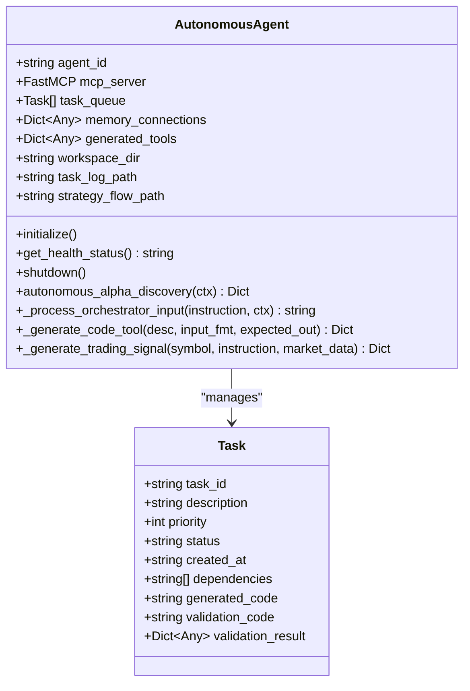
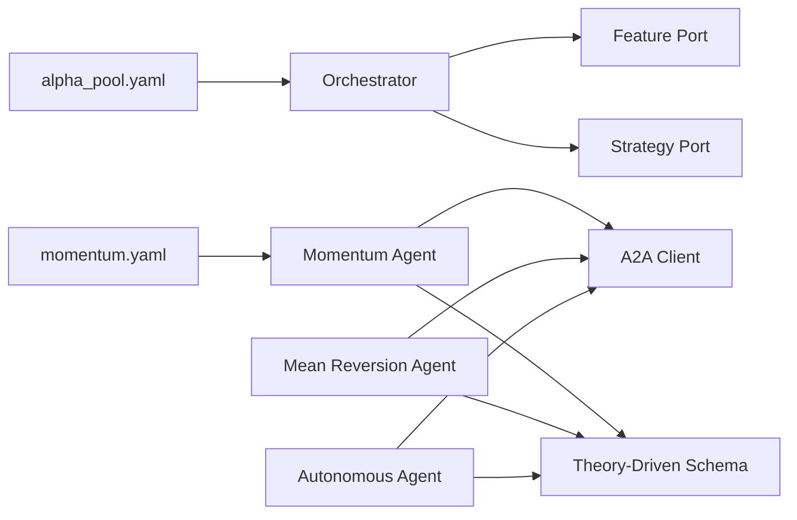

# Alpha Agent Pool

<cite>
**Referenced Files in This Document**
- [README.md](file://FinAgents/agent_pools/alpha_agent_pool/README.md)
- [__init__.py](file://FinAgents/agent_pools/alpha_agent_pool/__init__.py)
- [alpha_pool.yaml](file://FinAgents/agent_pools/alpha_agent_pool/config/alpha_pool.yaml)
- [momentum.yaml](file://FinAgents/agent_pools/alpha_agent_pool/config/momentum.yaml)
- [models.py](file://FinAgents/agent_pools/alpha_agent_pool/core/domain/models.py)
- [orchestrator.py](file://FinAgents/agent_pools/alpha_agent_pool/core/services/orchestrator.py)
- [feature.py](file://FinAgents/agent_pools/alpha_agent_pool/core/ports/feature.py)
- [strategy.py](file://FinAgents/agent_pools/alpha_agent_pool/core/ports/strategy.py)
- [theory_driven_schema.py](file://FinAgents/agent_pools/alpha_agent_pool/schema/theory_driven_schema.py)
- [momentum_agent.py](file://FinAgents/agent_pools/alpha_agent_pool/agents/theory_driven/momentum_agent.py)
- [mean_reversion_agent.py](file://FinAgents/agent_pools/alpha_agent_pool/agents/theory_driven/mean_reversion_agent.py)
- [autonomous_agent.py](file://FinAgents/agent_pools/alpha_agent_pool/agents/autonomous/autonomous_agent.py)
- [a2a_client.py](file://FinAgents/agent_pools/alpha_agent_pool/agents/theory_driven/a2a_client.py)
- [README.md](file://FinAgents/agent_pools/alpha_agent_pool/qlib_local/README.md)
- [factor_pipeline.py](file://FinAgents/agent_pools/alpha_agent_pool/qlib_local/factor_pipeline.py)
- [model_pipeline.py](file://FinAgents/agent_pools/alpha_agent_pool/qlib_local/model_pipeline.py)
- [standard_model_trainer.py](file://FinAgents/agent_pools/alpha_agent_pool/qlib_local/standard_model_trainer.py)
</cite>

## Table of Contents
1. [Introduction](#introduction)
2. [Project Structure](#project-structure)
3. [Core Components](#core-components)
4. [Architecture Overview](#architecture-overview)
5. [Detailed Component Analysis](#detailed-component-analysis)
6. [Dependency Analysis](#dependency-analysis)
7. [Performance Considerations](#performance-considerations)
8. [Troubleshooting Guide](#troubleshooting-guide)
9. [Conclusion](#conclusion)
10. [Appendices](#appendices)

## Introduction
The Alpha Agent Pool is a professional-grade multi-agent system for alpha factor research, strategy development, and portfolio optimization. It integrates theory-driven agents (momentum, mean reversion), autonomous agents, and a Qlib-backed machine learning framework to deliver robust signal generation, confidence scoring, and strategy research capabilities. The system emphasizes academic rigor, distributed memory coordination, and scalable operations suitable for institutional deployments.

Key capabilities include:
- Momentum and mean reversion signal generation with confidence scoring
- Factor discovery and backtesting via Qlib pipelines
- Autonomous agent-driven research and strategy synthesis
- A2A protocol integration for memory coordination and cross-agent learning
- Orchestrated execution with observability, retry, and backpressure controls

**Section sources**
- [README.md:1-204](file://FinAgents/agent_pools/alpha_agent_pool/README.md#L1-L204)

## Project Structure
The Alpha Agent Pool is organized around modular components:
- Core orchestration and domain models
- Theory-driven agents (momentum, mean reversion)
- Autonomous agent for self-orchestrated research
- Qlib-local framework for factor and model evaluation
- Configuration and schema for strategy flows and agent settings

**Diagram sources**
- [orchestrator.py:1-66](file://FinAgents/agent_pools/alpha_agent_pool/core/services/orchestrator.py#L1-L66)
- [models.py:1-70](file://FinAgents/agent_pools/alpha_agent_pool/core/domain/models.py#L1-L70)
- [feature.py:1-15](file://FinAgents/agent_pools/alpha_agent_pool/core/ports/feature.py#L1-L15)
- [strategy.py:1-15](file://FinAgents/agent_pools/alpha_agent_pool/core/ports/strategy.py#L1-L15)
- [momentum_agent.py:1-800](file://FinAgents/agent_pools/alpha_agent_pool/agents/theory_driven/momentum_agent.py#L1-L800)
- [mean_reversion_agent.py:1-843](file://FinAgents/agent_pools/alpha_agent_pool/agents/theory_driven/mean_reversion_agent.py#L1-L843)
- [autonomous_agent.py:1-800](file://FinAgents/agent_pools/alpha_agent_pool/agents/autonomous/autonomous_agent.py#L1-L800)
- [a2a_client.py:1-563](file://FinAgents/agent_pools/alpha_agent_pool/agents/theory_driven/a2a_client.py#L1-L563)
- [factor_pipeline.py:1-426](file://FinAgents/agent_pools/alpha_agent_pool/qlib_local/factor_pipeline.py#L1-L426)
- [model_pipeline.py:1-567](file://FinAgents/agent_pools/alpha_agent_pool/qlib_local/model_pipeline.py#L1-L567)
- [standard_model_trainer.py:1-451](file://FinAgents/agent_pools/alpha_agent_pool/qlib_local/standard_model_trainer.py#L1-L451)
- [alpha_pool.yaml:1-58](file://FinAgents/agent_pools/alpha_agent_pool/config/alpha_pool.yaml#L1-L58)
- [momentum.yaml:1-24](file://FinAgents/agent_pools/alpha_agent_pool/config/momentum.yaml#L1-L24)
- [theory_driven_schema.py:1-87](file://FinAgents/agent_pools/alpha_agent_pool/schema/theory_driven_schema.py#L1-L87)

**Section sources**
- [README.md:9-30](file://FinAgents/agent_pools/alpha_agent_pool/README.md#L9-L30)
- [__init__.py:1-141](file://FinAgents/agent_pools/alpha_agent_pool/__init__.py#L1-L141)

## Core Components
- Domain models define immutable task plans, execution nodes, alpha signals, artifacts, and results. These structures standardize inter-agent communication and result packaging.
- Ports abstract feature retrieval and strategy execution, enabling pluggable implementations and consistent integration points.
- Orchestrator coordinates task intake, planning, and execution with background worker threads and async loops.

Key model definitions:
- AlphaTask: task submission with market context, time window, and feature requirements
- PlanNode and AlphaPlan: DAG-based execution plan with typed nodes
- AlphaSignal: standardized signal with direction, strength, and confidence
- AlphaResult: aggregation of signals, metrics, and artifacts

**Section sources**
- [models.py:7-70](file://FinAgents/agent_pools/alpha_agent_pool/core/domain/models.py#L7-L70)
- [feature.py:6-15](file://FinAgents/agent_pools/alpha_agent_pool/core/ports/feature.py#L6-L15)
- [strategy.py:6-15](file://FinAgents/agent_pools/alpha_agent_pool/core/ports/strategy.py#L6-L15)
- [orchestrator.py:13-66](file://FinAgents/agent_pools/alpha_agent_pool/core/services/orchestrator.py#L13-L66)

## Architecture Overview
The system integrates three primary pathways:
- Theory-driven agents (momentum, mean reversion) generate signals with confidence and optionally use LLMs for multi-timeframe analysis and reinforcement learning updates.
- Autonomous agent performs self-orchestrated research, dynamically generating tools and validating results, outputting structured strategy flows.
- Qlib-local framework provides factor and model evaluation pipelines with standardized metrics (IC, IR, Sharpe, etc.).

**Diagram sources**
- [orchestrator.py:33-51](file://FinAgents/agent_pools/alpha_agent_pool/core/services/orchestrator.py#L33-L51)
- [momentum_agent.py:472-599](file://FinAgents/agent_pools/alpha_agent_pool/agents/theory_driven/momentum_agent.py#L472-L599)
- [a2a_client.py:207-316](file://FinAgents/agent_pools/alpha_agent_pool/agents/theory_driven/a2a_client.py#L207-L316)
- [factor_pipeline.py:78-118](file://FinAgents/agent_pools/alpha_agent_pool/qlib_local/factor_pipeline.py#L78-L118)
- [model_pipeline.py:93-158](file://FinAgents/agent_pools/alpha_agent_pool/qlib_local/model_pipeline.py#L93-L158)

## Detailed Component Analysis

### Momentum Agent
The Momentum Agent implements multi-timeframe momentum analysis, adaptive window selection, and reinforcement learning updates. It supports:
- Multi-timeframe analysis with window quality scoring (momentum, volatility, consistency)
- Reinforcement learning updates (Q-learning and policy gradient) for window selection
- A2A protocol integration for storing signals, performance metrics, and learning feedback
- Optional LLM-assisted analysis incorporating recent backtest feedback

**Diagram sources**
- [momentum_agent.py:656-717](file://FinAgents/agent_pools/alpha_agent_pool/agents/theory_driven/momentum_agent.py#L656-L717)
- [momentum_agent.py:289-352](file://FinAgents/agent_pools/alpha_agent_pool/agents/theory_driven/momentum_agent.py#L289-L352)
- [momentum_agent.py:601-638](file://FinAgents/agent_pools/alpha_agent_pool/agents/theory_driven/momentum_agent.py#L601-L638)

**Section sources**
- [momentum_agent.py:77-800](file://FinAgents/agent_pools/alpha_agent_pool/agents/theory_driven/momentum_agent.py#L77-L800)
- [momentum.yaml:1-24](file://FinAgents/agent_pools/alpha_agent_pool/config/momentum.yaml#L1-L24)
- [theory_driven_schema.py:47-87](file://FinAgents/agent_pools/alpha_agent_pool/schema/theory_driven_schema.py#L47-L87)

### Mean Reversion Agent
The Mean Reversion Agent implements a structured research workflow:
- Data ingestion via tools (supports multiple providers)
- Factor computation (z-score, residuals)
- Backtesting with IC, Sharpe, and statistical significance
- Visualization and explainability

**Diagram sources**
- [mean_reversion_agent.py:703-799](file://FinAgents/agent_pools/alpha_agent_pool/agents/theory_driven/mean_reversion_agent.py#L703-L799)

**Section sources**
- [mean_reversion_agent.py:1-843](file://FinAgents/agent_pools/alpha_agent_pool/agents/theory_driven/mean_reversion_agent.py#L1-L843)

### Autonomous Agent
The Autonomous Agent performs self-orchestrated research:
- Decomposes orchestrator instructions into executable tasks
- Generates and validates custom analysis tools
- Produces structured strategy flows compatible with the ecosystem
- Manages a persistent workspace and task log

**Diagram sources**
- [autonomous_agent.py:34-124](file://FinAgents/agent_pools/alpha_agent_pool/agents/autonomous/autonomous_agent.py#L34-L124)
- [autonomous_agent.py:52-124](file://FinAgents/agent_pools/alpha_agent_pool/agents/autonomous/autonomous_agent.py#L52-L124)

**Section sources**
- [autonomous_agent.py:125-800](file://FinAgents/agent_pools/alpha_agent_pool/agents/autonomous/autonomous_agent.py#L125-L800)

### Qlib Integration and Strategy Research
The Qlib-local framework provides:
- Factor pipeline: computes factor values, validates, calculates IC/IR, and generates strategy returns
- Model pipeline: trains models, validates performance, and produces standardized metrics
- Standard model trainer: supports linear and tree-based models with regularization and validation

```mermaid
graph TB
subgraph "Factor Evaluation"
FP_PREP["prepare_data()"]
FP_CALC["calculate_factor()"]
FP_VALIDATE["validate_factor()"]
FP_IC["calculate IC/Rank IC"]
FP_STRAT["generate_strategy_returns()"]
FP_METRICS["evaluate_performance()"]
end
subgraph "Model Evaluation"
MP_PREP["prepare_data()"]
MP_TRAIN["train()"]
MP_VAL["validate_model()"]
MP_STRAT["calculate_strategy_performance()"]
MP_METRICS["evaluate_performance()"]
end
FP_PREP --> FP_CALC --> FP_VALIDATE --> FP_IC --> FP_STRAT --> FP_METRICS
MP_PREP --> MP_TRAIN --> MP_VAL --> MP_STRAT --> MP_METRICS
```

**Diagram sources**
- [factor_pipeline.py:48-118](file://FinAgents/agent_pools/alpha_agent_pool/qlib_local/factor_pipeline.py#L48-L118)
- [model_pipeline.py:93-158](file://FinAgents/agent_pools/alpha_agent_pool/qlib_local/model_pipeline.py#L93-L158)
- [standard_model_trainer.py:28-451](file://FinAgents/agent_pools/alpha_agent_pool/qlib_local/standard_model_trainer.py#L28-L451)

**Section sources**
- [README.md:1-732](file://FinAgents/agent_pools/alpha_agent_pool/qlib_local/README.md#L1-L732)
- [factor_pipeline.py:1-426](file://FinAgents/agent_pools/alpha_agent_pool/qlib_local/factor_pipeline.py#L1-L426)
- [model_pipeline.py:1-567](file://FinAgents/agent_pools/alpha_agent_pool/qlib_local/model_pipeline.py#L1-L567)
- [standard_model_trainer.py:1-451](file://FinAgents/agent_pools/alpha_agent_pool/qlib_local/standard_model_trainer.py#L1-L451)

## Dependency Analysis
The system exhibits loose coupling through ports and schema-defined contracts:
- FeaturePort and StrategyPort decouple data retrieval and strategy execution from agent implementations
- A2A client abstracts memory coordination, enabling fallback HTTP communication when the official toolkit is unavailable
- Configuration files define runtime behavior (retry, backpressure, observability, MCP settings)

**Diagram sources**
- [a2a_client.py:60-101](file://FinAgents/agent_pools/alpha_agent_pool/agents/theory_driven/a2a_client.py#L60-L101)
- [feature.py:6-15](file://FinAgents/agent_pools/alpha_agent_pool/core/ports/feature.py#L6-L15)
- [strategy.py:6-15](file://FinAgents/agent_pools/alpha_agent_pool/core/ports/strategy.py#L6-L15)
- [theory_driven_schema.py:1-87](file://FinAgents/agent_pools/alpha_agent_pool/schema/theory_driven_schema.py#L1-L87)
- [alpha_pool.yaml:1-58](file://FinAgents/agent_pools/alpha_agent_pool/config/alpha_pool.yaml#L1-L58)
- [momentum.yaml:1-24](file://FinAgents/agent_pools/alpha_agent_pool/config/momentum.yaml#L1-L24)

**Section sources**
- [a2a_client.py:1-563](file://FinAgents/agent_pools/alpha_agent_pool/agents/theory_driven/a2a_client.py#L1-L563)
- [feature.py:1-15](file://FinAgents/agent_pools/alpha_agent_pool/core/ports/feature.py#L1-L15)
- [strategy.py:1-15](file://FinAgents/agent_pools/alpha_agent_pool/core/ports/strategy.py#L1-L15)
- [alpha_pool.yaml:1-58](file://FinAgents/agent_pools/alpha_agent_pool/config/alpha_pool.yaml#L1-L58)
- [momentum.yaml:1-24](file://FinAgents/agent_pools/alpha_agent_pool/config/momentum.yaml#L1-L24)

## Performance Considerations
- Asynchronous execution with background workers and asyncio event loops ensures responsive orchestration while keeping synchronous APIs for intake.
- Retry, circuit breaker, and backpressure configurations in the pool configuration help stabilize throughput and protect downstream services.
- Qlib pipelines leverage rolling computations and rank-based metrics to reduce sensitivity to outliers and improve robustness.
- A2A protocol fallback reduces single points of failure and maintains operational continuity.

[No sources needed since this section provides general guidance]

## Troubleshooting Guide
Common issues and resolutions:
- A2A toolkit unavailability: The A2A client falls back to HTTP requests with retry logic and exponential backoff.
- Missing environment variables for LLM integration: The momentum agent logs warnings when keys are absent; functionality continues without LLM assistance.
- Data quality problems in Qlib pipelines: Ensure sufficient data points and clean alignment; factor validation checks are in place.
- Orchestrator queue saturation: Tune backpressure and retry policies in the pool configuration.

**Section sources**
- [a2a_client.py:45-51](file://FinAgents/agent_pools/alpha_agent_pool/agents/theory_driven/a2a_client.py#L45-L51)
- [momentum_agent.py:639-655](file://FinAgents/agent_pools/alpha_agent_pool/agents/theory_driven/momentum_agent.py#L639-L655)
- [factor_pipeline.py:98-118](file://FinAgents/agent_pools/alpha_agent_pool/qlib_local/factor_pipeline.py#L98-L118)
- [alpha_pool.yaml:8-24](file://FinAgents/agent_pools/alpha_agent_pool/config/alpha_pool.yaml#L8-L24)

## Conclusion
The Alpha Agent Pool delivers a comprehensive, academically grounded platform for alpha research and signal generation. Its modular design, Qlib-backed evaluation pipelines, and A2A-enabled memory coordination support scalable, reproducible, and explainable trading strategy development. Theory-driven and autonomous agents collaborate to discover, validate, and refine alpha, while robust configuration and observability ensure production readiness.

[No sources needed since this section summarizes without analyzing specific files]

## Appendices

### Configuration Options
- Pool-wide settings: retry, circuit breaker, backpressure, observability, strategy execution, feature retrieval, MCP server/client configuration
- Momentum agent settings: strategy window, threshold, execution port, metadata, LLM enablement flag

**Section sources**
- [alpha_pool.yaml:1-58](file://FinAgents/agent_pools/alpha_agent_pool/config/alpha_pool.yaml#L1-L58)
- [momentum.yaml:1-24](file://FinAgents/agent_pools/alpha_agent_pool/config/momentum.yaml#L1-L24)

### Signal Generation and Confidence Scoring
- AlphaSignal captures direction, strength, and confidence for downstream risk and execution systems
- Strategy flows (AlphaStrategyFlow) standardize decision, reasoning, and metadata for traceability

**Section sources**
- [models.py:35-45](file://FinAgents/agent_pools/alpha_agent_pool/core/domain/models.py#L35-L45)
- [theory_driven_schema.py:47-56](file://FinAgents/agent_pools/alpha_agent_pool/schema/theory_driven_schema.py#L47-L56)

### Custom Signal Generation Algorithms
- Example: Momentum agent’s multi-timeframe analysis and adaptive window selection
- Example: Autonomous agent’s dynamic tool generation and validation
- Example: Mean reversion agent’s z-score factor computation and backtesting

**Section sources**
- [momentum_agent.py:656-717](file://FinAgents/agent_pools/alpha_agent_pool/agents/theory_driven/momentum_agent.py#L656-L717)
- [autonomous_agent.py:722-800](file://FinAgents/agent_pools/alpha_agent_pool/agents/autonomous/autonomous_agent.py#L722-L800)
- [mean_reversion_agent.py:196-287](file://FinAgents/agent_pools/alpha_agent_pool/agents/theory_driven/mean_reversion_agent.py#L196-L287)

### Integration with External Research Tools
- A2A protocol client supports official toolkit and HTTP fallback for memory coordination
- Qlib pipelines integrate with external data providers and support benchmark comparisons

**Section sources**
- [a2a_client.py:116-151](file://FinAgents/agent_pools/alpha_agent_pool/agents/theory_driven/a2a_client.py#L116-L151)
- [README.md:114-113](file://FinAgents/agent_pools/alpha_agent_pool/qlib_local/README.md#L114-L113)