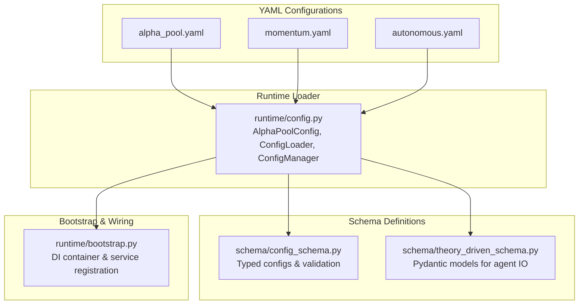
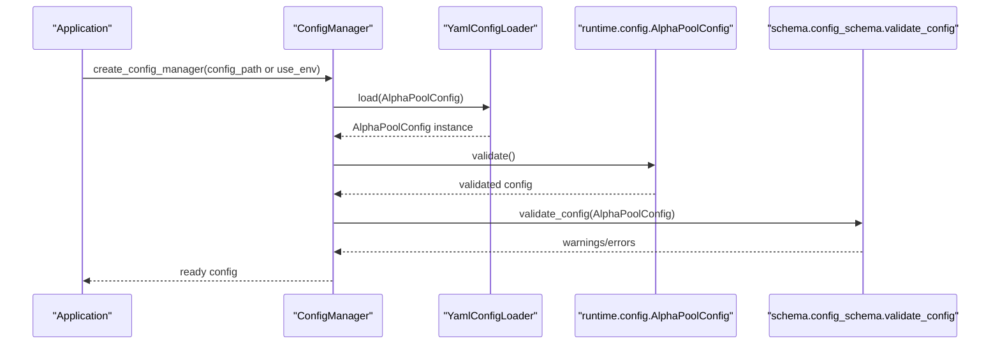
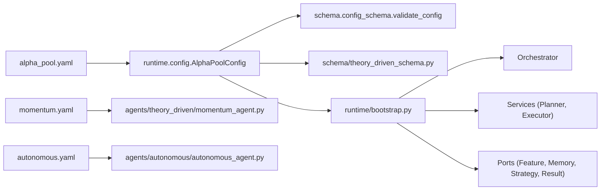

# Configuration Management

<cite>
**Referenced Files in This Document**
- [alpha_pool.yaml](file://FinAgents/agent_pools/alpha_agent_pool/config/alpha_pool.yaml)
- [momentum.yaml](file://FinAgents/agent_pools/alpha_agent_pool/config/momentum.yaml)
- [autonomous.yaml](file://FinAgents/agent_pools/alpha_agent_pool/config/autonomous.yaml)
- [config_schema.py](file://FinAgents/agent_pools/alpha_agent_pool/schema/config_schema.py)
- [theory_driven_schema.py](file://FinAgents/agent_pools/alpha_agent_pool/schema/theory_driven_schema.py)
- [config.py](file://FinAgents/agent_pools/alpha_agent_pool/runtime/config.py)
- [bootstrap.py](file://FinAgents/agent_pools/alpha_agent_pool/runtime/bootstrap.py)
- [momentum_agent.py](file://FinAgents/agent_pools/alpha_agent_pool/agents/theory_driven/momentum_agent.py)
- [autonomous_agent.py](file://FinAgents/agent_pools/alpha_agent_pool/agents/autonomous/autonomous_agent.py)
- [agent_manager.py](file://FinAgents/agent_pools/alpha_agent_pool/agents/agent_manager.py)
</cite>

## Table of Contents
1. [Introduction](#introduction)
2. [Project Structure](#project-structure)
3. [Core Components](#core-components)
4. [Architecture Overview](#architecture-overview)
5. [Detailed Component Analysis](#detailed-component-analysis)
6. [Dependency Analysis](#dependency-analysis)
7. [Performance Considerations](#performance-considerations)
8. [Troubleshooting Guide](#troubleshooting-guide)
9. [Conclusion](#conclusion)

## Introduction
This document explains configuration management for the Alpha Agent Pool with a focus on YAML configuration files and schema validation. It covers:
- Global pool settings, agent-specific configurations, and environment variables
- Momentum agent parameters (technical indicators, risk controls, execution settings)
- Autonomous agent configuration options for self-directed strategies
- Schema validation and parameter inheritance mechanisms
- Best practices for environment-specific settings and troubleshooting

## Project Structure
The configuration system spans three layers:
- YAML configuration files define runtime settings for the pool and agents
- Runtime configuration loader validates and loads these settings into typed dataclasses
- Schema modules define validation and typed models for configuration and data exchange

**Diagram sources**
- [alpha_pool.yaml](file://FinAgents/agent_pools/alpha_agent_pool/config/alpha_pool.yaml)
- [momentum.yaml](file://FinAgents/agent_pools/alpha_agent_pool/config/momentum.yaml)
- [autonomous.yaml](file://FinAgents/agent_pools/alpha_agent_pool/config/autonomous.yaml)
- [config.py](file://FinAgents/agent_pools/alpha_agent_pool/runtime/config.py)
- [config_schema.py](file://FinAgents/agent_pools/alpha_agent_pool/schema/config_schema.py)
- [theory_driven_schema.py](file://FinAgents/agent_pools/alpha_agent_pool/schema/theory_driven_schema.py)
- [bootstrap.py](file://FinAgents/agent_pools/alpha_agent_pool/runtime/bootstrap.py)

**Section sources**
- [alpha_pool.yaml](file://FinAgents/agent_pools/alpha_agent_pool/config/alpha_pool.yaml)
- [momentum.yaml](file://FinAgents/agent_pools/alpha_agent_pool/config/momentum.yaml)
- [autonomous.yaml](file://FinAgents/agent_pools/alpha_agent_pool/config/autonomous.yaml)
- [config.py](file://FinAgents/agent_pools/alpha_agent_pool/runtime/config.py)
- [config_schema.py](file://FinAgents/agent_pools/alpha_agent_pool/schema/config_schema.py)
- [theory_driven_schema.py](file://FinAgents/agent_pools/alpha_agent_pool/schema/theory_driven_schema.py)
- [bootstrap.py](file://FinAgents/agent_pools/alpha_agent_pool/runtime/bootstrap.py)

## Core Components
- Global pool configuration (alpha_pool.yaml):
  - Pool identity, environment, lifecycle, concurrency, retries, circuit breaker, backpressure, observability, strategy execution, feature caching, memory coordination, and MCP server/client settings
- Agent-specific configurations:
  - Momentum agent (momentum.yaml): strategy parameters (window, threshold), execution (port, mode, timeout), authentication placeholders, metadata, and LLM flag
  - Autonomous agent (autonomous.yaml): execution host/port, task processing, code generation workspace, memory agent connection, and task priorities
- Typed configuration schemas:
  - config_schema.py: dataclass-based configs for agents and the pool, validation helpers, and convenience factories
  - theory_driven_schema.py: Pydantic models for request/response contracts and strategy flow structures
- Runtime configuration loader:
  - config.py: typed dataclasses, validators, YAML loader, environment variable loader, and ConfigManager
- Bootstrap and dependency injection:
  - bootstrap.py: DI container wiring, service registration, and orchestrator setup

**Section sources**
- [alpha_pool.yaml](file://FinAgents/agent_pools/alpha_agent_pool/config/alpha_pool.yaml)
- [momentum.yaml](file://FinAgents/agent_pools/alpha_agent_pool/config/momentum.yaml)
- [autonomous.yaml](file://FinAgents/agent_pools/alpha_agent_pool/config/autonomous.yaml)
- [config_schema.py](file://FinAgents/agent_pools/alpha_agent_pool/schema/config_schema.py)
- [theory_driven_schema.py](file://FinAgents/agent_pools/alpha_agent_pool/schema/theory_driven_schema.py)
- [config.py](file://FinAgents/agent_pools/alpha_agent_pool/runtime/config.py)
- [bootstrap.py](file://FinAgents/agent_pools/alpha_agent_pool/runtime/bootstrap.py)

## Architecture Overview
The configuration pipeline integrates YAML, typed schemas, and runtime loaders:

**Diagram sources**
- [config.py](file://FinAgents/agent_pools/alpha_agent_pool/runtime/config.py)
- [config_schema.py](file://FinAgents/agent_pools/alpha_agent_pool/schema/config_schema.py)

## Detailed Component Analysis

### Global Pool Configuration (alpha_pool.yaml)
- Purpose: Defines pool-wide behavior and infrastructure settings
- Key areas:
  - Pool identity and environment
  - Lifecycle and concurrency (worker threads)
  - Retry policy (max attempts, delays, backoff, jitter)
  - Circuit breaker (failure threshold, recovery timeout)
  - Backpressure (queue size, warning threshold, RPS limit)
  - Observability (metrics/tracing/logging, port, log level)
  - Strategy execution (default timeout, warmup, concurrency)
  - Feature retrieval (cache TTL/size, fetch timeout)
  - Memory coordination (URL, timeouts, retry)
  - MCP server/client (host, port, client timeout, transport)

Best practices:
- Keep environment-specific overrides minimal; prefer environment variables for secrets and host/port overrides
- Align worker_threads with CPU capacity and expected concurrency
- Set observability ports and log levels per environment (development vs production)
- Tune backpressure and rate limits to match upstream provider SLAs

**Section sources**
- [alpha_pool.yaml](file://FinAgents/agent_pools/alpha_agent_pool/config/alpha_pool.yaml)
- [config.py](file://FinAgents/agent_pools/alpha_agent_pool/runtime/config.py)

### Momentum Agent Configuration (momentum.yaml)
- Purpose: Defines strategy and execution parameters for the momentum agent
- Key parameters:
  - Strategy: window (lookback), threshold (change percentage)
  - Execution: port, mode (e.g., MCP server), timeout
  - Authentication: placeholders for remote data access
  - Metadata: author, description, tags
  - LLM flag: whether LLM strategy generation is enabled

Integration with runtime:
- The agent’s MCP server listens on the configured port and runs in the specified mode
- Authentication fields can be populated from environment variables
- The agent’s internal configuration composes StrategyConfig and ExecutionConfig

Risk and execution controls:
- Use window sizes aligned with data frequency and expected turnover
- Calibrate threshold to reduce noise while preserving signal strength
- Set timeouts conservatively to avoid partial executions under load

**Section sources**
- [momentum.yaml](file://FinAgents/agent_pools/alpha_agent_pool/config/momentum.yaml)
- [momentum_agent.py](file://FinAgents/agent_pools/alpha_agent_pool/agents/theory_driven/momentum_agent.py)
- [theory_driven_schema.py](file://FinAgents/agent_pools/alpha_agent_pool/schema/theory_driven_schema.py)

### Autonomous Agent Configuration (autonomous.yaml)
- Purpose: Enables self-directed strategy discovery and execution
- Key areas:
  - Execution: host, port (avoid conflicts with other agents)
  - Task processing: interval, concurrency, timeout
  - Code generation: workspace directory, tool cache size, validation enablement
  - Memory agent: host, port, timeout
  - Task priorities: per-category scoring for scheduling

Operational guidance:
- Ensure workspace directory exists and is writable
- Enable validation to catch regressions in generated tools
- Size tool cache based on expected workload and disk constraints
- Monitor task queue depth and adjust concurrency to prevent overload

**Section sources**
- [autonomous.yaml](file://FinAgents/agent_pools/alpha_agent_pool/config/autonomous.yaml)
- [autonomous_agent.py](file://FinAgents/agent_pools/alpha_agent_pool/agents/autonomous/autonomous_agent.py)

### Schema Validation and Parameter Inheritance
- Typed configuration schemas:
  - config_schema.py: dataclass hierarchy for agent and pool configs, with defaults and validation helpers
  - theory_driven_schema.py: Pydantic models for request/response contracts and strategy flow structures
- Validation:
  - runtime/config.py: AlphaPoolConfig.validate enforces bounds and ranges
  - schema/config_schema.py: validate_config inspects risky parameters and missing persistence settings
- Parameter inheritance:
  - Agent-level configs inherit from base AgentConfig with defaults for logging, memory integration, and performance parameters
  - Pool-level configs aggregate agent-specific configs and provide global observability and QA settings

Recommendations:
- Use the provided factories to create environment-specific configs (research vs production)
- Apply schema validation early in startup to fail fast on misconfiguration
- Prefer explicit overrides for critical parameters; rely on defaults for non-critical settings

**Section sources**
- [config_schema.py](file://FinAgents/agent_pools/alpha_agent_pool/schema/config_schema.py)
- [theory_driven_schema.py](file://FinAgents/agent_pools/alpha_agent_pool/schema/theory_driven_schema.py)
- [config.py](file://FinAgents/agent_pools/alpha_agent_pool/runtime/config.py)

### Configuration Loading and Environment Variables
- YAML loader:
  - Loads alpha_pool.yaml into AlphaPoolConfig and validates values
- Environment variable loader:
  - Reads ALPHA_POOL_* prefixed variables to override select fields
- ConfigManager:
  - Provides a single access point for configuration with lazy loading and reload support

Environment-specific settings:
- Use environment variables for secrets (e.g., API keys) and host/port overrides
- Maintain separate YAML files per environment (development, staging, production) and select via CLI or deployment tooling

**Section sources**
- [config.py](file://FinAgents/agent_pools/alpha_agent_pool/runtime/config.py)

### Bootstrap and Service Registration
- Bootstrap wires configuration into the system:
  - Registers AlphaPoolConfig and ConfigManager singletons
  - Sets up observability (metrics, logging)
  - Registers port adapters (feature, memory, strategy, result)
  - Creates planner, executor, and orchestrator instances
- Orchestrator uses a thread-safe queue with an asyncio worker to handle tasks synchronously while executing steps asynchronously

**Section sources**
- [bootstrap.py](file://FinAgents/agent_pools/alpha_agent_pool/runtime/bootstrap.py)

## Dependency Analysis
Configuration dependencies across modules:

**Diagram sources**
- [alpha_pool.yaml](file://FinAgents/agent_pools/alpha_agent_pool/config/alpha_pool.yaml)
- [momentum.yaml](file://FinAgents/agent_pools/alpha_agent_pool/config/momentum.yaml)
- [autonomous.yaml](file://FinAgents/agent_pools/alpha_agent_pool/config/autonomous.yaml)
- [config.py](file://FinAgents/agent_pools/alpha_agent_pool/runtime/config.py)
- [config_schema.py](file://FinAgents/agent_pools/alpha_agent_pool/schema/config_schema.py)
- [theory_driven_schema.py](file://FinAgents/agent_pools/alpha_agent_pool/schema/theory_driven_schema.py)
- [bootstrap.py](file://FinAgents/agent_pools/alpha_agent_pool/runtime/bootstrap.py)
- [momentum_agent.py](file://FinAgents/agent_pools/alpha_agent_pool/agents/theory_driven/momentum_agent.py)
- [autonomous_agent.py](file://FinAgents/agent_pools/alpha_agent_pool/agents/autonomous/autonomous_agent.py)

**Section sources**
- [config.py](file://FinAgents/agent_pools/alpha_agent_pool/runtime/config.py)
- [bootstrap.py](file://FinAgents/agent_pools/alpha_agent_pool/runtime/bootstrap.py)
- [config_schema.py](file://FinAgents/agent_pools/alpha_agent_pool/schema/config_schema.py)
- [theory_driven_schema.py](file://FinAgents/agent_pools/alpha_agent_pool/schema/theory_driven_schema.py)
- [momentum_agent.py](file://FinAgents/agent_pools/alpha_agent_pool/agents/theory_driven/momentum_agent.py)
- [autonomous_agent.py](file://FinAgents/agent_pools/alpha_agent_pool/agents/autonomous/autonomous_agent.py)

## Performance Considerations
- Concurrency tuning:
  - Adjust worker_threads, max_concurrent_strategies, and max_concurrent_tasks based on CPU and I/O characteristics
- Backpressure and rate limiting:
  - Set max_queue_size and rate_limit_rps to prevent overload and maintain responsiveness
- Observability:
  - Enable metrics and tracing in production; tune log level to balance insight and overhead
- Feature caching:
  - Increase cache_ttl_seconds and max_cache_size to reduce repeated fetches when appropriate
- MCP transport:
  - Choose transport modes suitable for your network topology and latency requirements

[No sources needed since this section provides general guidance]

## Troubleshooting Guide
Common configuration issues and resolutions:
- Port conflicts:
  - Ensure MCP server ports are unique across agents (e.g., momentum vs autonomous)
  - Check runtime validation warnings for conflicts with memory services
- Invalid parameter ranges:
  - Fix retry attempts, queue sizes, and port numbers within allowed bounds
- Missing persistence:
  - Enable persistent storage to avoid losing results across restarts
- Authentication failures:
  - Populate API keys and secrets via environment variables or secure vaults
- YAML parsing errors:
  - Validate YAML syntax and indentation; prefer schema-aware editors
- Agent initialization failures:
  - Review agent-specific logs and ensure required resources (memory URLs, ports) are reachable

Validation and diagnostics:
- Use validate_config to surface warnings about risky or missing settings
- Inspect AlphaPoolConfig.validate for immediate parameter range checks
- Confirm environment variable overrides are applied by checking effective config

**Section sources**
- [config.py](file://FinAgents/agent_pools/alpha_agent_pool/runtime/config.py)
- [config_schema.py](file://FinAgents/agent_pools/alpha_agent_pool/schema/config_schema.py)
- [momentum_agent.py](file://FinAgents/agent_pools/alpha_agent_pool/agents/theory_driven/momentum_agent.py)
- [autonomous_agent.py](file://FinAgents/agent_pools/alpha_agent_pool/agents/autonomous/autonomous_agent.py)

## Conclusion
The Alpha Agent Pool’s configuration system combines YAML-driven settings with typed schemas and runtime validation to ensure reliable, environment-aware deployments. By leveraging environment variables for secrets, validating configurations early, and following the recommended best practices, teams can maintain robust, scalable, and observable agent pools tuned for both research and production environments.