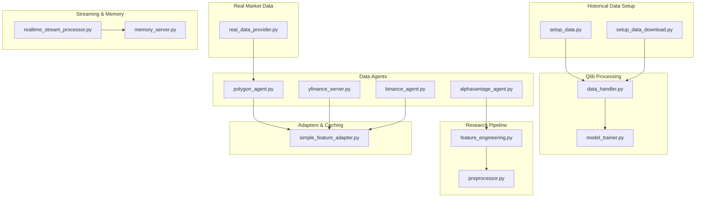
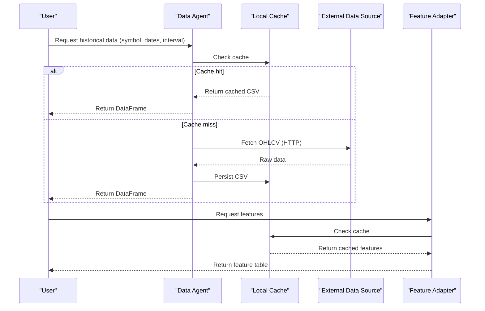
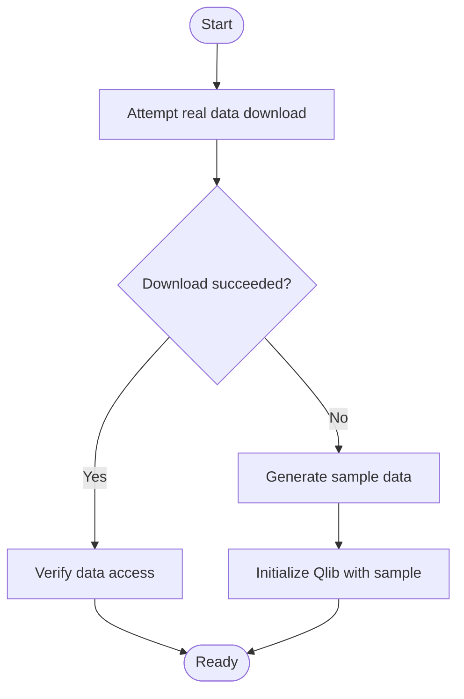
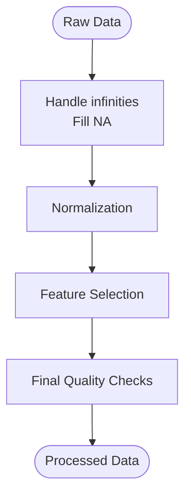
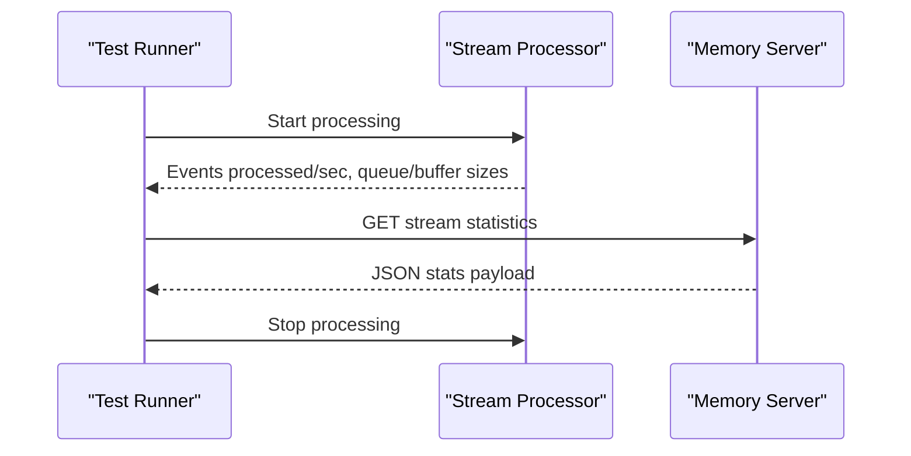
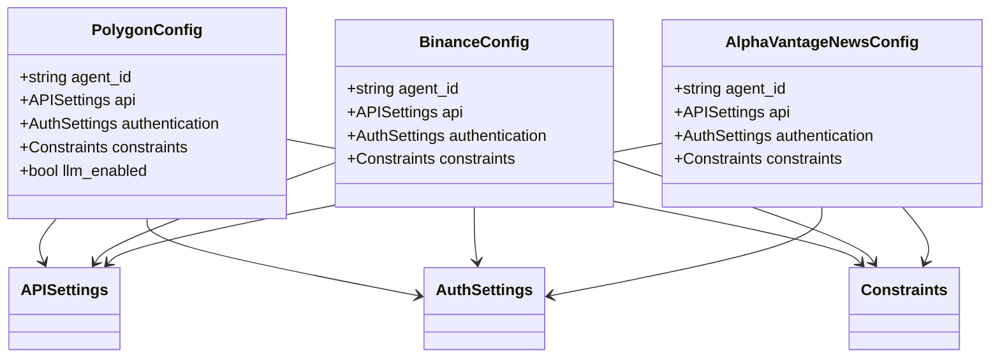
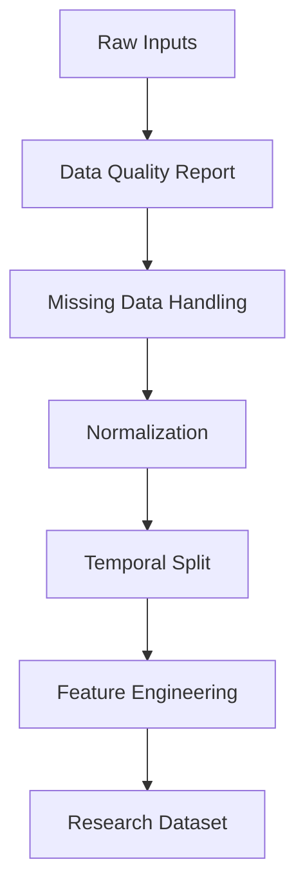
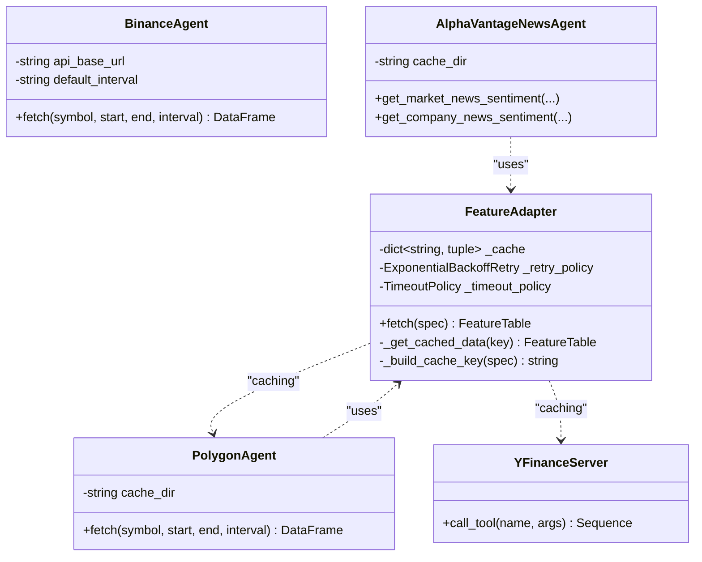
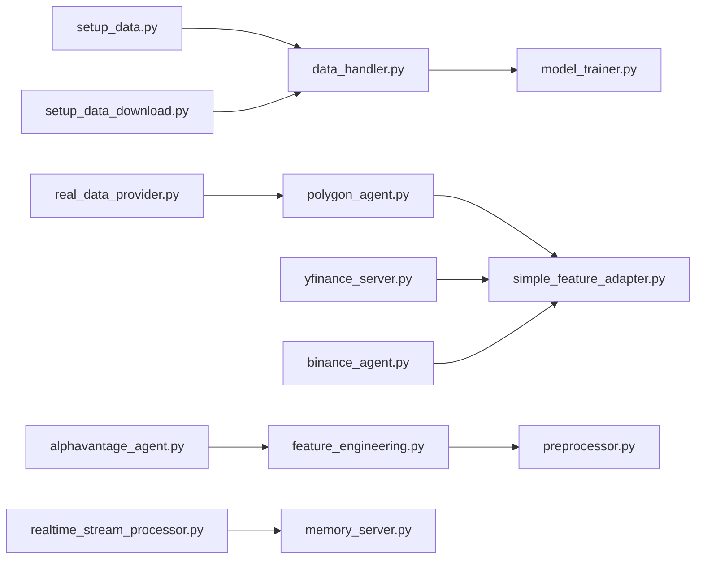

# Data Loading and Processing

<cite>
**Referenced Files in This Document**
- [setup_data.py](file://FinAgents/agent_pools/alpha_agent_pool/qlib_local/setup_data.py)
- [setup_data_download.py](file://FinAgents/agent_pools/alpha_agent_pool/qlib_local/setup_data_download.py)
- [data_handler.py](file://FinAgents/agent_pools/alpha_agent_pool/qlib_local/qlib_standard/data_handler.py)
- [model_trainer.py](file://FinAgents/agent_pools/alpha_agent_pool/qlib_local/qlib_standard/model_trainer.py)
- [real_data_provider.py](file://backend/market/real_data_provider.py)
- [polygon_agent.py](file://FinAgents/agent_pools/data_agent_pool/agents/equity/polygon_agent.py)
- [yfinance_server.py](file://FinAgents/agent_pools/data_agent_pool/agents/equity/yfinance_server.py)
- [binance_agent.py](file://FinAgents/agent_pools/data_agent_pool/agents/crypto/binance_agent.py)
- [alphavantage_agent.py](file://FinAgents/agent_pools/data_agent_pool/agents/news/alphavantage_agent.py)
- [equity_schema.py](file://FinAgents/agent_pools/data_agent_pool/schema/equity_schema.py)
- [crypto_schema.py](file://FinAgents/agent_pools/data_agent_pool/schema/crypto_schema.py)
- [news_schema.py](file://FinAgents/agent_pools/data_agent_pool/schema/news_schema.py)
- [preprocessor.py](file://FinAgents/research/data_pipeline/preprocessor.py)
- [feature_engineering.py](file://FinAgents/research/data_pipeline/feature_engineering.py)
- [realtime_stream_processor.py](file://FinAgents/memory/realtime_stream_processor.py)
- [memory_server.py](file://FinAgents/memory/memory_server.py)
- [simple_feature_adapter.py](file://FinAgents/agent_pools/alpha_agent_pool/agents/adapters/feature/simple_feature_adapter.py)
</cite>

## Table of Contents
1. [Introduction](#introduction)
2. [Project Structure](#project-structure)
3. [Core Components](#core-components)
4. [Architecture Overview](#architecture-overview)
5. [Detailed Component Analysis](#detailed-component-analysis)
6. [Dependency Analysis](#dependency-analysis)
7. [Performance Considerations](#performance-considerations)
8. [Troubleshooting Guide](#troubleshooting-guide)
9. [Conclusion](#conclusion)

## Introduction
This document describes the data loading and processing infrastructure used across the agentic trading application. It covers historical data ingestion, real-time data streaming, transformation pipelines, data interfaces for multiple market data sources, initialization procedures, validation and preprocessing workflows, caching strategies, configuration options, performance optimizations, and error handling for connectivity issues.

## Project Structure
The data infrastructure spans several subsystems:
- Qlib-backed research and backtesting data setup and processing
- Real market data providers (Yahoo Finance)
- Data agents for equities (Polygon, Yahoo Finance MCP), crypto (Binance), and news (Alpha Vantage)
- Research-grade preprocessing and feature engineering
- Real-time stream processing and memory integration
- Caching and retry policies for feature adapters

**Diagram sources**
- [setup_data.py:1-231](file://FinAgents/agent_pools/alpha_agent_pool/qlib_local/setup_data.py#L1-L231)
- [setup_data_download.py:1-325](file://FinAgents/agent_pools/alpha_agent_pool/qlib_local/setup_data_download.py#L1-L325)
- [data_handler.py:73-493](file://FinAgents/agent_pools/alpha_agent_pool/qlib_local/qlib_standard/data_handler.py#L73-L493)
- [model_trainer.py:351-387](file://FinAgents/agent_pools/alpha_agent_pool/qlib_local/qlib_standard/model_trainer.py#L351-L387)
- [real_data_provider.py:1-230](file://backend/market/real_data_provider.py#L1-L230)
- [polygon_agent.py:1-568](file://FinAgents/agent_pools/data_agent_pool/agents/equity/polygon_agent.py#L1-L568)
- [yfinance_server.py:1-350](file://FinAgents/agent_pools/data_agent_pool/agents/equity/yfinance_server.py#L1-L350)
- [binance_agent.py:1-102](file://FinAgents/agent_pools/data_agent_pool/agents/crypto/binance_agent.py#L1-L102)
- [alphavantage_agent.py:1-934](file://FinAgents/agent_pools/data_agent_pool/agents/news/alphavantage_agent.py#L1-L934)
- [preprocessor.py:1-55](file://FinAgents/research/data_pipeline/preprocessor.py#L1-L55)
- [feature_engineering.py:1-354](file://FinAgents/research/data_pipeline/feature_engineering.py#L1-L354)
- [realtime_stream_processor.py:526-541](file://FinAgents/memory/realtime_stream_processor.py#L526-L541)
- [memory_server.py:918-947](file://FinAgents/memory/memory_server.py#L918-L947)
- [simple_feature_adapter.py:1-67](file://FinAgents/agent_pools/alpha_agent_pool/agents/adapters/feature/simple_feature_adapter.py#L1-L67)

**Section sources**
- [setup_data.py:1-231](file://FinAgents/agent_pools/alpha_agent_pool/qlib_local/setup_data.py#L1-L231)
- [setup_data_download.py:1-325](file://FinAgents/agent_pools/alpha_agent_pool/qlib_local/setup_data_download.py#L1-L325)

## Core Components
- Historical data setup and initialization for Qlib-backed research/backtesting
- Data handler and trainer for cleaning, normalization, and training-ready datasets
- Real market data provider for Yahoo Finance
- Data agents for equities (Polygon, Yahoo Finance MCP), crypto (Binance), and news (Alpha Vantage)
- Research preprocessing and feature engineering
- Real-time stream processing and memory server integration
- Feature adapter with caching, retry, and observability

**Section sources**
- [data_handler.py:73-493](file://FinAgents/agent_pools/alpha_agent_pool/qlib_local/qlib_standard/data_handler.py#L73-L493)
- [model_trainer.py:351-387](file://FinAgents/agent_pools/alpha_agent_pool/qlib_local/qlib_standard/model_trainer.py#L351-L387)
- [real_data_provider.py:1-230](file://backend/market/real_data_provider.py#L1-L230)
- [polygon_agent.py:1-568](file://FinAgents/agent_pools/data_agent_pool/agents/equity/polygon_agent.py#L1-L568)
- [yfinance_server.py:1-350](file://FinAgents/agent_pools/data_agent_pool/agents/equity/yfinance_server.py#L1-L350)
- [binance_agent.py:1-102](file://FinAgents/agent_pools/data_agent_pool/agents/crypto/binance_agent.py#L1-L102)
- [alphavantage_agent.py:1-934](file://FinAgents/agent_pools/data_agent_pool/agents/news/alphavantage_agent.py#L1-L934)
- [preprocessor.py:1-55](file://FinAgents/research/data_pipeline/preprocessor.py#L1-L55)
- [feature_engineering.py:1-354](file://FinAgents/research/data_pipeline/feature_engineering.py#L1-L354)
- [realtime_stream_processor.py:526-541](file://FinAgents/memory/realtime_stream_processor.py#L526-L541)
- [memory_server.py:918-947](file://FinAgents/memory/memory_server.py#L918-L947)
- [simple_feature_adapter.py:1-67](file://FinAgents/agent_pools/alpha_agent_pool/agents/adapters/feature/simple_feature_adapter.py#L1-L67)

## Architecture Overview
The system integrates multiple data sources and processing stages:
- Data initialization: Qlib setup scripts create or download sample data and verify accessibility
- Data ingestion: Data agents fetch from Polygon, Yahoo Finance, Binance, and Alpha Vantage
- Data transformation: Cleaning, normalization, and feature engineering produce research-ready datasets
- Real-time streaming: Stream processor handles live events and exposes statistics via memory server
- Caching and retries: Feature adapter caches results and applies retry/backoff policies

**Diagram sources**
- [polygon_agent.py:173-246](file://FinAgents/agent_pools/data_agent_pool/agents/equity/polygon_agent.py#L173-L246)
- [yfinance_server.py:251-336](file://FinAgents/agent_pools/data_agent_pool/agents/equity/yfinance_server.py#L251-L336)
- [binance_agent.py:27-69](file://FinAgents/agent_pools/data_agent_pool/agents/crypto/binance_agent.py#L27-L69)
- [simple_feature_adapter.py:46-67](file://FinAgents/agent_pools/alpha_agent_pool/agents/adapters/feature/simple_feature_adapter.py#L46-L67)

## Detailed Component Analysis

### Historical Data Ingestion and Initialization
- Qlib setup supports synthetic data generation and real data download attempts, with fallback to sample data and verification steps
- Additional download script aggregates ETF and crypto minute-level data from multiple sources and creates a data summary

**Diagram sources**
- [setup_data.py:90-217](file://FinAgents/agent_pools/alpha_agent_pool/qlib_local/setup_data.py#L90-L217)
- [setup_data_download.py:276-314](file://FinAgents/agent_pools/alpha_agent_pool/qlib_local/setup_data_download.py#L276-L314)

**Section sources**
- [setup_data.py:1-231](file://FinAgents/agent_pools/alpha_agent_pool/qlib_local/setup_data.py#L1-L231)
- [setup_data_download.py:1-325](file://FinAgents/agent_pools/alpha_agent_pool/qlib_local/setup_data_download.py#L1-L325)

### Data Transformation Pipelines
- Data handler applies cleaning, normalization, and feature selection; performs final quality checks and validation
- Model trainer aligns features and labels, cleans missing values, handles infinities, and clips outliers

**Diagram sources**
- [data_handler.py:73-493](file://FinAgents/agent_pools/alpha_agent_pool/qlib_local/qlib_standard/data_handler.py#L73-L493)
- [model_trainer.py:351-387](file://FinAgents/agent_pools/alpha_agent_pool/qlib_local/qlib_standard/model_trainer.py#L351-L387)

**Section sources**
- [data_handler.py:73-493](file://FinAgents/agent_pools/alpha_agent_pool/qlib_local/qlib_standard/data_handler.py#L73-L493)
- [model_trainer.py:351-387](file://FinAgents/agent_pools/alpha_agent_pool/qlib_local/qlib_standard/model_trainer.py#L351-L387)

### Real-Time Data Streaming
- Real-time stream processor runs periodic tests and reports system statistics
- Memory server exposes stream statistics and health endpoints

**Diagram sources**
- [realtime_stream_processor.py:526-541](file://FinAgents/memory/realtime_stream_processor.py#L526-L541)
- [memory_server.py:918-947](file://FinAgents/memory/memory_server.py#L918-L947)

**Section sources**
- [realtime_stream_processor.py:526-541](file://FinAgents/memory/realtime_stream_processor.py#L526-L541)
- [memory_server.py:918-947](file://FinAgents/memory/memory_server.py#L918-L947)

### Data Interfaces and Configuration
- Equity agents (Polygon, Yahoo Finance MCP) expose tools for historical data retrieval, company info, and leader identification
- Crypto agent (Binance) demonstrates configuration-driven API base URL, endpoints, intervals, and rate limits
- News agent (Alpha Vantage) implements rate limiting and sentiment analysis tools
- Pydantic schemas define configuration structures for each agent category

**Diagram sources**
- [equity_schema.py:17-34](file://FinAgents/agent_pools/data_agent_pool/schema/equity_schema.py#L17-L34)
- [crypto_schema.py:18-35](file://FinAgents/agent_pools/data_agent_pool/schema/crypto_schema.py#L18-L35)
- [news_schema.py:17-32](file://FinAgents/agent_pools/data_agent_pool/schema/news_schema.py#L17-L32)

**Section sources**
- [polygon_agent.py:1-568](file://FinAgents/agent_pools/data_agent_pool/agents/equity/polygon_agent.py#L1-L568)
- [yfinance_server.py:1-350](file://FinAgents/agent_pools/data_agent_pool/agents/equity/yfinance_server.py#L1-L350)
- [binance_agent.py:1-102](file://FinAgents/agent_pools/data_agent_pool/agents/crypto/binance_agent.py#L1-L102)
- [alphavantage_agent.py:1-934](file://FinAgents/agent_pools/data_agent_pool/agents/news/alphavantage_agent.py#L1-L934)
- [equity_schema.py:1-34](file://FinAgents/agent_pools/data_agent_pool/schema/equity_schema.py#L1-L34)
- [crypto_schema.py:1-35](file://FinAgents/agent_pools/data_agent_pool/schema/crypto_schema.py#L1-L35)
- [news_schema.py:1-32](file://FinAgents/agent_pools/data_agent_pool/schema/news_schema.py#L1-L32)

### Data Validation, Cleaning, and Preprocessing Workflows
- Research preprocessor defines data quality report and end-to-end dataset creation
- Feature engineering computes technical indicators, statistical features, cross-asset features, and sentiment features

**Diagram sources**
- [preprocessor.py:20-55](file://FinAgents/research/data_pipeline/preprocessor.py#L20-L55)
- [feature_engineering.py:17-354](file://FinAgents/research/data_pipeline/feature_engineering.py#L17-L354)

**Section sources**
- [preprocessor.py:1-55](file://FinAgents/research/data_pipeline/preprocessor.py#L1-L55)
- [feature_engineering.py:1-354](file://FinAgents/research/data_pipeline/feature_engineering.py#L1-L354)

### Data Download Mechanisms and Caching Strategies
- Polygon agent caches CSV files locally keyed by symbol, date range, and interval
- Yahoo Finance MCP server saves CSV outputs to configurable directories
- Binance agent demonstrates configuration-driven intervals and rate limits
- Alpha Vantage agent implements rate limiting and caching directories
- Feature adapter provides in-memory caching with TTL, retry, and observability

**Diagram sources**
- [simple_feature_adapter.py:14-67](file://FinAgents/agent_pools/alpha_agent_pool/agents/adapters/feature/simple_feature_adapter.py#L14-L67)
- [polygon_agent.py:43-61](file://FinAgents/agent_pools/data_agent_pool/agents/equity/polygon_agent.py#L43-L61)
- [yfinance_server.py:229-336](file://FinAgents/agent_pools/data_agent_pool/agents/equity/yfinance_server.py#L229-L336)
- [binance_agent.py:12-25](file://FinAgents/agent_pools/data_agent_pool/agents/crypto/binance_agent.py#L12-L25)
- [alphavantage_agent.py:36-62](file://FinAgents/agent_pools/data_agent_pool/agents/news/alphavantage_agent.py#L36-L62)

**Section sources**
- [polygon_agent.py:173-246](file://FinAgents/agent_pools/data_agent_pool/agents/equity/polygon_agent.py#L173-L246)
- [yfinance_server.py:251-336](file://FinAgents/agent_pools/data_agent_pool/agents/equity/yfinance_server.py#L251-L336)
- [binance_agent.py:27-69](file://FinAgents/agent_pools/data_agent_pool/agents/crypto/binance_agent.py#L27-L69)
- [alphavantage_agent.py:148-158](file://FinAgents/agent_pools/data_agent_pool/agents/news/alphavantage_agent.py#L148-L158)
- [simple_feature_adapter.py:14-67](file://FinAgents/agent_pools/alpha_agent_pool/agents/adapters/feature/simple_feature_adapter.py#L14-L67)

### Configuration Options for Different Data Sources
- APISettings: base_url, endpoints, default_interval
- AuthSettings: api_key, secret_key (optional for some)
- Constraints: timeout, rate_limit_per_minute
- Agent-specific configs: PolygonConfig, BinanceConfig, AlphaVantageNewsConfig

**Section sources**
- [equity_schema.py:4-34](file://FinAgents/agent_pools/data_agent_pool/schema/equity_schema.py#L4-L34)
- [crypto_schema.py:5-35](file://FinAgents/agent_pools/data_agent_pool/schema/crypto_schema.py#L5-L35)
- [news_schema.py:5-32](file://FinAgents/agent_pools/data_agent_pool/schema/news_schema.py#L5-L32)

### Performance Optimization Techniques
- Caching: Local CSV cache for historical data; in-memory cache with TTL for features
- Retry and timeouts: Exponential backoff retry policy and timeout policy for feature adapter
- Rate limiting: Alpha Vantage agent enforces minimum request intervals; Binance agent uses configured rate limits
- Data alignment and cleaning: Trainer aligns indices, removes missing labels, fills features, replaces infinities, and clips outliers

**Section sources**
- [simple_feature_adapter.py:24-45](file://FinAgents/agent_pools/alpha_agent_pool/agents/adapters/feature/simple_feature_adapter.py#L24-L45)
- [alphavantage_agent.py:148-158](file://FinAgents/agent_pools/data_agent_pool/agents/news/alphavantage_agent.py#L148-L158)
- [binance_agent.py:20-25](file://FinAgents/agent_pools/data_agent_pool/agents/crypto/binance_agent.py#L20-L25)
- [model_trainer.py:351-387](file://FinAgents/agent_pools/alpha_agent_pool/qlib_local/qlib_standard/model_trainer.py#L351-L387)

### Error Handling for Data Connectivity Issues
- Polygon agent validates API key presence and raises runtime errors on API failures
- Alpha Vantage agent checks for API errors and rate limit notices
- Real market data provider wraps yfinance calls and logs errors
- Feature adapter increments counters and logs cache hits/misses for observability

**Section sources**
- [polygon_agent.py:295-299](file://FinAgents/agent_pools/data_agent_pool/agents/equity/polygon_agent.py#L295-L299)
- [alphavantage_agent.py:182-192](file://FinAgents/agent_pools/data_agent_pool/agents/news/alphavantage_agent.py#L182-L192)
- [real_data_provider.py:77-83](file://backend/market/real_data_provider.py#L77-L83)
- [simple_feature_adapter.py:60-67](file://FinAgents/agent_pools/alpha_agent_pool/agents/adapters/feature/simple_feature_adapter.py#L60-L67)

## Dependency Analysis
The data pipeline exhibits layered dependencies:
- Initialization scripts depend on Qlib and external providers
- Data agents depend on configuration schemas and external APIs
- Processing components depend on pandas/numpy and internal utilities
- Streaming and memory components depend on reactive managers and servers

**Diagram sources**
- [setup_data.py:1-231](file://FinAgents/agent_pools/alpha_agent_pool/qlib_local/setup_data.py#L1-L231)
- [setup_data_download.py:1-325](file://FinAgents/agent_pools/alpha_agent_pool/qlib_local/setup_data_download.py#L1-L325)
- [data_handler.py:73-493](file://FinAgents/agent_pools/alpha_agent_pool/qlib_local/qlib_standard/data_handler.py#L73-L493)
- [model_trainer.py:351-387](file://FinAgents/agent_pools/alpha_agent_pool/qlib_local/qlib_standard/model_trainer.py#L351-L387)
- [real_data_provider.py:1-230](file://backend/market/real_data_provider.py#L1-L230)
- [polygon_agent.py:1-568](file://FinAgents/agent_pools/data_agent_pool/agents/equity/polygon_agent.py#L1-L568)
- [yfinance_server.py:1-350](file://FinAgents/agent_pools/data_agent_pool/agents/equity/yfinance_server.py#L1-L350)
- [binance_agent.py:1-102](file://FinAgents/agent_pools/data_agent_pool/agents/crypto/binance_agent.py#L1-L102)
- [alphavantage_agent.py:1-934](file://FinAgents/agent_pools/data_agent_pool/agents/news/alphavantage_agent.py#L1-L934)
- [feature_engineering.py:1-354](file://FinAgents/research/data_pipeline/feature_engineering.py#L1-L354)
- [preprocessor.py:1-55](file://FinAgents/research/data_pipeline/preprocessor.py#L1-L55)
- [realtime_stream_processor.py:526-541](file://FinAgents/memory/realtime_stream_processor.py#L526-L541)
- [memory_server.py:918-947](file://FinAgents/memory/memory_server.py#L918-L947)
- [simple_feature_adapter.py:1-67](file://FinAgents/agent_pools/alpha_agent_pool/agents/adapters/feature/simple_feature_adapter.py#L1-L67)

**Section sources**
- [setup_data.py:1-231](file://FinAgents/agent_pools/alpha_agent_pool/qlib_local/setup_data.py#L1-L231)
- [setup_data_download.py:1-325](file://FinAgents/agent_pools/alpha_agent_pool/qlib_local/setup_data_download.py#L1-L325)
- [data_handler.py:73-493](file://FinAgents/agent_pools/alpha_agent_pool/qlib_local/qlib_standard/data_handler.py#L73-L493)
- [model_trainer.py:351-387](file://FinAgents/agent_pools/alpha_agent_pool/qlib_local/qlib_standard/model_trainer.py#L351-L387)
- [real_data_provider.py:1-230](file://backend/market/real_data_provider.py#L1-L230)
- [polygon_agent.py:1-568](file://FinAgents/agent_pools/data_agent_pool/agents/equity/polygon_agent.py#L1-L568)
- [yfinance_server.py:1-350](file://FinAgents/agent_pools/data_agent_pool/agents/equity/yfinance_server.py#L1-L350)
- [binance_agent.py:1-102](file://FinAgents/agent_pools/data_agent_pool/agents/crypto/binance_agent.py#L1-L102)
- [alphavantage_agent.py:1-934](file://FinAgents/agent_pools/data_agent_pool/agents/news/alphavantage_agent.py#L1-L934)
- [feature_engineering.py:1-354](file://FinAgents/research/data_pipeline/feature_engineering.py#L1-L354)
- [preprocessor.py:1-55](file://FinAgents/research/data_pipeline/preprocessor.py#L1-L55)
- [realtime_stream_processor.py:526-541](file://FinAgents/memory/realtime_stream_processor.py#L526-L541)
- [memory_server.py:918-947](file://FinAgents/memory/memory_server.py#L918-L947)
- [simple_feature_adapter.py:1-67](file://FinAgents/agent_pools/alpha_agent_pool/agents/adapters/feature/simple_feature_adapter.py#L1-L67)

## Performance Considerations
- Prefer caching for repeated queries to reduce network overhead
- Apply normalization and feature selection early to minimize downstream computation
- Use rate limiting and exponential backoff to avoid throttling and improve resilience
- Align indices and clean missing data in training pipelines to prevent model degradation
- Monitor stream processing throughput and buffer sizes to tune concurrency

[No sources needed since this section provides general guidance]

## Troubleshooting Guide
- Initialization failures: Verify Qlib data directories and permissions; confirm real data download availability or fallback to sample data
- API errors: Check API keys and rate limits; review error messages from external providers
- Data gaps: Validate date ranges and intervals; ensure cache directories exist and are writable
- Training issues: Confirm feature alignment and label consistency; apply cleaning and clipping steps
- Streaming problems: Inspect stream statistics and health endpoints; verify server startup and tool registration

**Section sources**
- [setup_data.py:188-217](file://FinAgents/agent_pools/alpha_agent_pool/qlib_local/setup_data.py#L188-L217)
- [polygon_agent.py:223-226](file://FinAgents/agent_pools/data_agent_pool/agents/equity/polygon_agent.py#L223-L226)
- [alphavantage_agent.py:182-192](file://FinAgents/agent_pools/data_agent_pool/agents/news/alphavantage_agent.py#L182-L192)
- [model_trainer.py:351-387](file://FinAgents/agent_pools/alpha_agent_pool/qlib_local/qlib_standard/model_trainer.py#L351-L387)
- [memory_server.py:918-947](file://FinAgents/memory/memory_server.py#L918-L947)

## Conclusion
The data infrastructure combines robust initialization, multi-source ingestion, comprehensive preprocessing, and resilient streaming. By leveraging caching, retry policies, and structured configurations, the system ensures reliable and efficient data workflows across historical and real-time contexts.