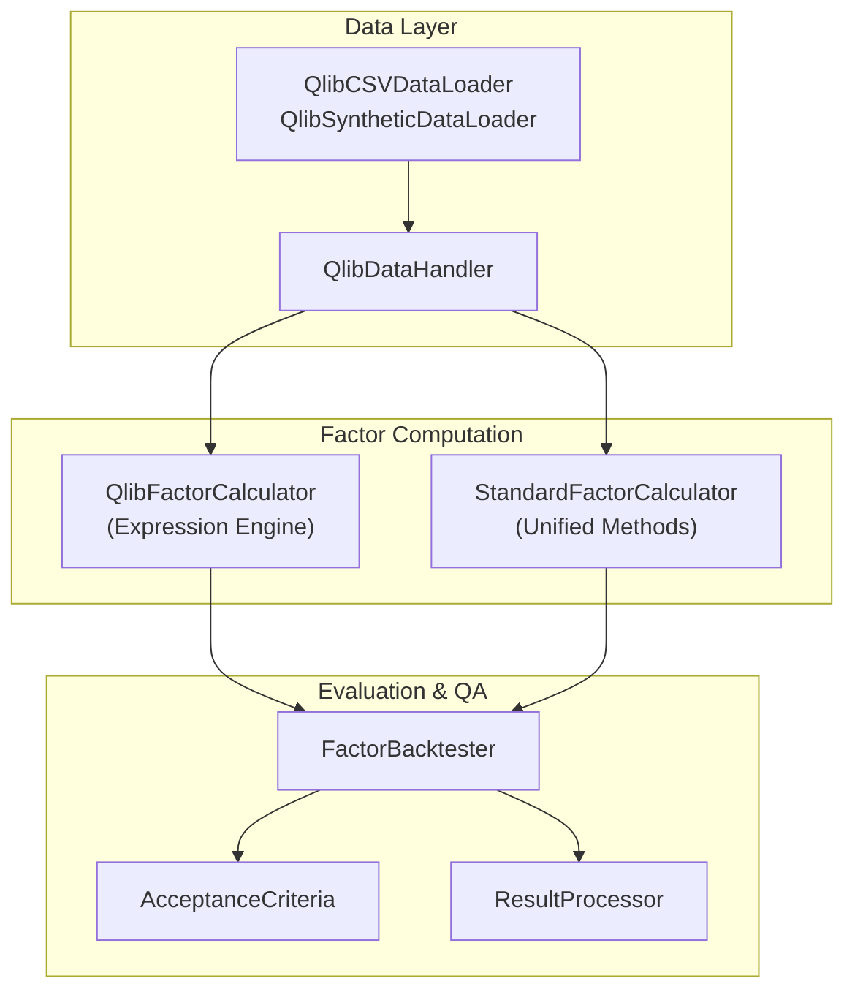
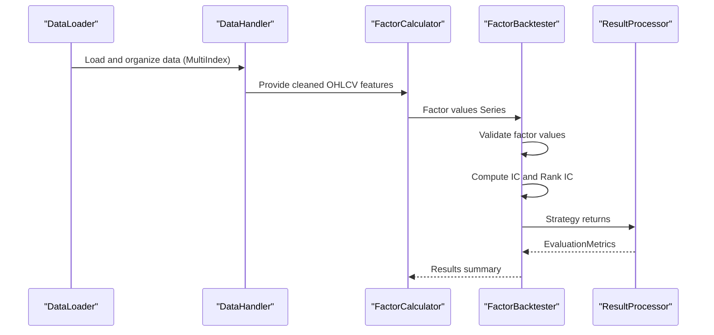
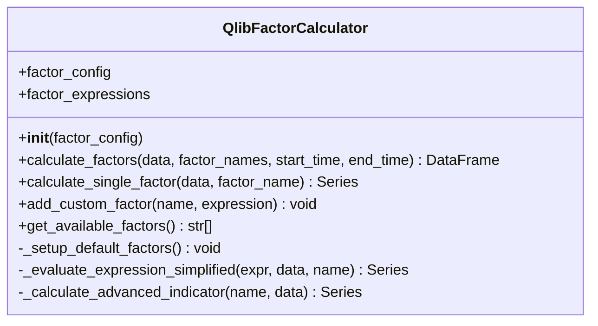
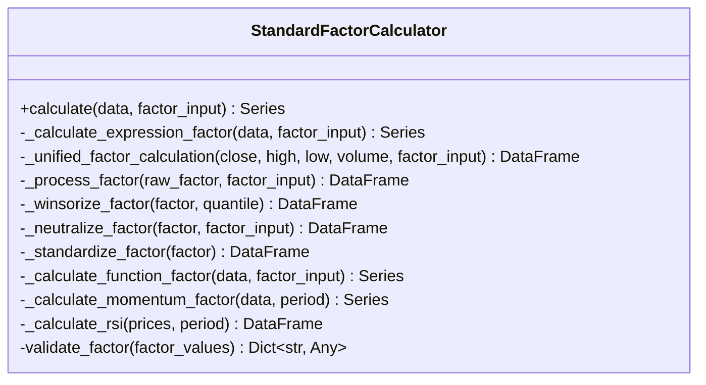
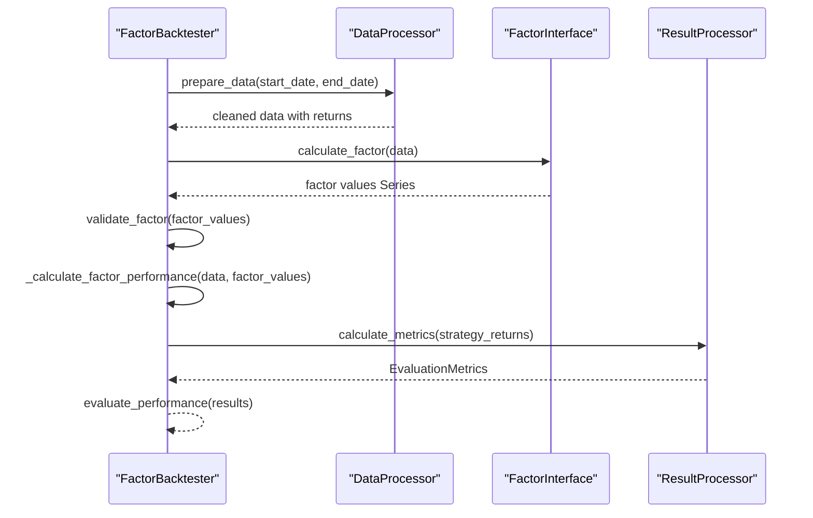
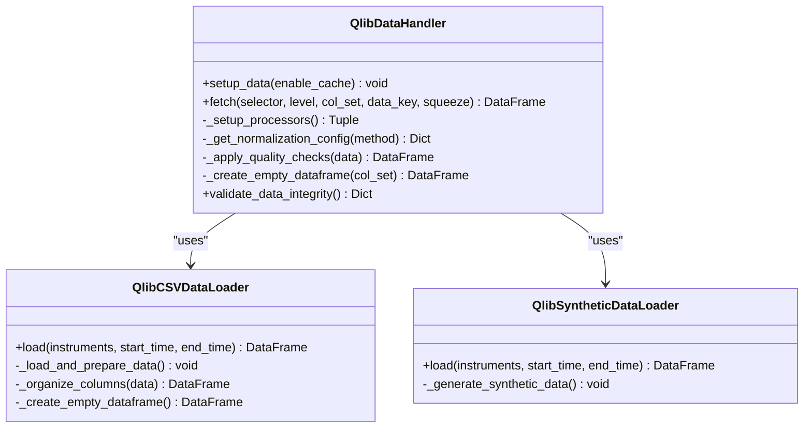
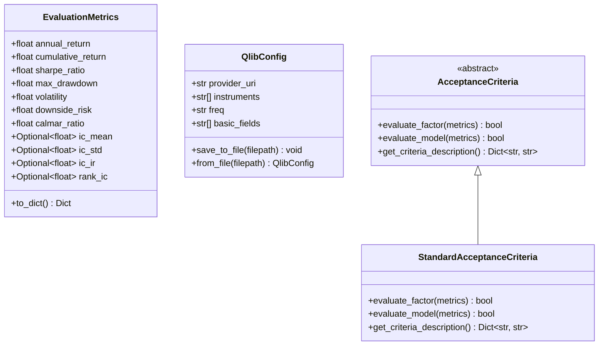
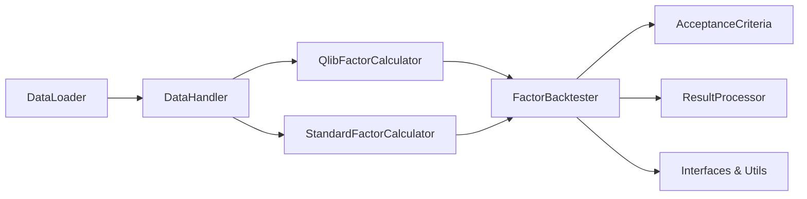

# Factor Calculation System

<cite>
**Referenced Files in This Document**
- [factor_calculator.py](file://FinAgents/agent_pools/alpha_agent_pool/qlib_local/qlib_standard/factor_calculator.py)
- [standard_factor_calculator.py](file://FinAgents/agent_pools/alpha_agent_pool/qlib_local/standard_factor_calculator.py)
- [factor_pipeline.py](file://FinAgents/agent_pools/alpha_agent_pool/qlib_local/factor_pipeline.py)
- [data_handler.py](file://FinAgents/agent_pools/alpha_agent_pool/qlib_local/qlib_standard/data_handler.py)
- [data_loader.py](file://FinAgents/agent_pools/alpha_agent_pool/qlib_local/qlib_standard/data_loader.py)
- [interfaces.py](file://FinAgents/agent_pools/alpha_agent_pool/qlib_local/interfaces.py)
- [utils.py](file://FinAgents/agent_pools/alpha_agent_pool/qlib_local/utils.py)
- [data_interfaces.py](file://FinAgents/agent_pools/alpha_agent_pool/qlib_local/data_interfaces.py)
</cite>

## Table of Contents
1. [Introduction](#introduction)
2. [Project Structure](#project-structure)
3. [Core Components](#core-components)
4. [Architecture Overview](#architecture-overview)
5. [Detailed Component Analysis](#detailed-component-analysis)
6. [Dependency Analysis](#dependency-analysis)
7. [Performance Considerations](#performance-considerations)
8. [Troubleshooting Guide](#troubleshooting-guide)
9. [Conclusion](#conclusion)
10. [Appendices](#appendices)

## Introduction
This document describes the factor calculation system used in alpha signal generation within the Agentic Trading Application. It explains how technical indicators, statistical factors, and machine learning features are computed, validated, and integrated into a batch and real-time pipeline. The system supports both Qlib-based expression-driven factor computation and a standard factor calculator with configurable processing, normalization, and quality assurance.

## Project Structure
The factor system is organized around three primary layers:
- Data ingestion and preprocessing: CSV and synthetic loaders, Qlib-compatible handlers
- Factor computation: Qlib expression-based calculator and standard factor calculator
- Evaluation and QA: Factor backtesting pipeline, acceptance criteria, and result processing

**Diagram sources**
- [data_loader.py:17-341](file://FinAgents/agent_pools/alpha_agent_pool/qlib_local/qlib_standard/data_loader.py#L17-L341)
- [data_handler.py:24-494](file://FinAgents/agent_pools/alpha_agent_pool/qlib_local/qlib_standard/data_handler.py#L24-L494)
- [factor_calculator.py:36-1019](file://FinAgents/agent_pools/alpha_agent_pool/qlib_local/qlib_standard/factor_calculator.py#L36-L1019)
- [standard_factor_calculator.py:12-325](file://FinAgents/agent_pools/alpha_agent_pool/qlib_local/standard_factor_calculator.py#L12-L325)
- [factor_pipeline.py:25-426](file://FinAgents/agent_pools/alpha_agent_pool/qlib_local/factor_pipeline.py#L25-L426)
- [interfaces.py:15-267](file://FinAgents/agent_pools/alpha_agent_pool/qlib_local/interfaces.py#L15-L267)
- [utils.py:35-513](file://FinAgents/agent_pools/alpha_agent_pool/qlib_local/utils.py#L35-L513)

**Section sources**
- [data_loader.py:17-341](file://FinAgents/agent_pools/alpha_agent_pool/qlib_local/qlib_standard/data_loader.py#L17-L341)
- [data_handler.py:24-494](file://FinAgents/agent_pools/alpha_agent_pool/qlib_local/qlib_standard/data_handler.py#L24-L494)
- [factor_calculator.py:36-1019](file://FinAgents/agent_pools/alpha_agent_pool/qlib_local/qlib_standard/factor_calculator.py#L36-L1019)
- [standard_factor_calculator.py:12-325](file://FinAgents/agent_pools/alpha_agent_pool/qlib_local/standard_factor_calculator.py#L12-L325)
- [factor_pipeline.py:25-426](file://FinAgents/agent_pools/alpha_agent_pool/qlib_local/factor_pipeline.py#L25-L426)
- [interfaces.py:15-267](file://FinAgents/agent_pools/alpha_agent_pool/qlib_local/interfaces.py#L15-L267)
- [utils.py:35-513](file://FinAgents/agent_pools/alpha_agent_pool/qlib_local/utils.py#L35-L513)

## Core Components
- QlibFactorCalculator: Implements a comprehensive set of technical and statistical factors using Qlib’s expression engine and operator library. Supports batch calculation across instruments and time windows, with fallback simplified evaluation for demonstration.
- StandardFactorCalculator: Provides unified factor computation via configurable methods (expression/function/default), including momentum, volatility, RSI, Bollinger Bands, trend, and cross-sectional factors. Includes selective winsorization and optional neutralization.
- FactorBacktester: Orchestrates factor evaluation with data preparation, factor calculation, validation, performance metrics (IC, Rank IC), and strategy returns generation.
- DataHandler/DataLoader: Loads and structures market data in Qlib-compatible multi-index format, applies normalization and quality checks, and supports CSV and synthetic data sources.
- Interfaces and Utilities: Define standardized metrics, acceptance criteria, and helper functions for configuration, data processing, and result reporting.

**Section sources**
- [factor_calculator.py:36-1019](file://FinAgents/agent_pools/alpha_agent_pool/qlib_local/qlib_standard/factor_calculator.py#L36-L1019)
- [standard_factor_calculator.py:12-325](file://FinAgents/agent_pools/alpha_agent_pool/qlib_local/standard_factor_calculator.py#L12-L325)
- [factor_pipeline.py:25-426](file://FinAgents/agent_pools/alpha_agent_pool/qlib_local/factor_pipeline.py#L25-L426)
- [data_handler.py:24-494](file://FinAgents/agent_pools/alpha_agent_pool/qlib_local/qlib_standard/data_handler.py#L24-L494)
- [data_loader.py:17-341](file://FinAgents/agent_pools/alpha_agent_pool/qlib_local/qlib_standard/data_loader.py#L17-L341)
- [interfaces.py:15-267](file://FinAgents/agent_pools/alpha_agent_pool/qlib_local/interfaces.py#L15-L267)
- [utils.py:35-513](file://FinAgents/agent_pools/alpha_agent_pool/qlib_local/utils.py#L35-L513)

## Architecture Overview
The system integrates market data ingestion, factor computation, and evaluation into a cohesive pipeline. Data loaders supply OHLCV data in Qlib format; handlers normalize and clean it; calculators compute factors; and the backtester evaluates predictive power and generates strategy returns.

**Diagram sources**
- [data_loader.py:53-106](file://FinAgents/agent_pools/alpha_agent_pool/qlib_local/qlib_standard/data_loader.py#L53-L106)
- [data_handler.py:236-279](file://FinAgents/agent_pools/alpha_agent_pool/qlib_local/qlib_standard/data_handler.py#L236-L279)
- [factor_pipeline.py:78-118](file://FinAgents/agent_pools/alpha_agent_pool/qlib_local/factor_pipeline.py#L78-L118)
- [utils.py:279-377](file://FinAgents/agent_pools/alpha_agent_pool/qlib_local/utils.py#L279-L377)

## Detailed Component Analysis

### QlibFactorCalculator
- Purpose: Compute a broad spectrum of technical and statistical factors using Qlib operators and expressions.
- Features:
  - Basic price/volume features and arithmetic/logical/comparison operators
  - Rolling statistics (means, sums, std dev, skewness, kurtosis)
  - Reference and trend operators (lags, deltas, slopes)
  - Ranking and quantile computations
  - Advanced indicators (RSI, Bollinger position, MACD, price oscillator, VPT, rolling beta, correlation, momentum divergence)
  - Batch processing across instruments and optional time slicing
  - Fallback simplified evaluation for demonstration
- Integration: Works with Qlib’s multi-index DataFrame structure and returns standardized factor columns.

**Diagram sources**
- [factor_calculator.py:36-1019](file://FinAgents/agent_pools/alpha_agent_pool/qlib_local/qlib_standard/factor_calculator.py#L36-L1019)

**Section sources**
- [factor_calculator.py:36-1019](file://FinAgents/agent_pools/alpha_agent_pool/qlib_local/qlib_standard/factor_calculator.py#L36-L1019)

### StandardFactorCalculator
- Purpose: Unified factor computation supporting expression, function, and default methods; includes processing steps for winsorization and optional neutralization.
- Features:
  - Momentum (with volatility adjustment), volatility (rolling/std, realized), RSI, Bollinger position, SMA/EMA ratios
  - Volume factors (momentum, ratios, price-volume correlation)
  - Trend, acceleration, mean reversion, and cross-sectional factors
  - Selective winsorization and clipping tailored to factor types
  - Validation metrics and standardized output
- Integration: Produces multi-index Series compatible with downstream evaluation.

**Diagram sources**
- [standard_factor_calculator.py:12-325](file://FinAgents/agent_pools/alpha_agent_pool/qlib_local/standard_factor_calculator.py#L12-L325)

**Section sources**
- [standard_factor_calculator.py:12-325](file://FinAgents/agent_pools/alpha_agent_pool/qlib_local/standard_factor_calculator.py#L12-L325)

### FactorBacktester and Evaluation Pipeline
- Purpose: Evaluate factor performance using IC/Rank IC, strategy returns, and standardized metrics.
- Features:
  - Data preparation with cleaning and return addition
  - Factor calculation and validation
  - Information coefficient (IC) and rank IC computation
  - Strategy generation (long-only, long-short, factor-weighted)
  - Metrics aggregation and acceptance decisions
- Integration: Uses standardized interfaces and evaluation metrics.

**Diagram sources**
- [factor_pipeline.py:48-118](file://FinAgents/agent_pools/alpha_agent_pool/qlib_local/factor_pipeline.py#L48-L118)
- [factor_pipeline.py:158-274](file://FinAgents/agent_pools/alpha_agent_pool/qlib_local/factor_pipeline.py#L158-L274)
- [utils.py:116-189](file://FinAgents/agent_pools/alpha_agent_pool/qlib_local/utils.py#L116-L189)
- [utils.py:279-377](file://FinAgents/agent_pools/alpha_agent_pool/qlib_local/utils.py#L279-L377)

**Section sources**
- [factor_pipeline.py:25-426](file://FinAgents/agent_pools/alpha_agent_pool/qlib_local/factor_pipeline.py#L25-L426)
- [utils.py:116-189](file://FinAgents/agent_pools/alpha_agent_pool/qlib_local/utils.py#L116-L189)
- [utils.py:279-377](file://FinAgents/agent_pools/alpha_agent_pool/qlib_local/utils.py#L279-L377)

### DataHandler and DataLoader
- Purpose: Load and structure market data in Qlib-compatible format, apply normalization and quality checks, and support CSV and synthetic sources.
- Features:
  - CSV loader with multi-index and feature/label organization
  - Synthetic data generator for testing
  - Normalization options (Z-score, Min-Max, Robust, CS-ZScore, CS-Rank)
  - Quality checks (infs, constants, missing data)
  - Flexible fetch and post-processing

**Diagram sources**
- [data_loader.py:17-341](file://FinAgents/agent_pools/alpha_agent_pool/qlib_local/qlib_standard/data_loader.py#L17-L341)
- [data_handler.py:24-494](file://FinAgents/agent_pools/alpha_agent_pool/qlib_local/qlib_standard/data_handler.py#L24-L494)

**Section sources**
- [data_loader.py:17-341](file://FinAgents/agent_pools/alpha_agent_pool/qlib_local/qlib_standard/data_loader.py#L17-L341)
- [data_handler.py:24-494](file://FinAgents/agent_pools/alpha_agent_pool/qlib_local/qlib_standard/data_handler.py#L24-L494)

### Interfaces and Configuration
- Purpose: Define standardized contracts for backtesting, factor computation, model training, and acceptance criteria; provide configuration and evaluation utilities.
- Features:
  - EvaluationMetrics dataclass for standardized metrics
  - BacktestInterface, FactorInterface, ModelInterface, AcceptanceCriteria contracts
  - QlibConfig for pipeline configuration
  - ResultProcessor for performance metrics and reports

**Diagram sources**
- [interfaces.py:15-267](file://FinAgents/agent_pools/alpha_agent_pool/qlib_local/interfaces.py#L15-L267)
- [utils.py:35-114](file://FinAgents/agent_pools/alpha_agent_pool/qlib_local/utils.py#L35-L114)

**Section sources**
- [interfaces.py:15-267](file://FinAgents/agent_pools/alpha_agent_pool/qlib_local/interfaces.py#L15-L267)
- [utils.py:35-114](file://FinAgents/agent_pools/alpha_agent_pool/qlib_local/utils.py#L35-L114)

## Dependency Analysis
The system exhibits clear separation of concerns:
- Data ingestion depends on loaders and handlers
- Factor computation depends on data availability and interfaces
- Evaluation depends on factor outputs and metrics
- Utilities provide shared processing and configuration

**Diagram sources**
- [data_loader.py:17-341](file://FinAgents/agent_pools/alpha_agent_pool/qlib_local/qlib_standard/data_loader.py#L17-L341)
- [data_handler.py:24-494](file://FinAgents/agent_pools/alpha_agent_pool/qlib_local/qlib_standard/data_handler.py#L24-L494)
- [factor_calculator.py:36-1019](file://FinAgents/agent_pools/alpha_agent_pool/qlib_local/qlib_standard/factor_calculator.py#L36-L1019)
- [standard_factor_calculator.py:12-325](file://FinAgents/agent_pools/alpha_agent_pool/qlib_local/standard_factor_calculator.py#L12-L325)
- [factor_pipeline.py:25-426](file://FinAgents/agent_pools/alpha_agent_pool/qlib_local/factor_pipeline.py#L25-L426)
- [interfaces.py:15-267](file://FinAgents/agent_pools/alpha_agent_pool/qlib_local/interfaces.py#L15-L267)
- [utils.py:35-513](file://FinAgents/agent_pools/alpha_agent_pool/qlib_local/utils.py#L35-L513)

**Section sources**
- [factor_pipeline.py:25-426](file://FinAgents/agent_pools/alpha_agent_pool/qlib_local/factor_pipeline.py#L25-L426)
- [interfaces.py:15-267](file://FinAgents/agent_pools/alpha_agent_pool/qlib_local/interfaces.py#L15-L267)
- [utils.py:35-513](file://FinAgents/agent_pools/alpha_agent_pool/qlib_local/utils.py#L35-L513)

## Performance Considerations
- Vectorization: Both calculators rely on pandas/numpy vectorized operations for efficient computation.
- Rolling windows: Carefully choose window sizes to balance responsiveness and stability; ensure min_periods to avoid spurious results.
- Memory footprint: Multi-index DataFrames increase memory usage; consider chunking or downsampling for large universes.
- Normalization: Cross-sectional normalization reduces scale differences across assets; choose appropriate methods (CS-ZScore, CS-Rank) to mitigate outliers.
- Validation: Early detection of infinite values, constant features, and missing data prevents costly downstream errors.

[No sources needed since this section provides general guidance]

## Troubleshooting Guide
Common issues and resolutions:
- Infinite or NaN values: Detected and handled during data loading and factor evaluation; ensure preprocessing steps are applied.
- Missing data: Use forward-fill limits and drop remaining NaNs; verify minimum periods for rolling windows.
- Constant features: Automatically dropped to prevent degenerate factors.
- Factor validation failures: Review factor computation logic and input parameters; check acceptance criteria thresholds.

**Section sources**
- [data_handler.py:323-354](file://FinAgents/agent_pools/alpha_agent_pool/qlib_local/qlib_standard/data_handler.py#L323-L354)
- [factor_pipeline.py:93-118](file://FinAgents/agent_pools/alpha_agent_pool/qlib_local/factor_pipeline.py#L93-L118)
- [standard_factor_calculator.py:311-325](file://FinAgents/agent_pools/alpha_agent_pool/qlib_local/standard_factor_calculator.py#L311-L325)

## Conclusion
The factor calculation system combines Qlib’s expressive factor language with a practical standard calculator and a robust evaluation pipeline. It supports batch and real-time scenarios, enforces quality standards via normalization and validation, and provides comprehensive metrics for factor acceptance and strategy generation.

[No sources needed since this section summarizes without analyzing specific files]

## Appendices

### Example Factors and Computation Patterns
- Momentum: Price percentage change over lookback windows; optionally scaled by realized volatility.
- Value: Price relative to moving averages (SMA/EMA ratios).
- Volatility: Rolling standard deviation of returns or realized volatility using high-low logs.
- Mean Reversion: Deviation from moving average means.
- Trend: Linear regression slopes on price or volume series.
- Cross-sectional: Market-neutralized factor values or sector-adjusted exposures.

**Section sources**
- [standard_factor_calculator.py:49-161](file://FinAgents/agent_pools/alpha_agent_pool/qlib_local/standard_factor_calculator.py#L49-L161)
- [factor_calculator.py:188-338](file://FinAgents/agent_pools/alpha_agent_pool/qlib_local/qlib_standard/factor_calculator.py#L188-L338)