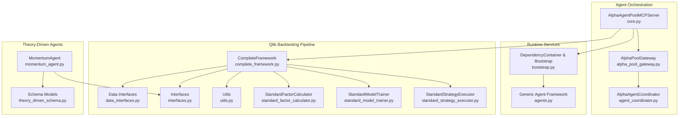
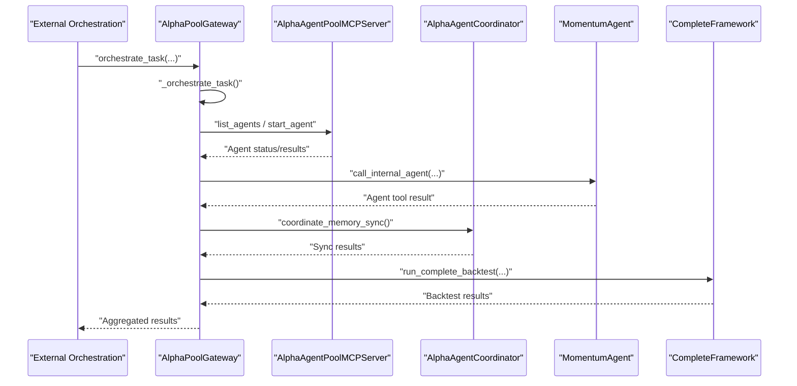
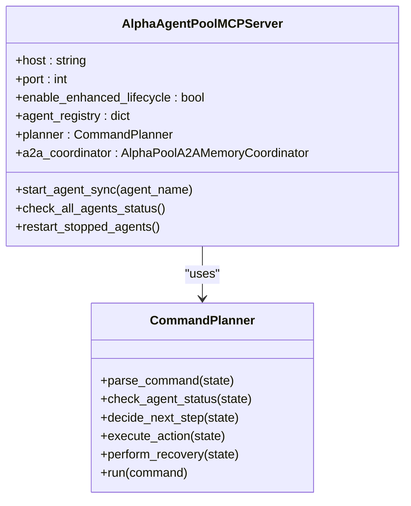
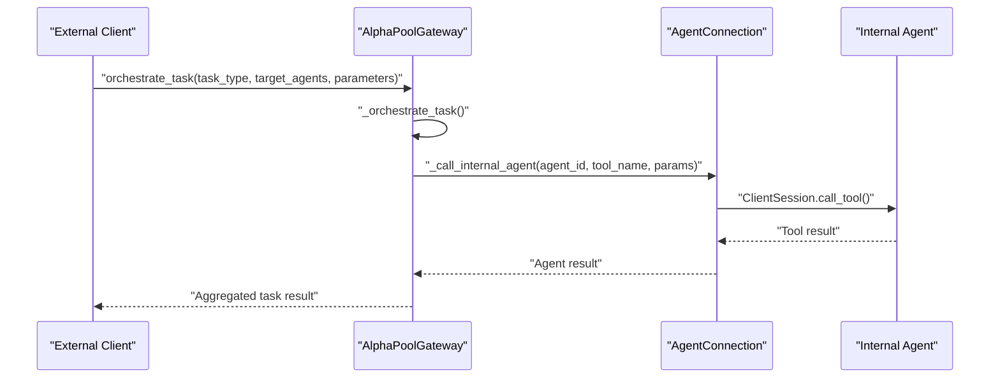
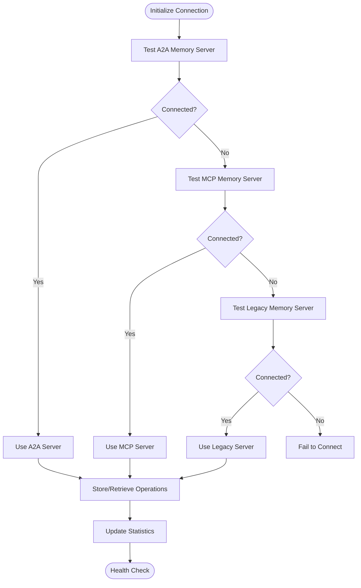
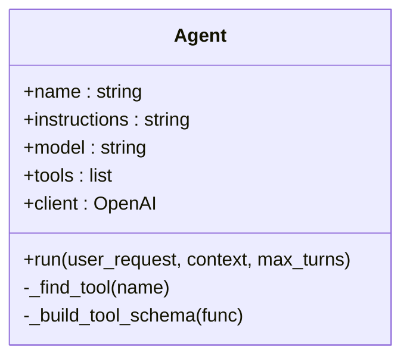
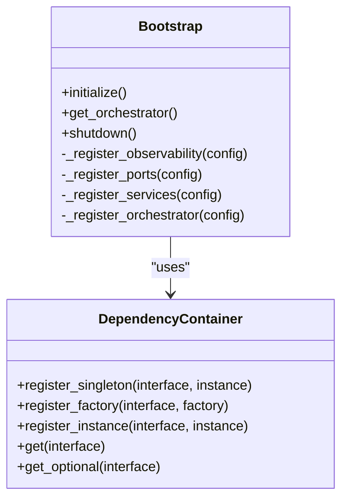
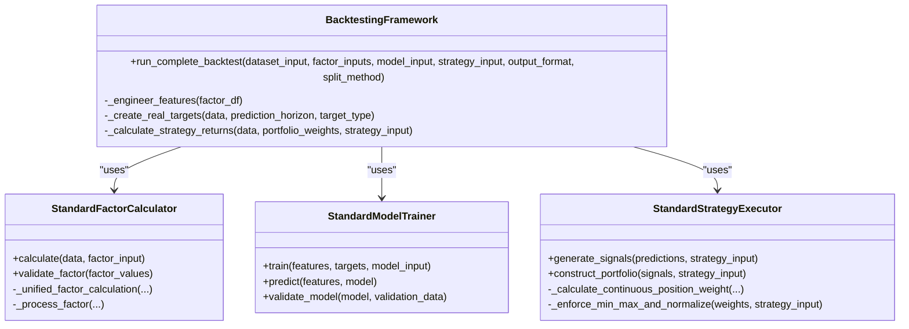
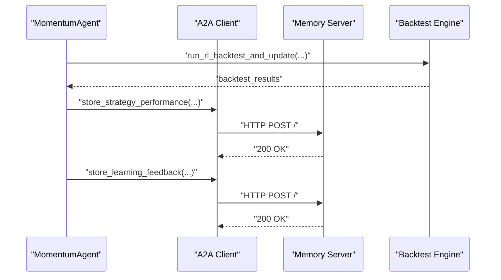
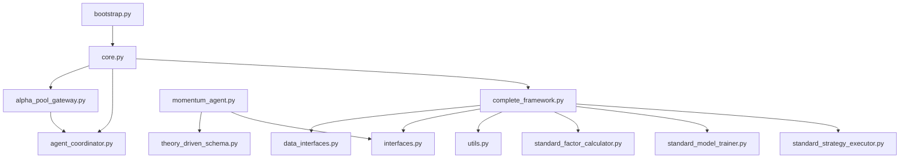

# Framework Integration Patterns

<cite>
**Referenced Files in This Document**
- [core.py](file://FinAgents/agent_pools/alpha_agent_pool/core.py)
- [alpha_pool_gateway.py](file://FinAgents/agent_pools/alpha_agent_pool/alpha_pool_gateway.py)
- [agent_coordinator.py](file://FinAgents/agent_pools/alpha_agent_pool/agent_coordinator.py)
- [agents.py](file://FinAgents/agent_pools/alpha_agent_pool/agents.py)
- [bootstrap.py](file://FinAgents/agent_pools/alpha_agent_pool/runtime/bootstrap.py)
- [theory_driven_schema.py](file://FinAgents/agent_pools/alpha_agent_pool/schema/theory_driven_schema.py)
- [momentum_agent.py](file://FinAgents/agent_pools/alpha_agent_pool/agents/theory_driven/momentum_agent.py)
- [complete_framework.py](file://FinAgents/agent_pools/alpha_agent_pool/qlib_local/complete_framework.py)
- [interfaces.py](file://FinAgents/agent_pools/alpha_agent_pool/qlib_local/interfaces.py)
- [utils.py](file://FinAgents/agent_pools/alpha_agent_pool/qlib_local/utils.py)
- [data_interfaces.py](file://FinAgents/agent_pools/alpha_agent_pool/qlib_local/data_interfaces.py)
- [standard_factor_calculator.py](file://FinAgents/agent_pools/alpha_agent_pool/qlib_local/standard_factor_calculator.py)
- [standard_model_trainer.py](file://FinAgents/agent_pools/alpha_agent_pool/qlib_local/standard_model_trainer.py)
- [standard_strategy_executor.py](file://FinAgents/agent_pools/alpha_agent_pool/qlib_local/standard_strategy_executor.py)
</cite>

## Table of Contents
1. [Introduction](#introduction)
2. [Project Structure](#project-structure)
3. [Core Components](#core-components)
4. [Architecture Overview](#architecture-overview)
5. [Detailed Component Analysis](#detailed-component-analysis)
6. [Dependency Analysis](#dependency-analysis)
7. [Performance Considerations](#performance-considerations)
8. [Troubleshooting Guide](#troubleshooting-guide)
9. [Conclusion](#conclusion)

## Introduction
This document describes the Qlib framework integration patterns within the Alpha Agent Pool, focusing on agent integration, workflow orchestration, and service layer implementation. It explains interface patterns for extending the framework with custom components, utility functions for common ML operations, and the complete framework implementation that coordinates between different agent pools. The guide also covers integration best practices, dependency management, performance optimization strategies, and examples for extending the framework while maintaining backward compatibility.

## Project Structure
The Alpha Agent Pool integrates multiple layers:
- Agent orchestration and lifecycle management
- MCP (Model Context Protocol) server/client infrastructure
- A2A (Agent-to-Agent) memory coordination
- Qlib-backed backtesting pipeline with standardized interfaces
- Runtime dependency injection and service composition
- Theory-driven agents with RL-style adaptation

**Diagram sources**
- [core.py:431-800](file://FinAgents/agent_pools/alpha_agent_pool/core.py#L431-L800)
- [alpha_pool_gateway.py:110-800](file://FinAgents/agent_pools/alpha_agent_pool/alpha_pool_gateway.py#L110-L800)
- [agent_coordinator.py:26-449](file://FinAgents/agent_pools/alpha_agent_pool/agent_coordinator.py#L26-L449)
- [bootstrap.py:75-234](file://FinAgents/agent_pools/alpha_agent_pool/runtime/bootstrap.py#L75-L234)
- [agents.py:29-163](file://FinAgents/agent_pools/alpha_agent_pool/agents.py#L29-L163)
- [complete_framework.py:28-800](file://FinAgents/agent_pools/alpha_agent_pool/qlib_local/complete_framework.py#L28-L800)
- [data_interfaces.py:14-404](file://FinAgents/agent_pools/alpha_agent_pool/qlib_local/data_interfaces.py#L14-L404)
- [interfaces.py:15-267](file://FinAgents/agent_pools/alpha_agent_pool/qlib_local/interfaces.py#L15-L267)
- [utils.py:35-513](file://FinAgents/agent_pools/alpha_agent_pool/qlib_local/utils.py#L35-L513)
- [standard_factor_calculator.py:12-325](file://FinAgents/agent_pools/alpha_agent_pool/qlib_local/standard_factor_calculator.py#L12-L325)
- [standard_model_trainer.py:25-451](file://FinAgents/agent_pools/alpha_agent_pool/qlib_local/standard_model_trainer.py#L25-L451)
- [standard_strategy_executor.py:13-618](file://FinAgents/agent_pools/alpha_agent_pool/qlib_local/standard_strategy_executor.py#L13-L618)
- [theory_driven_schema.py:57-87](file://FinAgents/agent_pools/alpha_agent_pool/schema/theory_driven_schema.py#L57-L87)
- [momentum_agent.py:353-800](file://FinAgents/agent_pools/alpha_agent_pool/agents/theory_driven/momentum_agent.py#L353-L800)

**Section sources**
- [core.py:1-800](file://FinAgents/agent_pools/alpha_agent_pool/core.py#L1-L800)
- [alpha_pool_gateway.py:1-800](file://FinAgents/agent_pools/alpha_agent_pool/alpha_pool_gateway.py#L1-L800)
- [bootstrap.py:1-234](file://FinAgents/agent_pools/alpha_agent_pool/runtime/bootstrap.py#L1-L234)

## Core Components
This section details the primary building blocks of the framework and their roles in integrating Qlib with agent orchestration.

- AlphaAgentPoolMCPServer: Central MCP server managing agent lifecycle, A2A memory coordination, and strategy research integration. Provides synchronous and asynchronous agent startup, status monitoring, and planner-based command execution.
- AlphaPoolGateway: Dual-role gateway serving as an MCP server for external orchestration and MCP client to internal agents. Orchestrates tasks across agents, manages memory synchronization, and exposes performance metrics.
- AlphaAgentCoordinator: Coordinates memory operations across A2A servers, stores agent performance and strategy insights, and retrieves similar strategies for cross-agent learning.
- Generic Agent Framework: Provides a reusable agent class with OpenAI Function Calling support, automatic tool schema generation, and context-aware execution.
- Runtime Bootstrap: Implements dependency injection with a container pattern, registering observability, ports, services, and orchestrators for consistent runtime composition.
- Qlib Backtesting Pipeline: Defines standardized interfaces and data contracts for datasets, factors, models, strategies, and outputs. Includes calculators, trainers, and executors for end-to-end backtesting.

Key integration points:
- MCP-based agent discovery and tool invocation
- A2A memory bridge for cross-agent knowledge sharing
- Standardized input/output interfaces for backtesting components
- Dependency injection for pluggable services and adapters

**Section sources**
- [core.py:431-800](file://FinAgents/agent_pools/alpha_agent_pool/core.py#L431-L800)
- [alpha_pool_gateway.py:110-800](file://FinAgents/agent_pools/alpha_agent_pool/alpha_pool_gateway.py#L110-L800)
- [agent_coordinator.py:26-449](file://FinAgents/agent_pools/alpha_agent_pool/agent_coordinator.py#L26-L449)
- [agents.py:29-163](file://FinAgents/agent_pools/alpha_agent_pool/agents.py#L29-L163)
- [bootstrap.py:75-234](file://FinAgents/agent_pools/alpha_agent_pool/runtime/bootstrap.py#L75-L234)
- [complete_framework.py:28-800](file://FinAgents/agent_pools/alpha_agent_pool/qlib_local/complete_framework.py#L28-L800)

## Architecture Overview
The framework architecture centers around the Alpha Agent Pool’s MCP server and gateway, coordinating multiple agents and services. The Qlib backtesting pipeline is integrated as a standardized component with strict input/output contracts, enabling plug-and-play factor calculation, model training, and strategy execution.

**Diagram sources**
- [alpha_pool_gateway.py:340-522](file://FinAgents/agent_pools/alpha_agent_pool/alpha_pool_gateway.py#L340-L522)
- [core.py:656-794](file://FinAgents/agent_pools/alpha_agent_pool/core.py#L656-L794)
- [agent_coordinator.py:125-187](file://FinAgents/agent_pools/alpha_agent_pool/agent_coordinator.py#L125-L187)
- [momentum_agent.py:583-625](file://FinAgents/agent_pools/alpha_agent_pool/agents/theory_driven/momentum_agent.py#L583-L625)
- [complete_framework.py:41-545](file://FinAgents/agent_pools/alpha_agent_pool/qlib_local/complete_framework.py#L41-L545)

## Detailed Component Analysis

### Alpha Agent Pool MCP Server
The MCP server orchestrates agent lifecycle, A2A memory coordination, and strategy research integration. It registers tools for agent management, status checks, and planner-based command execution. It supports synchronous and asynchronous operations, port conflict detection, and graceful logging of lifecycle events.

**Diagram sources**
- [core.py:431-800](file://FinAgents/agent_pools/alpha_agent_pool/core.py#L431-L800)

**Section sources**
- [core.py:431-800](file://FinAgents/agent_pools/alpha_agent_pool/core.py#L431-L800)

### Alpha Pool Gateway
The gateway acts as an MCP server for external orchestration and an MCP client to internal agents. It manages agent connections, orchestrates tasks across agents, coordinates memory synchronization, and aggregates results with performance metrics.

**Diagram sources**
- [alpha_pool_gateway.py:340-522](file://FinAgents/agent_pools/alpha_agent_pool/alpha_pool_gateway.py#L340-L522)

**Section sources**
- [alpha_pool_gateway.py:110-800](file://FinAgents/agent_pools/alpha_agent_pool/alpha_pool_gateway.py#L110-L800)

### Agent Coordinator (A2A Memory Bridge)
The coordinator provides memory operations across A2A servers with fallback strategies, storing agent performance, strategy insights, retrieving similar strategies, and tracking operation statistics.

**Diagram sources**
- [agent_coordinator.py:75-187](file://FinAgents/agent_pools/alpha_agent_pool/agent_coordinator.py#L75-L187)

**Section sources**
- [agent_coordinator.py:26-449](file://FinAgents/agent_pools/alpha_agent_pool/agent_coordinator.py#L26-L449)

### Generic Agent Framework
The generic agent framework supports OpenAI Function Calling with automatic tool schema generation and context-aware execution. It wraps tool functions, builds JSON schemas from function signatures, and executes tools with automatic result aggregation.

**Diagram sources**
- [agents.py:29-163](file://FinAgents/agent_pools/alpha_agent_pool/agents.py#L29-L163)

**Section sources**
- [agents.py:15-163](file://FinAgents/agent_pools/alpha_agent_pool/agents.py#L15-L163)

### Runtime Bootstrap and Dependency Injection
The bootstrap initializes the runtime with dependency injection, registering observability, ports, services, and orchestrators. It supports singleton and factory registrations, enabling pluggable adapters and consistent service composition.

**Diagram sources**
- [bootstrap.py:24-234](file://FinAgents/agent_pools/alpha_agent_pool/runtime/bootstrap.py#L24-L234)

**Section sources**
- [bootstrap.py:75-234](file://FinAgents/agent_pools/alpha_agent_pool/runtime/bootstrap.py#L75-L234)

### Qlib Backtesting Pipeline
The backtesting pipeline defines standardized interfaces and data contracts for datasets, factors, models, strategies, and outputs. It includes calculators, trainers, and executors for end-to-end backtesting with ETF benchmark alignment, walk-forward retraining, and performance attribution.

**Diagram sources**
- [complete_framework.py:28-800](file://FinAgents/agent_pools/alpha_agent_pool/qlib_local/complete_framework.py#L28-L800)
- [standard_factor_calculator.py:12-325](file://FinAgents/agent_pools/alpha_agent_pool/qlib_local/standard_factor_calculator.py#L12-L325)
- [standard_model_trainer.py:25-451](file://FinAgents/agent_pools/alpha_agent_pool/qlib_local/standard_model_trainer.py#L25-L451)
- [standard_strategy_executor.py:13-618](file://FinAgents/agent_pools/alpha_agent_pool/qlib_local/standard_strategy_executor.py#L13-L618)

**Section sources**
- [complete_framework.py:28-800](file://FinAgents/agent_pools/alpha_agent_pool/qlib_local/complete_framework.py#L28-L800)
- [data_interfaces.py:14-404](file://FinAgents/agent_pools/alpha_agent_pool/qlib_local/data_interfaces.py#L14-L404)
- [interfaces.py:46-267](file://FinAgents/agent_pools/alpha_agent_pool/qlib_local/interfaces.py#L46-L267)
- [utils.py:35-513](file://FinAgents/agent_pools/alpha_agent_pool/qlib_local/utils.py#L35-L513)
- [standard_factor_calculator.py:12-325](file://FinAgents/agent_pools/alpha_agent_pool/qlib_local/standard_factor_calculator.py#L12-L325)
- [standard_model_trainer.py:25-451](file://FinAgents/agent_pools/alpha_agent_pool/qlib_local/standard_model_trainer.py#L25-L451)
- [standard_strategy_executor.py:13-618](file://FinAgents/agent_pools/alpha_agent_pool/qlib_local/standard_strategy_executor.py#L13-L618)

### Theory-Driven Agent Integration
The MomentumAgent demonstrates integration with the Alpha Agent Pool through MCP, A2A memory coordination, and RL-style adaptation. It performs multi-timeframe analysis, learns from backtest feedback, and stores performance metrics via A2A protocol.

**Diagram sources**
- [momentum_agent.py:472-599](file://FinAgents/agent_pools/alpha_agent_pool/agents/theory_driven/momentum_agent.py#L472-L599)
- [agent_coordinator.py:125-187](file://FinAgents/agent_pools/alpha_agent_pool/agent_coordinator.py#L125-L187)

**Section sources**
- [momentum_agent.py:353-800](file://FinAgents/agent_pools/alpha_agent_pool/agents/theory_driven/momentum_agent.py#L353-L800)
- [theory_driven_schema.py:57-87](file://FinAgents/agent_pools/alpha_agent_pool/schema/theory_driven_schema.py#L57-L87)

## Dependency Analysis
The framework exhibits layered dependencies:
- Runtime bootstrap depends on core services and ports
- MCP server depends on agent coordinator and memory bridges
- Gateway depends on internal agent connections and A2A coordinator
- Qlib pipeline depends on standardized interfaces and data contracts
- Theory-driven agents depend on schema models and A2A memory integration

**Diagram sources**
- [bootstrap.py:75-234](file://FinAgents/agent_pools/alpha_agent_pool/runtime/bootstrap.py#L75-L234)
- [core.py:431-800](file://FinAgents/agent_pools/alpha_agent_pool/core.py#L431-L800)
- [alpha_pool_gateway.py:110-800](file://FinAgents/agent_pools/alpha_agent_pool/alpha_pool_gateway.py#L110-L800)
- [agent_coordinator.py:26-449](file://FinAgents/agent_pools/alpha_agent_pool/agent_coordinator.py#L26-L449)
- [complete_framework.py:28-800](file://FinAgents/agent_pools/alpha_agent_pool/qlib_local/complete_framework.py#L28-L800)
- [data_interfaces.py:14-404](file://FinAgents/agent_pools/alpha_agent_pool/qlib_local/data_interfaces.py#L14-L404)
- [interfaces.py:15-267](file://FinAgents/agent_pools/alpha_agent_pool/qlib_local/interfaces.py#L15-L267)
- [utils.py:35-513](file://FinAgents/agent_pools/alpha_agent_pool/qlib_local/utils.py#L35-L513)
- [standard_factor_calculator.py:12-325](file://FinAgents/agent_pools/alpha_agent_pool/qlib_local/standard_factor_calculator.py#L12-L325)
- [standard_model_trainer.py:25-451](file://FinAgents/agent_pools/alpha_agent_pool/qlib_local/standard_model_trainer.py#L25-L451)
- [standard_strategy_executor.py:13-618](file://FinAgents/agent_pools/alpha_agent_pool/qlib_local/standard_strategy_executor.py#L13-L618)
- [momentum_agent.py:353-800](file://FinAgents/agent_pools/alpha_agent_pool/agents/theory_driven/momentum_agent.py#L353-L800)
- [theory_driven_schema.py:57-87](file://FinAgents/agent_pools/alpha_agent_pool/schema/theory_driven_schema.py#L57-L87)

**Section sources**
- [bootstrap.py:75-234](file://FinAgents/agent_pools/alpha_agent_pool/runtime/bootstrap.py#L75-L234)
- [core.py:431-800](file://FinAgents/agent_pools/alpha_agent_pool/core.py#L431-L800)
- [alpha_pool_gateway.py:110-800](file://FinAgents/agent_pools/alpha_agent_pool/alpha_pool_gateway.py#L110-L800)
- [agent_coordinator.py:26-449](file://FinAgents/agent_pools/alpha_agent_pool/agent_coordinator.py#L26-L449)
- [complete_framework.py:28-800](file://FinAgents/agent_pools/alpha_agent_pool/qlib_local/complete_framework.py#L28-L800)

## Performance Considerations
- Use standardized interfaces to ensure consistent performance across components.
- Implement robust data validation and alignment to avoid expensive reprocessing.
- Employ walk-forward retraining with appropriate step sizes to balance freshness and computational cost.
- Utilize memory coordination to reduce redundant computations across agents.
- Apply signal smoothing and position decay to minimize turnover and transaction costs.
- Monitor operation statistics and health checks for timely intervention.

## Troubleshooting Guide
Common issues and resolutions:
- Port conflicts during agent startup: The MCP server detects and resolves port conflicts automatically.
- Memory server connectivity: The coordinator attempts fallback connections across A2A, MCP, and legacy servers.
- Agent lifecycle logging failures: Graceful fallback to local logging prevents operational disruption.
- Qlib pipeline data misalignment: Ensure proper index alignment and feature/target validation before training.
- Tool execution failures: Automatic error handling and result aggregation continue execution.

**Section sources**
- [core.py:46-83](file://FinAgents/agent_pools/alpha_agent_pool/core.py#L46-L83)
- [agent_coordinator.py:75-124](file://FinAgents/agent_pools/alpha_agent_pool/agent_coordinator.py#L75-L124)
- [complete_framework.py:42-83](file://FinAgents/agent_pools/alpha_agent_pool/qlib_local/complete_framework.py#L42-L83)

## Conclusion
The Alpha Agent Pool integrates Qlib-backed backtesting with robust agent orchestration, MCP-based communication, and A2A memory coordination. The standardized interfaces and dependency injection patterns enable extensibility, maintain backward compatibility, and support performance optimization through memory synchronization, walk-forward retraining, and RL-style adaptation in theory-driven agents.