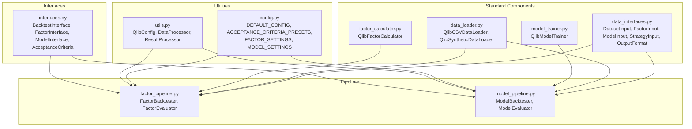
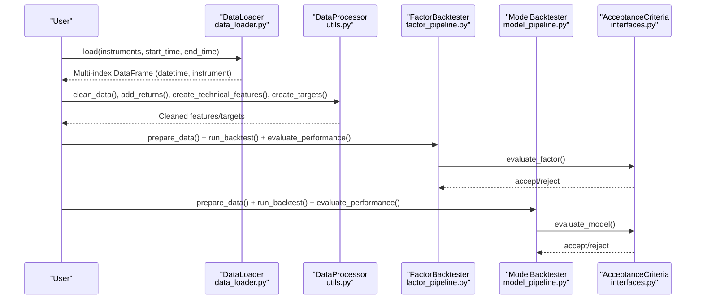
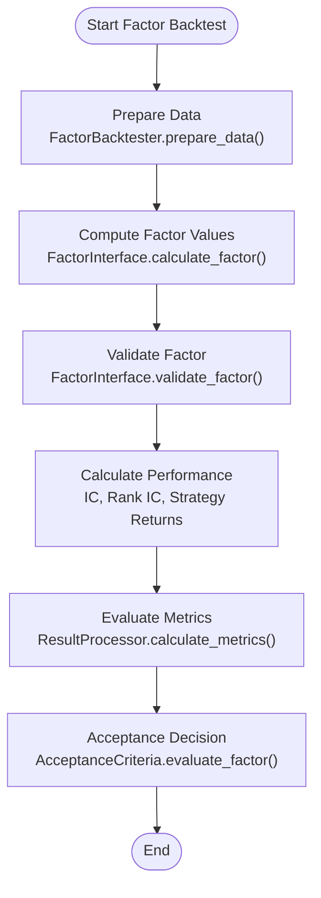
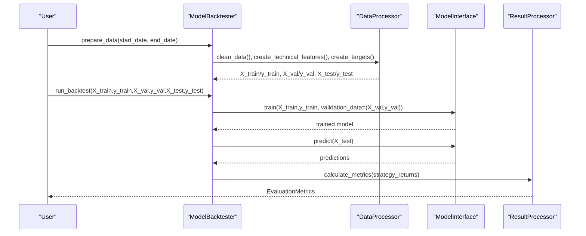
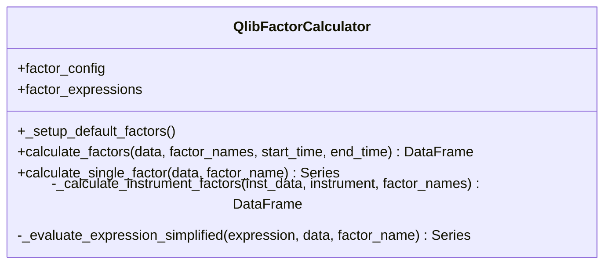
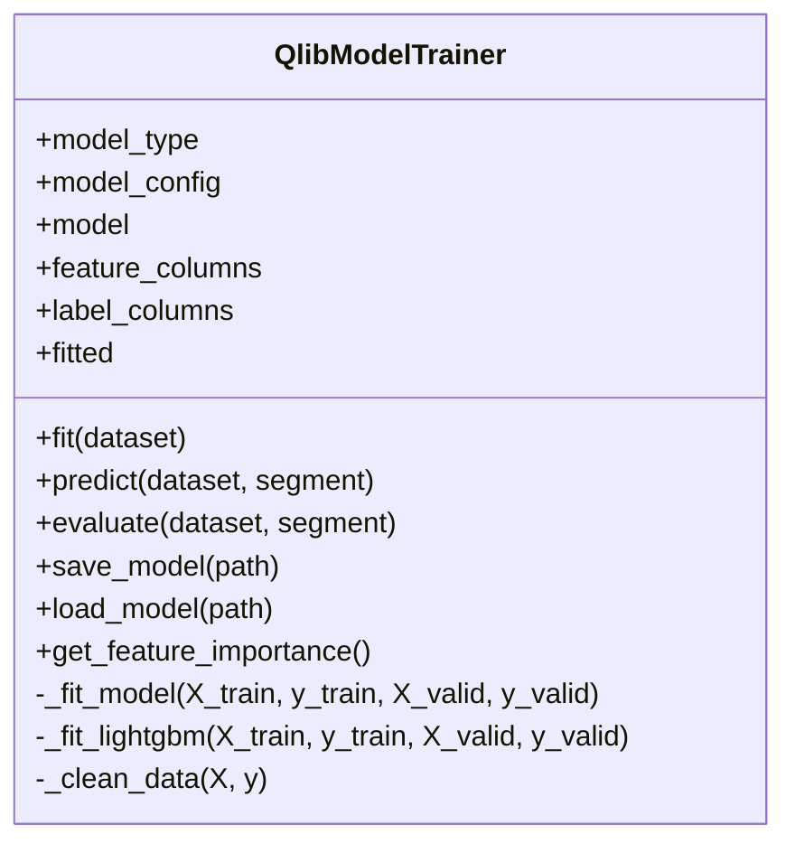
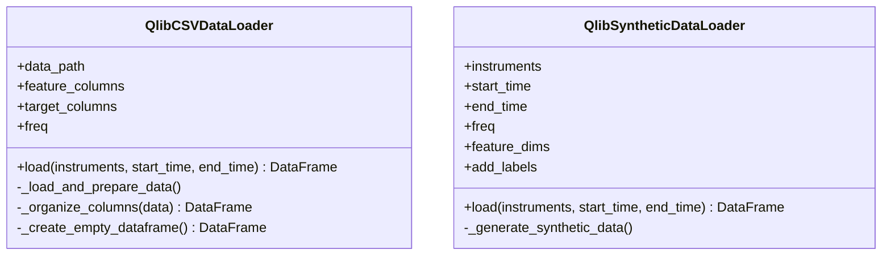
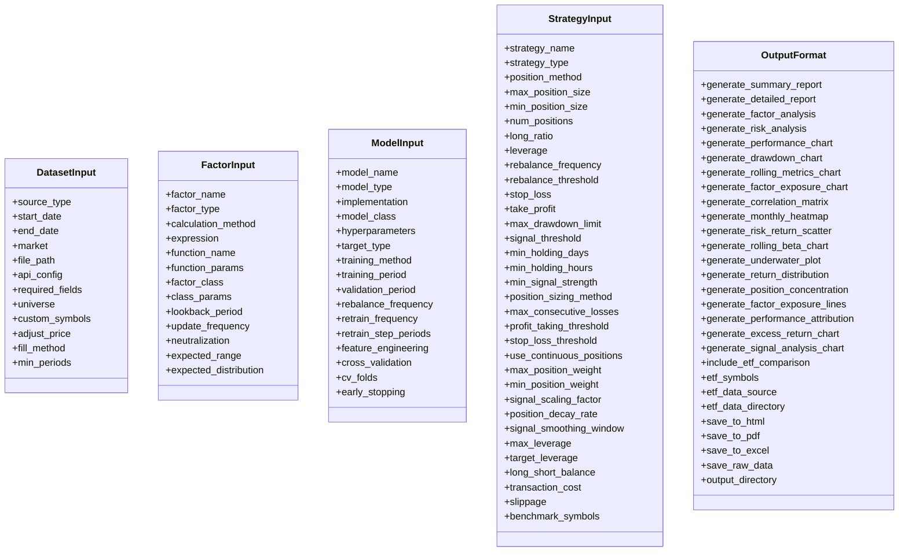
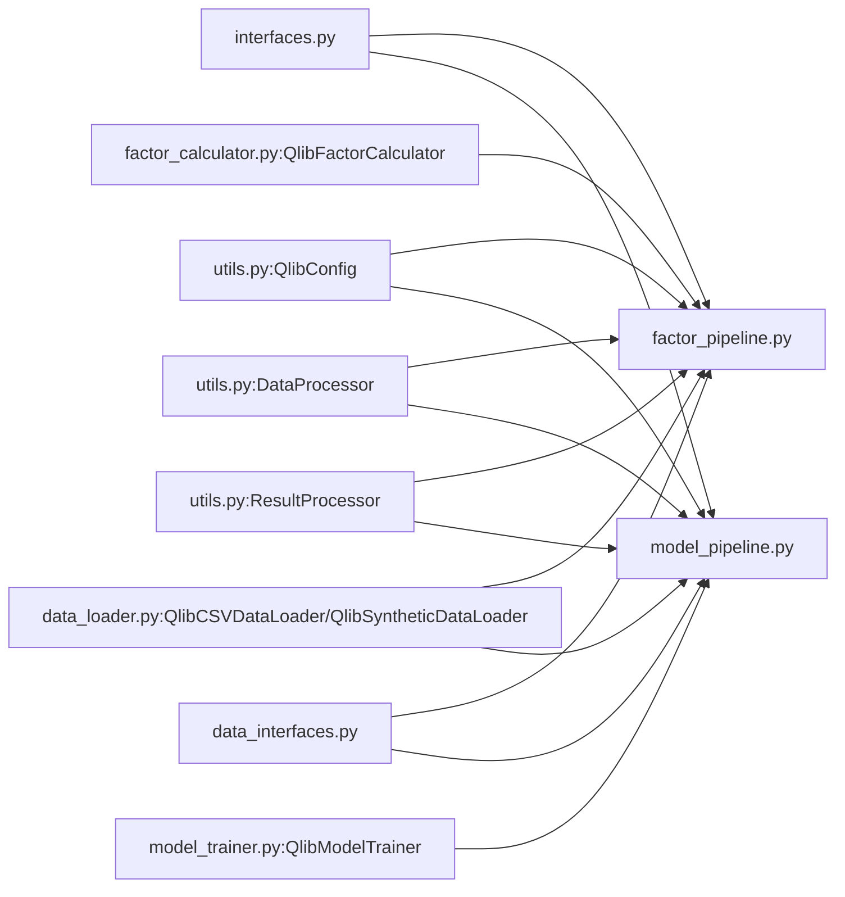

# Machine Learning Integration

<cite>
**Referenced Files in This Document**
- [README.md](file://FinAgents/agent_pools/alpha_agent_pool/qlib_local/README.md)
- [__init__.py](file://FinAgents/agent_pools/alpha_agent_pool/qlib_local/__init__.py)
- [config.py](file://FinAgents/agent_pools/alpha_agent_pool/qlib_local/config.py)
- [interfaces.py](file://FinAgents/agent_pools/alpha_agent_pool/qlib_local/interfaces.py)
- [utils.py](file://FinAgents/agent_pools/alpha_agent_pool/qlib_local/utils.py)
- [factor_pipeline.py](file://FinAgents/agent_pools/alpha_agent_pool/qlib_local/factor_pipeline.py)
- [model_pipeline.py](file://FinAgents/agent_pools/alpha_agent_pool/qlib_local/model_pipeline.py)
- [data_interfaces.py](file://FinAgents/agent_pools/alpha_agent_pool/qlib_local/data_interfaces.py)
- [factor_calculator.py](file://FinAgents/agent_pools/alpha_agent_pool/qlib_local/qlib_standard/factor_calculator.py)
- [model_trainer.py](file://FinAgents/agent_pools/alpha_agent_pool/qlib_local/qlib_standard/model_trainer.py)
- [data_loader.py](file://FinAgents/agent_pools/alpha_agent_pool/qlib_local/qlib_standard/data_loader.py)
</cite>

## Table of Contents
1. [Introduction](#introduction)
2. [Project Structure](#project-structure)
3. [Core Components](#core-components)
4. [Architecture Overview](#architecture-overview)
5. [Detailed Component Analysis](#detailed-component-analysis)
6. [Dependency Analysis](#dependency-analysis)
7. [Performance Considerations](#performance-considerations)
8. [Troubleshooting Guide](#troubleshooting-guide)
9. [Conclusion](#conclusion)

## Introduction
This document explains the machine learning integration within the alpha agent pool, focusing on the Qlib-backed framework for model training, factor calculation, and inference. It covers:
- Model trainer implementation with data preprocessing, feature engineering pipelines, and training workflows
- Factor calculation mechanisms for generating alpha factors from market data
- Data loader architecture for historical and synthetic data
- Framework integration patterns and deployment of ML models within the agent pool ecosystem
- Configuration options, performance monitoring, and troubleshooting guidance

## Project Structure
The ML integration is centered around a modular Qlib-based pipeline with standardized interfaces and utilities:
- Interfaces define contracts for backtesting, factors, models, and acceptance criteria
- Utilities encapsulate configuration, data processing, and result processing
- Pipelines implement factor and model backtesting workflows
- Standard components provide Qlib-compatible factor calculators, model trainers, and data loaders

**Diagram sources**
- [interfaces.py:1-267](file://FinAgents/agent_pools/alpha_agent_pool/qlib_local/interfaces.py#L1-L267)
- [utils.py:1-513](file://FinAgents/agent_pools/alpha_agent_pool/qlib_local/utils.py#L1-L513)
- [config.py:1-69](file://FinAgents/agent_pools/alpha_agent_pool/qlib_local/config.py#L1-L69)
- [factor_pipeline.py:1-426](file://FinAgents/agent_pools/alpha_agent_pool/qlib_local/factor_pipeline.py#L1-L426)
- [model_pipeline.py:1-567](file://FinAgents/agent_pools/alpha_agent_pool/qlib_local/model_pipeline.py#L1-L567)
- [factor_calculator.py:1-800](file://FinAgents/agent_pools/alpha_agent_pool/qlib_local/qlib_standard/factor_calculator.py#L1-L800)
- [model_trainer.py:1-589](file://FinAgents/agent_pools/alpha_agent_pool/qlib_local/qlib_standard/model_trainer.py#L1-L589)
- [data_loader.py:1-341](file://FinAgents/agent_pools/alpha_agent_pool/qlib_local/qlib_standard/data_loader.py#L1-L341)
- [data_interfaces.py:1-404](file://FinAgents/agent_pools/alpha_agent_pool/qlib_local/data_interfaces.py#L1-L404)

**Section sources**
- [README.md:1-732](file://FinAgents/agent_pools/alpha_agent_pool/qlib_local/README.md#L1-L732)
- [__init__.py:1-45](file://FinAgents/agent_pools/alpha_agent_pool/qlib_local/__init__.py#L1-L45)

## Core Components
- Backtesting interfaces: Contracts for data preparation, execution, and evaluation
- Configuration: Centralized settings for data, acceptance criteria, and evaluation windows
- Data processing: Cleaning, normalization, feature engineering, and target creation
- Factor pipeline: Factor evaluation with IC/rank-IC and strategy returns computation
- Model pipeline: Model training, validation, and out-of-sample strategy performance
- Standard components: Qlib-compatible factor calculator, model trainer, and data loaders

Key responsibilities:
- FactorInterface: compute factor values and validate them
- ModelInterface: train/predict/validate models
- BacktestInterface: prepare data, run backtests, and produce standardized metrics
- AcceptanceCriteria: define pass/fail thresholds for factors and models

**Section sources**
- [interfaces.py:15-267](file://FinAgents/agent_pools/alpha_agent_pool/qlib_local/interfaces.py#L15-L267)
- [config.py:5-69](file://FinAgents/agent_pools/alpha_agent_pool/qlib_local/config.py#L5-L69)
- [utils.py:35-513](file://FinAgents/agent_pools/alpha_agent_pool/qlib_local/utils.py#L35-L513)
- [factor_pipeline.py:25-426](file://FinAgents/agent_pools/alpha_agent_pool/qlib_local/factor_pipeline.py#L25-L426)
- [model_pipeline.py:24-567](file://FinAgents/agent_pools/alpha_agent_pool/qlib_local/model_pipeline.py#L24-L567)

## Architecture Overview
The system integrates Qlib’s data access with custom backtesting pipelines and standardized interfaces. The flow is:
- Data ingestion via CSV/synthetic loaders into Qlib-compatible multi-index format
- Feature engineering and target creation
- Factor or model backtesting with acceptance criteria
- Performance evaluation and reporting

**Diagram sources**
- [data_loader.py:17-341](file://FinAgents/agent_pools/alpha_agent_pool/qlib_local/qlib_standard/data_loader.py#L17-L341)
- [utils.py:116-277](file://FinAgents/agent_pools/alpha_agent_pool/qlib_local/utils.py#L116-L277)
- [factor_pipeline.py:25-191](file://FinAgents/agent_pools/alpha_agent_pool/qlib_local/factor_pipeline.py#L25-L191)
- [model_pipeline.py:24-166](file://FinAgents/agent_pools/alpha_agent_pool/qlib_local/model_pipeline.py#L24-L166)
- [interfaces.py:189-267](file://FinAgents/agent_pools/alpha_agent_pool/qlib_local/interfaces.py#L189-L267)

## Detailed Component Analysis

### Factor Pipeline
The factor pipeline computes factor values, aligns them with returns, calculates IC/rank-IC, and generates strategy returns for long/short or equal-weighted approaches.

**Diagram sources**
- [factor_pipeline.py:25-191](file://FinAgents/agent_pools/alpha_agent_pool/qlib_local/factor_pipeline.py#L25-L191)
- [utils.py:279-377](file://FinAgents/agent_pools/alpha_agent_pool/qlib_local/utils.py#L279-L377)
- [interfaces.py:189-267](file://FinAgents/agent_pools/alpha_agent_pool/qlib_local/interfaces.py#L189-L267)

**Section sources**
- [factor_pipeline.py:25-426](file://FinAgents/agent_pools/alpha_agent_pool/qlib_local/factor_pipeline.py#L25-L426)
- [utils.py:116-242](file://FinAgents/agent_pools/alpha_agent_pool/qlib_local/utils.py#L116-L242)

### Model Pipeline
The model pipeline prepares features/targets, trains models, validates performance, and computes strategy returns for long/short or normalized predictions.

**Diagram sources**
- [model_pipeline.py:24-266](file://FinAgents/agent_pools/alpha_agent_pool/qlib_local/model_pipeline.py#L24-L266)
- [utils.py:190-277](file://FinAgents/agent_pools/alpha_agent_pool/qlib_local/utils.py#L190-L277)

**Section sources**
- [model_pipeline.py:24-567](file://FinAgents/agent_pools/alpha_agent_pool/qlib_local/model_pipeline.py#L24-L567)
- [utils.py:190-277](file://FinAgents/agent_pools/alpha_agent_pool/qlib_local/utils.py#L190-L277)

### Factor Calculator (Qlib Standard)
The standard factor calculator defines a comprehensive set of technical factors using Qlib operators and simplified pandas implementations for rolling statistics, ranking, logical conditions, and advanced indicators.

**Diagram sources**
- [factor_calculator.py:36-800](file://FinAgents/agent_pools/alpha_agent_pool/qlib_local/qlib_standard/factor_calculator.py#L36-L800)

**Section sources**
- [factor_calculator.py:36-800](file://FinAgents/agent_pools/alpha_agent_pool/qlib_local/qlib_standard/factor_calculator.py#L36-L800)

### Model Trainer (Qlib Standard)
The standard model trainer implements the Qlib Model interface, supporting LightGBM, linear models, and Random Forest. It handles data extraction, cleaning, training, prediction, evaluation, and persistence.

**Diagram sources**
- [model_trainer.py:38-589](file://FinAgents/agent_pools/alpha_agent_pool/qlib_local/qlib_standard/model_trainer.py#L38-L589)

**Section sources**
- [model_trainer.py:38-589](file://FinAgents/agent_pools/alpha_agent_pool/qlib_local/qlib_standard/model_trainer.py#L38-L589)

### Data Loaders (Qlib Standard)
Two standard data loaders are provided:
- CSV loader: Loads multi-index Qlib-format data from CSV files
- Synthetic loader: Generates synthetic financial data for testing and development

**Diagram sources**
- [data_loader.py:17-341](file://FinAgents/agent_pools/alpha_agent_pool/qlib_local/qlib_standard/data_loader.py#L17-L341)

**Section sources**
- [data_loader.py:17-341](file://FinAgents/agent_pools/alpha_agent_pool/qlib_local/qlib_standard/data_loader.py#L17-L341)

### Data Interfaces
Standardized input specifications for datasets, factors, models, strategies, and outputs ensure consistent configuration across the pipeline.

**Diagram sources**
- [data_interfaces.py:14-404](file://FinAgents/agent_pools/alpha_agent_pool/qlib_local/data_interfaces.py#L14-L404)

**Section sources**
- [data_interfaces.py:14-404](file://FinAgents/agent_pools/alpha_agent_pool/qlib_local/data_interfaces.py#L14-L404)

## Dependency Analysis
The system exhibits clear separation of concerns:
- Interfaces decouple backtesting logic from implementations
- Utilities centralize configuration and processing
- Pipelines depend on interfaces and utilities
- Standard components integrate with Qlib APIs and third-party ML libraries

**Diagram sources**
- [interfaces.py:1-267](file://FinAgents/agent_pools/alpha_agent_pool/qlib_local/interfaces.py#L1-L267)
- [utils.py:1-513](file://FinAgents/agent_pools/alpha_agent_pool/qlib_local/utils.py#L1-L513)
- [factor_pipeline.py:1-426](file://FinAgents/agent_pools/alpha_agent_pool/qlib_local/factor_pipeline.py#L1-L426)
- [model_pipeline.py:1-567](file://FinAgents/agent_pools/alpha_agent_pool/qlib_local/model_pipeline.py#L1-L567)
- [factor_calculator.py:1-800](file://FinAgents/agent_pools/alpha_agent_pool/qlib_local/qlib_standard/factor_calculator.py#L1-L800)
- [model_trainer.py:1-589](file://FinAgents/agent_pools/alpha_agent_pool/qlib_local/qlib_standard/model_trainer.py#L1-L589)
- [data_loader.py:1-341](file://FinAgents/agent_pools/alpha_agent_pool/qlib_local/qlib_standard/data_loader.py#L1-L341)
- [data_interfaces.py:1-404](file://FinAgents/agent_pools/alpha_agent_pool/qlib_local/data_interfaces.py#L1-L404)

**Section sources**
- [__init__.py:8-45](file://FinAgents/agent_pools/alpha_agent_pool/qlib_local/__init__.py#L8-L45)

## Performance Considerations
- Data preparation: Efficient rolling computations and vectorized operations minimize overhead
- Factor evaluation: IC/rank-IC computed on aligned series; consider chunked processing for large universes
- Model training: Early stopping and validation sets prevent overfitting; ensure balanced feature scaling
- Prediction alignment: Strict index alignment prevents leakage; handle missing values consistently
- Reporting: Metrics annualization adapts to inferred periods-per-year for intraday data

[No sources needed since this section provides general guidance]

## Troubleshooting Guide
Common issues and resolutions:
- Data loading errors: Ensure CSV contains required columns and multi-index formatting; confirm file paths and instrument filters
- MultiIndex/groupby errors: Use numeric levels for groupby operations; verify index ordering
- IC calculation failures: Confirm sufficient observations and absence of NaNs in factor/target series
- Model training warnings: Reduce complexity, add regularization, and adjust early stopping parameters

**Section sources**
- [README.md:593-732](file://FinAgents/agent_pools/alpha_agent_pool/qlib_local/README.md#L593-L732)

## Conclusion
The alpha agent pool leverages a Qlib-backed, interface-driven architecture to deliver robust factor and model evaluation. The standardized components enable consistent data handling, feature engineering, training, and performance assessment, while the acceptance criteria ensure reliable deployments. The modular design facilitates extension and integration into broader agent pool workflows.