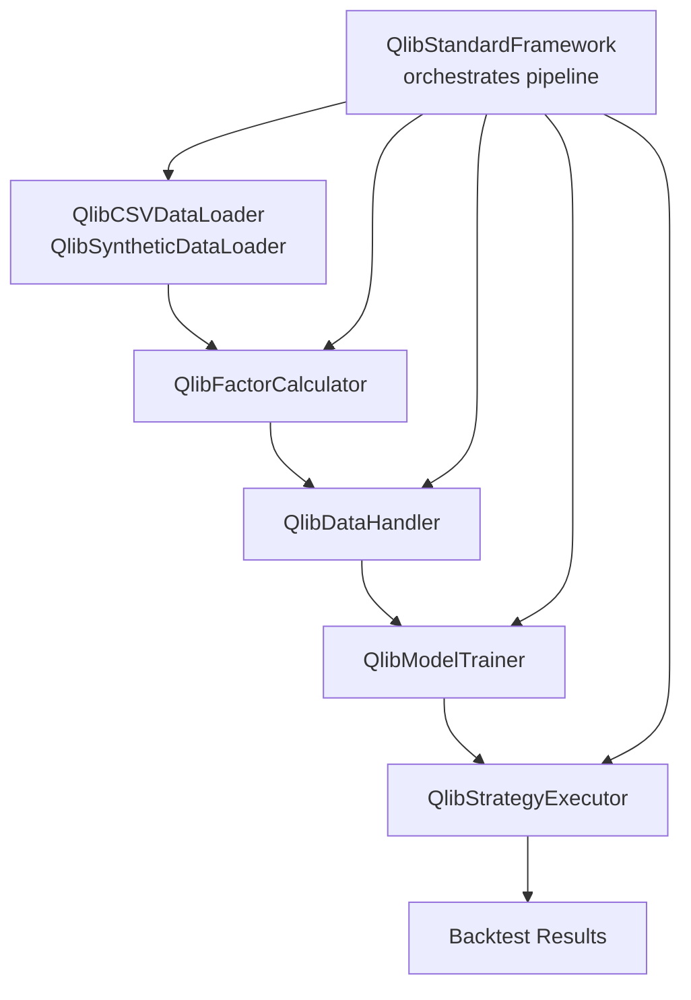
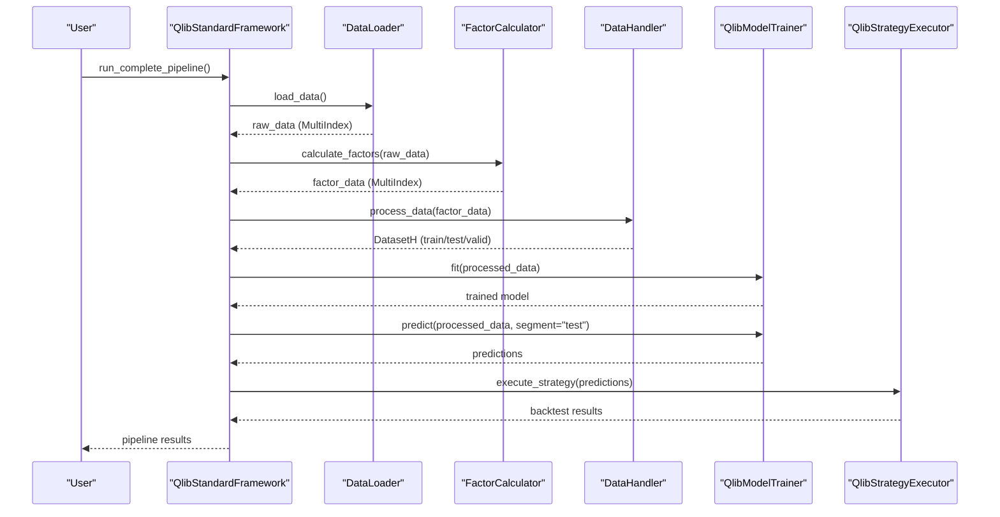
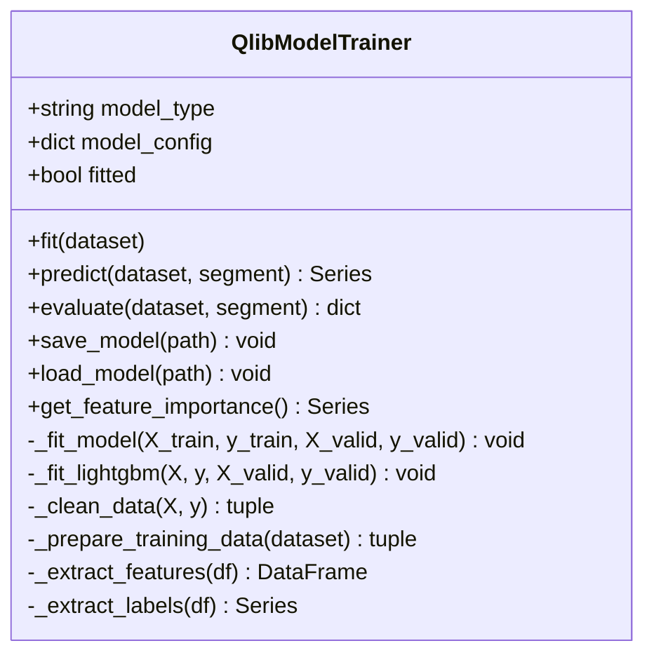
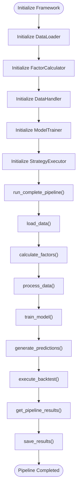
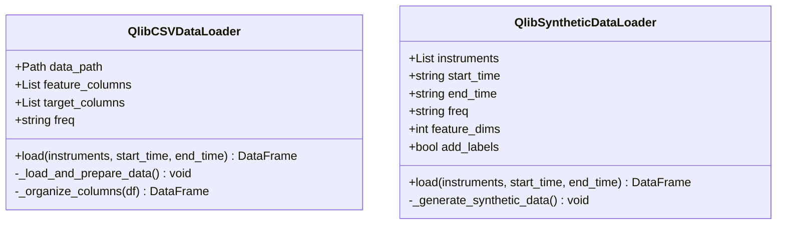
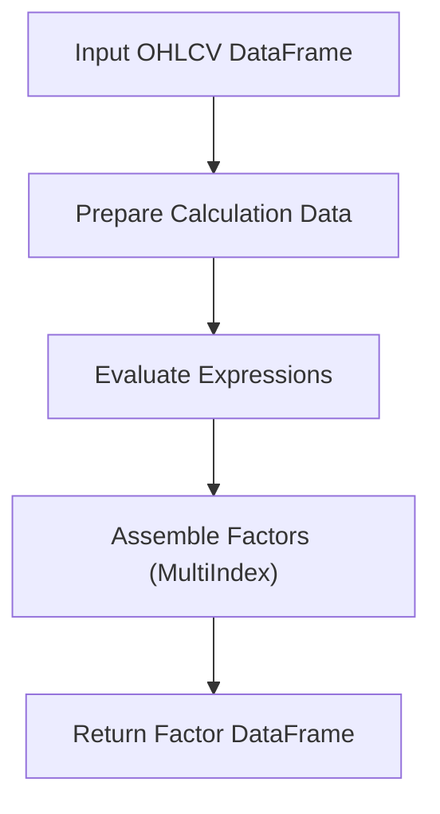
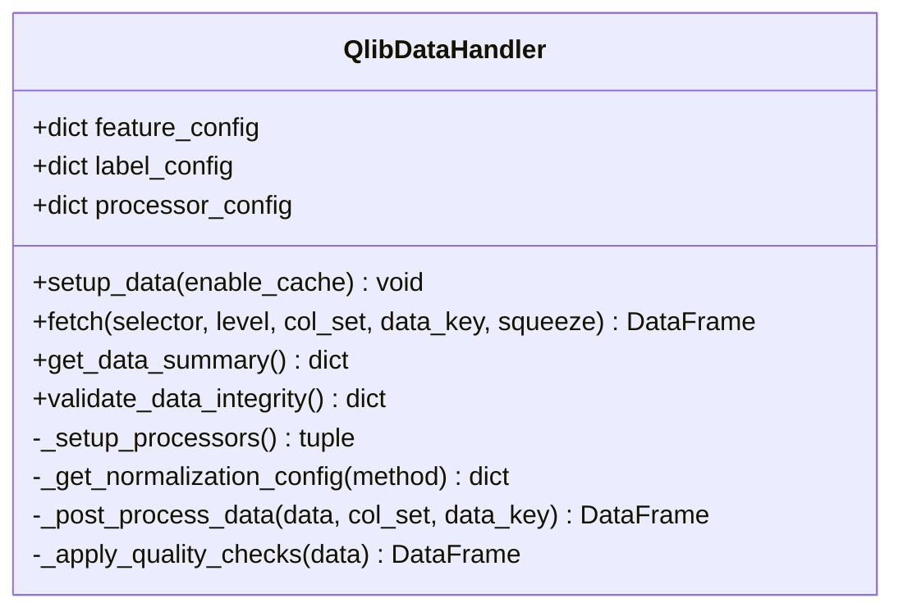
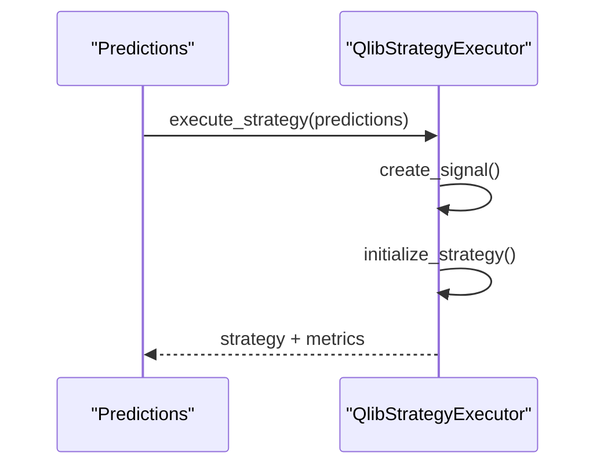
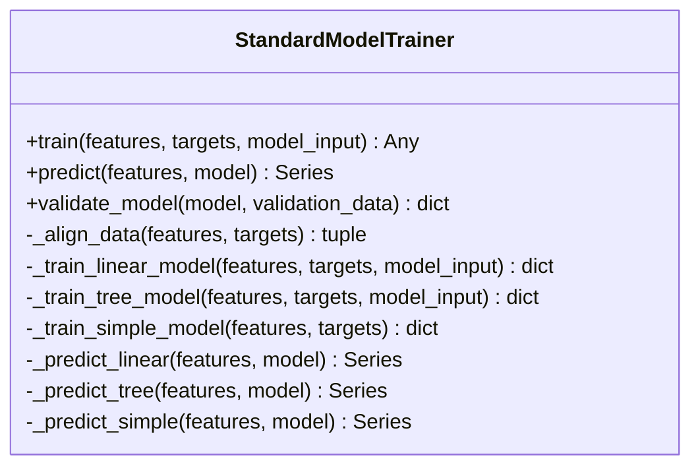
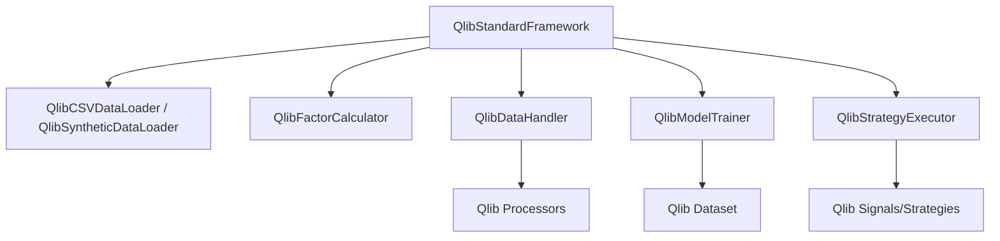

# Model Training Framework

<cite>
**Referenced Files in This Document**
- [model_trainer.py](file://FinAgents/agent_pools/alpha_agent_pool/qlib_local/qlib_standard/model_trainer.py)
- [framework.py](file://FinAgents/agent_pools/alpha_agent_pool/qlib_local/qlib_standard/framework.py)
- [data_loader.py](file://FinAgents/agent_pools/alpha_agent_pool/qlib_local/qlib_standard/data_loader.py)
- [data_handler.py](file://FinAgents/agent_pools/alpha_agent_pool/qlib_local/qlib_standard/data_handler.py)
- [factor_calculator.py](file://FinAgents/agent_pools/alpha_agent_pool/qlib_local/qlib_standard/factor_calculator.py)
- [strategy_executor.py](file://FinAgents/agent_pools/alpha_agent_pool/qlib_local/qlib_standard/strategy_executor.py)
- [standard_model_trainer.py](file://FinAgents/agent_pools/alpha_agent_pool/qlib_local/standard_model_trainer.py)
</cite>

## Table of Contents
1. [Introduction](#introduction)
2. [Project Structure](#project-structure)
3. [Core Components](#core-components)
4. [Architecture Overview](#architecture-overview)
5. [Detailed Component Analysis](#detailed-component-analysis)
6. [Dependency Analysis](#dependency-analysis)
7. [Performance Considerations](#performance-considerations)
8. [Troubleshooting Guide](#troubleshooting-guide)
9. [Conclusion](#conclusion)

## Introduction
This document describes the model training framework implemented for the Alpha Agent Pool within the Agentic Trading Application. It explains the end-to-end workflow from data ingestion and feature engineering to model training, evaluation, and strategy execution. It also covers configuration systems for different ML models, hyperparameter tuning capabilities, validation processes, and integration with the Qlib ecosystem. Practical examples demonstrate training for regression, classification, and time series forecasting tasks within the alpha agent context, along with performance monitoring, checkpoint management, and model versioning strategies.

## Project Structure
The model training framework is organized around a Qlib-centric standard pipeline that integrates:
- Data loaders for CSV and synthetic data
- Factor calculators leveraging Qlib’s expression engine
- Data handlers for preprocessing and normalization
- Model trainers supporting multiple ML algorithms
- Strategy executors for signal-based portfolio construction
- A complete framework orchestrating the full pipeline

**Diagram sources**
- [framework.py:28-702](file://FinAgents/agent_pools/alpha_agent_pool/qlib_local/qlib_standard/framework.py#L28-L702)
- [data_loader.py:17-341](file://FinAgents/agent_pools/alpha_agent_pool/qlib_local/qlib_standard/data_loader.py#L17-L341)
- [factor_calculator.py:36-800](file://FinAgents/agent_pools/alpha_agent_pool/qlib_local/qlib_standard/factor_calculator.py#L36-L800)
- [data_handler.py:24-494](file://FinAgents/agent_pools/alpha_agent_pool/qlib_local/qlib_standard/data_handler.py#L24-L494)
- [model_trainer.py:38-589](file://FinAgents/agent_pools/alpha_agent_pool/qlib_local/qlib_standard/model_trainer.py#L38-L589)
- [strategy_executor.py:21-343](file://FinAgents/agent_pools/alpha_agent_pool/qlib_local/qlib_standard/strategy_executor.py#L21-L343)

**Section sources**
- [framework.py:28-702](file://FinAgents/agent_pools/alpha_agent_pool/qlib_local/qlib_standard/framework.py#L28-L702)

## Core Components
- QlibStandardFramework: Orchestrates the entire pipeline, including data loading, factor calculation, preprocessing, model training, prediction generation, and strategy execution/backtesting.
- QlibCSVDataLoader/QlibSyntheticDataLoader: Load OHLCV data from CSV or generate synthetic data in Qlib-compatible format.
- QlibFactorCalculator: Computes technical factors using Qlib’s expression engine and operator library.
- QlibDataHandler: Applies preprocessing, normalization, and feature selection via Qlib processors.
- QlibModelTrainer: Implements the Qlib Model interface to train multiple ML models (LightGBM, Linear/Ridge/Lasso, Random Forest) with robust data cleaning and evaluation.
- QlibStrategyExecutor: Translates model predictions into tradable signals and executes strategy logic for backtesting.

**Section sources**
- [framework.py:28-702](file://FinAgents/agent_pools/alpha_agent_pool/qlib_local/qlib_standard/framework.py#L28-L702)
- [data_loader.py:17-341](file://FinAgents/agent_pools/alpha_agent_pool/qlib_local/qlib_standard/data_loader.py#L17-L341)
- [factor_calculator.py:36-800](file://FinAgents/agent_pools/alpha_agent_pool/qlib_local/qlib_standard/factor_calculator.py#L36-L800)
- [data_handler.py:24-494](file://FinAgents/agent_pools/alpha_agent_pool/qlib_local/qlib_standard/data_handler.py#L24-L494)
- [model_trainer.py:38-589](file://FinAgents/agent_pools/alpha_agent_pool/qlib_local/qlib_standard/model_trainer.py#L38-L589)
- [strategy_executor.py:21-343](file://FinAgents/agent_pools/alpha_agent_pool/qlib_local/qlib_standard/strategy_executor.py#L21-L343)

## Architecture Overview
The framework follows a modular, layered architecture:
- Data ingestion layer: CSV or synthetic data loaders produce Qlib-formatted DataFrames.
- Feature engineering layer: Factor calculator builds technical features using expressions.
- Preprocessing layer: Data handler normalizes and cleans data for training.
- Training layer: Model trainer fits ML models and evaluates performance.
- Execution layer: Strategy executor converts predictions into signals and runs backtests.

**Diagram sources**
- [framework.py:231-575](file://FinAgents/agent_pools/alpha_agent_pool/qlib_local/qlib_standard/framework.py#L231-L575)
- [data_loader.py:53-106](file://FinAgents/agent_pools/alpha_agent_pool/qlib_local/qlib_standard/data_loader.py#L53-L106)
- [factor_calculator.py:369-432](file://FinAgents/agent_pools/alpha_agent_pool/qlib_local/qlib_standard/factor_calculator.py#L369-L432)
- [data_handler.py:213-279](file://FinAgents/agent_pools/alpha_agent_pool/qlib_local/qlib_standard/data_handler.py#L213-L279)
- [model_trainer.py:129-158](file://FinAgents/agent_pools/alpha_agent_pool/qlib_local/qlib_standard/model_trainer.py#L129-L158)
- [strategy_executor.py:194-242](file://FinAgents/agent_pools/alpha_agent_pool/qlib_local/qlib_standard/strategy_executor.py#L194-L242)

## Detailed Component Analysis

### QlibModelTrainer
Implements the Qlib Model interface to support multiple ML algorithms:
- Supported models: LightGBM, Linear Regression, Ridge, Lasso, Random Forest
- Data preparation: Handles multi-level column extraction for features and labels
- Training: Cleans data, aligns indices, and trains with optional validation sets
- Prediction/Evaluation: Produces predictions with proper indices and computes metrics (MSE, RMSE, MAE, correlation, IC, rank IC)

**Diagram sources**
- [model_trainer.py:38-589](file://FinAgents/agent_pools/alpha_agent_pool/qlib_local/qlib_standard/model_trainer.py#L38-L589)

**Section sources**
- [model_trainer.py:38-589](file://FinAgents/agent_pools/alpha_agent_pool/qlib_local/qlib_standard/model_trainer.py#L38-L589)

### QlibStandardFramework
End-to-end orchestrator integrating all components:
- Initializes data loaders (CSV or synthetic), factor calculator, data handler, model trainer, and strategy executor
- Executes pipeline steps: load data → calculate factors → process data → train model → generate predictions → execute strategy/backtest
- Provides configuration merging, result compilation, and persistence

**Diagram sources**
- [framework.py:153-292](file://FinAgents/agent_pools/alpha_agent_pool/qlib_local/qlib_standard/framework.py#L153-L292)

**Section sources**
- [framework.py:28-702](file://FinAgents/agent_pools/alpha_agent_pool/qlib_local/qlib_standard/framework.py#L28-L702)

### Data Loaders
- QlibCSVDataLoader: Loads CSV files, enforces MultiIndex (datetime, instrument), organizes columns into feature/label groups, and supports filtering by time and instruments.
- QlibSyntheticDataLoader: Generates synthetic OHLCV data with configurable instruments, time range, frequency, and optional labels.

**Diagram sources**
- [data_loader.py:17-341](file://FinAgents/agent_pools/alpha_agent_pool/qlib_local/qlib_standard/data_loader.py#L17-L341)

**Section sources**
- [data_loader.py:17-341](file://FinAgents/agent_pools/alpha_agent_pool/qlib_local/qlib_standard/data_loader.py#L17-L341)

### Factor Calculator
Computes technical factors using Qlib operators (basic math, rolling stats, ranking, logical, and cross-sectional operators). Includes advanced expressions for RSI, Bollinger Bands, MACD, and others.

**Diagram sources**
- [factor_calculator.py:369-432](file://FinAgents/agent_pools/alpha_agent_pool/qlib_local/qlib_standard/factor_calculator.py#L369-L432)

**Section sources**
- [factor_calculator.py:36-800](file://FinAgents/agent_pools/alpha_agent_pool/qlib_local/qlib_standard/factor_calculator.py#L36-L800)

### Data Handler
Provides preprocessing pipelines with configurable normalization (Z-Score, Min-Max, Robust, CS-ZScore, CS-Rank), missing value handling, and feature selection. Supports inference-time and learning-time processors.

**Diagram sources**
- [data_handler.py:24-494](file://FinAgents/agent_pools/alpha_agent_pool/qlib_local/qlib_standard/data_handler.py#L24-L494)

**Section sources**
- [data_handler.py:24-494](file://FinAgents/agent_pools/alpha_agent_pool/qlib_local/qlib_standard/data_handler.py#L24-L494)

### Strategy Executor
Creates trading signals from predictions and executes strategies (e.g., TopkDropout). Calculates metrics and handles fallback strategies when initialization fails.

**Diagram sources**
- [strategy_executor.py:194-242](file://FinAgents/agent_pools/alpha_agent_pool/qlib_local/qlib_standard/strategy_executor.py#L194-L242)

**Section sources**
- [strategy_executor.py:21-343](file://FinAgents/agent_pools/alpha_agent_pool/qlib_local/qlib_standard/strategy_executor.py#L21-L343)

### Standard Model Trainer (Alternative Implementation)
A separate trainer supporting linear models, tree-based models (including LightGBM), and simple baselines. Includes hyperparameter-driven model selection, validation metrics, and prediction logic.

**Diagram sources**
- [standard_model_trainer.py:25-451](file://FinAgents/agent_pools/alpha_agent_pool/qlib_local/standard_model_trainer.py#L25-L451)

**Section sources**
- [standard_model_trainer.py:25-451](file://FinAgents/agent_pools/alpha_agent_pool/qlib_local/standard_model_trainer.py#L25-L451)

## Dependency Analysis
Key dependencies and relationships:
- QlibStandardFramework composes DataLoader, FactorCalculator, DataHandler, QlibModelTrainer, and StrategyExecutor.
- QlibModelTrainer depends on Qlib Dataset interface and supports multiple ML libraries (LightGBM, scikit-learn).
- DataHandler relies on Qlib processors for normalization and cleaning.
- StrategyExecutor uses Qlib’s signal and strategy APIs to translate predictions into trades.

**Diagram sources**
- [framework.py:28-702](file://FinAgents/agent_pools/alpha_agent_pool/qlib_local/qlib_standard/framework.py#L28-L702)
- [model_trainer.py:17-38](file://FinAgents/agent_pools/alpha_agent_pool/qlib_local/qlib_standard/model_trainer.py#L17-L38)
- [data_handler.py:14-21](file://FinAgents/agent_pools/alpha_agent_pool/qlib_local/qlib_standard/data_handler.py#L14-L21)
- [strategy_executor.py:14-18](file://FinAgents/agent_pools/alpha_agent_pool/qlib_local/qlib_standard/strategy_executor.py#L14-L18)

**Section sources**
- [framework.py:28-702](file://FinAgents/agent_pools/alpha_agent_pool/qlib_local/qlib_standard/framework.py#L28-L702)
- [model_trainer.py:17-38](file://FinAgents/agent_pools/alpha_agent_pool/qlib_local/qlib_standard/model_trainer.py#L17-L38)
- [data_handler.py:14-21](file://FinAgents/agent_pools/alpha_agent_pool/qlib_local/qlib_standard/data_handler.py#L14-L21)
- [strategy_executor.py:14-18](file://FinAgents/agent_pools/alpha_agent_pool/qlib_local/qlib_standard/strategy_executor.py#L14-L18)

## Performance Considerations
- Data cleaning and normalization: The framework cleans missing values, infinite values, and outliers, and applies robust normalization to improve model stability.
- Early stopping and validation: LightGBM training supports early stopping and validation sets to prevent overfitting.
- Feature importance: Trained models expose feature importance for interpretability and dimensionality insights.
- Time-series segmentation: DataHandler supports train/test/validation splits aligned to time indices for realistic backtesting.
- Caching and multi-index handling: Efficient indexing and caching reduce overhead during repeated fetches and transformations.

[No sources needed since this section provides general guidance]

## Troubleshooting Guide
Common issues and resolutions:
- Missing dependencies: If LightGBM or scikit-learn are unavailable, the framework raises explicit errors. Install the required packages to enable full functionality.
- Data shape mismatches: Ensure features and labels share common indices; the trainer aligns data and drops mismatched entries.
- Empty datasets: If no data is returned after filtering, warnings are issued; verify instrument/time filters and data availability.
- Infinite or NaN values: Data handlers replace infinities and NaNs with safe defaults; inspect data summaries and integrity reports to diagnose persistent issues.
- Model not fitted: Prediction and evaluation require a fitted model; ensure training completes successfully before inference.

**Section sources**
- [model_trainer.py:116-128](file://FinAgents/agent_pools/alpha_agent_pool/qlib_local/qlib_standard/model_trainer.py#L116-L128)
- [data_handler.py:428-494](file://FinAgents/agent_pools/alpha_agent_pool/qlib_local/qlib_standard/data_handler.py#L428-L494)
- [framework.py:293-312](file://FinAgents/agent_pools/alpha_agent_pool/qlib_local/qlib_standard/framework.py#L293-L312)

## Conclusion
The model training framework provides a robust, Qlib-integrated pipeline for financial factor modeling and trading strategy development. It supports multiple ML algorithms, comprehensive preprocessing, and end-to-end backtesting. By combining modular components—data loaders, factor calculators, data handlers, model trainers, and strategy executors—the system enables scalable experimentation and deployment within the Alpha Agent Pool. Users can configure models, tune hyperparameters, monitor performance, manage checkpoints, and version models for reproducible research and production workflows.