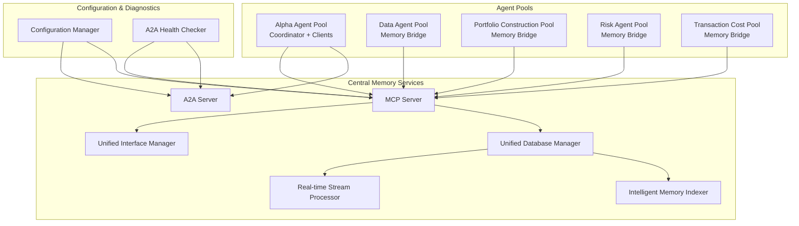
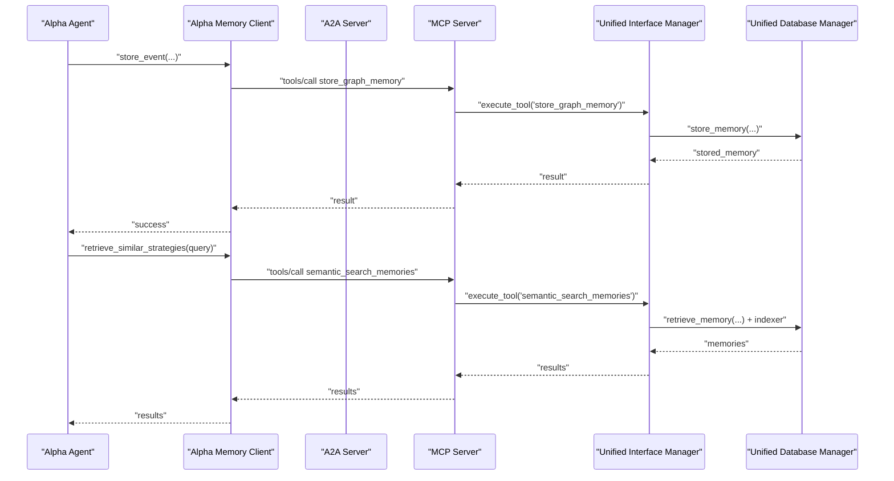
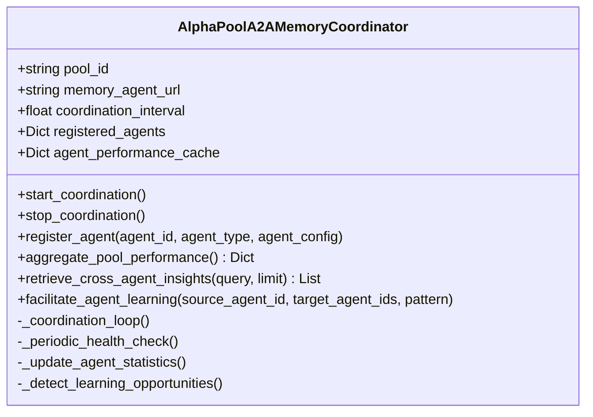
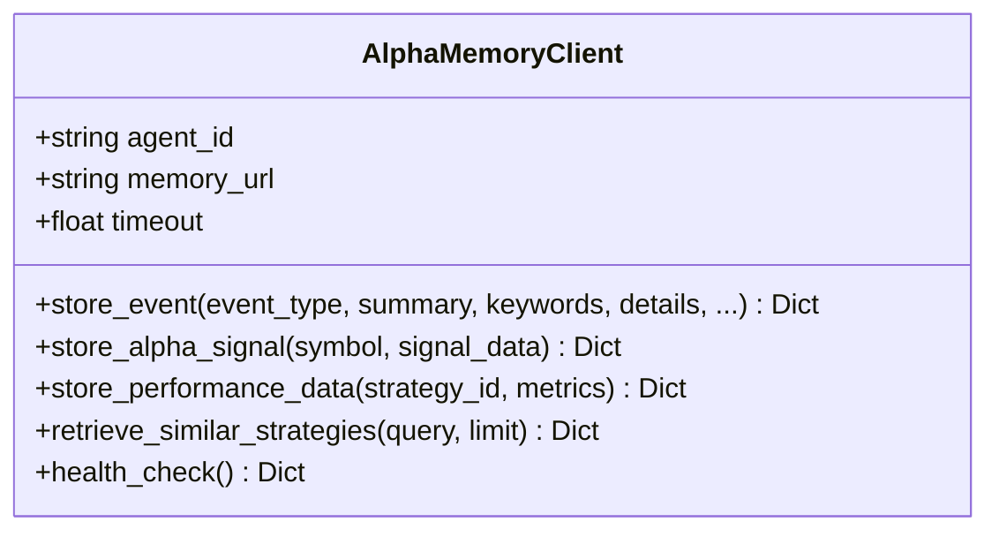
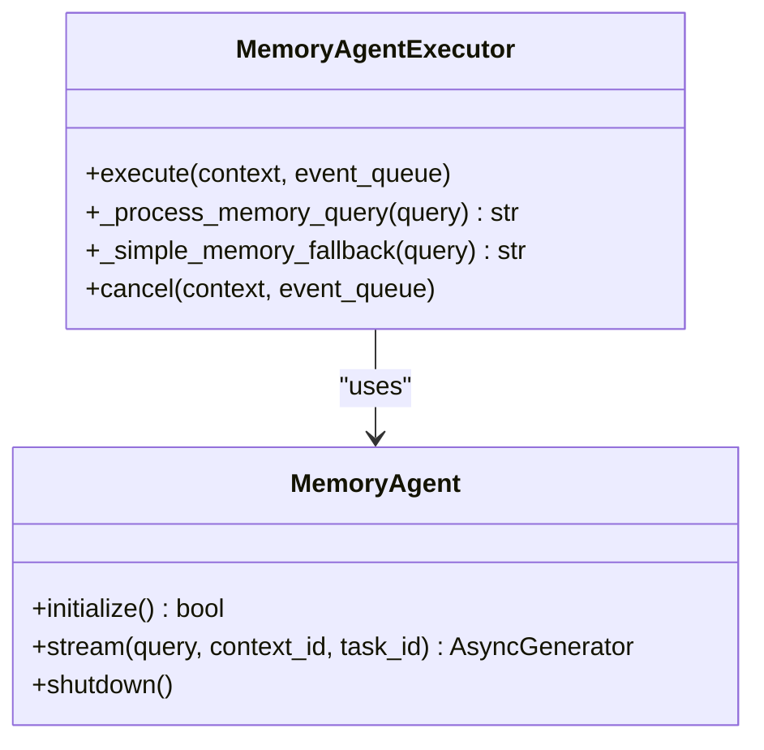
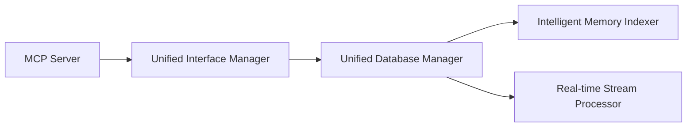
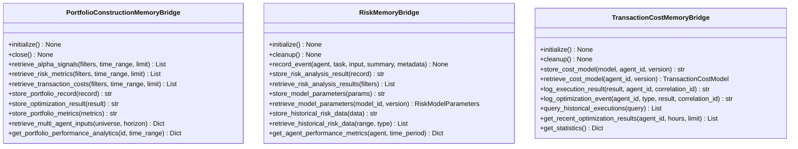
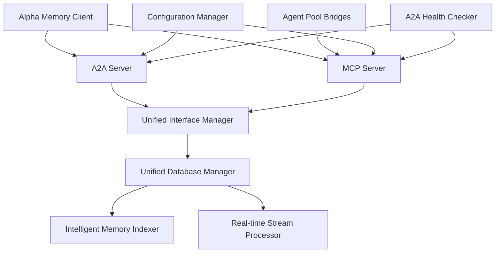

# Memory Integration

<cite>
**Referenced Files in This Document**
- [a2a_memory_coordinator.py](file://FinAgents/agent_pools/alpha_agent_pool/a2a_memory_coordinator.py)
- [alpha_memory_client.py](file://FinAgents/agent_pools/alpha_agent_pool/alpha_memory_client.py)
- [a2a_server.py](file://FinAgents/memory/a2a_server.py)
- [memory_server.py](file://FinAgents/memory/memory_server.py)
- [unified_database_manager.py](file://FinAgents/memory/unified_database_manager.py)
- [unified_interface_manager.py](file://FinAgents/memory/unified_interface_manager.py)
- [intelligent_memory_indexer.py](file://FinAgents/memory/intelligent_memory_indexer.py)
- [realtime_stream_processor.py](file://FinAgents/memory/realtime_stream_processor.py)
- [database.py](file://FinAgents/memory/database.py)
- [configuration_manager.py](file://FinAgents/memory/configuration_manager.py)
- [memory_bridge.py](file://FinAgents/agent_pools/data_agent_pool/memory_bridge.py)
- [memory_bridge.py](file://FinAgents/agent_pools/portfolio_construction_agent_pool/memory_bridge.py)
- [memory_bridge.py](file://FinAgents/agent_pools/risk_agent_pool/memory_bridge.py)
- [memory_bridge.py](file://FinAgents/agent_pools/transaction_cost_agent_pool/memory_bridge.py)
- [a2a_health_checker.py](file://FinAgents/memory/a2a_health_checker.py)
</cite>

## Table of Contents
1. [Introduction](#introduction)
2. [Project Structure](#project-structure)
3. [Core Components](#core-components)
4. [Architecture Overview](#architecture-overview)
5. [Detailed Component Analysis](#detailed-component-analysis)
6. [Dependency Analysis](#dependency-analysis)
7. [Performance Considerations](#performance-considerations)
8. [Troubleshooting Guide](#troubleshooting-guide)
9. [Conclusion](#conclusion)

## Introduction
This document describes the memory integration system for distributed memory coordination in the FinAgent ecosystem. It focuses on the A2A protocol implementation for cross-agent memory operations, the alpha agent pool memory coordinator, the memory bridge architecture connecting alpha agents to the central memory system, and the alpha memory client for logging and retrieval. It also covers indexing strategies, persistence mechanisms, real-time streaming, configuration options, performance optimization, and troubleshooting.

## Project Structure
The memory integration spans three major areas:
- Central memory services: A2A server, MCP server, unified managers, and auxiliary processors
- Agent pool integrations: Alpha agent pool coordinator and clients, plus specialized memory bridges for other agent pools
- Configuration and diagnostics: Centralized configuration manager and health checking utilities

**Diagram sources**
- [a2a_memory_coordinator.py:38-117](file://FinAgents/agent_pools/alpha_agent_pool/a2a_memory_coordinator.py#L38-L117)
- [alpha_memory_client.py:18-32](file://FinAgents/agent_pools/alpha_agent_pool/alpha_memory_client.py#L18-L32)
- [a2a_server.py:59-76](file://FinAgents/memory/a2a_server.py#L59-L76)
- [memory_server.py:209-214](file://FinAgents/memory/memory_server.py#L209-L214)
- [unified_database_manager.py:104-166](file://FinAgents/memory/unified_database_manager.py#L104-L166)
- [unified_interface_manager.py:105-130](file://FinAgents/memory/unified_interface_manager.py#L105-L130)
- [intelligent_memory_indexer.py:40-80](file://FinAgents/memory/intelligent_memory_indexer.py#L40-L80)
- [realtime_stream_processor.py:54-80](file://FinAgents/memory/realtime_stream_processor.py#L54-L80)
- [configuration_manager.py:235-253](file://FinAgents/memory/configuration_manager.py#L235-L253)
- [a2a_health_checker.py:24-33](file://FinAgents/memory/a2a_health_checker.py#L24-L33)

**Section sources**
- [a2a_memory_coordinator.py:1-345](file://FinAgents/agent_pools/alpha_agent_pool/a2a_memory_coordinator.py#L1-L345)
- [alpha_memory_client.py:1-257](file://FinAgents/agent_pools/alpha_agent_pool/alpha_memory_client.py#L1-L257)
- [a2a_server.py:1-659](file://FinAgents/memory/a2a_server.py#L1-L659)
- [memory_server.py:1-1167](file://FinAgents/memory/memory_server.py#L1-L1167)
- [unified_database_manager.py:1-1085](file://FinAgents/memory/unified_database_manager.py#L1-L1085)
- [unified_interface_manager.py:1-867](file://FinAgents/memory/unified_interface_manager.py#L1-L867)
- [intelligent_memory_indexer.py:1-507](file://FinAgents/memory/intelligent_memory_indexer.py#L1-L507)
- [realtime_stream_processor.py:1-542](file://FinAgents/memory/realtime_stream_processor.py#L1-L542)
- [database.py:1-353](file://FinAgents/memory/database.py#L1-L353)
- [configuration_manager.py:1-672](file://FinAgents/memory/configuration_manager.py#L1-L672)
- [memory_bridge.py:1-31](file://FinAgents/agent_pools/data_agent_pool/memory_bridge.py#L1-L31)
- [memory_bridge.py:1-1029](file://FinAgents/agent_pools/portfolio_construction_agent_pool/memory_bridge.py#L1-L1029)
- [memory_bridge.py:1-498](file://FinAgents/agent_pools/risk_agent_pool/memory_bridge.py#L1-L498)
- [memory_bridge.py:1-780](file://FinAgents/agent_pools/transaction_cost_agent_pool/memory_bridge.py#L1-L780)
- [a2a_health_checker.py:1-335](file://FinAgents/memory/a2a_health_checker.py#L1-L335)

## Core Components
- A2A Memory Coordinator: Central pool-level coordinator for alpha agents, managing registration, performance aggregation, and cross-agent insights via A2A protocol.
- Alpha Memory Client: Simplified client for alpha agents to store and retrieve memory entries, with fallbacks to MCP and legacy endpoints.
- A2A Server: Agent-to-Agent protocol server implementing memory operations, streaming, and health checks.
- MCP Memory Server: Model Context Protocol server exposing unified tool definitions for memory storage, retrieval, filtering, and analytics.
- Unified Database Manager: Central Neo4j manager with indexing, relationship management, and maintenance operations.
- Unified Interface Manager: Tool registry and handler for MCP/HTTP/A2A protocols, with conversation and analytics support.
- Intelligent Memory Indexer: Semantic search and keyword extraction with transformer or TF-IDF embeddings.
- Real-time Stream Processor: Event streaming, batching, alerting, and WebSocket broadcasting for reactive memory management.
- Configuration Manager: Environment-aware configuration for databases, servers, memory, and ports.
- Memory Bridges: Specialized connectors for data, portfolio construction, risk, and transaction cost agent pools.

**Section sources**
- [a2a_memory_coordinator.py:38-117](file://FinAgents/agent_pools/alpha_agent_pool/a2a_memory_coordinator.py#L38-L117)
- [alpha_memory_client.py:18-32](file://FinAgents/agent_pools/alpha_agent_pool/alpha_memory_client.py#L18-L32)
- [a2a_server.py:78-111](file://FinAgents/memory/a2a_server.py#L78-L111)
- [memory_server.py:220-279](file://FinAgents/memory/memory_server.py#L220-L279)
- [unified_database_manager.py:104-166](file://FinAgents/memory/unified_database_manager.py#L104-L166)
- [unified_interface_manager.py:105-130](file://FinAgents/memory/unified_interface_manager.py#L105-L130)
- [intelligent_memory_indexer.py:40-80](file://FinAgents/memory/intelligent_memory_indexer.py#L40-L80)
- [realtime_stream_processor.py:54-80](file://FinAgents/memory/realtime_stream_processor.py#L54-L80)
- [configuration_manager.py:235-253](file://FinAgents/memory/configuration_manager.py#L235-L253)

## Architecture Overview
The system uses a layered architecture:
- Protocol Layer: A2A and MCP servers expose tool-based APIs for memory operations.
- Interface Layer: Unified Interface Manager registers and executes tools consistently across protocols.
- Persistence Layer: Unified Database Manager handles Neo4j operations, indexing, and relationships.
- Intelligence Layer: Intelligent Memory Indexer provides semantic search and keyword analysis.
- Streaming Layer: Real-time Stream Processor manages event pipelines, batching, and WebSocket broadcasting.
- Agent Integration Layer: Agent pool memory bridges and alpha coordinator integrate specialized workflows.

**Diagram sources**
- [alpha_memory_client.py:33-115](file://FinAgents/agent_pools/alpha_agent_pool/alpha_memory_client.py#L33-L115)
- [memory_server.py:220-279](file://FinAgents/memory/memory_server.py#L220-L279)
- [unified_interface_manager.py:422-488](file://FinAgents/memory/unified_interface_manager.py#L422-L488)
- [unified_database_manager.py:233-352](file://FinAgents/memory/unified_database_manager.py#L233-L352)

## Detailed Component Analysis

### A2A Memory Coordinator (Alpha Agent Pool)
The coordinator acts as a central hub for memory operations within the alpha agent pool. It:
- Registers agents and tracks performance
- Periodically aggregates pool metrics and stores them via A2A protocol
- Retrieves cross-agent insights and facilitates learning transfer
- Performs health checks and coordinates background tasks

**Diagram sources**
- [a2a_memory_coordinator.py:38-301](file://FinAgents/agent_pools/alpha_agent_pool/a2a_memory_coordinator.py#L38-L301)

**Section sources**
- [a2a_memory_coordinator.py:38-345](file://FinAgents/agent_pools/alpha_agent_pool/a2a_memory_coordinator.py#L38-L345)

### Alpha Memory Client
The alpha client provides a simplified interface for alpha agents to:
- Store events with structured metadata (keywords, summary, details)
- Store alpha signals and performance data
- Retrieve similar strategies using semantic search
- Health-check the memory system

**Diagram sources**
- [alpha_memory_client.py:18-243](file://FinAgents/agent_pools/alpha_agent_pool/alpha_memory_client.py#L18-L243)

**Section sources**
- [alpha_memory_client.py:18-257](file://FinAgents/agent_pools/alpha_agent_pool/alpha_memory_client.py#L18-L257)

### A2A Server
The A2A server implements the Agent-to-Agent protocol with:
- Memory agent executor handling queries and streaming responses
- Structured memory operations (store, search, list, stats, health)
- Fallback in-memory storage when the unified system is unavailable
- Agent card and skill definitions for protocol compliance

**Diagram sources**
- [a2a_server.py:78-111](file://FinAgents/memory/a2a_server.py#L78-L111)
- [a2a_server.py:228-285](file://FinAgents/memory/a2a_server.py#L228-L285)

**Section sources**
- [a2a_server.py:1-659](file://FinAgents/memory/a2a_server.py#L1-L659)

### MCP Memory Server and Unified Managers
The MCP server exposes tools for memory operations and delegates to unified managers:
- Unified Database Manager: Neo4j operations, indexing, relationships, pruning, statistics
- Unified Interface Manager: Tool definitions, handler dispatch, protocol-agnostic execution
- Intelligent Memory Indexer: Semantic search, keyword extraction, performance scoring
- Real-time Stream Processor: Event streaming, batching, alerts, WebSocket broadcasting

**Diagram sources**
- [memory_server.py:220-279](file://FinAgents/memory/memory_server.py#L220-L279)
- [unified_interface_manager.py:175-371](file://FinAgents/memory/unified_interface_manager.py#L175-L371)
- [unified_database_manager.py:104-166](file://FinAgents/memory/unified_database_manager.py#L104-L166)
- [intelligent_memory_indexer.py:40-80](file://FinAgents/memory/intelligent_memory_indexer.py#L40-L80)
- [realtime_stream_processor.py:54-80](file://FinAgents/memory/realtime_stream_processor.py#L54-L80)

**Section sources**
- [memory_server.py:1-1167](file://FinAgents/memory/memory_server.py#L1-L1167)
- [unified_interface_manager.py:1-867](file://FinAgents/memory/unified_interface_manager.py#L1-L867)
- [unified_database_manager.py:1-1085](file://FinAgents/memory/unified_database_manager.py#L1-L1085)
- [intelligent_memory_indexer.py:1-507](file://FinAgents/memory/intelligent_memory_indexer.py#L1-L507)
- [realtime_stream_processor.py:1-542](file://FinAgents/memory/realtime_stream_processor.py#L1-L542)

### Memory Bridge Architecture (Other Agent Pools)
Specialized memory bridges integrate other agent pools:
- Data Agent Pool: Records execution events for task tracking
- Portfolio Construction Agent Pool: Stores portfolio records, optimization results, and metrics; retrieves multi-agent inputs
- Risk Agent Pool: Stores risk analysis results and model parameters; retrieves historical data
- Transaction Cost Agent Pool: Dual-backend bridge supporting legacy and external memory agents; logs execution and optimization events

**Diagram sources**
- [memory_bridge.py:165-285](file://FinAgents/agent_pools/portfolio_construction_agent_pool/memory_bridge.py#L165-L285)
- [memory_bridge.py:59-120](file://FinAgents/agent_pools/risk_agent_pool/memory_bridge.py#L59-L120)
- [memory_bridge.py:94-144](file://FinAgents/agent_pools/transaction_cost_agent_pool/memory_bridge.py#L94-L144)

**Section sources**
- [memory_bridge.py:1-31](file://FinAgents/agent_pools/data_agent_pool/memory_bridge.py#L1-L31)
- [memory_bridge.py:1-1029](file://FinAgents/agent_pools/portfolio_construction_agent_pool/memory_bridge.py#L1-L1029)
- [memory_bridge.py:1-498](file://FinAgents/agent_pools/risk_agent_pool/memory_bridge.py#L1-L498)
- [memory_bridge.py:1-780](file://FinAgents/agent_pools/transaction_cost_agent_pool/memory_bridge.py#L1-L780)

## Dependency Analysis
The system exhibits clear separation of concerns:
- Protocol servers depend on unified managers for database operations
- Unified managers encapsulate Neo4j logic and optional intelligence/streaming features
- Agent pool bridges depend on MCP/HTTP endpoints or direct memory APIs
- Configuration manager provides environment-specific settings across components

**Diagram sources**
- [a2a_server.py:622-632](file://FinAgents/memory/a2a_server.py#L622-L632)
- [memory_server.py:209-214](file://FinAgents/memory/memory_server.py#L209-L214)
- [unified_interface_manager.py:132-155](file://FinAgents/memory/unified_interface_manager.py#L132-L155)
- [unified_database_manager.py:172-212](file://FinAgents/memory/unified_database_manager.py#L172-L212)
- [alpha_memory_client.py:70-101](file://FinAgents/agent_pools/alpha_agent_pool/alpha_memory_client.py#L70-L101)
- [memory_bridge.py:216-263](file://FinAgents/agent_pools/portfolio_construction_agent_pool/memory_bridge.py#L216-L263)
- [configuration_manager.py:429-442](file://FinAgents/memory/configuration_manager.py#L429-L442)
- [a2a_health_checker.py:34-119](file://FinAgents/memory/a2a_health_checker.py#L34-L119)

**Section sources**
- [a2a_server.py:1-659](file://FinAgents/memory/a2a_server.py#L1-L659)
- [memory_server.py:1-1167](file://FinAgents/memory/memory_server.py#L1-L1167)
- [unified_interface_manager.py:1-867](file://FinAgents/memory/unified_interface_manager.py#L1-L867)
- [unified_database_manager.py:1-1085](file://FinAgents/memory/unified_database_manager.py#L1-L1085)
- [alpha_memory_client.py:1-257](file://FinAgents/agent_pools/alpha_agent_pool/alpha_memory_client.py#L1-L257)
- [memory_bridge.py:1-31](file://FinAgents/agent_pools/data_agent_pool/memory_bridge.py#L1-L31)
- [memory_bridge.py:1-1029](file://FinAgents/agent_pools/portfolio_construction_agent_pool/memory_bridge.py#L1-L1029)
- [memory_bridge.py:1-498](file://FinAgents/agent_pools/risk_agent_pool/memory_bridge.py#L1-L498)
- [memory_bridge.py:1-780](file://FinAgents/agent_pools/transaction_cost_agent_pool/memory_bridge.py#L1-L780)
- [configuration_manager.py:1-672](file://FinAgents/memory/configuration_manager.py#L1-L672)
- [a2a_health_checker.py:1-335](file://FinAgents/memory/a2a_health_checker.py#L1-L335)

## Performance Considerations
- Unified vs Legacy: Prefer unified database manager for enhanced features; fallback to legacy when unavailable.
- Indexing: Full-text indexes and intelligent indexing improve retrieval performance; tune thresholds and limits.
- Streaming: Use real-time stream processor for high-throughput event handling; monitor queue sizes and events per second.
- Concurrency: Tools execute concurrently; ensure database connection pooling and timeouts are configured appropriately.
- Caching: Local caches in bridges reduce repeated network calls; configure TTL and eviction policies.
- Batch Operations: Use batch storage for high-volume ingestion to minimize overhead.

[No sources needed since this section provides general guidance]

## Troubleshooting Guide
Common issues and resolutions:
- A2A Server Connectivity: Use the A2A Health Checker to validate protocol endpoints and response times.
- MCP Tool Failures: Inspect tool definitions and handler execution logs; verify database connectivity.
- Memory Retrieval Errors: Confirm full-text index existence and content text population; validate search queries.
- Stream Processing: Check Redis availability and event queue backpressure; review handler exceptions.
- Configuration Problems: Validate environment-specific settings and port configurations via the Configuration Manager.

**Section sources**
- [a2a_health_checker.py:34-119](file://FinAgents/memory/a2a_health_checker.py#L34-L119)
- [memory_server.py:82-203](file://FinAgents/memory/memory_server.py#L82-L203)
- [unified_database_manager.py:172-212](file://FinAgents/memory/unified_database_manager.py#L172-L212)
- [realtime_stream_processor.py:82-161](file://FinAgents/memory/realtime_stream_processor.py#L82-L161)
- [configuration_manager.py:429-442](file://FinAgents/memory/configuration_manager.py#L429-L442)

## Conclusion
The memory integration system leverages A2A and MCP protocols to coordinate distributed memory operations across agent pools. The unified managers provide robust persistence and intelligence, while specialized bridges tailor integration for each agent pool. With configurable environments, real-time streaming, and comprehensive diagnostics, the system supports scalable, observable, and efficient memory coordination in the FinAgent ecosystem.