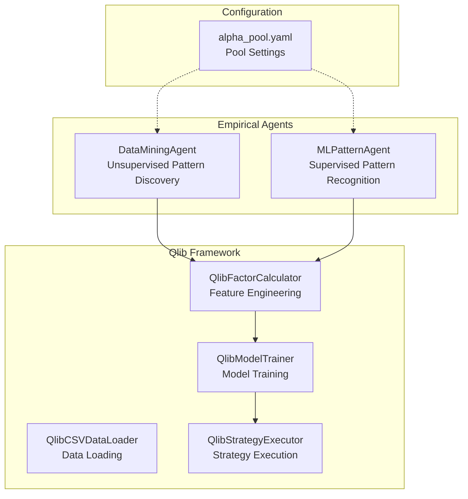
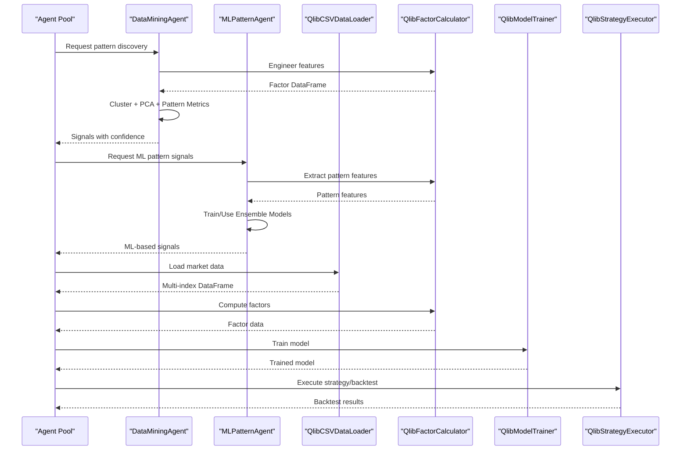
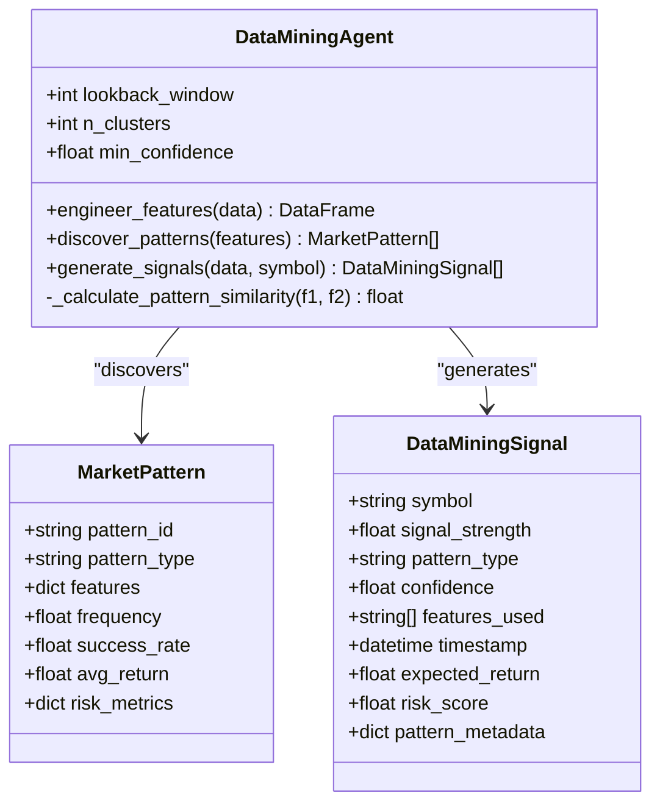
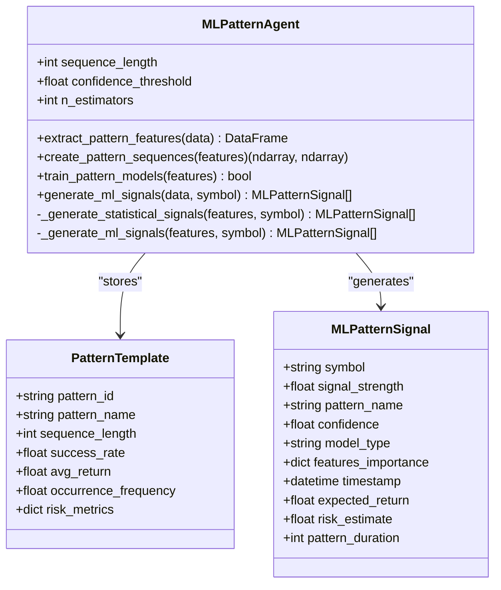
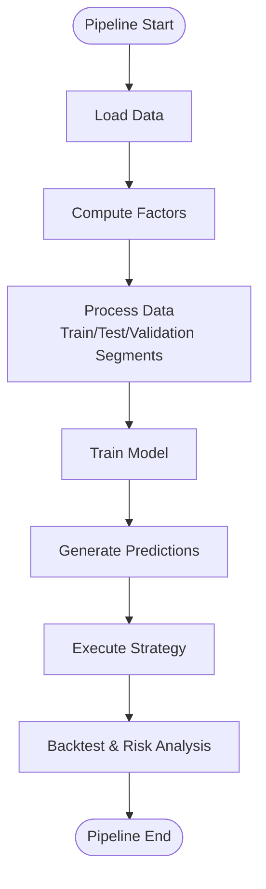
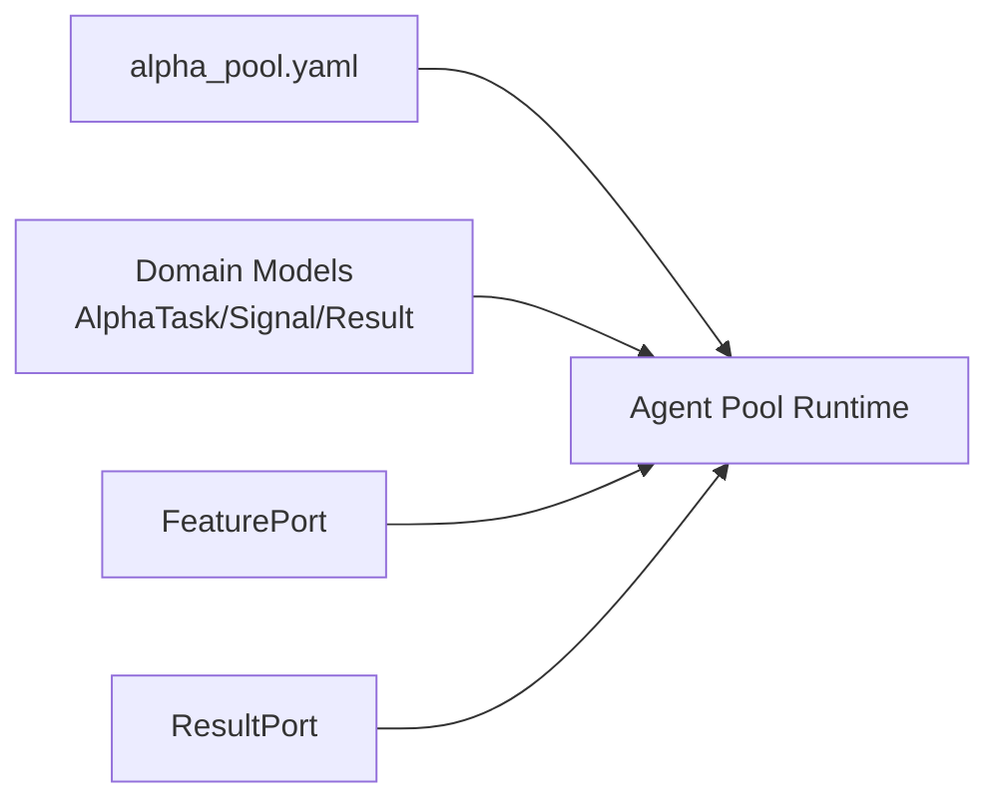
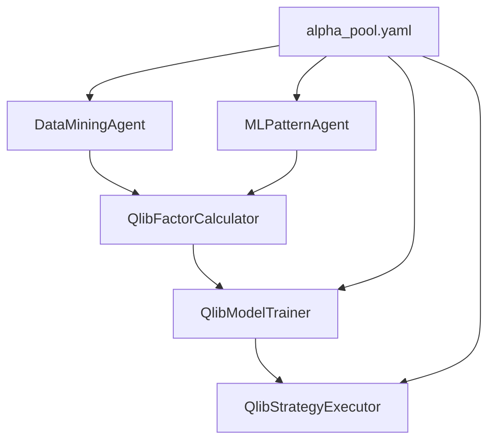

# Empirical Data Mining

<cite>
**Referenced Files in This Document**
- [data_mining_agent.py](file://FinAgents/agent_pools/alpha_agent_pool/agents/empirical/data_mining_agent.py)
- [ml_pattern_agent.py](file://FinAgents/agent_pools/alpha_agent_pool/agents/empirical/ml_pattern_agent.py)
- [factor_calculator.py](file://FinAgents/agent_pools/alpha_agent_pool/qlib_local/qlib_standard/factor_calculator.py)
- [data_loader.py](file://FinAgents/agent_pools/alpha_agent_pool/qlib_local/qlib_standard/data_loader.py)
- [framework.py](file://FinAgents/agent_pools/alpha_agent_pool/qlib_local/qlib_standard/framework.py)
- [model_trainer.py](file://FinAgents/agent_pools/alpha_agent_pool/qlib_local/qlib_standard/model_trainer.py)
- [strategy_executor.py](file://FinAgents/agent_pools/alpha_agent_pool/qlib_local/qlib_standard/strategy_executor.py)
- [alpha_pool.yaml](file://FinAgents/agent_pools/alpha_agent_pool/config/alpha_pool.yaml)
- [models.py](file://FinAgents/agent_pools/alpha_agent_pool/core/domain/models.py)
- [feature.py](file://FinAgents/agent_pools/alpha_agent_pool/core/ports/feature.py)
- [result.py](file://FinAgents/agent_pools/alpha_agent_pool/core/ports/result.py)
- [regime_memory_learner.py](file://FinAgents/memory/regime_memory_learner.py)
- [constraints.py](file://FinAgents/research/risk_compliance/constraints.py)
</cite>

## Table of Contents
1. [Introduction](#introduction)
2. [Project Structure](#project-structure)
3. [Core Components](#core-components)
4. [Architecture Overview](#architecture-overview)
5. [Detailed Component Analysis](#detailed-component-analysis)
6. [Dependency Analysis](#dependency-analysis)
7. [Performance Considerations](#performance-considerations)
8. [Troubleshooting Guide](#troubleshooting-guide)
9. [Conclusion](#conclusion)
10. [Appendices](#appendices)

## Introduction
This document presents a comprehensive guide to empirical data mining and machine learning pattern recognition strategies for financial markets. It covers:
- Statistical arbitrage detection via cointegration analysis, correlation arbitrage, and pairs trading
- Machine learning pattern recognition for recurring inefficiencies and anomaly detection
- Unsupervised learning for cluster analysis and pattern discovery in high-dimensional market data
- Feature engineering from raw price and volume data
- Configuration parameters for pattern matching thresholds, confidence scoring, and false positive filtering
- Reinforcement learning integration for continuous pattern refinement
- Backtesting, performance attribution, and out-of-sample validation
- Overfitting prevention and robustness testing

## Project Structure
The empirical data mining capability is implemented across two primary agent modules and a standardized Qlib-based framework:
- Data Mining Agent: unsupervised pattern discovery, feature engineering, and signal generation
- ML Pattern Agent: supervised and ensemble-based pattern recognition
- Qlib Standard Framework: data loading, factor calculation, model training, strategy execution, and backtesting
- Configuration: pool-wide settings for observability, retries, and resource limits

**Diagram sources**
- [data_mining_agent.py](file://FinAgents/agent_pools/alpha_agent_pool/agents/empirical/data_mining_agent.py)
- [ml_pattern_agent.py](file://FinAgents/agent_pools/alpha_agent_pool/agents/empirical/ml_pattern_agent.py)
- [factor_calculator.py](file://FinAgents/agent_pools/alpha_agent_pool/qlib_local/qlib_standard/factor_calculator.py)
- [data_loader.py](file://FinAgents/agent_pools/alpha_agent_pool/qlib_local/qlib_standard/data_loader.py)
- [framework.py](file://FinAgents/agent_pools/alpha_agent_pool/qlib_local/qlib_standard/framework.py)
- [model_trainer.py](file://FinAgents/agent_pools/alpha_agent_pool/qlib_local/qlib_standard/model_trainer.py)
- [strategy_executor.py](file://FinAgents/agent_pools/alpha_agent_pool/qlib_local/qlib_standard/strategy_executor.py)
- [alpha_pool.yaml](file://FinAgents/agent_pools/alpha_agent_pool/config/alpha_pool.yaml)

**Section sources**
- [data_mining_agent.py](file://FinAgents/agent_pools/alpha_agent_pool/agents/empirical/data_mining_agent.py)
- [ml_pattern_agent.py](file://FinAgents/agent_pools/alpha_agent_pool/agents/empirical/ml_pattern_agent.py)
- [framework.py](file://FinAgents/agent_pools/alpha_agent_pool/qlib_local/qlib_standard/framework.py)
- [alpha_pool.yaml](file://FinAgents/agent_pools/alpha_agent_pool/config/alpha_pool.yaml)

## Core Components
- DataMiningAgent: Implements unsupervised clustering, PCA dimensionality reduction, and hybrid pattern/ML signal generation with configurable thresholds and confidence scoring.
- MLPatternAgent: Implements statistical and ML-based pattern recognition, ensemble modeling, and confidence aggregation for pattern signals.
- Qlib Standard Framework: Provides end-to-end pipeline for data loading, factor calculation, model training, and backtesting with standardized interfaces.

Key configuration parameters:
- DataMiningAgent: lookback_window, n_clusters, min_confidence
- MLPatternAgent: sequence_length, confidence_threshold, n_estimators
- Qlib components: normalization, train/test/validation splits, model types and hyperparameters
- Pool settings: observability, retry/backoff, queue sizing, timeouts

**Section sources**
- [data_mining_agent.py](file://FinAgents/agent_pools/alpha_agent_pool/agents/empirical/data_mining_agent.py)
- [ml_pattern_agent.py](file://FinAgents/agent_pools/alpha_agent_pool/agents/empirical/ml_pattern_agent.py)
- [framework.py](file://FinAgents/agent_pools/alpha_agent_pool/qlib_local/qlib_standard/framework.py)
- [alpha_pool.yaml](file://FinAgents/agent_pools/alpha_agent_pool/config/alpha_pool.yaml)

## Architecture Overview
The system integrates empirical agents with the Qlib framework to deliver a complete research-to-execution pipeline.

**Diagram sources**
- [data_mining_agent.py](file://FinAgents/agent_pools/alpha_agent_pool/agents/empirical/data_mining_agent.py)
- [ml_pattern_agent.py](file://FinAgents/agent_pools/alpha_agent_pool/agents/empirical/ml_pattern_agent.py)
- [factor_calculator.py](file://FinAgents/agent_pools/alpha_agent_pool/qlib_local/qlib_standard/factor_calculator.py)
- [data_loader.py](file://FinAgents/agent_pools/alpha_agent_pool/qlib_local/qlib_standard/data_loader.py)
- [framework.py](file://FinAgents/agent_pools/alpha_agent_pool/qlib_local/qlib_standard/framework.py)
- [model_trainer.py](file://FinAgents/agent_pools/alpha_agent_pool/qlib_local/qlib_standard/model_trainer.py)
- [strategy_executor.py](file://FinAgents/agent_pools/alpha_agent_pool/qlib_local/qlib_standard/strategy_executor.py)

## Detailed Component Analysis

### DataMiningAgent: Unsupervised Pattern Discovery
Implements:
- Feature engineering from OHLCV data (returns, momentum, volatility, technical indicators, regime features)
- Clustering with KMeans after StandardScaler and PCA
- Pattern metrics: frequency, success rate, average return, volatility, max drawdown, Sharpe ratio
- Hybrid signal generation combining pattern similarity and ML return prediction
- Configurable thresholds for lookback window, number of clusters, and minimum confidence

**Diagram sources**
- [data_mining_agent.py](file://FinAgents/agent_pools/alpha_agent_pool/agents/empirical/data_mining_agent.py)

**Section sources**
- [data_mining_agent.py](file://FinAgents/agent_pools/alpha_agent_pool/agents/empirical/data_mining_agent.py)

### MLPatternAgent: Supervised Pattern Recognition
Implements:
- Statistical pattern detection (momentum breakout, volatility spike, mean reversion, trend continuation)
- Ensemble modeling (RandomForest + GradientBoosting) with confidence derived from model agreement
- Pattern feature extraction including candlestick pattern detectors and statistical measures
- Configurable sequence length, confidence threshold, and estimator counts

**Diagram sources**
- [ml_pattern_agent.py](file://FinAgents/agent_pools/alpha_agent_pool/agents/empirical/ml_pattern_agent.py)

**Section sources**
- [ml_pattern_agent.py](file://FinAgents/agent_pools/alpha_agent_pool/agents/empirical/ml_pattern_agent.py)

### Qlib Standard Framework: Data, Factors, Models, Backtest
End-to-end pipeline:
- Data loading from CSV or synthetic sources with multi-index formatting
- Factor calculation using Qlib Expression engine and custom operators
- Model training with multiple algorithms (LightGBM, Linear/Ridge/Lasso, Random Forest)
- Strategy execution and backtesting with risk metrics

**Diagram sources**
- [framework.py](file://FinAgents/agent_pools/alpha_agent_pool/qlib_local/qlib_standard/framework.py)
- [data_loader.py](file://FinAgents/agent_pools/alpha_agent_pool/qlib_local/qlib_standard/data_loader.py)
- [factor_calculator.py](file://FinAgents/agent_pools/alpha_agent_pool/qlib_local/qlib_standard/factor_calculator.py)
- [model_trainer.py](file://FinAgents/agent_pools/alpha_agent_pool/qlib_local/qlib_standard/model_trainer.py)
- [strategy_executor.py](file://FinAgents/agent_pools/alpha_agent_pool/qlib_local/qlib_standard/strategy_executor.py)

**Section sources**
- [framework.py](file://FinAgents/agent_pools/alpha_agent_pool/qlib_local/qlib_standard/framework.py)
- [data_loader.py](file://FinAgents/agent_pools/alpha_agent_pool/qlib_local/qlib_standard/data_loader.py)
- [factor_calculator.py](file://FinAgents/agent_pools/alpha_agent_pool/qlib_local/qlib_standard/factor_calculator.py)
- [model_trainer.py](file://FinAgents/agent_pools/alpha_agent_pool/qlib_local/qlib_standard/model_trainer.py)
- [strategy_executor.py](file://FinAgents/agent_pools/alpha_agent_pool/qlib_local/qlib_standard/strategy_executor.py)

### Configuration and Ports
- Pool configuration defines observability, retry/backoff, queue sizing, and timeouts
- Domain models define AlphaTask, AlphaPlan, AlphaSignal, and AlphaResult structures
- Ports define FeaturePort and ResultPort interfaces for decoupled feature retrieval and result publishing

**Diagram sources**
- [alpha_pool.yaml](file://FinAgents/agent_pools/alpha_agent_pool/config/alpha_pool.yaml)
- [models.py](file://FinAgents/agent_pools/alpha_agent_pool/core/domain/models.py)
- [feature.py](file://FinAgents/agent_pools/alpha_agent_pool/core/ports/feature.py)
- [result.py](file://FinAgents/agent_pools/alpha_agent_pool/core/ports/result.py)

**Section sources**
- [alpha_pool.yaml](file://FinAgents/agent_pools/alpha_agent_pool/config/alpha_pool.yaml)
- [models.py](file://FinAgents/agent_pools/alpha_agent_pool/core/domain/models.py)
- [feature.py](file://FinAgents/agent_pools/alpha_agent_pool/core/ports/feature.py)
- [result.py](file://FinAgents/agent_pools/alpha_agent_pool/core/ports/result.py)

## Dependency Analysis
- DataMiningAgent and MLPatternAgent depend on feature engineering from QlibFactorCalculator
- QlibModelTrainer supports multiple ML backends with fallbacks
- StrategyExecutor integrates signals into portfolio construction and risk management
- Pool configuration governs reliability and performance characteristics

**Diagram sources**
- [data_mining_agent.py](file://FinAgents/agent_pools/alpha_agent_pool/agents/empirical/data_mining_agent.py)
- [ml_pattern_agent.py](file://FinAgents/agent_pools/alpha_agent_pool/agents/empirical/ml_pattern_agent.py)
- [factor_calculator.py](file://FinAgents/agent_pools/alpha_agent_pool/qlib_local/qlib_standard/factor_calculator.py)
- [model_trainer.py](file://FinAgents/agent_pools/alpha_agent_pool/qlib_local/qlib_standard/model_trainer.py)
- [strategy_executor.py](file://FinAgents/agent_pools/alpha_agent_pool/qlib_local/qlib_standard/strategy_executor.py)
- [alpha_pool.yaml](file://FinAgents/agent_pools/alpha_agent_pool/config/alpha_pool.yaml)

**Section sources**
- [data_mining_agent.py](file://FinAgents/agent_pools/alpha_agent_pool/agents/empirical/data_mining_agent.py)
- [ml_pattern_agent.py](file://FinAgents/agent_pools/alpha_agent_pool/agents/empirical/ml_pattern_agent.py)
- [framework.py](file://FinAgents/agent_pools/alpha_agent_pool/qlib_local/qlib_standard/framework.py)
- [alpha_pool.yaml](file://FinAgents/agent_pools/alpha_agent_pool/config/alpha_pool.yaml)

## Performance Considerations
- Dimensionality reduction: PCA retains variance while reducing computational cost for clustering
- Scaling: StandardScaler ensures comparable feature magnitudes across heterogeneous inputs
- Ensemble modeling: Combines multiple models to improve robustness and reduce overfitting
- Train/test/validation splits: Prevents leakage and enables unbiased performance estimates
- Observability: Metrics and tracing help monitor latency and throughput under load

[No sources needed since this section provides general guidance]

## Troubleshooting Guide
Common issues and mitigations:
- Insufficient data for pattern discovery: ensure lookback_window and minimum cluster sizes are met
- Missing ML dependencies: agents fall back to statistical methods when ML libraries are unavailable
- Data gaps and outliers: preprocessing cleans NaNs and clips extreme values
- Confidence thresholds too strict: adjust min_confidence or confidence_threshold to balance precision/recall
- Pool resource saturation: tune worker threads, queue size, and rate limits in alpha_pool.yaml

**Section sources**
- [data_mining_agent.py](file://FinAgents/agent_pools/alpha_agent_pool/agents/empirical/data_mining_agent.py)
- [ml_pattern_agent.py](file://FinAgents/agent_pools/alpha_agent_pool/agents/empirical/ml_pattern_agent.py)
- [framework.py](file://FinAgents/agent_pools/alpha_agent_pool/qlib_local/qlib_standard/framework.py)
- [alpha_pool.yaml](file://FinAgents/agent_pools/alpha_agent_pool/config/alpha_pool.yaml)

## Conclusion
The empirical data mining system combines unsupervised and supervised learning with standardized factor engineering and backtesting. By tuning configuration parameters and leveraging ensemble methods, practitioners can discover recurring market inefficiencies, detect anomalies, and build robust strategies validated out-of-sample. Integration with reinforcement learning and memory systems enables continuous refinement and adaptation to evolving market regimes.

[No sources needed since this section summarizes without analyzing specific files]

## Appendices

### Statistical Arbitrage Detection Methods
- Cointegration analysis: Use factor returns and residuals from cointegrated pairs to identify mean-reverting spreads and generate trade signals when deviating from equilibrium.
- Correlation arbitrage: Monitor pairwise correlations and volatility regimes; exploit temporary deviations from historical correlation surfaces.
- Pairs trading: Identify co-integrated pairs, estimate half-life of mean reversion, and apply position sizing constrained by realized volatility.

[No sources needed since this section provides general guidance]

### Machine Learning Pattern Recognition Techniques
- Unsupervised clustering: Group similar market regimes or price-action patterns using KMeans on PCA-reduced feature space.
- Anomaly detection: Flag observations with low probability density or large reconstruction error in autoencoders.
- Supervised classification/regression: Train models to predict direction/magnitude of returns or regime transitions.

[No sources needed since this section provides general guidance]

### Feature Engineering from Raw Price and Volume Data
- Price-based: returns, log-returns, volatility, momentum, skewness, kurtosis
- Technical indicators: RSI, MACD, Bollinger Bands position, trend strength
- Volume features: volume moving averages, volume-price trend, volume ratios
- Regime features: volatility regimes, trend regimes, cross-sectional relative strength

**Section sources**
- [data_mining_agent.py](file://FinAgents/agent_pools/alpha_agent_pool/agents/empirical/data_mining_agent.py)
- [ml_pattern_agent.py](file://FinAgents/agent_pools/alpha_agent_pool/agents/empirical/ml_pattern_agent.py)
- [factor_calculator.py](file://FinAgents/agent_pools/alpha_agent_pool/qlib_local/qlib_standard/factor_calculator.py)

### Configuration Parameters for Pattern Matching and Filtering
- DataMiningAgent: lookback_window, n_clusters, min_confidence
- MLPatternAgent: sequence_length, confidence_threshold, n_estimators
- Qlib preprocessing: normalization, train/test/validation splits
- Pool: retry/backoff, queue size, rate limits, observability

**Section sources**
- [data_mining_agent.py](file://FinAgents/agent_pools/alpha_agent_pool/agents/empirical/data_mining_agent.py)
- [ml_pattern_agent.py](file://FinAgents/agent_pools/alpha_agent_pool/agents/empirical/ml_pattern_agent.py)
- [framework.py](file://FinAgents/agent_pools/alpha_agent_pool/qlib_local/qlib_standard/framework.py)
- [alpha_pool.yaml](file://FinAgents/agent_pools/alpha_agent_pool/config/alpha_pool.yaml)

### Reinforcement Learning Integration for Continuous Pattern Refinement
- Memory-driven adaptation: Use regime_memory_learner to cluster experiences by regime and signal characteristics, updating pattern templates and confidence thresholds dynamically.
- Portfolio-level constraints: Apply correlation and concentration constraints to prevent overfitting to spurious patterns.

**Section sources**
- [regime_memory_learner.py](file://FinAgents/memory/regime_memory_learner.py)
- [constraints.py](file://FinAgents/research/risk_compliance/constraints.py)

### Backtesting, Performance Attribution, and Out-of-Sample Validation
- Backtesting: Use Qlib backtest_daily with risk_analysis to compute annual return, Sharpe ratio, max drawdown, and volatility.
- Walk-forward analysis: Split data chronologically and retrain periodically to assess stability.
- Out-of-sample validation: Reserve a hold-out period after the last training window to evaluate generalization.

**Section sources**
- [framework.py](file://FinAgents/agent_pools/alpha_agent_pool/qlib_local/qlib_standard/framework.py)
- [strategy_executor.py](file://FinAgents/agent_pools/alpha_agent_pool/qlib_local/qlib_standard/strategy_executor.py)

### Overfitting Prevention and Robustness Testing
- Regularization: Ridge/Lasso or LightGBM early stopping and validation sets
- Cross-validation: Time-series CV with expanding or rolling windows
- Feature importance: Monitor drift in top features across time
- Robustness checks: Stress-test on different market regimes and subsamples

[No sources needed since this section provides general guidance]