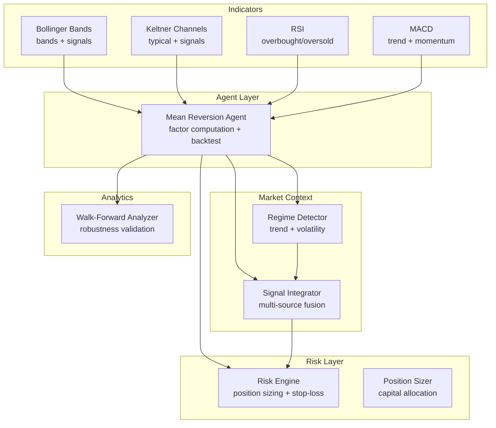
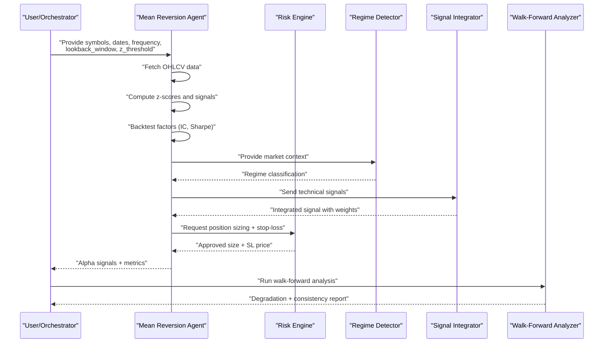
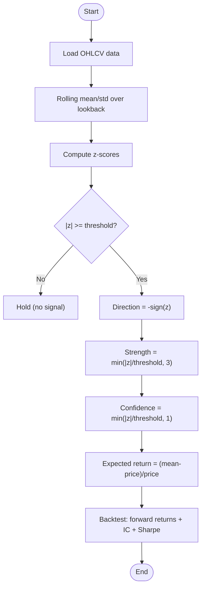
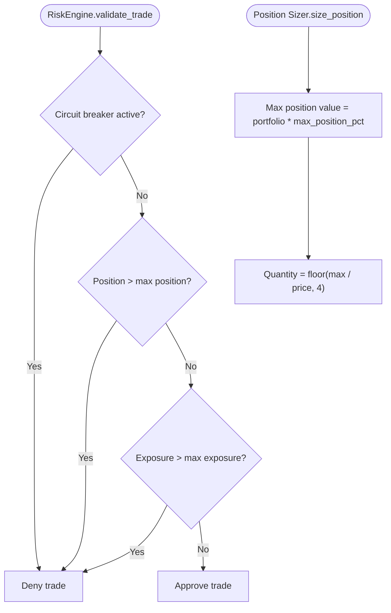
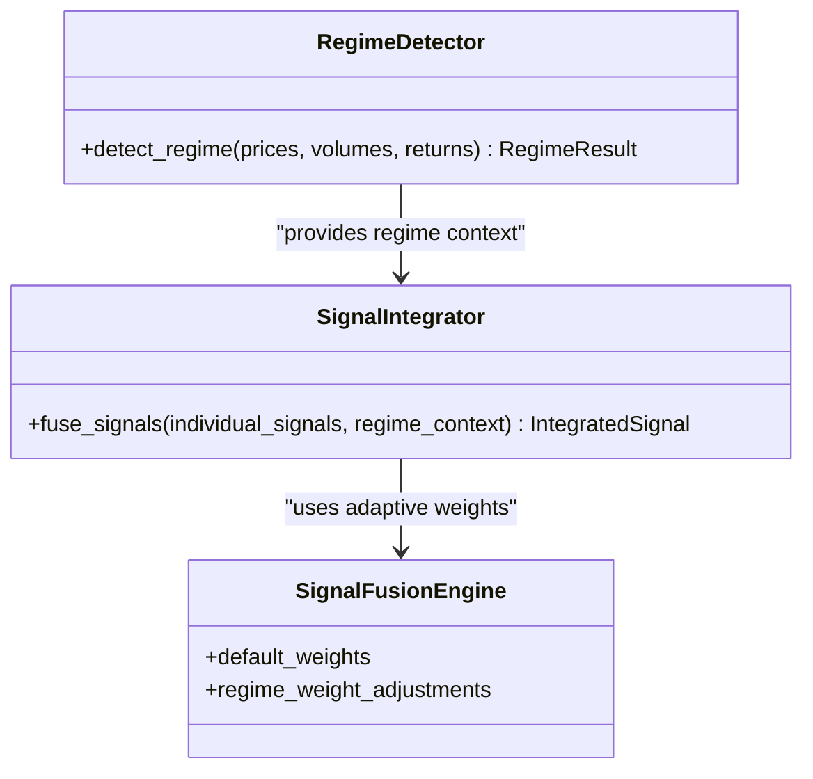
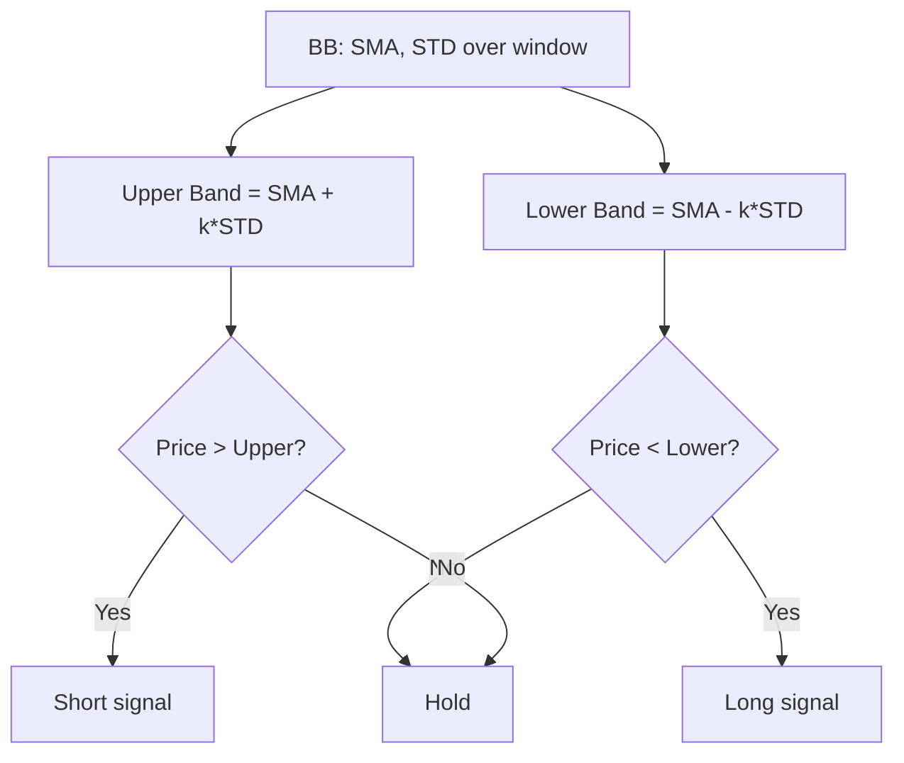
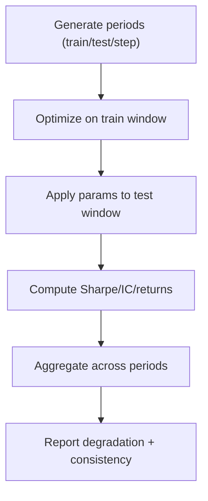
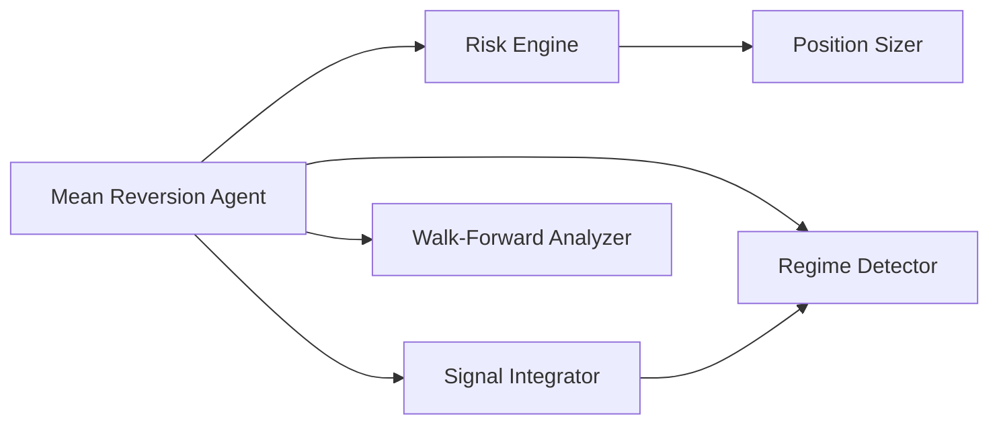

# Mean Reversion Strategies

<cite>
**Referenced Files in This Document**
- [mean_reversion_agent.py](file://FinAgents/agent_pools/alpha_agent_pool/agents/theory_driven/mean_reversion_agent.py)
- [risk_engine.py](file://backend/risk/risk_engine.py)
- [position_sizer.py](file://backend/risk/position_sizer.py)
- [regime_detector.py](file://backend/market/regime_detector.py)
- [signal_integrator.py](file://backend/market/signal_integrator.py)
- [walk_forward_analysis.py](file://backend/analytics/walk_forward_analysis.py)
- [comprehensive_demo.py](file://FinAgents/agent_pools/alpha_agent_pool/qlib_local/comprehensive_demo.py)
- [factor_calculator.py](file://FinAgents/agent_pools/alpha_agent_pool/qlib_local/qlib_standard/factor_calculator.py)
- [alpha_pool.yaml](file://FinAgents/agent_pools/alpha_agent_pool/config/alpha_pool.yaml)
- [theory_driven_schema.py](file://FinAgents/agent_pools/alpha_agent_pool/schema/theory_driven_schema.py)
</cite>

## Table of Contents
1. [Introduction](#introduction)
2. [Project Structure](#project-structure)
3. [Core Components](#core-components)
4. [Architecture Overview](#architecture-overview)
5. [Detailed Component Analysis](#detailed-component-analysis)
6. [Dependency Analysis](#dependency-analysis)
7. [Performance Considerations](#performance-considerations)
8. [Troubleshooting Guide](#troubleshooting-guide)
9. [Conclusion](#conclusion)
10. [Appendices](#appendices)

## Introduction
This document provides a comprehensive guide to implementing and operating mean-reversion signal generation strategies within the Agentic Trading Application. It covers the theoretical foundations of mean reversion, statistical arbitrage principles, z-score computation, and volatility-adjusted models. It also documents technical indicator implementations (Bollinger Bands, Keltner Channels, RSI, MACD), risk management (position sizing, stop-loss), configuration parameters, integration with market context analysis to avoid mean-reversion traps during trending markets, and performance validation via walk-forward analysis.

## Project Structure
The mean-reversion capability spans several modules:
- Agent-based factor generation and backtesting
- Risk management and position sizing
- Market regime detection and signal integration
- Walk-forward validation framework
- Technical indicator implementations

**Diagram sources**
- [mean_reversion_agent.py:196-287](file://FinAgents/agent_pools/alpha_agent_pool/agents/theory_driven/mean_reversion_agent.py#L196-L287)
- [risk_engine.py:22-226](file://backend/risk/risk_engine.py#L22-L226)
- [position_sizer.py:1-21](file://backend/risk/position_sizer.py#L1-L21)
- [regime_detector.py:101-602](file://backend/market/regime_detector.py#L101-L602)
- [signal_integrator.py:130-800](file://backend/market/signal_integrator.py#L130-L800)
- [walk_forward_analysis.py:65-265](file://backend/analytics/walk_forward_analysis.py#L65-L265)
- [comprehensive_demo.py:232-296](file://FinAgents/agent_pools/alpha_agent_pool/qlib_local/comprehensive_demo.py#L232-L296)
- [factor_calculator.py:166-232](file://FinAgents/agent_pools/alpha_agent_pool/qlib_local/qlib_standard/factor_calculator.py#L166-L232)

**Section sources**
- [mean_reversion_agent.py:1-800](file://FinAgents/agent_pools/alpha_agent_pool/agents/theory_driven/mean_reversion_agent.py#L1-L800)
- [risk_engine.py:1-226](file://backend/risk/risk_engine.py#L1-L226)
- [position_sizer.py:1-21](file://backend/risk/position_sizer.py#L1-L21)
- [regime_detector.py:1-602](file://backend/market/regime_detector.py#L1-L602)
- [signal_integrator.py:1-800](file://backend/market/signal_integrator.py#L1-L800)
- [walk_forward_analysis.py:1-425](file://backend/analytics/walk_forward_analysis.py#L1-L425)
- [comprehensive_demo.py:232-296](file://FinAgents/agent_pools/alpha_agent_pool/qlib_local/comprehensive_demo.py#L232-L296)
- [factor_calculator.py:166-232](file://FinAgents/agent_pools/alpha_agent_pool/qlib_local/qlib_standard/factor_calculator.py#L166-L232)

## Core Components
- Mean Reversion Agent: Computes z-scores, generates directional signals, and backtests factors with transaction costs and IC metrics.
- Risk Engine: Enforces position sizing limits, calculates stop-loss levels, and integrates optional circuit breakers.
- Position Sizer: Allocates capital per position based on portfolio value and risk limits.
- Regime Detector: Classifies market regimes (bull/bear/high/low volatility, trending, sideways) to inform strategy adaptation.
- Signal Integrator: Fuses multiple sources (technical, sentiment, macro) and adapts weights by regime.
- Walk-Forward Analyzer: Validates robustness and detects overfitting across rolling windows.
- Technical Indicators: Bollinger Bands, Keltner Channels, RSI, MACD for overbought/oversold and trend confirmation.

**Section sources**
- [mean_reversion_agent.py:196-287](file://FinAgents/agent_pools/alpha_agent_pool/agents/theory_driven/mean_reversion_agent.py#L196-L287)
- [risk_engine.py:22-226](file://backend/risk/risk_engine.py#L22-L226)
- [position_sizer.py:1-21](file://backend/risk/position_sizer.py#L1-L21)
- [regime_detector.py:101-602](file://backend/market/regime_detector.py#L101-L602)
- [signal_integrator.py:130-800](file://backend/market/signal_integrator.py#L130-L800)
- [walk_forward_analysis.py:65-265](file://backend/analytics/walk_forward_analysis.py#L65-L265)
- [comprehensive_demo.py:232-296](file://FinAgents/agent_pools/alpha_agent_pool/qlib_local/comprehensive_demo.py#L232-L296)
- [factor_calculator.py:166-232](file://FinAgents/agent_pools/alpha_agent_pool/qlib_local/qlib_standard/factor_calculator.py#L166-L232)

## Architecture Overview
The mean-reversion workflow integrates data ingestion, factor computation, risk control, regime-aware signal fusion, and validation.

**Diagram sources**
- [mean_reversion_agent.py:110-168](file://FinAgents/agent_pools/alpha_agent_pool/agents/theory_driven/mean_reversion_agent.py#L110-L168)
- [regime_detector.py:160-586](file://backend/market/regime_detector.py#L160-L586)
- [signal_integrator.py:686-777](file://backend/market/signal_integrator.py#L686-L777)
- [risk_engine.py:150-186](file://backend/risk/risk_engine.py#L150-L186)
- [walk_forward_analysis.py:143-264](file://backend/analytics/walk_forward_analysis.py#L143-L264)

## Detailed Component Analysis

### Mean Reversion Agent: Factor Computation and Backtesting
- Z-score calculation: Uses rolling mean and rolling standard deviation over a configurable lookback window.
- Signal generation: Activates when absolute z-score exceeds a threshold; direction is determined by sign of z-score; strength capped by normalized z-score.
- Confidence and expected return: Derived from z-score magnitude and price vs. mean relationship.
- Backtesting: Computes forward returns, applies strategy signals with transaction costs, and evaluates IC, Sharpe ratio, and win rate.

**Diagram sources**
- [mean_reversion_agent.py:196-287](file://FinAgents/agent_pools/alpha_agent_pool/agents/theory_driven/mean_reversion_agent.py#L196-L287)

**Section sources**
- [mean_reversion_agent.py:196-287](file://FinAgents/agent_pools/alpha_agent_pool/agents/theory_driven/mean_reversion_agent.py#L196-L287)

### Risk Management: Position Sizing and Stop-Loss
- Position sizing: Limits per-position exposure as a percentage of portfolio value; optional volatility adjustment reduces size for higher volatility assets.
- Stop-loss calculation: Computes hard stops based on entry price and a fixed percentage, adapting direction for long/short.
- Circuit breaker integration: Optional monitoring of daily drawdown and automatic halts.

**Diagram sources**
- [risk_engine.py:72-127](file://backend/risk/risk_engine.py#L72-L127)
- [position_sizer.py:9-21](file://backend/risk/position_sizer.py#L9-L21)

**Section sources**
- [risk_engine.py:22-226](file://backend/risk/risk_engine.py#L22-L226)
- [position_sizer.py:1-21](file://backend/risk/position_sizer.py#L1-L21)

### Market Context Integration: Regime Detection and Signal Fusion
- Regime detection: Aggregates average return and volatility across assets to classify regimes (bull/bear low/high volatility, trending, sideways, crisis).
- Signal fusion: Combines technical signals (trend, momentum, volatility, volume) with adaptive weights depending on detected regime.

**Diagram sources**
- [regime_detector.py:160-586](file://backend/market/regime_detector.py#L160-L586)
- [signal_integrator.py:651-777](file://backend/market/signal_integrator.py#L651-L777)

**Section sources**
- [regime_detector.py:101-602](file://backend/market/regime_detector.py#L101-L602)
- [signal_integrator.py:130-800](file://backend/market/signal_integrator.py#L130-L800)

### Technical Indicators for Mean Reversion
- Bollinger Bands: Buy when price touches lower band; Sell when price touches upper band; supports volatility scaling.
- Keltner Channels: Similar logic around upper/lower channels; can be derived from ATR.
- RSI: Overbought/oversold thresholds (commonly 70/30) to confirm mean-reversion setups.
- MACD: Histogram-based signal to filter entries; aligns with momentum confirmation.

**Diagram sources**
- [comprehensive_demo.py:256-273](file://FinAgents/agent_pools/alpha_agent_pool/qlib_local/comprehensive_demo.py#L256-L273)
- [factor_calculator.py:166-232](file://FinAgents/agent_pools/alpha_agent_pool/qlib_local/qlib_standard/factor_calculator.py#L166-L232)

**Section sources**
- [comprehensive_demo.py:232-296](file://FinAgents/agent_pools/alpha_agent_pool/qlib_local/comprehensive_demo.py#L232-L296)
- [factor_calculator.py:166-232](file://FinAgents/agent_pools/alpha_agent_pool/qlib_local/qlib_standard/factor_calculator.py#L166-L232)

### Configuration Parameters
- Agent-level parameters:
  - lookback_window: Rolling window for mean and std (e.g., 20).
  - z_threshold: Threshold for signal activation (e.g., 2.0).
  - holding_horizon: Forward return look-ahead for backtest (e.g., 5).
  - transaction_cost: Assumed cost per trade (e.g., 0.001).
- Risk engine parameters:
  - max_position_pct: Max fraction of portfolio per position.
  - max_drawdown_pct: Maximum allowed drawdown.
  - max_portfolio_exposure_pct: Total portfolio exposure cap.
  - stop_loss_pct: Fixed stop-loss percentage.
- Regime detector parameters:
  - volatility_lookback, trend_lookback, momentum_lookback, use_gmm.
- Signal integrator parameters:
  - default_weights and regime_weight_adjustments.

**Section sources**
- [mean_reversion_agent.py:118-142](file://FinAgents/agent_pools/alpha_agent_pool/agents/theory_driven/mean_reversion_agent.py#L118-L142)
- [risk_engine.py:34-64](file://backend/risk/risk_engine.py#L34-L64)
- [regime_detector.py:138-158](file://backend/market/regime_detector.py#L138-L158)
- [signal_integrator.py:654-684](file://backend/market/signal_integrator.py#L654-L684)
- [alpha_pool.yaml:35-58](file://FinAgents/agent_pools/alpha_agent_pool/config/alpha_pool.yaml#L35-L58)
- [theory_driven_schema.py:58-87](file://FinAgents/agent_pools/alpha_agent_pool/schema/theory_driven_schema.py#L58-L87)

### Performance Validation: Walk-Forward Analysis
- Rolling train/test windows prevent lookahead bias and overfitting.
- Measures include Sharpe degradation, return degradation, and consistency score.
- Monte Carlo simulation can estimate confidence intervals for returns.

**Diagram sources**
- [walk_forward_analysis.py:103-264](file://backend/analytics/walk_forward_analysis.py#L103-L264)

**Section sources**
- [walk_forward_analysis.py:65-425](file://backend/analytics/walk_forward_analysis.py#L65-L425)

## Dependency Analysis
- Mean Reversion Agent depends on:
  - Data providers (mocked in demo; production connects to external APIs).
  - Risk Engine for position sizing and stop-loss.
  - Regime Detector and Signal Integrator for context-aware signal fusion.
  - Walk-Forward Analyzer for robustness validation.
- Risk Engine integrates optional circuit breaker monitoring.
- Signal Integrator adapts weights based on regime context.

**Diagram sources**
- [mean_reversion_agent.py:110-168](file://FinAgents/agent_pools/alpha_agent_pool/agents/theory_driven/mean_reversion_agent.py#L110-L168)
- [risk_engine.py:22-226](file://backend/risk/risk_engine.py#L22-L226)
- [signal_integrator.py:651-777](file://backend/market/signal_integrator.py#L651-L777)
- [regime_detector.py:160-586](file://backend/market/regime_detector.py#L160-L586)
- [walk_forward_analysis.py:65-265](file://backend/analytics/walk_forward_analysis.py#L65-L265)

**Section sources**
- [mean_reversion_agent.py:110-168](file://FinAgents/agent_pools/alpha_agent_pool/agents/theory_driven/mean_reversion_agent.py#L110-L168)
- [risk_engine.py:22-226](file://backend/risk/risk_engine.py#L22-L226)
- [signal_integrator.py:651-777](file://backend/market/signal_integrator.py#L651-L777)
- [regime_detector.py:160-586](file://backend/market/regime_detector.py#L160-L586)
- [walk_forward_analysis.py:65-265](file://backend/analytics/walk_forward_analysis.py#L65-L265)

## Performance Considerations
- Prefer walk-forward analysis to avoid overfitting and confirm out-of-sample stability.
- Use regime-aware signal fusion to reduce false signals during trending markets.
- Apply volatility-adjusted position sizing to maintain consistent risk contribution across assets.
- Monitor circuit breaker thresholds to protect capital during adverse regimes.

## Troubleshooting Guide
- Low Information Coefficient (IC) or t-statistic: Indicates weak predictive power; consider increasing lookback, adjusting thresholds, or adding filters.
- Frequent regime switches causing noisy signals: Increase regime stability thresholds or smooth regime classification.
- Overfitting symptoms: Sharpe degradation and low consistency score in walk-forward analysis; reduce parameter sensitivity and increase regularization.
- Position sizing errors: Ensure portfolio value and price are valid; verify max_position_pct and exposure caps.

**Section sources**
- [mean_reversion_agent.py:233-287](file://FinAgents/agent_pools/alpha_agent_pool/agents/theory_driven/mean_reversion_agent.py#L233-L287)
- [walk_forward_analysis.py:226-264](file://backend/analytics/walk_forward_analysis.py#L226-L264)
- [risk_engine.py:92-127](file://backend/risk/risk_engine.py#L92-L127)

## Conclusion
The Agentic Trading Application provides a robust framework for mean-reversion strategies: from z-score-based factor generation and backtesting to regime-aware signal fusion and risk controls. By combining validated technical indicators, volatility-adjusted position sizing, and walk-forward analysis, teams can build resilient mean-reversion systems that adapt to changing market regimes and maintain statistical rigor.

## Appendices

### Configuration Reference
- Agent configuration keys: lookback_window, z_threshold, holding_horizon, transaction_cost.
- Risk engine parameters: max_position_pct, max_drawdown_pct, max_portfolio_exposure_pct, stop_loss_pct.
- Regime detector parameters: volatility_lookback, trend_lookback, momentum_lookback, use_gmm.
- Signal integrator weights: default_weights and regime_weight_adjustments.

**Section sources**
- [mean_reversion_agent.py:118-142](file://FinAgents/agent_pools/alpha_agent_pool/agents/theory_driven/mean_reversion_agent.py#L118-L142)
- [risk_engine.py:34-64](file://backend/risk/risk_engine.py#L34-L64)
- [regime_detector.py:138-158](file://backend/market/regime_detector.py#L138-L158)
- [signal_integrator.py:654-684](file://backend/market/signal_integrator.py#L654-L684)
- [theory_driven_schema.py:58-87](file://FinAgents/agent_pools/alpha_agent_pool/schema/theory_driven_schema.py#L58-L87)