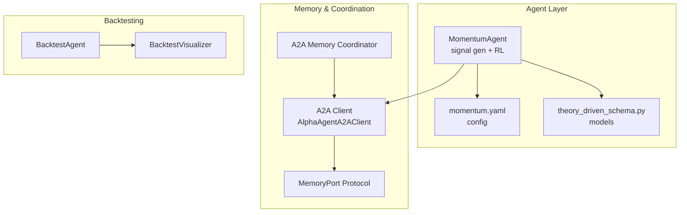
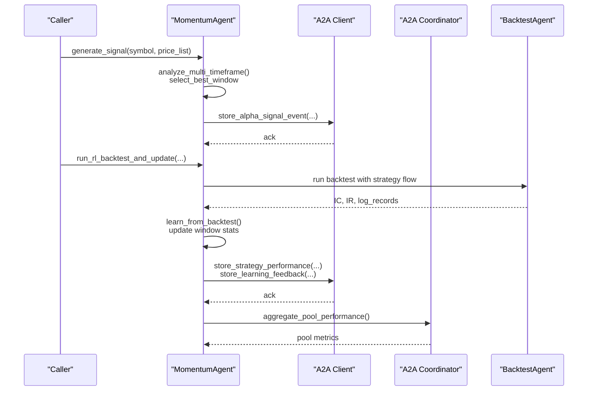
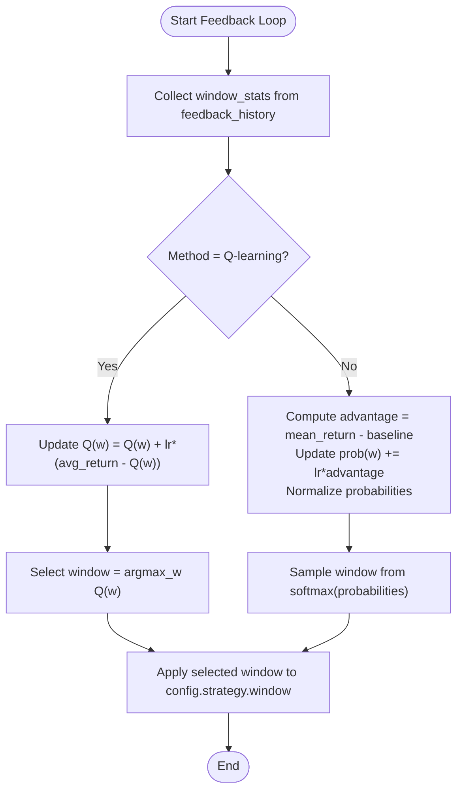
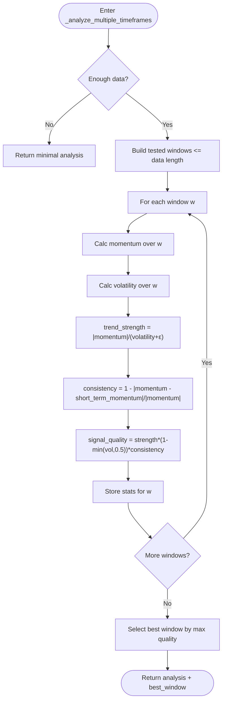
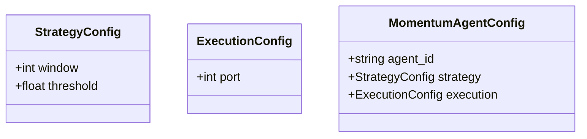
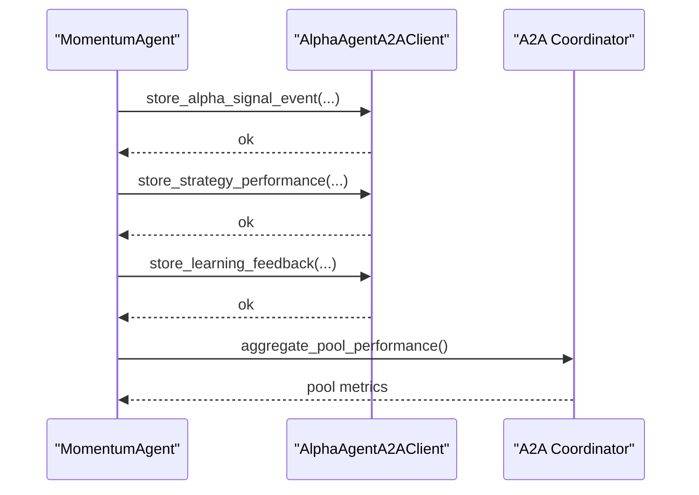
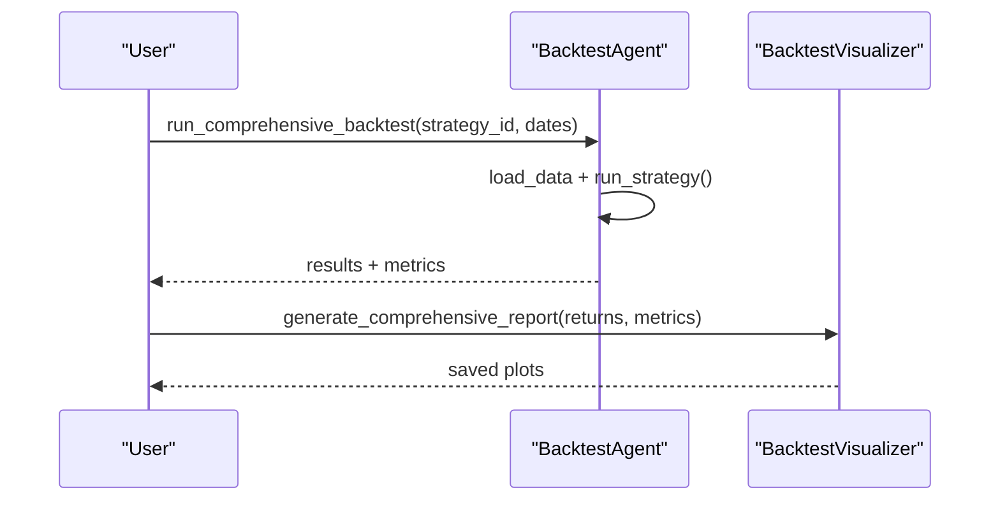
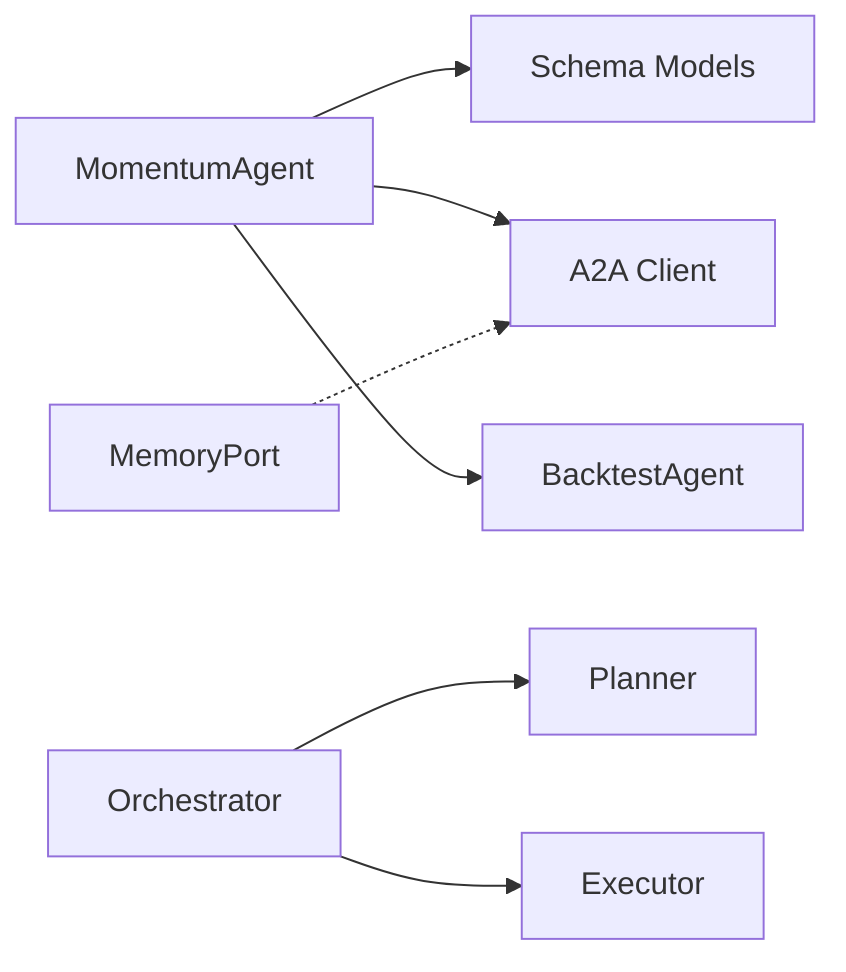

# Momentum Strategies

<cite>
**Referenced Files in This Document**
- [momentum_agent.py](file://FinAgents/agent_pools/alpha_agent_pool/agents/theory_driven/momentum_agent.py)
- [momentum.yaml](file://FinAgents/agent_pools/alpha_agent_pool/config/momentum.yaml)
- [theory_driven_schema.py](file://FinAgents/agent_pools/alpha_agent_pool/schema/theory_driven_schema.py)
- [models.py](file://FinAgents/agent_pools/alpha_agent_pool/core/domain/models.py)
- [memory.py](file://FinAgents/agent_pools/alpha_agent_pool/core/ports/memory.py)
- [orchestrator.py](file://FinAgents/agent_pools/alpha_agent_pool/core/services/orchestrator.py)
- [a2a_memory_coordinator.py](file://FinAgents/agent_pools/alpha_agent_pool/a2a_memory_coordinator.py)
- [alpha_memory_client.py](file://FinAgents/agent_pools/alpha_agent_pool/alpha_memory_client.py)
- [example_a2a_momentum_integration.py](file://examples/example_a2a_momentum_integration.py)
- [backtest_agent.py](file://FinAgents/agent_pools/backtest_agent/backtest_agent.py)
- [backtest_visualizer.py](file://FinAgents/agent_pools/backtest_agent/backtest_visualizer.py)
- [alpha_agent_pool.rst](file://docs/source/intro/alpha_agent_pool.rst)
</cite>

## Table of Contents
1. [Introduction](#introduction)
2. [Project Structure](#project-structure)
3. [Core Components](#core-components)
4. [Architecture Overview](#architecture-overview)
5. [Detailed Component Analysis](#detailed-component-analysis)
6. [Dependency Analysis](#dependency-analysis)
7. [Performance Considerations](#performance-considerations)
8. [Troubleshooting Guide](#troubleshooting-guide)
9. [Conclusion](#conclusion)
10. [Appendices](#appendices)

## Introduction
This document explains momentum-based signal generation strategies implemented in the repository. It covers:
- Mathematical foundations of momentum investing (trend-following, moving average mechanics, and time horizon optimization)
- Adaptive window selection using reinforcement learning (Q-learning and policy gradients)
- Multi-timeframe analysis for simultaneous evaluation across horizons
- Configuration parameters for windows, thresholds, and risk controls
- Integration with the A2A memory system for storing performance feedback and enabling cross-agent learning
- Backtesting workflows, performance metrics (Information Coefficient, Information Ratio, win rate), and automated strategy optimization

## Project Structure
The momentum strategy is implemented primarily within the theory-driven agent pool. Key areas:
- Agent implementation: momentum signal generation, adaptive window selection, and RL updates
- Configuration: YAML-based strategy and execution parameters
- Schema: typed models for strategy flows, decisions, and metadata
- Memory and coordination: A2A protocol integration for storing signals, performance, and learning feedback
- Backtesting: agent-backed backtesting and visualization utilities

**Diagram sources**
- [momentum_agent.py:77-1570](file://FinAgents/agent_pools/alpha_agent_pool/agents/theory_driven/momentum_agent.py#L77-L1570)
- [momentum.yaml:1-24](file://FinAgents/agent_pools/alpha_agent_pool/config/momentum.yaml#L1-L24)
- [theory_driven_schema.py:1-87](file://FinAgents/agent_pools/alpha_agent_pool/schema/theory_driven_schema.py#L1-L87)
- [a2a_memory_coordinator.py:38-345](file://FinAgents/agent_pools/alpha_agent_pool/a2a_memory_coordinator.py#L38-L345)
- [alpha_memory_client.py:18-257](file://FinAgents/agent_pools/alpha_agent_pool/alpha_memory_client.py#L18-L257)
- [backtest_agent.py:76-800](file://FinAgents/agent_pools/backtest_agent/backtest_agent.py#L76-L800)
- [backtest_visualizer.py:21-390](file://FinAgents/agent_pools/backtest_agent/backtest_visualizer.py#L21-L390)

**Section sources**
- [momentum_agent.py:77-1570](file://FinAgents/agent_pools/alpha_agent_pool/agents/theory_driven/momentum_agent.py#L77-L1570)
- [momentum.yaml:1-24](file://FinAgents/agent_pools/alpha_agent_pool/config/momentum.yaml#L1-L24)
- [theory_driven_schema.py:1-87](file://FinAgents/agent_pools/alpha_agent_pool/schema/theory_driven_schema.py#L1-L87)
- [a2a_memory_coordinator.py:38-345](file://FinAgents/agent_pools/alpha_agent_pool/a2a_memory_coordinator.py#L38-L345)
- [alpha_memory_client.py:18-257](file://FinAgents/agent_pools/alpha_agent_pool/alpha_memory_client.py#L18-L257)
- [backtest_agent.py:76-800](file://FinAgents/agent_pools/backtest_agent/backtest_agent.py#L76-L800)
- [backtest_visualizer.py:21-390](file://FinAgents/agent_pools/backtest_agent/backtest_visualizer.py#L21-L390)

## Core Components
- MomentumAgent: Generates signals using multi-timeframe momentum analysis, adapts window via RL, and integrates with A2A memory for feedback and storage.
- Configuration: YAML defines strategy window and threshold, execution port, and LLM enablement flag.
- Schema: Typed models define AlphaStrategyFlow, Decision, MarketContext, and configuration structures.
- A2A Integration: Clients and coordinator store signals, performance metrics, and learning feedback; support cross-agent insights and aggregation.
- BacktestAgent: Provides backtesting infrastructure and visualization; supports performance metrics computation and reporting.

**Section sources**
- [momentum_agent.py:77-1570](file://FinAgents/agent_pools/alpha_agent_pool/agents/theory_driven/momentum_agent.py#L77-L1570)
- [momentum.yaml:1-24](file://FinAgents/agent_pools/alpha_agent_pool/config/momentum.yaml#L1-L24)
- [theory_driven_schema.py:1-87](file://FinAgents/agent_pools/alpha_agent_pool/schema/theory_driven_schema.py#L1-L87)
- [a2a_memory_coordinator.py:38-345](file://FinAgents/agent_pools/alpha_agent_pool/a2a_memory_coordinator.py#L38-L345)
- [alpha_memory_client.py:18-257](file://FinAgents/agent_pools/alpha_agent_pool/alpha_memory_client.py#L18-L257)
- [backtest_agent.py:76-800](file://FinAgents/agent_pools/backtest_agent/backtest_agent.py#L76-L800)

## Architecture Overview
The momentum strategy architecture couples:
- Signal generation with multi-timeframe analysis and adaptive window selection
- Reinforcement learning updates (Q-learning and policy gradient) based on performance feedback
- A2A memory integration for persistent storage and cross-agent learning
- Backtesting pipeline for evaluating strategies and computing performance metrics

**Diagram sources**
- [momentum_agent.py:975-1246](file://FinAgents/agent_pools/alpha_agent_pool/agents/theory_driven/momentum_agent.py#L975-L1246)
- [a2a_memory_coordinator.py:154-196](file://FinAgents/agent_pools/alpha_agent_pool/a2a_memory_coordinator.py#L154-L196)
- [backtest_agent.py:346-456](file://FinAgents/agent_pools/backtest_agent/backtest_agent.py#L346-L456)

## Detailed Component Analysis

### Mathematical Foundations of Momentum Investing
- Trend-following mechanics: momentum captures directional persistence over a lookback window.
- Moving average calculations: simple price deltas over varying windows form the basis of momentum signals.
- Time horizon optimization: adaptive window selection balances responsiveness and reliability.

Implementation highlights:
- Momentum calculation with configurable window and volatility normalization.
- Multi-timeframe analysis scoring windows by trend strength, consistency, and risk-adjusted quality.

**Section sources**
- [momentum_agent.py:930-953](file://FinAgents/agent_pools/alpha_agent_pool/agents/theory_driven/momentum_agent.py#L930-L953)
- [momentum_agent.py:656-717](file://FinAgents/agent_pools/alpha_agent_pool/agents/theory_driven/momentum_agent.py#L656-L717)

### Adaptive Window Selection via Reinforcement Learning
The agent learns optimal lookback windows using two RL mechanisms:
- Q-learning: maintains Q-values per window; updates via observed returns; selects window with highest Q.
- Policy gradient: maintains a probability distribution over windows; updates via advantages; samples window probabilistically.

**Diagram sources**
- [momentum_agent.py:289-352](file://FinAgents/agent_pools/alpha_agent_pool/agents/theory_driven/momentum_agent.py#L289-L352)

**Section sources**
- [momentum_agent.py:289-352](file://FinAgents/agent_pools/alpha_agent_pool/agents/theory_driven/momentum_agent.py#L289-L352)
- [alpha_agent_pool.rst:66-83](file://docs/source/intro/alpha_agent_pool.rst#L66-L83)

### Multi-Timeframe Analysis
The agent evaluates multiple windows simultaneously and selects the best based on:
- Momentum magnitude
- Volatility proxy
- Trend strength (momentum/volatility)
- Consistency (agreement between long and short windows)
- Composite signal quality

**Diagram sources**
- [momentum_agent.py:656-717](file://FinAgents/agent_pools/alpha_agent_pool/agents/theory_driven/momentum_agent.py#L656-L717)

**Section sources**
- [momentum_agent.py:656-717](file://FinAgents/agent_pools/alpha_agent_pool/agents/theory_driven/momentum_agent.py#L656-L717)

### Configuration Parameters
- Strategy window: base lookback for momentum calculation
- Threshold: minimum momentum change to trigger signals
- Execution port: MCP server port
- LLM enablement: toggles LLM-enhanced analysis

**Diagram sources**
- [theory_driven_schema.py:58-87](file://FinAgents/agent_pools/alpha_agent_pool/schema/theory_driven_schema.py#L58-L87)
- [momentum.yaml:1-24](file://FinAgents/agent_pools/alpha_agent_pool/config/momentum.yaml#L1-L24)

**Section sources**
- [theory_driven_schema.py:58-87](file://FinAgents/agent_pools/alpha_agent_pool/schema/theory_driven_schema.py#L58-L87)
- [momentum.yaml:1-24](file://FinAgents/agent_pools/alpha_agent_pool/config/momentum.yaml#L1-L24)

### A2A Memory Integration
The agent stores and retrieves:
- Alpha signals with reasoning and market context
- Strategy performance metrics (IC, IR, win rate, counts)
- Learning feedback for window adaptation
- Cross-agent insights and pool-level aggregations

**Diagram sources**
- [momentum_agent.py:528-599](file://FinAgents/agent_pools/alpha_agent_pool/agents/theory_driven/momentum_agent.py#L528-L599)
- [a2a_memory_coordinator.py:154-196](file://FinAgents/agent_pools/alpha_agent_pool/a2a_memory_coordinator.py#L154-L196)
- [alpha_memory_client.py:117-161](file://FinAgents/agent_pools/alpha_agent_pool/alpha_memory_client.py#L117-L161)

**Section sources**
- [momentum_agent.py:528-599](file://FinAgents/agent_pools/alpha_agent_pool/agents/theory_driven/momentum_agent.py#L528-L599)
- [a2a_memory_coordinator.py:154-196](file://FinAgents/agent_pools/alpha_agent_pool/a2a_memory_coordinator.py#L154-L196)
- [alpha_memory_client.py:117-161](file://FinAgents/agent_pools/alpha_agent_pool/alpha_memory_client.py#L117-L161)
- [example_a2a_momentum_integration.py:42-174](file://examples/example_a2a_momentum_integration.py#L42-L174)

### Backtesting and Performance Metrics
Backtesting supports:
- Full lifecycle: data preparation, strategy flow generation, execution simulation, and metrics computation
- Metrics: IC, IR, win rate, Sharpe, Calmar, maximum drawdown, turnover, and more
- Visualization: P&L curves, drawdowns, distributions, and monthly returns

**Diagram sources**
- [backtest_agent.py:346-456](file://FinAgents/agent_pools/backtest_agent/backtest_agent.py#L346-L456)
- [backtest_visualizer.py:332-374](file://FinAgents/agent_pools/backtest_agent/backtest_visualizer.py#L332-L374)

**Section sources**
- [backtest_agent.py:346-456](file://FinAgents/agent_pools/backtest_agent/backtest_agent.py#L346-L456)
- [backtest_visualizer.py:332-374](file://FinAgents/agent_pools/backtest_agent/backtest_visualizer.py#L332-L374)

## Dependency Analysis
- MomentumAgent depends on:
  - Configuration models (StrategyConfig, ExecutionConfig)
  - A2A client for memory operations
  - BacktestAgent for RL backtests and performance evaluation
- Orchestrator coordinates task intake and execution
- MemoryPort defines the contract for memory operations

**Diagram sources**
- [momentum_agent.py:353-405](file://FinAgents/agent_pools/alpha_agent_pool/agents/theory_driven/momentum_agent.py#L353-L405)
- [orchestrator.py:13-66](file://FinAgents/agent_pools/alpha_agent_pool/core/services/orchestrator.py#L13-L66)
- [memory.py:6-18](file://FinAgents/agent_pools/alpha_agent_pool/core/ports/memory.py#L6-L18)

**Section sources**
- [momentum_agent.py:353-405](file://FinAgents/agent_pools/alpha_agent_pool/agents/theory_driven/momentum_agent.py#L353-L405)
- [orchestrator.py:13-66](file://FinAgents/agent_pools/alpha_agent_pool/core/services/orchestrator.py#L13-L66)
- [memory.py:6-18](file://FinAgents/agent_pools/alpha_agent_pool/core/ports/memory.py#L6-L18)

## Performance Considerations
- Multi-timeframe analysis improves robustness by validating signals across horizons.
- RL-based window adaptation reduces sensitivity to static parameters and improves out-of-sample performance.
- A2A memory enables persistent learning and cross-agent knowledge sharing.
- Backtesting with comprehensive metrics ensures reliable evaluation before deployment.

## Troubleshooting Guide
Common issues and resolutions:
- Missing A2A connectivity: verify memory URL and health checks; fall back to local storage when needed.
- Insufficient price data: agent returns conservative fallbacks and minimal thresholds.
- LLM unavailability: agent gracefully degrades to direct momentum analysis.
- Backtest failures: validate market data format and ensure required columns (timestamp/date, OHLCV).

**Section sources**
- [momentum_agent.py:619-637](file://FinAgents/agent_pools/alpha_agent_pool/agents/theory_driven/momentum_agent.py#L619-L637)
- [momentum_agent.py:854-928](file://FinAgents/agent_pools/alpha_agent_pool/agents/theory_driven/momentum_agent.py#L854-L928)
- [momentum_agent.py:1186-1246](file://FinAgents/agent_pools/alpha_agent_pool/agents/theory_driven/momentum_agent.py#L1186-L1246)

## Conclusion
The momentum strategy leverages multi-timeframe analysis, adaptive window selection via RL, and A2A memory integration to produce robust, data-driven signals. Backtesting and visualization provide comprehensive evaluation, while configuration and schema ensure consistency and extensibility.

## Appendices

### Configuration Reference
- Strategy window: lookback for momentum
- Threshold: minimum momentum change for signals
- Execution port: MCP server port
- LLM enablement: toggles LLM-enhanced analysis

**Section sources**
- [momentum.yaml:1-24](file://FinAgents/agent_pools/alpha_agent_pool/config/momentum.yaml#L1-L24)
- [theory_driven_schema.py:58-87](file://FinAgents/agent_pools/alpha_agent_pool/schema/theory_driven_schema.py#L58-L87)

### Example Workflows
- A2A integration demo: registers agent, stores signals/performance, retrieves insights, aggregates pool metrics.
- Momentum agent workflow simulation: stores multiple signals, backtest results, and learning feedback.

**Section sources**
- [example_a2a_momentum_integration.py:42-174](file://examples/example_a2a_momentum_integration.py#L42-L174)
- [example_a2a_momentum_integration.py:211-281](file://examples/example_a2a_momentum_integration.py#L211-L281)