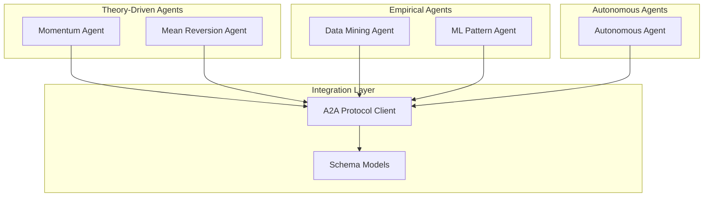
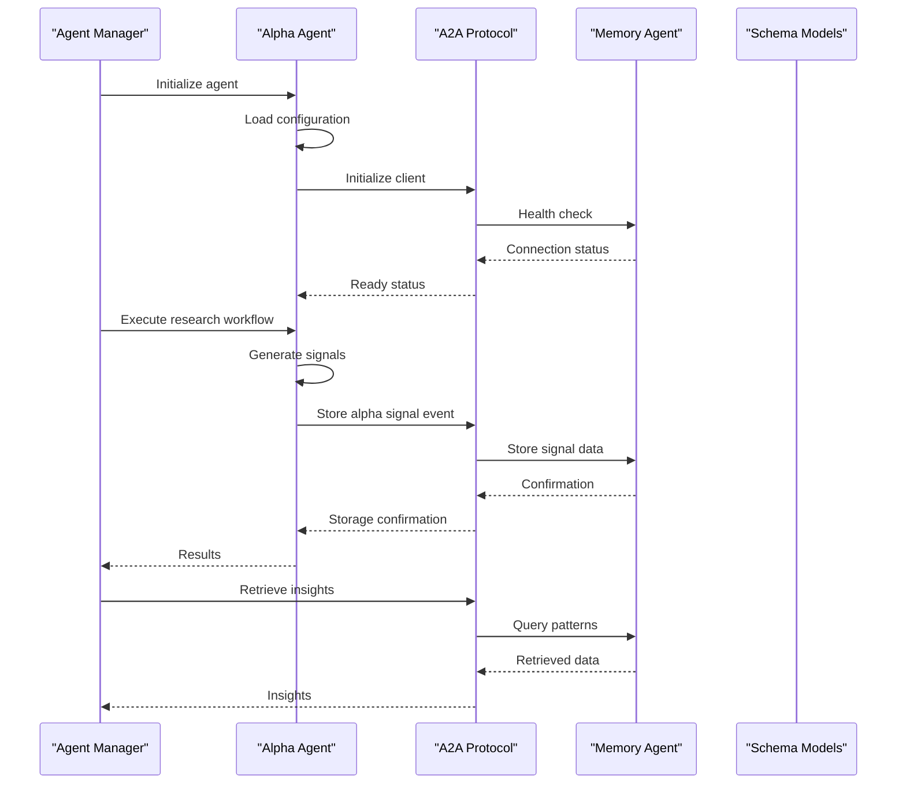
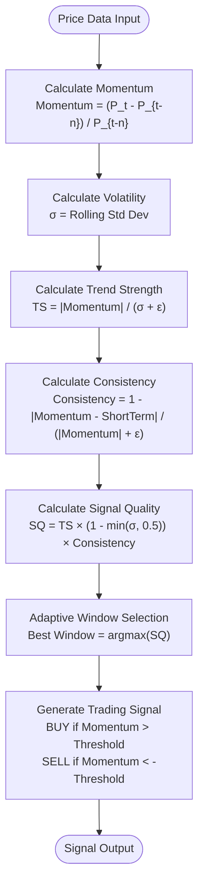
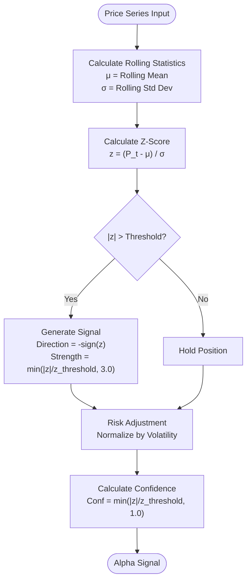
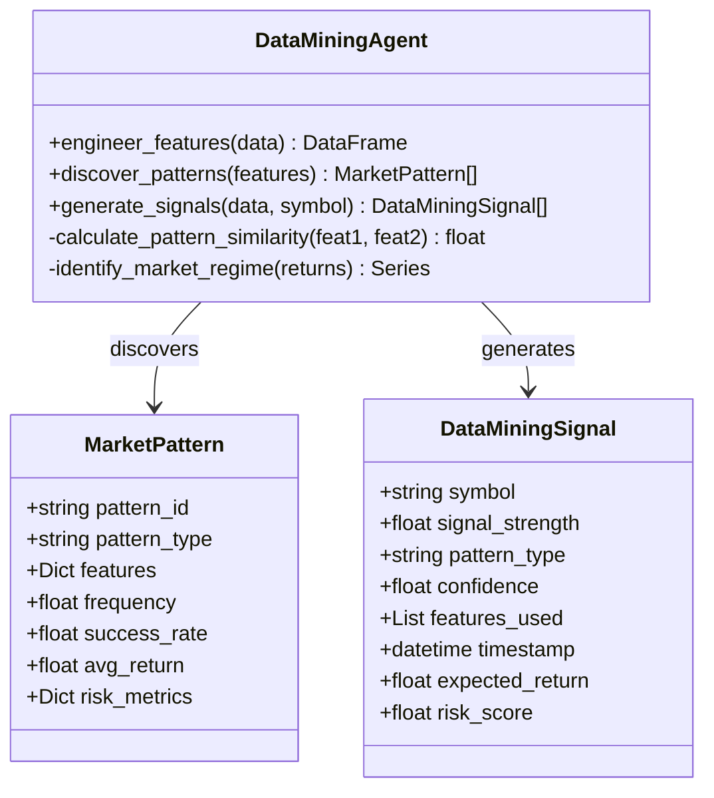
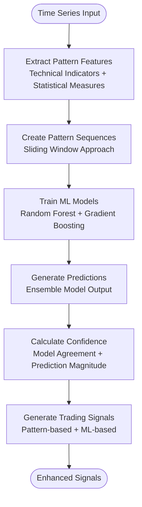
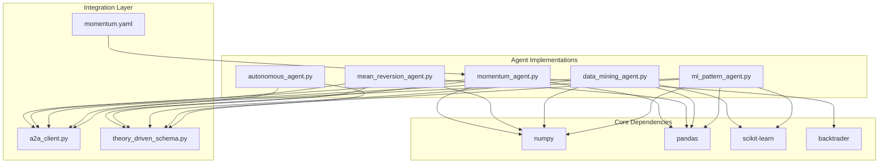

# Signal Generation Strategies

<cite>
**Referenced Files in This Document**
- [momentum_agent.py](file://FinAgents/agent_pools/alpha_agent_pool/agents/theory_driven/momentum_agent.py)
- [mean_reversion_agent.py](file://FinAgents/agent_pools/alpha_agent_pool/agents/theory_driven/mean_reversion_agent.py)
- [data_mining_agent.py](file://FinAgents/agent_pools/alpha_agent_pool/agents/empirical/data_mining_agent.py)
- [ml_pattern_agent.py](file://FinAgents/agent_pools/alpha_agent_pool/agents/empirical/ml_pattern_agent.py)
- [momentum.yaml](file://FinAgents/agent_pools/alpha_agent_pool/config/momentum.yaml)
- [theory_driven_schema.py](file://FinAgents/agent_pools/alpha_agent_pool/schema/theory_driven_schema.py)
- [a2a_client.py](file://FinAgents/agent_pools/alpha_agent_pool/agents/theory_driven/a2a_client.py)
- [agent_manager.py](file://FinAgents/agent_pools/alpha_agent_pool/agents/agent_manager.py)
- [autonomous_agent.py](file://FinAgents/agent_pools/alpha_agent_pool/agents/autonomous/autonomous_agent.py)
- [autonomous_strategy_flow.json](file://FinAgents/agent_pools/alpha_agent_pool/agents/autonomous/workspace/autonomous_strategy_flow.json)
</cite>

## Table of Contents
1. [Introduction](#introduction)
2. [Project Structure](#project-structure)
3. [Core Components](#core-components)
4. [Architecture Overview](#architecture-overview)
5. [Detailed Component Analysis](#detailed-component-analysis)
6. [Dependency Analysis](#dependency-analysis)
7. [Performance Considerations](#performance-considerations)
8. [Troubleshooting Guide](#troubleshooting-guide)
9. [Conclusion](#conclusion)

## Introduction
This document provides a comprehensive guide to the signal generation strategies implemented in the alpha agent pool, focusing on three primary approaches:
- Momentum-based strategies: trend-following systems using price momentum and multi-timeframe analysis
- Mean-reversion algorithms: statistical arbitrage based on deviations from historical averages
- Empirical data mining techniques: machine learning and pattern recognition for alpha discovery

Each strategy type includes mathematical foundations, implementation patterns, performance characteristics, configuration parameters, risk controls, and integration patterns with the broader alpha agent ecosystem.

## Project Structure
The alpha agent pool organizes signal generation strategies across three categories:
- Theory-driven agents: Momentum and mean reversion agents implementing academic factor models
- Empirical agents: Data mining and ML pattern recognition agents for statistical arbitrage
- Autonomous agents: Self-directed agents generating strategy flows compatible with the ecosystem

**Diagram sources**
- [agent_manager.py:35-156](file://FinAgents/agent_pools/alpha_agent_pool/agents/agent_manager.py#L35-L156)
- [a2a_client.py:60-100](file://FinAgents/agent_pools/alpha_agent_pool/agents/theory_driven/a2a_client.py#L60-L100)

**Section sources**
- [agent_manager.py:35-156](file://FinAgents/agent_pools/alpha_agent_pool/agents/agent_manager.py#L35-L156)

## Core Components
The alpha agent pool implements three distinct signal generation strategies, each with specialized configurations and integration patterns:

### Momentum-Based Strategy
The momentum agent implements trend-following systems using price momentum calculations, multi-timeframe analysis, and reinforcement learning adaptations. It supports both rule-based momentum signals and RL-enhanced window selection.

Key components:
- Multi-timeframe momentum analysis with adaptive window selection
- Reinforcement learning updates for optimal lookback periods
- Backtesting integration with performance metrics (IC, IR, win rate)
- A2A protocol integration for memory coordination

### Mean-Reversion Strategy  
The mean reversion agent implements statistical arbitrage based on price deviations from historical averages. It uses z-score calculations, statistical validation, and risk-adjusted position sizing.

Key components:
- Rolling z-score calculations for deviation detection
- Statistical significance testing (IC, t-statistics)
- Transaction cost integration and position sizing
- Backtesting with comprehensive performance metrics

### Empirical Data Mining Strategy
The data mining agents employ machine learning techniques for pattern recognition and alpha discovery:
- Data Mining Agent: Feature engineering, clustering, and ML-based prediction
- ML Pattern Agent: Advanced pattern recognition using ensemble methods

Key components:
- Comprehensive feature engineering from OHLCV data
- Statistical pattern clustering and similarity analysis
- Machine learning models for return prediction
- Pattern template matching and ensemble learning

**Section sources**
- [momentum_agent.py:77-405](file://FinAgents/agent_pools/alpha_agent_pool/agents/theory_driven/momentum_agent.py#L77-L405)
- [mean_reversion_agent.py:58-168](file://FinAgents/agent_pools/alpha_agent_pool/agents/theory_driven/mean_reversion_agent.py#L58-L168)
- [data_mining_agent.py:58-138](file://FinAgents/agent_pools/alpha_agent_pool/agents/empirical/data_mining_agent.py#L58-L138)
- [ml_pattern_agent.py:56-134](file://FinAgents/agent_pools/alpha_agent_pool/agents/empirical/ml_pattern_agent.py#L56-L134)

## Architecture Overview
The alpha agent pool follows a modular architecture with standardized integration patterns:

**Diagram sources**
- [agent_manager.py:162-309](file://FinAgents/agent_pools/alpha_agent_pool/agents/agent_manager.py#L162-L309)
- [a2a_client.py:207-317](file://FinAgents/agent_pools/alpha_agent_pool/agents/theory_driven/a2a_client.py#L207-L317)

The architecture emphasizes:
- Loose coupling through A2A protocol
- Standardized schema models for data interchange
- Memory integration for pattern storage and retrieval
- Modular agent composition for ensemble strategies

**Section sources**
- [a2a_client.py:60-100](file://FinAgents/agent_pools/alpha_agent_pool/agents/theory_driven/a2a_client.py#L60-L100)
- [theory_driven_schema.py:47-87](file://FinAgents/agent_pools/alpha_agent_pool/schema/theory_driven_schema.py#L47-L87)

## Detailed Component Analysis

### Momentum-Based Strategy Analysis

#### Mathematical Foundations
The momentum strategy implements several key mathematical components:

**Diagram sources**
- [momentum_agent.py:656-717](file://FinAgents/agent_pools/alpha_agent_pool/agents/theory_driven/momentum_agent.py#L656-L717)

Implementation patterns include:
- Multi-timeframe analysis with adaptive window selection
- Trend strength calculation combining momentum and volatility
- Signal quality scoring incorporating consistency measures
- Reinforcement learning integration for optimal parameter adaptation

#### Configuration Parameters
The momentum agent configuration supports:
- Window length for momentum calculation (default: 5 periods)
- Threshold for momentum signal generation (default: 0.01)
- Execution port configuration for MCP server
- LLM integration toggle for enhanced analysis

**Section sources**
- [momentum.yaml:5-24](file://FinAgents/agent_pools/alpha_agent_pool/config/momentum.yaml#L5-L24)
- [momentum_agent.py:375-379](file://FinAgents/agent_pools/alpha_agent_pool/agents/theory_driven/momentum_agent.py#L375-L379)

#### Performance Characteristics
The momentum strategy demonstrates:
- Adaptive window selection based on historical performance
- Reinforcement learning updates for parameter optimization
- Backtesting integration with comprehensive metrics (IC, IR, win rate)
- Multi-timeframe convergence analysis for improved signal reliability

### Mean-Reversion Strategy Analysis

#### Mathematical Foundations
The mean reversion strategy implements z-score based statistical arbitrage:

**Diagram sources**
- [mean_reversion_agent.py:196-231](file://FinAgents/agent_pools/alpha_agent_pool/agents/theory_driven/mean_reversion_agent.py#L196-L231)

Implementation patterns include:
- Rolling z-score calculations for deviation detection
- Statistical significance testing using rank correlation
- Transaction cost integration for realistic performance assessment
- Position sizing based on volatility adjustments

#### Configuration Parameters
The mean reversion agent supports:
- Lookback window for rolling statistics (default: 20 periods)
- Z-score threshold for signal activation (default: 2.0)
- Holding horizon for backtesting (default: 5 periods)
- Transaction cost assumptions (default: 0.001)
- Data source selection (polygon, yfinance)

**Section sources**
- [mean_reversion_agent.py:686-696](file://FinAgents/agent_pools/alpha_agent_pool/agents/theory_driven/mean_reversion_agent.py#L686-L696)

#### Performance Characteristics
The mean reversion strategy provides:
- Statistical validation through information coefficient (IC) calculations
- Sharpe ratio optimization for risk-adjusted returns
- Walk-forward validation to prevent overfitting
- Comprehensive backtest metrics including win rates and turnover analysis

### Empirical Data Mining Strategy Analysis

#### Mathematical Foundations
The data mining strategy employs machine learning and statistical methods:

**Diagram sources**
- [data_mining_agent.py:34-98](file://FinAgents/agent_pools/alpha_agent_pool/agents/empirical/data_mining_agent.py#L34-L98)

Implementation patterns include:
- Comprehensive feature engineering from OHLCV data
- Statistical pattern clustering using K-means
- Machine learning models for return prediction
- Similarity-based pattern matching and ranking

#### Configuration Parameters
The data mining agent configuration includes:
- Lookback window for pattern discovery (default: 50 periods)
- Number of pattern clusters (default: 5)
- Minimum confidence threshold (default: 0.6)
- Feature selection parameters for customization

**Section sources**
- [data_mining_agent.py:69-98](file://FinAgents/agent_pools/alpha_agent_pool/agents/empirical/data_mining_agent.py#L69-L98)

#### Performance Characteristics
The empirical data mining strategy offers:
- Pattern-based signal generation with confidence scoring
- Machine learning prediction integration
- Statistical significance testing for discovered patterns
- Risk metrics calculation for pattern evaluation

### ML Pattern Recognition Strategy Analysis

#### Mathematical Foundations
The ML pattern agent implements advanced pattern recognition:

**Diagram sources**
- [ml_pattern_agent.py:266-297](file://FinAgents/agent_pools/alpha_agent_pool/agents/empirical/ml_pattern_agent.py#L266-L297)

Implementation patterns include:
- Time series pattern sequence creation
- Ensemble learning with Random Forest and Gradient Boosting
- Feature importance analysis for pattern understanding
- Statistical pattern recognition as fallback

#### Configuration Parameters
The ML pattern agent configuration supports:
- Sequence length for pattern recognition (default: 30)
- Confidence threshold for signal generation (default: 0.7)
- Number of ensemble estimators (default: 100)
- Pattern template definitions for customization

**Section sources**
- [ml_pattern_agent.py:68-94](file://FinAgents/agent_pools/alpha_agent_pool/agents/empirical/ml_pattern_agent.py#L68-L94)

#### Performance Characteristics
The ML pattern recognition strategy provides:
- Ensemble model agreement for confidence estimation
- Pattern template matching for enhanced signal generation
- Feature importance analysis for interpretability
- Statistical pattern validation as fallback mechanism

## Dependency Analysis

**Diagram sources**
- [momentum_agent.py:8-35](file://FinAgents/agent_pools/alpha_agent_pool/agents/theory_driven/momentum_agent.py#L8-L35)
- [mean_reversion_agent.py:69-76](file://FinAgents/agent_pools/alpha_agent_pool/agents/theory_driven/mean_reversion_agent.py#L69-L76)
- [data_mining_agent.py:16-26](file://FinAgents/agent_pools/alpha_agent_pool/agents/empirical/data_mining_agent.py#L16-L26)
- [ml_pattern_agent.py:16-29](file://FinAgents/agent_pools/alpha_agent_pool/agents/empirical/ml_pattern_agent.py#L16-L29)

The dependency analysis reveals:
- Heavy reliance on scientific computing libraries (numpy, pandas)
- Machine learning integration for pattern recognition
- Backtesting framework for performance validation
- A2A protocol for memory integration
- Schema validation for data consistency

**Section sources**
- [momentum_agent.py:8-35](file://FinAgents/agent_pools/alpha_agent_pool/agents/theory_driven/momentum_agent.py#L8-L35)
- [mean_reversion_agent.py:69-76](file://FinAgents/agent_pools/alpha_agent_pool/agents/theory_driven/mean_reversion_agent.py#L69-L76)
- [data_mining_agent.py:16-26](file://FinAgents/agent_pools/alpha_agent_pool/agents/empirical/data_mining_agent.py#L16-L26)
- [ml_pattern_agent.py:16-29](file://FinAgents/agent_pools/alpha_agent_pool/agents/empirical/ml_pattern_agent.py#L16-L29)

## Performance Considerations
The alpha agent pool implements several performance optimization strategies:

### Memory Integration Patterns
The A2A protocol provides efficient memory coordination:
- Asynchronous communication for non-blocking operations
- Fallback HTTP communication for development environments
- Connection pooling and retry mechanisms
- Health check monitoring for system reliability

### Signal Generation Optimization
Performance characteristics across strategies:
- **Momentum**: Adaptive window selection reduces computational overhead
- **Mean Reversion**: Rolling calculations optimized for streaming data
- **Empirical**: Machine learning models trained once, applied repeatedly
- **Autonomous**: Persistent workspace for task continuity and state management

### Risk Controls Implementation
Each strategy incorporates built-in risk controls:
- **Momentum**: Volatility-adjusted signal quality scoring
- **Mean Reversion**: Statistical significance testing and position sizing
- **Empirical**: Confidence threshold filtering and pattern validation
- **Autonomous**: Risk estimate integration in strategy flows

## Troubleshooting Guide

### Common Issues and Solutions

#### A2A Protocol Connectivity
**Issue**: Memory agent connection failures
**Solution**: Verify memory agent base URL configuration and health check endpoints

#### Configuration Validation
**Issue**: Schema validation errors in strategy flows
**Solution**: Ensure all required fields are populated and data types match schema definitions

#### Performance Degradation
**Issue**: Slow signal generation or memory operations
**Solution**: Monitor agent health status and optimize configuration parameters

#### Integration Testing
**Issue**: Agent initialization failures
**Solution**: Check dependency availability and configuration file accessibility

**Section sources**
- [a2a_client.py:116-151](file://FinAgents/agent_pools/alpha_agent_pool/agents/theory_driven/a2a_client.py#L116-L151)
- [agent_manager.py:69-160](file://FinAgents/agent_pools/alpha_agent_pool/agents/agent_manager.py#L69-L160)

## Conclusion
The alpha agent pool provides a comprehensive framework for signal generation strategies through three distinct approaches:

1. **Momentum-based strategies** offer robust trend-following capabilities with adaptive parameter optimization and multi-timeframe analysis
2. **Mean-reversion algorithms** provide statistical arbitrage opportunities through validated z-score analysis and risk-adjusted position sizing
3. **Empirical data mining techniques** enable machine learning-driven alpha discovery through pattern recognition and ensemble methods

The modular architecture ensures loose coupling, standardized integration through the A2A protocol, and seamless collaboration between different strategy types. Each approach includes comprehensive performance validation, risk controls, and integration patterns that support both individual agent deployment and ensemble strategy construction.

The ecosystem's design facilitates continuous improvement through memory integration, performance feedback loops, and automated adaptation mechanisms, positioning it for sustained alpha generation across diverse market conditions.