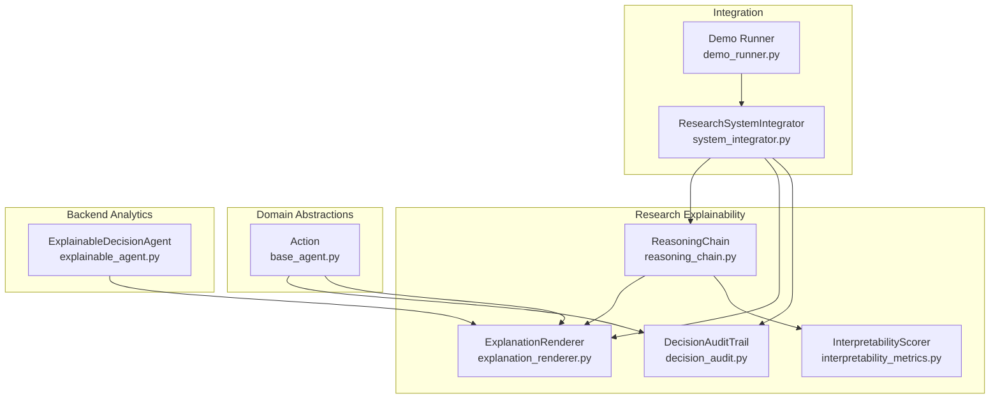
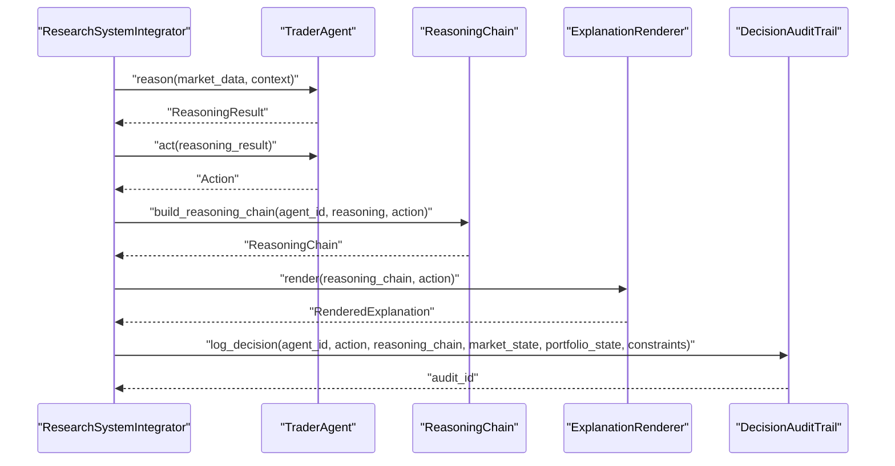
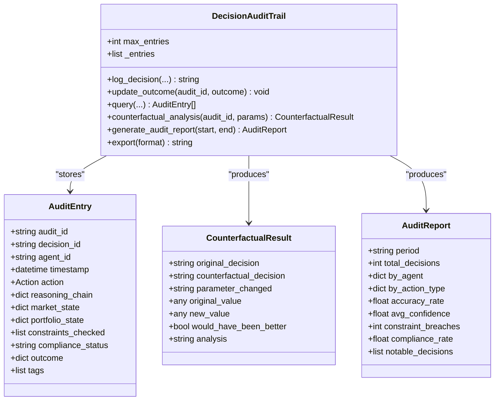
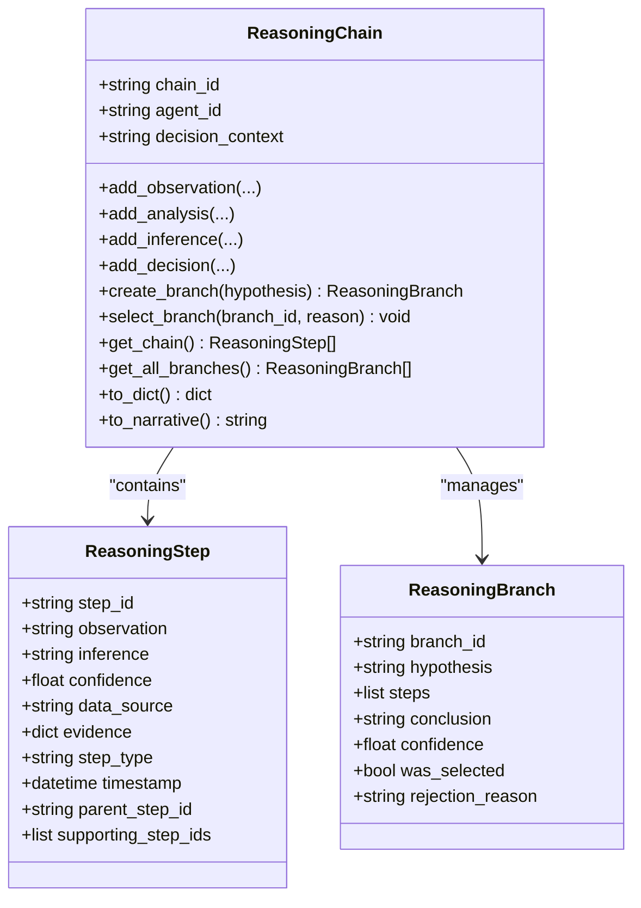
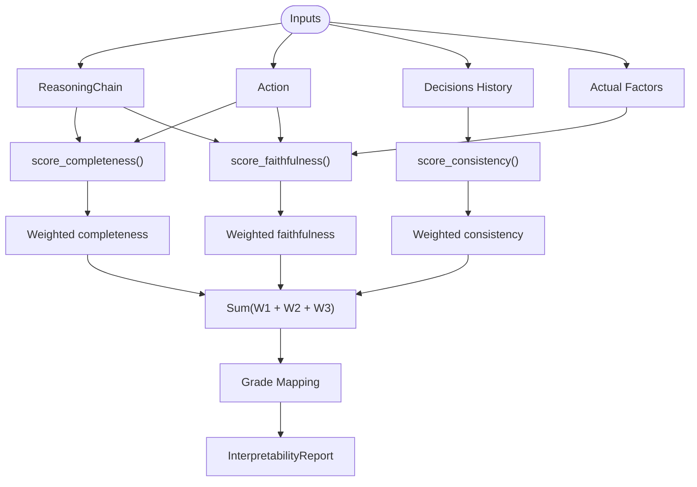
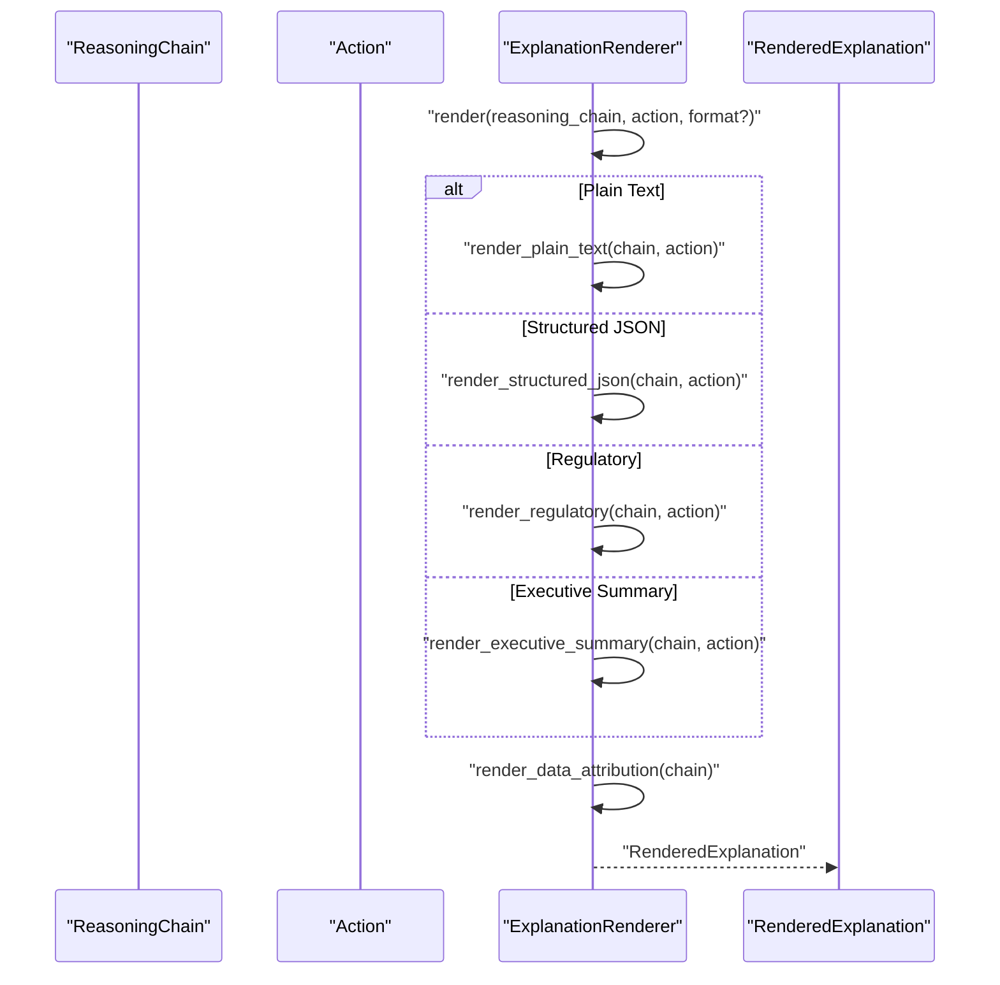
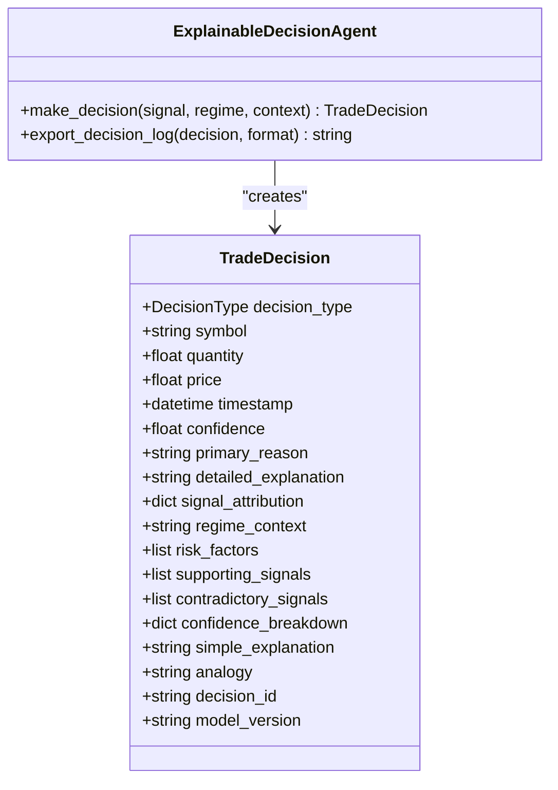
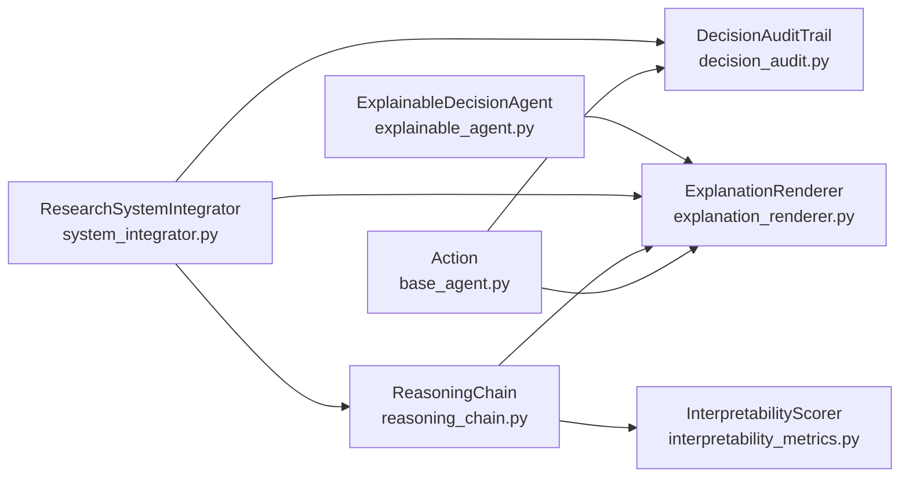

# Analytics Explainability

<cite>
**Referenced Files in This Document**
- [decision_audit.py](file://FinAgents/research/explainability/decision_audit.py)
- [reasoning_chain.py](file://FinAgents/research/explainability/reasoning_chain.py)
- [interpretability_metrics.py](file://FinAgents/research/explainability/interpretability_metrics.py)
- [explanation_renderer.py](file://FinAgents/research/explainability/explanation_renderer.py)
- [__init__.py](file://FinAgents/research/explainability/__init__.py)
- [base_agent.py](file://FinAgents/research/domain_agents/base_agent.py)
- [system_integrator.py](file://FinAgents/research/integration/system_integrator.py)
- [demo_runner.py](file://FinAgents/research/integration/demo_runner.py)
- [explainable_agent.py](file://backend/analytics/explainable_agent.py)
- [research_report.py](file://FinAgents/research/integration/research_report.py)
</cite>

## Table of Contents
1. [Introduction](#introduction)
2. [Project Structure](#project-structure)
3. [Core Components](#core-components)
4. [Architecture Overview](#architecture-overview)
5. [Detailed Component Analysis](#detailed-component-analysis)
6. [Dependency Analysis](#dependency-analysis)
7. [Performance Considerations](#performance-considerations)
8. [Troubleshooting Guide](#troubleshooting-guide)
9. [Conclusion](#conclusion)
10. [Appendices](#appendices)

## Introduction
This document explains the analytics explainability subsystem focused on decision audit, reasoning chain analysis, and interpretability metrics. It covers how algorithmic trading decisions are tracked, how reasoning processes are reconstructed, and how model transparency is measured. It also documents the explanation renderer that produces human-readable explanations tailored for traders, risk managers, compliance officers, and executives. Practical examples demonstrate auditing trading decisions, reconstructing reasoning chains, computing interpretability scores, and rendering explanations. Finally, it outlines best practices for explainability, decision traceability, and integration with the broader analytics framework.

## Project Structure
The explainability subsystem is organized around four core modules:
- Decision audit: persistent and queryable records of decisions with outcomes and constraints.
- Reasoning chain: structured, optionally branched, stepwise logic for decisions.
- Interpretability metrics: quantitative scoring for completeness, consistency, and faithfulness.
- Explanation renderer: multi-format rendering of explanations for diverse stakeholders.

**Diagram sources**
- [reasoning_chain.py:100-390](file://FinAgents/research/explainability/reasoning_chain.py#L100-L390)
- [explanation_renderer.py:73-378](file://FinAgents/research/explainability/explanation_renderer.py#L73-L378)
- [decision_audit.py:104-391](file://FinAgents/research/explainability/decision_audit.py#L104-L391)
- [interpretability_metrics.py:58-349](file://FinAgents/research/explainability/interpretability_metrics.py#L58-L349)
- [base_agent.py:100-116](file://FinAgents/research/domain_agents/base_agent.py#L100-L116)
- [system_integrator.py:204-222](file://FinAgents/research/integration/system_integrator.py#L204-L222)
- [demo_runner.py:14-88](file://FinAgents/research/integration/demo_runner.py#L14-L88)
- [explainable_agent.py:475-735](file://backend/analytics/explainable_agent.py#L475-L735)

**Section sources**
- [__init__.py:1-62](file://FinAgents/research/explainability/__init__.py#L1-L62)
- [system_integrator.py:94-222](file://FinAgents/research/integration/system_integrator.py#L94-L222)

## Core Components
- DecisionAuditTrail: in-memory audit log for trading decisions with querying, counterfactual analysis, and reporting.
- ReasoningChain: structured, optionally branched chain of reasoning steps with serialization and narrative rendering.
- InterpretabilityScorer: quantitative metrics for completeness, consistency, and faithfulness; produces an overall interpretability report.
- ExplanationRenderer: renders explanations in multiple formats (plain text, structured JSON, regulatory, executive summary) with data attribution.

These components are exported via the package’s public API and integrated into the research system.

**Section sources**
- [decision_audit.py:104-391](file://FinAgents/research/explainability/decision_audit.py#L104-L391)
- [reasoning_chain.py:100-390](file://FinAgents/research/explainability/reasoning_chain.py#L100-L390)
- [interpretability_metrics.py:58-349](file://FinAgents/research/explainability/interpretability_metrics.py#L58-L349)
- [explanation_renderer.py:73-378](file://FinAgents/research/explainability/explanation_renderer.py#L73-L378)
- [__init__.py:36-61](file://FinAgents/research/explainability/__init__.py#L36-L61)

## Architecture Overview
The explainability pipeline integrates reasoning, auditing, and rendering across the research system and backend analytics.

**Diagram sources**
- [system_integrator.py:204-222](file://FinAgents/research/integration/system_integrator.py#L204-L222)
- [reasoning_chain.py:100-390](file://FinAgents/research/explainability/reasoning_chain.py#L100-L390)
- [explanation_renderer.py:87-138](file://FinAgents/research/explainability/explanation_renderer.py#L87-L138)
- [decision_audit.py:119-152](file://FinAgents/research/explainability/decision_audit.py#L119-L152)

## Detailed Component Analysis

### Decision Audit Trail
The DecisionAuditTrail maintains a bounded in-memory log of decisions with rich context and outcomes. It supports:
- Logging new decisions with reasoning chain, market and portfolio state, and constraints checked.
- Attaching realized outcomes after execution.
- Querying decisions by agent, symbol, time window, action type, and outcome polarity.
- Counterfactual analysis for constraints (e.g., position size thresholds).
- Aggregated audit reports with accuracy, confidence, compliance, and notable decisions.

**Diagram sources**
- [decision_audit.py:26-101](file://FinAgents/research/explainability/decision_audit.py#L26-L101)
- [decision_audit.py:104-391](file://FinAgents/research/explainability/decision_audit.py#L104-L391)

**Section sources**
- [decision_audit.py:119-152](file://FinAgents/research/explainability/decision_audit.py#L119-L152)
- [decision_audit.py:166-225](file://FinAgents/research/explainability/decision_audit.py#L166-L225)
- [decision_audit.py:226-295](file://FinAgents/research/explainability/decision_audit.py#L226-L295)
- [decision_audit.py:296-366](file://FinAgents/research/explainability/decision_audit.py#L296-L366)
- [decision_audit.py:371-391](file://FinAgents/research/explainability/decision_audit.py#L371-L391)

### Reasoning Chain Reconstruction
The ReasoningChain class models the stepwise thought process behind a decision, including optional alternative branches. It supports:
- Adding observations, analyses, inferences, and final decisions.
- Creating and selecting alternative branches for counterfactual reasoning.
- Serializing to dictionary and generating a human-readable narrative.

**Diagram sources**
- [reasoning_chain.py:22-65](file://FinAgents/research/explainability/reasoning_chain.py#L22-L65)
- [reasoning_chain.py:67-98](file://FinAgents/research/explainability/reasoning_chain.py#L67-L98)
- [reasoning_chain.py:100-390](file://FinAgents/research/explainability/reasoning_chain.py#L100-L390)

**Section sources**
- [reasoning_chain.py:124-254](file://FinAgents/research/explainability/reasoning_chain.py#L124-L254)
- [reasoning_chain.py:259-300](file://FinAgents/research/explainability/reasoning_chain.py#L259-L300)
- [reasoning_chain.py:304-355](file://FinAgents/research/explainability/reasoning_chain.py#L304-L355)
- [reasoning_chain.py:357-390](file://FinAgents/research/explainability/reasoning_chain.py#L357-L390)

### Interpretability Metrics
The InterpretabilityScorer computes quantitative interpretability scores:
- Completeness: required and optional reasoning factors coverage.
- Consistency: variance of actions across similar market conditions.
- Faithfulness: overlap between explanation content and actual decision factors.
- Overall interpretability report with grade and recommendations.

**Diagram sources**
- [interpretability_metrics.py:58-349](file://FinAgents/research/explainability/interpretability_metrics.py#L58-L349)

**Section sources**
- [interpretability_metrics.py:67-140](file://FinAgents/research/explainability/interpretability_metrics.py#L67-L140)
- [interpretability_metrics.py:145-205](file://FinAgents/research/explainability/interpretability_metrics.py#L145-L205)
- [interpretability_metrics.py:210-249](file://FinAgents/research/explainability/interpretability_metrics.py#L210-L249)
- [interpretability_metrics.py:254-328](file://FinAgents/research/explainability/interpretability_metrics.py#L254-L328)

### Explanation Renderer
The ExplanationRenderer transforms a reasoning chain and action into human-readable explanations in multiple formats:
- Plain text: detailed narrative with observations, analysis, inference, decision, risk justification, data sources, and alternatives.
- Structured JSON: machine-readable dictionary of action and reasoning chain.
- Regulatory: formal, conservative explanation for compliance.
- Executive summary: concise 2–3 sentence summary.

It also computes data attribution and attaches metadata.

**Diagram sources**
- [explanation_renderer.py:87-138](file://FinAgents/research/explainability/explanation_renderer.py#L87-L138)
- [explanation_renderer.py:175-246](file://FinAgents/research/explainability/explanation_renderer.py#L175-L246)
- [explanation_renderer.py:248-258](file://FinAgents/research/explainability/explanation_renderer.py#L248-L258)
- [explanation_renderer.py:260-314](file://FinAgents/research/explainability/explanation_renderer.py#L260-L314)
- [explanation_renderer.py:316-338](file://FinAgents/research/explainability/explanation_renderer.py#L316-L338)
- [explanation_renderer.py:343-378](file://FinAgents/research/explainability/explanation_renderer.py#L343-L378)

**Section sources**
- [explanation_renderer.py:175-246](file://FinAgents/research/explainability/explanation_renderer.py#L175-L246)
- [explanation_renderer.py:248-258](file://FinAgents/research/explainability/explanation_renderer.py#L248-L258)
- [explanation_renderer.py:260-314](file://FinAgents/research/explainability/explanation_renderer.py#L260-L314)
- [explanation_renderer.py:316-338](file://FinAgents/research/explainability/explanation_renderer.py#L316-L338)
- [explanation_renderer.py:343-378](file://FinAgents/research/explainability/explanation_renderer.py#L343-L378)

### Backend Analytics Integration
The backend analytics module provides an explainable decision agent that generates:
- Trade decisions with detailed explanations, signal attribution, risk factors, confidence breakdown, and beginner-friendly analogies.
- Export capabilities in JSON and text formats.
- Integration with market signals and regime detection.

**Diagram sources**
- [explainable_agent.py:71-125](file://backend/analytics/explainable_agent.py#L71-L125)
- [explainable_agent.py:475-735](file://backend/analytics/explainable_agent.py#L475-L735)

**Section sources**
- [explainable_agent.py:499-576](file://backend/analytics/explainable_agent.py#L499-L576)
- [explainable_agent.py:651-729](file://backend/analytics/explainable_agent.py#L651-L729)

## Dependency Analysis
The explainability modules depend on shared domain abstractions (Action, ReasoningResult) and are integrated by the research system integrator. The backend analytics module complements the research explainability with a production-focused decision agent.

**Diagram sources**
- [base_agent.py:100-116](file://FinAgents/research/domain_agents/base_agent.py#L100-L116)
- [decision_audit.py:104-391](file://FinAgents/research/explainability/decision_audit.py#L104-L391)
- [explanation_renderer.py:73-378](file://FinAgents/research/explainability/explanation_renderer.py#L73-L378)
- [reasoning_chain.py:100-390](file://FinAgents/research/explainability/reasoning_chain.py#L100-L390)
- [interpretability_metrics.py:58-349](file://FinAgents/research/explainability/interpretability_metrics.py#L58-L349)
- [system_integrator.py:204-222](file://FinAgents/research/integration/system_integrator.py#L204-L222)
- [explainable_agent.py:475-735](file://backend/analytics/explainable_agent.py#L475-L735)

**Section sources**
- [__init__.py:8-34](file://FinAgents/research/explainability/__init__.py#L8-L34)
- [system_integrator.py:94-222](file://FinAgents/research/integration/system_integrator.py#L94-L222)

## Performance Considerations
- DecisionAuditTrail uses an in-memory bounded list; ensure max_entries fits workload and memory constraints. Exporting to JSON serializes timestamps and actions; consider streaming or chunked exports for large datasets.
- ReasoningChain stores steps and optional branches; keep branches minimal to reduce serialization overhead.
- InterpretabilityScorer performs statistical computations (variance) and text searches; tune grouping criteria and keyword heuristics for performance.
- ExplanationRenderer constructs plain-text narratives and JSON structures; precompute confidence proxies to avoid repeated scans.

[No sources needed since this section provides general guidance]

## Troubleshooting Guide
Common issues and resolutions:
- Unknown audit_id during outcome update or counterfactual analysis: verify the audit_id matches an existing entry and that the audit trail is not pruned beyond retention.
- Empty reasoning chain in renderer: ensure the chain is built from a valid ReasoningResult and includes observations, analysis, and decision steps.
- Missing data sources in explanations: populate the reasoning chain with data_source fields for each step.
- Inconsistent interpretability scores: adjust keyword heuristics for completeness and ensure actual factors are provided for faithfulness comparisons.

**Section sources**
- [decision_audit.py:154-161](file://FinAgents/research/explainability/decision_audit.py#L154-L161)
- [decision_audit.py:236-239](file://FinAgents/research/explainability/decision_audit.py#L236-L239)
- [reasoning_chain.py:322-355](file://FinAgents/research/explainability/reasoning_chain.py#L322-L355)
- [interpretability_metrics.py:210-249](file://FinAgents/research/explainability/interpretability_metrics.py#L210-L249)

## Conclusion
The explainability subsystem provides a robust foundation for auditing, reasoning reconstruction, and interpretability measurement in algorithmic trading. By combining structured reasoning chains, comprehensive audit trails, quantitative interpretability metrics, and multi-stakeholder explanations, it enables transparency, compliance, and trust in automated trading decisions. Integrating these components into the broader research and backend analytics frameworks ensures traceability and actionable insights across the system.

[No sources needed since this section summarizes without analyzing specific files]

## Appendices

### Examples and Best Practices

- Auditing trading decisions
  - Log a decision with market and portfolio state snapshots, constraints checked, and reasoning chain.
  - Attach realized outcomes after execution.
  - Query decisions by agent, symbol, time window, and outcome polarity.
  - Perform counterfactual analysis to evaluate constraint sensitivity.
  - Generate audit reports for compliance and performance monitoring.

  **Section sources**
  - [decision_audit.py:119-152](file://FinAgents/research/explainability/decision_audit.py#L119-L152)
  - [decision_audit.py:154-161](file://FinAgents/research/explainability/decision_audit.py#L154-L161)
  - [decision_audit.py:166-225](file://FinAgents/research/explainability/decision_audit.py#L166-L225)
  - [decision_audit.py:226-295](file://FinAgents/research/explainability/decision_audit.py#L226-L295)
  - [decision_audit.py:296-366](file://FinAgents/research/explainability/decision_audit.py#L296-L366)

- Reconstructing reasoning chains
  - Build a chain from observations and inferences, then add a decision step.
  - Optionally create alternative branches and select the preferred path.
  - Serialize to dictionary or render a narrative for human review.

  **Section sources**
  - [system_integrator.py:204-222](file://FinAgents/research/integration/system_integrator.py#L204-L222)
  - [reasoning_chain.py:124-254](file://FinAgents/research/explainability/reasoning_chain.py#L124-L254)
  - [reasoning_chain.py:259-300](file://FinAgents/research/explainability/reasoning_chain.py#L259-L300)
  - [reasoning_chain.py:322-355](file://FinAgents/research/explainability/reasoning_chain.py#L322-L355)
  - [reasoning_chain.py:357-390](file://FinAgents/research/explainability/reasoning_chain.py#L357-L390)

- Computing interpretability scores
  - Evaluate completeness using required and optional reasoning factors.
  - Assess consistency across similar market conditions.
  - Measure faithfulness against actual decision factors.
  - Aggregate into an overall interpretability report with grade and recommendations.

  **Section sources**
  - [interpretability_metrics.py:67-140](file://FinAgents/research/explainability/interpretability_metrics.py#L67-L140)
  - [interpretability_metrics.py:145-205](file://FinAgents/research/explainability/interpretability_metrics.py#L145-L205)
  - [interpretability_metrics.py:210-249](file://FinAgents/research/explainability/interpretability_metrics.py#L210-L249)
  - [interpretability_metrics.py:254-328](file://FinAgents/research/explainability/interpretability_metrics.py#L254-L328)

- Rendering explanations
  - Choose format: plain text, structured JSON, regulatory, or executive summary.
  - Include data attribution and metadata for traceability.
  - Customize verbosity and alternative inclusion via configuration.

  **Section sources**
  - [explanation_renderer.py:87-138](file://FinAgents/research/explainability/explanation_renderer.py#L87-L138)
  - [explanation_renderer.py:175-246](file://FinAgents/research/explainability/explanation_renderer.py#L175-L246)
  - [explanation_renderer.py:248-258](file://FinAgents/research/explainability/explanation_renderer.py#L248-L258)
  - [explanation_renderer.py:260-314](file://FinAgents/research/explainability/explanation_renderer.py#L260-L314)
  - [explanation_renderer.py:316-338](file://FinAgents/research/explainability/explanation_renderer.py#L316-L338)
  - [explanation_renderer.py:343-378](file://FinAgents/research/explainability/explanation_renderer.py#L343-L378)

- Decision traceability and integration
  - Use the research system integrator to wire agents, reasoning chains, renderers, and audit trails.
  - Demonstrate end-to-end flow with the demo runner.
  - Complement with backend analytics for production-grade decision explanations.

  **Section sources**
  - [system_integrator.py:94-222](file://FinAgents/research/integration/system_integrator.py#L94-L222)
  - [demo_runner.py:14-88](file://FinAgents/research/integration/demo_runner.py#L14-L88)
  - [explainable_agent.py:475-735](file://backend/analytics/explainable_agent.py#L475-L735)

- Research report generation
  - Compute financial and AI metrics from simulation results.
  - Include decision logs and agent performance for comprehensive evaluation.

  **Section sources**
  - [research_report.py:33-133](file://FinAgents/research/integration/research_report.py#L33-L133)