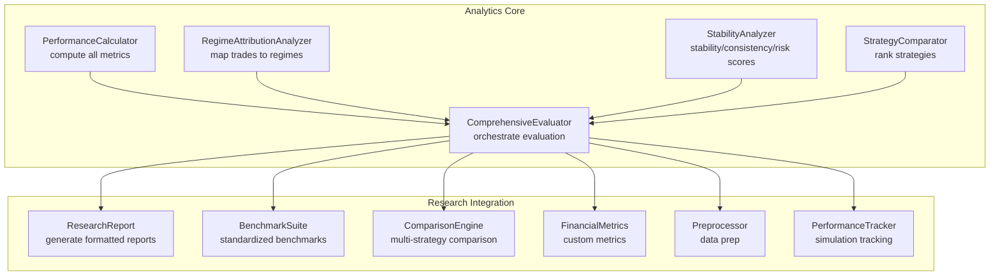
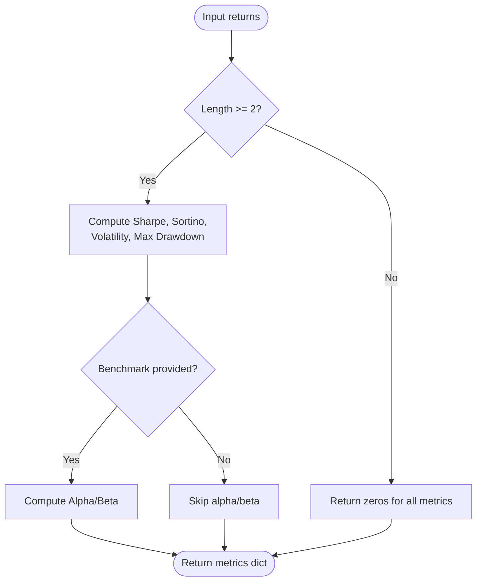
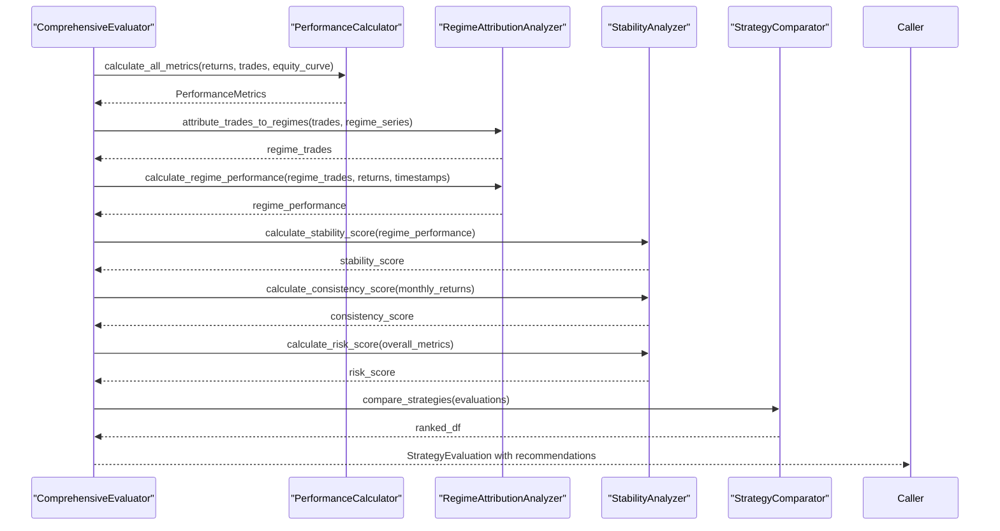
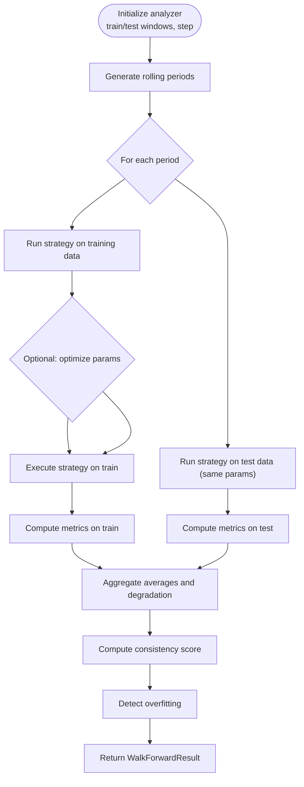
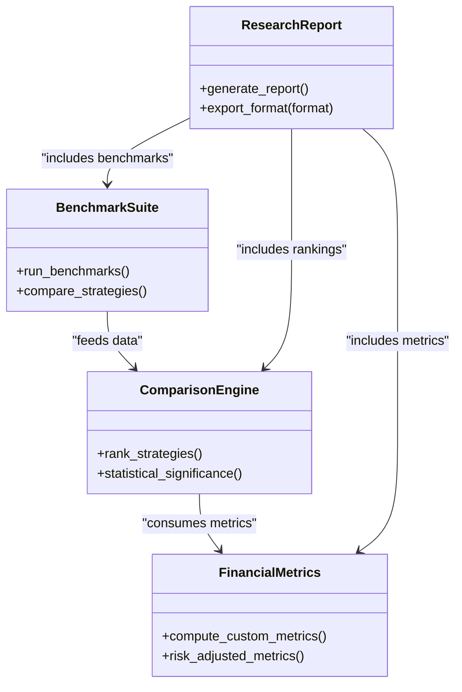
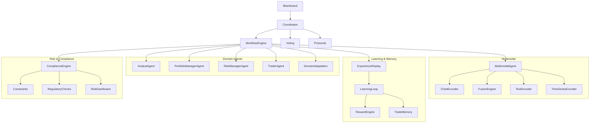
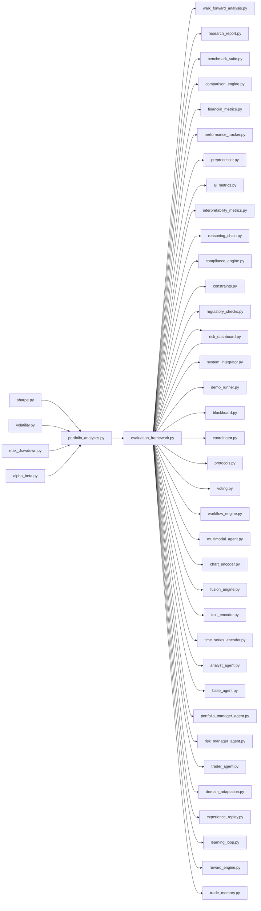

# Analytics and Research

<cite>
**Referenced Files in This Document**
- [evaluation_framework.py](file://backend/analytics/evaluation_framework.py)
- [portfolio_analytics.py](file://backend/analytics/portfolio_analytics.py)
- [sharpe.py](file://backend/analytics/sharpe.py)
- [volatility.py](file://backend/analytics/volatility.py)
- [max_drawdown.py](file://backend/analytics/max_drawdown.py)
- [alpha_beta.py](file://backend/analytics/alpha_beta.py)
- [walk_forward_analysis.py](file://backend/analytics/walk_forward_analysis.py)
- [regime_detector.py](file://backend/market/regime_detector.py)
- [research_report.py](file://FinAgents/research/integration/research_report.py)
- [benchmark_suite.py](file://FinAgents/research/evaluation/benchmark_suite.py)
- [comparison_engine.py](file://FinAgents/research/evaluation/comparison_engine.py)
- [financial_metrics.py](file://FinAgents/research/evaluation/financial_metrics.py)
- [performance_tracker.py](file://FinAgents/research/simulation/performance_tracker.py)
- [preprocessor.py](file://FinAgents/research/data_pipeline/preprocessor.py)
- [ai_metrics.py](file://FinAgents/research/evaluation/ai_metrics.py)
- [interpretability_metrics.py](file://FinAgents/research/explainability/interpretability_metrics.py)
- [reasoning_chain.py](file://FinAgents/research/explainability/reasoning_chain.py)
- [compliance_engine.py](file://FinAgents/research/risk_compliance/compliance_engine.py)
- [constraints.py](file://FinAgents/research/risk_compliance/constraints.py)
- [regulatory_checks.py](file://FinAgents/research/risk_compliance/regulatory_checks.py)
- [risk_dashboard.py](file://FinAgents/research/risk_compliance/risk_dashboard.py)
- [system_integrator.py](file://FinAgents/research/integration/system_integrator.py)
- [demo_runner.py](file://FinAgents/research/integration/demo_runner.py)
- [blackboard.py](file://FinAgents/research/coordination/blackboard.py)
- [coordinator.py](file://FinAgents/research/coordination/coordinator.py)
- [protocols.py](file://FinAgents/research/coordination/protocols.py)
- [voting.py](file://FinAgents/research/coordination/voting.py)
- [workflow_engine.py](file://FinAgents/research/coordination/workflow_engine.py)
- [multimodal_agent.py](file://FinAgents/research/multimodal/multimodal_agent.py)
- [chart_encoder.py](file://FinAgents/research/multimodal/chart_encoder.py)
- [fusion_engine.py](file://FinAgents/research/multimodal/fusion_engine.py)
- [text_encoder.py](file://FinAgents/research/multimodal/text_encoder.py)
- [time_series_encoder.py](file://FinAgents/research/multimodal/time_series_encoder.py)
- [analyst_agent.py](file://FinAgents/research/domain_agents/analyst_agent.py)
- [base_agent.py](file://FinAgents/research/domain_agents/base_agent.py)
- [portfolio_manager_agent.py](file://FinAgents/research/domain_agents/portfolio_manager_agent.py)
- [risk_manager_agent.py](file://FinAgents/research/domain_agents/risk_manager_agent.py)
- [trader_agent.py](file://FinAgents/research/domain_agents/trader_agent.py)
- [domain_adaptation.py](file://FinAgents/research/domain_agents/domain_adaptation.py)
- [experience_replay.py](file://FinAgents/research/memory_learning/experience_replay.py)
- [learning_loop.py](file://FinAgents/research/memory_learning/learning_loop.py)
- [reward_engine.py](file://FinAgents/research/memory_learning/reward_engine.py)
- [trade_memory.py](file://FinAgents/research/memory_learning/trade_memory.py)
- [evaluation_framework.py](file://FinAgents/next_gen_system/evaluation/evaluation_framework.py)
- [explainer.py](file://FinAgents/next_gen_system/explainability/explainer.py)
- [market_simulation.py](file://FinAgents/next_gen_system/environment/market_simulation.py)
- [README_RESEARCH.md](file://FinAgents/next_gen_system/README_RESEARCH.md)
</cite>

## Table of Contents
1. [Introduction](#introduction)
2. [Project Structure](#project-structure)
3. [Core Components](#core-components)
4. [Architecture Overview](#architecture-overview)
5. [Detailed Component Analysis](#detailed-component-analysis)
6. [Dependency Analysis](#dependency-analysis)
7. [Performance Considerations](#performance-considerations)
8. [Troubleshooting Guide](#troubleshooting-guide)
9. [Conclusion](#conclusion)
10. [Appendices](#appendices)

## Introduction
This document describes the Analytics and Research framework that powers performance measurement, comparative analysis, and research workflows in the Agentic Trading Application. It covers:
- Backtesting evaluation and performance attribution across market regimes
- Portfolio analytics including risk metrics and return calculations
- Financial metrics computation (Sharpe ratio, volatility, drawdown, alpha/beta)
- Benchmarking tools and research report generation
- Comparative analysis methodologies and research workflow integration
- Examples of custom analytics implementations and research experiment design patterns

## Project Structure
The Analytics and Research system spans two primary areas:
- Backend analytics: core metric computations and evaluation/reporting
- FinAgents research: advanced research orchestration, comparative analysis, and report generation

```mermaid
graph TB
subgraph "Backend Analytics"
PA["portfolio_analytics.py"]
SR["sharpe.py"]
VL["volatility.py"]
MD["max_drawdown.py"]
AB["alpha_beta.py"]
EF["evaluation_framework.py"]
WFA["walk_forward_analysis.py"]
end
subgraph "Research Orchestration"
RS["research_report.py"]
BS["benchmark_suite.py"]
CE["comparison_engine.py"]
FM["financial_metrics.py"]
PT["performance_tracker.py"]
PP["preprocessor.py"]
AI["ai_metrics.py"]
IM["interpretability_metrics.py"]
RC["reasoning_chain.py"]
CO["compliance_engine.py"]
CT["constraints.py"]
RG["regulatory_checks.py"]
RD["risk_dashboard.py"]
SI["system_integrator.py"]
DR["demo_runner.py"]
BB["blackboard.py"]
CR["coordinator.py"]
PR["protocols.py"]
V["voting.py"]
WF["workflow_engine.py"]
MA["multimodal_agent.py"]
CE2["chart_encoder.py"]
FE["fusion_engine.py"]
TE["text_encoder.py"]
TSE["time_series_encoder.py"]
AA["analyst_agent.py"]
BA["base_agent.py"]
PMA["portfolio_manager_agent.py"]
RMA["risk_manager_agent.py"]
TA["trader_agent.py"]
DA["domain_adaptation.py"]
ER["experience_replay.py"]
LL["learning_loop.py"]
RE["reward_engine.py"]
TM["trade_memory.py"]
end
PA --> SR
PA --> VL
PA --> MD
PA --> AB
EF --> PA
EF --> RD
WFA --> EF
RS --> EF
BS --> EF
CE --> EF
FM --> EF
PT --> EF
PP --> EF
AI --> EF
IM --> EF
RC --> EF
CO --> EF
CT --> EF
RG --> EF
RD --> EF
DR --> EF
BB --> EF
CR --> EF
PR --> EF
V --> EF
WF --> EF
MA --> EF
CE2 --> EF
FE --> EF
TE --> EF
TSE --> EF
AA --> EF
BA --> EF
PMA --> EF
RMA --> EF
TA --> EF
DA --> EF
ER --> EF
LL --> EF
RE --> EF
TM --> EF
```

**Diagram sources**
- [evaluation_framework.py:1-796](file://backend/analytics/evaluation_framework.py#L1-L796)
- [portfolio_analytics.py:1-42](file://backend/analytics/portfolio_analytics.py#L1-L42)
- [sharpe.py:1-33](file://backend/analytics/sharpe.py#L1-L33)
- [volatility.py:1-28](file://backend/analytics/volatility.py#L1-L28)
- [max_drawdown.py:1-32](file://backend/analytics/max_drawdown.py#L1-L32)
- [alpha_beta.py:1-42](file://backend/analytics/alpha_beta.py#L1-L42)
- [walk_forward_analysis.py:1-425](file://backend/analytics/walk_forward_analysis.py#L1-L425)
- [research_report.py](file://FinAgents/research/integration/research_report.py)
- [benchmark_suite.py](file://FinAgents/research/evaluation/benchmark_suite.py)
- [comparison_engine.py](file://FinAgents/research/evaluation/comparison_engine.py)
- [financial_metrics.py](file://FinAgents/research/evaluation/financial_metrics.py)
- [performance_tracker.py](file://FinAgents/research/simulation/performance_tracker.py)
- [preprocessor.py](file://FinAgents/research/data_pipeline/preprocessor.py)
- [ai_metrics.py](file://FinAgents/research/evaluation/ai_metrics.py)
- [interpretability_metrics.py](file://FinAgents/research/explainability/interpretability_metrics.py)
- [reasoning_chain.py](file://FinAgents/research/explainability/reasoning_chain.py)
- [compliance_engine.py](file://FinAgents/research/risk_compliance/compliance_engine.py)
- [constraints.py](file://FinAgents/research/risk_compliance/constraints.py)
- [regulatory_checks.py](file://FinAgents/research/risk_compliance/regulatory_checks.py)
- [risk_dashboard.py](file://FinAgents/research/risk_compliance/risk_dashboard.py)
- [system_integrator.py](file://FinAgents/research/integration/system_integrator.py)
- [demo_runner.py](file://FinAgents/research/integration/demo_runner.py)
- [blackboard.py](file://FinAgents/research/coordination/blackboard.py)
- [coordinator.py](file://FinAgents/research/coordination/coordinator.py)
- [protocols.py](file://FinAgents/research/coordination/protocols.py)
- [voting.py](file://FinAgents/research/coordination/voting.py)
- [workflow_engine.py](file://FinAgents/research/coordination/workflow_engine.py)
- [multimodal_agent.py](file://FinAgents/research/multimodal/multimodal_agent.py)
- [chart_encoder.py](file://FinAgents/research/multimodal/chart_encoder.py)
- [fusion_engine.py](file://FinAgents/research/multimodal/fusion_engine.py)
- [text_encoder.py](file://FinAgents/research/multimodal/text_encoder.py)
- [time_series_encoder.py](file://FinAgents/research/multimodal/time_series_encoder.py)
- [analyst_agent.py](file://FinAgents/research/domain_agents/analyst_agent.py)
- [base_agent.py](file://FinAgents/research/domain_agents/base_agent.py)
- [portfolio_manager_agent.py](file://FinAgents/research/domain_agents/portfolio_manager_agent.py)
- [risk_manager_agent.py](file://FinAgents/research/domain_agents/risk_manager_agent.py)
- [trader_agent.py](file://FinAgents/research/domain_agents/trader_agent.py)
- [domain_adaptation.py](file://FinAgents/research/domain_agents/domain_adaptation.py)
- [experience_replay.py](file://FinAgents/research/memory_learning/experience_replay.py)
- [learning_loop.py](file://FinAgents/research/memory_learning/learning_loop.py)
- [reward_engine.py](file://FinAgents/research/memory_learning/reward_engine.py)
- [trade_memory.py](file://FinAgents/research/memory_learning/trade_memory.py)

**Section sources**
- [evaluation_framework.py:1-796](file://backend/analytics/evaluation_framework.py#L1-L796)
- [portfolio_analytics.py:1-42](file://backend/analytics/portfolio_analytics.py#L1-L42)
- [walk_forward_analysis.py:1-425](file://backend/analytics/walk_forward_analysis.py#L1-L425)

## Core Components
- Portfolio analytics aggregator that computes Sharpe, Sortino, volatility, max drawdown, and optionally alpha/beta against a benchmark.
- Comprehensive evaluation framework that builds performance metrics, attributes performance to market regimes, computes stability and risk scores, and generates recommendations.
- Walk-forward analysis for robust strategy validation with rolling windows, out-of-sample testing, and overfitting detection.
- Research orchestration modules for comparative analysis, benchmarking, report generation, and workflow integration.

Key capabilities:
- Performance metrics computation (Sharpe, Sortino, volatility, drawdown, alpha/beta)
- Regime-aware performance attribution and stability analysis
- Strategy comparison and ranking
- Walk-forward validation and Monte Carlo robustness testing
- Research report generation and system integration

**Section sources**
- [portfolio_analytics.py:1-42](file://backend/analytics/portfolio_analytics.py#L1-L42)
- [evaluation_framework.py:187-796](file://backend/analytics/evaluation_framework.py#L187-L796)
- [walk_forward_analysis.py:65-425](file://backend/analytics/walk_forward_analysis.py#L65-L425)

## Architecture Overview
The system integrates backend analytics with research orchestration to deliver end-to-end evaluation and reporting.

**Diagram sources**
- [evaluation_framework.py:187-796](file://backend/analytics/evaluation_framework.py#L187-L796)
- [research_report.py](file://FinAgents/research/integration/research_report.py)
- [benchmark_suite.py](file://FinAgents/research/evaluation/benchmark_suite.py)
- [comparison_engine.py](file://FinAgents/research/evaluation/comparison_engine.py)
- [financial_metrics.py](file://FinAgents/research/evaluation/financial_metrics.py)
- [preprocessor.py](file://FinAgents/research/data_pipeline/preprocessor.py)
- [performance_tracker.py](file://FinAgents/research/simulation/performance_tracker.py)

## Detailed Component Analysis

### Portfolio Analytics Aggregator
Computes a suite of risk-return metrics from a return series and optionally compares to a benchmark for alpha/beta.

**Diagram sources**
- [portfolio_analytics.py:14-42](file://backend/analytics/portfolio_analytics.py#L14-L42)
- [sharpe.py:8-33](file://backend/analytics/sharpe.py#L8-L33)
- [volatility.py:9-28](file://backend/analytics/volatility.py#L9-L28)
- [max_drawdown.py:8-32](file://backend/analytics/max_drawdown.py#L8-L32)
- [alpha_beta.py:9-42](file://backend/analytics/alpha_beta.py#L9-L42)

**Section sources**
- [portfolio_analytics.py:14-42](file://backend/analytics/portfolio_analytics.py#L14-L42)
- [sharpe.py:8-33](file://backend/analytics/sharpe.py#L8-L33)
- [volatility.py:9-28](file://backend/analytics/volatility.py#L9-L28)
- [max_drawdown.py:8-32](file://backend/analytics/max_drawdown.py#L8-L32)
- [alpha_beta.py:9-42](file://backend/analytics/alpha_beta.py#L9-L42)

### Comprehensive Evaluation Framework
End-to-end evaluation pipeline that computes performance metrics, attributes performance to market regimes, and produces strategy rankings and recommendations.

**Diagram sources**
- [evaluation_framework.py:507-796](file://backend/analytics/evaluation_framework.py#L507-L796)

**Section sources**
- [evaluation_framework.py:507-796](file://backend/analytics/evaluation_framework.py#L507-L796)

### Walk-Forward Analysis
Implements robust out-of-sample testing to prevent overfitting and assess strategy stability across time.

**Diagram sources**
- [walk_forward_analysis.py:65-425](file://backend/analytics/walk_forward_analysis.py#L65-L425)

**Section sources**
- [walk_forward_analysis.py:65-425](file://backend/analytics/walk_forward_analysis.py#L65-L425)

### Research Evaluation Suite and Comparative Analysis
Research modules provide standardized benchmarking, comparison engines, and financial metrics tailored for agent-driven experiments.

**Diagram sources**
- [benchmark_suite.py](file://FinAgents/research/evaluation/benchmark_suite.py)
- [comparison_engine.py](file://FinAgents/research/evaluation/comparison_engine.py)
- [financial_metrics.py](file://FinAgents/research/evaluation/financial_metrics.py)
- [research_report.py](file://FinAgents/research/integration/research_report.py)

**Section sources**
- [benchmark_suite.py](file://FinAgents/research/evaluation/benchmark_suite.py)
- [comparison_engine.py](file://FinAgents/research/evaluation/comparison_engine.py)
- [financial_metrics.py](file://FinAgents/research/evaluation/financial_metrics.py)
- [research_report.py](file://FinAgents/research/integration/research_report.py)

### Research Workflow Integration
Coordination and workflow modules integrate research agents, multimodal processing, and compliance checks into a cohesive research pipeline.

**Diagram sources**
- [blackboard.py](file://FinAgents/research/coordination/blackboard.py)
- [coordinator.py](file://FinAgents/research/coordination/coordinator.py)
- [protocols.py](file://FinAgents/research/coordination/protocols.py)
- [voting.py](file://FinAgents/research/coordination/voting.py)
- [workflow_engine.py](file://FinAgents/research/coordination/workflow_engine.py)
- [analyst_agent.py](file://FinAgents/research/domain_agents/analyst_agent.py)
- [portfolio_manager_agent.py](file://FinAgents/research/domain_agents/portfolio_manager_agent.py)
- [risk_manager_agent.py](file://FinAgents/research/domain_agents/risk_manager_agent.py)
- [trader_agent.py](file://FinAgents/research/domain_agents/trader_agent.py)
- [domain_adaptation.py](file://FinAgents/research/domain_agents/domain_adaptation.py)
- [multimodal_agent.py](file://FinAgents/research/multimodal/multimodal_agent.py)
- [chart_encoder.py](file://FinAgents/research/multimodal/chart_encoder.py)
- [fusion_engine.py](file://FinAgents/research/multimodal/fusion_engine.py)
- [text_encoder.py](file://FinAgents/research/multimodal/text_encoder.py)
- [time_series_encoder.py](file://FinAgents/research/multimodal/time_series_encoder.py)
- [experience_replay.py](file://FinAgents/research/memory_learning/experience_replay.py)
- [learning_loop.py](file://FinAgents/research/memory_learning/learning_loop.py)
- [reward_engine.py](file://FinAgents/research/memory_learning/reward_engine.py)
- [trade_memory.py](file://FinAgents/research/memory_learning/trade_memory.py)
- [compliance_engine.py](file://FinAgents/research/risk_compliance/compliance_engine.py)
- [constraints.py](file://FinAgents/research/risk_compliance/constraints.py)
- [regulatory_checks.py](file://FinAgents/research/risk_compliance/regulatory_checks.py)
- [risk_dashboard.py](file://FinAgents/research/risk_compliance/risk_dashboard.py)

**Section sources**
- [blackboard.py](file://FinAgents/research/coordination/blackboard.py)
- [coordinator.py](file://FinAgents/research/coordination/coordinator.py)
- [protocols.py](file://FinAgents/research/coordination/protocols.py)
- [voting.py](file://FinAgents/research/coordination/voting.py)
- [workflow_engine.py](file://FinAgents/research/coordination/workflow_engine.py)
- [multimodal_agent.py](file://FinAgents/research/multimodal/multimodal_agent.py)
- [experience_replay.py](file://FinAgents/research/memory_learning/experience_replay.py)
- [learning_loop.py](file://FinAgents/research/memory_learning/learning_loop.py)
- [reward_engine.py](file://FinAgents/research/memory_learning/reward_engine.py)
- [trade_memory.py](file://FinAgents/research/memory_learning/trade_memory.py)
- [compliance_engine.py](file://FinAgents/research/risk_compliance/compliance_engine.py)
- [constraints.py](file://FinAgents/research/risk_compliance/constraints.py)
- [regulatory_checks.py](file://FinAgents/research/risk_compliance/regulatory_checks.py)
- [risk_dashboard.py](file://FinAgents/research/risk_compliance/risk_dashboard.py)

## Dependency Analysis
The backend analytics modules depend on each other to compute portfolio-level metrics. The evaluation framework composes these metrics into comprehensive strategy evaluations and integrates with research modules for comparative analysis and reporting.

**Diagram sources**
- [portfolio_analytics.py:1-42](file://backend/analytics/portfolio_analytics.py#L1-L42)
- [sharpe.py:1-33](file://backend/analytics/sharpe.py#L1-L33)
- [volatility.py:1-28](file://backend/analytics/volatility.py#L1-L28)
- [max_drawdown.py:1-32](file://backend/analytics/max_drawdown.py#L1-L32)
- [alpha_beta.py:1-42](file://backend/analytics/alpha_beta.py#L1-L42)
- [evaluation_framework.py:1-796](file://backend/analytics/evaluation_framework.py#L1-L796)
- [regime_detector.py](file://backend/market/regime_detector.py)
- [walk_forward_analysis.py:1-425](file://backend/analytics/walk_forward_analysis.py#L1-L425)
- [research_report.py](file://FinAgents/research/integration/research_report.py)
- [benchmark_suite.py](file://FinAgents/research/evaluation/benchmark_suite.py)
- [comparison_engine.py](file://FinAgents/research/evaluation/comparison_engine.py)
- [financial_metrics.py](file://FinAgents/research/evaluation/financial_metrics.py)
- [performance_tracker.py](file://FinAgents/research/simulation/performance_tracker.py)
- [preprocessor.py](file://FinAgents/research/data_pipeline/preprocessor.py)
- [ai_metrics.py](file://FinAgents/research/evaluation/ai_metrics.py)
- [interpretability_metrics.py](file://FinAgents/research/explainability/interpretability_metrics.py)
- [reasoning_chain.py](file://FinAgents/research/explainability/reasoning_chain.py)
- [compliance_engine.py](file://FinAgents/research/risk_compliance/compliance_engine.py)
- [constraints.py](file://FinAgents/research/risk_compliance/constraints.py)
- [regulatory_checks.py](file://FinAgents/research/risk_compliance/regulatory_checks.py)
- [risk_dashboard.py](file://FinAgents/research/risk_compliance/risk_dashboard.py)
- [system_integrator.py](file://FinAgents/research/integration/system_integrator.py)
- [demo_runner.py](file://FinAgents/research/integration/demo_runner.py)
- [blackboard.py](file://FinAgents/research/coordination/blackboard.py)
- [coordinator.py](file://FinAgents/research/coordination/coordinator.py)
- [protocols.py](file://FinAgents/research/coordination/protocols.py)
- [voting.py](file://FinAgents/research/coordination/voting.py)
- [workflow_engine.py](file://FinAgents/research/coordination/workflow_engine.py)
- [multimodal_agent.py](file://FinAgents/research/multimodal/multimodal_agent.py)
- [chart_encoder.py](file://FinAgents/research/multimodal/chart_encoder.py)
- [fusion_engine.py](file://FinAgents/research/multimodal/fusion_engine.py)
- [text_encoder.py](file://FinAgents/research/multimodal/text_encoder.py)
- [time_series_encoder.py](file://FinAgents/research/multimodal/time_series_encoder.py)
- [analyst_agent.py](file://FinAgents/research/domain_agents/analyst_agent.py)
- [base_agent.py](file://FinAgents/research/domain_agents/base_agent.py)
- [portfolio_manager_agent.py](file://FinAgents/research/domain_agents/portfolio_manager_agent.py)
- [risk_manager_agent.py](file://FinAgents/research/domain_agents/risk_manager_agent.py)
- [trader_agent.py](file://FinAgents/research/domain_agents/trader_agent.py)
- [domain_adaptation.py](file://FinAgents/research/domain_agents/domain_adaptation.py)
- [experience_replay.py](file://FinAgents/research/memory_learning/experience_replay.py)
- [learning_loop.py](file://FinAgents/research/memory_learning/learning_loop.py)
- [reward_engine.py](file://FinAgents/research/memory_learning/reward_engine.py)
- [trade_memory.py](file://FinAgents/research/memory_learning/trade_memory.py)

**Section sources**
- [evaluation_framework.py:1-796](file://backend/analytics/evaluation_framework.py#L1-L796)
- [portfolio_analytics.py:1-42](file://backend/analytics/portfolio_analytics.py#L1-L42)

## Performance Considerations
- Prefer vectorized computations using NumPy and pandas for large datasets.
- Use annualized metrics consistently for fair comparisons across frequencies.
- Ensure sufficient data points for statistical validity (minimum samples for Sharpe, Sortino, and bootstrap analysis).
- Apply regime detection and attribution to avoid misleading aggregate metrics.
- Monitor computational overhead in walk-forward analysis and Monte Carlo simulations; consider parallelization where appropriate.

[No sources needed since this section provides general guidance]

## Troubleshooting Guide
Common issues and resolutions:
- Insufficient data: Many functions return zeros or skip computations when fewer than required samples are provided.
- Zero or near-zero variance: Sharpe and volatility computations guard against division by zero.
- Mismatched benchmark lengths: Alpha/beta requires returns and benchmark returns of equal length.
- Overfitting detection: Walk-forward degradation thresholds indicate potential overfitting.
- Regime mapping errors: Analyzer falls back to nearest prior regime when exact timestamps are missing.

**Section sources**
- [sharpe.py:23-32](file://backend/analytics/sharpe.py#L23-L32)
- [volatility.py:20-27](file://backend/analytics/volatility.py#L20-L27)
- [alpha_beta.py:27-41](file://backend/analytics/alpha_beta.py#L27-L41)
- [walk_forward_analysis.py:134-138](file://backend/analytics/walk_forward_analysis.py#L134-L138)
- [evaluation_framework.py:316-322](file://backend/analytics/evaluation_framework.py#L316-L322)

## Conclusion
The Analytics and Research framework provides a robust foundation for evaluating trading strategies, attributing performance across market regimes, and generating actionable insights. By combining backend analytics with research orchestration, teams can design rigorous experiments, compare strategies systematically, and produce comprehensive research reports aligned with compliance and risk requirements.

[No sources needed since this section summarizes without analyzing specific files]

## Appendices

### Example: Custom Analytics Implementation Pattern
To add a new financial metric:
- Implement a standalone function under backend/analytics returning a scalar value.
- Extend the aggregator to include the new metric.
- Integrate into the evaluation pipeline by adding it to the comprehensive evaluator’s metrics computation.

**Section sources**
- [portfolio_analytics.py:14-42](file://backend/analytics/portfolio_analytics.py#L14-L42)
- [evaluation_framework.py:187-284](file://backend/analytics/evaluation_framework.py#L187-L284)

### Example: Research Experiment Design Pattern
- Define a strategy function that accepts price data and returns trades.
- Use walk-forward analysis to validate out-of-sample performance.
- Employ the benchmark suite to compare against standard benchmarks.
- Generate a research report integrating metrics, rankings, and recommendations.

**Section sources**
- [walk_forward_analysis.py:143-264](file://backend/analytics/walk_forward_analysis.py#L143-L264)
- [benchmark_suite.py](file://FinAgents/research/evaluation/benchmark_suite.py)
- [research_report.py](file://FinAgents/research/integration/research_report.py)