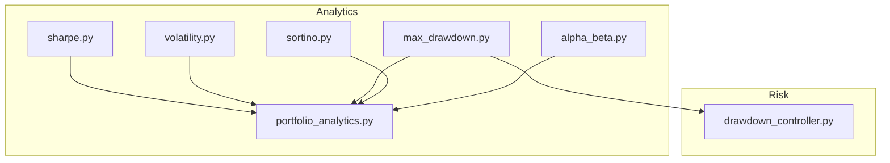
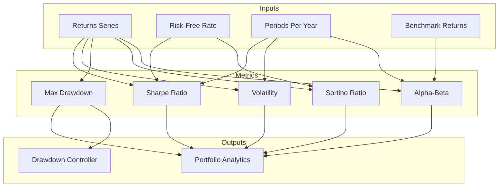
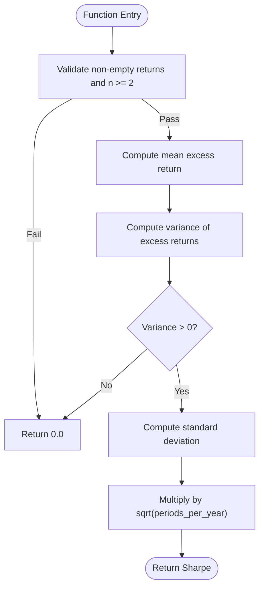
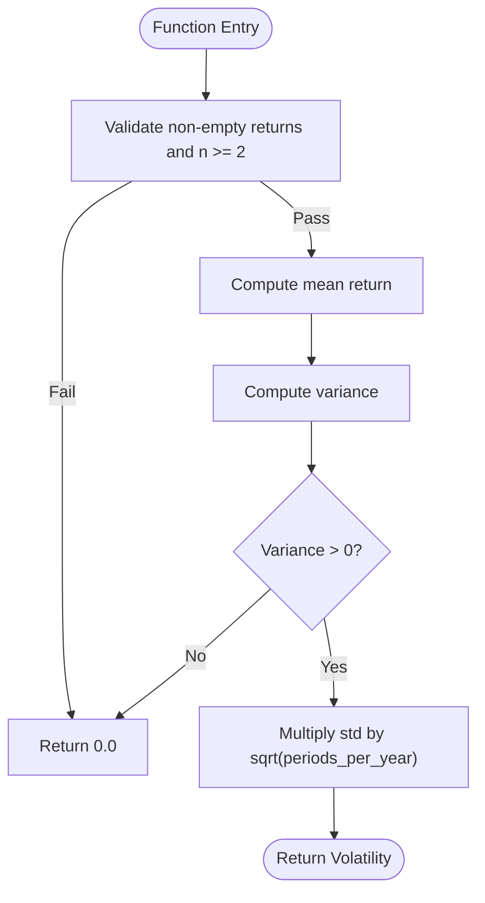
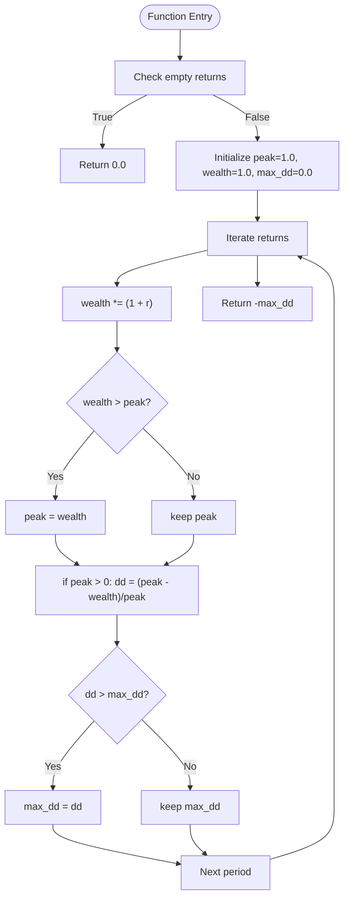
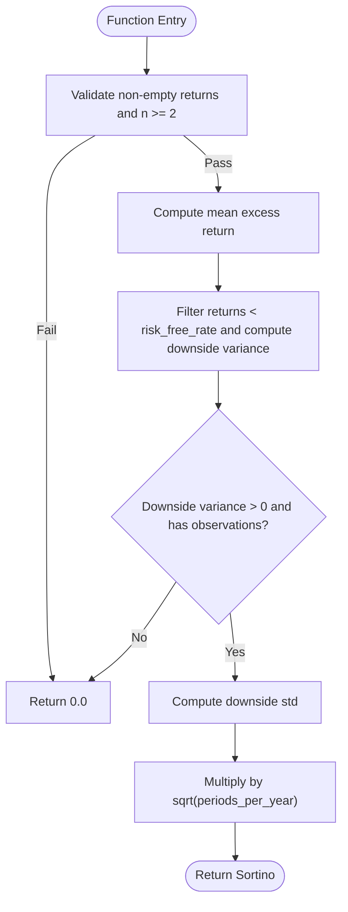
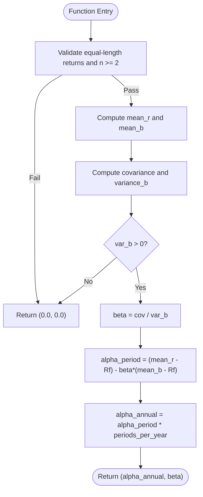
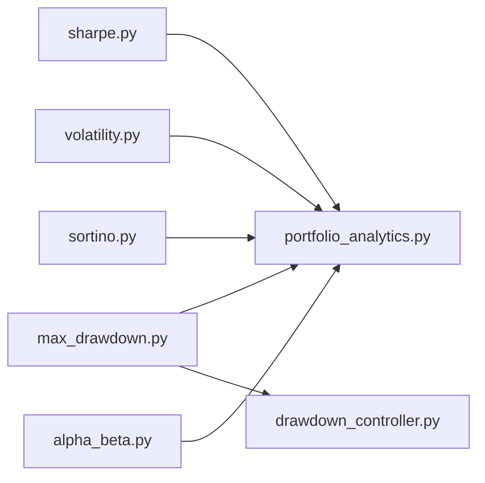

# Financial Metrics Computation

<cite>
**Referenced Files in This Document**
- [sharpe.py](file://backend/analytics/sharpe.py)
- [volatility.py](file://backend/analytics/volatility.py)
- [max_drawdown.py](file://backend/analytics/max_drawdown.py)
- [sortino.py](file://backend/analytics/sortino.py)
- [alpha_beta.py](file://backend/analytics/alpha_beta.py)
- [portfolio_analytics.py](file://backend/analytics/portfolio_analytics.py)
- [drawdown_controller.py](file://backend/risk/drawdown_controller.py)
</cite>

## Table of Contents
1. [Introduction](#introduction)
2. [Project Structure](#project-structure)
3. [Core Components](#core-components)
4. [Architecture Overview](#architecture-overview)
5. [Detailed Component Analysis](#detailed-component-analysis)
6. [Dependency Analysis](#dependency-analysis)
7. [Performance Considerations](#performance-considerations)
8. [Troubleshooting Guide](#troubleshooting-guide)
9. [Conclusion](#conclusion)
10. [Appendices](#appendices)

## Introduction
This document provides comprehensive documentation for financial metrics computation used in trading performance analysis. It covers Sharpe ratio, volatility, maximum drawdown, Sortino ratio, and alpha-beta decomposition. For each metric, we explain the mathematical foundation, implementation algorithms, parameter configurations, interpretation guidelines, and integration points with portfolio analytics. Edge cases, numerical stability considerations, and performance optimization techniques are addressed to ensure robust deployment in trading systems.

## Project Structure
The financial metrics are implemented as standalone modules under the backend analytics package. Supporting risk controls and portfolio analytics integrate these metrics into broader performance monitoring and risk management workflows.

**Diagram sources**
- [sharpe.py:1-33](file://backend/analytics/sharpe.py#L1-L33)
- [volatility.py:1-28](file://backend/analytics/volatility.py#L1-L28)
- [max_drawdown.py:1-32](file://backend/analytics/max_drawdown.py#L1-L32)
- [sortino.py:1-41](file://backend/analytics/sortino.py#L1-L41)
- [alpha_beta.py:1-42](file://backend/analytics/alpha_beta.py#L1-L42)
- [portfolio_analytics.py](file://backend/analytics/portfolio_analytics.py)
- [drawdown_controller.py](file://backend/risk/drawdown_controller.py)

**Section sources**
- [sharpe.py:1-33](file://backend/analytics/sharpe.py#L1-L33)
- [volatility.py:1-28](file://backend/analytics/volatility.py#L1-L28)
- [max_drawdown.py:1-32](file://backend/analytics/max_drawdown.py#L1-L32)
- [sortino.py:1-41](file://backend/analytics/sortino.py#L1-L41)
- [alpha_beta.py:1-42](file://backend/analytics/alpha_beta.py#L1-L42)
- [portfolio_analytics.py](file://backend/analytics/portfolio_analytics.py)
- [drawdown_controller.py](file://backend/risk/drawdown_controller.py)

## Core Components
This section summarizes the core quantitative measures and their roles in performance analysis.

- Sharpe Ratio: Measures risk-adjusted return as excess return per unit of volatility, annualized using a chosen time scaling.
- Volatility: Annualized standard deviation of returns, capturing total risk.
- Maximum Drawdown: Peak-to-trough decline in cumulative wealth, expressed as a negative percentage.
- Sortino Ratio: Risk-adjusted return considering only downside volatility relative to a risk-free rate.
- Alpha-Beta: Systematic risk decomposition against a benchmark using covariance and variance.

Each component exposes a function that accepts time-series returns and optional parameters such as risk-free rate and periodicity scaling.

**Section sources**
- [sharpe.py:8-32](file://backend/analytics/sharpe.py#L8-L32)
- [volatility.py:9-27](file://backend/analytics/volatility.py#L9-L27)
- [max_drawdown.py:8-31](file://backend/analytics/max_drawdown.py#L8-L31)
- [sortino.py:9-40](file://backend/analytics/sortino.py#L9-L40)
- [alpha_beta.py:9-41](file://backend/analytics/alpha_beta.py#L9-L41)

## Architecture Overview
The metrics are designed as pure functions operating on lists of returns. They are intended to be integrated into portfolio analytics and risk control layers. The maximum drawdown metric is also leveraged by a drawdown controller for risk monitoring.

**Diagram sources**
- [sharpe.py:8-32](file://backend/analytics/sharpe.py#L8-L32)
- [volatility.py:9-27](file://backend/analytics/volatility.py#L9-L27)
- [max_drawdown.py:8-31](file://backend/analytics/max_drawdown.py#L8-L31)
- [sortino.py:9-40](file://backend/analytics/sortino.py#L9-L40)
- [alpha_beta.py:9-41](file://backend/analytics/alpha_beta.py#L9-L41)
- [portfolio_analytics.py](file://backend/analytics/portfolio_analytics.py)
- [drawdown_controller.py](file://backend/risk/drawdown_controller.py)

## Detailed Component Analysis

### Sharpe Ratio
- Mathematical Foundation: Excess return divided by volatility, scaled annually.
- Implementation Algorithm:
  - Compute mean excess return using the risk-free rate.
  - Estimate variance of excess returns.
  - Return zero if insufficient data or non-positive variance.
  - Scale by square root of periods per year.
- Parameters:
  - returns: List of period returns.
  - risk_free_rate: Same-period risk-free rate.
  - periods_per_year: Scaling factor (e.g., 252 for daily).
- Interpretation:
  - Higher absolute value indicates better risk-adjusted performance.
  - Negative values imply underperformance relative to the risk-free asset.
- Numerical Stability:
  - Guard against zero/negative variance.
  - Require at least two observations.
- Performance Notes:
  - O(n) time and O(1) space.
  - Avoid repeated mean calculations by recentering.

**Diagram sources**
- [sharpe.py:8-32](file://backend/analytics/sharpe.py#L8-L32)

**Section sources**
- [sharpe.py:8-32](file://backend/analytics/sharpe.py#L8-L32)

### Volatility
- Mathematical Foundation: Annualized standard deviation of returns.
- Implementation Algorithm:
  - Compute mean return.
  - Estimate variance and standard deviation.
  - Annualize by multiplying by sqrt(periods_per_year).
- Parameters:
  - returns: List of period returns.
  - periods_per_year: Scaling factor (e.g., 252 for daily).
- Interpretation:
  - Captures total risk; higher values indicate higher uncertainty.
- Numerical Stability:
  - Return zero if insufficient data or non-positive variance.
- Performance Notes:
  - O(n) time and O(1) space.

**Diagram sources**
- [volatility.py:9-27](file://backend/analytics/volatility.py#L9-L27)

**Section sources**
- [volatility.py:9-27](file://backend/analytics/volatility.py#L9-L27)

### Maximum Drawdown
- Mathematical Foundation: Largest peak-to-trough decline in cumulative wealth path.
- Implementation Algorithm:
  - Track cumulative wealth as compounding returns.
  - Maintain running peak and compute drawdown at each step.
  - Return the maximum drawdown as a negative decimal.
- Parameters:
  - returns: List of period returns.
- Interpretation:
  - Negative value; larger absolute value indicates deeper drawdown.
- Numerical Stability:
  - Return zero for empty input.
- Performance Notes:
  - O(n) time and O(1) space.

**Diagram sources**
- [max_drawdown.py:8-31](file://backend/analytics/max_drawdown.py#L8-L31)

**Section sources**
- [max_drawdown.py:8-31](file://backend/analytics/max_drawdown.py#L8-L31)

### Sortino Ratio
- Mathematical Foundation: Excess return per unit of downside deviation relative to risk-free rate.
- Implementation Algorithm:
  - Compute mean excess return.
  - Select returns below the risk-free rate and compute downside variance.
  - Return zero if no downside observations or non-positive variance.
  - Annualize by sqrt(periods_per_year).
- Parameters:
  - returns: List of period returns.
  - risk_free_rate: Target rate for downside threshold.
  - periods_per_year: Scaling factor.
- Interpretation:
  - Penalizes only negative deviations; higher is better.
- Numerical Stability:
  - Guard against zero/negative downside variance.
  - Require at least two observations.
- Performance Notes:
  - O(n) time and O(k) extra space for downside subset.

**Diagram sources**
- [sortino.py:9-40](file://backend/analytics/sortino.py#L9-L40)

**Section sources**
- [sortino.py:9-40](file://backend/analytics/sortino.py#L9-L40)

### Alpha-Beta Decomposition
- Mathematical Foundation: CAPM-style regression of portfolio returns on benchmark returns; alpha captures abnormal return, beta measures sensitivity.
- Implementation Algorithm:
  - Compute means of portfolio and benchmark returns.
  - Estimate covariance and benchmark variance.
  - Compute beta as covariance/variance; guard against zero variance.
  - Compute alpha period, then annualize by periods per year.
- Parameters:
  - returns: Portfolio period returns.
  - benchmark_returns: Benchmark period returns (same length).
  - risk_free_rate: Period risk-free rate.
  - periods_per_year: Scaling factor.
- Interpretation:
  - Alpha: Abnormal return; positive indicates skill after adjusting for benchmark exposure.
  - Beta: Sensitivity to benchmark; above 1 implies higher systematic risk.
- Numerical Stability:
  - Return zeros if lengths differ, n < 2, or variance non-positive.
- Performance Notes:
  - O(n) time and O(1) space.

**Diagram sources**
- [alpha_beta.py:9-41](file://backend/analytics/alpha_beta.py#L9-L41)

**Section sources**
- [alpha_beta.py:9-41](file://backend/analytics/alpha_beta.py#L9-L41)

### Integration with Portfolio Analytics
Portfolio analytics module aggregates individual metrics into a cohesive performance report. Typical integration steps:
- Compute each metric over aligned return series.
- Align risk-free rate and periodicity scaling consistently across metrics.
- Store results with metadata (timeframe, frequency, benchmark).
- Visualize and compare metrics across strategies or portfolios.

[No sources needed since this section doesn't analyze specific files]

## Dependency Analysis
The metrics are self-contained and depend only on standard library constructs. They are consumed by portfolio analytics and optionally by risk controls.

**Diagram sources**
- [sharpe.py:1-33](file://backend/analytics/sharpe.py#L1-L33)
- [volatility.py:1-28](file://backend/analytics/volatility.py#L1-L28)
- [max_drawdown.py:1-32](file://backend/analytics/max_drawdown.py#L1-L32)
- [sortino.py:1-41](file://backend/analytics/sortino.py#L1-L41)
- [alpha_beta.py:1-42](file://backend/analytics/alpha_beta.py#L1-L42)
- [portfolio_analytics.py](file://backend/analytics/portfolio_analytics.py)
- [drawdown_controller.py](file://backend/risk/drawdown_controller.py)

**Section sources**
- [sharpe.py:1-33](file://backend/analytics/sharpe.py#L1-L33)
- [volatility.py:1-28](file://backend/analytics/volatility.py#L1-L28)
- [max_drawdown.py:1-32](file://backend/analytics/max_drawdown.py#L1-L32)
- [sortino.py:1-41](file://backend/analytics/sortino.py#L1-L41)
- [alpha_beta.py:1-42](file://backend/analytics/alpha_beta.py#L1-L42)
- [portfolio_analytics.py](file://backend/analytics/portfolio_analytics.py)
- [drawdown_controller.py](file://backend/risk/drawdown_controller.py)

## Performance Considerations
- Time Complexity:
  - All metrics operate in linear time relative to the number of periods.
- Space Complexity:
  - Most metrics use constant extra space; Sortino may allocate a subset for downside returns.
- Numerical Precision:
  - Prefer stable summation when extending to vectorized libraries (e.g., avoid catastrophic cancellation).
- Scaling Consistency:
  - Ensure risk-free rate and returns share the same periodicity; align periods_per_year accordingly.
- Batch Processing:
  - For multiple assets or windows, reuse intermediate means and avoid recomputation.
- Rolling Windows:
  - For rolling Sharpe/Sortino, maintain incremental updates (e.g., Welford’s method) to reduce recomputations.

[No sources needed since this section provides general guidance]

## Troubleshooting Guide
Common issues and resolutions:
- Insufficient Data:
  - All functions return zero when fewer than two observations are provided.
- Zero or Negative Variance:
  - Sharpe, volatility, Sortino, and alpha-beta return neutral values when variance is non-positive.
- Mismatched Series Lengths:
  - Alpha-beta requires equal-length returns and benchmark series; otherwise returns neutral values.
- Empty Inputs:
  - Max drawdown returns zero for empty inputs.
- Risk-Free Rate Mismatch:
  - Ensure risk-free rate matches the return periodicity (daily vs monthly).

**Section sources**
- [sharpe.py:23-29](file://backend/analytics/sharpe.py#L23-L29)
- [volatility.py:20-26](file://backend/analytics/volatility.py#L20-L26)
- [max_drawdown.py:18-19](file://backend/analytics/max_drawdown.py#L18-L19)
- [sortino.py:25-35](file://backend/analytics/sortino.py#L25-L35)
- [alpha_beta.py:27-31](file://backend/analytics/alpha_beta.py#L27-L31)

## Conclusion
These modules provide efficient, numerically stable implementations of core trading performance metrics. By ensuring consistent parameterization and integrating with portfolio analytics and risk controls, teams can build robust performance reporting and monitoring systems. Extending to rolling windows and vectorized computation follows naturally from the existing O(n) algorithms.

[No sources needed since this section summarizes without analyzing specific files]

## Appendices

### Parameter Configuration Guidelines
- periods_per_year:
  - Use 252 for daily returns, 12 for monthly, 52 for weekly.
- risk_free_rate:
  - Match the periodicity of returns; convert rates appropriately (e.g., daily from annual).
- benchmark_returns:
  - Align frequency and length with portfolio returns.

[No sources needed since this section provides general guidance]