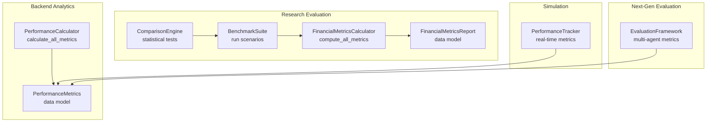
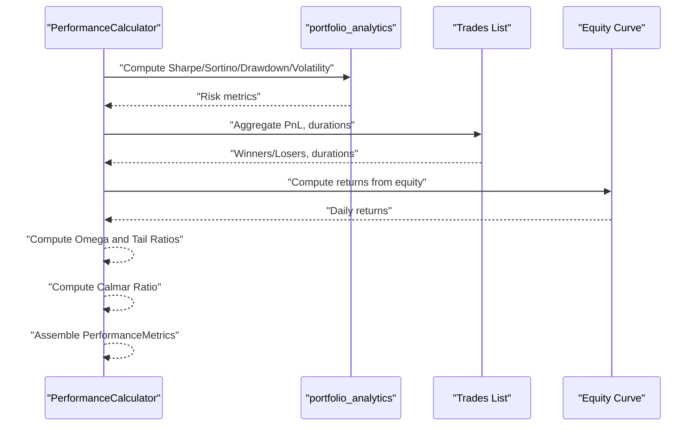
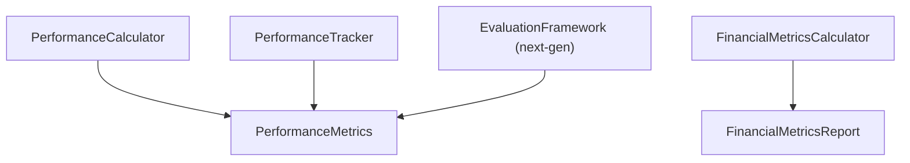

# Core Performance Metrics

<cite>
**Referenced Files in This Document**
- [financial_metrics.py](file://FinAgents/research/evaluation/financial_metrics.py)
- [evaluation_framework.py](file://backend/analytics/evaluation_framework.py)
- [evaluation_framework.py](file://FinAgents/next_gen_system/evaluation/evaluation_framework.py)
- [performance_tracker.py](file://FinAgents/research/simulation/performance_tracker.py)
- [benchmark_suite.py](file://FinAgents/research/evaluation/benchmark_suite.py)
- [comparison_engine.py](file://FinAgents/research/evaluation/comparison_engine.py)
- [ai_metrics.py](file://FinAgents/research/evaluation/ai_metrics.py)
</cite>

## Table of Contents
1. [Introduction](#introduction)
2. [Project Structure](#project-structure)
3. [Core Components](#core-components)
4. [Architecture Overview](#architecture-overview)
5. [Detailed Component Analysis](#detailed-component-analysis)
6. [Dependency Analysis](#dependency-analysis)
7. [Performance Considerations](#performance-considerations)
8. [Troubleshooting Guide](#troubleshooting-guide)
9. [Conclusion](#conclusion)

## Introduction
This document presents the complete set of quantitative performance measures used in trading strategy evaluation across the Agentic Trading Application. It focuses on the PerformanceMetrics data model and the PerformanceCalculator.calculate_all_metrics method, detailing mathematical formulations, calculation methodologies, interpretation guidelines, and practical examples. It also explains how metrics interrelate to provide comprehensive strategy evaluation, including risk-adjusted returns, drawdown analysis, trade-based statistics, and advanced ratios such as Omega and Tail Ratio.

## Project Structure
The performance evaluation ecosystem spans multiple modules:
- Backend analytics: comprehensive metrics computation and regime-aware evaluation
- Research evaluation: extended financial metrics and benchmarking
- Simulation: real-time performance tracking and attribution
- Next-gen evaluation: multi-agent system evaluation with AI metrics
- Benchmarking: standardized scenarios and comparison engine

**Diagram sources**
- [evaluation_framework.py:187-283](file://backend/analytics/evaluation_framework.py#L187-L283)
- [financial_metrics.py:77-224](file://FinAgents/research/evaluation/financial_metrics.py#L77-L224)
- [benchmark_suite.py:42-183](file://FinAgents/research/evaluation/benchmark_suite.py#L42-L183)
- [comparison_engine.py:46-130](file://FinAgents/research/evaluation/comparison_engine.py#L46-L130)
- [performance_tracker.py:71-539](file://FinAgents/research/simulation/performance_tracker.py#L71-L539)
- [evaluation_framework.py:48-132](file://FinAgents/next_gen_system/evaluation/evaluation_framework.py#L48-L132)

**Section sources**
- [evaluation_framework.py:1-796](file://backend/analytics/evaluation_framework.py#L1-L796)
- [financial_metrics.py:1-591](file://FinAgents/research/evaluation/financial_metrics.py#L1-L591)
- [benchmark_suite.py:1-198](file://FinAgents/research/evaluation/benchmark_suite.py#L1-L198)
- [comparison_engine.py:1-564](file://FinAgents/research/evaluation/comparison_engine.py#L1-L564)
- [performance_tracker.py:1-539](file://FinAgents/research/simulation/performance_tracker.py#L1-L539)
- [evaluation_framework.py:1-437](file://FinAgents/next_gen_system/evaluation/evaluation_framework.py#L1-L437)

## Core Components
This section documents the PerformanceMetrics data model and the PerformanceCalculator.calculate_all_metrics method, along with supporting calculators and trackers.

- PerformanceMetrics data model (backend analytics)
  - Fields include total_return, annualized_return, sharpe_ratio, sortino_ratio, max_drawdown, win_rate, profit_factor, avg_win, avg_loss, largest_win, largest_loss, avg_holding_period, total_trades, winning_trades, losing_trades, volatility, calmar_ratio, omega_ratio, tail_ratio.
  - Methods include conversion to dict for serialization.

- PerformanceCalculator.calculate_all_metrics (backend analytics)
  - Computes all metrics from returns series, trades, and equity curve.
  - Uses portfolio analytics for Sharpe, Sortino, max drawdown, and volatility.
  - Calculates trade-based metrics (win_rate, profit_factor, avg_win/loss, largest win/loss, avg_holding_period).
  - Computes Calmar, Omega, and Tail Ratio.

- FinancialMetricsCalculator.compute_all_metrics (research evaluation)
  - Extends backend metrics with period breakdowns, regime performance, cost-adjusted returns, and benchmark comparison.
  - Includes Calmar, Information, and Omega ratios.

- PerformanceTracker (simulation)
  - Real-time metrics including Sharpe, Sortino, Calmar, drawdowns, win rate, profit factor, and agent attribution.

- EvaluationFramework (next-gen)
  - Multi-agent evaluation combining financial and AI metrics, plus statistical tests and recommendations.

**Section sources**
- [evaluation_framework.py:84-128](file://backend/analytics/evaluation_framework.py#L84-L128)
- [evaluation_framework.py:187-283](file://backend/analytics/evaluation_framework.py#L187-L283)
- [financial_metrics.py:16-74](file://FinAgents/research/evaluation/financial_metrics.py#L16-L74)
- [financial_metrics.py:99-224](file://FinAgents/research/evaluation/financial_metrics.py#L99-L224)
- [performance_tracker.py:71-539](file://FinAgents/research/simulation/performance_tracker.py#L71-L539)
- [evaluation_framework.py:48-132](file://FinAgents/next_gen_system/evaluation/evaluation_framework.py#L48-L132)

## Architecture Overview
The evaluation architecture integrates multiple calculators and trackers to produce a comprehensive view of strategy performance.

**Diagram sources**
- [evaluation_framework.py:187-283](file://backend/analytics/evaluation_framework.py#L187-L283)

## Detailed Component Analysis

### PerformanceMetrics Data Model
The PerformanceMetrics dataclass defines the canonical set of performance measures used across the system.

- Core fields:
  - total_return: cumulative return over the evaluation period
  - annualized_return: annualized return computed from total return and period count
  - sharpe_ratio, sortino_ratio: risk-adjusted returns using excess returns and standard/deviation
  - max_drawdown: peak-to-trough drawdown as a percentage
  - win_rate: proportion of profitable trades
  - profit_factor: gross profits divided by gross losses
  - avg_win, avg_loss: average winning and losing trade PnL
  - largest_win, largest_loss: extreme PnL observations
  - avg_holding_period: average number of days held per trade
  - total_trades, winning_trades, losing_trades: counts
  - volatility: annualized standard deviation of returns
  - calmar_ratio: annualized return divided by max drawdown
  - omega_ratio: probability-weighted ratio of gains to losses
  - tail_ratio: 95th percentile of returns divided by absolute 5th percentile

- Utility:
  - to_dict(): serializable representation for reporting and export

Interpretation guidelines:
- Sharpe/Sortino: higher is better; above 1.0 generally considered strong risk-adjusted performance
- Max drawdown: lower is better; thresholds depend on capital and risk tolerance
- Win rate/profit factor: complement each other; aim for both >0.5 and PF > 1.5
- Calmar: higher is better; above 1.0 indicates positive risk-adjusted return relative to drawdown
- Omega: higher is better; above 1.0 indicates net positive probability-weighted outcome
- Tail ratio: higher is better; above 1.0 indicates stronger upside tail relative to downside

Limitations:
- Sharpe assumes normal returns; may be misleading for non-normal distributions
- Omega and Tail Ratio depend on distribution shape and sample size
- Calmar ignores time horizon; annualization is implicit in the numerator

**Section sources**
- [evaluation_framework.py:84-128](file://backend/analytics/evaluation_framework.py#L84-L128)
- [evaluation_framework.py:107-128](file://backend/analytics/evaluation_framework.py#L107-L128)

### PerformanceCalculator.calculate_all_metrics Method
This method computes all performance metrics from returns, trades, and equity curve.

Inputs:
- returns: list of daily returns
- trades: list of Trade objects with entry/exit dates and PnL
- equity_curve: list of portfolio values
- risk_free_rate: annual risk-free rate (converted to daily)
- periods_per_year: 252 trading days

Processing steps:
1. Validate returns length and compute total and annualized returns
2. Call portfolio_analytics to obtain Sharpe, Sortino, max drawdown, and volatility
3. Compute trade-based metrics:
   - win_rate from trade PnL signs
   - profit_factor from gross profits/losses
   - avg_win/avg_loss and largest_win/largest_loss
   - avg_holding_period from trade durations
4. Compute Calmar ratio from annualized return and max drawdown
5. Compute Omega ratio as sum of gains divided by absolute sum of losses
6. Compute Tail ratio using 95th/5th percentiles when sufficient samples

Outputs:
- PerformanceMetrics object containing all computed fields

Practical example (conceptual):
- Given daily returns [0.01, -0.02, 0.005, ...], trades with PnL and durations, and equity curve
- The method aggregates PnL statistics, computes risk metrics via portfolio_analytics, and derives Omega and Tail Ratio from return distributions

**Section sources**
- [evaluation_framework.py:187-283](file://backend/analytics/evaluation_framework.py#L187-L283)

### Mathematical Formulations and Calculations
Below are the formulas implemented in the codebase:

- Total return
  - Formula: Product of (1 + return_i) minus 1
  - Annualized return: (1 + total_return)^(T/N) - 1, where T is periods per year and N is number of periods

- Sharpe ratio
  - Formula: mean(excess_return) / std(returns) * sqrt(T)
  - Excess return: mean(return) - risk_free_rate / T

- Sortino ratio
  - Formula: mean(excess_return) / downside_deviation * sqrt(T)
  - Downside deviation: std(negative_returns)

- Maximum drawdown
  - Formula: max((running_peak - cumulative_return) / running_peak)
  - running_peak: cumulative maximum of equity curve

- Volatility
  - Formula: std(returns) * sqrt(T)

- Win rate
  - Formula: count(PnL > 0) / total_trades

- Profit factor
  - Formula: sum(PnL > 0) / abs(sum(PnL < 0))

- Average winning/losing trades
  - Formula: mean(PnL > 0), mean(PnL < 0)

- Largest win/loss
  - Formula: max(PnL > 0), min(PnL < 0)

- Average holding period
  - Formula: mean(exit_date - entry_date) in days

- Calmar ratio
  - Formula: annualized_return / |max_drawdown|

- Omega ratio
  - Formula: sum(max(0, r - threshold)) / abs(sum(max(0, threshold - r)))

- Tail ratio
  - Formula: percentile_95(r) / abs(percentile_5(r)) when sample size ≥ 20

Interpretation guidelines:
- Sharpe/Sortino: higher is better; above 1.0 generally considered strong risk-adjusted performance
- Max drawdown: lower is better; thresholds depend on capital and risk tolerance
- Win rate/profit factor: complement each other; aim for both >0.5 and PF > 1.5
- Calmar: higher is better; above 1.0 indicates positive risk-adjusted return relative to drawdown
- Omega: higher is better; above 1.0 indicates net positive probability-weighted outcome
- Tail ratio: higher is better; above 1.0 indicates stronger upside tail relative to downside

Limitations:
- Sharpe assumes normal returns; may be misleading for non-normal distributions
- Omega and Tail Ratio depend on distribution shape and sample size
- Calmar ignores time horizon; annualization is implicit in the numerator

**Section sources**
- [evaluation_framework.py:187-283](file://backend/analytics/evaluation_framework.py#L187-L283)
- [financial_metrics.py:517-591](file://FinAgents/research/evaluation/financial_metrics.py#L517-L591)
- [financial_metrics.py:291-319](file://FinAgents/research/evaluation/financial_metrics.py#L291-L319)
- [performance_tracker.py:216-346](file://FinAgents/research/simulation/performance_tracker.py#L216-L346)

### Practical Examples: How Metrics Are Computed From Trade Data and Return Series
- From returns series:
  - Use portfolio_analytics to derive Sharpe, Sortino, max drawdown, and volatility
  - Compute Omega and Tail Ratio from return distribution percentiles
- From trades:
  - Aggregate PnL to compute win_rate, profit_factor, avg_win/avg_loss, largest_win/largest_loss
  - Compute avg_holding_period from trade durations
- From equity curve:
  - Derive daily returns and compute total/annualized returns and drawdowns

These computations are orchestrated by PerformanceCalculator.calculate_all_metrics and validated by the research evaluation framework’s FinancialMetricsCalculator.

**Section sources**
- [evaluation_framework.py:187-283](file://backend/analytics/evaluation_framework.py#L187-L283)
- [financial_metrics.py:99-224](file://FinAgents/research/evaluation/financial_metrics.py#L99-L224)

### Relationship Between Metrics and Their Combined Use
- Risk-adjusted returns (Sharpe/Sortino/Calmar) assess reward per unit of risk
- Drawdown metrics (max drawdown, Calmar) quantify downside risk
- Trade-based metrics (win_rate, profit_factor, avg_win/loss) reflect strategy execution quality
- Distribution-based metrics (Omega, Tail Ratio) capture tail risk and asymmetry
- Period and regime breakdowns enable robustness assessment across market conditions

Together, these metrics provide a comprehensive evaluation of profitability, risk, consistency, and resilience across different market environments.

**Section sources**
- [evaluation_framework.py:507-700](file://backend/analytics/evaluation_framework.py#L507-L700)
- [financial_metrics.py:321-478](file://FinAgents/research/evaluation/financial_metrics.py#L321-L478)

## Dependency Analysis
The evaluation system integrates several calculators and trackers:

**Diagram sources**
- [evaluation_framework.py:187-283](file://backend/analytics/evaluation_framework.py#L187-L283)
- [financial_metrics.py:77-224](file://FinAgents/research/evaluation/financial_metrics.py#L77-L224)
- [performance_tracker.py:71-539](file://FinAgents/research/simulation/performance_tracker.py#L71-L539)
- [evaluation_framework.py:48-132](file://FinAgents/next_gen_system/evaluation/evaluation_framework.py#L48-L132)

**Section sources**
- [benchmark_suite.py:42-183](file://FinAgents/research/evaluation/benchmark_suite.py#L42-L183)
- [comparison_engine.py:46-130](file://FinAgents/research/evaluation/comparison_engine.py#L46-L130)

## Performance Considerations
- Computational efficiency:
  - Vectorized NumPy operations for returns and percentiles
  - Rolling windows for real-time metrics when applicable
- Numerical stability:
  - Guard against division by zero in ratios
  - Use of log returns and compounding for total return calculations
- Data quality:
  - Ensure sufficient sample sizes for Omega and Tail Ratio (≥20 observations)
  - Validate trade durations and PnL consistency

[No sources needed since this section provides general guidance]

## Troubleshooting Guide
Common issues and resolutions:
- Insufficient return data:
  - Error raised when returns list has fewer than two entries
- Zero standard deviation:
  - Sharpe/Sortino ratios return 0 when std(deviation) equals zero
- Infinite or undefined ratios:
  - Omega ratio returns inf when denominator is zero; handle gracefully
  - Tail ratio returns inf when 5th percentile is zero; require sufficient samples
- Missing trade durations:
  - Avg holding period defaults to zero when entry/exit dates are unavailable

**Section sources**
- [evaluation_framework.py:200-201](file://backend/analytics/evaluation_framework.py#L200-L201)
- [evaluation_framework.py:255-261](file://backend/analytics/evaluation_framework.py#L255-L261)
- [evaluation_framework.py:283-283](file://backend/analytics/evaluation_framework.py#L283-L283)
- [financial_metrics.py:286-287](file://FinAgents/research/evaluation/financial_metrics.py#L286-L287)
- [financial_metrics.py:316-317](file://FinAgents/research/evaluation/financial_metrics.py#L316-L317)
- [performance_tracker.py:322-327](file://FinAgents/research/simulation/performance_tracker.py#L322-L327)

## Conclusion
The Agentic Trading Application provides a comprehensive suite of performance metrics covering risk-adjusted returns, drawdown analysis, trade-based statistics, and advanced distribution-based measures. The PerformanceMetrics data model and PerformanceCalculator.calculate_all_metrics method serve as the backbone for evaluation, while the research evaluation framework extends these capabilities with period breakdowns, regime analysis, and benchmark comparisons. Together, these components enable robust, multi-dimensional strategy evaluation and continuous improvement.