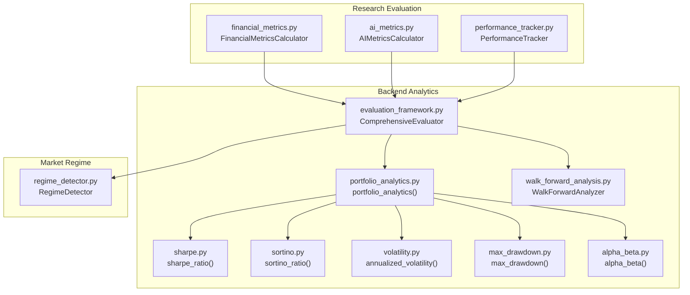
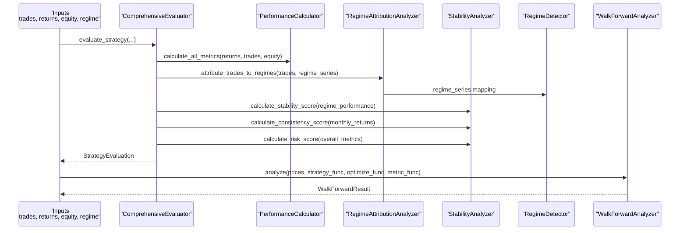
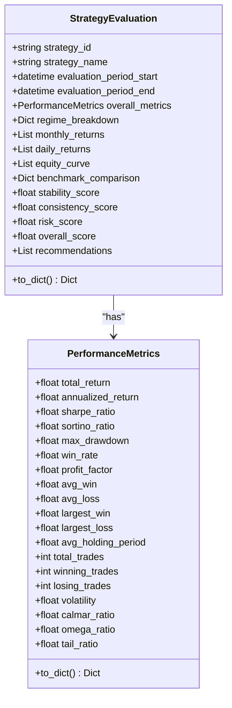
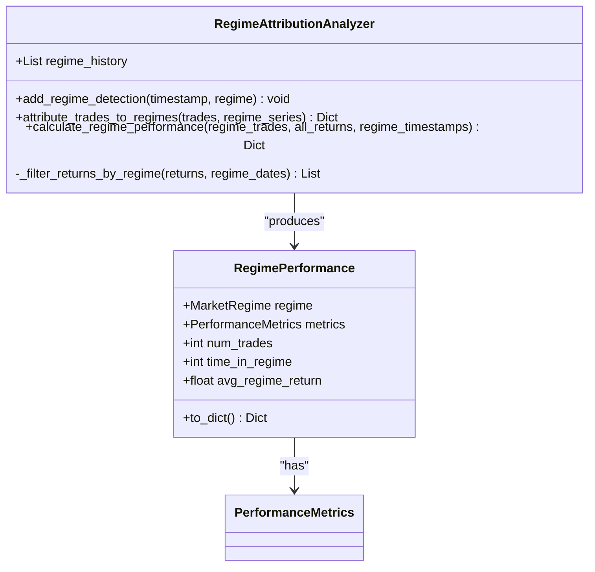
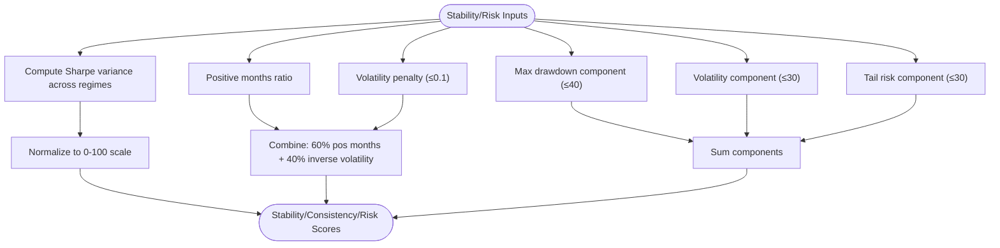
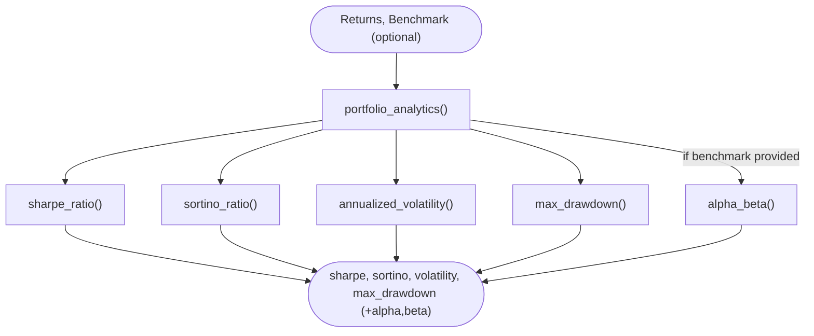
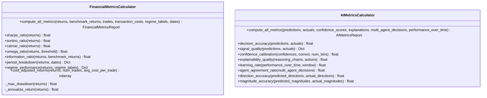
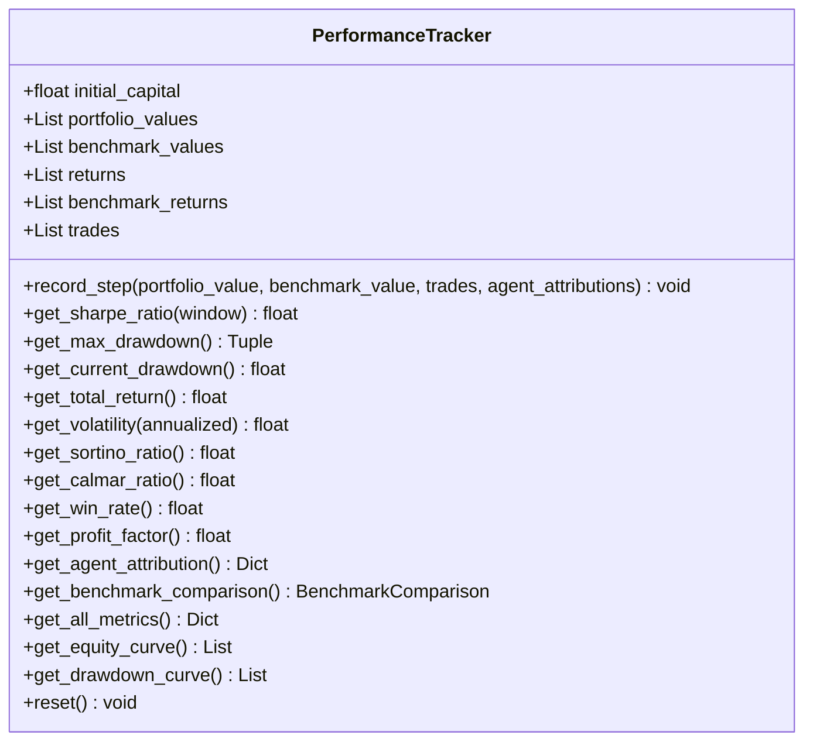
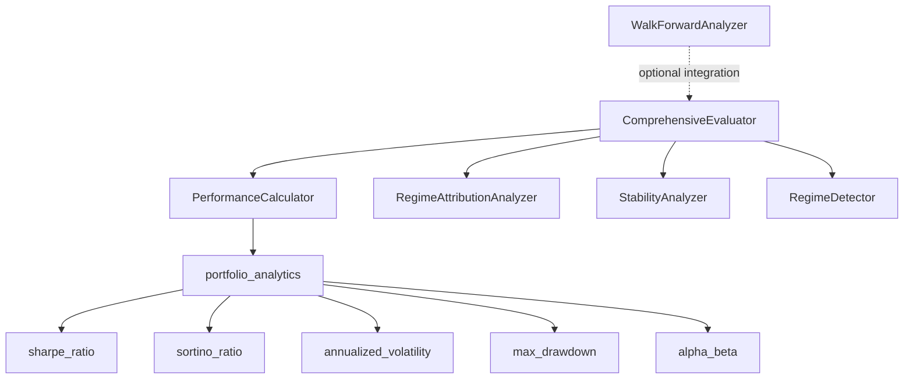

# Performance Analytics

<cite>
**Referenced Files in This Document**
- [evaluation_framework.py](file://backend/analytics/evaluation_framework.py)
- [walk_forward_analysis.py](file://backend/analytics/walk_forward_analysis.py)
- [portfolio_analytics.py](file://backend/analytics/portfolio_analytics.py)
- [sharpe.py](file://backend/analytics/sharpe.py)
- [sortino.py](file://backend/analytics/sortino.py)
- [volatility.py](file://backend/analytics/volatility.py)
- [max_drawdown.py](file://backend/analytics/max_drawdown.py)
- [alpha_beta.py](file://backend/analytics/alpha_beta.py)
- [regime_detector.py](file://backend/market/regime_detector.py)
- [financial_metrics.py](file://FinAgents/research/evaluation/financial_metrics.py)
- [ai_metrics.py](file://FinAgents/research/evaluation/ai_metrics.py)
- [performance_tracker.py](file://FinAgents/research/simulation/performance_tracker.py)
</cite>

## Table of Contents
1. [Introduction](#introduction)
2. [Project Structure](#project-structure)
3. [Core Components](#core-components)
4. [Architecture Overview](#architecture-overview)
5. [Detailed Component Analysis](#detailed-component-analysis)
6. [Dependency Analysis](#dependency-analysis)
7. [Performance Considerations](#performance-considerations)
8. [Troubleshooting Guide](#troubleshooting-guide)
9. [Conclusion](#conclusion)
10. [Appendices](#appendices)

## Introduction
This document describes the Performance Analytics system that evaluates trading strategies across multiple metrics, regimes, and time horizons. It covers the complete evaluation framework, including:
- Multi-metric performance evaluation (total return, annualized return, Sharpe ratio, Sortino ratio, maximum drawdown, win rate, profit factor, and advanced metrics)
- Regime-specific performance attribution
- Stability and consistency analysis
- Walk-forward analysis for out-of-sample testing and robustness validation
- Practical examples for strategy evaluation, interpretation, and reporting

The system integrates modular analytics components, a comprehensive evaluation engine, and walk-forward validation to produce actionable insights and recommendations.

## Project Structure
The Performance Analytics system spans several modules:
- Backend analytics: core metric calculators and evaluation framework
- Market regime detection: regime classification and attribution
- Research evaluation: extended financial and AI-specific metrics
- Simulation performance tracking: real-time performance computation and attribution



**Diagram sources**
- [evaluation_framework.py:507-796](file://backend/analytics/evaluation_framework.py#L507-L796)
- [portfolio_analytics.py:14-42](file://backend/analytics/portfolio_analytics.py#L14-L42)
- [sharpe.py:8-33](file://backend/analytics/sharpe.py#L8-L33)
- [sortino.py:9-41](file://backend/analytics/sortino.py#L9-L41)
- [volatility.py:9-28](file://backend/analytics/volatility.py#L9-L28)
- [max_drawdown.py:8-32](file://backend/analytics/max_drawdown.py#L8-L32)
- [alpha_beta.py:9-42](file://backend/analytics/alpha_beta.py#L9-L42)
- [walk_forward_analysis.py:65-425](file://backend/analytics/walk_forward_analysis.py#L65-L425)
- [regime_detector.py:101-790](file://backend/market/regime_detector.py#L101-L790)
- [financial_metrics.py:77-591](file://FinAgents/research/evaluation/financial_metrics.py#L77-L591)
- [ai_metrics.py:58-574](file://FinAgents/research/evaluation/ai_metrics.py#L58-L574)
- [performance_tracker.py:71-539](file://FinAgents/research/simulation/performance_tracker.py#L71-L539)

**Section sources**
- [evaluation_framework.py:1-796](file://backend/analytics/evaluation_framework.py#L1-L796)
- [walk_forward_analysis.py:1-425](file://backend/analytics/walk_forward_analysis.py#L1-L425)
- [portfolio_analytics.py:1-42](file://backend/analytics/portfolio_analytics.py#L1-L42)
- [regime_detector.py:1-809](file://backend/market/regime_detector.py#L1-L809)
- [financial_metrics.py:1-591](file://FinAgents/research/evaluation/financial_metrics.py#L1-L591)
- [ai_metrics.py:1-574](file://FinAgents/research/evaluation/ai_metrics.py#L1-L574)
- [performance_tracker.py:1-539](file://FinAgents/research/simulation/performance_tracker.py#L1-L539)

## Core Components
- StrategyEvaluation: encapsulates overall metrics, regime breakdown, stability, consistency, risk, and recommendations
- PerformanceMetrics: comprehensive set of performance measures including Sharpe, Sortino, drawdown, win rate, profit factor, and advanced ratios
- RegimePerformance: regime-level metrics and statistics
- ComprehensiveEvaluator: orchestrates metric calculation, regime attribution, stability analysis, and report generation
- WalkForwardAnalyzer: performs walk-forward validation with train/test splits, degradation analysis, and consistency scoring
- PerformanceCalculator: computes all performance metrics from returns, trades, and equity curves
- RegimeAttributionAnalyzer: maps trades to regimes and computes regime-specific performance
- StabilityAnalyzer: computes stability, consistency, and risk scores
- StrategyComparator: compares multiple strategies and ranks them
- PortfolioAnalytics: aggregates Sharpe, Sortino, volatility, and max drawdown; optionally alpha/beta vs benchmark
- RegimeDetector: classifies market regimes and provides recommendations and risk levels

**Section sources**
- [evaluation_framework.py:84-184](file://backend/analytics/evaluation_framework.py#L84-L184)
- [evaluation_framework.py:187-283](file://backend/analytics/evaluation_framework.py#L187-L283)
- [evaluation_framework.py:286-372](file://backend/analytics/evaluation_framework.py#L286-L372)
- [evaluation_framework.py:384-456](file://backend/analytics/evaluation_framework.py#L384-L456)
- [evaluation_framework.py:507-796](file://backend/analytics/evaluation_framework.py#L507-L796)
- [portfolio_analytics.py:14-42](file://backend/analytics/portfolio_analytics.py#L14-L42)
- [regime_detector.py:101-790](file://backend/market/regime_detector.py#L101-L790)

## Architecture Overview
The evaluation pipeline integrates data inputs (trades, returns, equity curves, regime series) with metric calculators and regime detectors to produce StrategyEvaluation outputs. Walk-forward analysis validates robustness across time.



**Diagram sources**
- [evaluation_framework.py:534-635](file://backend/analytics/evaluation_framework.py#L534-L635)
- [evaluation_framework.py:187-283](file://backend/analytics/evaluation_framework.py#L187-L283)
- [evaluation_framework.py:286-372](file://backend/analytics/evaluation_framework.py#L286-L372)
- [evaluation_framework.py:384-456](file://backend/analytics/evaluation_framework.py#L384-L456)
- [regime_detector.py:160-265](file://backend/market/regime_detector.py#L160-L265)
- [walk_forward_analysis.py:143-264](file://backend/analytics/walk_forward_analysis.py#L143-L264)

## Detailed Component Analysis

### StrategyEvaluation and PerformanceMetrics
- StrategyEvaluation holds overall metrics, regime breakdown, stability/consistency/risk scores, and recommendations
- PerformanceMetrics includes total return, annualized return, Sharpe, Sortino, max drawdown, win rate, profit factor, average/maximum win/loss, average holding period, counts, volatility, Calmar, Omega, and Tail ratios



**Diagram sources**
- [evaluation_framework.py:150-184](file://backend/analytics/evaluation_framework.py#L150-L184)
- [evaluation_framework.py:84-128](file://backend/analytics/evaluation_framework.py#L84-L128)

**Section sources**
- [evaluation_framework.py:84-184](file://backend/analytics/evaluation_framework.py#L84-L184)

### RegimePerformance and Regime Attribution
- RegimePerformance captures metrics, number of trades, time in regime, and average regime return
- RegimeAttributionAnalyzer maps trades to regimes via regime_series and computes regime-specific performance



**Diagram sources**
- [evaluation_framework.py:131-147](file://backend/analytics/evaluation_framework.py#L131-L147)
- [evaluation_framework.py:286-372](file://backend/analytics/evaluation_framework.py#L286-L372)
- [regime_detector.py:57-71](file://backend/market/regime_detector.py#L57-L71)

**Section sources**
- [evaluation_framework.py:131-147](file://backend/analytics/evaluation_framework.py#L131-L147)
- [evaluation_framework.py:286-372](file://backend/analytics/evaluation_framework.py#L286-L372)
- [regime_detector.py:57-71](file://backend/market/regime_detector.py#L57-L71)

### Stability and Risk Analysis
- StabilityAnalyzer computes stability score (variance of Sharpe across regimes), consistency score (positive months and volatility), and risk score (drawdown, volatility, tail risk)
- StrategyComparator compares strategies using weighted scores



**Diagram sources**
- [evaluation_framework.py:384-456](file://backend/analytics/evaluation_framework.py#L384-L456)

**Section sources**
- [evaluation_framework.py:384-505](file://backend/analytics/evaluation_framework.py#L384-L505)

### Walk-Forward Analysis
- WalkForwardAnalyzer generates rolling train/test windows, runs optimization and evaluation, aggregates metrics, and detects overfitting via degradation thresholds
- Includes consistency scoring and optional Monte Carlo bootstrap and path generation

```mermaid
sequenceDiagram
participant User as "Caller"
participant WFA as "WalkForwardAnalyzer"
participant Prices as "Price Series"
participant Strat as "strategy_func"
participant Opt as "optimize_func"
participant Met as "metric_func"
User->>WFA : generate_periods(start, end)
WFA-->>User : List of (train_start, train_end, test_start, test_end)
loop For each period
User->>WFA : analyze(...)
WFA->>Prices : extract train/test slices
WFA->>Opt : optimize(train_prices)
Opt-->>WFA : optimal_params
WFA->>Strat : run on train (train_prices, optimal_params)
Strat-->>WFA : train_trades
WFA->>Met : compute metrics(train_trades)
Met-->>WFA : train_metrics
WFA->>Strat : run on test (test_prices, optimal_params)
Strat-->>WFA : test_trades
WFA->>Met : compute metrics(test_trades)
Met-->>WFA : test_metrics
end
WFA-->>User : WalkForwardResult (avg train/test Sharpe/return, degradation, consistency)
```

**Diagram sources**
- [walk_forward_analysis.py:103-141](file://backend/analytics/walk_forward_analysis.py#L103-L141)
- [walk_forward_analysis.py:143-264](file://backend/analytics/walk_forward_analysis.py#L143-L264)
- [walk_forward_analysis.py:276-299](file://backend/analytics/walk_forward_analysis.py#L276-L299)

**Section sources**
- [walk_forward_analysis.py:65-425](file://backend/analytics/walk_forward_analysis.py#L65-L425)

### Performance Metrics Calculation Pipeline
- PortfolioAnalytics delegates to individual metric functions and optionally computes alpha/beta vs benchmark
- Individual metric modules implement Sharpe, Sortino, volatility, max drawdown, and alpha/beta



**Diagram sources**
- [portfolio_analytics.py:14-42](file://backend/analytics/portfolio_analytics.py#L14-L42)
- [sharpe.py:8-33](file://backend/analytics/sharpe.py#L8-L33)
- [sortino.py:9-41](file://backend/analytics/sortino.py#L9-L41)
- [volatility.py:9-28](file://backend/analytics/volatility.py#L9-L28)
- [max_drawdown.py:8-32](file://backend/analytics/max_drawdown.py#L8-L32)
- [alpha_beta.py:9-42](file://backend/analytics/alpha_beta.py#L9-L42)

**Section sources**
- [portfolio_analytics.py:14-42](file://backend/analytics/portfolio_analytics.py#L14-L42)
- [sharpe.py:8-33](file://backend/analytics/sharpe.py#L8-L33)
- [sortino.py:9-41](file://backend/analytics/sortino.py#L9-L41)
- [volatility.py:9-28](file://backend/analytics/volatility.py#L9-L28)
- [max_drawdown.py:8-32](file://backend/analytics/max_drawdown.py#L8-L32)
- [alpha_beta.py:9-42](file://backend/analytics/alpha_beta.py#L9-L42)

### Extended Research Metrics and AI Metrics
- FinancialMetricsCalculator computes Sharpe, Sortino, Calmar, Omega, period breakdowns, regime performance, cost-adjusted returns, and trade-based metrics
- AIMetricsCalculator evaluates agent decision quality, confidence calibration, explainability, learning rate, agreement rate, and directional/predictive accuracy



**Diagram sources**
- [financial_metrics.py:77-591](file://FinAgents/research/evaluation/financial_metrics.py#L77-L591)
- [ai_metrics.py:58-574](file://FinAgents/research/evaluation/ai_metrics.py#L58-L574)

**Section sources**
- [financial_metrics.py:77-591](file://FinAgents/research/evaluation/financial_metrics.py#L77-L591)
- [ai_metrics.py:58-574](file://FinAgents/research/evaluation/ai_metrics.py#L58-L574)

### Real-Time Performance Tracking
- PerformanceTracker maintains portfolio values, returns, trades, and agent attributions; computes Sharpe, Sortino, Calmar, drawdowns, win rate, profit factor, and benchmark comparison



**Diagram sources**
- [performance_tracker.py:71-539](file://FinAgents/research/simulation/performance_tracker.py#L71-L539)

**Section sources**
- [performance_tracker.py:71-539](file://FinAgents/research/simulation/performance_tracker.py#L71-L539)

## Dependency Analysis
- ComprehensiveEvaluator depends on PerformanceCalculator, RegimeAttributionAnalyzer, StabilityAnalyzer, and RegimeDetector
- PerformanceCalculator depends on portfolio_analytics, which in turn depends on sharpe, sortino, volatility, max_drawdown, and alpha_beta
- WalkForwardAnalyzer is independent and can be used standalone or integrated with evaluation workflows
- Research modules (financial_metrics, ai_metrics, performance_tracker) complement the backend evaluation with extended analytics



**Diagram sources**
- [evaluation_framework.py:507-796](file://backend/analytics/evaluation_framework.py#L507-L796)
- [portfolio_analytics.py:14-42](file://backend/analytics/portfolio_analytics.py#L14-L42)
- [sharpe.py:8-33](file://backend/analytics/sharpe.py#L8-L33)
- [sortino.py:9-41](file://backend/analytics/sortino.py#L9-L41)
- [volatility.py:9-28](file://backend/analytics/volatility.py#L9-L28)
- [max_drawdown.py:8-32](file://backend/analytics/max_drawdown.py#L8-L32)
- [alpha_beta.py:9-42](file://backend/analytics/alpha_beta.py#L9-L42)
- [walk_forward_analysis.py:65-425](file://backend/analytics/walk_forward_analysis.py#L65-L425)

**Section sources**
- [evaluation_framework.py:507-796](file://backend/analytics/evaluation_framework.py#L507-L796)
- [portfolio_analytics.py:14-42](file://backend/analytics/portfolio_analytics.py#L14-L42)

## Performance Considerations
- Metric computation assumes sufficient data; functions return safe defaults when data is insufficient
- Annualization uses 252 trading days; adjust periods_per_year as needed for different frequencies
- Regime attribution relies on aligned timestamps; missing regime data falls back to nearest prior
- Walk-forward windows should be chosen to balance statistical power and computational cost
- Monte Carlo simulations introduce randomness; set seeds for reproducibility

[No sources needed since this section provides general guidance]

## Troubleshooting Guide
Common issues and resolutions:
- Insufficient data for metrics: ensure returns/trades arrays are non-empty and sufficiently long
- Zero or near-zero volatility: Sharpe/Sortino may be undefined; verify returns variability
- Missing regime timestamps: analyzer falls back to closest prior; align regime_series timestamps
- Overfitting detection: monitor walk-forward degradation; consider shorter windows or regularization
- Benchmark mismatch: ensure benchmark length equals returns length for alpha/beta computation

**Section sources**
- [evaluation_framework.py:190-201](file://backend/analytics/evaluation_framework.py#L190-L201)
- [evaluation_framework.py:309-322](file://backend/analytics/evaluation_framework.py#L309-L322)
- [portfolio_analytics.py:35-41](file://backend/analytics/portfolio_analytics.py#L35-L41)
- [walk_forward_analysis.py:134-138](file://backend/analytics/walk_forward_analysis.py#L134-L138)

## Conclusion
The Performance Analytics system provides a robust, modular framework for evaluating trading strategies. It combines comprehensive performance metrics, regime-aware attribution, stability analysis, and walk-forward validation to deliver reliable insights. Extended research metrics and real-time tracking further enhance interpretability and operational visibility.

[No sources needed since this section summarizes without analyzing specific files]

## Appendices

### Practical Examples

- Evaluating a strategy with ComprehensiveEvaluator:
  - Prepare trades, daily returns, equity curve, and regime_series
  - Instantiate ComprehensiveEvaluator and call evaluate_strategy
  - Export JSON or text report using export_evaluation_report

- Performing walk-forward analysis:
  - Create WalkForwardAnalyzer with desired window sizes
  - Provide price series and strategy function
  - Optionally supply optimize_func and metric_func
  - Inspect WalkForwardResult for aggregated metrics and overfitting indicators

- Interpreting performance metrics:
  - Sharpe/Sortino: higher is generally better; consider stability across regimes
  - Max drawdown: assess downside risk tolerance
  - Win rate/profit factor: balance signal quality and risk/reward
  - Calmar/Omega/Tail ratios: evaluate return distribution characteristics

- Generating comprehensive reports:
  - Use StrategyEvaluation.to_dict() for structured JSON
  - Use export_evaluation_report(format='text') for human-readable summaries
  - Include regime breakdown and recommendations for actionable insights

**Section sources**
- [evaluation_framework.py:702-790](file://backend/analytics/evaluation_framework.py#L702-L790)
- [walk_forward_analysis.py:143-264](file://backend/analytics/walk_forward_analysis.py#L143-L264)