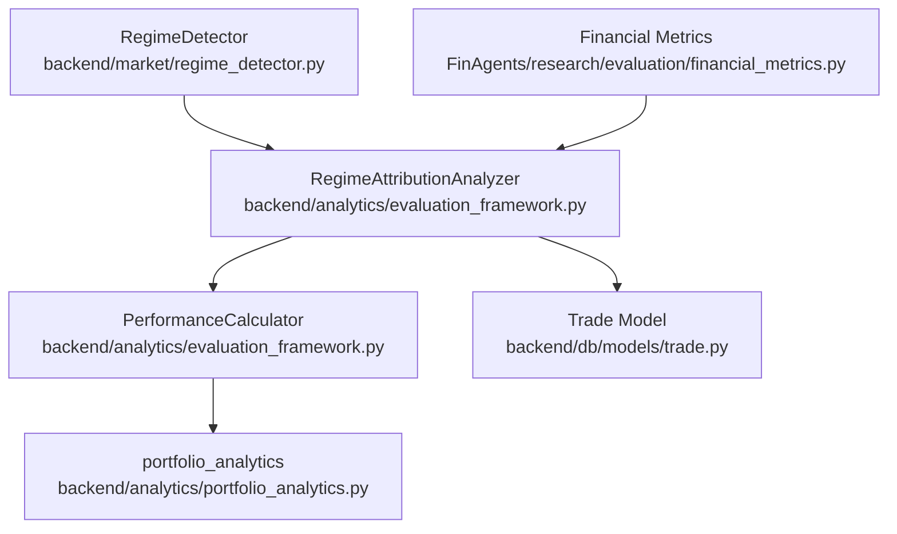
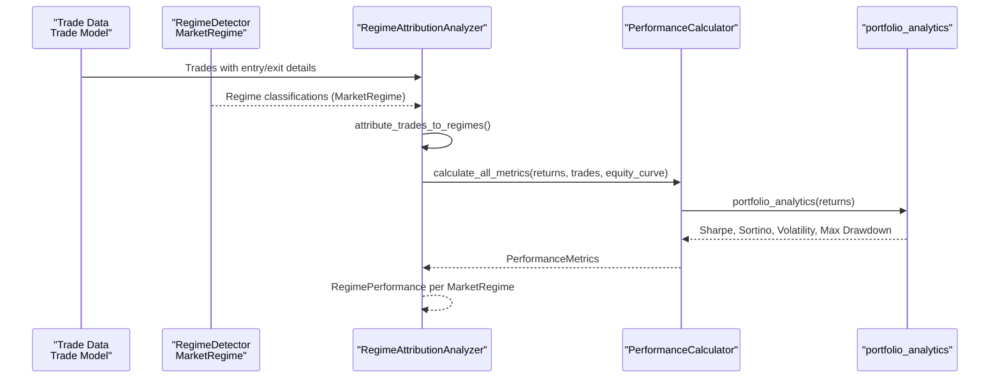
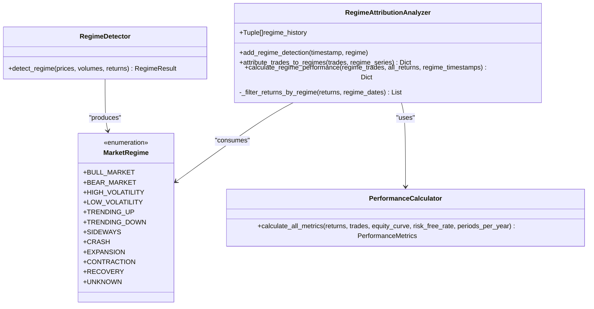
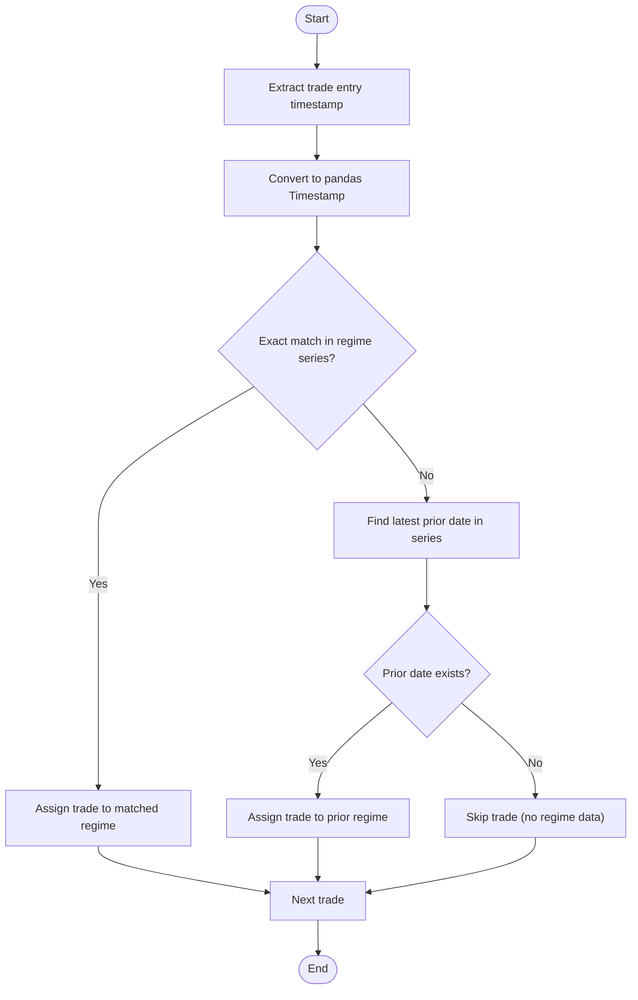
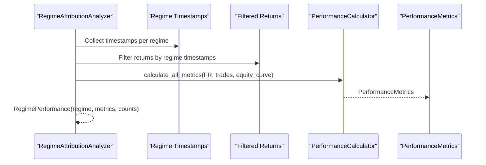
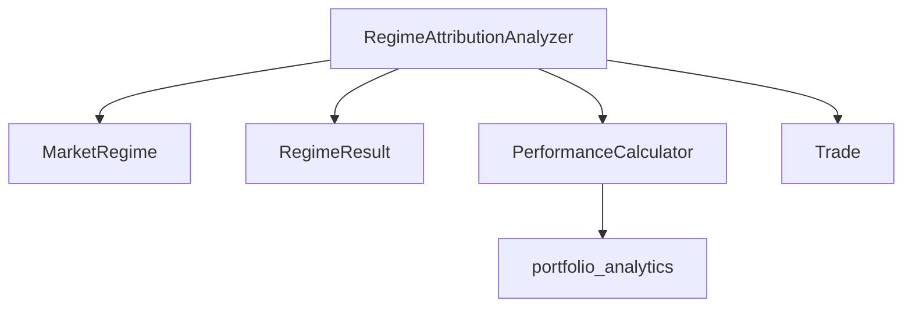

# Regime Attribution Analysis

<cite>
**Referenced Files in This Document**
- [regime_detector.py](file://backend/market/regime_detector.py)
- [evaluation_framework.py](file://backend/analytics/evaluation_framework.py)
- [portfolio_analytics.py](file://backend/analytics/portfolio_analytics.py)
- [trade.py](file://backend/db/models/trade.py)
- [financial_metrics.py](file://FinAgents/research/evaluation/financial_metrics.py)
- [trade_memory.py](file://FinAgents/research/memory_learning/trade_memory.py)
- [market_environment.py](file://FinAgents/research/simulation/market_environment.py)
- [phase8_system_integration_test.py](file://tests/phase8_system_integration_test.py)
</cite>

## Table of Contents
1. [Introduction](#introduction)
2. [Project Structure](#project-structure)
3. [Core Components](#core-components)
4. [Architecture Overview](#architecture-overview)
5. [Detailed Component Analysis](#detailed-component-analysis)
6. [Dependency Analysis](#dependency-analysis)
7. [Performance Considerations](#performance-considerations)
8. [Troubleshooting Guide](#troubleshooting-guide)
9. [Conclusion](#conclusion)

## Introduction
This document provides a comprehensive guide to Regime Attribution Analysis within the Agentic Trading Application. It focuses on the RegimeAttributionAnalyzer class architecture, market regime-aware performance evaluation, and the integration with the RegimeDetector system. The analysis covers regime detection integration, trade-to-regime mapping algorithms, regime-specific performance calculations, and practical workflows for interpreting results. It also addresses regime detection accuracy, temporal alignment challenges, and strategies for handling regime transitions.

## Project Structure
The Regime Attribution Analysis spans several modules:
- Market Regime Detection: Provides MarketRegime enumeration and RegimeResult data structures used by the analyzer.
- Performance Evaluation: Implements RegimeAttributionAnalyzer and PerformanceCalculator for regime-specific metrics.
- Trade Models: Defines Trade data structures consumed by the analyzer.
- Supporting Analytics: Provides portfolio analytics used by the performance calculator.
- Research Modules: Additional implementations and simulations for regime performance analysis.

**Diagram sources**
- [regime_detector.py:57-98](file://backend/market/regime_detector.py#L57-L98)
- [evaluation_framework.py:187-284](file://backend/analytics/evaluation_framework.py#L187-L284)
- [portfolio_analytics.py:14-42](file://backend/analytics/portfolio_analytics.py#L14-L42)
- [trade.py:6-20](file://backend/db/models/trade.py#L6-L20)
- [financial_metrics.py:426-447](file://FinAgents/research/evaluation/financial_metrics.py#L426-L447)

**Section sources**
- [regime_detector.py:57-98](file://backend/market/regime_detector.py#L57-L98)
- [evaluation_framework.py:187-284](file://backend/analytics/evaluation_framework.py#L187-L284)
- [portfolio_analytics.py:14-42](file://backend/analytics/portfolio_analytics.py#L14-L42)
- [trade.py:6-20](file://backend/db/models/trade.py#L6-L20)
- [financial_metrics.py:426-447](file://FinAgents/research/evaluation/financial_metrics.py#L426-L447)

## Core Components
- MarketRegime Enumeration: Defines discrete market states used for regime attribution.
- RegimeResult Data Structure: Encapsulates regime detection outcomes, confidence, and recommendations.
- RegimeAttributionAnalyzer: Maps trades to regimes and computes regime-specific performance metrics.
- PerformanceCalculator: Computes comprehensive performance metrics from return series.
- Trade Model: Represents individual trades with entry/exit details used for attribution.

Key responsibilities:
- Regime detection integration via MarketRegime and RegimeResult.
- Trade-to-regime mapping using temporal alignment and fallback mechanisms.
- Regime-specific performance computation leveraging portfolio analytics.

**Section sources**
- [regime_detector.py:57-98](file://backend/market/regime_detector.py#L57-L98)
- [evaluation_framework.py:187-284](file://backend/analytics/evaluation_framework.py#L187-L284)
- [evaluation_framework.py:286-382](file://backend/analytics/evaluation_framework.py#L286-L382)
- [trade.py:6-20](file://backend/db/models/trade.py#L6-L20)

## Architecture Overview
The Regime Attribution Analysis integrates regime detection with performance evaluation to attribute strategy performance to specific market conditions. The RegimeDetector produces MarketRegime classifications and confidence scores, while the RegimeAttributionAnalyzer consumes these regimes alongside trade data to compute regime-specific metrics.

**Diagram sources**
- [regime_detector.py:160-265](file://backend/market/regime_detector.py#L160-L265)
- [evaluation_framework.py:286-382](file://backend/analytics/evaluation_framework.py#L286-L382)
- [evaluation_framework.py:187-284](file://backend/analytics/evaluation_framework.py#L187-L284)
- [portfolio_analytics.py:14-42](file://backend/analytics/portfolio_analytics.py#L14-L42)

## Detailed Component Analysis

### RegimeAttributionAnalyzer Class
The RegimeAttributionAnalyzer orchestrates regime-aware performance evaluation:
- Maintains a history of regime detections for temporal alignment.
- Maps trades to regimes using exact timestamp matching with fallback to the most recent prior regime.
- Computes regime-specific performance metrics using PerformanceCalculator and portfolio analytics.

Key methods and logic:
- add_regime_detection: Records regime timestamps for alignment.
- attribute_trades_to_regimes: Aligns trades with regimes using pandas Timestamp comparison and prior-date fallback.
- calculate_regime_performance: Filters returns by regime timestamps, constructs equity curves, and calculates metrics.
- _filter_returns_by_regime: Simplified filtering mechanism requiring refinement for production-grade date matching.

**Diagram sources**
- [evaluation_framework.py:286-382](file://backend/analytics/evaluation_framework.py#L286-L382)
- [evaluation_framework.py:187-284](file://backend/analytics/evaluation_framework.py#L187-L284)
- [regime_detector.py:57-71](file://backend/market/regime_detector.py#L57-L71)

**Section sources**
- [evaluation_framework.py:286-382](file://backend/analytics/evaluation_framework.py#L286-L382)
- [evaluation_framework.py:187-284](file://backend/analytics/evaluation_framework.py#L187-L284)
- [regime_detector.py:57-71](file://backend/market/regime_detector.py#L57-L71)

### MarketRegime Enumeration Values and Characteristics
The MarketRegime enumeration defines discrete market states used for attribution:
- BULL_MARKET: Strong upward trend with low volatility.
- BEAR_MARKET: Strong downward trend with high volatility.
- HIGH_VOLATILITY: Elevated uncertainty with large price swings.
- LOW_VOLATILITY: Calm markets with small price movements.
- TRENDING_UP: Clear upward momentum.
- TRENDING_DOWN: Clear downward momentum.
- SIDEWAYS: Range-bound conditions with no clear direction.
- CRASH: Extreme downward movement with panic.
- EXPANSION: Economic growth phase.
- CONTRACTION: Economic decline phase.
- RECOVERY: Post-crisis recovery.
- UNKNOWN: Insufficient data or unclear regime.

These values inform both regime detection and attribution workflows.

**Section sources**
- [regime_detector.py:57-71](file://backend/market/regime_detector.py#L57-L71)

### Trade-to-Regime Mapping Algorithm
The attribute_trades_to_regimes method aligns trades with regimes:
- Converts trade entry timestamps to pandas Timestamp for comparison.
- Attempts exact timestamp lookup in the regime series.
- Falls back to the most recent prior regime if an exact match is unavailable.
- Aggregates trades into a dictionary keyed by MarketRegime.

Temporal alignment considerations:
- Requires aligned timestamps between trade entries and regime series.
- Fallback to prior regime mitigates missing data gaps but may misclassify trades during regime transitions.

**Diagram sources**
- [evaluation_framework.py:300-323](file://backend/analytics/evaluation_framework.py#L300-L323)

**Section sources**
- [evaluation_framework.py:300-323](file://backend/analytics/evaluation_framework.py#L300-L323)

### Regime-Specific Performance Calculation
The calculate_regime_performance method computes metrics for each regime:
- Filters returns to periods matching regime timestamps.
- Constructs regime equity curves from filtered returns.
- Calls PerformanceCalculator.calculate_all_metrics to compute comprehensive metrics.
- Captures regime statistics: number of trades, time in regime, average regime return.

**Diagram sources**
- [evaluation_framework.py:325-372](file://backend/analytics/evaluation_framework.py#L325-L372)
- [evaluation_framework.py:187-284](file://backend/analytics/evaluation_framework.py#L187-L284)

**Section sources**
- [evaluation_framework.py:325-372](file://backend/analytics/evaluation_framework.py#L325-L372)
- [evaluation_framework.py:187-284](file://backend/analytics/evaluation_framework.py#L187-L284)

### Practical Examples and Workflows
Example workflow for regime analysis:
- Data Preparation:
  - Obtain trade records with entry/exit timestamps and prices.
  - Generate regime series using RegimeDetector.detect_regime on aligned price/volume data.
- Execution:
  - Use RegimeAttributionAnalyzer.attribute_trades_to_regimes to map trades to regimes.
  - Compute regime-specific performance via calculate_regime_performance.
- Interpretation:
  - Analyze Sharpe, Sortino, volatility, and drawdown across regimes.
  - Evaluate stability and consistency scores for strategy robustness.

Integration examples:
- Synthetic regime scenarios validated in system tests demonstrate detection of bull/bear regimes and low/high volatility conditions.

**Section sources**
- [phase8_system_integration_test.py:397-429](file://tests/phase8_system_integration_test.py#L397-L429)
- [regime_detector.py:160-265](file://backend/market/regime_detector.py#L160-L265)

### Alternative Implementations and Extensions
Additional implementations provide complementary approaches:
- Financial metrics module supports regime performance calculations with period-wise aggregation.
- Trade memory module demonstrates regime-based performance grouping and strategy attribution.
- Market simulation module exposes regime states for controlled experiments.

**Section sources**
- [financial_metrics.py:426-447](file://FinAgents/research/evaluation/financial_metrics.py#L426-L447)
- [trade_memory.py:559-621](file://FinAgents/research/memory_learning/trade_memory.py#L559-L621)
- [market_environment.py:678-722](file://FinAgents/research/simulation/market_environment.py#L678-L722)

## Dependency Analysis
The RegimeAttributionAnalyzer depends on:
- MarketRegime and RegimeResult from the regime detection module.
- PerformanceCalculator and portfolio_analytics for metrics computation.
- Trade models for trade data structures.

**Diagram sources**
- [evaluation_framework.py:50-50](file://backend/analytics/evaluation_framework.py#L50-L50)
- [evaluation_framework.py:187-284](file://backend/analytics/evaluation_framework.py#L187-L284)
- [regime_detector.py:57-98](file://backend/market/regime_detector.py#L57-L98)

**Section sources**
- [evaluation_framework.py:50-50](file://backend/analytics/evaluation_framework.py#L50-L50)
- [evaluation_framework.py:187-284](file://backend/analytics/evaluation_framework.py#L187-L284)
- [regime_detector.py:57-98](file://backend/market/regime_detector.py#L57-L98)

## Performance Considerations
- Temporal Alignment Precision: Accurate timestamp matching is critical for reliable attribution. Consider using business-day alignment and timezone-aware timestamps.
- Data Completeness: Handle missing regime data gracefully using prior-date fallbacks, but track unmatched trades for review.
- Computational Efficiency: Batch process trades and regimes to minimize repeated lookups. Cache regime series where feasible.
- Metric Robustness: Use sufficient return periods per regime to ensure stable Sharpe, Sortino, and drawdown estimates.

## Troubleshooting Guide
Common issues and resolutions:
- Missing Regime Data: If a trade's entry timestamp has no regime record, the analyzer falls back to the most recent prior regime. Validate data frequency and ensure regime series covers the trade timeline.
- Misaligned Timestamps: Ensure trade timestamps and regime series share the same frequency and timezone. Use pandas Timestamp conversion consistently.
- Insufficient Returns: PerformanceCalculator requires at least two return observations. Aggregate returns to appropriate frequencies (daily/weekly/monthly) to meet this requirement.
- Transition Periods: During regime transitions, trades may be attributed to the prior regime. Consider windowing techniques to mitigate transition bias.

**Section sources**
- [evaluation_framework.py:300-323](file://backend/analytics/evaluation_framework.py#L300-L323)
- [evaluation_framework.py:190-201](file://backend/analytics/evaluation_framework.py#L190-L201)

## Conclusion
The RegimeAttributionAnalyzer enables market regime-aware performance evaluation by integrating regime detection with trade-level attribution and comprehensive metrics computation. By aligning trade timestamps with regime series and leveraging portfolio analytics, it provides insights into strategy performance across different market conditions. Proper data preparation, temporal alignment, and handling of regime transitions are essential for accurate and actionable results.