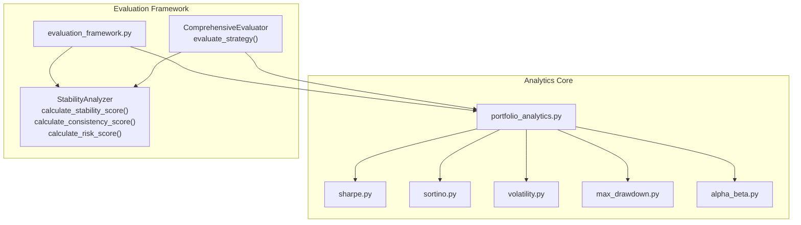
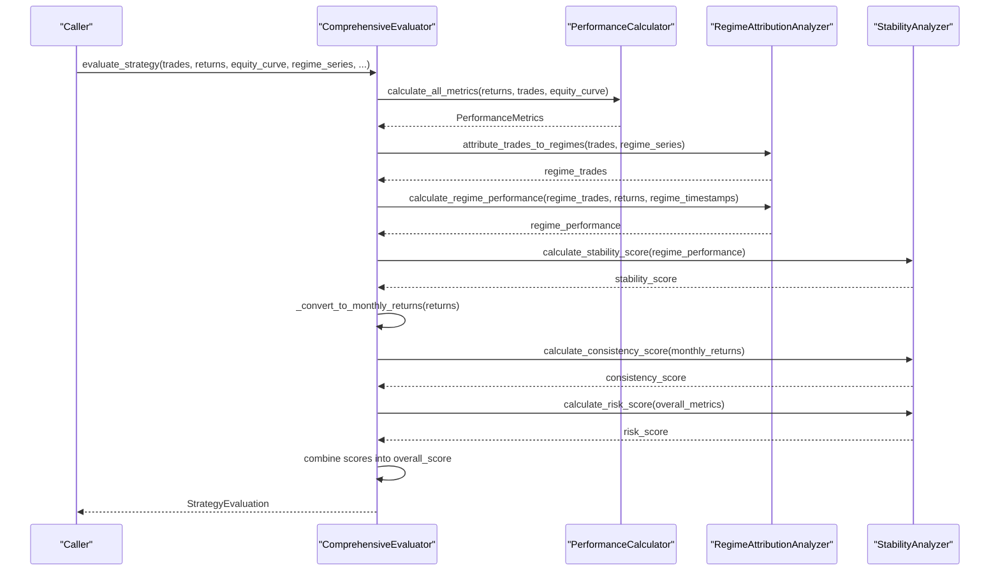
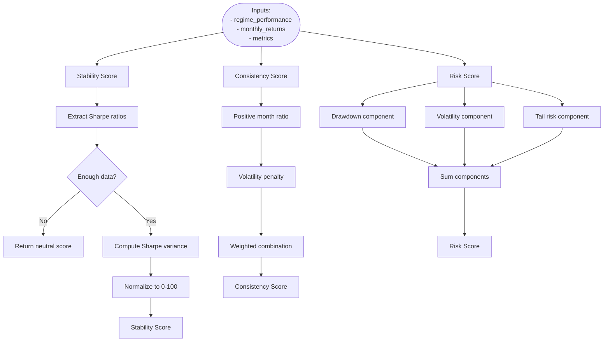
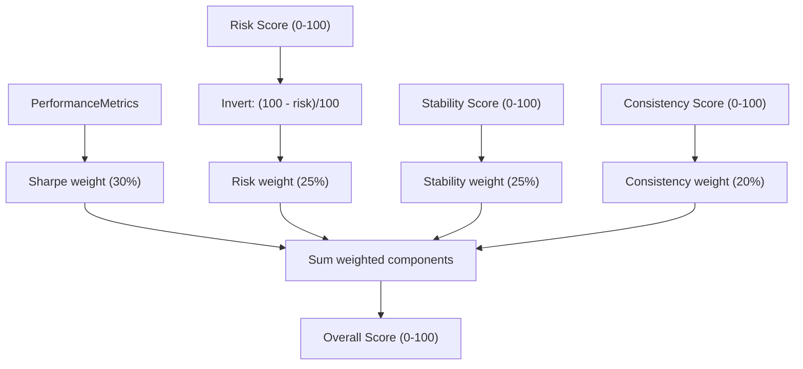
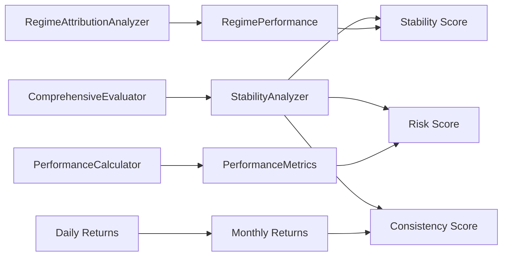

# Stability and Consistency Scoring

<cite>
**Referenced Files in This Document**
- [evaluation_framework.py](file://backend/analytics/evaluation_framework.py)
- [portfolio_analytics.py](file://backend/analytics/portfolio_analytics.py)
- [sharpe.py](file://backend/analytics/sharpe.py)
- [sortino.py](file://backend/analytics/sortino.py)
- [volatility.py](file://backend/analytics/volatility.py)
- [max_drawdown.py](file://backend/analytics/max_drawdown.py)
- [alpha_beta.py](file://backend/analytics/alpha_beta.py)
</cite>

## Table of Contents
1. [Introduction](#introduction)
2. [Project Structure](#project-structure)
3. [Core Components](#core-components)
4. [Architecture Overview](#architecture-overview)
5. [Detailed Component Analysis](#detailed-component-analysis)
6. [Dependency Analysis](#dependency-analysis)
7. [Performance Considerations](#performance-considerations)
8. [Troubleshooting Guide](#troubleshooting-guide)
9. [Conclusion](#conclusion)

## Introduction
This document explains the Stability and Consistency Scoring subsystem used to assess strategy robustness and reliability. It focuses on three core metrics:
- Stability Score: measures performance consistency across market regimes using Sharpe ratio variance.
- Consistency Score: evaluates return stream smoothness and predictability across monthly horizons.
- Risk Score: quantifies downside risk exposure via drawdown, volatility, and tail risk.

It also documents the composite scoring methodology that combines these factors into an overall strategy evaluation, along with interpretation guidelines, practical examples, and best practices for score-based strategy ranking.

## Project Structure
The stability and consistency scoring is implemented within the analytics evaluation framework. Supporting financial analytics modules provide the underlying metrics used by the scoring functions.

**Diagram sources**
- [evaluation_framework.py:384-456](file://backend/analytics/evaluation_framework.py#L384-L456)
- [portfolio_analytics.py:14-42](file://backend/analytics/portfolio_analytics.py#L14-L42)
- [sharpe.py:8-33](file://backend/analytics/sharpe.py#L8-L33)
- [sortino.py:9-41](file://backend/analytics/sortino.py#L9-L41)
- [volatility.py:9-28](file://backend/analytics/volatility.py#L9-L28)
- [max_drawdown.py:8-32](file://backend/analytics/max_drawdown.py#L8-L32)
- [alpha_beta.py:9-42](file://backend/analytics/alpha_beta.py#L9-L42)

**Section sources**
- [evaluation_framework.py:1-796](file://backend/analytics/evaluation_framework.py#L1-L796)
- [portfolio_analytics.py:1-42](file://backend/analytics/portfolio_analytics.py#L1-L42)

## Core Components
- StabilityAnalyzer: Implements three scoring functions:
  - calculate_stability_score: Variance of Sharpe ratios across regimes.
  - calculate_consistency_score: Smoothness of monthly returns using positive-month ratio and volatility penalty.
  - calculate_risk_score: Composite risk score from drawdown, volatility, and tail risk.
- ComprehensiveEvaluator: Orchestrates evaluation pipeline, including regime attribution, metric computation, and composite scoring.

Key responsibilities:
- Transform daily returns to monthly returns for consistency scoring.
- Compute overall performance metrics via portfolio_analytics.
- Aggregate scores into an overall strategy evaluation with recommendations.

**Section sources**
- [evaluation_framework.py:384-456](file://backend/analytics/evaluation_framework.py#L384-L456)
- [evaluation_framework.py:507-796](file://backend/analytics/evaluation_framework.py#L507-L796)

## Architecture Overview
The evaluation pipeline integrates raw returns, trade data, and regime annotations to produce a ranked strategy assessment.

**Diagram sources**
- [evaluation_framework.py:507-636](file://backend/analytics/evaluation_framework.py#L507-L636)

## Detailed Component Analysis

### StabilityAnalyzer
The StabilityAnalyzer encapsulates three scoring functions used to quantify strategy robustness and risk exposure.

- calculate_stability_score
  - Purpose: Measure consistency across market regimes using Sharpe ratio variance.
  - Inputs: RegimePerformance dictionary keyed by MarketRegime.
  - Algorithm:
    - Extract Sharpe ratios across regimes.
    - Compute variance of Sharpe ratios.
    - Normalize to 0–100 scale assuming a variance threshold for “good” stability.
  - Edge cases:
    - Empty or insufficient regimes yield a neutral score.
  - Interpretation:
    - Higher score indicates more consistent performance across regimes.
    - Useful for identifying regime-dependent strategies.

- calculate_consistency_score
  - Purpose: Evaluate return stream smoothness across monthly horizons.
  - Inputs: List of monthly returns.
  - Algorithm:
    - Compute proportion of positive months.
    - Penalize high return volatility using a capped penalty based on standard deviation.
    - Weighted linear combination of smoothness and volatility components.
  - Edge cases:
    - Insufficient data yields a low score.
  - Interpretation:
    - Higher score indicates smoother, more predictable monthly returns.

- calculate_risk_score
  - Purpose: Quantify downside risk exposure across drawdown, volatility, and tail risk.
  - Inputs: PerformanceMetrics object.
  - Algorithm:
    - Drawdown component: scales with absolute maximum drawdown.
    - Volatility component: scales with annualized volatility.
    - Tail risk component: derived from inverse of tail ratio with a cap.
    - Sum components into a total risk score (0–100, lower is better).
  - Interpretation:
    - Lower score indicates lower downside risk exposure.

**Diagram sources**
- [evaluation_framework.py:387-455](file://backend/analytics/evaluation_framework.py#L387-L455)

**Section sources**
- [evaluation_framework.py:384-456](file://backend/analytics/evaluation_framework.py#L384-L456)

### Composite Scoring Methodology
The overall strategy evaluation aggregates multiple metrics into a single score and provides recommendations.

- Inputs:
  - PerformanceMetrics (computed from returns).
  - RegimePerformance (Sharpe ratios per regime).
  - Monthly returns (for consistency).
- Normalization and weights:
  - Sharpe normalized to a 0–10 scale and weighted at 30%.
  - Risk score inverted and normalized (lower is better) at 25%.
  - Stability score normalized at 25%.
  - Consistency score normalized at 20%.
- Output:
  - overall_score scaled to 0–100.
  - recommendations synthesized from multiple signals.

**Diagram sources**
- [evaluation_framework.py:579-585](file://backend/analytics/evaluation_framework.py#L579-L585)

**Section sources**
- [evaluation_framework.py:507-636](file://backend/analytics/evaluation_framework.py#L507-L636)

### Supporting Analytics Modules
The StabilityAnalyzer relies on standardized financial analytics for Sharpe, Sortino, volatility, drawdown, and alpha-beta computations.

- Sharpe ratio: annualized excess return per unit of volatility.
- Sortino ratio: annualized excess return per unit of downside deviation.
- Volatility: annualized standard deviation of returns.
- Max drawdown: largest peak-to-trough decline in cumulative returns.
- Alpha/Beta: CAPM-style alpha and beta versus a benchmark.

These functions are composed into portfolio_analytics, which StabilityAnalyzer consumes indirectly via PerformanceMetrics.

**Section sources**
- [sharpe.py:8-33](file://backend/analytics/sharpe.py#L8-L33)
- [sortino.py:9-41](file://backend/analytics/sortino.py#L9-L41)
- [volatility.py:9-28](file://backend/analytics/volatility.py#L9-L28)
- [max_drawdown.py:8-32](file://backend/analytics/max_drawdown.py#L8-L32)
- [alpha_beta.py:9-42](file://backend/analytics/alpha_beta.py#L9-L42)
- [portfolio_analytics.py:14-42](file://backend/analytics/portfolio_analytics.py#L14-L42)

## Dependency Analysis
The StabilityAnalyzer depends on:
- RegimePerformance objects (from RegimeAttributionAnalyzer).
- PerformanceMetrics (from PerformanceCalculator).
- Monthly returns computed from daily returns.

**Diagram sources**
- [evaluation_framework.py:286-382](file://backend/analytics/evaluation_framework.py#L286-L382)
- [evaluation_framework.py:384-456](file://backend/analytics/evaluation_framework.py#L384-L456)
- [evaluation_framework.py:507-636](file://backend/analytics/evaluation_framework.py#L507-L636)

**Section sources**
- [evaluation_framework.py:286-382](file://backend/analytics/evaluation_framework.py#L286-L382)
- [evaluation_framework.py:384-456](file://backend/analytics/evaluation_framework.py#L384-L456)
- [evaluation_framework.py:507-636](file://backend/analytics/evaluation_framework.py#L507-L636)

## Performance Considerations
- Computational complexity:
  - Stability score: O(N) to collect Sharpe ratios plus O(N) variance computation for N regimes.
  - Consistency score: O(M) for M monthly returns (positive ratio and std).
  - Risk score: O(1) per metric component.
- Data sufficiency:
  - Stability requires at least two regimes with non-zero Sharpe ratios.
  - Consistency requires at least three monthly returns.
  - Risk score uses metrics produced by portfolio_analytics; ensure sufficient return samples for reliable estimates.
- Normalization thresholds:
  - Stability normalization assumes a variance threshold for “good” stability; adjust thresholds based on historical market characteristics.
  - Risk score caps are chosen to keep the total bounded; tune caps to reflect risk tolerance.

[No sources needed since this section provides general guidance]

## Troubleshooting Guide
Common issues and remedies:
- Stability score is neutral:
  - Cause: Insufficient regimes or missing Sharpe values.
  - Fix: Ensure regime annotations and sufficient trade activity across regimes.
- Consistency score is low:
  - Cause: High return volatility or few positive months.
  - Fix: Review entry/exit rules and consider smoothing filters or regime gating.
- Risk score is high:
  - Cause: Large drawdowns, elevated volatility, or poor tail behavior.
  - Fix: Tighten position sizing, add stop-losses, or improve diversification.
- Composite score misalignment:
  - Cause: Overemphasis on Sharpe at the expense of risk or stability.
  - Fix: Adjust weights in the composite scoring function to match risk preferences.

Recommendations generation:
- The evaluator synthesizes actionable insights from multiple signals (Sharpe, drawdown, win rate, regime performance, profit factor). Use these to refine strategy parameters and risk controls.

**Section sources**
- [evaluation_framework.py:651-700](file://backend/analytics/evaluation_framework.py#L651-L700)

## Conclusion
The Stability and Consistency Scoring subsystem provides a robust, modular framework for measuring strategy reliability:
- Stability captures regime resilience via Sharpe variance.
- Consistency reflects return stream smoothness across monthly horizons.
- Risk integrates drawdown, volatility, and tail risk into a single metric.
- The composite score balances these factors to support informed strategy selection and risk management decisions.

Best practices:
- Use regime-aware evaluation to avoid overfitting to a single market environment.
- Monitor consistency and risk alongside Sharpe to prevent chasing high Sharpe at the cost of stability.
- Regularly re-evaluate thresholds and weights to adapt to changing market conditions.

[No sources needed since this section summarizes without analyzing specific files]