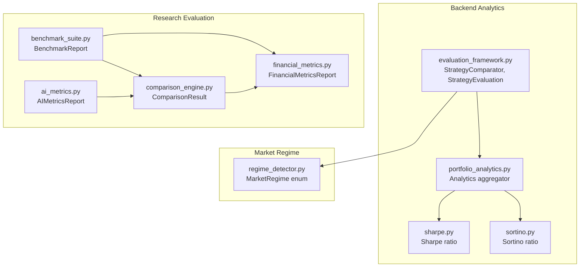
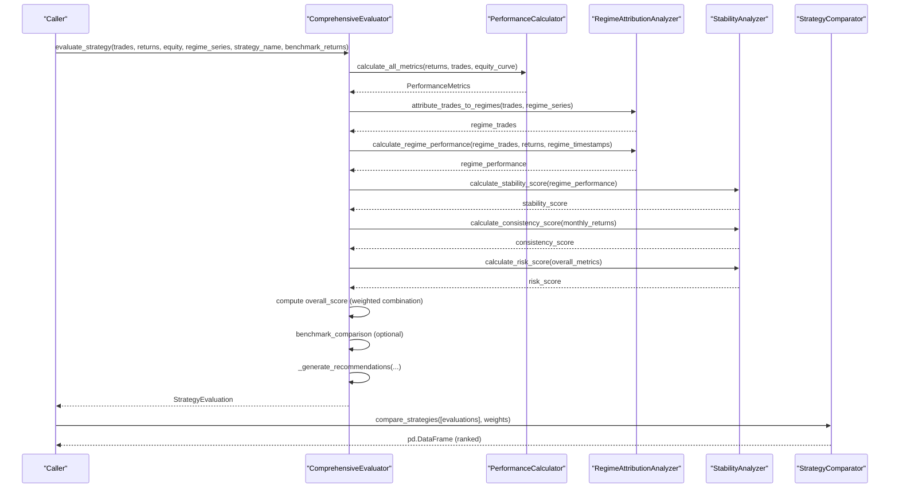
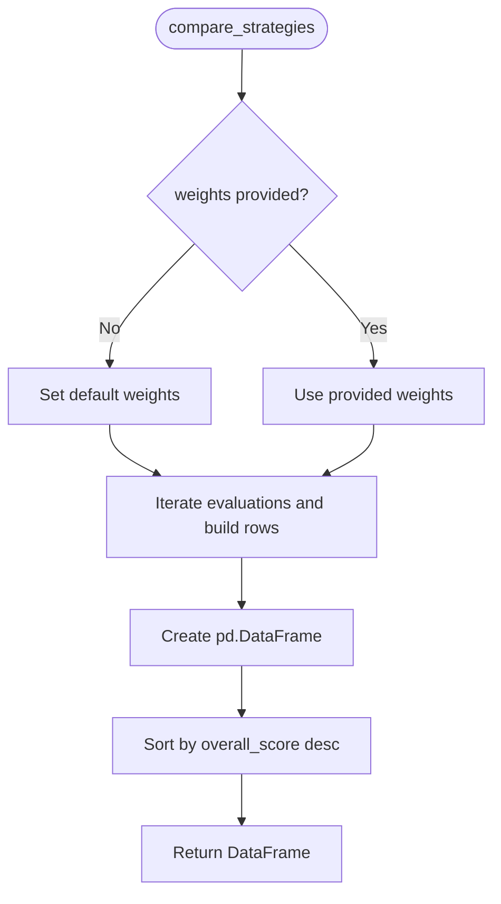
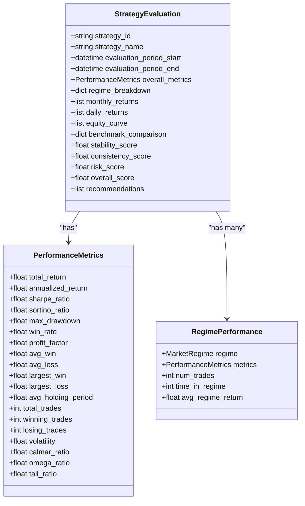
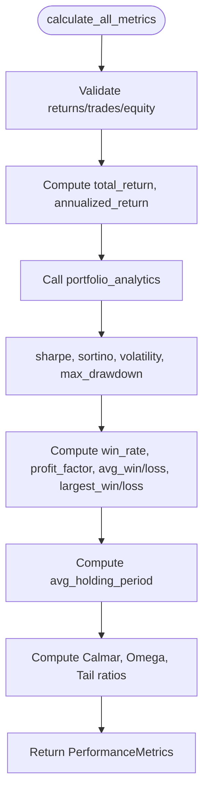
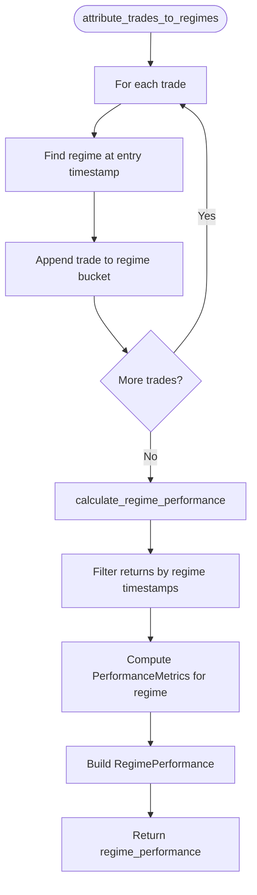
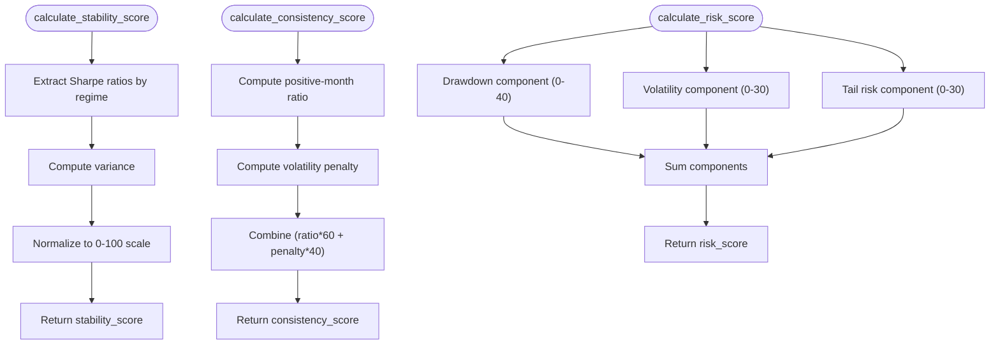
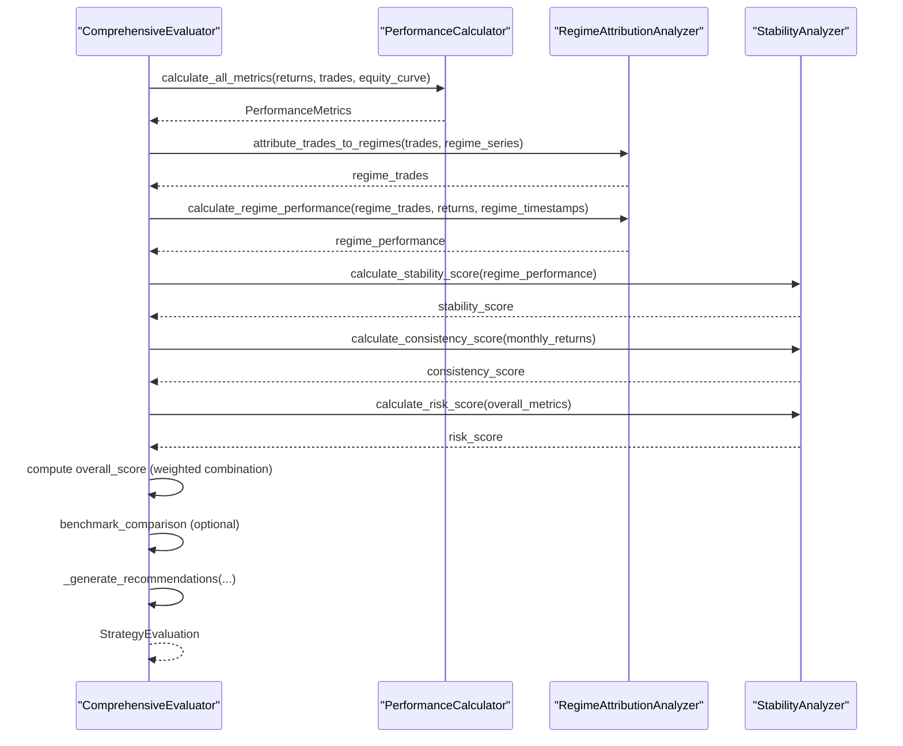
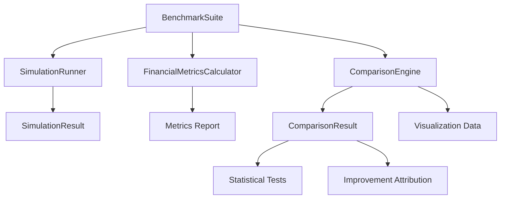
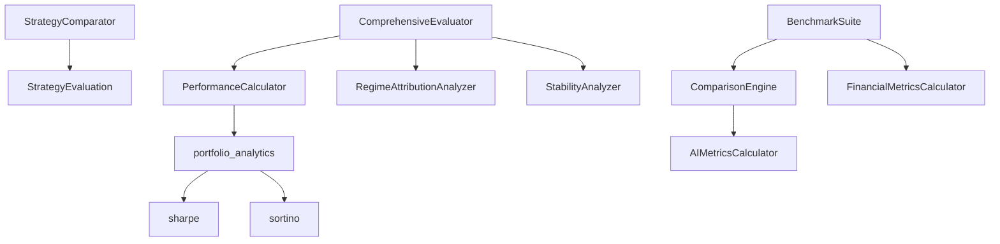

# Strategy Comparison and Ranking

<cite>
**Referenced Files in This Document**
- [evaluation_framework.py](file://backend/analytics/evaluation_framework.py)
- [portfolio_analytics.py](file://backend/analytics/portfolio_analytics.py)
- [sharpe.py](file://backend/analytics/sharpe.py)
- [sortino.py](file://backend/analytics/sortino.py)
- [regime_detector.py](file://backend/market/regime_detector.py)
- [comparison_engine.py](file://FinAgents/research/evaluation/comparison_engine.py)
- [benchmark_suite.py](file://FinAgents/research/evaluation/benchmark_suite.py)
- [financial_metrics.py](file://FinAgents/research/evaluation/financial_metrics.py)
- [ai_metrics.py](file://FinAgents/research/evaluation/ai_metrics.py)
</cite>

## Table of Contents
1. [Introduction](#introduction)
2. [Project Structure](#project-structure)
3. [Core Components](#core-components)
4. [Architecture Overview](#architecture-overview)
5. [Detailed Component Analysis](#detailed-component-analysis)
6. [Dependency Analysis](#dependency-analysis)
7. [Performance Considerations](#performance-considerations)
8. [Troubleshooting Guide](#troubleshooting-guide)
9. [Conclusion](#conclusion)
10. [Appendices](#appendices)

## Introduction
This document explains the Strategy Comparison and Ranking subsystem, focusing on multi-strategy evaluation and selection methodologies. It documents the StrategyComparator class, the StrategyEvaluation data model, and the end-to-end evaluation pipeline that produces ranked strategies, benchmark comparisons, and actionable recommendations. It also covers comparative analysis frameworks, performance benchmarking against benchmarks like SPY, score normalization techniques, and automated recommendation systems. Practical workflows, custom weighting configurations, and interpretation of ranking results are included, along with limitations, selection bias considerations, and best practices for constructing portfolios based on evaluation results.

## Project Structure
The Strategy Comparison and Ranking functionality spans several modules:
- Backend analytics: core performance metrics and evaluation pipeline
- Market regime detection: regime-aware attribution and stability analysis
- Research evaluation: comparative analysis, benchmark suites, and AI-specific metrics
- Portfolio analytics: Sharpe, Sortino, volatility, and drawdown aggregation

**Diagram sources**
- [evaluation_framework.py:458-504](file://backend/analytics/evaluation_framework.py#L458-L504)
- [portfolio_analytics.py:14-42](file://backend/analytics/portfolio_analytics.py#L14-L42)
- [sharpe.py:8-33](file://backend/analytics/sharpe.py#L8-L33)
- [sortino.py:9-41](file://backend/analytics/sortino.py#L9-L41)
- [regime_detector.py:57-71](file://backend/market/regime_detector.py#L57-L71)
- [comparison_engine.py:15-44](file://FinAgents/research/evaluation/comparison_engine.py#L15-L44)
- [benchmark_suite.py:42-53](file://FinAgents/research/evaluation/benchmark_suite.py#L42-L53)
- [financial_metrics.py:16-75](file://FinAgents/research/evaluation/financial_metrics.py#L16-L75)
- [ai_metrics.py:15-56](file://FinAgents/research/evaluation/ai_metrics.py#L15-L56)

**Section sources**
- [evaluation_framework.py:1-796](file://backend/analytics/evaluation_framework.py#L1-L796)
- [regime_detector.py:1-809](file://backend/market/regime_detector.py#L1-L809)
- [comparison_engine.py:1-564](file://FinAgents/research/evaluation/comparison_engine.py#L1-L564)
- [benchmark_suite.py:1-198](file://FinAgents/research/evaluation/benchmark_suite.py#L1-L198)
- [financial_metrics.py:1-591](file://FinAgents/research/evaluation/financial_metrics.py#L1-L591)
- [ai_metrics.py:1-574](file://FinAgents/research/evaluation/ai_metrics.py#L1-L574)

## Core Components
- StrategyComparator: Compares multiple StrategyEvaluation instances and ranks them using configurable weights.
- StrategyEvaluation: Encapsulates a complete evaluation including performance metrics, regime breakdown, stability, consistency, risk, overall score, and recommendations.
- PerformanceCalculator: Computes comprehensive performance metrics from returns, trades, and equity curves.
- RegimeAttributionAnalyzer: Attribute performance to market regimes and compute regime-specific metrics.
- StabilityAnalyzer: Computes stability, consistency, and risk scores.
- ComprehensiveEvaluator: Orchestrates end-to-end evaluation, including benchmark comparison and recommendation generation.
- BenchmarkSuite and ComparisonEngine: Provide comparative analysis across market scenarios and statistical significance testing.
- FinancialMetricsCalculator and AIMetricsCalculator: Offer extended financial and AI-specific metrics for richer evaluation.

**Section sources**
- [evaluation_framework.py:458-796](file://backend/analytics/evaluation_framework.py#L458-L796)
- [regime_detector.py:57-71](file://backend/market/regime_detector.py#L57-L71)
- [comparison_engine.py:46-130](file://FinAgents/research/evaluation/comparison_engine.py#L46-L130)
- [benchmark_suite.py:42-155](file://FinAgents/research/evaluation/benchmark_suite.py#L42-L155)
- [financial_metrics.py:77-224](file://FinAgents/research/evaluation/financial_metrics.py#L77-L224)
- [ai_metrics.py:58-186](file://FinAgents/research/evaluation/ai_metrics.py#L58-L186)

## Architecture Overview
The evaluation pipeline integrates performance computation, regime attribution, stability and risk scoring, and ranking. It supports benchmarking against a chosen benchmark (default SPY) and generates recommendations.

**Diagram sources**
- [evaluation_framework.py:534-635](file://backend/analytics/evaluation_framework.py#L534-L635)
- [evaluation_framework.py:458-504](file://backend/analytics/evaluation_framework.py#L458-L504)

## Detailed Component Analysis

### StrategyComparator
- Purpose: Compare multiple StrategyEvaluation objects and produce a ranked DataFrame.
- Method: compare_strategies(evaluations, weights=None)
- Behavior:
  - Accepts custom weights for components: sharpe, return, drawdown, stability, consistency, win_rate.
  - Defaults to predefined weights if none provided.
  - Builds a DataFrame containing strategy metadata and metrics, then sorts by overall_score descending.

**Diagram sources**
- [evaluation_framework.py:461-504](file://backend/analytics/evaluation_framework.py#L461-L504)

**Section sources**
- [evaluation_framework.py:458-504](file://backend/analytics/evaluation_framework.py#L458-L504)

### StrategyEvaluation Data Model
- Fields include identifiers, evaluation period, overall performance metrics, regime breakdown, return streams, benchmark comparison, stability, consistency, risk, overall score, and recommendations.
- Provides to_dict serialization for reporting and export.

**Diagram sources**
- [evaluation_framework.py:84-184](file://backend/analytics/evaluation_framework.py#L84-L184)
- [regime_detector.py:57-71](file://backend/market/regime_detector.py#L57-L71)

**Section sources**
- [evaluation_framework.py:84-184](file://backend/analytics/evaluation_framework.py#L84-L184)
- [regime_detector.py:57-71](file://backend/market/regime_detector.py#L57-L71)

### PerformanceCalculator
- Computes a comprehensive set of performance metrics from returns, trades, and equity curves.
- Integrates with portfolio_analytics for Sharpe, Sortino, volatility, and max drawdown.
- Includes derived metrics such as win rate, profit factor, holding period statistics, Calmar, Omega, and Tail ratios.

**Diagram sources**
- [evaluation_framework.py:190-283](file://backend/analytics/evaluation_framework.py#L190-L283)
- [portfolio_analytics.py:14-42](file://backend/analytics/portfolio_analytics.py#L14-L42)
- [sharpe.py:8-33](file://backend/analytics/sharpe.py#L8-L33)
- [sortino.py:9-41](file://backend/analytics/sortino.py#L9-L41)

**Section sources**
- [evaluation_framework.py:190-283](file://backend/analytics/evaluation_framework.py#L190-L283)
- [portfolio_analytics.py:14-42](file://backend/analytics/portfolio_analytics.py#L14-L42)
- [sharpe.py:8-33](file://backend/analytics/sharpe.py#L8-L33)
- [sortino.py:9-41](file://backend/analytics/sortino.py#L9-L41)

### RegimeAttributionAnalyzer
- Maps trades to regimes using regime_series timestamps.
- Filters returns by regime and computes regime-specific PerformanceMetrics.
- Produces RegimePerformance entries for downstream stability and benchmarking.

**Diagram sources**
- [evaluation_framework.py:300-372](file://backend/analytics/evaluation_framework.py#L300-L372)

**Section sources**
- [evaluation_framework.py:286-372](file://backend/analytics/evaluation_framework.py#L286-L372)
- [regime_detector.py:57-71](file://backend/market/regime_detector.py#L57-L71)

### StabilityAnalyzer
- Stability score: variance of Sharpe ratios across regimes; lower variance yields higher stability.
- Consistency score: positive-month ratio with volatility penalty; smoother return streams score higher.
- Risk score: composite of max drawdown, volatility, and tail risk; lower is better.

**Diagram sources**
- [evaluation_framework.py:384-455](file://backend/analytics/evaluation_framework.py#L384-L455)

**Section sources**
- [evaluation_framework.py:384-455](file://backend/analytics/evaluation_framework.py#L384-L455)

### ComprehensiveEvaluator
- Orchestrates end-to-end evaluation:
  - Calculates overall metrics
  - Attributes performance to regimes
  - Computes stability, consistency, and risk scores
  - Builds overall score via weighted combination
  - Optionally compares against a benchmark (default SPY)
  - Generates recommendations based on evaluation outcomes
  - Exports reports in JSON or text formats

**Diagram sources**
- [evaluation_framework.py:534-635](file://backend/analytics/evaluation_framework.py#L534-L635)

**Section sources**
- [evaluation_framework.py:507-796](file://backend/analytics/evaluation_framework.py#L507-L796)

### Comparative Analysis Framework and Benchmarking
- BenchmarkSuite runs simulations across multiple market scenarios (bull, bear, sideways, high volatility, crash-recovery) and compiles BenchmarkReport results.
- ComparisonEngine compares base vs enhanced systems, computes improvements, runs statistical significance tests (paired t-test and bootstrap), and attributes improvement across components.
- FinancialMetricsCalculator provides extended metrics including regime performance, cost-adjusted returns, and period breakdowns.
- AI Metrics support evaluation of agent decision quality, confidence calibration, explainability, and multi-agent agreement.

**Diagram sources**
- [benchmark_suite.py:95-155](file://FinAgents/research/evaluation/benchmark_suite.py#L95-L155)
- [comparison_engine.py:68-130](file://FinAgents/research/evaluation/comparison_engine.py#L68-L130)
- [financial_metrics.py:99-224](file://FinAgents/research/evaluation/financial_metrics.py#L99-L224)
- [ai_metrics.py:80-186](file://FinAgents/research/evaluation/ai_metrics.py#L80-L186)

**Section sources**
- [benchmark_suite.py:42-198](file://FinAgents/research/evaluation/benchmark_suite.py#L42-L198)
- [comparison_engine.py:46-564](file://FinAgents/research/evaluation/comparison_engine.py#L46-L564)
- [financial_metrics.py:77-591](file://FinAgents/research/evaluation/financial_metrics.py#L77-L591)
- [ai_metrics.py:58-574](file://FinAgents/research/evaluation/ai_metrics.py#L58-L574)

## Dependency Analysis
- StrategyComparator depends on StrategyEvaluation fields for ranking.
- ComprehensiveEvaluator composes PerformanceCalculator, RegimeAttributionAnalyzer, and StabilityAnalyzer.
- PerformanceCalculator relies on portfolio_analytics, which aggregates Sharpe, Sortino, volatility, and drawdown.
- BenchmarkSuite depends on ComparisonEngine and FinancialMetricsCalculator.
- AI Metrics integrate with ComparisonEngine for narrative summaries and visualization.

**Diagram sources**
- [evaluation_framework.py:458-796](file://backend/analytics/evaluation_framework.py#L458-L796)
- [portfolio_analytics.py:14-42](file://backend/analytics/portfolio_analytics.py#L14-L42)
- [benchmark_suite.py:42-53](file://FinAgents/research/evaluation/benchmark_suite.py#L42-L53)
- [comparison_engine.py:46-66](file://FinAgents/research/evaluation/comparison_engine.py#L46-L66)
- [financial_metrics.py:77-98](file://FinAgents/research/evaluation/financial_metrics.py#L77-L98)
- [ai_metrics.py:58-79](file://FinAgents/research/evaluation/ai_metrics.py#L58-L79)

**Section sources**
- [evaluation_framework.py:458-796](file://backend/analytics/evaluation_framework.py#L458-L796)
- [portfolio_analytics.py:14-42](file://backend/analytics/portfolio_analytics.py#L14-L42)
- [benchmark_suite.py:42-53](file://FinAgents/research/evaluation/benchmark_suite.py#L42-L53)
- [comparison_engine.py:46-66](file://FinAgents/research/evaluation/comparison_engine.py#L46-L66)
- [financial_metrics.py:77-98](file://FinAgents/research/evaluation/financial_metrics.py#L77-L98)
- [ai_metrics.py:58-79](file://FinAgents/research/evaluation/ai_metrics.py#L58-L79)

## Performance Considerations
- StrategyComparator ranking is O(n) for building rows plus O(n log n) for sorting; acceptable for typical strategy pools.
- Regime attribution and performance computation scale with number of trades and regime timestamps; ensure efficient timestamp alignment.
- Stability and risk score computations are linear in number of regimes and monthly returns respectively.
- BenchmarkSuite and ComparisonEngine involve repeated metric computations and statistical tests; consider caching and vectorized operations for large-scale comparisons.

[No sources needed since this section provides general guidance]

## Troubleshooting Guide
Common issues and resolutions:
- Insufficient return data: PerformanceCalculator raises errors for insufficient data; ensure at least two returns are provided.
- Missing benchmark returns: Benchmark comparison is skipped when benchmark_returns is None.
- Empty evaluations: StrategyComparator handles empty lists gracefully by returning an empty DataFrame.
- Regime mapping failures: RegimeAttributionAnalyzer falls back to closest prior regime if exact timestamp match fails.
- Statistical significance: ComparisonEngine returns neutral results when insufficient data is provided for t-test or bootstrap.

**Section sources**
- [evaluation_framework.py:190-202](file://backend/analytics/evaluation_framework.py#L190-L202)
- [evaluation_framework.py:588-601](file://backend/analytics/evaluation_framework.py#L588-L601)
- [evaluation_framework.py:314-322](file://backend/analytics/evaluation_framework.py#L314-L322)
- [comparison_engine.py:161-173](file://FinAgents/research/evaluation/comparison_engine.py#L161-L173)

## Conclusion
The Strategy Comparison and Ranking subsystem provides a robust, multi-faceted evaluation framework. It integrates performance metrics, regime-aware attribution, stability and risk scoring, and automated recommendations. StrategyComparator enables straightforward ranking with customizable weights, while BenchmarkSuite and ComparisonEngine offer rigorous comparative analysis with statistical significance testing. By leveraging these components, users can construct portfolios informed by comprehensive, data-driven strategy selection.

[No sources needed since this section summarizes without analyzing specific files]

## Appendices

### Practical Examples

- Strategy comparison workflow
  - Collect StrategyEvaluation instances from ComprehensiveEvaluator.
  - Invoke StrategyComparator.compare_strategies(evaluations, weights).
  - Interpret the sorted DataFrame to select top strategies.

- Custom weighting configuration
  - Provide a weights dictionary to StrategyComparator.compare_strategies with keys: sharpe, return, drawdown, stability, consistency, win_rate.
  - Weights are normalized internally; ensure they reflect priorities for the use case.

- Benchmarking against SPY
  - Supply benchmark_returns to ComprehensiveEvaluator.evaluate_strategy to enable benchmark_comparison in StrategyEvaluation.
  - StrategyComparator does not require benchmark data; ranking focuses on internal metrics.

- Interpreting ranking results
  - overall_score reflects weighted combination of risk-adjusted returns, stability, consistency, and risk.
  - Recommendations highlight areas for improvement or strengths observed during evaluation.

- Limitations and selection bias considerations
  - Backtested rankings depend on historical data and chosen evaluation period.
  - Overfitting to specific regimes or lookback windows can bias results; use regime-aware analysis and walk-forward validation.
  - Selection bias may arise from cherry-picking strategies or metrics; rely on statistical significance testing and out-of-sample validation.

- Best practices for strategy portfolio construction
  - Diversify across stability and consistency scores to mitigate regime dependency.
  - Consider risk_score thresholds to cap drawdown and volatility exposure.
  - Use benchmark comparison to assess alpha generation versus passive benchmarks.
  - Incorporate AI metrics (explainability, calibration) for trustable agent strategies.

**Section sources**
- [evaluation_framework.py:458-504](file://backend/analytics/evaluation_framework.py#L458-L504)
- [evaluation_framework.py:526-635](file://backend/analytics/evaluation_framework.py#L526-L635)
- [benchmark_suite.py:133-155](file://FinAgents/research/evaluation/benchmark_suite.py#L133-L155)
- [comparison_engine.py:68-130](file://FinAgents/research/evaluation/comparison_engine.py#L68-L130)
- [ai_metrics.py:80-186](file://FinAgents/research/evaluation/ai_metrics.py#L80-L186)