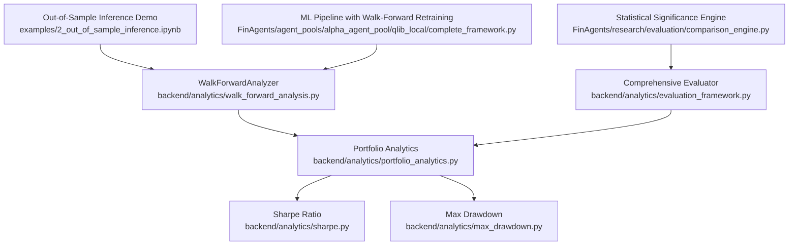
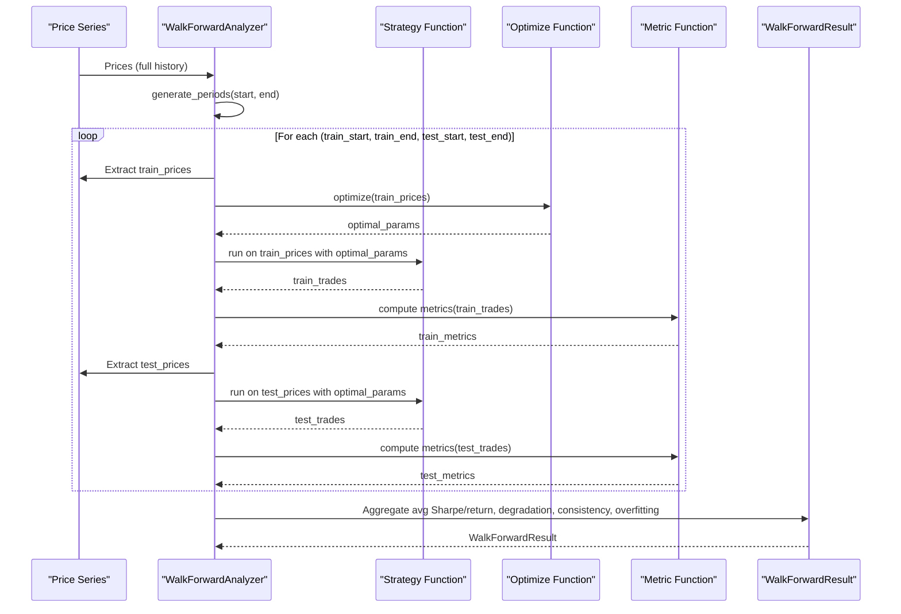
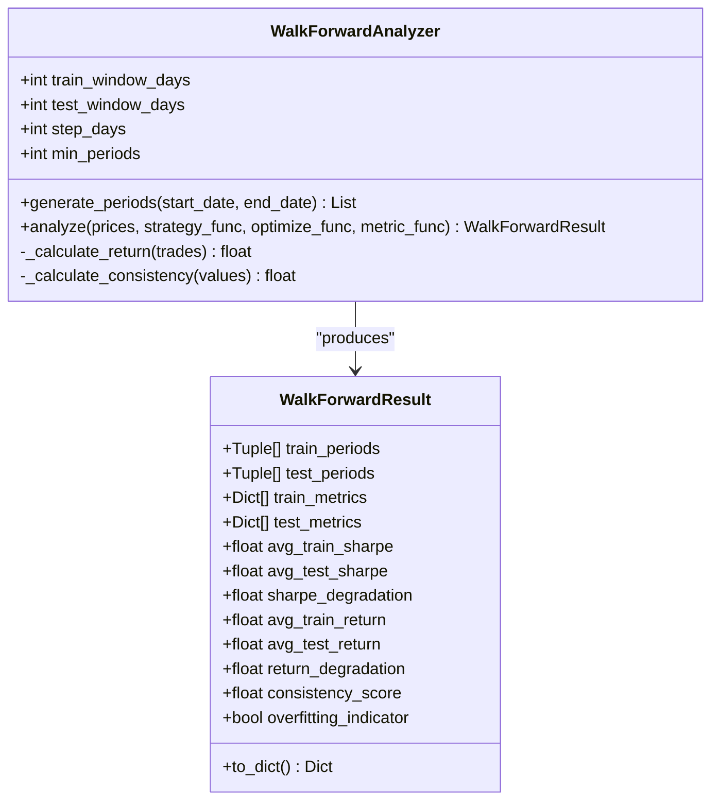
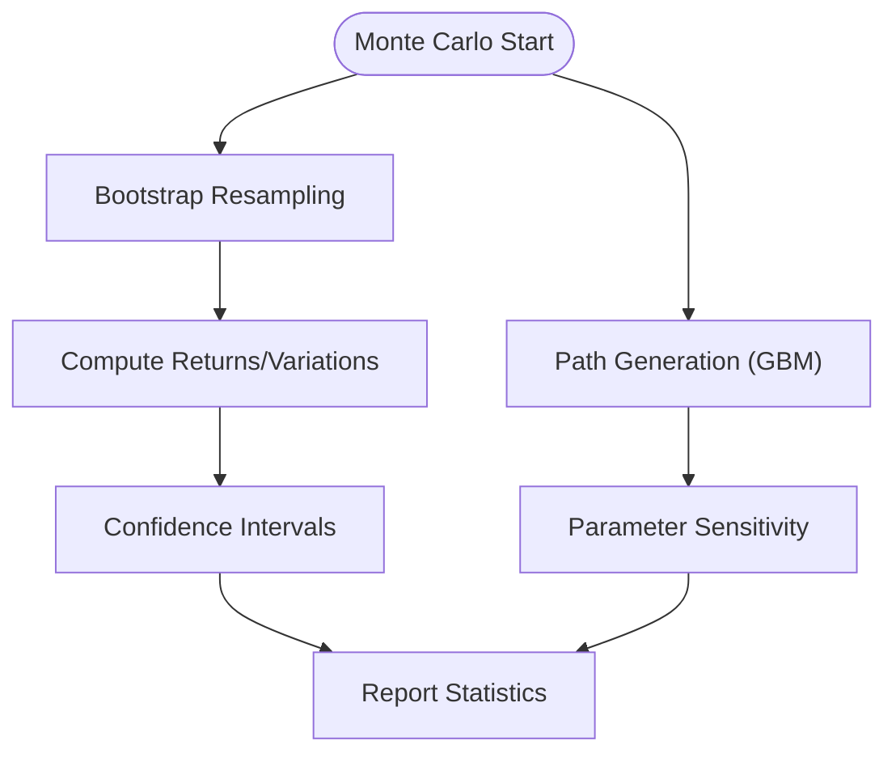
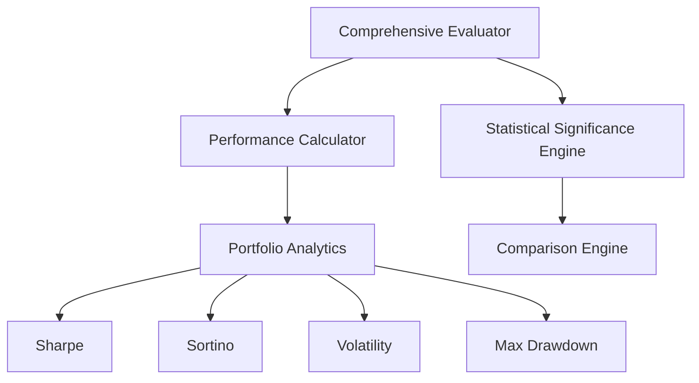
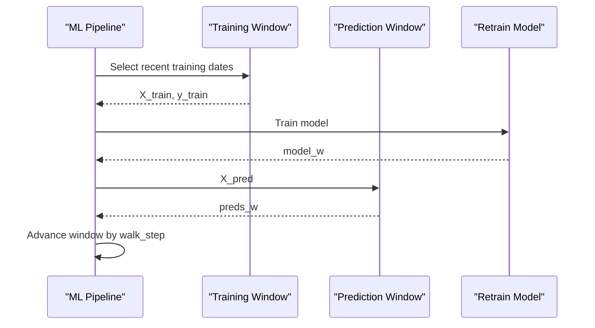
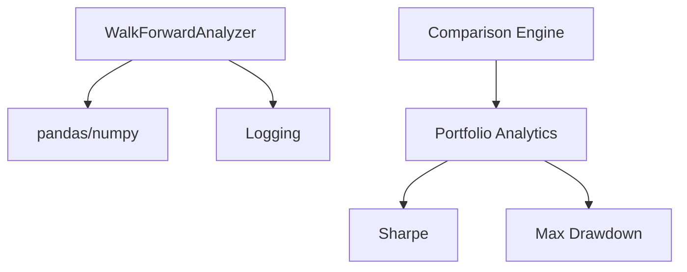

# Walk-Forward Validation

<cite>
**Referenced Files in This Document**
- [walk_forward_analysis.py](file://backend/analytics/walk_forward_analysis.py)
- [evaluation_framework.py](file://backend/analytics/evaluation_framework.py)
- [portfolio_analytics.py](file://backend/analytics/portfolio_analytics.py)
- [sharpe.py](file://backend/analytics/sharpe.py)
- [max_drawdown.py](file://backend/analytics/max_drawdown.py)
- [workflow.rst](file://docs/source/intro/workflow.rst)
- [2_out_of_sample_inference.ipynb](file://examples/2_out_of_sample_inference.ipynb)
- [complete_framework.py](file://FinAgents/agent_pools/alpha_agent_pool/qlib_local/complete_framework.py)
- [comparison_engine.py](file://FinAgents/research/evaluation/comparison_engine.py)
</cite>

## Table of Contents
1. [Introduction](#introduction)
2. [Project Structure](#project-structure)
3. [Core Components](#core-components)
4. [Architecture Overview](#architecture-overview)
5. [Detailed Component Analysis](#detailed-component-analysis)
6. [Dependency Analysis](#dependency-analysis)
7. [Performance Considerations](#performance-considerations)
8. [Troubleshooting Guide](#troubleshooting-guide)
9. [Conclusion](#conclusion)
10. [Appendices](#appendices)

## Introduction
This document presents a comprehensive guide to Walk-Forward Validation for out-of-sample strategy testing and validation. It explains the walk-forward analysis framework, including data partitioning strategies, training/validation window management, and sequential testing procedures. It also covers the validation pipeline architecture, parameter optimization techniques, performance degradation analysis, and overfitting detection. Practical examples demonstrate how to set up walk-forward tests, interpret results, and identify overfitting indicators. Additional guidance addresses validation methodology considerations, look-ahead bias prevention, statistical significance testing, and choosing appropriate validation horizons and window sizes for different strategy types.

## Project Structure
The walk-forward validation capability is implemented primarily in the analytics module and integrated with broader evaluation and research components:
- Walk-forward analysis core: backend/analytics/walk_forward_analysis.py
- Strategy evaluation and regime analysis: backend/analytics/evaluation_framework.py
- Portfolio analytics helpers: backend/analytics/portfolio_analytics.py, backend/analytics/sharpe.py, backend/analytics/max_drawdown.py
- Example of out-of-sample inference with rolling windows: examples/2_out_of_sample_inference.ipynb
- Walk-forward retraining pattern in ML pipeline: FinAgents/agent_pools/alpha_agent_pool/qlib_local/complete_framework.py
- Statistical significance testing for comparisons: FinAgents/research/evaluation/comparison_engine.py
- Zero look-ahead bias documentation: docs/source/intro/workflow.rst

**Diagram sources**
- [walk_forward_analysis.py:65-265](file://backend/analytics/walk_forward_analysis.py#L65-L265)
- [evaluation_framework.py:187-284](file://backend/analytics/evaluation_framework.py#L187-L284)
- [portfolio_analytics.py:14-42](file://backend/analytics/portfolio_analytics.py#L14-L42)
- [sharpe.py:8-33](file://backend/analytics/sharpe.py#L8-L33)
- [max_drawdown.py:8-32](file://backend/analytics/max_drawdown.py#L8-L32)
- [2_out_of_sample_inference.ipynb:1-1083](file://examples/2_out_of_sample_inference.ipynb#L1-L1083)
- [complete_framework.py:360-404](file://FinAgents/agent_pools/alpha_agent_pool/qlib_local/complete_framework.py#L360-L404)
- [comparison_engine.py:132-191](file://FinAgents/research/evaluation/comparison_engine.py#L132-L191)

**Section sources**
- [walk_forward_analysis.py:1-425](file://backend/analytics/walk_forward_analysis.py#L1-L425)
- [evaluation_framework.py:1-796](file://backend/analytics/evaluation_framework.py#L1-L796)
- [portfolio_analytics.py:1-42](file://backend/analytics/portfolio_analytics.py#L1-L42)
- [sharpe.py:1-33](file://backend/analytics/sharpe.py#L1-L33)
- [max_drawdown.py:1-32](file://backend/analytics/max_drawdown.py#L1-L32)
- [2_out_of_sample_inference.ipynb:1-1083](file://examples/2_out_of_sample_inference.ipynb#L1-L1083)
- [complete_framework.py:360-404](file://FinAgents/agent_pools/alpha_agent_pool/qlib_local/complete_framework.py#L360-L404)
- [comparison_engine.py:132-191](file://FinAgents/research/evaluation/comparison_engine.py#L132-L191)

## Core Components
- WalkForwardAnalyzer: Implements rolling-window walk-forward analysis with configurable train/test windows and step size. It generates period splits, runs optimization on training data, validates on test data, aggregates metrics, computes degradation, and detects overfitting.
- WalkForwardResult: Encapsulates training/test period pairs, per-period metrics, aggregated statistics (average Sharpe, average return, degradation), consistency score, and overfitting indicator.
- MonteCarloSimulator: Provides bootstrap resampling and path generation to assess uncertainty and parameter sensitivity.
- Comprehensive Evaluator: Computes multi-metric performance, regime attribution, stability, consistency, and risk scores; supports statistical significance testing for strategy comparisons.
- Portfolio Analytics: Supplies Sharpe, Sortino, volatility, max drawdown, and alpha-beta metrics used by evaluators and analyzers.

**Section sources**
- [walk_forward_analysis.py:28-62](file://backend/analytics/walk_forward_analysis.py#L28-L62)
- [walk_forward_analysis.py:65-265](file://backend/analytics/walk_forward_analysis.py#L65-L265)
- [walk_forward_analysis.py:302-425](file://backend/analytics/walk_forward_analysis.py#L302-L425)
- [evaluation_framework.py:187-284](file://backend/analytics/evaluation_framework.py#L187-L284)
- [portfolio_analytics.py:14-42](file://backend/analytics/portfolio_analytics.py#L14-L42)

## Architecture Overview
The walk-forward validation pipeline integrates data partitioning, sequential optimization and testing, and performance aggregation. It supports:
- Rolling windows: fixed-length training followed by fixed-length testing, rolled forward by a step size.
- Parameter optimization: optional optimization on training data, then out-of-sample testing with the same parameters.
- Performance metrics: Sharpe, returns, consistency, and overfitting detection.
- Statistical significance: paired t-tests and bootstrap confidence intervals for comparing strategies.

**Diagram sources**
- [walk_forward_analysis.py:103-141](file://backend/analytics/walk_forward_analysis.py#L103-L141)
- [walk_forward_analysis.py:143-265](file://backend/analytics/walk_forward_analysis.py#L143-L265)

**Section sources**
- [walk_forward_analysis.py:103-265](file://backend/analytics/walk_forward_analysis.py#L103-L265)

## Detailed Component Analysis

### WalkForwardAnalyzer
- Initialization: train_window_days, test_window_days, step_days, min_periods configure the analysis.
- Period generation: creates rolling train/test splits bounded by start/end dates.
- Sequential testing: runs optimization on training data, applies the same parameters to test data, computes metrics, and collects per-period results.
- Aggregation: calculates average Sharpe and return for train/test, measures degradation, computes consistency score, and flags overfitting.

**Diagram sources**
- [walk_forward_analysis.py:65-102](file://backend/analytics/walk_forward_analysis.py#L65-L102)
- [walk_forward_analysis.py:28-62](file://backend/analytics/walk_forward_analysis.py#L28-L62)

**Section sources**
- [walk_forward_analysis.py:77-102](file://backend/analytics/walk_forward_analysis.py#L77-L102)
- [walk_forward_analysis.py:103-141](file://backend/analytics/walk_forward_analysis.py#L103-L141)
- [walk_forward_analysis.py:143-265](file://backend/analytics/walk_forward_analysis.py#L143-L265)
- [walk_forward_analysis.py:266-299](file://backend/analytics/walk_forward_analysis.py#L266-L299)

### MonteCarloSimulator
- Bootstrap analysis: resamples trades with replacement to estimate confidence intervals, probability of profit, and worst/best-case returns.
- Path generation: simulates alternative price paths using geometric Brownian motion to test parameter sensitivity.

**Diagram sources**
- [walk_forward_analysis.py:302-425](file://backend/analytics/walk_forward_analysis.py#L302-L425)

**Section sources**
- [walk_forward_analysis.py:302-425](file://backend/analytics/walk_forward_analysis.py#L302-L425)

### Validation Pipeline Architecture
- Strategy evaluation: Comprehensive Evaluator computes multi-metric performance, regime breakdown, stability, consistency, and risk scores.
- Statistical significance: Comparison Engine performs paired t-tests and bootstrap confidence intervals to assess whether performance differences are significant.
- Portfolio analytics: Sharpe, Sortino, volatility, and max drawdown are computed from return series.

**Diagram sources**
- [evaluation_framework.py:187-284](file://backend/analytics/evaluation_framework.py#L187-L284)
- [portfolio_analytics.py:14-42](file://backend/analytics/portfolio_analytics.py#L14-L42)
- [sharpe.py:8-33](file://backend/analytics/sharpe.py#L8-L33)
- [max_drawdown.py:8-32](file://backend/analytics/max_drawdown.py#L8-L32)
- [comparison_engine.py:132-191](file://FinAgents/research/evaluation/comparison_engine.py#L132-L191)

**Section sources**
- [evaluation_framework.py:507-636](file://backend/analytics/evaluation_framework.py#L507-L636)
- [comparison_engine.py:132-191](file://FinAgents/research/evaluation/comparison_engine.py#L132-L191)
- [portfolio_analytics.py:14-42](file://backend/analytics/portfolio_analytics.py#L14-L42)

### Implementation Patterns and Examples
- Rolling window walk-forward with retraining: The ML pipeline demonstrates a walk-forward retraining pattern where training windows are dynamically selected from historical data and retrained at each step.
- Out-of-sample inference with zero look-ahead bias: The notebook shows day-by-day inference with rolling windows, ensuring agents only use data available up to the current timestamp.

**Diagram sources**
- [complete_framework.py:360-398](file://FinAgents/agent_pools/alpha_agent_pool/qlib_local/complete_framework.py#L360-L398)

**Section sources**
- [complete_framework.py:360-404](file://FinAgents/agent_pools/alpha_agent_pool/qlib_local/complete_framework.py#L360-L404)
- [2_out_of_sample_inference.ipynb:105-108](file://examples/2_out_of_sample_inference.ipynb#L105-L108)

## Dependency Analysis
- WalkForwardAnalyzer depends on:
  - pandas/numpy for time-series operations and numerical computations.
  - Logging for progress and diagnostics.
- Metrics computation depends on:
  - Sharpe ratio and max drawdown implementations.
  - Portfolio analytics wrapper for consolidated metrics.
- Statistical significance relies on:
  - Comparison engine’s paired t-test and bootstrap analysis.

**Diagram sources**
- [walk_forward_analysis.py:18-25](file://backend/analytics/walk_forward_analysis.py#L18-L25)
- [portfolio_analytics.py:14-42](file://backend/analytics/portfolio_analytics.py#L14-L42)
- [sharpe.py:8-33](file://backend/analytics/sharpe.py#L8-L33)
- [max_drawdown.py:8-32](file://backend/analytics/max_drawdown.py#L8-L32)
- [comparison_engine.py:132-191](file://FinAgents/research/evaluation/comparison_engine.py#L132-L191)

**Section sources**
- [walk_forward_analysis.py:18-25](file://backend/analytics/walk_forward_analysis.py#L18-L25)
- [portfolio_analytics.py:14-42](file://backend/analytics/portfolio_analytics.py#L14-L42)
- [comparison_engine.py:132-191](file://FinAgents/research/evaluation/comparison_engine.py#L132-L191)

## Performance Considerations
- Window sizing: Larger training windows improve parameter stability but reduce the number of test periods; shorter windows increase robustness checks but may yield noisy estimates.
- Step size: Smaller steps increase the number of periods and detection power but raise computational cost.
- Metric choice: Track Sharpe degradation and consistency score to detect overfitting early; monitor return degradation alongside Sharpe to capture absolute performance drops.
- Computational efficiency: Batch processing and caching intermediate results can reduce repeated computations during optimization loops.

## Troubleshooting Guide
- Insufficient periods: If the number of generated periods is below the minimum threshold, the analyzer raises an error indicating the need for longer history or smaller windows.
- Overfitting detection: Overfitting is flagged when Sharpe degradation exceeds a threshold; investigate parameter proliferation or lookahead leakage.
- Statistical significance: Use paired t-tests and bootstrap confidence intervals to confirm whether observed differences are meaningful rather than noise.
- Look-ahead bias: Ensure sequential processing respects temporal order and agents only use data available up to the current timestamp.

**Section sources**
- [walk_forward_analysis.py:134-139](file://backend/analytics/walk_forward_analysis.py#L134-L139)
- [walk_forward_analysis.py:238-239](file://backend/analytics/walk_forward_analysis.py#L238-L239)
- [comparison_engine.py:132-191](file://FinAgents/research/evaluation/comparison_engine.py#L132-L191)
- [workflow.rst:90-103](file://docs/source/intro/workflow.rst#L90-L103)

## Conclusion
Walk-Forward Validation provides a rigorous, out-of-sample methodology to assess strategy robustness, detect overfitting, and quantify performance degradation. By combining rolling window analysis, parameter optimization, and comprehensive metrics, practitioners can build reliable validation pipelines. Integrating statistical significance testing and regime-aware evaluation further strengthens decision-making. Proper window sizing, step selection, and look-ahead bias prevention are essential for credible results.

## Appendices

### Practical Setup Examples
- Setting up walk-forward tests:
  - Define train_window_days, test_window_days, step_days, and min_periods.
  - Provide a price series and strategy function; optionally supply optimize_func and metric_func.
  - Execute analyze() to obtain WalkForwardResult with aggregated statistics and overfitting indicator.
- Interpreting results:
  - Compare avg_train_sharpe and avg_test_sharpe; a notable drop suggests degradation.
  - Use consistency_score to gauge stability across periods.
  - Flag overfitting when overfitting_indicator is true.
- Identifying overfitting indicators:
  - Sharpe degradation > threshold.
  - Low consistency score.
  - Poor out-of-sample performance relative to in-sample.

**Section sources**
- [walk_forward_analysis.py:77-102](file://backend/analytics/walk_forward_analysis.py#L77-L102)
- [walk_forward_analysis.py:143-265](file://backend/analytics/walk_forward_analysis.py#L143-L265)
- [walk_forward_analysis.py:235-239](file://backend/analytics/walk_forward_analysis.py#L235-L239)

### Choosing Validation Horizons and Window Sizes
- Trend-following strategies: Use longer training windows (e.g., 6–12 months) to stabilize trend estimates; moderate step sizes (e.g., 1–3 months) to track evolving regimes.
- Mean-reversion strategies: Shorter training windows (e.g., 3–6 months) to adapt quickly; smaller step sizes (e.g., 1–2 months) to capture changing mean-reversion windows.
- High-frequency strategies: Short training windows (e.g., 20–60 days) and small step sizes (e.g., 5–15 days); focus on intraday regime shifts.
- Mixed-frequency validation: Alternate between daily and higher-frequency windows to assess robustness across horizons.

[No sources needed since this section provides general guidance]