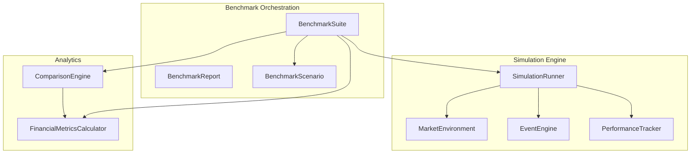
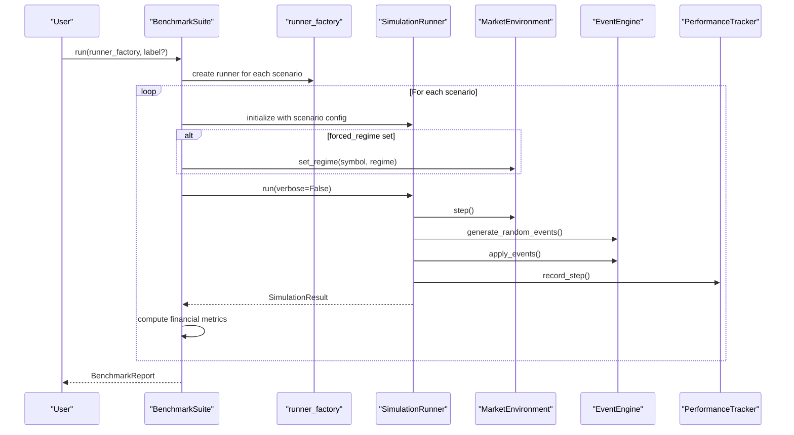
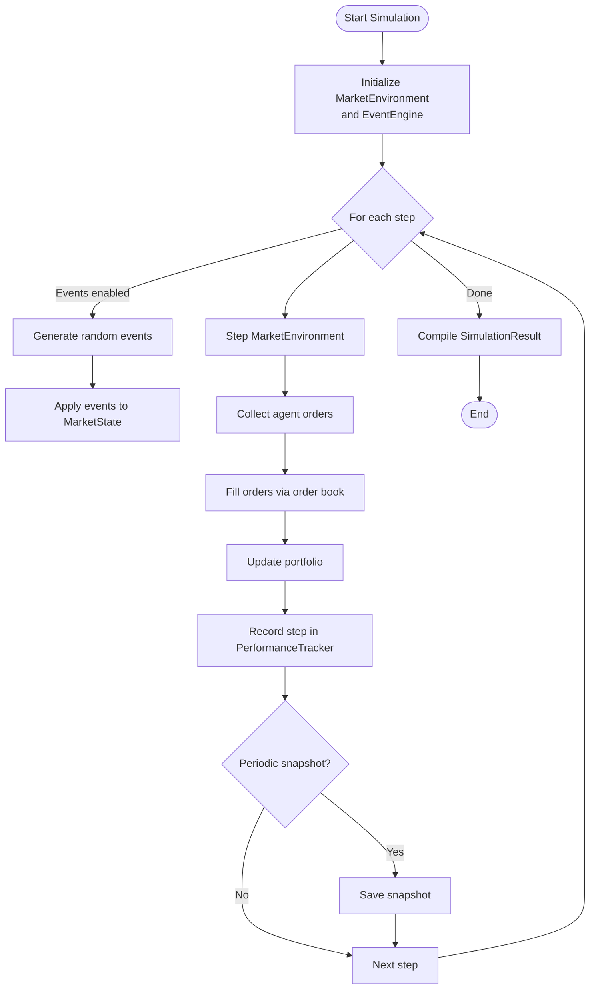
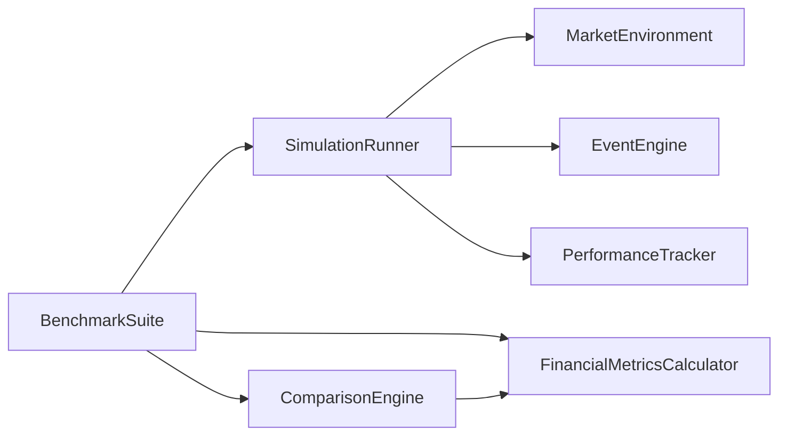

# Benchmark Suite

<cite>
**Referenced Files in This Document**
- [benchmark_suite.py](file://FinAgents/research/evaluation/benchmark_suite.py)
- [comparison_engine.py](file://FinAgents/research/evaluation/comparison_engine.py)
- [financial_metrics.py](file://FinAgents/research/evaluation/financial_metrics.py)
- [simulation_runner.py](file://FinAgents/research/simulation/simulation_runner.py)
- [market_environment.py](file://FinAgents/research/simulation/market_environment.py)
- [performance_tracker.py](file://FinAgents/research/simulation/performance_tracker.py)
- [event_engine.py](file://FinAgents/research/simulation/event_engine.py)
</cite>

## Table of Contents
1. [Introduction](#introduction)
2. [Project Structure](#project-structure)
3. [Core Components](#core-components)
4. [Architecture Overview](#architecture-overview)
5. [Detailed Component Analysis](#detailed-component-analysis)
6. [Dependency Analysis](#dependency-analysis)
7. [Performance Considerations](#performance-considerations)
8. [Troubleshooting Guide](#troubleshooting-guide)
9. [Conclusion](#conclusion)

## Introduction
This document describes the Benchmark Suite used to define standardized market scenarios and run comparative research experiments across trading systems. It documents the five default market regimes, the BenchmarkScenario and BenchmarkReport structures, the factory pattern for creating simulation runners, scenario configuration options, and the end-to-end workflow for single-system benchmarking and base-enhanced comparisons. It also explains scenario validation, result interpretation, and performance metric computation, including total return, Sharpe ratio, maximum drawdown, and additional financial metrics.

## Project Structure
The Benchmark Suite integrates three primary subsystems:
- Scenario definition and orchestration: BenchmarkSuite, BenchmarkScenario, BenchmarkReport
- Simulation engine: SimulationRunner, MarketEnvironment, EventEngine, PerformanceTracker
- Comparative analysis: ComparisonEngine, FinancialMetricsCalculator

**Diagram sources**
- [benchmark_suite.py:42-198](file://FinAgents/research/evaluation/benchmark_suite.py#L42-L198)
- [simulation_runner.py:151-800](file://FinAgents/research/simulation/simulation_runner.py#L151-L800)
- [market_environment.py:321-765](file://FinAgents/research/simulation/market_environment.py#L321-L765)
- [event_engine.py:113-661](file://FinAgents/research/simulation/event_engine.py#L113-L661)
- [performance_tracker.py:71-539](file://FinAgents/research/simulation/performance_tracker.py#L71-L539)
- [comparison_engine.py:46-564](file://FinAgents/research/evaluation/comparison_engine.py#L46-L564)
- [financial_metrics.py:77-591](file://FinAgents/research/evaluation/financial_metrics.py#L77-L591)

**Section sources**
- [benchmark_suite.py:1-198](file://FinAgents/research/evaluation/benchmark_suite.py#L1-L198)
- [simulation_runner.py:151-800](file://FinAgents/research/simulation/simulation_runner.py#L151-L800)
- [market_environment.py:321-765](file://FinAgents/research/simulation/market_environment.py#L321-L765)
- [event_engine.py:113-661](file://FinAgents/research/simulation/event_engine.py#L113-L661)
- [performance_tracker.py:71-539](file://FinAgents/research/simulation/performance_tracker.py#L71-L539)
- [comparison_engine.py:46-564](file://FinAgents/research/evaluation/comparison_engine.py#L46-L564)
- [financial_metrics.py:77-591](file://FinAgents/research/evaluation/financial_metrics.py#L77-L591)

## Core Components
- BenchmarkScenario: Defines a single scenario with name, description, number of steps, market configuration, event configuration, and an optional forced regime.
- BenchmarkReport: Aggregates per-scenario SimulationResult objects and computed metrics, plus a concise summary.
- BenchmarkSuite: Runs scenarios via a runner factory, computes financial metrics, and supports base/enhanced comparisons.

Key capabilities:
- Five default market regimes with distinct drift and volatility parameters
- Forced regime overrides per scenario
- Runner factory pattern to construct SimulationRunner instances per scenario
- Automatic metric computation and comparison reporting

**Section sources**
- [benchmark_suite.py:21-198](file://FinAgents/research/evaluation/benchmark_suite.py#L21-L198)
- [market_environment.py:21-31](file://FinAgents/research/simulation/market_environment.py#L21-L31)

## Architecture Overview
The Benchmark Suite orchestrates a closed loop:
- BenchmarkSuite constructs SimulationRunner instances using a provided factory
- SimulationRunner advances MarketEnvironment and EventEngine, executes agents, tracks performance, and logs snapshots
- BenchmarkSuite compiles SimulationResult into BenchmarkReport and computes financial metrics
- For comparisons, ComparisonEngine evaluates base vs enhanced runs and performs statistical tests and attribution

**Diagram sources**
- [benchmark_suite.py:95-155](file://FinAgents/research/evaluation/benchmark_suite.py#L95-L155)
- [simulation_runner.py:223-318](file://FinAgents/research/simulation/simulation_runner.py#L223-L318)
- [market_environment.py:462-557](file://FinAgents/research/simulation/market_environment.py#L462-L557)
- [event_engine.py:249-312](file://FinAgents/research/simulation/event_engine.py#L249-L312)
- [performance_tracker.py:120-183](file://FinAgents/research/simulation/performance_tracker.py#L120-L183)

## Detailed Component Analysis

### BenchmarkSuite
Responsibilities:
- Manage default scenarios and risk-free rate
- Run single-system benchmarks via runner_factory
- Enforce forced regimes per symbol
- Compute financial metrics per scenario
- Build a concise summary
- Support base/enhanced comparisons with statistical tests and attribution

Notable behaviors:
- Adjusts runner.config.num_steps to match scenario.num_steps
- Forces MarketRegime when scenario.forced_regime is set
- Computes returns from equity curve and delegates metric computation to FinancialMetricsCalculator

**Section sources**
- [benchmark_suite.py:42-198](file://FinAgents/research/evaluation/benchmark_suite.py#L42-L198)

### BenchmarkScenario and BenchmarkReport
- BenchmarkScenario: name, description, num_steps, market_config, event_config, forced_regime
- BenchmarkReport: scenario_results, metrics_by_scenario, summary

Usage:
- Pass a list of BenchmarkScenario to BenchmarkSuite constructor or rely on defaults
- Access aggregated metrics and scenario-wise results for downstream analysis

**Section sources**
- [benchmark_suite.py:21-40](file://FinAgents/research/evaluation/benchmark_suite.py#L21-L40)

### Default Market Regimes and Scenario Configurations
The suite defines five standard scenarios with explicit drift and volatility parameters and optional jump dynamics:

- Bull market
  - drift: positive, base_volatility: moderate
  - forced_regime: BULL
- Bear market
  - drift: negative, base_volatility: elevated
  - forced_regime: BEAR
- Sideways market
  - drift: near zero, base_volatility: low
  - forced_regime: SIDEWAYS
- High-volatility market
  - drift: near zero, base_volatility: high
  - forced_regime: HIGH_VOLATILITY
- Crash-recovery market
  - drift: slightly negative, base_volatility: very high
  - jump_probability: increased
  - jump_magnitude: larger
  - forced_regime: CRASH

Scenario configuration options:
- market_config keys:
  - drift: trend coefficient
  - base_volatility: baseline volatility
  - jump_probability: probability of jump per step
  - jump_magnitude: standard deviation of jump size
  - market_impact_factor: scaling for agent order impact
  - regime_duration_range: min/max steps per regime
- event_config keys:
  - scheduled_event_probability: chance of scheduled event per step
  - shock_probability: chance of random shock per step
  - max_events_per_step: cap on simultaneous events
- forced_regime: override to lock market into a specific regime

Validation and enforcement:
- Runner adjusts num_steps to match scenario
- MarketEnvironment enforces forced regime per symbol
- MarketEnvironment applies regime multipliers and transition probabilities

**Section sources**
- [benchmark_suite.py:54-93](file://FinAgents/research/evaluation/benchmark_suite.py#L54-L93)
- [market_environment.py:337-426](file://FinAgents/research/simulation/market_environment.py#L337-L426)
- [market_environment.py:705-724](file://FinAgents/research/simulation/market_environment.py#L705-L724)
- [event_engine.py:213-235](file://FinAgents/research/simulation/event_engine.py#L213-L235)

### Factory Pattern for Simulation Runners
BenchmarkSuite expects a runner_factory callable that accepts a BenchmarkScenario and returns a SimulationRunner configured for that scenario. Typical factory responsibilities:
- Construct SimulationConfig with symbols, initial_prices, and merged market_config/event_config
- Optionally set random_seed for reproducibility
- Attach agents and coordinator as needed
- Return a fully initialized SimulationRunner

Example factory outline:
- Accept BenchmarkScenario
- Merge scenario.market_config into SimulationConfig.market_config
- Merge scenario.event_config into SimulationConfig.event_config
- Set SimulationConfig.num_steps = scenario.num_steps
- Return SimulationRunner(config)

Note: The factory is user-defined and not included in the referenced files.

**Section sources**
- [benchmark_suite.py:95-131](file://FinAgents/research/evaluation/benchmark_suite.py#L95-L131)
- [simulation_runner.py:171-205](file://FinAgents/research/simulation/simulation_runner.py#L171-L205)

### Simulation Runner Workflow
SimulationRunner coordinates:
- MarketEnvironment: GBM + jump diffusion with regime transitions and order book fills
- EventEngine: generates and applies exogenous events
- PerformanceTracker: maintains portfolio values, returns, trades, and agent attributions
- Decision logging and periodic snapshots

Key steps:
- Generate and apply events
- Step MarketEnvironment (price evolution, regime transitions, order book updates)
- Agent decisions and order execution
- Update portfolio and record performance
- Snapshot history and compile SimulationResult

**Diagram sources**
- [simulation_runner.py:223-318](file://FinAgents/research/simulation/simulation_runner.py#L223-L318)
- [market_environment.py:462-557](file://FinAgents/research/simulation/market_environment.py#L462-L557)
- [event_engine.py:314-355](file://FinAgents/research/simulation/event_engine.py#L314-L355)
- [performance_tracker.py:120-183](file://FinAgents/research/simulation/performance_tracker.py#L120-L183)

**Section sources**
- [simulation_runner.py:151-800](file://FinAgents/research/simulation/simulation_runner.py#L151-L800)
- [market_environment.py:321-765](file://FinAgents/research/simulation/market_environment.py#L321-L765)
- [event_engine.py:113-661](file://FinAgents/research/simulation/event_engine.py#L113-L661)
- [performance_tracker.py:71-539](file://FinAgents/research/simulation/performance_tracker.py#L71-L539)

### Financial Metrics Computation
BenchmarkSuite extracts equity curves from SimulationResult.performance_metrics and delegates metric computation to FinancialMetricsCalculator. The calculator supports:
- Total return, annualized return
- Volatility (annualized)
- Sharpe ratio (with risk-free rate)
- Sortino ratio (downside deviation)
- Calmar ratio (annualized return / max drawdown)
- Omega ratio
- Maximum drawdown and drawdown curve
- Win rate, profit factor
- Trade counts and average holding period
- Period breakdown (monthly, quarterly, annual)
- Regime performance metrics
- Cost-adjusted returns

Interpretation guidelines:
- Higher Sharpe/Sortino generally indicate better risk-adjusted performance
- Lower max drawdown implies lower peak-to-trough loss
- Positive Calmar suggests favorable long-term risk-adjusted performance
- Profit factor > 1 indicates gross profits exceed gross losses
- Win rate > 0.5 implies more winning than losing trades

**Section sources**
- [benchmark_suite.py:157-183](file://FinAgents/research/evaluation/benchmark_suite.py#L157-L183)
- [financial_metrics.py:77-591](file://FinAgents/research/evaluation/financial_metrics.py#L77-L591)

### Comparison Engine and Statistical Testing
For base vs enhanced system comparisons:
- Extracts metrics from SimulationResult.performance_metrics
- Computes improvement percentages per metric
- Performs paired t-test and bootstrap confidence intervals on returns
- Provides improvement attribution (simple equal split by default)
- Generates comparison table, visualization data, and narrative summary

Statistical significance:
- Paired t-test compares distributions of base vs enhanced returns
- Bootstrap resampling estimates confidence intervals for mean difference
- Significance threshold commonly set at p < 0.05

Visualization data:
- Equity curves for base and enhanced
- Drawdown curves
- Bar charts for selected metrics
- Pie chart for improvement attribution

**Section sources**
- [comparison_engine.py:46-564](file://FinAgents/research/evaluation/comparison_engine.py#L46-L564)

## Dependency Analysis
The Benchmark Suite composes several modules with clear boundaries:
- BenchmarkSuite depends on SimulationRunner, MarketEnvironment, EventEngine, PerformanceTracker, FinancialMetricsCalculator, and ComparisonEngine
- SimulationRunner depends on MarketEnvironment, EventEngine, and PerformanceTracker
- MarketEnvironment encapsulates regime modeling and order book mechanics
- EventEngine generates and decays external events
- PerformanceTracker accumulates portfolio values, returns, trades, and agent attributions
- FinancialMetricsCalculator and ComparisonEngine provide post-run analytics

**Diagram sources**
- [benchmark_suite.py:15-18](file://FinAgents/research/evaluation/benchmark_suite.py#L15-L18)
- [simulation_runner.py:16-25](file://FinAgents/research/simulation/simulation_runner.py#L16-L25)

**Section sources**
- [benchmark_suite.py:15-18](file://FinAgents/research/evaluation/benchmark_suite.py#L15-L18)
- [simulation_runner.py:16-25](file://FinAgents/research/simulation/simulation_runner.py#L16-L25)

## Performance Considerations
- Simulation scale: num_steps controls total trading days; adjust for desired time horizon
- Randomness: set random_seed for reproducible runs
- Event density: tune scheduled_event_probability and shock_probability to control regime and event frequency
- Market impact: adjust market_impact_factor to reflect agent order size relative to liquidity
- Metrics computation: FinancialMetricsCalculator operates on returns arrays; ensure sufficient data points for stable estimates

[No sources needed since this section provides general guidance]

## Troubleshooting Guide
Common issues and resolutions:
- Empty or missing equity_curve: Ensure PerformanceTracker.record_step is invoked and SimulationResult.performance_metrics includes equity_curve
- Zero or infinite ratios: Check for division by zero (e.g., zero volatility, zero max drawdown); FinancialMetricsCalculator handles edge cases gracefully
- No events applied: Verify EventEngine is enabled and generate_random_events is called
- Forced regime not taking effect: Confirm set_regime is called per symbol and before runner.run
- Insufficient trades for trade-based metrics: Ensure SimulationRunner converts filled orders to trades and records them

**Section sources**
- [benchmark_suite.py:157-183](file://FinAgents/research/evaluation/benchmark_suite.py#L157-L183)
- [financial_metrics.py:226-290](file://FinAgents/research/evaluation/financial_metrics.py#L226-L290)
- [performance_tracker.py:120-183](file://FinAgents/research/simulation/performance_tracker.py#L120-L183)
- [market_environment.py:705-724](file://FinAgents/research/simulation/market_environment.py#L705-L724)

## Conclusion
The Benchmark Suite provides a standardized framework for evaluating trading systems across realistic market regimes. By combining configurable scenarios, a factory-pattern runner construction, and comprehensive metrics and comparison tools, it enables robust, reproducible research experiments. Users can define custom scenarios, enforce specific market conditions, and interpret results using industry-standard financial metrics and statistical tests.