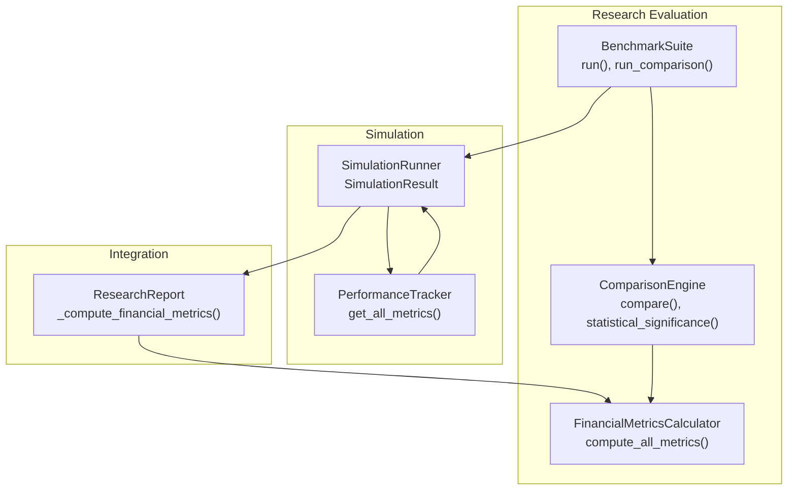
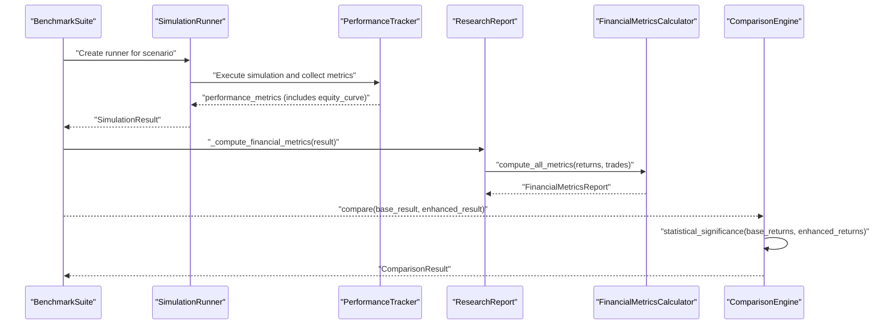
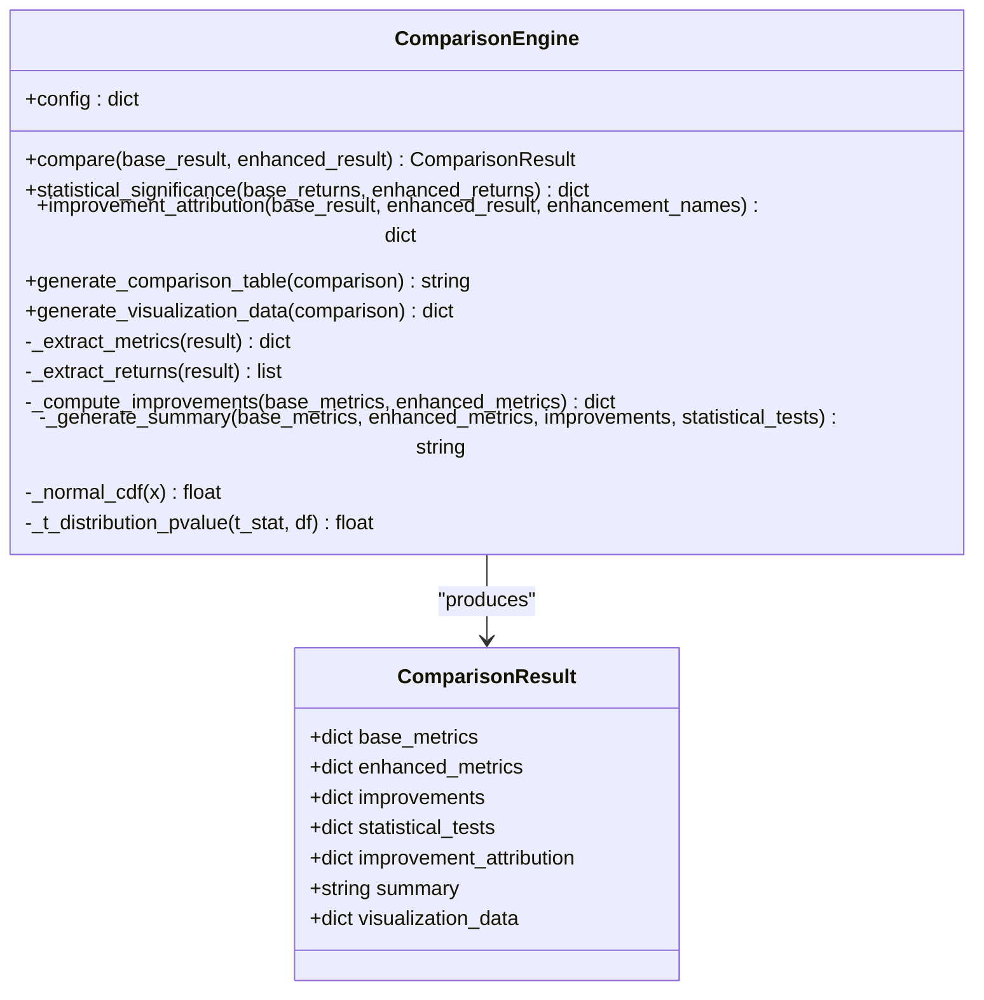
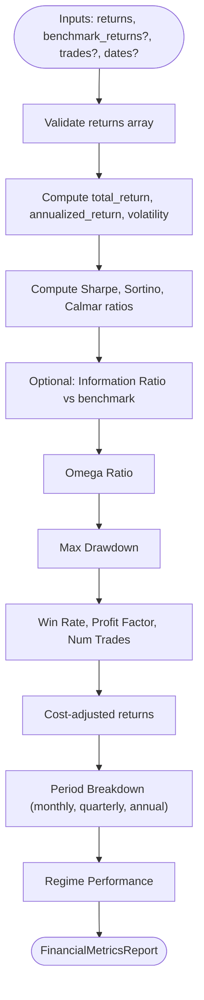
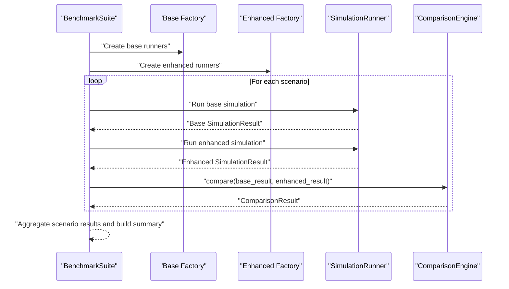
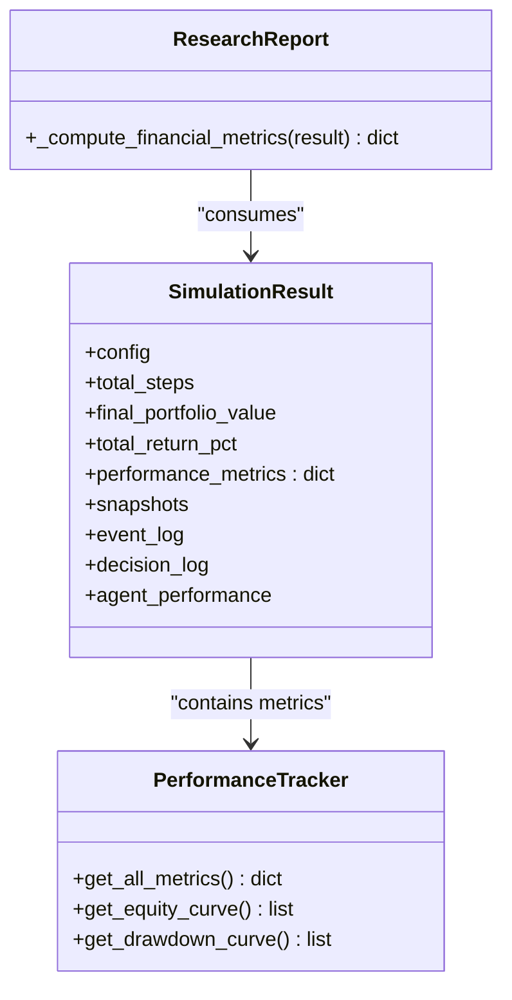
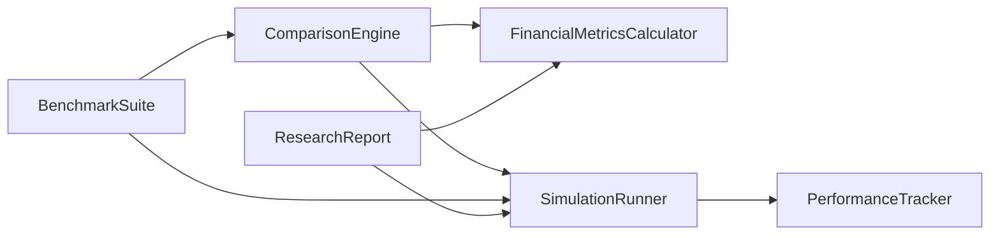

# Comparison Engine

<cite>
**Referenced Files in This Document**
- [comparison_engine.py](file://FinAgents/research/evaluation/comparison_engine.py)
- [financial_metrics.py](file://FinAgents/research/evaluation/financial_metrics.py)
- [benchmark_suite.py](file://FinAgents/research/evaluation/benchmark_suite.py)
- [simulation_runner.py](file://FinAgents/research/simulation/simulation_runner.py)
- [performance_tracker.py](file://FinAgents/research/simulation/performance_tracker.py)
- [research_report.py](file://FinAgents/research/integration/research_report.py)
- [ai_metrics.py](file://FinAgents/research/evaluation/ai_metrics.py)
</cite>

## Table of Contents
1. [Introduction](#introduction)
2. [Project Structure](#project-structure)
3. [Core Components](#core-components)
4. [Architecture Overview](#architecture-overview)
5. [Detailed Component Analysis](#detailed-component-analysis)
6. [Dependency Analysis](#dependency-analysis)
7. [Performance Considerations](#performance-considerations)
8. [Troubleshooting Guide](#troubleshooting-guide)
9. [Conclusion](#conclusion)
10. [Appendices](#appendices)

## Introduction
This document describes the Comparison Engine responsible for statistically comparing base and enhanced trading systems. It explains the statistical methods used for significance testing, confidence intervals, and significance thresholds; documents the comparison metrics, p-value computation, and effect size analysis; details integration with the FinancialMetricsCalculator for standardized performance measurement; and provides examples for setting up experiments, interpreting results, and understanding assumptions and limitations.

## Project Structure
The Comparison Engine sits within the research evaluation stack and integrates with simulation results, financial metrics calculators, and benchmark suites. The primary files involved are:
- Comparison Engine: compares base vs enhanced simulation results and runs statistical tests
- Financial Metrics Calculator: computes standardized performance metrics from returns
- Benchmark Suite: defines market scenarios and orchestrates comparative runs
- Simulation Runner and Performance Tracker: produce the structured results consumed by the comparison engine
- Research Report: demonstrates how metrics are extracted and transformed for reporting

**Diagram sources**
- [comparison_engine.py:46-131](file://FinAgents/research/evaluation/comparison_engine.py#L46-L131)
- [benchmark_suite.py:42-155](file://FinAgents/research/evaluation/benchmark_suite.py#L42-L155)
- [financial_metrics.py:77-224](file://FinAgents/research/evaluation/financial_metrics.py#L77-L224)
- [simulation_runner.py:820-830](file://FinAgents/research/simulation/simulation_runner.py#L820-L830)
- [performance_tracker.py:472-501](file://FinAgents/research/simulation/performance_tracker.py#L472-L501)
- [research_report.py:66-96](file://FinAgents/research/integration/research_report.py#L66-L96)

**Section sources**
- [comparison_engine.py:1-564](file://FinAgents/research/evaluation/comparison_engine.py#L1-L564)
- [benchmark_suite.py:1-198](file://FinAgents/research/evaluation/benchmark_suite.py#L1-L198)
- [financial_metrics.py:1-591](file://FinAgents/research/evaluation/financial_metrics.py#L1-L591)
- [simulation_runner.py:818-831](file://FinAgents/research/simulation/simulation_runner.py#L818-L831)
- [performance_tracker.py:470-539](file://FinAgents/research/simulation/performance_tracker.py#L470-L539)
- [research_report.py:63-132](file://FinAgents/research/integration/research_report.py#L63-L132)

## Core Components
- ComparisonResult: encapsulates base metrics, enhanced metrics, computed improvements, statistical test results, improvement attribution, summary narrative, and visualization-ready data.
- ComparisonEngine: orchestrates extraction of metrics and returns, computes improvements, runs paired t-tests and bootstrap confidence intervals, attributes improvements, generates summaries, and prepares visualization data.
- FinancialMetricsCalculator: computes standardized financial metrics (Sharpe, Sortino, Calmar, Omega, max drawdown, win rate, profit factor, etc.) from arrays of returns and optional trade-level data.
- BenchmarkSuite: defines standard market scenarios and runs comparative simulations for base and enhanced systems, then delegates comparison to ComparisonEngine.
- SimulationResult and PerformanceTracker: produce structured performance metrics including equity curves and trade-level data used by the comparison pipeline.

Key responsibilities:
- Statistical significance testing via paired t-test and bootstrap confidence intervals
- Standardized metric extraction and improvement computation
- Improvement attribution across enhancement components
- Visualization-ready data generation for equity curves, drawdown curves, metric bars, and pie charts

**Section sources**
- [comparison_engine.py:15-131](file://FinAgents/research/evaluation/comparison_engine.py#L15-L131)
- [financial_metrics.py:77-224](file://FinAgents/research/evaluation/financial_metrics.py#L77-L224)
- [benchmark_suite.py:42-155](file://FinAgents/research/evaluation/benchmark_suite.py#L42-L155)
- [performance_tracker.py:472-501](file://FinAgents/research/simulation/performance_tracker.py#L472-L501)

## Architecture Overview
The comparison pipeline transforms simulation outputs into standardized metrics, computes differences, and applies statistical tests to assess significance. The BenchmarkSuite coordinates scenario-based runs, while the ComparisonEngine produces narrative summaries and visualization data.

**Diagram sources**
- [benchmark_suite.py:95-155](file://FinAgents/research/evaluation/benchmark_suite.py#L95-L155)
- [research_report.py:66-96](file://FinAgents/research/integration/research_report.py#L66-L96)
- [financial_metrics.py:99-224](file://FinAgents/research/evaluation/financial_metrics.py#L99-L224)
- [comparison_engine.py:68-131](file://FinAgents/research/evaluation/comparison_engine.py#L68-L131)

## Detailed Component Analysis

### Comparison Engine
The ComparisonEngine performs:
- Metric extraction from SimulationResult objects or dicts
- Return extraction from equity curves for significance testing
- Improvement computation across key metrics (total return, Sharpe, Sortino, Calmar, max drawdown, win rate, profit factor)
- Paired t-test with normal/t-distribution approximations
- Bootstrap confidence intervals around mean differences
- Improvement attribution across enhancement components
- Summary generation and visualization data preparation

**Diagram sources**
- [comparison_engine.py:15-131](file://FinAgents/research/evaluation/comparison_engine.py#L15-L131)

Statistical methods:
- Paired t-test: computes differences between aligned returns, mean and standard deviation of differences, and a p-value using normal approximation for large samples or a simple t-distribution approximation for smaller samples. Significance threshold is 0.05.
- Bootstrap confidence intervals: resamples differences with replacement to estimate the sampling distribution of the mean difference and derives a 95% confidence interval; significance is inferred if the interval excludes zero.

Effect size analysis:
- Improvements are expressed as percentage changes relative to base values, with special handling for max drawdown (reduction increases performance).

Visualization data:
- Equity curves, drawdown curves, bar charts for selected metrics, and a pie chart for improvement attribution.

**Section sources**
- [comparison_engine.py:68-227](file://FinAgents/research/evaluation/comparison_engine.py#L68-L227)
- [comparison_engine.py:229-281](file://FinAgents/research/evaluation/comparison_engine.py#L229-L281)
- [comparison_engine.py:283-396](file://FinAgents/research/evaluation/comparison_engine.py#L283-L396)

### Financial Metrics Calculator
The FinancialMetricsCalculator standardizes performance measurement by computing:
- Total return, annualized return
- Volatility, Sharpe ratio, Sortino ratio, Calmar ratio
- Information ratio, Omega ratio
- Max drawdown and related statistics
- Win rate, profit factor
- Period breakdown (monthly, quarterly, annual)
- Regime performance
- Cost-adjusted returns

These metrics are extracted from simulation results and used by the ComparisonEngine for standardized comparison.

**Diagram sources**
- [financial_metrics.py:99-224](file://FinAgents/research/evaluation/financial_metrics.py#L99-L224)

**Section sources**
- [financial_metrics.py:77-591](file://FinAgents/research/evaluation/financial_metrics.py#L77-L591)

### Benchmark Suite
The BenchmarkSuite defines standard market scenarios (bull, bear, sideways, high-volatility, crash-recovery), runs simulations for base and enhanced systems, computes financial metrics, and delegates comparison to the ComparisonEngine. It aggregates scenario-wise results and builds concise summaries.

**Diagram sources**
- [benchmark_suite.py:42-155](file://FinAgents/research/evaluation/benchmark_suite.py#L42-L155)

**Section sources**
- [benchmark_suite.py:21-198](file://FinAgents/research/evaluation/benchmark_suite.py#L21-L198)

### Integration with Simulation Results
SimulationRunner produces SimulationResult objects containing performance_metrics (including equity_curve and trades). PerformanceTracker exposes get_all_metrics() that includes total_return, Sharpe, Sortino, Calmar, max_drawdown, volatility, win_rate, profit_factor, and equity_curve. ResearchReport converts these into standardized financial metrics for downstream comparison.

**Diagram sources**
- [simulation_runner.py:820-830](file://FinAgents/research/simulation/simulation_runner.py#L820-L830)
- [performance_tracker.py:472-501](file://FinAgents/research/simulation/performance_tracker.py#L472-L501)
- [research_report.py:66-96](file://FinAgents/research/integration/research_report.py#L66-L96)

**Section sources**
- [simulation_runner.py:818-831](file://FinAgents/research/simulation/simulation_runner.py#L818-L831)
- [performance_tracker.py:470-539](file://FinAgents/research/simulation/performance_tracker.py#L470-L539)
- [research_report.py:63-132](file://FinAgents/research/integration/research_report.py#L63-L132)

### AI Metrics (Context)
While not part of the core comparison pipeline, AI metrics (decision accuracy, precision/recall/F1, confidence calibration, explainability, learning rate, agent agreement) provide complementary insights for evaluating agent behavior and can be integrated alongside financial metrics in broader research reports.

**Section sources**
- [ai_metrics.py:58-574](file://FinAgents/research/evaluation/ai_metrics.py#L58-L574)

## Dependency Analysis
The ComparisonEngine depends on:
- FinancialMetricsCalculator for standardized metric computation
- SimulationRunner and PerformanceTracker for structured results
- BenchmarkSuite for orchestrating scenario-based comparisons

**Diagram sources**
- [comparison_engine.py:15-131](file://FinAgents/research/evaluation/comparison_engine.py#L15-L131)
- [benchmark_suite.py:42-155](file://FinAgents/research/evaluation/benchmark_suite.py#L42-L155)
- [financial_metrics.py:77-224](file://FinAgents/research/evaluation/financial_metrics.py#L77-L224)
- [simulation_runner.py:820-830](file://FinAgents/research/simulation/simulation_runner.py#L820-L830)
- [performance_tracker.py:472-501](file://FinAgents/research/simulation/performance_tracker.py#L472-L501)
- [research_report.py:66-96](file://FinAgents/research/integration/research_report.py#L66-L96)

**Section sources**
- [comparison_engine.py:1-564](file://FinAgents/research/evaluation/comparison_engine.py#L1-L564)
- [benchmark_suite.py:1-198](file://FinAgents/research/evaluation/benchmark_suite.py#L1-L198)

## Performance Considerations
- Computational efficiency: The bootstrap procedure uses a fixed number of iterations; adjust n_bootstrap for balancing accuracy and speed.
- Memory usage: Equity curves and returns are processed as arrays; ensure adequate memory for long simulations.
- Statistical power: Small sample sizes reduce power for the paired t-test; consider increasing simulation steps or using non-parametric alternatives if needed.
- Metric stability: For very short horizons, metrics like Sharpe/Sortino may be noisy; align comparisons to comparable timeframes.

[No sources needed since this section provides general guidance]

## Troubleshooting Guide
Common issues and resolutions:
- Empty or insufficient returns: The statistical significance method returns non-significant results when either dataset is empty or has fewer than two observations. Ensure equity curves are populated and converted to returns.
- Zero standard deviation in differences: Leads to undefined t-statistics; the method sets p-value to 1.0 and t-statistic to 0.0. Investigate identical returns across periods.
- No equity curve present: Returns extraction falls back to direct returns if provided; otherwise, returns remain empty and significance tests are skipped.
- Equal total returns: Improvement attribution distributes shares equally across enhancements; verify enhancement names and expected contributions.

Interpreting results:
- Paired t-test p-value below 0.05 indicates statistical significance at the 5% level.
- Bootstrap confidence interval not containing zero implies significance.
- Improvements are reported as percentage changes; negative values indicate regressions.

**Section sources**
- [comparison_engine.py:132-227](file://FinAgents/research/evaluation/comparison_engine.py#L132-L227)
- [comparison_engine.py:415-441](file://FinAgents/research/evaluation/comparison_engine.py#L415-L441)

## Conclusion
The Comparison Engine provides a robust framework for statistically comparing trading systems across diverse market conditions. By standardizing metrics, computing improvements, and applying significance tests, it enables informed decisions about system enhancements. Proper setup of simulations, accurate extraction of returns, and interpretation of statistical outputs are essential for reliable conclusions.

[No sources needed since this section summarizes without analyzing specific files]

## Appendices

### Setting Up a Comparison Experiment
Steps:
- Define scenarios using BenchmarkSuite or customize scenarios with desired market configurations.
- Create factories that instantiate SimulationRunner for base and enhanced systems.
- Run BenchmarkSuite.run_comparison to obtain base and enhanced reports and per-scenario comparisons.
- Inspect ComparisonResult.summary for narrative insights and ComparisonResult.visualization_data for charts.

Example references:
- Scenario definition and orchestration: [benchmark_suite.py:54-155](file://FinAgents/research/evaluation/benchmark_suite.py#L54-L155)
- Metrics extraction and conversion: [research_report.py:66-96](file://FinAgents/research/integration/research_report.py#L66-L96)
- Comparison execution: [comparison_engine.py:68-131](file://FinAgents/research/evaluation/comparison_engine.py#L68-L131)

**Section sources**
- [benchmark_suite.py:54-155](file://FinAgents/research/evaluation/benchmark_suite.py#L54-L155)
- [research_report.py:66-96](file://FinAgents/research/integration/research_report.py#L66-L96)
- [comparison_engine.py:68-131](file://FinAgents/research/evaluation/comparison_engine.py#L68-L131)

### Interpreting Comparison Results
- Summary: Overall assessment of total return and Sharpe ratio improvements, plus statistical significance statement.
- Improvements: Percentage changes for key metrics; negative values indicate underperformance.
- Statistical tests: Paired t-test p-value and bootstrap confidence interval; significance at 0.05 threshold.
- Visualization data: Equity curves, drawdown curves, metric bars, and improvement pie for quick insights.

**Section sources**
- [comparison_engine.py:132-131](file://FinAgents/research/evaluation/comparison_engine.py#L132-L131)
- [comparison_engine.py:482-528](file://FinAgents/research/evaluation/comparison_engine.py#L482-L528)
- [comparison_engine.py:337-396](file://FinAgents/research/evaluation/comparison_engine.py#L337-L396)

### Statistical Assumptions and Limitations
Assumptions:
- Paired t-test assumes differences are approximately normally distributed; for large samples, normal approximation is used; for small samples, a simple t-distribution approximation is applied.
- Observations are paired by aligned periods derived from equity curves.

Limitations:
- Relies on simulated equity curves; real-world performance may differ due to transaction costs, slippage, and market impact.
- Significance tests assume independence of differences; overlapping windows or regime shifts may violate this assumption.
- Improvement attribution uses a simple equal-share model; real attribution requires controlled ablation studies.

**Section sources**
- [comparison_engine.py:132-227](file://FinAgents/research/evaluation/comparison_engine.py#L132-L227)
- [comparison_engine.py:229-281](file://FinAgents/research/evaluation/comparison_engine.py#L229-L281)