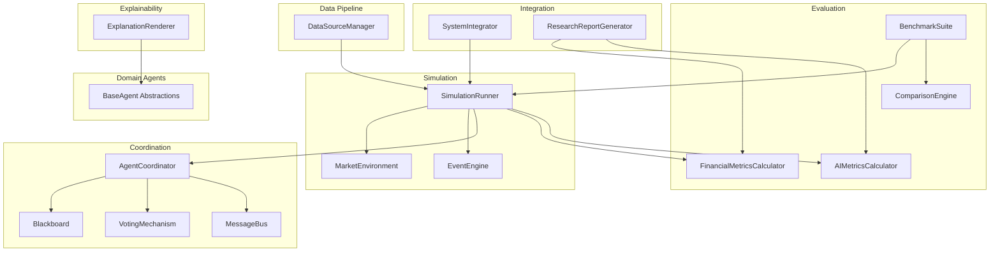
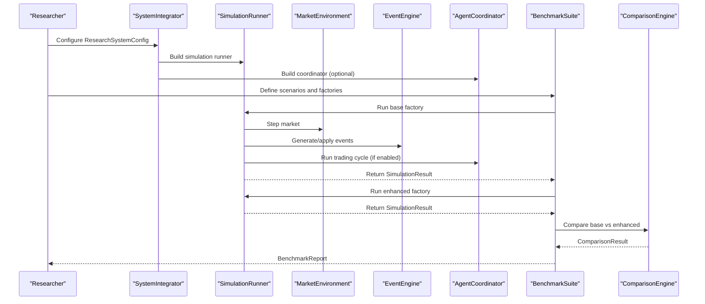
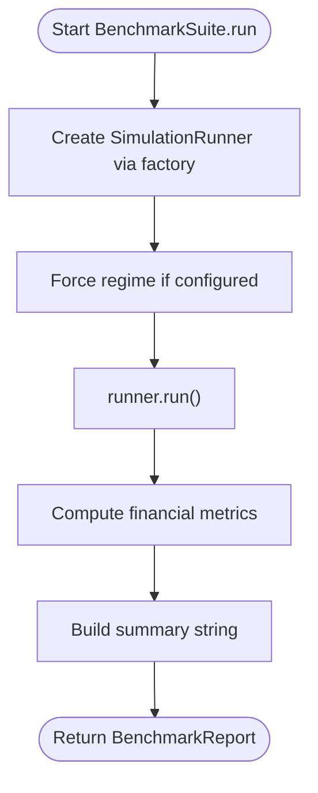
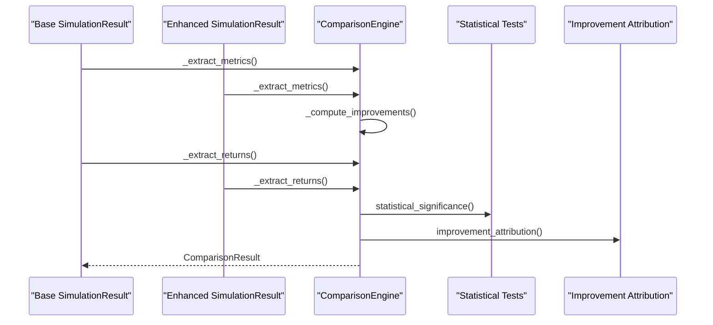
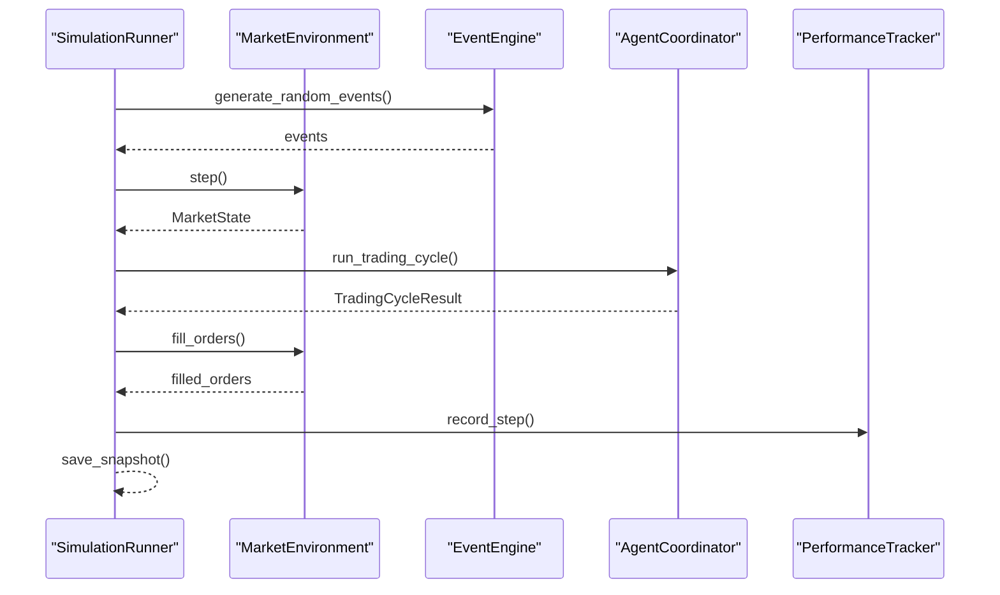
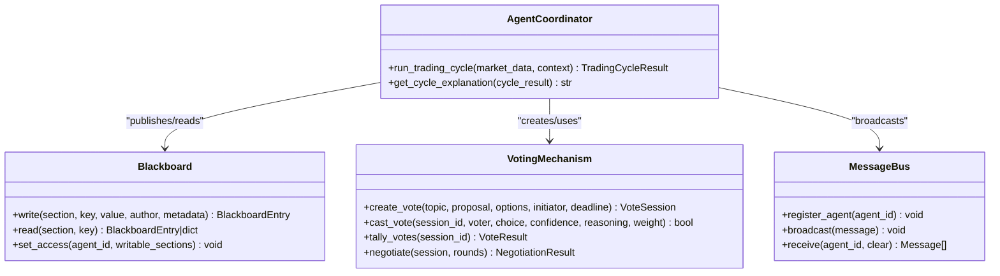
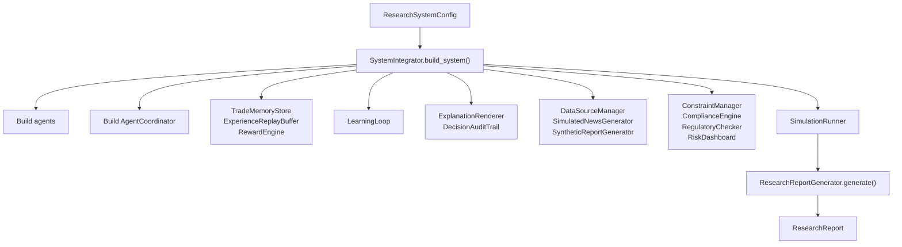
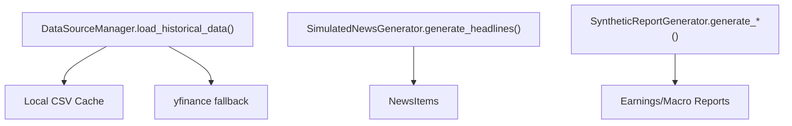
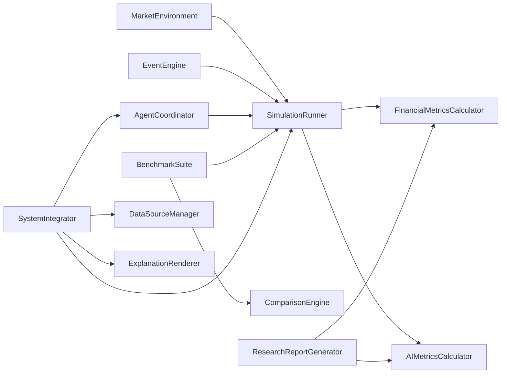

# Research Framework

<cite>
**Referenced Files in This Document**
- [__init__.py](file://FinAgents/research/__init__.py)
- [benchmark_suite.py](file://FinAgents/research/evaluation/benchmark_suite.py)
- [comparison_engine.py](file://FinAgents/research/evaluation/comparison_engine.py)
- [financial_metrics.py](file://FinAgents/research/evaluation/financial_metrics.py)
- [ai_metrics.py](file://FinAgents/research/evaluation/ai_metrics.py)
- [system_integrator.py](file://FinAgents/research/integration/system_integrator.py)
- [research_report.py](file://FinAgents/research/integration/research_report.py)
- [simulation_runner.py](file://FinAgents/research/simulation/simulation_runner.py)
- [market_environment.py](file://FinAgents/research/simulation/market_environment.py)
- [event_engine.py](file://FinAgents/research/simulation/event_engine.py)
- [coordinator.py](file://FinAgents/research/coordination/coordinator.py)
- [blackboard.py](file://FinAgents/research/coordination/blackboard.py)
- [voting.py](file://FinAgents/research/coordination/voting.py)
- [protocols.py](file://FinAgents/research/coordination/protocols.py)
- [base_agent.py](file://FinAgents/research/domain_agents/base_agent.py)
- [explanation_renderer.py](file://FinAgents/research/explainability/explanation_renderer.py)
- [data_sources.py](file://FinAgents/research/data_pipeline/data_sources.py)
</cite>

## Table of Contents
1. [Introduction](#introduction)
2. [Project Structure](#project-structure)
3. [Core Components](#core-components)
4. [Architecture Overview](#architecture-overview)
5. [Detailed Component Analysis](#detailed-component-analysis)
6. [Dependency Analysis](#dependency-analysis)
7. [Performance Considerations](#performance-considerations)
8. [Troubleshooting Guide](#troubleshooting-guide)
9. [Conclusion](#conclusion)
10. [Appendices](#appendices)

## Introduction
This document describes the Research Framework for comparative analysis and research experiment orchestration within the FinAgents platform. It covers the benchmark suite for strategy comparison, the comparison engine for statistical significance testing, the system integrator for research pipeline coordination, research report generation, experimental design patterns, and workflow automation. It also documents integration with the evaluation framework, comparative analysis methodologies, and research validation procedures, including reproducibility, experimental controls, and result interpretation guidelines.

## Project Structure
The Research Framework is organized into cohesive functional areas:
- Evaluation: benchmark suite, comparison engine, financial and AI metrics calculators
- Simulation: market environment, event engine, and simulation runner
- Coordination: agent coordinator, blackboard, voting, and messaging protocols
- Integration: system integrator and research report generator
- Domain Agents: base agent abstractions and specialized agents
- Explainability: explanation renderer and reasoning chain utilities
- Data Pipeline: data sources, feature engineering, preprocessing, and synthetic data generators

**Diagram sources**
- [system_integrator.py:94-156](file://FinAgents/research/integration/system_integrator.py#L94-L156)
- [simulation_runner.py:151-318](file://FinAgents/research/simulation/simulation_runner.py#L151-L318)
- [market_environment.py:321-557](file://FinAgents/research/simulation/market_environment.py#L321-L557)
- [event_engine.py:113-370](file://FinAgents/research/simulation/event_engine.py#L113-L370)
- [coordinator.py:93-192](file://FinAgents/research/coordination/coordinator.py#L93-L192)
- [blackboard.py:94-126](file://FinAgents/research/coordination/blackboard.py#L94-L126)
- [voting.py:170-244](file://FinAgents/research/coordination/voting.py#L170-L244)
- [protocols.py:428-533](file://FinAgents/research/coordination/protocols.py#L428-L533)
- [benchmark_suite.py:42-155](file://FinAgents/research/evaluation/benchmark_suite.py#L42-L155)
- [comparison_engine.py:46-130](file://FinAgents/research/evaluation/comparison_engine.py#L46-L130)
- [financial_metrics.py:77-129](file://FinAgents/research/evaluation/financial_metrics.py#L77-L129)
- [ai_metrics.py:58-88](file://FinAgents/research/evaluation/ai_metrics.py#L58-L88)
- [research_report.py:25-64](file://FinAgents/research/integration/research_report.py#L25-L64)
- [explanation_renderer.py:73-137](file://FinAgents/research/explainability/explanation_renderer.py#L73-L137)
- [data_sources.py:54-132](file://FinAgents/research/data_pipeline/data_sources.py#L54-L132)

**Section sources**
- [__init__.py:1-34](file://FinAgents/research/__init__.py#L1-L34)

## Core Components
- BenchmarkSuite: Defines standard market scenarios and runs simulations to produce benchmark reports for base and enhanced systems, enabling comparative analysis.
- ComparisonEngine: Computes performance improvements, runs statistical significance tests (paired t-test and bootstrap), and attributes improvements across enhancements.
- FinancialMetricsCalculator and AIMetricsCalculator: Provide comprehensive financial and AI/agent-specific metrics for research-grade evaluation.
- SimulationRunner: Orchestrates market environment, events, agents, and performance tracking to run end-to-end trading simulations.
- MarketEnvironment and EventEngine: Simulate realistic price dynamics with regime transitions and external events.
- AgentCoordinator: Coordinates multi-agent workflows via shared blackboard, messaging, and voting mechanisms.
- SystemIntegrator: Wires research modules into a cohesive system with agents, memory, learning loops, risk controls, and simulation runner.
- ResearchReportGenerator: Produces structured research reports with financial and AI metrics, comparisons, and artifacts.
- ExplanationRenderer: Converts reasoning chains and actions into human-readable explanations across formats for stakeholders.

**Section sources**
- [benchmark_suite.py:42-155](file://FinAgents/research/evaluation/benchmark_suite.py#L42-L155)
- [comparison_engine.py:46-130](file://FinAgents/research/evaluation/comparison_engine.py#L46-L130)
- [financial_metrics.py:77-129](file://FinAgents/research/evaluation/financial_metrics.py#L77-L129)
- [ai_metrics.py:58-88](file://FinAgents/research/evaluation/ai_metrics.py#L58-L88)
- [simulation_runner.py:151-318](file://FinAgents/research/simulation/simulation_runner.py#L151-L318)
- [market_environment.py:321-557](file://FinAgents/research/simulation/market_environment.py#L321-L557)
- [event_engine.py:113-370](file://FinAgents/research/simulation/event_engine.py#L113-L370)
- [coordinator.py:93-192](file://FinAgents/research/coordination/coordinator.py#L93-L192)
- [blackboard.py:94-126](file://FinAgents/research/coordination/blackboard.py#L94-L126)
- [voting.py:170-244](file://FinAgents/research/coordination/voting.py#L170-L244)
- [protocols.py:428-533](file://FinAgents/research/coordination/protocols.py#L428-L533)
- [system_integrator.py:94-156](file://FinAgents/research/integration/system_integrator.py#L94-L156)
- [research_report.py:25-64](file://FinAgents/research/integration/research_report.py#L25-L64)
- [explanation_renderer.py:73-137](file://FinAgents/research/explainability/explanation_renderer.py#L73-L137)

## Architecture Overview
The Research Framework integrates modular components to support reproducible research experiments:
- Simulation layer generates market states and events, feeding into agent decision-making.
- Coordination layer orchestrates multi-agent workflows with shared memory and voting.
- Evaluation layer compares base versus enhanced systems using standardized metrics and statistical tests.
- Integration layer builds cohesive research systems and produces research reports.

**Diagram sources**
- [system_integrator.py:94-156](file://FinAgents/research/integration/system_integrator.py#L94-L156)
- [simulation_runner.py:223-318](file://FinAgents/research/simulation/simulation_runner.py#L223-L318)
- [market_environment.py:462-557](file://FinAgents/research/simulation/market_environment.py#L462-L557)
- [event_engine.py:249-312](file://FinAgents/research/simulation/event_engine.py#L249-L312)
- [coordinator.py:165-192](file://FinAgents/research/coordination/coordinator.py#L165-L192)
- [benchmark_suite.py:95-155](file://FinAgents/research/evaluation/benchmark_suite.py#L95-L155)
- [comparison_engine.py:68-130](file://FinAgents/research/evaluation/comparison_engine.py#L68-L130)

## Detailed Component Analysis

### Benchmark Suite and Comparative Analysis
The benchmark suite defines standard market scenarios and runs simulations to produce scenario-wise results and aggregated summaries. It computes financial metrics and supports comparison between base and enhanced systems.

**Diagram sources**
- [benchmark_suite.py:95-131](file://FinAgents/research/evaluation/benchmark_suite.py#L95-L131)

**Section sources**
- [benchmark_suite.py:42-155](file://FinAgents/research/evaluation/benchmark_suite.py#L42-L155)
- [financial_metrics.py:99-224](file://FinAgents/research/evaluation/financial_metrics.py#L99-L224)

### Comparison Engine and Statistical Significance Testing
The comparison engine extracts metrics from simulation results, computes improvements, performs paired t-tests and bootstrap confidence intervals, and attributes improvements across enhancements.

**Diagram sources**
- [comparison_engine.py:68-130](file://FinAgents/research/evaluation/comparison_engine.py#L68-L130)
- [comparison_engine.py:132-227](file://FinAgents/research/evaluation/comparison_engine.py#L132-L227)
- [comparison_engine.py:229-281](file://FinAgents/research/evaluation/comparison_engine.py#L229-L281)

**Section sources**
- [comparison_engine.py:46-130](file://FinAgents/research/evaluation/comparison_engine.py#L46-L130)
- [comparison_engine.py:132-227](file://FinAgents/research/evaluation/comparison_engine.py#L132-L227)
- [comparison_engine.py:229-281](file://FinAgents/research/evaluation/comparison_engine.py#L229-L281)

### Simulation Runner and Market Environment
The simulation runner orchestrates market evolution, applies events, executes agent orders, tracks performance, and snapshots state. The market environment evolves prices using geometric Brownian motion with jumps and transitions between regimes.

**Diagram sources**
- [simulation_runner.py:223-318](file://FinAgents/research/simulation/simulation_runner.py#L223-L318)
- [market_environment.py:462-557](file://FinAgents/research/simulation/market_environment.py#L462-L557)
- [event_engine.py:249-312](file://FinAgents/research/simulation/event_engine.py#L249-L312)
- [coordinator.py:165-192](file://FinAgents/research/coordination/coordinator.py#L165-L192)

**Section sources**
- [simulation_runner.py:151-318](file://FinAgents/research/simulation/simulation_runner.py#L151-L318)
- [market_environment.py:321-557](file://FinAgents/research/simulation/market_environment.py#L321-L557)
- [event_engine.py:113-370](file://FinAgents/research/simulation/event_engine.py#L113-L370)

### Agent Coordination, Blackboard, and Voting
The coordinator orchestrates multi-agent workflows using a shared blackboard, message bus, and voting mechanism. It implements a structured trading cycle with publishing assessments, proposals, risk assessments, and portfolio reallocations, followed by voting and negotiation.

**Diagram sources**
- [coordinator.py:93-192](file://FinAgents/research/coordination/coordinator.py#L93-L192)
- [blackboard.py:94-126](file://FinAgents/research/coordination/blackboard.py#L94-L126)
- [voting.py:170-244](file://FinAgents/research/coordination/voting.py#L170-L244)
- [protocols.py:428-533](file://FinAgents/research/coordination/protocols.py#L428-L533)

**Section sources**
- [coordinator.py:93-192](file://FinAgents/research/coordination/coordinator.py#L93-L192)
- [blackboard.py:94-126](file://FinAgents/research/coordination/blackboard.py#L94-L126)
- [voting.py:170-244](file://FinAgents/research/coordination/voting.py#L170-L244)
- [protocols.py:428-533](file://FinAgents/research/coordination/protocols.py#L428-L533)

### System Integrator and Research Report Generation
The system integrator composes research components into a cohesive system, wiring agents, memory, learning loops, risk controls, and the simulation runner. The research report generator compiles financial and AI metrics, comparisons, and artifacts into a structured research report.

**Diagram sources**
- [system_integrator.py:94-156](file://FinAgents/research/integration/system_integrator.py#L94-L156)
- [research_report.py:25-64](file://FinAgents/research/integration/research_report.py#L25-L64)

**Section sources**
- [system_integrator.py:45-156](file://FinAgents/research/integration/system_integrator.py#L45-L156)
- [research_report.py:14-64](file://FinAgents/research/integration/research_report.py#L14-L64)

### Data Pipeline and Synthetic Data
The data pipeline provides unified access to historical market data and generates synthetic news and reports for research and backtesting.

**Diagram sources**
- [data_sources.py:54-132](file://FinAgents/research/data_pipeline/data_sources.py#L54-L132)
- [data_sources.py:164-341](file://FinAgents/research/data_pipeline/data_sources.py#L164-L341)
- [data_sources.py:449-617](file://FinAgents/research/data_pipeline/data_sources.py#L449-L617)

**Section sources**
- [data_sources.py:54-132](file://FinAgents/research/data_pipeline/data_sources.py#L54-L132)
- [data_sources.py:164-341](file://FinAgents/research/data_pipeline/data_sources.py#L164-L341)
- [data_sources.py:449-617](file://FinAgents/research/data_pipeline/data_sources.py#L449-L617)

### Explainability and Decision Auditing
The explanation renderer transforms reasoning chains and actions into multiple formats (plain text, structured JSON, regulatory, executive summary) and computes data attribution for transparency and auditability.

**Section sources**
- [explanation_renderer.py:73-137](file://FinAgents/research/explainability/explanation_renderer.py#L73-L137)

## Dependency Analysis
The Research Framework exhibits layered dependencies:
- Simulation depends on MarketEnvironment and EventEngine; optionally on AgentCoordinator.
- Evaluation depends on SimulationResults and metrics calculators.
- Integration composes all modules into a ResearchSystem.
- Coordination provides shared infrastructure for multi-agent orchestration.

**Diagram sources**
- [simulation_runner.py:151-318](file://FinAgents/research/simulation/simulation_runner.py#L151-L318)
- [market_environment.py:321-557](file://FinAgents/research/simulation/market_environment.py#L321-L557)
- [event_engine.py:113-370](file://FinAgents/research/simulation/event_engine.py#L113-L370)
- [coordinator.py:93-192](file://FinAgents/research/coordination/coordinator.py#L93-L192)
- [benchmark_suite.py:42-155](file://FinAgents/research/evaluation/benchmark_suite.py#L42-L155)
- [comparison_engine.py:46-130](file://FinAgents/research/evaluation/comparison_engine.py#L46-L130)
- [system_integrator.py:94-156](file://FinAgents/research/integration/system_integrator.py#L94-L156)
- [research_report.py:25-64](file://FinAgents/research/integration/research_report.py#L25-L64)
- [explanation_renderer.py:73-137](file://FinAgents/research/explainability/explanation_renderer.py#L73-L137)
- [data_sources.py:54-132](file://FinAgents/research/data_pipeline/data_sources.py#L54-L132)

**Section sources**
- [benchmark_suite.py:42-155](file://FinAgents/research/evaluation/benchmark_suite.py#L42-L155)
- [comparison_engine.py:46-130](file://FinAgents/research/evaluation/comparison_engine.py#L46-L130)
- [financial_metrics.py:77-129](file://FinAgents/research/evaluation/financial_metrics.py#L77-L129)
- [ai_metrics.py:58-88](file://FinAgents/research/evaluation/ai_metrics.py#L58-L88)
- [simulation_runner.py:151-318](file://FinAgents/research/simulation/simulation_runner.py#L151-L318)
- [system_integrator.py:94-156](file://FinAgents/research/integration/system_integrator.py#L94-L156)
- [research_report.py:25-64](file://FinAgents/research/integration/research_report.py#L25-L64)
- [explanation_renderer.py:73-137](file://FinAgents/research/explainability/explanation_renderer.py#L73-L137)
- [data_sources.py:54-132](file://FinAgents/research/data_pipeline/data_sources.py#L54-L132)

## Performance Considerations
- Simulation scalability: MarketEnvironment and EventEngine use vectorized operations and efficient data structures; consider batch processing and caching for large-scale runs.
- Randomness and reproducibility: Set random seeds in SimulationRunner, MarketEnvironment, and EventEngine to ensure reproducible results across runs.
- Metrics computation: FinancialMetricsCalculator and AIMetricsCalculator operate on arrays; ensure minimal allocations and reuse intermediate arrays where possible.
- Coordination overhead: Blackboard writes and message broadcasts should be scoped to necessary sections and messages to reduce contention.
- Visualization data: ComparisonEngine generates visualization datasets; pre-allocate arrays for large simulations to avoid repeated allocations.

[No sources needed since this section provides general guidance]

## Troubleshooting Guide
Common issues and resolutions:
- Missing yfinance dependency: DataSourceManager.load_historical_data raises ImportError if yfinance is unavailable; install the dependency or use local cache.
- Empty simulation results: Ensure SimulationRunner receives valid MarketData and that agents return actionable decisions; verify MarketEnvironment states and EventEngine activity.
- Statistical significance not significant: Review paired t-test assumptions and bootstrap confidence intervals; consider larger sample sizes or reduced variance.
- Voting not reaching consensus: Adjust consensus thresholds, weights, or enable negotiation rounds; review agent reasoning and confidence levels.
- Blackboard access denied: Confirm agent write access via Blackboard.set_access; ensure roles map to appropriate sections.

**Section sources**
- [data_sources.py:128-131](file://FinAgents/research/data_pipeline/data_sources.py#L128-L131)
- [simulation_runner.py:223-318](file://FinAgents/research/simulation/simulation_runner.py#L223-L318)
- [comparison_engine.py:132-227](file://FinAgents/research/evaluation/comparison_engine.py#L132-L227)
- [voting.py:170-244](file://FinAgents/research/coordination/voting.py#L170-L244)
- [blackboard.py:164-171](file://FinAgents/research/coordination/blackboard.py#L164-L171)

## Conclusion
The Research Framework provides a comprehensive toolkit for designing, executing, and validating research experiments in trading systems. It standardizes benchmark scenarios, enables rigorous comparative analysis with statistical significance testing, coordinates multi-agent workflows, and automates research report generation. By leveraging reproducible simulations, transparent coordination, and structured evaluation metrics, researchers can systematically assess strategy improvements, validate claims, and ensure result interpretability.

[No sources needed since this section summarizes without analyzing specific files]

## Appendices

### Experimental Design Patterns
- Scenario-based benchmarking: Define Bull, Bear, Sideways, High Volatility, and Crash-Recovery scenarios with forced regimes and market parameters.
- Controlled comparisons: Use identical random seeds and market configurations to isolate effect sizes; compare base versus enhanced systems using paired t-tests and bootstrap confidence intervals.
- Multi-metric evaluation: Combine financial metrics (returns, Sharpe, drawdown) with AI metrics (accuracy, calibration, explainability) for holistic assessment.
- Workflow automation: Use SystemIntegrator to wire components and ResearchReportGenerator to produce standardized outputs.

**Section sources**
- [benchmark_suite.py:54-93](file://FinAgents/research/evaluation/benchmark_suite.py#L54-L93)
- [comparison_engine.py:132-227](file://FinAgents/research/evaluation/comparison_engine.py#L132-L227)
- [financial_metrics.py:99-224](file://FinAgents/research/evaluation/financial_metrics.py#L99-L224)
- [ai_metrics.py:80-186](file://FinAgents/research/evaluation/ai_metrics.py#L80-L186)
- [system_integrator.py:94-156](file://FinAgents/research/integration/system_integrator.py#L94-L156)
- [research_report.py:25-64](file://FinAgents/research/integration/research_report.py#L25-L64)

### Research Validation Procedures
- Reproducibility: Set random seeds across SimulationRunner, MarketEnvironment, and EventEngine; snapshot and restore states when needed.
- Experimental controls: Hold constant market parameters, initial capital, and agent configurations; vary only the treatment variable (e.g., multimodal enhancements).
- Result interpretation: Use paired t-tests to assess statistical significance; interpret bootstrap confidence intervals for practical significance; attribute improvements across enhancements using equal attribution or ablation studies.

**Section sources**
- [simulation_runner.py:181-183](file://FinAgents/research/simulation/simulation_runner.py#L181-L183)
- [market_environment.py:756-764](file://FinAgents/research/simulation/market_environment.py#L756-L764)
- [event_engine.py:652-660](file://FinAgents/research/simulation/event_engine.py#L652-L660)
- [comparison_engine.py:132-227](file://FinAgents/research/evaluation/comparison_engine.py#L132-L227)
- [comparison_engine.py:229-281](file://FinAgents/research/evaluation/comparison_engine.py#L229-L281)