# Research Reporting

<cite>
**Referenced Files in This Document**
- [research_report.py](file://FinAgents/research/integration/research_report.py)
- [benchmark_suite.py](file://FinAgents/research/evaluation/benchmark_suite.py)
- [comparison_engine.py](file://FinAgents/research/evaluation/comparison_engine.py)
- [financial_metrics.py](file://FinAgents/research/evaluation/financial_metrics.py)
- [ai_metrics.py](file://FinAgents/research/evaluation/ai_metrics.py)
- [simulation_runner.py](file://FinAgents/research/simulation/simulation_runner.py)
- [system_integrator.py](file://FinAgents/research/integration/system_integrator.py)
- [explanation_renderer.py](file://FinAgents/research/explainability/explanation_renderer.py)
- [data_sources.py](file://FinAgents/research/data_pipeline/data_sources.py)
- [demo_runner.py](file://FinAgents/research/integration/demo_runner.py)
- [core.py](file://FinAgents/agent_pools/alpha_agent_pool/core.py)
</cite>

## Table of Contents
1. [Introduction](#introduction)
2. [Project Structure](#project-structure)
3. [Core Components](#core-components)
4. [Architecture Overview](#architecture-overview)
5. [Detailed Component Analysis](#detailed-component-analysis)
6. [Dependency Analysis](#dependency-analysis)
7. [Performance Considerations](#performance-considerations)
8. [Troubleshooting Guide](#troubleshooting-guide)
9. [Conclusion](#conclusion)
10. [Appendices](#appendices)

## Introduction
This document describes the Research Reporting system that generates comprehensive research findings and analysis reports for the FinAgents ecosystem. It explains the report generation pipeline, integration with benchmark suites, comparison engines, and simulation results, and outlines customization options, output formats, and publication workflows. It also covers versioning, sharing, and collaboration mechanisms for research documentation.

## Project Structure
The Research Reporting system spans several modules:
- Integration: orchestrates research components and produces structured reports
- Evaluation: computes financial and AI metrics, runs benchmark suites, and compares systems
- Simulation: executes end-to-end market simulations and tracks performance
- Explainability: renders human-readable explanations for decisions
- Data Pipeline: provides synthetic and curated data for research
- Agent Pool: integrates strategy research and report generation into agent workflows

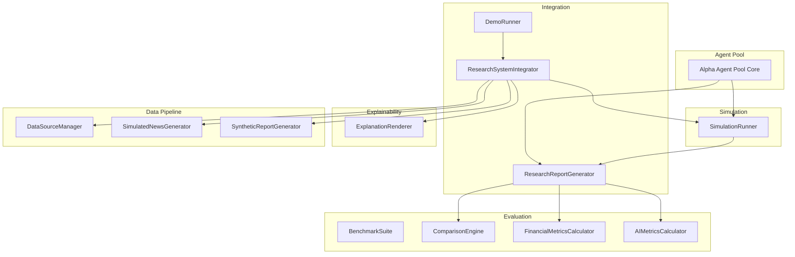

**Diagram sources**
- [research_report.py:25-64](file://FinAgents/research/integration/research_report.py#L25-L64)
- [system_integrator.py:94-156](file://FinAgents/research/integration/system_integrator.py#L94-L156)
- [benchmark_suite.py:42-155](file://FinAgents/research/evaluation/benchmark_suite.py#L42-L155)
- [comparison_engine.py:46-130](file://FinAgents/research/evaluation/comparison_engine.py#L46-L130)
- [financial_metrics.py:77-224](file://FinAgents/research/evaluation/financial_metrics.py#L77-L224)
- [ai_metrics.py:58-186](file://FinAgents/research/evaluation/ai_metrics.py#L58-L186)
- [simulation_runner.py:151-318](file://FinAgents/research/simulation/simulation_runner.py#L151-L318)
- [explanation_renderer.py:73-137](file://FinAgents/research/explainability/explanation_renderer.py#L73-L137)
- [data_sources.py:54-132](file://FinAgents/research/data_pipeline/data_sources.py#L54-L132)
- [demo_runner.py:14-83](file://FinAgents/research/integration/demo_runner.py#L14-L83)
- [core.py:2190-2229](file://FinAgents/agent_pools/alpha_agent_pool/core.py#L2190-L2229)

**Section sources**
- [research_report.py:1-133](file://FinAgents/research/integration/research_report.py#L1-L133)
- [system_integrator.py:1-222](file://FinAgents/research/integration/system_integrator.py#L1-L222)
- [benchmark_suite.py:1-198](file://FinAgents/research/evaluation/benchmark_suite.py#L1-L198)
- [comparison_engine.py:1-564](file://FinAgents/research/evaluation/comparison_engine.py#L1-L564)
- [financial_metrics.py:1-591](file://FinAgents/research/evaluation/financial_metrics.py#L1-L591)
- [ai_metrics.py:1-574](file://FinAgents/research/evaluation/ai_metrics.py#L1-L574)
- [simulation_runner.py:1-831](file://FinAgents/research/simulation/simulation_runner.py#L1-L831)
- [explanation_renderer.py:1-378](file://FinAgents/research/explainability/explanation_renderer.py#L1-L378)
- [data_sources.py:1-617](file://FinAgents/research/data_pipeline/data_sources.py#L1-L617)
- [demo_runner.py:1-88](file://FinAgents/research/integration/demo_runner.py#L1-L88)
- [core.py:2190-2229](file://FinAgents/agent_pools/alpha_agent_pool/core.py#L2190-L2229)

## Core Components
- ResearchReportGenerator: transforms simulation results into a structured research report with financial and AI metrics, optional baseline comparison, and artifacts.
- BenchmarkSuite: defines market regimes and scenarios, runs simulations, aggregates metrics, and builds comparative summaries.
- ComparisonEngine: computes improvements, statistical significance, attribution, and visualization-ready data.
- FinancialMetricsCalculator: computes advanced financial metrics including Sharpe, Sortino, Calmar, Omega, drawdowns, and regime-specific performance.
- AIMetricsCalculator: evaluates agent decision quality, confidence calibration, explainability, learning rate, and inter-agent agreement.
- SimulationRunner: orchestrates market environments, events, agents, and performance tracking to produce SimulationResult objects.
- ExplanationRenderer: renders explanations for decisions in multiple formats (plain text, structured JSON, regulatory, executive summary).
- DataSourceManager/SimulatedNewsGenerator/SyntheticReportGenerator: provide historical and synthetic data for research-grade datasets.
- ResearchSystemIntegrator: wires all modules into a cohesive research system and constructs reasoning chains for explanations.
- DemoRunner: demonstrates end-to-end execution and sample explanations.
- Alpha Agent Pool Core: integrates strategy research and report generation into agent workflows and persists reports to disk.

**Section sources**
- [research_report.py:14-133](file://FinAgents/research/integration/research_report.py#L14-L133)
- [benchmark_suite.py:21-198](file://FinAgents/research/evaluation/benchmark_suite.py#L21-L198)
- [comparison_engine.py:15-564](file://FinAgents/research/evaluation/comparison_engine.py#L15-L564)
- [financial_metrics.py:16-591](file://FinAgents/research/evaluation/financial_metrics.py#L16-L591)
- [ai_metrics.py:15-574](file://FinAgents/research/evaluation/ai_metrics.py#L15-L574)
- [simulation_runner.py:40-831](file://FinAgents/research/simulation/simulation_runner.py#L40-L831)
- [explanation_renderer.py:19-378](file://FinAgents/research/explainability/explanation_renderer.py#L19-L378)
- [data_sources.py:19-617](file://FinAgents/research/data_pipeline/data_sources.py#L19-L617)
- [system_integrator.py:45-222](file://FinAgents/research/integration/system_integrator.py#L45-L222)
- [demo_runner.py:14-88](file://FinAgents/research/integration/demo_runner.py#L14-L88)
- [core.py:2190-2229](file://FinAgents/agent_pools/alpha_agent_pool/core.py#L2190-L2229)

## Architecture Overview
The Research Reporting system follows a modular pipeline:
- Data ingestion via DataSourceManager and synthetic generators
- Simulation execution via SimulationRunner producing SimulationResult
- Metrics computation via FinancialMetricsCalculator and AIMetricsCalculator
- Comparative analysis via BenchmarkSuite and ComparisonEngine
- Report generation via ResearchReportGenerator
- Explanations via ExplanationRenderer
- Integration and demo via ResearchSystemIntegrator and DemoRunner
- Agent pool integration via Alpha Agent Pool Core

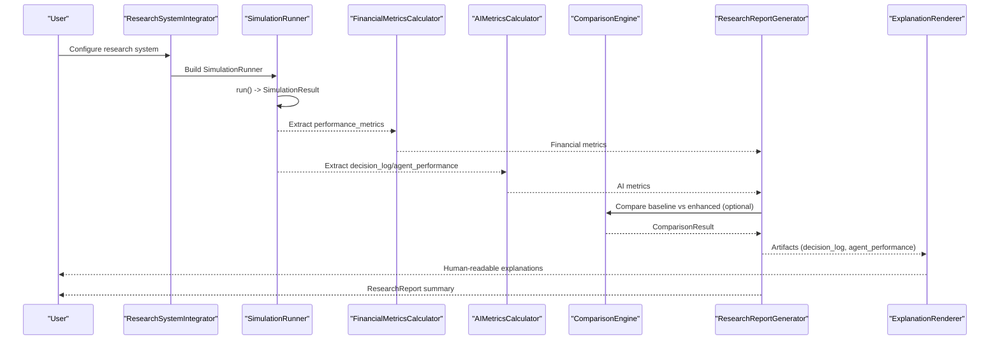

**Diagram sources**
- [system_integrator.py:94-156](file://FinAgents/research/integration/system_integrator.py#L94-L156)
- [simulation_runner.py:223-318](file://FinAgents/research/simulation/simulation_runner.py#L223-L318)
- [financial_metrics.py:99-224](file://FinAgents/research/evaluation/financial_metrics.py#L99-L224)
- [ai_metrics.py:80-186](file://FinAgents/research/evaluation/ai_metrics.py#L80-L186)
- [comparison_engine.py:68-130](file://FinAgents/research/evaluation/comparison_engine.py#L68-L130)
- [research_report.py:33-64](file://FinAgents/research/integration/research_report.py#L33-L64)
- [explanation_renderer.py:87-137](file://FinAgents/research/explainability/explanation_renderer.py#L87-L137)

## Detailed Component Analysis

### ResearchReportGenerator
Generates a structured research report from SimulationResult, optionally compared against a baseline. Computes financial and AI metrics, builds a summary, and attaches artifacts such as decision logs and agent performance.

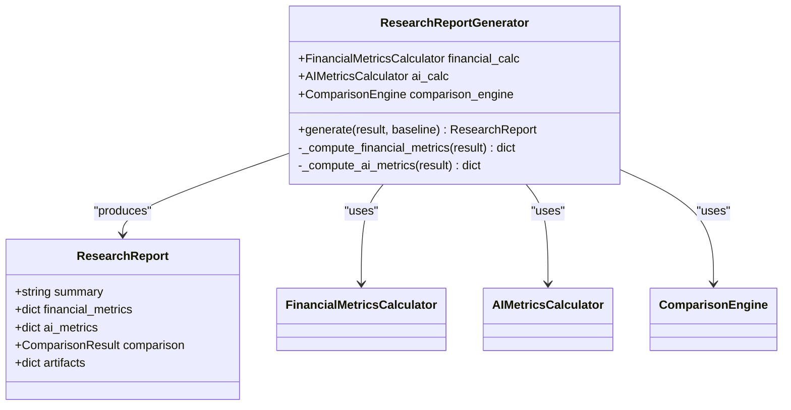

**Diagram sources**
- [research_report.py:14-133](file://FinAgents/research/integration/research_report.py#L14-L133)

**Section sources**
- [research_report.py:25-133](file://FinAgents/research/integration/research_report.py#L25-L133)

### BenchmarkSuite and ComparisonEngine
BenchmarkSuite defines market scenarios and runs simulations to produce BenchmarkReport objects. ComparisonEngine compares base vs enhanced systems, computes improvements, statistical significance, and attribution.

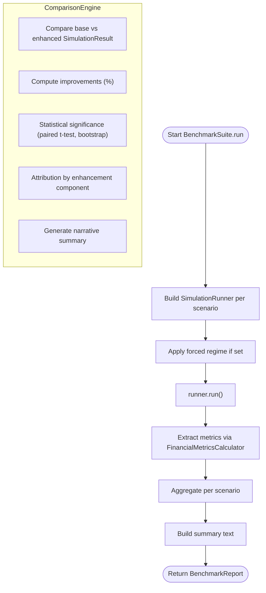

**Diagram sources**
- [benchmark_suite.py:95-198](file://FinAgents/research/evaluation/benchmark_suite.py#L95-L198)
- [comparison_engine.py:68-564](file://FinAgents/research/evaluation/comparison_engine.py#L68-L564)

**Section sources**
- [benchmark_suite.py:42-198](file://FinAgents/research/evaluation/benchmark_suite.py#L42-L198)
- [comparison_engine.py:46-564](file://FinAgents/research/evaluation/comparison_engine.py#L46-L564)

### SimulationRunner
End-to-end simulation orchestrator that coordinates market environment, events, agents, and performance tracking. Produces SimulationResult with snapshots, event logs, decision logs, and agent performance.

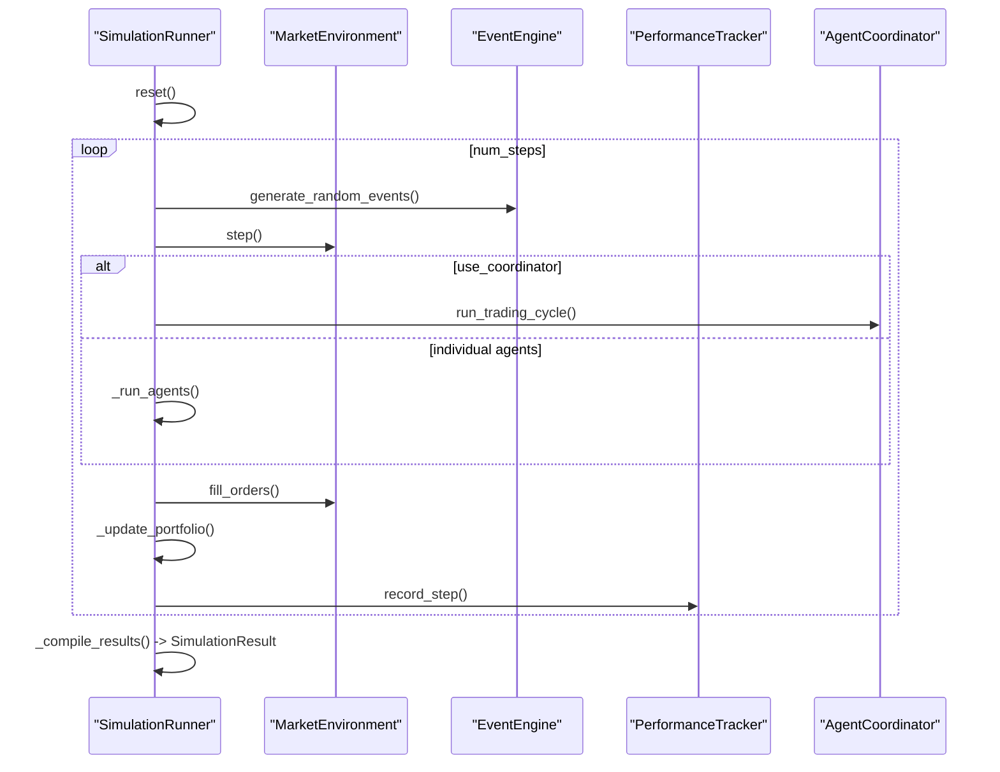

**Diagram sources**
- [simulation_runner.py:223-382](file://FinAgents/research/simulation/simulation_runner.py#L223-L382)

**Section sources**
- [simulation_runner.py:151-831](file://FinAgents/research/simulation/simulation_runner.py#L151-L831)

### FinancialMetricsCalculator and AIMetricsCalculator
FinancialMetricsCalculator computes Sharpe, Sortino, Calmar, Omega, drawdowns, and regime performance. AIMetricsCalculator computes decision accuracy, confidence calibration, explainability quality, learning rate, and inter-agent agreement.

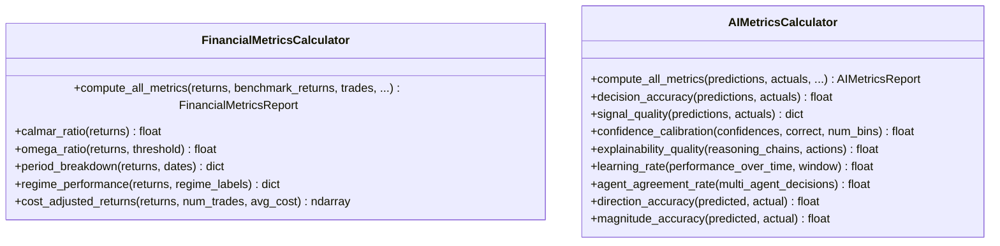

**Diagram sources**
- [financial_metrics.py:77-591](file://FinAgents/research/evaluation/financial_metrics.py#L77-L591)
- [ai_metrics.py:58-574](file://FinAgents/research/evaluation/ai_metrics.py#L58-L574)

**Section sources**
- [financial_metrics.py:77-591](file://FinAgents/research/evaluation/financial_metrics.py#L77-L591)
- [ai_metrics.py:58-574](file://FinAgents/research/evaluation/ai_metrics.py#L58-L574)

### ExplanationRenderer
Renders explanations in multiple formats: plain text, structured JSON, regulatory, and executive summary. Supports data attribution and alternative paths consideration.

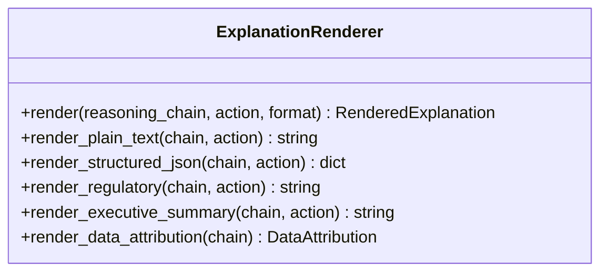

**Diagram sources**
- [explanation_renderer.py:73-378](file://FinAgents/research/explainability/explanation_renderer.py#L73-L378)

**Section sources**
- [explanation_renderer.py:73-378](file://FinAgents/research/explainability/explanation_renderer.py#L73-L378)

### Data Pipeline
DataSourceManager loads historical OHLCV data with caching. SimulatedNewsGenerator and SyntheticReportGenerator create realistic synthetic data for research.

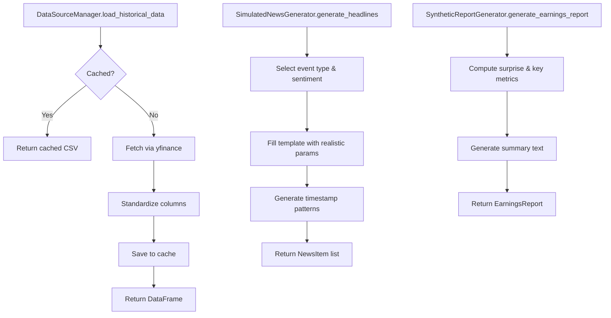

**Diagram sources**
- [data_sources.py:75-161](file://FinAgents/research/data_pipeline/data_sources.py#L75-L161)
- [data_sources.py:305-447](file://FinAgents/research/data_pipeline/data_sources.py#L305-L447)
- [data_sources.py:467-533](file://FinAgents/research/data_pipeline/data_sources.py#L467-L533)

**Section sources**
- [data_sources.py:54-617](file://FinAgents/research/data_pipeline/data_sources.py#L54-L617)

### Integration and Demo
ResearchSystemIntegrator wires all modules and builds reasoning chains for explanations. DemoRunner executes a demo and prints sample explanations.

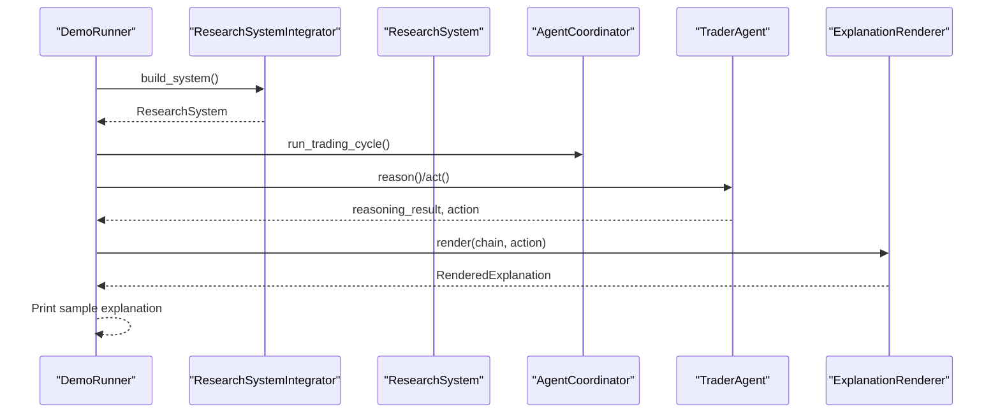

**Diagram sources**
- [system_integrator.py:100-156](file://FinAgents/research/integration/system_integrator.py#L100-L156)
- [demo_runner.py:14-83](file://FinAgents/research/integration/demo_runner.py#L14-L83)

**Section sources**
- [system_integrator.py:94-222](file://FinAgents/research/integration/system_integrator.py#L94-L222)
- [demo_runner.py:14-88](file://FinAgents/research/integration/demo_runner.py#L14-L88)

### Alpha Agent Pool Integration
The Alpha Agent Pool integrates strategy research and report generation into agent workflows, persisting reports to disk with standardized filenames and metadata.

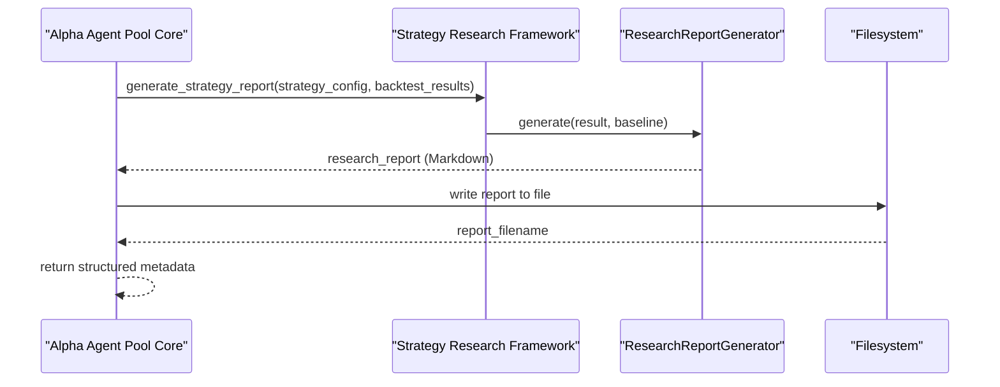

**Diagram sources**
- [core.py:2190-2229](file://FinAgents/agent_pools/alpha_agent_pool/core.py#L2190-L2229)
- [research_report.py:33-64](file://FinAgents/research/integration/research_report.py#L33-L64)

**Section sources**
- [core.py:2190-2229](file://FinAgents/agent_pools/alpha_agent_pool/core.py#L2190-L2229)

## Dependency Analysis
The system exhibits clear layering:
- Integration depends on Simulation, Evaluation, Explainability, and Data Pipeline
- Evaluation depends on Simulation outputs and metrics calculators
- Simulation depends on MarketEnvironment, EventEngine, and PerformanceTracker
- Data Pipeline supports Simulation and Explainability
- Agent Pool depends on Integration and Simulation

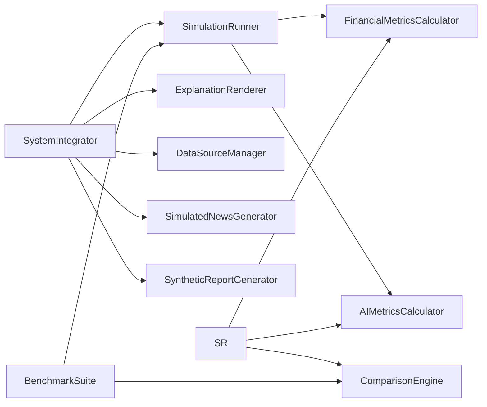

**Diagram sources**
- [system_integrator.py:94-156](file://FinAgents/research/integration/system_integrator.py#L94-L156)
- [research_report.py:25-64](file://FinAgents/research/integration/research_report.py#L25-L64)
- [benchmark_suite.py:42-155](file://FinAgents/research/evaluation/benchmark_suite.py#L42-L155)
- [comparison_engine.py:46-130](file://FinAgents/research/evaluation/comparison_engine.py#L46-L130)
- [simulation_runner.py:151-318](file://FinAgents/research/simulation/simulation_runner.py#L151-L318)

**Section sources**
- [system_integrator.py:94-156](file://FinAgents/research/integration/system_integrator.py#L94-L156)
- [research_report.py:25-64](file://FinAgents/research/integration/research_report.py#L25-L64)
- [benchmark_suite.py:42-155](file://FinAgents/research/evaluation/benchmark_suite.py#L42-L155)
- [comparison_engine.py:46-130](file://FinAgents/research/evaluation/comparison_engine.py#L46-L130)
- [simulation_runner.py:151-318](file://FinAgents/research/simulation/simulation_runner.py#L151-L318)

## Performance Considerations
- SimulationRunner snapshots are periodically saved; adjust sampling frequency to balance memory and fidelity.
- FinancialMetricsCalculator and AIMetricsCalculator operate on arrays; ensure efficient array reuse and vectorized operations.
- ComparisonEngine performs statistical tests; consider reducing bootstrap iterations or using approximate methods for large-scale comparisons.
- ExplanationRenderer supports multiple formats; choose appropriate verbosity and sections to minimize overhead.
- Data caching via DataSourceManager reduces network latency and improves reproducibility.

## Troubleshooting Guide
Common issues and resolutions:
- Missing yfinance: Install the dependency to enable historical data fetching.
- Empty returns or metrics: Ensure SimulationRunner produced valid performance_metrics and equity curves.
- Statistical significance not available: Paired t-test requires non-empty arrays; verify returns extraction.
- Explanation rendering errors: Validate reasoning_chain and action compatibility; check format selection.
- Report generation failures: Confirm baseline availability and artifact presence in SimulationResult.

**Section sources**
- [data_sources.py:128-131](file://FinAgents/research/data_pipeline/data_sources.py#L128-L131)
- [comparison_engine.py:132-227](file://FinAgents/research/evaluation/comparison_engine.py#L132-L227)
- [explanation_renderer.py:87-137](file://FinAgents/research/explainability/explanation_renderer.py#L87-L137)
- [research_report.py:33-64](file://FinAgents/research/integration/research_report.py#L33-L64)

## Conclusion
The Research Reporting system provides a robust, modular pipeline for generating research-grade documentation from simulation results. It integrates benchmarking, comparative analysis, and explainability to support publication-quality outputs. The system’s extensibility enables customization for diverse research needs and collaboration workflows.

## Appendices

### Report Generation Pipeline
- Input: SimulationResult (and optional baseline)
- Compute: Financial metrics, AI metrics, comparison statistics
- Output: ResearchReport with summary, metrics, comparison, and artifacts
- Optional: ExplanationRenderer for human-readable narratives

**Section sources**
- [research_report.py:33-133](file://FinAgents/research/integration/research_report.py#L33-L133)
- [financial_metrics.py:99-224](file://FinAgents/research/evaluation/financial_metrics.py#L99-L224)
- [ai_metrics.py:80-186](file://FinAgents/research/evaluation/ai_metrics.py#L80-L186)
- [comparison_engine.py:68-130](file://FinAgents/research/evaluation/comparison_engine.py#L68-L130)

### Example Workflows
- Generating research summaries:
  - Run SimulationRunner to completion
  - Pass SimulationResult to ResearchReportGenerator.generate
  - Access summary and metrics for quick review

- Creating detailed analysis reports:
  - Use BenchmarkSuite.run to evaluate base system
  - Use BenchmarkSuite.run_comparison to evaluate enhanced system
  - Compare results via ComparisonEngine.compare
  - Render explanations via ExplanationRenderer for stakeholder audiences

- Exporting research findings:
  - Persist ResearchReport to Markdown using Alpha Agent Pool Core
  - Share filenames and metadata for downstream publication

**Section sources**
- [simulation_runner.py:223-318](file://FinAgents/research/simulation/simulation_runner.py#L223-L318)
- [benchmark_suite.py:95-155](file://FinAgents/research/evaluation/benchmark_suite.py#L95-L155)
- [comparison_engine.py:68-130](file://FinAgents/research/evaluation/comparison_engine.py#L68-L130)
- [explanation_renderer.py:87-137](file://FinAgents/research/explainability/explanation_renderer.py#L87-L137)
- [core.py:2190-2229](file://FinAgents/agent_pools/alpha_agent_pool/core.py#L2190-L2229)

### Versioning, Sharing, and Collaboration
- Versioning: Reports are timestamped and sectioned for traceability.
- Sharing: Reports are persisted to filesystem with descriptive filenames; metadata includes next steps for publication workflows.
- Collaboration: ExplanationRenderer supports multiple output formats tailored for traders, risk managers, compliance, and executives.

**Section sources**
- [core.py:2200-2222](file://FinAgents/agent_pools/alpha_agent_pool/core.py#L2200-L2222)
- [explanation_renderer.py:19-137](file://FinAgents/research/explainability/explanation_renderer.py#L19-L137)