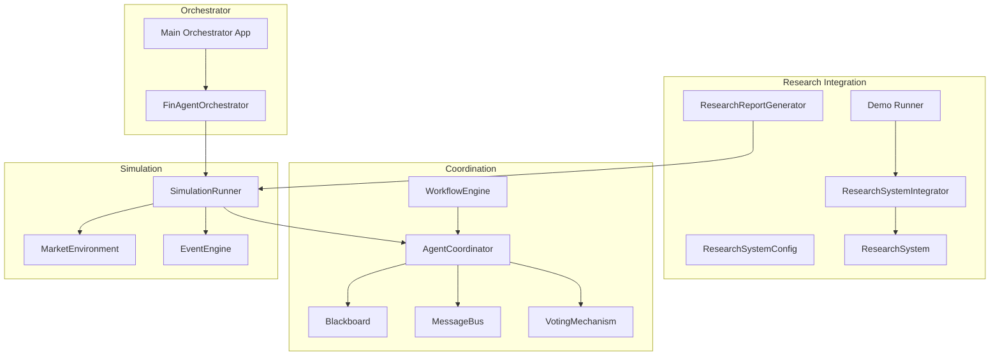
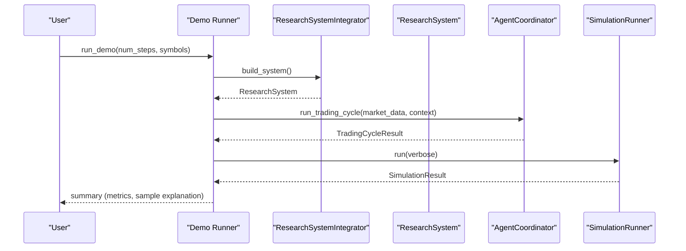
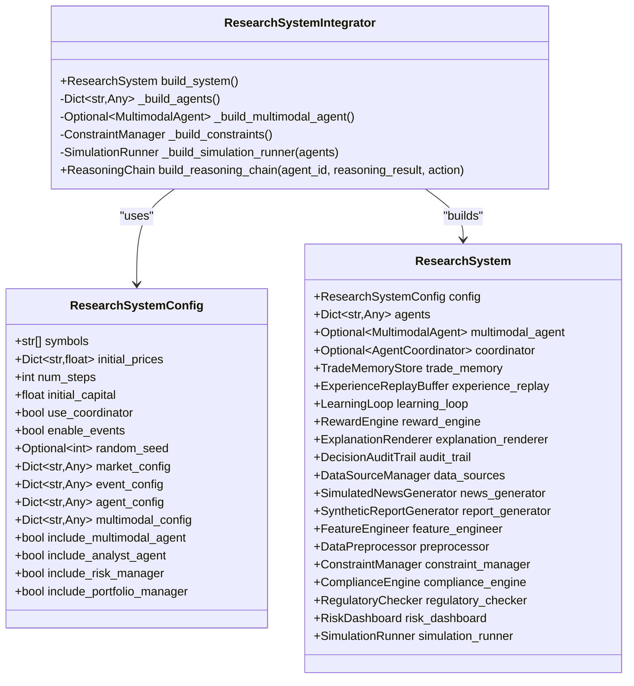
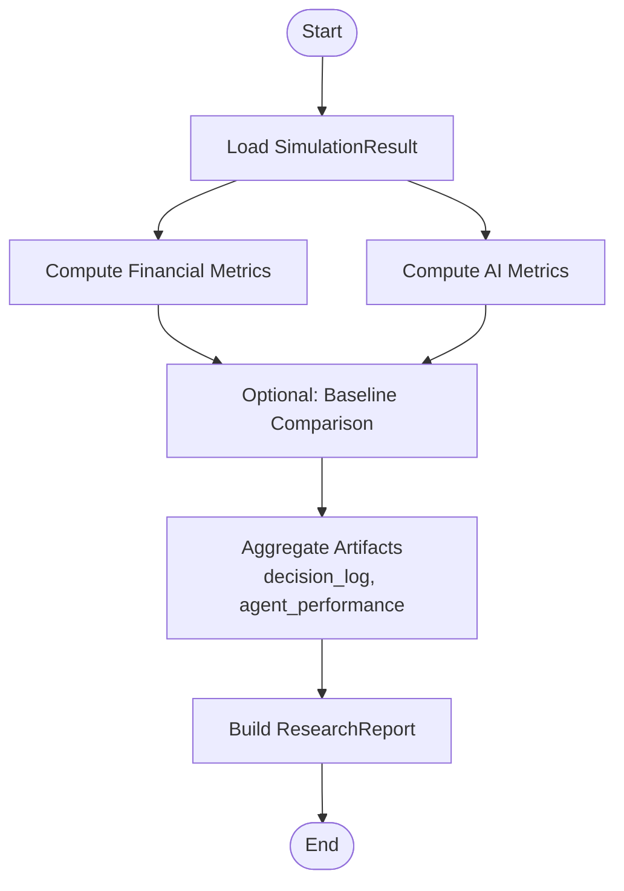
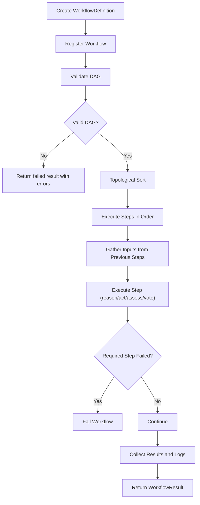
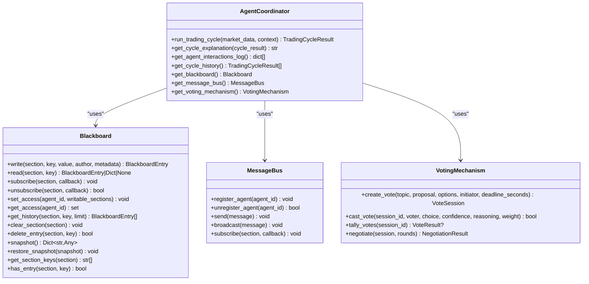
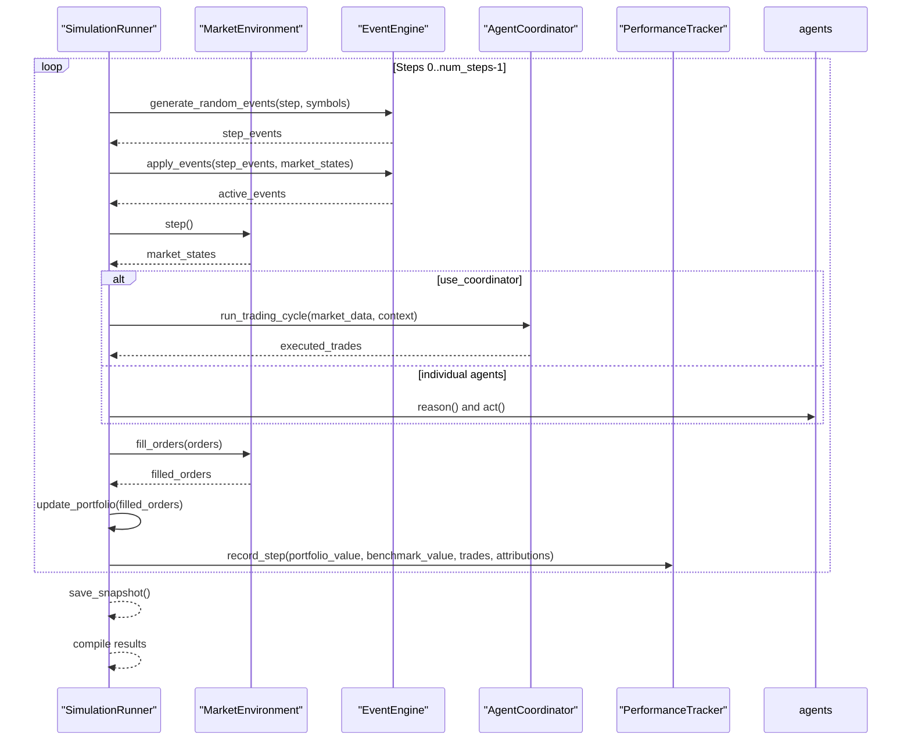
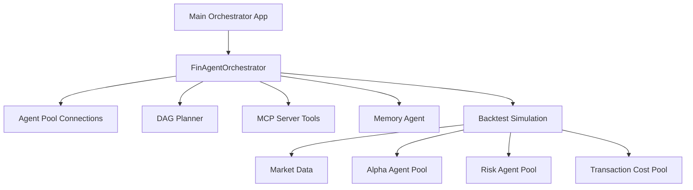
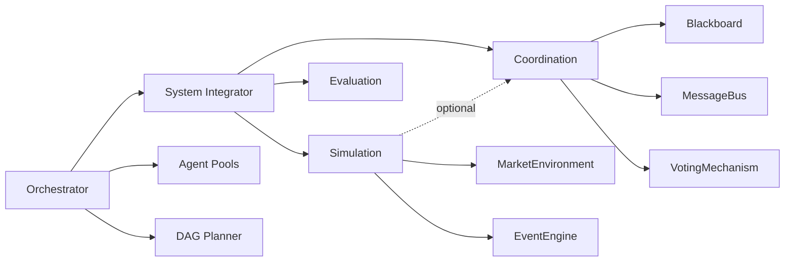

# System Integration

<cite>
**Referenced Files in This Document**
- [system_integrator.py](file://FinAgents/research/integration/system_integrator.py)
- [demo_runner.py](file://FinAgents/research/integration/demo_runner.py)
- [research_report.py](file://FinAgents/research/integration/research_report.py)
- [workflow_engine.py](file://FinAgents/research/coordination/workflow_engine.py)
- [coordinator.py](file://FinAgents/research/coordination/coordinator.py)
- [blackboard.py](file://FinAgents/research/coordination/blackboard.py)
- [protocols.py](file://FinAgents/research/coordination/protocols.py)
- [voting.py](file://FinAgents/research/coordination/voting.py)
- [simulation_runner.py](file://FinAgents/research/simulation/simulation_runner.py)
- [main_orchestrator.py](file://FinAgents/orchestrator/main_orchestrator.py)
- [finagent_orchestrator.py](file://FinAgents/orchestrator/core/finagent_orchestrator.py)
</cite>

## Table of Contents
1. [Introduction](#introduction)
2. [Project Structure](#project-structure)
3. [Core Components](#core-components)
4. [Architecture Overview](#architecture-overview)
5. [Detailed Component Analysis](#detailed-component-analysis)
6. [Dependency Analysis](#dependency-analysis)
7. [Performance Considerations](#performance-considerations)
8. [Troubleshooting Guide](#troubleshooting-guide)
9. [Conclusion](#conclusion)
10. [Appendices](#appendices)

## Introduction
This document describes the System Integration framework that coordinates research workflows and automates research pipeline execution across FinAgents modules. It explains how the system integrator orchestrates multi-component research experiments, manages dependencies between research modules, and coordinates data flow between simulation environments and analysis tools. It also documents the demo runner functionality for automated research validation and testing, and provides practical guidance for designing workflows, integrating new components, and automating repetitive tasks. Topics include workflow configuration, error handling, logging, and result aggregation patterns.

## Project Structure
The System Integration layer spans several modules:
- Research integration: system assembly, demo runner, and research report generation
- Coordination: workflow engine, agent coordinator, blackboard, messaging, and voting
- Simulation: market environment, event engine, and end-to-end runner
- Orchestrator: higher-level orchestration for agent pools, DAG planning, and backtesting

**Diagram sources**
- [system_integrator.py:94-156](file://FinAgents/research/integration/system_integrator.py#L94-L156)
- [demo_runner.py:14-83](file://FinAgents/research/integration/demo_runner.py#L14-L83)
- [research_report.py:25-64](file://FinAgents/research/integration/research_report.py#L25-L64)
- [workflow_engine.py:148-172](file://FinAgents/research/coordination/workflow_engine.py#L148-L172)
- [coordinator.py:93-155](file://FinAgents/research/coordination/coordinator.py#L93-L155)
- [blackboard.py:94-126](file://FinAgents/research/coordination/blackboard.py#L94-L126)
- [protocols.py:428-467](file://FinAgents/research/coordination/protocols.py#L428-L467)
- [voting.py:170-207](file://FinAgents/research/coordination/voting.py#L170-L207)
- [simulation_runner.py:151-170](file://FinAgents/research/simulation/simulation_runner.py#L151-L170)
- [main_orchestrator.py:50-72](file://FinAgents/orchestrator/main_orchestrator.py#L50-L72)
- [finagent_orchestrator.py:106-134](file://FinAgents/orchestrator/core/finagent_orchestrator.py#L106-L134)

**Section sources**
- [system_integrator.py:1-222](file://FinAgents/research/integration/system_integrator.py#L1-L222)
- [demo_runner.py:1-88](file://FinAgents/research/integration/demo_runner.py#L1-L88)
- [research_report.py:1-133](file://FinAgents/research/integration/research_report.py#L1-L133)
- [workflow_engine.py:1-661](file://FinAgents/research/coordination/workflow_engine.py#L1-L661)
- [coordinator.py:1-634](file://FinAgents/research/coordination/coordinator.py#L1-L634)
- [blackboard.py:1-439](file://FinAgents/research/coordination/blackboard.py#L1-L439)
- [protocols.py:344-467](file://FinAgents/research/coordination/protocols.py#L344-L467)
- [voting.py:1-652](file://FinAgents/research/coordination/voting.py#L1-L652)
- [simulation_runner.py:1-831](file://FinAgents/research/simulation/simulation_runner.py#L1-L831)
- [main_orchestrator.py:1-475](file://FinAgents/orchestrator/main_orchestrator.py#L1-L475)
- [finagent_orchestrator.py:1-800](file://FinAgents/orchestrator/core/finagent_orchestrator.py#L1-L800)

## Core Components
- ResearchSystemIntegrator: builds and wires research modules into a cohesive system, instantiating agents, memory, learning loops, explainability, data pipelines, risk controls, and simulation runner.
- ResearchSystemConfig: encapsulates configuration for symbols, market parameters, agent inclusion flags, and simulation settings.
- Demo Runner: runs a step-by-step demo, optionally invoking a trading cycle via the coordinator and collecting a sample explanation.
- ResearchReportGenerator: computes financial and AI metrics from simulation results and produces a structured research report.
- WorkflowEngine: executes configurable agent workflows as DAGs, validating dependencies and aggregating step results.
- AgentCoordinator: orchestrates multi-agent trading cycles with shared memory (blackboard), messaging, and voting.
- SimulationRunner: end-to-end simulation driver coordinating market environment, events, agents, and performance tracking.

**Section sources**
- [system_integrator.py:45-156](file://FinAgents/research/integration/system_integrator.py#L45-L156)
- [demo_runner.py:14-83](file://FinAgents/research/integration/demo_runner.py#L14-L83)
- [research_report.py:25-64](file://FinAgents/research/integration/research_report.py#L25-L64)
- [workflow_engine.py:148-277](file://FinAgents/research/coordination/workflow_engine.py#L148-L277)
- [coordinator.py:93-155](file://FinAgents/research/coordination/coordinator.py#L93-L155)
- [simulation_runner.py:151-318](file://FinAgents/research/simulation/simulation_runner.py#L151-L318)

## Architecture Overview
The System Integration framework integrates modular components into a cohesive research pipeline:
- System Integrator constructs the ResearchSystem with agents, memory, learning, explainability, data pipelines, risk controls, and simulation.
- The demo runner initializes the system, optionally runs a trading cycle via the coordinator, and executes a full simulation.
- The workflow engine enables configurable multi-agent workflows with explicit dependencies and validation.
- The agent coordinator coordinates trading cycles using a blackboard, message bus, and voting mechanism.
- The simulation runner drives market dynamics, applies events, executes agent actions, tracks performance, and aggregates results.

**Diagram sources**
- [demo_runner.py:14-83](file://FinAgents/research/integration/demo_runner.py#L14-L83)
- [system_integrator.py:100-156](file://FinAgents/research/integration/system_integrator.py#L100-L156)
- [coordinator.py:165-192](file://FinAgents/research/coordination/coordinator.py#L165-L192)
- [simulation_runner.py:223-318](file://FinAgents/research/simulation/simulation_runner.py#L223-L318)

## Detailed Component Analysis

### System Integrator and Research System Assembly
The system integrator composes research modules into a unified ResearchSystem:
- Builds specialized agents (analyst, trader, risk manager, portfolio manager) and optional multimodal agent.
- Instantiates memory stores, learning loop, reward engine, and explainability/rendering components.
- Configures data pipelines (news and report generators, feature engineering, preprocessing).
- Sets up risk controls (constraints, compliance engine, regulatory checker, risk dashboard).
- Creates a simulation runner with market environment and event engine.

**Diagram sources**
- [system_integrator.py:45-222](file://FinAgents/research/integration/system_integrator.py#L45-L222)

**Section sources**
- [system_integrator.py:94-222](file://FinAgents/research/integration/system_integrator.py#L94-L222)

### Demo Runner: Automated Validation and Testing
The demo runner provides a repeatable validation pipeline:
- Initializes a ResearchSystemConfig and builds the ResearchSystem.
- Optionally runs a sample trading cycle via the coordinator to demonstrate reasoning and decision-making.
- Executes a full simulation and collects performance metrics and agent performance.
- Generates a sample explanation from the trader’s reasoning and action and returns a summary.

```mermaid
sequenceDiagram
participant DR as "Demo Runner"
participant SI as "ResearchSystemIntegrator"
participant RS as "ResearchSystem"
participant AC as "AgentCoordinator"
participant SRN as "SimulationRunner"
DR->>SI : ResearchSystemConfig(...)
SI-->>DR : ResearchSystem
DR->>AC : run_trading_cycle(market_data, context)
AC-->>DR : TradingCycleResult
DR->>SRN : run(verbose)
SRN-->>DR : SimulationResult
DR-->>DR : build sample explanation
DR-->>DR : assemble summary
```

**Diagram sources**
- [demo_runner.py:14-83](file://FinAgents/research/integration/demo_runner.py#L14-L83)
- [coordinator.py:165-192](file://FinAgents/research/coordination/coordinator.py#L165-L192)
- [simulation_runner.py:223-318](file://FinAgents/research/simulation/simulation_runner.py#L223-L318)

**Section sources**
- [demo_runner.py:14-83](file://FinAgents/research/integration/demo_runner.py#L14-L83)

### Research Report Generation and Result Aggregation
The research report generator transforms simulation results into structured outputs:
- Computes financial metrics (return, volatility, Sharpe, drawdown, etc.) and AI metrics (accuracy, calibration, explainability).
- Produces a research report with summary, metrics, comparison against baselines, and artifacts (decision logs, agent performance).

**Diagram sources**
- [research_report.py:33-64](file://FinAgents/research/integration/research_report.py#L33-L64)

**Section sources**
- [research_report.py:25-133](file://FinAgents/research/integration/research_report.py#L25-L133)

### Workflow Engine: Configurable Multi-Agent Workflows
The workflow engine executes configurable agent workflows as DAGs:
- Defines WorkflowStep with dependencies, timeouts, and required flags.
- Validates DAGs for cycles, missing agents, invalid actions, and connectivity.
- Executes steps in topological order, gathering inputs from prior steps and initial data.
- Captures per-step results, execution logs, and error handling.

**Diagram sources**
- [workflow_engine.py:174-277](file://FinAgents/research/coordination/workflow_engine.py#L174-L277)
- [workflow_engine.py:552-617](file://FinAgents/research/coordination/workflow_engine.py#L552-L617)

**Section sources**
- [workflow_engine.py:148-661](file://FinAgents/research/coordination/workflow_engine.py#L148-L661)

### Agent Coordinator: Multi-Agent Trading Cycles
The agent coordinator orchestrates trading cycles with shared memory, messaging, and voting:
- Uses a blackboard to publish and subscribe to structured sections (market state, proposals, risk assessments, portfolio state, decisions, votes, execution log).
- Implements a message bus for agent-to-agent communication.
- Applies a voting mechanism to reach consensus or negotiate modifications.
- Records reasoning chains, interactions, and final decisions.

**Diagram sources**
- [coordinator.py:93-155](file://FinAgents/research/coordination/coordinator.py#L93-L155)
- [blackboard.py:94-126](file://FinAgents/research/coordination/blackboard.py#L94-L126)
- [protocols.py:428-467](file://FinAgents/research/coordination/protocols.py#L428-L467)
- [voting.py:170-207](file://FinAgents/research/coordination/voting.py#L170-L207)

**Section sources**
- [coordinator.py:93-634](file://FinAgents/research/coordination/coordinator.py#L93-L634)
- [blackboard.py:94-439](file://FinAgents/research/coordination/blackboard.py#L94-L439)
- [protocols.py:344-467](file://FinAgents/research/coordination/protocols.py#L344-L467)
- [voting.py:170-652](file://FinAgents/research/coordination/voting.py#L170-L652)

### Simulation Runner: End-to-End Market Dynamics
The simulation runner coordinates market environments, events, agents, and performance tracking:
- Initializes market environment and event engine, sets random seeds, and optionally initializes the agent coordinator.
- Steps through events, market environment, agent decisions, order execution, portfolio updates, and performance recording.
- Saves periodic snapshots and compiles final results including performance metrics, snapshots, event logs, decision logs, and agent performance.

**Diagram sources**
- [simulation_runner.py:223-318](file://FinAgents/research/simulation/simulation_runner.py#L223-L318)
- [simulation_runner.py:384-493](file://FinAgents/research/simulation/simulation_runner.py#L384-L493)

**Section sources**
- [simulation_runner.py:151-831](file://FinAgents/research/simulation/simulation_runner.py#L151-L831)

### Orchestrator Integration: Agent Pools and Backtesting
The orchestrator provides higher-level orchestration for agent pools, DAG planning, and backtesting:
- Initializes agent pools, registers them, and exposes MCP tools for strategy execution and backtesting.
- Runs comprehensive backtests with memory integration, performance analysis, and improvement recommendations.
- Supports sandbox environments for stress testing and historical backtests.

**Diagram sources**
- [main_orchestrator.py:50-72](file://FinAgents/orchestrator/main_orchestrator.py#L50-L72)
- [finagent_orchestrator.py:106-200](file://FinAgents/orchestrator/core/finagent_orchestrator.py#L106-L200)

**Section sources**
- [main_orchestrator.py:1-475](file://FinAgents/orchestrator/main_orchestrator.py#L1-L475)
- [finagent_orchestrator.py:1-800](file://FinAgents/orchestrator/core/finagent_orchestrator.py#L1-L800)

## Dependency Analysis
The System Integration framework exhibits layered dependencies:
- Integration layer depends on coordination, simulation, and research modules.
- Coordination relies on blackboard, messaging, and voting primitives.
- Simulation depends on market environment and event engine, optionally coordinates with the agent coordinator.
- Orchestrator integrates agent pools and exposes tools for strategy execution and backtesting.

**Diagram sources**
- [system_integrator.py:94-156](file://FinAgents/research/integration/system_integrator.py#L94-L156)
- [coordinator.py:93-155](file://FinAgents/research/coordination/coordinator.py#L93-L155)
- [simulation_runner.py:151-170](file://FinAgents/research/simulation/simulation_runner.py#L151-L170)
- [main_orchestrator.py:50-72](file://FinAgents/orchestrator/main_orchestrator.py#L50-L72)

**Section sources**
- [system_integrator.py:94-156](file://FinAgents/research/integration/system_integrator.py#L94-L156)
- [coordinator.py:93-155](file://FinAgents/research/coordination/coordinator.py#L93-L155)
- [simulation_runner.py:151-170](file://FinAgents/research/simulation/simulation_runner.py#L151-L170)
- [main_orchestrator.py:50-72](file://FinAgents/orchestrator/main_orchestrator.py#L50-L72)

## Performance Considerations
- Simulation scalability: The simulation runner steps through many steps and agents; periodic snapshots and efficient market/event updates are essential. Consider batching agent decisions and optimizing order book fills.
- Workflow execution: Topological sorting and step-wise execution ensure correctness but can be CPU-bound for large DAGs; validate workflows early to avoid runtime failures.
- Coordination overhead: Blackboard writes, message broadcasts, and voting tallies add synchronization costs; tune access control and minimize unnecessary writes.
- Logging and memory: Extensive logging and memory-backed event streams can increase I/O; use sampling and asynchronous logging where appropriate.

[No sources needed since this section provides general guidance]

## Troubleshooting Guide
Common issues and resolutions:
- Workflow validation failures: Use the workflow engine’s validation to detect cycles, missing agents, invalid actions, and disconnected steps. Fix the workflow definition accordingly.
- Agent coordinator errors: Inspect the trading cycle result for errors captured in decisions and ensure agents are registered and accessible.
- Simulation runtime exceptions: Review decision logs and snapshots around failing steps; verify market data availability and event configurations.
- Orchestrator health and agent pool connectivity: Monitor orchestrator status and agent pool health checks; ensure MCP endpoints are reachable.

**Section sources**
- [workflow_engine.py:552-617](file://FinAgents/research/coordination/workflow_engine.py#L552-L617)
- [coordinator.py:436-444](file://FinAgents/research/coordination/coordinator.py#L436-L444)
- [simulation_runner.py:436-444](file://FinAgents/research/simulation/simulation_runner.py#L436-L444)
- [finagent_orchestrator.py:273-287](file://FinAgents/orchestrator/core/finagent_orchestrator.py#L273-L287)

## Conclusion
The System Integration framework provides a robust foundation for coordinating multi-component research experiments. By assembling modular components, enabling configurable workflows, and orchestrating data flow between simulation environments and analysis tools, it supports automated research validation, reproducible demonstrations, and scalable backtesting. The demo runner and research report generator streamline validation and reporting, while the agent coordinator and workflow engine facilitate structured multi-agent collaboration. The orchestrator extends these capabilities to agent pools and DAG planning, enabling end-to-end research pipeline automation.

[No sources needed since this section summarizes without analyzing specific files]

## Appendices

### Designing Research Workflows
- Define WorkflowDefinition with ordered WorkflowSteps and explicit dependencies.
- Use validate_workflow to catch issues early.
- Employ “reason,” “act,” “assess,” and “vote” actions appropriately.
- Keep required flags aligned with critical path steps.

**Section sources**
- [workflow_engine.py:552-617](file://FinAgents/research/coordination/workflow_engine.py#L552-L617)
- [workflow_engine.py:484-550](file://FinAgents/research/coordination/workflow_engine.py#L484-L550)

### Integrating New Research Components
- Add component instantiation in ResearchSystemIntegrator.build_system.
- Wire dependencies in the ResearchSystem dataclass.
- Expose configuration via ResearchSystemConfig fields.
- Ensure compatibility with simulation runner and evaluation modules.

**Section sources**
- [system_integrator.py:100-156](file://FinAgents/research/integration/system_integrator.py#L100-L156)
- [system_integrator.py:45-66](file://FinAgents/research/integration/system_integrator.py#L45-L66)

### Automating Repetitive Research Tasks
- Use the demo runner to standardize validation runs and capture summaries.
- Leverage the research report generator to produce structured outputs for comparisons.
- Integrate with the orchestrator for repeated backtests and agent pool workflows.

**Section sources**
- [demo_runner.py:14-83](file://FinAgents/research/integration/demo_runner.py#L14-L83)
- [research_report.py:33-64](file://FinAgents/research/integration/research_report.py#L33-L64)
- [main_orchestrator.py:203-329](file://FinAgents/orchestrator/main_orchestrator.py#L203-L329)