# Agent Management API

<cite>
**Referenced Files in This Document**
- [main.py](file://backend/api/main.py)
- [agents.py](file://backend/routes/agents.py)
- [signals.py](file://backend/routes/signals.py)
- [ws_signals.py](file://backend/routes/ws_signals.py)
- [agent_manager.py](file://backend/services/agent_manager.py)
- [agent_registry.py](file://backend/services/agent_registry.py)
- [agent_adapter.py](file://backend/services/agent_adapter.py)
- [live_signal_service.py](file://backend/services/live_signal_service.py)
- [execution_service.py](file://backend/services/execution_service.py)
- [health.py](file://backend/routes/health.py)
- [alpha_pool.yaml](file://FinAgents/agent_pools/alpha_agent_pool/config/alpha_pool.yaml)
- [agent_coordinator.py](file://FinAgents/agent_pools/alpha_agent_pool/agent_coordinator.py)
- [agents.py](file://FinAgents/agent_pools/alpha_agent_pool/agents.py)
- [enhanced_mcp_lifecycle.py](file://FinAgents/agent_pools/alpha_agent_pool/enhanced_mcp_lifecycle.py)
- [alpha_pool_gateway.py](file://FinAgents/agent_pools/alpha_agent_pool/alpha_pool_gateway.py)
- [autonomous_agent.py](file://FinAgents/agent_pools/alpha_agent_pool/agents/autonomous/autonomous_agent.py)
- [main.py](file://FinAgents/agent_pools/data_agent_pool/main.py)
</cite>

## Table of Contents
1. [Introduction](#introduction)
2. [Project Structure](#project-structure)
3. [Core Components](#core-components)
4. [Architecture Overview](#architecture-overview)
5. [Detailed Component Analysis](#detailed-component-analysis)
6. [Dependency Analysis](#dependency-analysis)
7. [Performance Considerations](#performance-considerations)
8. [Troubleshooting Guide](#troubleshooting-guide)
9. [Conclusion](#conclusion)
10. [Appendices](#appendices)

## Introduction
This document provides comprehensive API documentation for agent management endpoints in the Agentic Trading Application. It covers agent pool operations, agent lifecycle management, and agent execution control. For each endpoint, you will find HTTP methods, URL patterns, request/response schemas, and agent configuration parameters. The guide also includes examples of agent registration, status monitoring, and batch execution workflows, along with agent pool scaling, resource allocation, performance metrics collection, communication protocols, task queuing, result retrieval, custom agent deployment, monitoring dashboards, troubleshooting agent failures, and security policies and isolation mechanisms.

## Project Structure
The API surface for agent management is primarily exposed through FastAPI routers under the backend API, with orchestration and execution handled by services and integrations with agent pools in FinAgents.

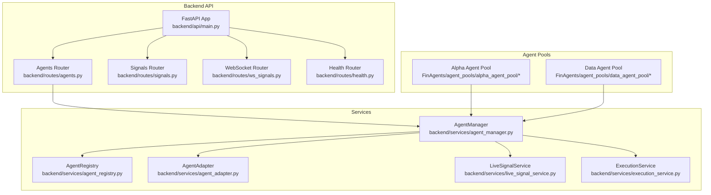

**Diagram sources**
- [main.py:134-138](file://backend/api/main.py#L134-L138)
- [agents.py:1-44](file://backend/routes/agents.py#L1-L44)
- [signals.py:1-68](file://backend/routes/signals.py#L1-L68)
- [ws_signals.py:1-141](file://backend/routes/ws_signals.py#L1-L141)
- [agent_manager.py:1-219](file://backend/services/agent_manager.py#L1-L219)
- [agent_registry.py:1-33](file://backend/services/agent_registry.py#L1-L33)
- [agent_adapter.py:1-33](file://backend/services/agent_adapter.py#L1-L33)
- [live_signal_service.py:1-84](file://backend/services/live_signal_service.py#L1-L84)
- [execution_service.py:1-107](file://backend/services/execution_service.py#L1-L107)
- [agent_coordinator.py:1-449](file://FinAgents/agent_pools/alpha_agent_pool/agent_coordinator.py#L1-L449)
- [main.py:1-6](file://FinAgents/agent_pools/data_agent_pool/main.py#L1-L6)

**Section sources**
- [main.py:134-138](file://backend/api/main.py#L134-L138)
- [agents.py:1-44](file://backend/routes/agents.py#L1-L44)
- [agent_manager.py:1-219](file://backend/services/agent_manager.py#L1-L219)

## Core Components
- Backend API entrypoint registers routers for agents, signals, websockets, and health checks.
- Agent management endpoints expose execution and listing capabilities.
- AgentManager orchestrates registration, strategy activation, signal generation, and execution routing.
- AgentRegistry maintains agent class mappings.
- LiveSignalService validates and enriches signals with risk checks and caching.
- ExecutionService executes trades, persists them, and applies risk validation.
- AgentAdapter wraps research agents to enforce a production interface.
- Agent pools (Alpha and Data) integrate with the backend via configuration and lifecycle management.

**Section sources**
- [main.py:134-138](file://backend/api/main.py#L134-L138)
- [agents.py:1-44](file://backend/routes/agents.py#L1-L44)
- [agent_manager.py:1-219](file://backend/services/agent_manager.py#L1-L219)
- [agent_registry.py:1-33](file://backend/services/agent_registry.py#L1-L33)
- [live_signal_service.py:1-84](file://backend/services/live_signal_service.py#L1-L84)
- [execution_service.py:1-107](file://backend/services/execution_service.py#L1-L107)
- [agent_adapter.py:1-33](file://backend/services/agent_adapter.py#L1-L33)

## Architecture Overview
The agent management API follows a layered architecture:
- Presentation Layer: FastAPI routers define endpoints for agent execution and listing.
- Domain Orchestration: AgentManager coordinates agent lifecycle, strategies, and execution.
- Services: LiveSignalService and ExecutionService encapsulate signal validation and trade execution.
- Persistence: SQLAlchemy-backed models persist trades and positions.
- Agent Pools: Alpha and Data agent pools provide specialized agent implementations and lifecycle management.

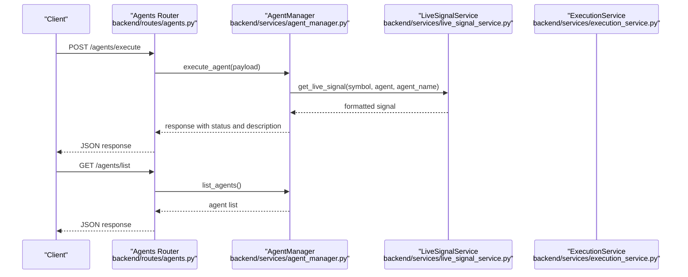

**Diagram sources**
- [agents.py:24-43](file://backend/routes/agents.py#L24-L43)
- [agent_manager.py:100-122](file://backend/services/agent_manager.py#L100-L122)
- [live_signal_service.py:23-84](file://backend/services/live_signal_service.py#L23-L84)
- [execution_service.py:16-107](file://backend/services/execution_service.py#L16-L107)

## Detailed Component Analysis

### Agent Management Endpoints

#### Endpoint: Execute Agent
- Method: POST
- URL: /agents/execute
- Description: Executes an agent with a given strategy and optional parameters. Returns execution status and description.
- Request Schema:
  - agent_id: string
  - strategy: string
  - symbol: optional string (default: "AAPL")
  - quantity: optional float (default: 1.0)
- Response Schema:
  - status: string
  - agent_id: string
  - strategy: string
  - symbol: string
  - description: string
  - message: string

Example request:
- POST /agents/execute
- Body: {"agent_id": "agent_123", "strategy": "momentum", "symbol": "MSFT", "quantity": 2.0}

Example response:
- {"status": "executed", "agent_id": "agent_123", "strategy": "momentum", "symbol": "MSFT", "description": "Trend-following using 20/50-day MA crossovers", "message": "Agent 'agent_123' cycle complete"}

Notes:
- The strategy field maps to predefined agent descriptions.
- The endpoint returns a success status and description without invoking the execution engine.

**Section sources**
- [agents.py:17-34](file://backend/routes/agents.py#L17-L34)

#### Endpoint: List Agents
- Method: GET
- URL: /agents/list
- Description: Lists available agent strategies with descriptions.
- Response Schema:
  - agents: array of objects
    - id: string
    - description: string

Example response:
- {"agents": [{"id": "momentum", "description": "Trend-following using 20/50-day MA crossovers"}, ...]}

**Section sources**
- [agents.py:37-43](file://backend/routes/agents.py#L37-L43)

### Agent Lifecycle Management

#### Agent Registration and Strategy Activation
- Registration: AgentManager.register_agent(name, agent_cls) registers agent classes via AgentRegistry.
- Strategy Activation: AgentManager.activate_strategy(agent_name, symbol, auto_execute, quantity_override) creates a strategy_id for a given agent and symbol.
- Deactivation and Removal: Strategies can be deactivated or removed using strategy_id.

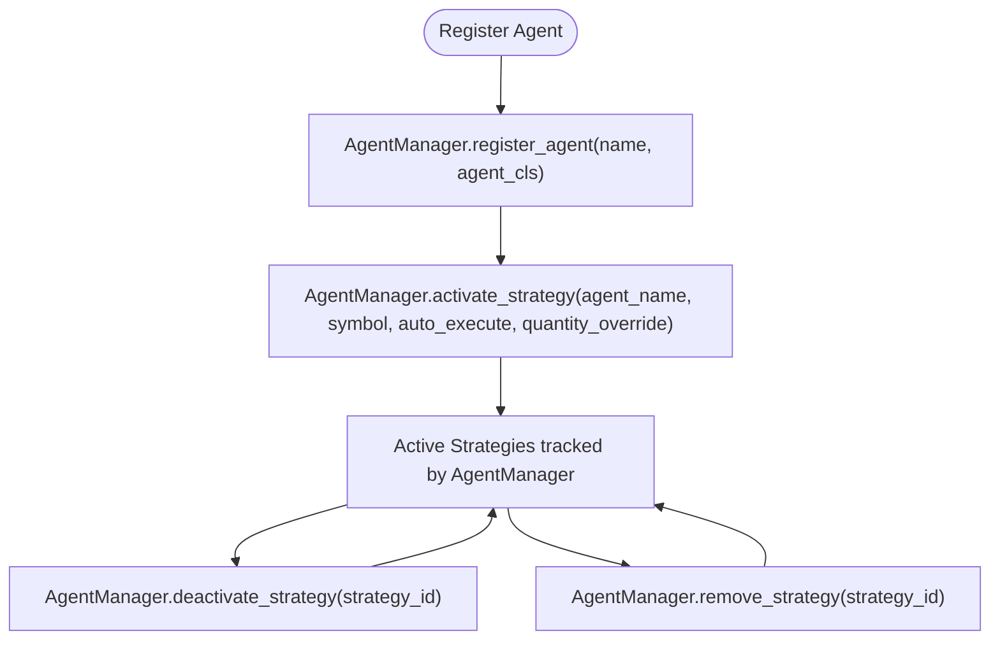

**Diagram sources**
- [agent_manager.py:42-86](file://backend/services/agent_manager.py#L42-L86)
- [agent_registry.py:13-30](file://backend/services/agent_registry.py#L13-L30)

**Section sources**
- [agent_manager.py:42-86](file://backend/services/agent_manager.py#L42-L86)
- [agent_registry.py:13-30](file://backend/services/agent_registry.py#L13-L30)

#### Signal Generation and Risk Validation
- LiveSignalService retrieves market data, invokes agent.generate_signal, validates actions, computes confidence, and applies risk checks.
- Returns either a formatted signal or a REJECTED signal with explanation.

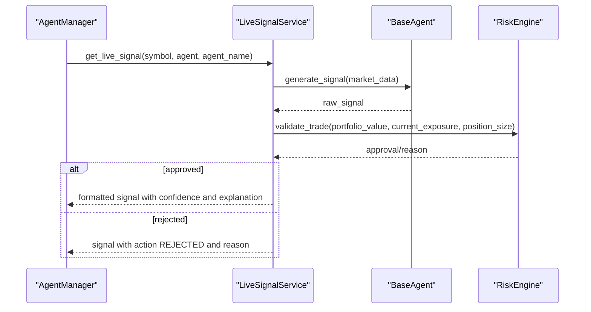

**Diagram sources**
- [live_signal_service.py:23-84](file://backend/services/live_signal_service.py#L23-L84)
- [execution_service.py:16-51](file://backend/services/execution_service.py#L16-L51)

**Section sources**
- [live_signal_service.py:23-84](file://backend/services/live_signal_service.py#L23-L84)
- [execution_service.py:16-51](file://backend/services/execution_service.py#L16-L51)

#### Execution Control
- ExecutionService.execute_trade validates the signal payload, performs risk checks, persists the trade, updates portfolio positions, and returns execution status.
- AgentManager.route_signal_to_execution forwards raw signals to ExecutionService, optionally overriding quantity.

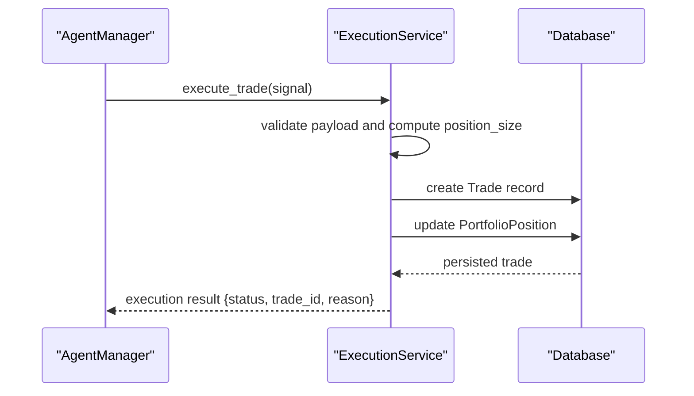

**Diagram sources**
- [execution_service.py:16-107](file://backend/services/execution_service.py#L16-L107)
- [agent_manager.py:159-172](file://backend/services/agent_manager.py#L159-L172)

**Section sources**
- [execution_service.py:16-107](file://backend/services/execution_service.py#L16-L107)
- [agent_manager.py:159-172](file://backend/services/agent_manager.py#L159-L172)

### Agent Pool Operations and Scaling

#### Alpha Agent Pool Configuration
- Pool ID, environment, worker threads, retry/backpressure/circuit breaker policies, observability, strategy execution defaults, feature retrieval cache, memory coordination, and MCP server/client configuration are defined in alpha_pool.yaml.

Key configuration areas:
- Pool identity and environment
- Worker threads and concurrency limits
- Retry/backpressure/circuit breaker thresholds
- Metrics and logging
- Strategy timeouts and warmup
- Feature cache TTL and size
- Memory server URL and retry attempts
- MCP server host/port and transport

**Section sources**
- [alpha_pool.yaml:1-58](file://FinAgents/agent_pools/alpha_agent_pool/config/alpha_pool.yaml#L1-L58)

#### Agent Coordinator and Memory Integration
- AlphaAgentCoordinator manages connections to memory servers (A2A/MCP/Legacy), stores performance and strategy insights, retrieves similar strategies, tracks operation statistics, and exposes health and statistics endpoints.

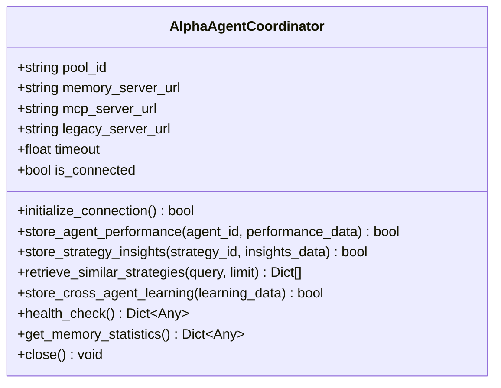

**Diagram sources**
- [agent_coordinator.py:26-449](file://FinAgents/agent_pools/alpha_agent_pool/agent_coordinator.py#L26-L449)

**Section sources**
- [agent_coordinator.py:75-107](file://FinAgents/agent_pools/alpha_agent_pool/agent_coordinator.py#L75-L107)
- [agent_coordinator.py:125-186](file://FinAgents/agent_pools/alpha_agent_pool/agent_coordinator.py#L125-L186)
- [agent_coordinator.py:188-244](file://FinAgents/agent_pools/alpha_agent_pool/agent_coordinator.py#L188-L244)
- [agent_coordinator.py:361-385](file://FinAgents/agent_pools/alpha_agent_pool/agent_coordinator.py#L361-L385)
- [agent_coordinator.py:387-411](file://FinAgents/agent_pools/alpha_agent_pool/agent_coordinator.py#L387-L411)

#### Enhanced MCP Lifecycle and Metrics
- EnhancedMCPLifecycleManager extends MCP server functionality with agent state management, health checking/alerting, resource usage tracking, performance metrics collection, graceful shutdown/recovery, and A2A protocol coordination.
- PoolMetrics aggregates pool-wide metrics such as total agents, running agents, healthy agents, total pool requests, uptime, memory coordinator status, and A2A connections.

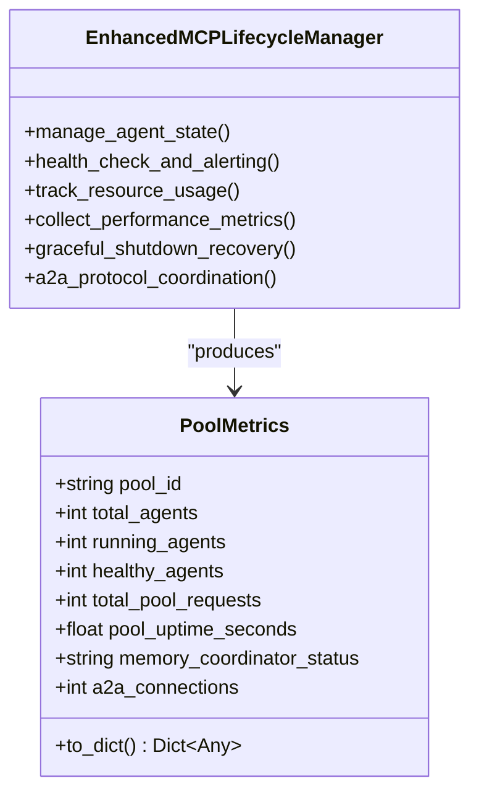

**Diagram sources**
- [enhanced_mcp_lifecycle.py:83-94](file://FinAgents/agent_pools/alpha_agent_pool/enhanced_mcp_lifecycle.py#L83-L94)
- [enhanced_mcp_lifecycle.py:66-80](file://FinAgents/agent_pools/alpha_agent_pool/enhanced_mcp_lifecycle.py#L66-L80)

**Section sources**
- [enhanced_mcp_lifecycle.py:49-80](file://FinAgents/agent_pools/alpha_agent_pool/enhanced_mcp_lifecycle.py#L49-L80)
- [enhanced_mcp_lifecycle.py:83-94](file://FinAgents/agent_pools/alpha_agent_pool/enhanced_mcp_lifecycle.py#L83-L94)

#### Alpha Pool Gateway and Task Execution
- AlphaPoolGateway orchestrates task execution across agent pools, supports strategy backtesting, memory coordination, and generic tasks, updating task status and capturing results/errors.

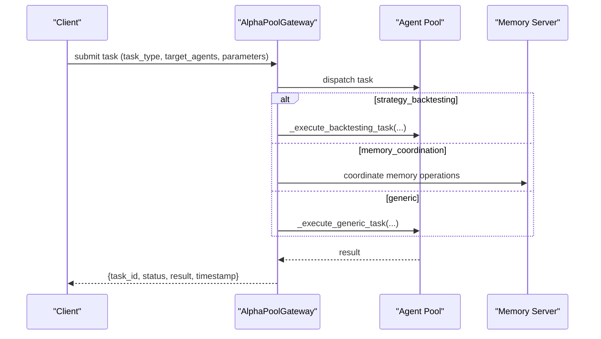

**Diagram sources**
- [alpha_pool_gateway.py:368-400](file://FinAgents/agent_pools/alpha_agent_pool/alpha_pool_gateway.py#L368-L400)

**Section sources**
- [alpha_pool_gateway.py:368-400](file://FinAgents/agent_pools/alpha_agent_pool/alpha_pool_gateway.py#L368-L400)

### Custom Agent Deployment

#### OpenAI Function Calling Agent
- The Alpha Agent Pool includes a general-purpose Agent class supporting OpenAI Function Calling with automatic tool schema generation and execution.
- Tools are decorated with function_tool and automatically discovered; the agent plans, executes tools, and aggregates results.

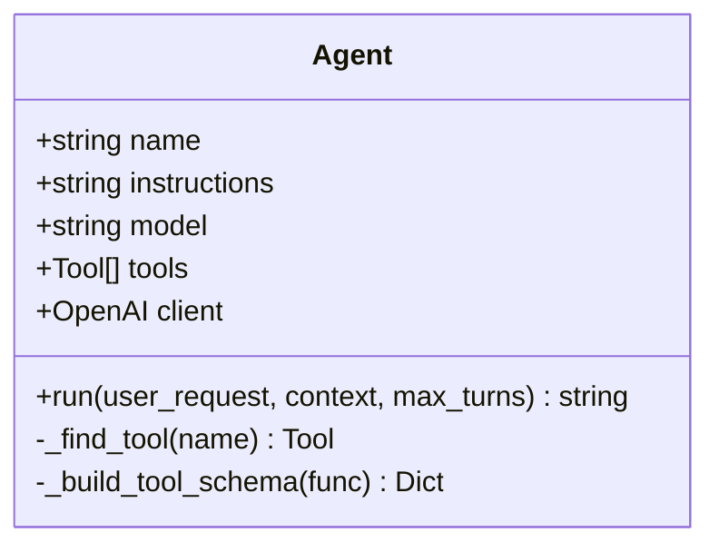

**Diagram sources**
- [agents.py:29-163](file://FinAgents/agent_pools/alpha_agent_pool/agents.py#L29-L163)

**Section sources**
- [agents.py:18-23](file://FinAgents/agent_pools/alpha_agent_pool/agents.py#L18-L23)
- [agents.py:41-46](file://FinAgents/agent_pools/alpha_agent_pool/agents.py#L41-L46)
- [agents.py:48-79](file://FinAgents/agent_pools/alpha_agent_pool/agents.py#L48-L79)
- [agents.py:81-163](file://FinAgents/agent_pools/alpha_agent_pool/agents.py#L81-L163)

### Monitoring Dashboards and Status Monitoring

#### Health Checks
- Health endpoint provides service status and version.
- Agent pools expose health endpoints for automated monitoring.

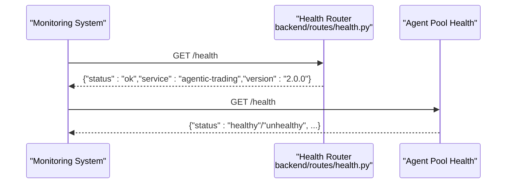

**Diagram sources**
- [health.py:6-8](file://backend/routes/health.py#L6-L8)
- [main.py:5-6](file://FinAgents/agent_pools/data_agent_pool/main.py#L5-L6)

**Section sources**
- [health.py:6-8](file://backend/routes/health.py#L6-L8)
- [main.py:5-6](file://FinAgents/agent_pools/data_agent_pool/main.py#L5-L6)

#### Real-time Streaming
- WebSocket endpoints stream live prices and signals for low-latency monitoring and dashboards.

Endpoints:
- GET /ws/prices/{symbol}
- GET /ws/signals/{symbol}

**Section sources**
- [ws_signals.py:22-141](file://backend/routes/ws_signals.py#L22-L141)

### Security Policies and Isolation Mechanisms
- CORS middleware configured at the API level allows cross-origin requests based on settings.
- RiskEngine validation ensures trades adhere to portfolio and exposure limits before persistence.
- AgentAdapter enforces a standardized interface for research agents, ensuring consistent signal generation and explanations.

**Section sources**
- [main.py:118-124](file://backend/api/main.py#L118-L124)
- [live_signal_service.py:57-73](file://backend/services/live_signal_service.py#L57-L73)
- [execution_service.py:35-51](file://backend/services/execution_service.py#L35-L51)
- [agent_adapter.py:14-24](file://backend/services/agent_adapter.py#L14-L24)

## Dependency Analysis
The agent management API depends on:
- FastAPI routers for endpoint definitions
- AgentManager for orchestration
- LiveSignalService and ExecutionService for signal validation and trade execution
- AgentRegistry for agent class management
- AgentAdapter for interface enforcement
- Agent pools for specialized agent implementations and lifecycle management

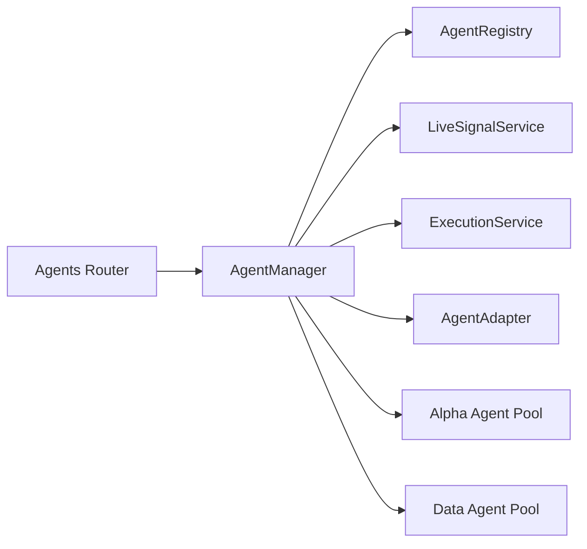

**Diagram sources**
- [agents.py:1-44](file://backend/routes/agents.py#L1-L44)
- [agent_manager.py:1-219](file://backend/services/agent_manager.py#L1-L219)
- [agent_registry.py:1-33](file://backend/services/agent_registry.py#L1-L33)
- [live_signal_service.py:1-84](file://backend/services/live_signal_service.py#L1-L84)
- [execution_service.py:1-107](file://backend/services/execution_service.py#L1-L107)
- [agent_adapter.py:1-33](file://backend/services/agent_adapter.py#L1-L33)
- [agent_coordinator.py:1-449](file://FinAgents/agent_pools/alpha_agent_pool/agent_coordinator.py#L1-L449)
- [main.py:1-6](file://FinAgents/agent_pools/data_agent_pool/main.py#L1-L6)

**Section sources**
- [agents.py:1-44](file://backend/routes/agents.py#L1-L44)
- [agent_manager.py:1-219](file://backend/services/agent_manager.py#L1-L219)

## Performance Considerations
- Pool configuration includes worker threads, retry/backpressure/circuit breaker policies, and observability settings to manage load and prevent overload.
- Backpressure configuration defines queue size and rate limits to protect downstream systems.
- Metrics collection and tracing are enabled via observability settings.
- Strategy execution includes default timeouts and warmup settings to improve responsiveness.

**Section sources**
- [alpha_pool.yaml:5-58](file://FinAgents/agent_pools/alpha_agent_pool/config/alpha_pool.yaml#L5-L58)

## Troubleshooting Guide
Common issues and resolutions:
- Invalid signal payload: ExecutionService returns an error status with reason "Invalid signal payload".
- Risk rejection: LiveSignalService and ExecutionService both validate trades; if rejected, the signal/action is REJECTED with a reason.
- No market data: LiveSignalService raises ValueError if no market data is available for the symbol.
- Agent not registered: AgentRegistry raises ValueError if an agent is not registered.
- AgentAdapter interface violations: AgentAdapter enforces that research agents implement generate_signal and return a dict.

**Section sources**
- [execution_service.py:18-25](file://backend/services/execution_service.py#L18-L25)
- [execution_service.py:46-51](file://backend/services/execution_service.py#L46-L51)
- [live_signal_service.py:37-38](file://backend/services/live_signal_service.py#L37-L38)
- [agent_registry.py:27-28](file://backend/services/agent_registry.py#L27-L28)
- [agent_adapter.py:15-21](file://backend/services/agent_adapter.py#L15-L21)

## Conclusion
The Agent Management API provides a robust foundation for managing agents, strategies, and executions. It integrates seamlessly with agent pools, supports real-time streaming, and incorporates risk controls and observability. The documented endpoints, schemas, and workflows enable reliable deployment, monitoring, and scaling of agent-driven trading systems.

## Appendices

### API Reference Summary

- Base URL: /agents
- Tags: Agents
- Routers:
  - POST /execute
  - GET /list

- Base URL: /signals
- Tags: Signals
- Routers:
  - GET /{symbol}

- Base URL: /ws
- Tags: WebSocket
- Routers:
  - GET /prices/{symbol}
  - GET /signals/{symbol}

- Base URL: /
- Tags: Health
- Routers:
  - GET /health

**Section sources**
- [agents.py:24-43](file://backend/routes/agents.py#L24-L43)
- [signals.py:62-67](file://backend/routes/signals.py#L62-L67)
- [ws_signals.py:22-141](file://backend/routes/ws_signals.py#L22-L141)
- [health.py:6-8](file://backend/routes/health.py#L6-L8)
- [main.py:134-138](file://backend/api/main.py#L134-L138)