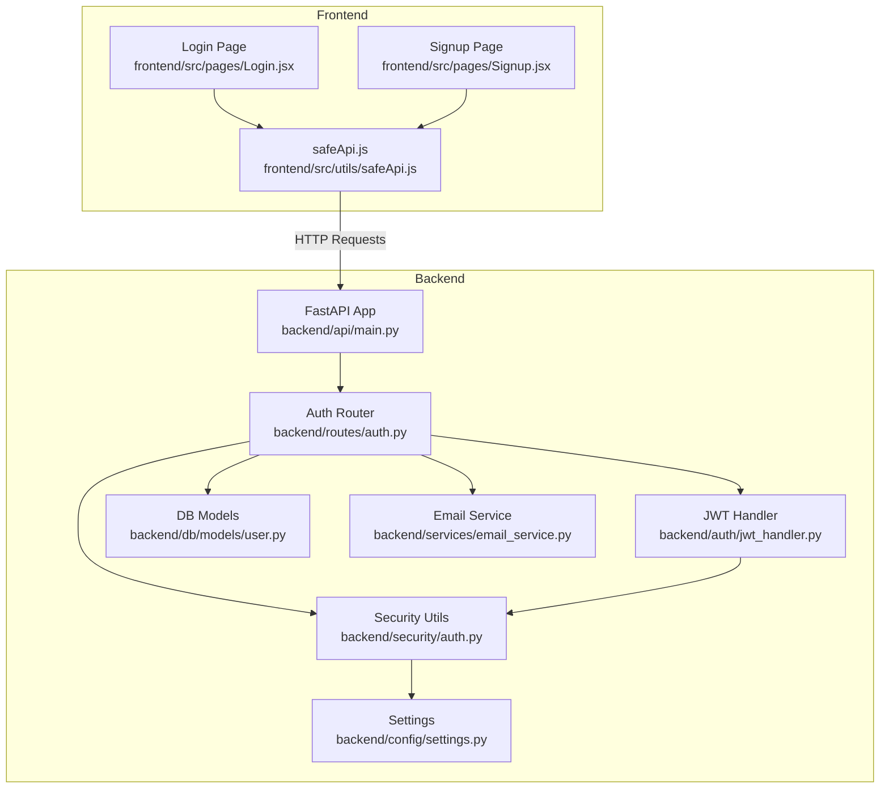
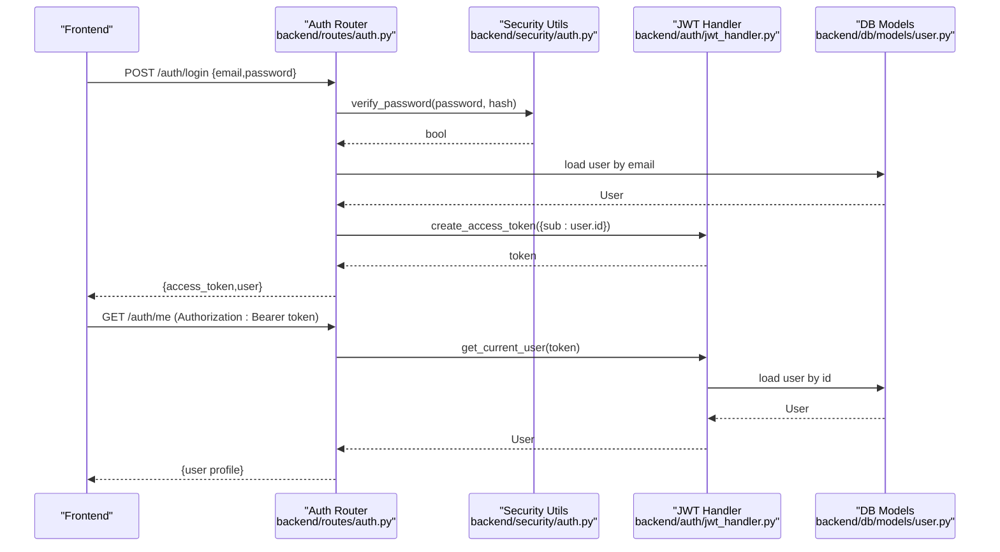
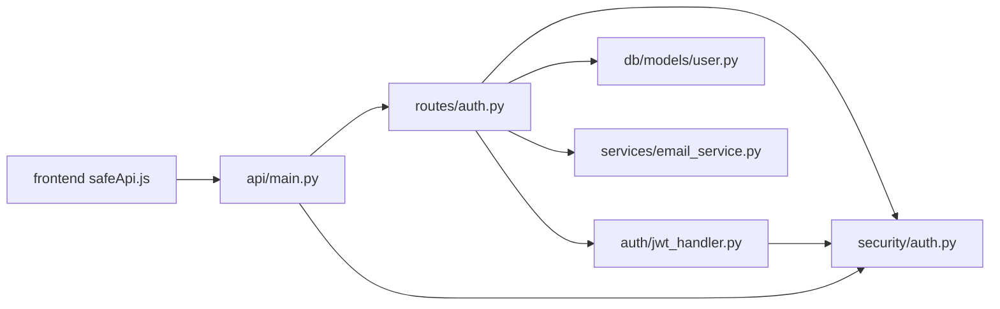

# Authentication API

<cite>
**Referenced Files in This Document**
- [backend/api/main.py](file://backend/api/main.py)
- [backend/routes/auth.py](file://backend/routes/auth.py)
- [backend/auth/jwt_handler.py](file://backend/auth/jwt_handler.py)
- [backend/security/auth.py](file://backend/security/auth.py)
- [backend/db/models/user.py](file://backend/db/models/user.py)
- [backend/services/email_service.py](file://backend/services/email_service.py)
- [backend/config/settings.py](file://backend/config/settings.py)
- [frontend/src/utils/safeApi.js](file://frontend/src/utils/safeApi.js)
- [frontend/src/pages/Login.jsx](file://frontend/src/pages/Login.jsx)
- [frontend/src/pages/Signup.jsx](file://frontend/src/pages/Signup.jsx)
</cite>

## Table of Contents
1. [Introduction](#introduction)
2. [Project Structure](#project-structure)
3. [Core Components](#core-components)
4. [Architecture Overview](#architecture-overview)
5. [Detailed Component Analysis](#detailed-component-analysis)
6. [Dependency Analysis](#dependency-analysis)
7. [Performance Considerations](#performance-considerations)
8. [Troubleshooting Guide](#troubleshooting-guide)
9. [Conclusion](#conclusion)

## Introduction
This document provides comprehensive API documentation for the authentication endpoints powering the Agentic Trading platform. It covers registration, login, logout, email verification, and protected profile retrieval. It also documents JWT token structure, security headers, password hashing, session management, and recommended best practices. Where applicable, it references the backend implementation and the frontend integration.

## Project Structure
The authentication system spans the backend FastAPI application, route handlers, JWT utilities, password hashing, database models, and email service. The frontend integrates via a safe API wrapper that attaches Authorization headers and manages tokens in local storage.

**Diagram sources**
- [backend/api/main.py:111-148](file://backend/api/main.py#L111-L148)
- [backend/routes/auth.py:15-226](file://backend/routes/auth.py#L15-L226)
- [backend/auth/jwt_handler.py:13-51](file://backend/auth/jwt_handler.py#L13-L51)
- [backend/security/auth.py:8-37](file://backend/security/auth.py#L8-L37)
- [backend/db/models/user.py:7-76](file://backend/db/models/user.py#L7-L76)
- [backend/services/email_service.py:11-41](file://backend/services/email_service.py#L11-L41)
- [backend/config/settings.py:23-31](file://backend/config/settings.py#L23-L31)
- [frontend/src/utils/safeApi.js:109-149](file://frontend/src/utils/safeApi.js#L109-L149)
- [frontend/src/pages/Login.jsx:18-44](file://frontend/src/pages/Login.jsx#L18-L44)
- [frontend/src/pages/Signup.jsx:13-46](file://frontend/src/pages/Signup.jsx#L13-L46)

**Section sources**
- [backend/api/main.py:111-148](file://backend/api/main.py#L111-L148)
- [backend/routes/auth.py:15-226](file://backend/routes/auth.py#L15-L226)

## Core Components
- Authentication routes: Registration, login, logout, email verification, resend verification, and profile retrieval.
- JWT utilities: Token creation, decoding, and current-user resolution with bearer token support.
- Security utilities: Password hashing and verification using bcrypt; JWT encoding/decoding with HS256.
- Database models: User entity and related demo account/trade relationships.
- Email service: Build verification links and send verification emails.
- Settings: Token TTL, secret, algorithm, and SMTP configuration.

**Section sources**
- [backend/routes/auth.py:19-89](file://backend/routes/auth.py#L19-L89)
- [backend/auth/jwt_handler.py:13-51](file://backend/auth/jwt_handler.py#L13-L51)
- [backend/security/auth.py:8-37](file://backend/security/auth.py#L8-L37)
- [backend/db/models/user.py:7-76](file://backend/db/models/user.py#L7-L76)
- [backend/services/email_service.py:11-41](file://backend/services/email_service.py#L11-L41)
- [backend/config/settings.py:23-31](file://backend/config/settings.py#L23-L31)

## Architecture Overview
The authentication flow relies on stateless JWTs. On successful login, the backend returns an access token and user profile. Subsequent requests include the token in the Authorization header. The JWT handler validates the token and resolves the current user from the database.

**Diagram sources**
- [backend/routes/auth.py:169-187](file://backend/routes/auth.py#L169-L187)
- [backend/auth/jwt_handler.py:23-38](file://backend/auth/jwt_handler.py#L23-L38)
- [backend/security/auth.py:17-36](file://backend/security/auth.py#L17-L36)
- [backend/db/models/user.py:7-28](file://backend/db/models/user.py#L7-L28)

## Detailed Component Analysis

### Authentication Endpoints

#### POST /auth/register
- Description: Creates a new user account and sends a verification email.
- Authentication: Not required.
- Request body:
  - email: string (validated as an email address)
  - password: string (minimum length validated)
  - full_name: string, optional
- Response:
  - message: string
  - verification_required: boolean (default true)
  - email: string
  - verification_preview_url: string, optional (only in debug mode)
- Validation:
  - Email format validator ensures normalized lowercase and basic syntax.
  - Password minimum length enforced.
- Behavior:
  - Hashes the password using bcrypt.
  - Generates a random verification token.
  - Creates a demo account for the user.
  - Sends verification email via SMTP or logs a preview URL in debug mode.

**Section sources**
- [backend/routes/auth.py:137-167](file://backend/routes/auth.py#L137-L167)
- [backend/security/auth.py:13-21](file://backend/security/auth.py#L13-L21)
- [backend/services/email_service.py:17-41](file://backend/services/email_service.py#L17-L41)

#### POST /auth/login
- Description: Authenticates a user and returns an access token and user profile.
- Authentication: Not required.
- Request body:
  - email: string (validated as an email address)
  - password: string
- Response:
  - access_token: string (JWT)
  - token_type: string (bearer)
  - user: UserResponse
- Validation and checks:
  - Email format validator ensures normalized lowercase and basic syntax.
  - Compares provided password against stored hash.
  - Rejects disabled users.
  - Requires email verification before login.
  - Ensures a demo account exists; creates one if missing.
- Notes:
  - Token payload includes a subject (user id) and expiration derived from settings.

**Section sources**
- [backend/routes/auth.py:169-187](file://backend/routes/auth.py#L169-L187)
- [backend/security/auth.py:17-21](file://backend/security/auth.py#L17-L21)
- [backend/config/settings.py:29-30](file://backend/config/settings.py#L29-L30)

#### POST /auth/logout
- Description: Logs out the current session.
- Authentication: Not required.
- Request body: None.
- Response: Message indicating successful logout.
- Notes:
  - JWT is stateless; logout is a client-side operation removing the token.

**Section sources**
- [backend/routes/auth.py:189-193](file://backend/routes/auth.py#L189-L193)

#### POST /auth/verify-email
- Description: Verifies a user’s email using a token.
- Authentication: Not required.
- Request body:
  - token: string (verification token)
- Response: Message indicating successful verification.
- Behavior:
  - Marks the user’s email as verified and clears the token.

**Section sources**
- [backend/routes/auth.py:195-204](file://backend/routes/auth.py#L195-L204)

#### POST /auth/resend-verification
- Description: Resends a verification email.
- Authentication: Not required.
- Request body:
  - email: string (validated as an email address)
- Response:
  - message: string
  - verification_preview_url: string, optional (only in debug mode)
- Behavior:
  - Generates a new verification token and updates the sent timestamp.
  - Sends the verification email or logs a preview URL in debug mode.

**Section sources**
- [backend/routes/auth.py:207-221](file://backend/routes/auth.py#L207-L221)
- [backend/services/email_service.py:11-14](file://backend/services/email_service.py#L11-L14)

#### GET /auth/me
- Description: Retrieves the authenticated user’s profile.
- Authentication: Required (Authorization: Bearer <token>).
- Response: UserResponse.
- Behavior:
  - Validates the bearer token and loads the user from the database.
  - Returns a normalized user representation including demo account balance.

**Section sources**
- [backend/routes/auth.py:223-226](file://backend/routes/auth.py#L223-L226)
- [backend/auth/jwt_handler.py:23-38](file://backend/auth/jwt_handler.py#L23-L38)

### JWT Token Structure and Security Headers
- Token type: JWT (JSON Web Token).
- Algorithm: HS256.
- Payload fields:
  - sub: user identifier (required).
  - exp: expiration timestamp (derived from configured TTL).
- Security headers (recommended):
  - Authorization: Bearer <token>.
  - Content-Type: application/json.
- Token TTL: Controlled by settings (hours), mapped to minutes internally.

**Section sources**
- [backend/security/auth.py:24-36](file://backend/security/auth.py#L24-L36)
- [backend/config/settings.py:23-31](file://backend/config/settings.py#L23-L31)
- [frontend/src/utils/safeApi.js:117-119](file://frontend/src/utils/safeApi.js#L117-L119)

### Password Hashing Mechanisms
- Hashing: bcrypt with salt generation.
- Verification: bcrypt check against stored hash.
- Storage: password_hash field in the User model.

**Section sources**
- [backend/security/auth.py:13-21](file://backend/security/auth.py#L13-L21)
- [backend/db/models/user.py:12](file://backend/db/models/user.py#L12)

### Session Management
- Stateless JWT: No server-side session storage.
- Client responsibility: Store the token (e.g., in local storage) and attach it to subsequent requests.
- Logout: Client removes the token; server does not maintain a blacklist.

**Section sources**
- [frontend/src/utils/safeApi.js:139-141](file://frontend/src/utils/safeApi.js#L139-L141)
- [backend/routes/auth.py:189-193](file://backend/routes/auth.py#L189-L193)

### Email Verification Workflow
- On registration: A verification token is generated and emailed.
- On resend: A new token is generated and emailed.
- On verify: The token is validated and the user’s email is marked verified.

**Section sources**
- [backend/routes/auth.py:137-167](file://backend/routes/auth.py#L137-L167)
- [backend/routes/auth.py:195-221](file://backend/routes/auth.py#L195-L221)
- [backend/services/email_service.py:11-41](file://backend/services/email_service.py#L11-L41)

### Frontend Integration Examples
- Login flow:
  - Submit credentials to POST /auth/login.
  - On success, store the returned token and redirect to dashboard.
- Logout flow:
  - Call POST /auth/logout.
  - Remove token from local storage.
- Protected profile retrieval:
  - Call GET /auth/me with Authorization: Bearer <token>.

**Section sources**
- [frontend/src/pages/Login.jsx:18-44](file://frontend/src/pages/Login.jsx#L18-L44)
- [frontend/src/pages/Signup.jsx:13-46](file://frontend/src/pages/Signup.jsx#L13-L46)
- [frontend/src/utils/safeApi.js:109-149](file://frontend/src/utils/safeApi.js#L109-L149)

## Dependency Analysis

**Diagram sources**
- [backend/routes/auth.py:10-13](file://backend/routes/auth.py#L10-L13)
- [backend/auth/jwt_handler.py:10](file://backend/auth/jwt_handler.py#L10)
- [backend/api/main.py:24-36](file://backend/api/main.py#L24-L36)
- [frontend/src/utils/safeApi.js:109-149](file://frontend/src/utils/safeApi.js#L109-L149)

**Section sources**
- [backend/routes/auth.py:10-13](file://backend/routes/auth.py#L10-L13)
- [backend/auth/jwt_handler.py:10](file://backend/auth/jwt_handler.py#L10)
- [backend/api/main.py:24-36](file://backend/api/main.py#L24-L36)

## Performance Considerations
- Token TTL: Configure token expiration to balance security and UX.
- Password hashing: bcrypt is computationally intensive; ensure appropriate server resources.
- Email delivery: SMTP operations can block; consider asynchronous queuing for high throughput.
- Frontend retries: Built-in retry logic reduces transient failure impact.

[No sources needed since this section provides general guidance]

## Troubleshooting Guide
- Invalid credentials or unverified email:
  - Login returns unauthorized when password is incorrect, account is disabled, or email is not verified.
- Token expiration:
  - Decoding failures or missing/invalid payload lead to unauthorized responses.
- Missing Authorization header:
  - Protected endpoints require a valid bearer token.
- Rate limiting and account lockout:
  - No built-in rate limiting or lockout logic in the referenced code. Consider implementing rate limiting at the ingress or application layer if needed.

**Section sources**
- [backend/routes/auth.py:171-178](file://backend/routes/auth.py#L171-L178)
- [backend/auth/jwt_handler.py:27-34](file://backend/auth/jwt_handler.py#L27-L34)
- [frontend/src/utils/safeApi.js:30-45](file://frontend/src/utils/safeApi.js#L30-L45)

## Conclusion
The authentication system provides secure, stateless JWT-based login, robust password hashing, and a complete email verification workflow. The frontend integrates seamlessly by attaching the bearer token to protected requests. For production deployments, consider adding rate limiting, account lockout policies, and stricter security headers to further harden the system.