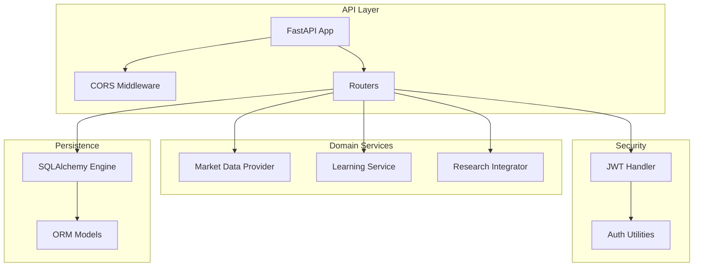
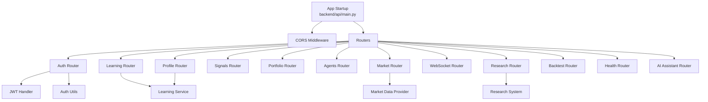

# Backend API Reference

<cite>
**Referenced Files in This Document**
- [backend/api/main.py](file://backend/api/main.py)
- [backend/routers/auth.py](file://backend/routes/auth.py)
- [backend/routers/portfolio.py](file://backend/routes/portfolio.py)
- [backend/routers/signals.py](file://backend/routes/signals.py)
- [backend/routers/ws_signals.py](file://backend/routes/ws_signals.py)
- [backend/routers/agents.py](file://backend/routes/agents.py)
- [backend/routers/market.py](file://backend/routes/market.py)
- [backend/routers/research.py](file://backend/routes/research.py)
- [backend/routers/backtest.py](file://backend/routes/backtest.py)
- [backend/routers/health.py](file://backend/routes/health.py)
- [backend/routers/learning.py](file://backend/routes/learning.py)
- [backend/routers/profile.py](file://backend/routes/profile.py)
- [backend/routers/ai_assistant.py](file://backend/routes/ai_assistant.py)
- [backend/config/settings.py](file://backend/config/settings.py)
- [backend/auth/jwt_handler.py](file://backend/auth/jwt_handler.py)
- [backend/security/auth.py](file://backend/security/auth.py)
- [backend/db/models/user.py](file://backend/db/models/user.py)
</cite>

## Table of Contents
1. [Introduction](#introduction)
2. [Project Structure](#project-structure)
3. [Core Components](#core-components)
4. [Architecture Overview](#architecture-overview)
5. [Detailed Component Analysis](#detailed-component-analysis)
6. [Dependency Analysis](#dependency-analysis)
7. [Performance Considerations](#performance-considerations)
8. [Troubleshooting Guide](#troubleshooting-guide)
9. [Conclusion](#conclusion)
10. [Appendices](#appendices)

## Introduction
This document provides a comprehensive API reference for the FastAPI backend services powering the Agentic Trading platform. It covers authentication, portfolio metrics, market data retrieval, signal generation, agent execution, research simulation and comparison, WebSocket streaming, and related endpoints. For each endpoint, you will find HTTP methods, URL patterns, request/response schemas, authentication requirements, error responses, validation rules, and usage notes. Security, CORS configuration, API versioning, and integration guidelines are also included.

## Project Structure
The backend is organized around a FastAPI application that mounts multiple routers under distinct prefixes and tags. The main application initializes database tables, ensures user schema compatibility, seeds a demo user, applies CORS middleware, and registers all route modules.

```mermaid
graph TB
A["FastAPI App<br/>backend/api/main.py"] --> B["Auth Router<br/>backend/routes/auth.py"]
A --> C["AI Assistant Router<br/>backend/routes/ai_assistant.py"]
A --> D["Demo Router<br/>backend/routes/demo.py"]
A --> E["Learning Router<br/>backend/routes/learning.py"]
A --> F["Profile Router<br/>backend/routes/profile.py"]
A --> G["Signals Router<br/>backend/routes/signals.py"]
A --> H["Portfolio Router<br/>backend/routes/portfolio.py"]
A --> I["Agents Router<br/>backend/routes/agents.py"]
A --> J["Market Router<br/>backend/routes/market.py"]
A --> K["Health Router<br/>backend/routes/health.py"]
A --> L["WebSocket Signals Router<br/>backend/routes/ws_signals.py"]
A --> M["Research Router<br/>backend/routes/research.py"]
```

**Diagram sources**
- [backend/api/main.py:127-138](file://backend/api/main.py#L127-L138)
- [backend/routes/auth.py:15](file://backend/routes/auth.py#L15)
- [backend/routes/ai_assistant.py:5](file://backend/routes/ai_assistant.py#L5)
- [backend/routes/learning.py:11](file://backend/routes/learning.py#L11)
- [backend/routes/profile.py:14](file://backend/routes/profile.py#L14)
- [backend/routes/signals.py:6](file://backend/routes/signals.py#L6)
- [backend/routes/portfolio.py:9](file://backend/routes/portfolio.py#L9)
- [backend/routes/agents.py:5](file://backend/routes/agents.py#L5)
- [backend/routes/market.py:35](file://backend/routes/market.py#L35)
- [backend/routes/health.py:3](file://backend/routes/health.py#L3)
- [backend/routes/ws_signals.py:7](file://backend/routes/ws_signals.py#L7)
- [backend/routes/research.py:22](file://backend/routes/research.py#L22)

**Section sources**
- [backend/api/main.py:111-148](file://backend/api/main.py#L111-L148)

## Core Components
- Application lifecycle and middleware:
  - Database initialization and user schema migration on startup.
  - Demo user seeding for quick onboarding.
  - CORS configuration controlled via environment settings.
  - Versioned API exposed as v2.0.0.
- Authentication:
  - JWT-based bearer tokens with HS256.
  - Password hashing and verification using bcrypt.
  - Email verification flow with token-based confirmation.
- Routing:
  - Modular routers for Authentication, AI Assistant, Learning, Profile, Signals, Portfolio, Agents, Market, Health, WebSocket, and Research.
  - Prefixes applied for logical grouping (e.g., /learning, /profile, /signals, /portfolio, /agents, /market, /ws, /api/research).

**Section sources**
- [backend/api/main.py:102-116](file://backend/api/main.py#L102-L116)
- [backend/api/main.py:118-124](file://backend/api/main.py#L118-L124)
- [backend/api/main.py:127-138](file://backend/api/main.py#L127-L138)
- [backend/config/settings.py:23-31](file://backend/config/settings.py#L23-L31)
- [backend/security/auth.py:13-36](file://backend/security/auth.py#L13-L36)
- [backend/auth/jwt_handler.py:16-38](file://backend/auth/jwt_handler.py#L16-L38)

## Architecture Overview
The API is a modular FastAPI application with centralized CORS and database initialization. Routers encapsulate domain-specific endpoints, and shared services handle business logic. Authentication is enforced via a dependency that validates JWT bearer tokens.

**Diagram sources**
- [backend/api/main.py:118-124](file://backend/api/main.py#L118-L124)
- [backend/auth/jwt_handler.py:23-38](file://backend/auth/jwt_handler.py#L23-L38)
- [backend/security/auth.py:24-36](file://backend/security/auth.py#L24-L36)
- [backend/routes/market.py:35](file://backend/routes/market.py#L35)
- [backend/routes/learning.py:11](file://backend/routes/learning.py#L11)
- [backend/routes/research.py:22](file://backend/routes/research.py#L22)
- [backend/db/models/user.py:7-28](file://backend/db/models/user.py#L7-L28)

## Detailed Component Analysis

### Authentication Endpoints
- Base path: /auth
- Tags: Authentication

Endpoints:
- POST /auth/register
  - Description: Registers a new user with optional full name. Creates a demo account and sends a verification email.
  - Request JSON Schema:
    - email: string (required)
    - password: string (min length 6)
    - full_name: string (optional)
  - Response JSON Schema:
    - message: string
    - verification_required: boolean
    - email: string
    - verification_preview_url: string (optional)
  - Validation:
    - Email format validated; normalized to lowercase.
    - Password minimum length enforced.
  - Errors:
    - 400: Email already registered.
  - Example request:
    - POST /auth/register with JSON body containing email, password, optional full_name.
  - Example response:
    - 201 Created with message and verification metadata.

- POST /auth/login
  - Description: Logs in a user after verifying credentials and email verification status. Returns a JWT access token.
  - Request JSON Schema:
    - email: string (required)
    - password: string (required)
  - Response JSON Schema:
    - access_token: string
    - token_type: string (default: bearer)
    - user: object (fields: id, email, full_name, created_at, is_active, is_demo_user, email_verified, demo_balance)
  - Validation:
    - Email format validated; normalized to lowercase.
  - Errors:
    - 401: Invalid email or password.
    - 403: Account disabled or unverified email.
  - Example request:
    - POST /auth/login with JSON body containing email and password.
  - Example response:
    - 200 OK with access_token and user profile.

- POST /auth/logout
  - Description: Stateless logout; instructs client to discard token.
  - Response: Plain message indicating successful logout.
  - Errors: None.

- POST /auth/verify-email
  - Description: Verifies user email using a token.
  - Request JSON Schema:
    - token: string (required)
  - Response: Success message.
  - Errors:
    - 400: Invalid verification token.

- POST /auth/resend-verification
  - Description: Resends verification email if not already verified.
  - Request JSON Schema:
    - email: string (required)
  - Response: Success message and optional verification preview URL.
  - Errors:
    - 404: Account not found.
    - 400: Already verified.

- GET /auth/me
  - Description: Retrieves current user profile using a valid JWT bearer token.
  - Authentication: Required (Bearer token).
  - Response: UserResponse object.
  - Errors:
    - 401: Not authenticated or invalid/expired token.
    - 403: User inactive.

Security and validation highlights:
- Password hashing and verification use bcrypt.
- JWT creation and decoding use HS256 with secret key from settings.
- Email normalization and uniqueness checks enforced during registration.
- Username auto-generation to avoid conflicts.

**Section sources**
- [backend/routes/auth.py:137-225](file://backend/routes/auth.py#L137-L225)
- [backend/auth/jwt_handler.py:16-38](file://backend/auth/jwt_handler.py#L16-L38)
- [backend/security/auth.py:13-36](file://backend/security/auth.py#L13-L36)
- [backend/db/models/user.py:7-28](file://backend/db/models/user.py#L7-L28)

### Portfolio Metrics Endpoint
- Base path: /portfolio
- Tags: Portfolio

Endpoint:
- GET /portfolio/metrics
  - Description: Returns portfolio-wide metrics including total positions, exposure, portfolio value, and cash.
  - Response JSON Schema:
    - status: string
    - data: object (fields: total_positions, total_exposure, portfolio_value, cash)
  - Errors:
    - 500: Internal server error on aggregation failure.

Usage notes:
- Intended for dashboard and analytics views.
- Exposes aggregated counts and computed values derived from stored positions.

**Section sources**
- [backend/routes/portfolio.py:12-33](file://backend/routes/portfolio.py#L12-L33)

### Market Data Endpoints
- Base path: /market
- Tags: Market

Endpoints:
- GET /market/price/{symbol}
  - Description: Returns current price and basic stats for a symbol with caching and fallback logic.
  - Path parameters:
    - symbol: string (required)
  - Response JSON Schema:
    - status: string
    - data: object (fields: symbol, price, change, change_pct, volume, open, high, low, prev_close, timestamp, history)
    - timestamp: string (ISO format)
  - Validation:
    - Symbol length and existence handled; Yahoo Finance mapping supported for indices and crypto.
  - Errors:
    - 404: Symbol not found or market closed.
    - 500: Internal server error with cache fallback behavior.

- GET /market/ohlcv/{symbol}
  - Description: Returns OHLCV data for a symbol with period and interval selection.
  - Path parameters:
    - symbol: string (required)
  - Query parameters:
    - period: enum ["1D","1W","1M","3M","1Y"] (default depends on period mapping)
    - interval: string (optional override)
  - Response JSON Schema:
    - status: string
    - data: object (fields: symbol, period, interval, count, first_date, last_date, prices[])
  - Errors:
    - 404: No data available for the given period.
    - 500: Internal server error.

- GET /market/info/{symbol}
  - Description: Returns detailed symbol information including company data and recent price.
  - Path parameters:
    - symbol: string (required)
  - Response JSON Schema:
    - status: string
    - data: object (fields: symbol, name, sector, industry, market_cap, pe_ratio, eps, dividend_yield, 52w_high, 52w_low, avg_volume, description, price, website, employees, headquarters)
  - Errors:
    - 404: No information found.
    - 500: Internal server error.

- GET /market/search
  - Description: Searches for symbols by query string against curated list and optionally Yahoo Finance lookup.
  - Query parameters:
    - q: string (min length 1, max length 10)
  - Response JSON Schema:
    - status: string
    - data: object (fields: query, count, results[])
  - Errors:
    - 500: Search failed.

- GET /market/popular
  - Description: Returns curated list of popular symbols.
  - Response JSON Schema:
    - status: string
    - data: object (fields: count, symbols[])

Notes:
- Standardized success/error response wrappers applied across endpoints.
- In-memory caches used for price and OHLCV data with TTLs to reduce latency and load.

**Section sources**
- [backend/routes/market.py:80-173](file://backend/routes/market.py#L80-L173)
- [backend/routes/market.py:183-261](file://backend/routes/market.py#L183-L261)
- [backend/routes/market.py:263-315](file://backend/routes/market.py#L263-L315)
- [backend/routes/market.py:317-358](file://backend/routes/market.py#L317-L358)
- [backend/routes/market.py:361-367](file://backend/routes/market.py#L361-L367)

### Signal Retrieval Endpoints
- Base path: /signals
- Tags: Signals

Endpoints:
- GET /signals/{symbol}
  - Description: Generates a synthetic live-like signal for a symbol with action, confidence, and explanation.
  - Path parameters:
    - symbol: string (required)
  - Response JSON Schema:
    - status: string
    - data: object (fields: symbol, price, signal, action, confidence, explanation, agent)
  - Validation:
    - Symbol must be present and not longer than 12 characters.
  - Errors:
    - 400: Invalid symbol.

Usage notes:
- Simulated signals weighted toward HOLD to reflect cautious market stance.
- Confidence and explanations are randomly selected from predefined sets.

**Section sources**
- [backend/routes/signals.py:62-67](file://backend/routes/signals.py#L62-L67)

### WebSocket Endpoints
- Base path: /ws
- Tags: WebSocket

Endpoints:
- WebSocket /ws/prices/{symbol}
  - Description: Streams real-time price updates for a symbol using Yahoo Finance with ultra-low latency.
  - Path parameters:
    - symbol: string (converted to uppercase)
  - Message format:
    - JSON object with status, data, and timestamp.
    - data includes symbol, price, change, change_pct, volume, timestamp, and source.
  - Behavior:
    - Accepts connections immediately.
    - Maps special symbols (e.g., VIX, DJI) to Yahoo Finance equivalents.
    - Sends periodic updates every 2 seconds; falls back to cached price on errors.
  - Errors:
    - Handles disconnects gracefully; attempts to close socket on exceptions.

- WebSocket /ws/signals/{symbol}
  - Description: Streams simulated signals with action, confidence, and explanation.
  - Path parameters:
    - symbol: string (converted to uppercase)
  - Message format:
    - JSON object with status, data, and timestamp.
    - data includes symbol, price, signal, action, confidence, explanation, agent.
  - Behavior:
    - Accepts connections and streams updates every 2 seconds.
    - Maintains a local price walk to simulate realistic movement.

Integration notes:
- Clients should handle reconnects and parse incoming JSON messages.
- Use symbol mapping for indices and crypto assets.

**Section sources**
- [backend/routes/ws_signals.py:22-104](file://backend/routes/ws_signals.py#L22-L104)
- [backend/routes/ws_signals.py:106-141](file://backend/routes/ws_signals.py#L106-L141)

### Agent Execution Endpoints
- Base path: /agents
- Tags: Agents

Endpoints:
- POST /agents/execute
  - Description: Executes an agent cycle with provided parameters.
  - Request JSON Schema:
    - agent_id: string (required)
    - strategy: string (required)
    - symbol: string (optional, default "AAPL")
    - quantity: number (optional, default 1.0)
  - Response JSON Schema:
    - status: string
    - agent_id: string
    - strategy: string
    - symbol: string
    - description: string
    - message: string

- GET /agents/list
  - Description: Lists available agent strategies with descriptions.
  - Response JSON Schema:
    - agents: array of objects (fields: id, description)

Usage notes:
- Strategy descriptions are curated for educational purposes.
- Quantity and symbol defaults support quick execution demos.

**Section sources**
- [backend/routes/agents.py:24-43](file://backend/routes/agents.py#L24-L43)

### Research Capabilities
- Base path: /api/research
- Tags: Research

Endpoints:
- POST /api/research/simulate
  - Description: Runs a research simulation with configurable parameters and logs decisions for audit trail.
  - Request JSON Schema:
    - symbols: array of strings (default ["AAPL","MSFT","GOOG"])
    - num_steps: integer (min 1, max 2000)
    - initial_capital: number (greater than 0)
    - use_coordinator: boolean (default true)
    - enable_events: boolean (default true)
    - random_seed: integer (optional)
  - Response JSON Schema:
    - total_return_pct: number
    - final_portfolio_value: number
    - performance_metrics: object
    - decision_count: integer
    - sample_decision_id: string (optional)

- GET /api/research/metrics
  - Description: Retrieves cached metrics from the last simulation.
  - Response JSON Schema:
    - total_return_pct: number
    - final_portfolio_value: number
    - performance_metrics: object
    - agent_performance: object
  - Errors:
    - 404: No simulation results available.

- GET /api/research/explanation/{decision_id}
  - Description: Renders a human-readable explanation for a decision using reasoning chains.
  - Path parameters:
    - decision_id: string (required)
  - Query parameters:
    - format: string (enum of supported formats)
  - Response JSON Schema:
    - decision_id: string
    - format: string
    - content: string
    - metadata: object

- POST /api/research/compare
  - Description: Compares two research runs: base (minimal) vs enhanced (with coordinator and advanced agents).
  - Request JSON Schema:
    - symbols: array of strings (default ["AAPL","MSFT","GOOG"])
    - num_steps: integer (min 1, max 2000)
    - initial_capital: number (greater than 0)
    - random_seed: integer (optional)
  - Response JSON Schema:
    - base_metrics: object
    - enhanced_metrics: object
    - improvements: object
    - statistical_tests: object
    - summary: object

Usage notes:
- Results are cached in memory for subsequent metric retrieval.
- Decision explanations leverage reasoning chains and audit trails.

**Section sources**
- [backend/routes/research.py:142-158](file://backend/routes/research.py#L142-L158)
- [backend/routes/research.py:161-173](file://backend/routes/research.py#L161-L173)
- [backend/routes/research.py:176-197](file://backend/routes/research.py#L176-L197)
- [backend/routes/research.py:200-239](file://backend/routes/research.py#L200-L239)

### Learning and Practice Endpoints
- Base path: /learning
- Tags: Learning

Endpoints:
- GET /learning/account
  - Description: Returns a snapshot of the learning account for the authenticated user.
  - Authentication: Required.
  - Response JSON Schema:
    - status: string
    - data: object (account snapshot)

- GET /learning/agents
  - Description: Lists agent briefings for learning.
  - Response JSON Schema:
    - status: string
    - data: object (briefings)

- GET /learning/agents/{agent_id}
  - Description: Returns detailed information for a specific agent.
  - Path parameters:
    - agent_id: string (required)
  - Response JSON Schema:
    - status: string
    - data: object (detail)
  - Errors:
    - 404: Agent not found.

- POST /learning/trade
  - Description: Executes a learning trade with validation and market data provider integration.
  - Authentication: Required.
  - Request JSON Schema:
    - symbol: string (normalized to uppercase)
    - action: enum ["BUY","SELL"]
    - quantity: number (greater than 0)
    - agent_id: string (optional)
    - market_mode: string (default "live_practice")
    - understood: boolean (required to be true)
  - Response JSON Schema:
    - status: string
    - data: object (result)
  - Errors:
    - 400: Validation errors or missing understanding confirmation.

**Section sources**
- [backend/routes/learning.py:28-77](file://backend/routes/learning.py#L28-L77)

### Profile Management Endpoints
- Base path: /profile
- Tags: Profile

Endpoints:
- GET /profile/me
  - Description: Returns the authenticated user’s profile enriched with learning statistics.
  - Authentication: Required.
  - Response JSON Schema:
    - status: string
    - data: object (fields: id, email, username, display_name, created_at, demo_balance, is_active, is_demo_user, preferences, statistics)

- PUT /profile/me
  - Description: Updates username, display name, and preferences.
  - Authentication: Required.
  - Request JSON Schema:
    - username: string (min length 2, optional)
    - display_name: string (min length 2, optional)
    - preferences: object (optional)
  - Response JSON Schema:
    - status: string
    - data: object (updated profile)
  - Errors:
    - 400: Username already taken.

- POST /profile/password
  - Description: Changes the user’s password after verifying the current password.
  - Authentication: Required.
  - Request JSON Schema:
    - current_password: string (required)
    - new_password: string (min length 8)
  - Response JSON Schema:
    - status: string
    - data: object (message)
  - Errors:
    - 400: Current password incorrect or new password equals current.

- POST /profile/refill
  - Description: Refills demo balance with free or paid modes.
  - Authentication: Required.
  - Request JSON Schema:
    - mode: enum ["free","paid"] (default "free")
  - Response JSON Schema:
    - status: string
    - data: object (result)
  - Errors:
    - 400: Validation errors from service.

**Section sources**
- [backend/routes/profile.py:51-117](file://backend/routes/profile.py#L51-L117)

### AI Assistant Endpoint
- Base path: /ai
- Tags: AI Assistant

Endpoint:
- POST /ai/assistant
  - Description: Provides contextual replies based on common queries about charts, demo trading, agents, and usage.
  - Request JSON Schema:
    - message: string (min length 1, max length 2000)
  - Response JSON Schema:
    - status: string
    - data: object (reply: string)

**Section sources**
- [backend/routes/ai_assistant.py:50-57](file://backend/routes/ai_assistant.py#L50-L57)

### Health and Backtest Endpoints
- Base path: /
- Tags: Health

Endpoints:
- GET /health
  - Description: Returns service health status and version.
  - Response JSON Schema:
    - status: string
    - service: string
    - version: string

- POST /backtest
  - Description: Runs a synthetic backtest for a symbol and strategy, stores metrics, and returns performance statistics.
  - Request JSON Schema:
    - symbol: string (required)
    - strategy_name: string (required)
  - Response JSON Schema:
    - backtest_id: integer
    - sharpe: number
    - max_drawdown: number
    - total_return: number
  - Errors:
    - 500: Internal server error for unexpected failures.

Notes:
- Backtest uses deterministic but realistic synthetic returns.
- Results persisted to a backtest_results table via SQLAlchemy Core.

**Section sources**
- [backend/routes/health.py:6-8](file://backend/routes/health.py#L6-L8)
- [backend/routes/backtest.py:103-135](file://backend/routes/backtest.py#L103-L135)

## Dependency Analysis
The API leverages a layered architecture:
- Application layer: FastAPI app with CORS and router mounting.
- Security layer: JWT handler and auth utilities for token creation/verification and user resolution.
- Domain services: Market data provider, learning service, and research integrator.
- Persistence: SQLAlchemy ORM models for users, demo accounts, positions, and trades.

**Diagram sources**
- [backend/api/main.py:118-138](file://backend/api/main.py#L118-L138)
- [backend/auth/jwt_handler.py:23-38](file://backend/auth/jwt_handler.py#L23-L38)
- [backend/security/auth.py:24-36](file://backend/security/auth.py#L24-L36)
- [backend/routes/learning.py:11](file://backend/routes/learning.py#L11)
- [backend/routes/market.py:35](file://backend/routes/market.py#L35)
- [backend/routes/research.py:22](file://backend/routes/research.py#L22)

**Section sources**
- [backend/api/main.py:118-138](file://backend/api/main.py#L118-L138)
- [backend/auth/jwt_handler.py:23-38](file://backend/auth/jwt_handler.py#L23-L38)
- [backend/security/auth.py:24-36](file://backend/security/auth.py#L24-L36)

## Performance Considerations
- Caching:
  - Market routes implement in-memory caches for price quotes and OHLCV data with TTLs to reduce latency and external provider load.
- Rate limiting:
  - Not implemented at the API level; consider adding rate limiting middleware or external WAF for production deployments.
- Concurrency:
  - WebSocket handlers run loops with sleep intervals; ensure appropriate resource limits for concurrent connections.
- Data freshness:
  - Short TTL for price quotes balances responsiveness with staleness; adjust based on SLAs.

[No sources needed since this section provides general guidance]

## Troubleshooting Guide
Common issues and resolutions:
- Authentication failures:
  - Ensure Bearer token is present and valid; check token expiration and secret key alignment.
- Email verification problems:
  - Confirm verification token validity and that the account is not already verified.
- Market data errors:
  - For 404 on price/ohlcv, verify symbol normalization and Yahoo Finance mapping; check cache fallback behavior.
- WebSocket disconnections:
  - Clients should handle reconnects; server gracefully closes sockets on exceptions.
- Backtest persistence:
  - Confirm database connectivity and table availability for storing results.

**Section sources**
- [backend/auth/jwt_handler.py:27-38](file://backend/auth/jwt_handler.py#L27-L38)
- [backend/routes/market.py:160-172](file://backend/routes/market.py#L160-L172)
- [backend/routes/ws_signals.py:97-103](file://backend/routes/ws_signals.py#L97-L103)
- [backend/routes/backtest.py:110-126](file://backend/routes/backtest.py#L110-L126)

## Conclusion
The backend provides a robust set of APIs for authentication, market data, signals, portfolio metrics, agent execution, research simulation, and WebSocket streaming. Security is JWT-based with bcrypt password hashing, and CORS is configurable via environment settings. The modular router structure supports scalable extension and clear separation of concerns.

[No sources needed since this section summarizes without analyzing specific files]

## Appendices

### Authentication Requirements
- All endpoints requiring user context use the Authorization header with a Bearer token.
- Tokens are signed with HS256 and validated by the JWT handler.

**Section sources**
- [backend/auth/jwt_handler.py:23-38](file://backend/auth/jwt_handler.py#L23-L38)
- [backend/config/settings.py:23-31](file://backend/config/settings.py#L23-L31)

### CORS Configuration
- Origins, methods, and headers are configurable via environment variables.
- Defaults allow credentials and wildcard methods/headers when origins list is empty.

**Section sources**
- [backend/api/main.py:118-124](file://backend/api/main.py#L118-L124)
- [backend/config/settings.py:36-39](file://backend/config/settings.py#L36-L39)

### API Versioning
- API version is set to 2.0.0 at the application level.

**Section sources**
- [backend/api/main.py:111-116](file://backend/api/main.py#L111-L116)

### Data Models Overview
Key entities used by authentication and profile endpoints:
- User: email, password_hash, full_name, username, display_name, created_at, is_active, is_demo_user, demo_balance, preferences_json, email_verified, verification_token, verification_sent_at.
- DemoAccount: user_id, balance, initial_balance, timestamps.
- DemoPosition: account_id, symbol, quantity, avg_cost, timestamps.
- DemoTrade: user_id, account_id, symbol, action, quantity, price, total_value, commission, pnl, timestamp, notes.

**Section sources**
- [backend/db/models/user.py:7-76](file://backend/db/models/user.py#L7-L76)

### Example Requests and Responses
- Authentication:
  - POST /auth/register
    - Request: {"email":"user@example.com","password":"securepass","full_name":"John Doe"}
    - Response: 201 with message, verification_required, email, and optional verification_preview_url.
  - POST /auth/login
    - Request: {"email":"user@example.com","password":"securepass"}
    - Response: 200 with access_token and user profile.
- Market:
  - GET /market/price/AAPL
    - Response: 200 with status, data fields including price, change, change_pct, volume, and history.
- Signals:
  - GET /signals/AAPL
    - Response: 200 with status and data including symbol, price, signal, action, confidence, explanation, agent.
- WebSocket:
  - Connect to /ws/prices/AAPL or /ws/signals/AAPL and consume JSON messages.
- Agents:
  - POST /agents/execute
    - Request: {"agent_id":"momentum","strategy":"momentum","symbol":"AAPL","quantity":1.0}
    - Response: 200 with execution summary.
- Research:
  - POST /api/research/simulate
    - Request: {"symbols":["AAPL"],"num_steps":50,"initial_capital":1000000.0}
    - Response: 200 with performance metrics and decision count.
- Learning:
  - POST /learning/trade
    - Request: {"symbol":"AAPL","action":"BUY","quantity":1.0,"understood":true}
    - Response: 200 with execution result.
- Profile:
  - PUT /profile/me
    - Request: {"username":"john_doe","display_name":"John","preferences":{"theme":"dark"}}
    - Response: 200 with updated profile.
- Health:
  - GET /health
    - Response: 200 with status, service, and version.

[No sources needed since this section provides general guidance]