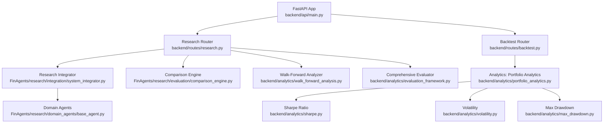
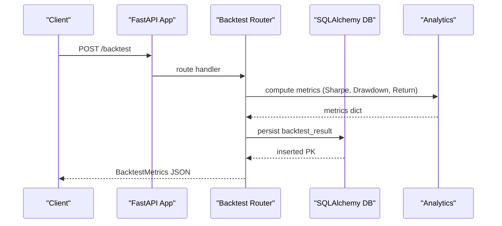
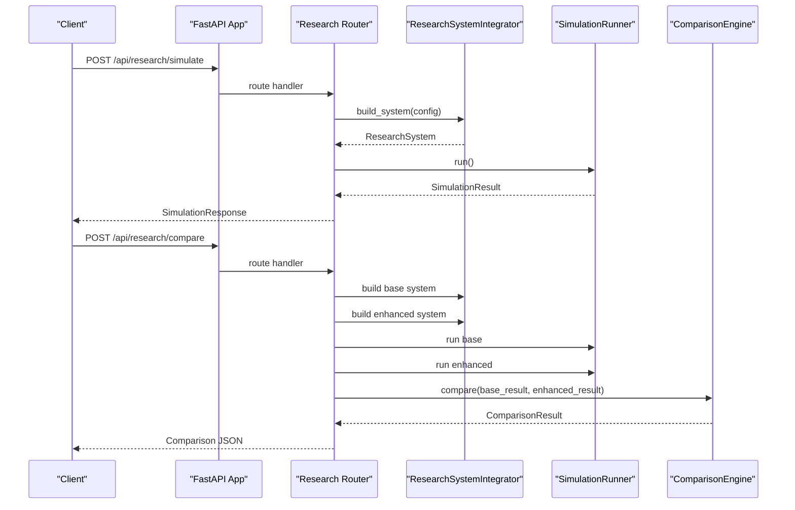
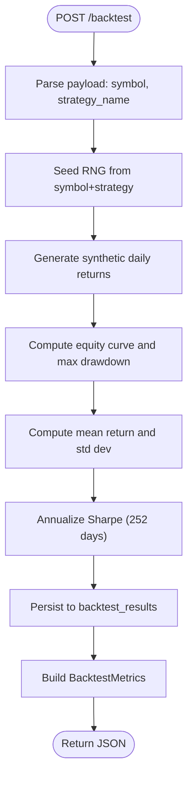
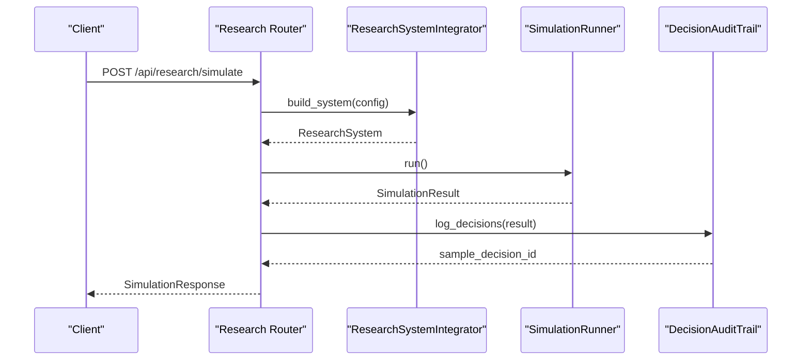
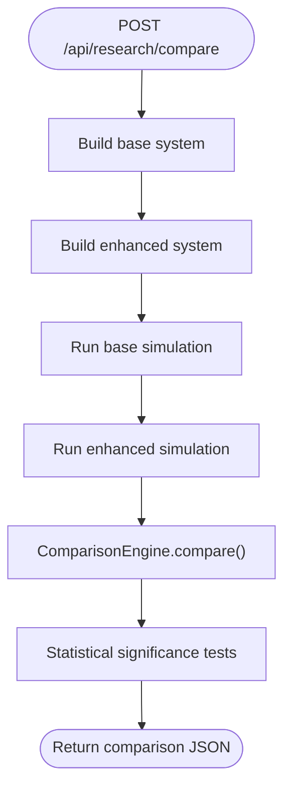
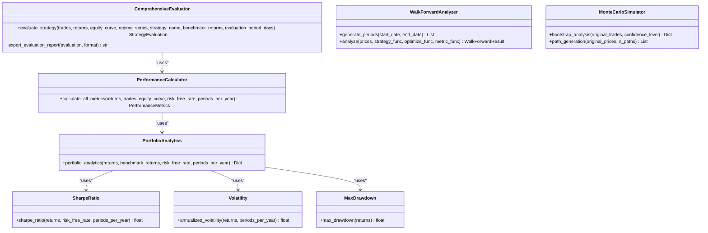
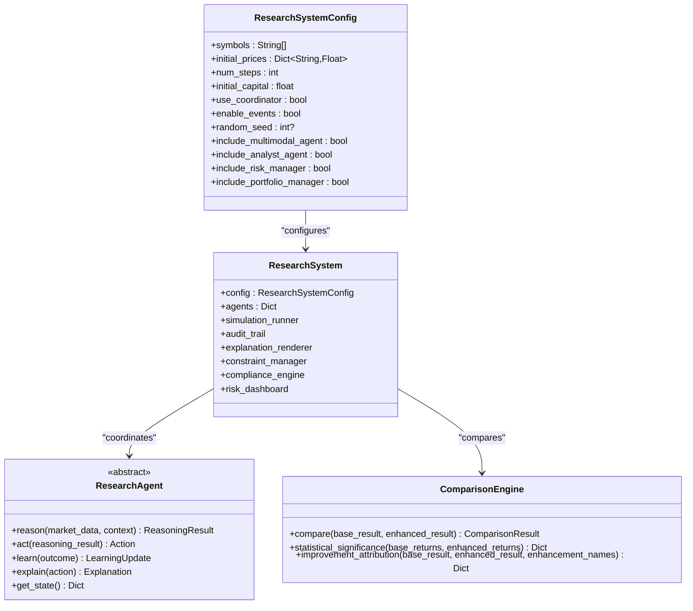
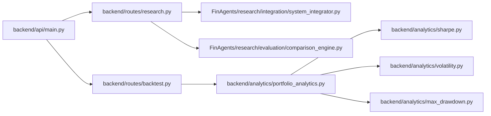

# Backtesting and Research API

<cite>
**Referenced Files in This Document**
- [main.py](file://backend/api/main.py)
- [backtest.py](file://backend/routes/backtest.py)
- [research.py](file://backend/routes/research.py)
- [walk_forward_analysis.py](file://backend/analytics/walk_forward_analysis.py)
- [evaluation_framework.py](file://backend/analytics/evaluation_framework.py)
- [portfolio_analytics.py](file://backend/analytics/portfolio_analytics.py)
- [sharpe.py](file://backend/analytics/sharpe.py)
- [volatility.py](file://backend/analytics/volatility.py)
- [max_drawdown.py](file://backend/analytics/max_drawdown.py)
- [system_integrator.py](file://FinAgents/research/integration/system_integrator.py)
- [base_agent.py](file://FinAgents/research/domain_agents/base_agent.py)
- [comparison_engine.py](file://FinAgents/research/evaluation/comparison_engine.py)
</cite>

## Table of Contents
1. [Introduction](#introduction)
2. [Project Structure](#project-structure)
3. [Core Components](#core-components)
4. [Architecture Overview](#architecture-overview)
5. [Detailed Component Analysis](#detailed-component-analysis)
6. [Dependency Analysis](#dependency-analysis)
7. [Performance Considerations](#performance-considerations)
8. [Troubleshooting Guide](#troubleshooting-guide)
9. [Conclusion](#conclusion)
10. [Appendices](#appendices)

## Introduction
This document provides comprehensive API documentation for backtesting and research endpoints. It covers strategy testing, performance evaluation, research analysis, and advanced analytics such as walk-forward analysis, Monte Carlo simulations, and comparative analysis. It also documents performance metrics computation, risk-adjusted returns, statistical significance testing, research data export, visualization integration, and publication-ready reporting.

## Project Structure
The backtesting and research capabilities are exposed via FastAPI routers and orchestrated by the main application. The research system integrates multiple specialized agents and evaluation modules.

**Diagram sources**
- [main.py:111-148](file://backend/api/main.py#L111-L148)
- [research.py:22-240](file://backend/routes/research.py#L22-L240)
- [backtest.py:13-137](file://backend/routes/backtest.py#L13-L137)
- [system_integrator.py:45-222](file://FinAgents/research/integration/system_integrator.py#L45-L222)
- [base_agent.py:16-221](file://FinAgents/research/domain_agents/base_agent.py#L16-L221)
- [comparison_engine.py:46-564](file://FinAgents/research/evaluation/comparison_engine.py#L46-L564)
- [portfolio_analytics.py:14-42](file://backend/analytics/portfolio_analytics.py#L14-L42)
- [sharpe.py:8-33](file://backend/analytics/sharpe.py#L8-L33)
- [volatility.py:9-28](file://backend/analytics/volatility.py#L9-L28)
- [max_drawdown.py:8-32](file://backend/analytics/max_drawdown.py#L8-L32)
- [walk_forward_analysis.py:65-425](file://backend/analytics/walk_forward_analysis.py#L65-L425)
- [evaluation_framework.py:187-796](file://backend/analytics/evaluation_framework.py#L187-L796)

**Section sources**
- [main.py:111-148](file://backend/api/main.py#L111-L148)
- [research.py:22-240](file://backend/routes/research.py#L22-L240)
- [backtest.py:13-137](file://backend/routes/backtest.py#L13-L137)

## Core Components
- Backtesting Endpoint: Runs a synthetic backtest for a symbol and strategy, computes performance metrics, persists results, and returns standardized metrics.
- Research Simulation Endpoint: Executes a configurable research-grade simulation with multiple agents, logs decisions, and exposes metrics and explanations.
- Comparative Analysis Endpoint: Compares a base system versus an enhanced system, computes improvements, runs statistical tests, and generates visualizations.
- Analytics Modules: Provide Sharpe ratio, Sortino ratio, volatility, max drawdown, and comprehensive evaluation with regime-aware metrics and recommendations.

**Section sources**
- [backtest.py:103-137](file://backend/routes/backtest.py#L103-L137)
- [research.py:142-240](file://backend/routes/research.py#L142-L240)
- [evaluation_framework.py:187-796](file://backend/analytics/evaluation_framework.py#L187-L796)

## Architecture Overview
The API exposes two primary endpoints:
- POST /backtest: Accepts a symbol and strategy name, simulates returns, computes metrics, stores results, and returns a standardized response.
- POST /api/research/simulate: Builds a research system with configurable agents and features, runs a simulation, logs decisions, and returns performance metrics.
- GET /api/research/metrics: Retrieves cached simulation metrics.
- GET /api/research/explanation/{decision_id}?format={format}: Renders a human-readable explanation for a decision.
- POST /api/research/compare: Compares base vs enhanced system configurations, computes improvements, runs statistical tests, and returns a structured comparison.

**Diagram sources**
- [backtest.py:103-137](file://backend/routes/backtest.py#L103-L137)
- [portfolio_analytics.py:14-42](file://backend/analytics/portfolio_analytics.py#L14-L42)

**Diagram sources**
- [research.py:142-240](file://backend/routes/research.py#L142-L240)
- [system_integrator.py:94-202](file://FinAgents/research/integration/system_integrator.py#L94-L202)
- [comparison_engine.py:68-131](file://FinAgents/research/evaluation/comparison_engine.py#L68-L131)

## Detailed Component Analysis

### Backtesting Endpoint
- Method: POST
- URL: /backtest
- Request Body Schema
  - symbol: string (required)
  - strategy_name: string (required)
- Response Schema
  - backtest_id: integer
  - sharpe: number
  - max_drawdown: number
  - total_return: number
- Processing Logic
  - Generates synthetic daily returns with drift and volatility.
  - Computes cumulative equity, peak, and maximum drawdown.
  - Calculates mean return and sample standard deviation.
  - Annualizes Sharpe ratio using 252 trading days.
  - Persists metrics into a backtest_results table via SQLAlchemy Core.
  - Returns a standardized BacktestMetrics object.

**Diagram sources**
- [backtest.py:31-101](file://backend/routes/backtest.py#L31-L101)

**Section sources**
- [backtest.py:16-137](file://backend/routes/backtest.py#L16-L137)

### Research Simulation Endpoint
- Method: POST
- URL: /api/research/simulate
- Request Body Schema
  - symbols: array of strings (default: ["AAPL","MSFT","GOOG"])
  - num_steps: integer (1..2000)
  - initial_capital: number (>0)
  - use_coordinator: boolean
  - enable_events: boolean
  - random_seed: integer (optional)
- Response Body Schema
  - total_return_pct: number
  - final_portfolio_value: number
  - performance_metrics: object
  - decision_count: integer
  - sample_decision_id: string (optional)
- Processing Logic
  - Builds a ResearchSystem using ResearchSystemIntegrator with provided config.
  - Runs SimulationRunner and logs decisions into a DecisionAuditTrail.
  - Stores system and last result in an internal cache guarded by a lock.
  - Returns SimulationResponse with performance metrics and a sample decision ID.

**Diagram sources**
- [research.py:55-158](file://backend/routes/research.py#L55-L158)
- [system_integrator.py:100-156](file://FinAgents/research/integration/system_integrator.py#L100-L156)

**Section sources**
- [research.py:31-158](file://backend/routes/research.py#L31-L158)
- [system_integrator.py:45-202](file://FinAgents/research/integration/system_integrator.py#L45-L202)

### Research Metrics Endpoint
- Method: GET
- URL: /api/research/metrics
- Response Body Schema
  - total_return_pct: number
  - final_portfolio_value: number
  - performance_metrics: object
  - agent_performance: object
- Notes
  - Requires a prior simulation to be cached.

**Section sources**
- [research.py:161-173](file://backend/routes/research.py#L161-L173)

### Research Explanation Endpoint
- Method: GET
- URL: /api/research/explanation/{decision_id}?format={format}
- Path Parameters
  - decision_id: string (required)
  - format: string (optional, default: plain_text)
- Response Body Schema
  - decision_id: string
  - format: string
  - content: string
  - metadata: object
- Processing Logic
  - Loads cached ResearchSystem and finds audit entry by decision_id.
  - Reconstructs a ReasoningChain from stored data.
  - Renders explanation using ExplanationRenderer with requested format.

**Section sources**
- [research.py:176-197](file://backend/routes/research.py#L176-L197)

### Research Comparison Endpoint
- Method: POST
- URL: /api/research/compare
- Request Body Schema
  - symbols: array of strings (default: ["AAPL","MSFT","GOOG"])
  - num_steps: integer (1..2000)
  - initial_capital: number (>0)
  - random_seed: integer (optional)
- Response Body Schema
  - base_metrics: object
  - enhanced_metrics: object
  - improvements: object
  - statistical_tests: object
  - summary: string
- Processing Logic
  - Builds base and enhanced ResearchSystem configurations differing in agent inclusion and coordination.
  - Runs simulations and compares results using ComparisonEngine.
  - Computes improvements, runs paired t-test and bootstrap confidence intervals, and returns a narrative summary.

**Diagram sources**
- [research.py:200-240](file://backend/routes/research.py#L200-L240)
- [comparison_engine.py:68-131](file://FinAgents/research/evaluation/comparison_engine.py#L68-L131)

**Section sources**
- [research.py:48-240](file://backend/routes/research.py#L48-L240)
- [comparison_engine.py:46-564](file://FinAgents/research/evaluation/comparison_engine.py#L46-L564)

### Analytics and Evaluation Modules
- Portfolio Analytics
  - Computes Sharpe, Sortino, volatility, max drawdown, and optionally alpha/beta against a benchmark.
- Sharpe Ratio
  - Annualized Sharpe from period returns with risk-free rate adjustment.
- Volatility
  - Annualized standard deviation of returns.
- Max Drawdown
  - Peak-to-trough decline from cumulative returns.
- Comprehensive Evaluator
  - Calculates a broad set of performance metrics, regime attribution, stability and consistency scores, risk score, and generates recommendations.
  - Supports exporting evaluation reports in JSON or text formats.
- Walk-Forward Analyzer
  - Implements rolling-window optimization and out-of-sample validation, computes degradation and consistency metrics.
- Monte Carlo Simulator
  - Provides bootstrap analysis for confidence intervals and path generation via geometric Brownian motion.

**Diagram sources**
- [portfolio_analytics.py:14-42](file://backend/analytics/portfolio_analytics.py#L14-L42)
- [sharpe.py:8-33](file://backend/analytics/sharpe.py#L8-L33)
- [volatility.py:9-28](file://backend/analytics/volatility.py#L9-L28)
- [max_drawdown.py:8-32](file://backend/analytics/max_drawdown.py#L8-L32)
- [evaluation_framework.py:187-796](file://backend/analytics/evaluation_framework.py#L187-L796)
- [walk_forward_analysis.py:65-425](file://backend/analytics/walk_forward_analysis.py#L65-L425)

**Section sources**
- [portfolio_analytics.py:14-42](file://backend/analytics/portfolio_analytics.py#L14-L42)
- [sharpe.py:8-33](file://backend/analytics/sharpe.py#L8-L33)
- [volatility.py:9-28](file://backend/analytics/volatility.py#L9-L28)
- [max_drawdown.py:8-32](file://backend/analytics/max_drawdown.py#L8-L32)
- [evaluation_framework.py:187-796](file://backend/analytics/evaluation_framework.py#L187-L796)
- [walk_forward_analysis.py:65-425](file://backend/analytics/walk_forward_analysis.py#L65-L425)

### Research System and Domain Agents
- ResearchSystemConfig
  - Controls symbols, initial prices, steps, capital, agent inclusion, and simulation flags.
- ResearchSystem
  - Aggregates agents, data sources, constraint manager, compliance engine, risk dashboard, and simulation runner.
- Domain Agents
  - Define shared data structures (Action, MarketData, ReasoningResult) and the ResearchAgent interface.
- Integration
  - ResearchSystemIntegrator builds the system and wires components together.
- Comparison Engine
  - Provides statistical significance testing and improvement attribution.

**Diagram sources**
- [system_integrator.py:45-222](file://FinAgents/research/integration/system_integrator.py#L45-L222)
- [base_agent.py:163-221](file://FinAgents/research/domain_agents/base_agent.py#L163-L221)
- [comparison_engine.py:46-131](file://FinAgents/research/evaluation/comparison_engine.py#L46-L131)

**Section sources**
- [system_integrator.py:45-222](file://FinAgents/research/integration/system_integrator.py#L45-L222)
- [base_agent.py:16-221](file://FinAgents/research/domain_agents/base_agent.py#L16-L221)
- [comparison_engine.py:46-564](file://FinAgents/research/evaluation/comparison_engine.py#L46-L564)

## Dependency Analysis
- API Orchestration
  - The main app registers routers for research and backtest endpoints.
- Research Endpoint Dependencies
  - ResearchSystemIntegrator constructs the research system.
  - SimulationRunner executes the simulation.
  - ComparisonEngine compares base vs enhanced runs.
  - Explanation rendering depends on DecisionAuditTrail and ReasoningChain.
- Backtest Endpoint Dependencies
  - Portfolio analytics modules compute Sharpe, Sortino, volatility, and drawdown.
  - Results persisted via SQLAlchemy Core to a backtest_results table.

**Diagram sources**
- [main.py:111-148](file://backend/api/main.py#L111-L148)
- [research.py:22-240](file://backend/routes/research.py#L22-L240)
- [backtest.py:13-137](file://backend/routes/backtest.py#L13-L137)
- [system_integrator.py:94-202](file://FinAgents/research/integration/system_integrator.py#L94-L202)
- [comparison_engine.py:68-131](file://FinAgents/research/evaluation/comparison_engine.py#L68-L131)
- [portfolio_analytics.py:14-42](file://backend/analytics/portfolio_analytics.py#L14-L42)
- [sharpe.py:8-33](file://backend/analytics/sharpe.py#L8-L33)
- [volatility.py:9-28](file://backend/analytics/volatility.py#L9-L28)
- [max_drawdown.py:8-32](file://backend/analytics/max_drawdown.py#L8-L32)

**Section sources**
- [main.py:111-148](file://backend/api/main.py#L111-L148)
- [research.py:22-240](file://backend/routes/research.py#L22-L240)
- [backtest.py:13-137](file://backend/routes/backtest.py#L13-L137)

## Performance Considerations
- Simulation Scalability
  - Adjust num_steps and symbols to balance runtime and fidelity.
  - Use random_seed for reproducible runs.
- Metrics Computation
  - Portfolio analytics and evaluation metrics rely on sufficient return samples; ensure adequate history.
- Statistical Testing
  - ComparisonEngine’s paired t-test requires aligned return streams; align lengths before comparison.
- Caching
  - Research metrics endpoint relies on an in-memory cache; ensure a recent simulation is present.

[No sources needed since this section provides general guidance]

## Troubleshooting Guide
- Backtest Endpoint
  - Internal server errors surface as HTTP 500; check database connectivity and schema initialization.
  - Missing inserted primary key triggers an error during persistence.
- Research Endpoints
  - No simulation results cached yields HTTP 404 from metrics endpoint.
  - Decision not found yields HTTP 404 from explanation endpoint.
  - Comparison requires non-empty return arrays; otherwise statistical tests are skipped.
- Analytics
  - Insufficient return data raises errors in Sharpe/Volatility/Max Drawdown calculations.

**Section sources**
- [backtest.py:121-127](file://backend/routes/backtest.py#L121-L127)
- [research.py:165-167](file://backend/routes/research.py#L165-L167)
- [research.py:184-187](file://backend/routes/research.py#L184-L187)
- [evaluation_framework.py:200-201](file://backend/analytics/evaluation_framework.py#L200-L201)
- [sharpe.py:23-29](file://backend/analytics/sharpe.py#L23-L29)
- [volatility.py:20-26](file://backend/analytics/volatility.py#L20-L26)
- [max_drawdown.py:18-19](file://backend/analytics/max_drawdown.py#L18-L19)

## Conclusion
The backtesting and research APIs provide a robust foundation for strategy testing, performance evaluation, and comparative analysis. They integrate seamlessly with analytics modules for risk-adjusted returns, regime-aware evaluation, and publication-ready reporting. Researchers and developers can leverage these endpoints to conduct walk-forward analysis, Monte Carlo simulations, and statistical significance testing, enabling data-driven strategy selection and continuous improvement.

[No sources needed since this section summarizes without analyzing specific files]

## Appendices

### Example Workflows

- Strategy Parameter Optimization
  - Use WalkForwardAnalyzer to split data into rolling windows, optimize parameters on training periods, and validate on test sets. Track degradation and consistency to detect overfitting and select stable parameter sets.

- Walk-Forward Analysis
  - Configure train_window_days, test_window_days, and step_days. Run analyze(prices, strategy_func, optimize_func, metric_func) to obtain aggregated metrics and stability indicators.

- Monte Carlo Simulations
  - Use MonteCarloSimulator.bootstrap_analysis(original_trades) to estimate confidence intervals and probability of profit. Use path_generation(original_prices, n_paths) to simulate alternative price paths.

- Benchmark Comparisons
  - Use ComprehensiveEvaluator to compute regime-specific metrics and export reports. Compare against a benchmark (e.g., SPY) to derive alpha and risk-adjusted performance.

- Publication-Ready Reports
  - Export evaluation reports in JSON or text formats using ComprehensiveEvaluator.export_evaluation_report for sharing insights and recommendations.

[No sources needed since this section provides general guidance]