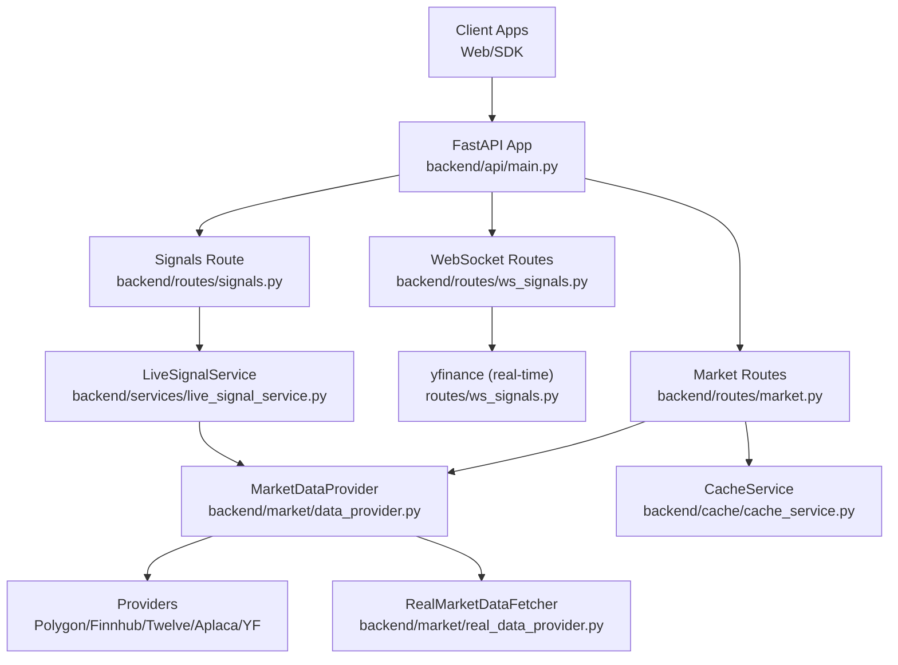
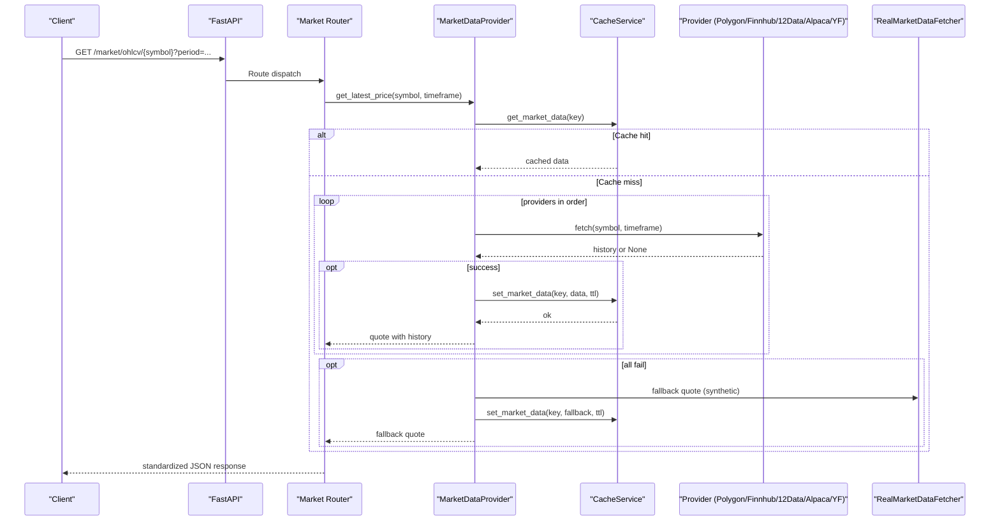
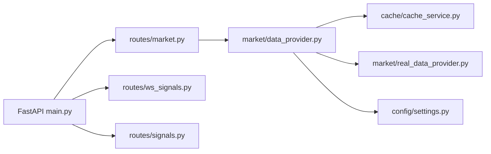

# Market Data API

<cite>
**Referenced Files in This Document**
- [backend/api/main.py](file://backend/api/main.py)
- [backend/routes/market.py](file://backend/routes/market.py)
- [backend/routes/ws_signals.py](file://backend/routes/ws_signals.py)
- [backend/routes/signals.py](file://backend/routes/signals.py)
- [backend/market/data_provider.py](file://backend/market/data_provider.py)
- [backend/market/real_data_provider.py](file://backend/market/real_data_provider.py)
- [backend/market/regime_detector.py](file://backend/market/regime_detector.py)
- [backend/cache/cache_service.py](file://backend/cache/cache_service.py)
- [backend/config/settings.py](file://backend/config/settings.py)
- [backend/services/live_signal_service.py](file://backend/services/live_signal_service.py)
- [FinAgents/agent_pools/data_agent_pool/config/polygon.yaml](file://FinAgents/agent_pools/data_agent_pool/config/polygon.yaml)
- [FinAgents/agent_pools/data_agent_pool/config/yfinance.yaml](file://FinAgents/agent_pools/data_agent_pool/config/yfinance.yaml)
</cite>

## Table of Contents
1. [Introduction](#introduction)
2. [Project Structure](#project-structure)
3. [Core Components](#core-components)
4. [Architecture Overview](#architecture-overview)
5. [Detailed Component Analysis](#detailed-component-analysis)
6. [Dependency Analysis](#dependency-analysis)
7. [Performance Considerations](#performance-considerations)
8. [Troubleshooting Guide](#troubleshooting-guide)
9. [Conclusion](#conclusion)
10. [Appendices](#appendices)

## Introduction
This document provides comprehensive API documentation for market data endpoints in the Agentic Trading Application. It covers:
- Real-time price feeds via WebSocket
- Historical OHLCV retrieval
- Alternative data sources (Polygon, Finnhub, Twelve Data, Alpaca, Yahoo Finance)
- Market regime detection and classification
- Data caching strategies, rate limiting policies, and data freshness guarantees
- Market hours filtering, timezone handling, and data quality validation
- Examples of technical indicator calculations, correlation analysis, and market regime classification workflows

## Project Structure
The market data API is exposed under the /market route and integrates with multiple data providers and caching layers. The FastAPI application wires routers and sets up middleware.

**Diagram sources**
- [backend/api/main.py:111-139](file://backend/api/main.py#L111-L139)
- [backend/routes/market.py:35](file://backend/routes/market.py#L35)
- [backend/routes/ws_signals.py:22](file://backend/routes/ws_signals.py#L22)
- [backend/routes/signals.py:6](file://backend/routes/signals.py#L6)
- [backend/market/data_provider.py:280](file://backend/market/data_provider.py#L280)
- [backend/cache/cache_service.py:58](file://backend/cache/cache_service.py#L58)
- [backend/market/real_data_provider.py:27](file://backend/market/real_data_provider.py#L27)

**Section sources**
- [backend/api/main.py:111-139](file://backend/api/main.py#L111-L139)

## Core Components
- Market Routes (/market): Provides endpoints for price, OHLCV, symbol info, search, and popular symbols.
- WebSocket Routes (/ws): Streams real-time prices and simulated signals.
- MarketDataProvider: Orchestrates multiple market data providers with circuit breakers, retries, and caching.
- CacheService: Two-level cache (in-memory + Redis) optimized for hot market data.
- RealMarketDataFetcher: Fetches real historical data with validation and supports multiple asset classes.
- RegimeDetector: Statistical regime classification with volatility, trend, and momentum analysis.
- Settings: Centralized configuration for provider order, timeouts, retries, and hot lists.

**Section sources**
- [backend/routes/market.py:35-368](file://backend/routes/market.py#L35-L368)
- [backend/routes/ws_signals.py:22-141](file://backend/routes/ws_signals.py#L22-L141)
- [backend/market/data_provider.py:280-396](file://backend/market/data_provider.py#L280-L396)
- [backend/cache/cache_service.py:58-202](file://backend/cache/cache_service.py#L58-L202)
- [backend/market/real_data_provider.py:27-231](file://backend/market/real_data_provider.py#L27-L231)
- [backend/market/regime_detector.py:101-800](file://backend/market/regime_detector.py#L101-L800)
- [backend/config/settings.py:8-85](file://backend/config/settings.py#L8-L85)

## Architecture Overview
The market data pipeline integrates FastAPI routes, provider orchestration, and caching. It supports fallbacks and circuit breaking to maintain resilience.

**Diagram sources**
- [backend/routes/market.py:183-261](file://backend/routes/market.py#L183-L261)
- [backend/market/data_provider.py:297-341](file://backend/market/data_provider.py#L297-L341)
- [backend/cache/cache_service.py:109-145](file://backend/cache/cache_service.py#L109-L145)
- [backend/market/real_data_provider.py:27-99](file://backend/market/real_data_provider.py#L27-L99)

## Detailed Component Analysis

### Market Routes (/market)
- Base path: /market
- Tags: Market
- Endpoints:
  - GET /price/{symbol}
    - Purpose: Current price and stats with sparkline history
    - Path parameters: symbol (string)
    - Query parameters: none
    - Response: success/error wrapper with standardized fields
    - Data fields: symbol, price, change, change_pct, volume, open, high, low, prev_close, timestamp, history[]
  - GET /ohlcv/{symbol}
    - Purpose: Historical OHLCV with period and interval selection
    - Path parameters: symbol (string)
    - Query parameters:
      - period: enum ["1D","1W","1M","3M","1Y"]
      - interval: optional string (overrides default)
    - Response: success/error wrapper with standardized fields
    - Data fields: symbol, period, interval, count, first_date, last_date, prices[]
  - GET /info/{symbol}
    - Purpose: Symbol metadata and summary statistics
    - Path parameters: symbol (string)
    - Response: success/error wrapper with standardized fields
    - Data fields: symbol, name, sector, industry, market_cap, pe_ratio, eps, dividend_yield, 52w_high, 52w_low, avg_volume, description, price, website, employees, headquarters
  - GET /search?q=...
    - Purpose: Search popular symbols and direct lookup
    - Query parameters: q (string, min_length=1, max_length=10)
    - Response: success/error wrapper with query, count, results[]
  - GET /popular
    - Purpose: Popular symbols catalog
    - Response: success/error wrapper with count, symbols[]

- Request/Response Schema Notes:
  - All endpoints return a wrapper with status, data, timestamp.
  - Error responses include status, message, timestamp, and optional details.
  - OHLCV prices[] items include time (unix epoch), date (formatted), datetime (ISO), and OHLCV fields.

- Data Formatting Options:
  - Time fields: unix epoch (time), ISO datetime (datetime), formatted date (date).
  - Decimal precision: OHLC rounded to 4 decimals; price/change rounded to 2 decimals; change_pct to 6 decimals.

- Examples:
  - OHLCV retrieval: GET /market/ohlcv/AAPL?period=1M&interval=1h
  - Symbol info: GET /market/info/AAPL
  - Search: GET /market/search?q=AAPL
  - Popular: GET /market/popular

**Section sources**
- [backend/routes/market.py:80-368](file://backend/routes/market.py#L80-L368)

### WebSocket Routes (/ws)
- Base path: /ws
- Endpoints:
  - WebSocket /prices/{symbol}
    - Purpose: Stream real-time prices from Yahoo Finance
    - Path parameters: symbol (string)
    - Messages: JSON with status, data fields (price, change, change_pct, volume, timestamp, source)
    - Update cadence: ~2 seconds
  - WebSocket /signals/{symbol}
    - Purpose: Simulated live signals (for demo/testing)
    - Path parameters: symbol (string)
    - Messages: JSON with status, data fields (signal/action, confidence, explanation, agent)

- Notes:
  - The prices stream falls back to cached data on upstream failures.
  - The signals stream is synthetic and not tied to real market data.

**Section sources**
- [backend/routes/ws_signals.py:22-141](file://backend/routes/ws_signals.py#L22-L141)

### Signals Route (/signals)
- Base path: /signals
- Endpoint:
  - GET /{symbol}
    - Purpose: Generate a synthetic live signal
    - Path parameters: symbol (string)
    - Response: success/error wrapper with data fields (symbol, price, signal/action, confidence, explanation, agent)

- Notes:
  - Intended for demos and testing; not production market data.

**Section sources**
- [backend/routes/signals.py:62-68](file://backend/routes/signals.py#L62-L68)

### MarketDataProvider and Alternative Data Sources
- Provider orchestration:
  - Providers: Polygon, Finnhub, Twelve Data, Alpaca, Yahoo Finance
  - Order configured via settings (MARKET_PROVIDER_ORDER)
  - Circuit breaker per provider prevents cascading failures
  - Retry policy and timeouts configurable
- Timeframe mapping:
  - RANGE_TO_PERIOD maps human-friendly ranges to provider-specific period/intervals/limits
- TTL logic:
  - Short TTL for intraday (SHORT_TTL_TIMEFRAMES)
  - Longer TTL for longer timeframes
- Fallback mechanism:
  - Synthetic quote generator when all providers fail
  - Includes realistic price dynamics and volume

- Example provider configs:
  - Polygon: endpoints, default interval, rate limits, LLM enabled
  - Yahoo Finance: endpoints, features, intervals, cache, rate limits

**Section sources**
- [backend/market/data_provider.py:280-396](file://backend/market/data_provider.py#L280-L396)
- [backend/config/settings.py:46-64](file://backend/config/settings.py#L46-L64)
- [FinAgents/agent_pools/data_agent_pool/config/polygon.yaml:1-17](file://FinAgents/agent_pools/data_agent_pool/config/polygon.yaml#L1-L17)
- [FinAgents/agent_pools/data_agent_pool/config/yfinance.yaml:1-45](file://FinAgents/agent_pools/data_agent_pool/config/yfinance.yaml#L1-L45)

### Real Historical Data Fetcher
- Purpose: Fetch real historical OHLCV with validation and multi-asset support
- Supported assets: stocks, ETFs, indices, forex, crypto
- Validation: checks for missing values, zero/close prices, negative volumes, extreme returns
- Methods:
  - fetch(symbol, start_date?, end_date?, period?, interval?)
  - fetch_multiple(symbols, start_date, end_date, interval)
  - get_sp500_constituents()
  - get_market_holidays(year)

**Section sources**
- [backend/market/real_data_provider.py:27-231](file://backend/market/real_data_provider.py#L27-L231)

### Market Regime Detection
- Purpose: Classify market regimes using volatility, trend, momentum, and statistical clustering
- Inputs: price series (and optionally volumes/returns)
- Outputs: primary regime, secondary regime, confidence, probabilities, detected_at, lookback_period, indicators, recommendations, risk level
- Regime categories: bull_market, bear_market, high_volatility, low_volatility, trending_up, trending_down, sideways, crash, expansion, contraction, recovery, unknown

- Workflow highlights:
  - Flash crash detection (short lookback)
  - Volatility analysis (realized volatility, clustering)
  - Trend analysis (MAs, ADX, linear regression)
  - Momentum analysis (RSI, MACD, ROC)
  - Optional GMM clustering
  - Confidence scoring and strategy recommendations

**Section sources**
- [backend/market/regime_detector.py:101-800](file://backend/market/regime_detector.py#L101-L800)

### Live Signal Service
- Purpose: Generate validated live signals by combining market data with agent decisions and risk checks
- Steps:
  - Optional cache lookup
  - Retrieve latest market data via MarketDataProvider
  - Run agent.generate_signal and validate action
  - Apply risk validation
  - Optionally cache the signal

**Section sources**
- [backend/services/live_signal_service.py:9-84](file://backend/services/live_signal_service.py#L9-L84)

## Dependency Analysis
- Routing:
  - FastAPI mounts market, websocket, and signals routers under /market, /ws, and /signals respectively.
- Data flow:
  - Market routes delegate to MarketDataProvider, which selects providers and caches results.
  - CacheService provides L1/L2 caching with namespace prefixes.
- Configuration:
  - Settings controls provider order, timeouts, retries, hot lists, and API keys.

**Diagram sources**
- [backend/api/main.py:126-139](file://backend/api/main.py#L126-L139)
- [backend/routes/market.py:35](file://backend/routes/market.py#L35)
- [backend/routes/ws_signals.py:7](file://backend/routes/ws_signals.py#L7)
- [backend/routes/signals.py:6](file://backend/routes/signals.py#L6)
- [backend/market/data_provider.py:280](file://backend/market/data_provider.py#L280)
- [backend/cache/cache_service.py:58](file://backend/cache/cache_service.py#L58)
- [backend/market/real_data_provider.py:27](file://backend/market/real_data_provider.py#L27)
- [backend/config/settings.py:8](file://backend/config/settings.py#L8)

**Section sources**
- [backend/api/main.py:126-139](file://backend/api/main.py#L126-L139)
- [backend/market/data_provider.py:280-396](file://backend/market/data_provider.py#L280-L396)
- [backend/cache/cache_service.py:58-202](file://backend/cache/cache_service.py#L58-L202)
- [backend/config/settings.py:8-85](file://backend/config/settings.py#L8-L85)

## Performance Considerations
- Caching:
  - L1 in-memory cache with TTL for hot market data
  - L2 Redis cache for distributed systems
  - Provider responses cached by symbol and timeframe
  - Short TTLs for intraday data to ensure freshness
- Provider circuit breaking:
  - Prevents repeated failures from overwhelming downstream consumers
- Timeouts and retries:
  - Configurable per provider to balance responsiveness and reliability
- Real-time streaming:
  - WebSocket updates at ~2-second intervals for low latency

[No sources needed since this section provides general guidance]

## Troubleshooting Guide
- Provider failures:
  - MarketDataProvider logs warnings and attempts fallbacks; check provider circuit breaker status and logs.
- Cache misses:
  - Verify CacheService availability and Redis connectivity; confirm TTLs and key namespaces.
- Symbol normalization:
  - Some symbols require Yahoo Finance mapping (e.g., VIX, DJI); ensure correct symbol input.
- Data validation:
  - RealMarketDataFetcher validates data quality; address missing values, negative volumes, or extreme returns.
- Rate limiting:
  - Respect provider rate limits; adjust MARKET_PROVIDER_RETRY_COUNT and timeouts accordingly.

**Section sources**
- [backend/market/data_provider.py:310-341](file://backend/market/data_provider.py#L310-L341)
- [backend/cache/cache_service.py:97-104](file://backend/cache/cache_service.py#L97-L104)
- [backend/market/real_data_provider.py:134-155](file://backend/market/real_data_provider.py#L134-L155)
- [backend/config/settings.py:46-64](file://backend/config/settings.py#L46-L64)

## Conclusion
The Market Data API provides robust, multi-provider market data with strong caching, fallbacks, and regime detection capabilities. It supports both REST and WebSocket access patterns, enabling real-time dashboards and batch historical analysis. Proper configuration of providers, caching, and rate limits ensures reliable performance across diverse market conditions.

[No sources needed since this section summarizes without analyzing specific files]

## Appendices

### API Reference: Market Routes
- GET /market/price/{symbol}
  - Path parameters: symbol
  - Response: success/error wrapper with fields: symbol, price, change, change_pct, volume, open, high, low, prev_close, timestamp, history[]
- GET /market/ohlcv/{symbol}?period=...&interval=...
  - Path parameters: symbol
  - Query parameters: period (enum), interval (optional)
  - Response: success/error wrapper with fields: symbol, period, interval, count, first_date, last_date, prices[]
- GET /market/info/{symbol}
  - Path parameters: symbol
  - Response: success/error wrapper with fields: symbol, name, sector, industry, market_cap, pe_ratio, eps, dividend_yield, 52w_high, 52w_low, avg_volume, description, price, website, employees, headquarters
- GET /market/search?q=...
  - Query parameters: q
  - Response: success/error wrapper with fields: query, count, results[]
- GET /market/popular
  - Response: success/error wrapper with fields: count, symbols[]

**Section sources**
- [backend/routes/market.py:80-368](file://backend/routes/market.py#L80-L368)

### API Reference: WebSocket Routes
- WebSocket /ws/prices/{symbol}
  - Messages: JSON with fields: status, data (price, change, change_pct, volume, timestamp, source)
- WebSocket /ws/signals/{symbol}
  - Messages: JSON with fields: status, data (signal/action, confidence, explanation, agent)

**Section sources**
- [backend/routes/ws_signals.py:22-141](file://backend/routes/ws_signals.py#L22-L141)

### Data Caching Strategies
- Namespaces:
  - market_data:{symbol}
  - signals:{symbol}:{agent_name}
  - agent_memory:{agent_name}
  - portfolio:summary
- TTLs:
  - market_data: default 30s (hot path)
  - charts: default 120s
  - signals: default 15s
  - agent memory: default 300s
  - portfolio summary: default 5s
- Behavior:
  - L1 memory cache (instant)
  - L2 Redis cache (distributed)
  - On miss, populate L1 after Redis hit

**Section sources**
- [backend/cache/cache_service.py:58-202](file://backend/cache/cache_service.py#L58-L202)

### Rate Limiting Policies
- Provider order and keys:
  - Configure via settings and YAML configs
- Provider constraints:
  - Polygon: rate_limit_per_minute
  - Yahoo Finance: rate_limit_per_minute and max_symbols_per_request
- General guidance:
  - Tune MARKET_PROVIDER_RETRY_COUNT and timeouts to respect upstream limits

**Section sources**
- [backend/config/settings.py:46-64](file://backend/config/settings.py#L46-L64)
- [FinAgents/agent_pools/data_agent_pool/config/polygon.yaml:15-17](file://FinAgents/agent_pools/data_agent_pool/config/polygon.yaml#L15-L17)
- [FinAgents/agent_pools/data_agent_pool/config/yfinance.yaml:40-45](file://FinAgents/agent_pools/data_agent_pool/config/yfinance.yaml#L40-L45)

### Data Freshness Guarantees
- In-memory TTLs:
  - Market data: 30s (hot path)
  - Charts: 120s
  - Signals: 15s
- Provider TTL logic:
  - Shorter for intraday timeframes
  - Longer for longer timeframes
- Fallbacks:
  - Synthetic quotes when providers fail

**Section sources**
- [backend/cache/cache_service.py:76-81](file://backend/cache/cache_service.py#L76-L81)
- [backend/market/data_provider.py:343-344](file://backend/market/data_provider.py#L343-L344)

### Market Hours Filtering and Timezone Handling
- RealMarketDataFetcher:
  - Supports start/end date and interval-based queries
  - Validates data quality and detects anomalies
- Timezone:
  - Provider timestamps are handled in UTC; clients should localize as needed
- Market sessions:
  - Separate tools classify market session and stress levels for timing optimization

**Section sources**
- [backend/market/real_data_provider.py:54-99](file://backend/market/real_data_provider.py#L54-L99)
- [FinAgents/agent_pools/transaction_cost_agent_pool/agents/optimization/timing_optimizer.py:251-283](file://FinAgents/agent_pools/transaction_cost_agent_pool/agents/optimization/timing_optimizer.py#L251-L283)

### Data Quality Validation
- Checks performed:
  - Missing values percentage
  - Zero prices
  - Negative volumes
  - Extreme returns (>50% in a day)
- Recommendations:
  - Investigate symbols flagged for extreme returns
  - Ensure data sources are providing adjusted prices where applicable

**Section sources**
- [backend/market/real_data_provider.py:134-155](file://backend/market/real_data_provider.py#L134-L155)

### Examples: Technical Indicators, Correlation, and Regime Classification
- Technical indicators:
  - Volatility: realized volatility, volatility rank, clustering
  - Trend: MAs, ADX, linear regression slope/r-squared
  - Momentum: RSI, MACD, ROC (1m/3m/6m/12m)
  - Volume: OBV, VPT, volume vs average
- Correlation analysis:
  - Use OHLCV series to compute pairwise correlations across assets
  - Apply rolling windows for dynamic correlation surfaces
- Regime classification:
  - Combine indicator consensus with confidence scoring
  - Use GMM clustering for probabilistic regime interpretation
  - Generate strategy recommendations and risk level

[No sources needed since this section provides general guidance]