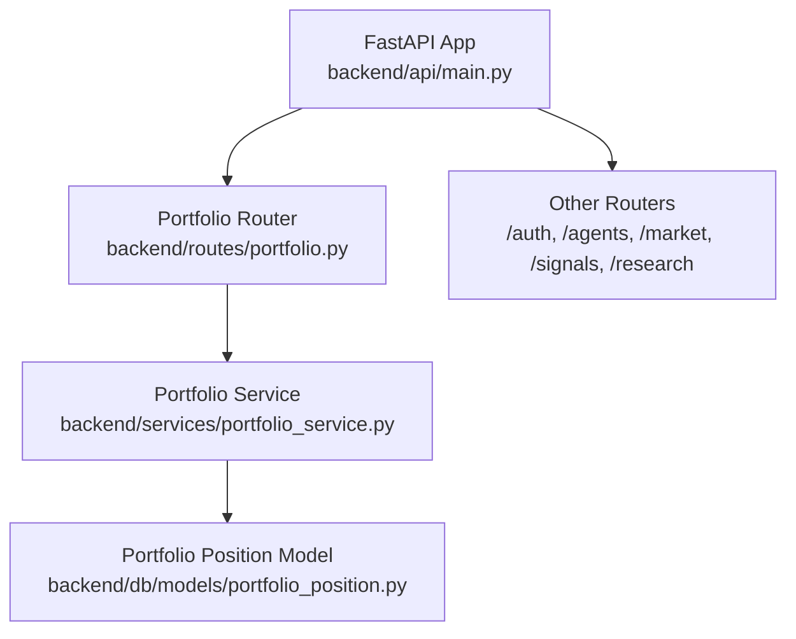
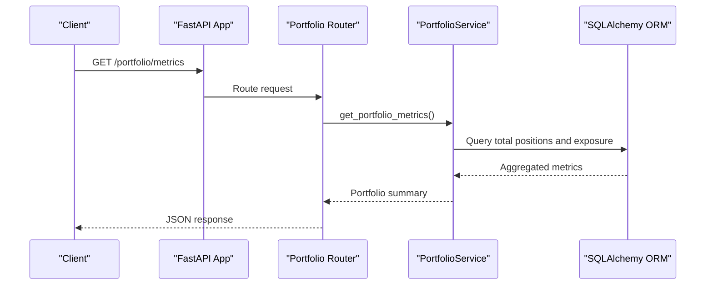
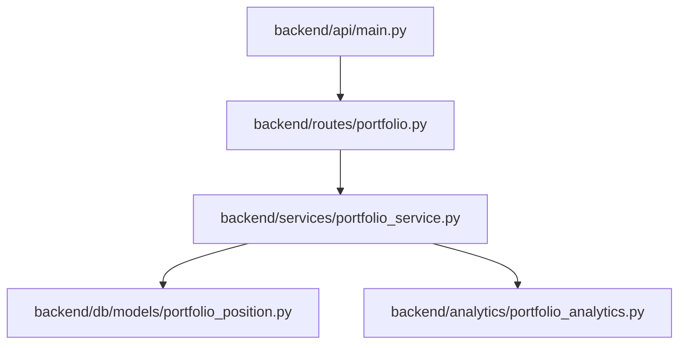

# Portfolio Management API

<cite>
**Referenced Files in This Document**
- [main.py](file://backend/api/main.py)
- [portfolio.py](file://backend/routes/portfolio.py)
- [portfolio_service.py](file://backend/services/portfolio_service.py)
- [portfolio_position.py](file://backend/db/models/portfolio_position.py)
</cite>

## Table of Contents
1. [Introduction](#introduction)
2. [Project Structure](#project-structure)
3. [Core Components](#core-components)
4. [Architecture Overview](#architecture-overview)
5. [Detailed Component Analysis](#detailed-component-analysis)
6. [Dependency Analysis](#dependency-analysis)
7. [Performance Considerations](#performance-considerations)
8. [Troubleshooting Guide](#troubleshooting-guide)
9. [Conclusion](#conclusion)

## Introduction
This document provides comprehensive API documentation for the portfolio management endpoints in the Agentic Trading Application. It covers portfolio valuation, position tracking, trade history, and account balance operations. For each endpoint, we specify HTTP methods, URL patterns, request/response schemas, and parameter validation rules. We also include examples of portfolio aggregation queries, position sizing calculations, and trade execution workflows. Real-time portfolio updates, historical performance calculations, and risk metrics integration are documented, along with portfolio rebalancing operations, position limits, and margin requirements. Finally, we outline examples of portfolio analytics, performance attribution, and tax reporting features.

## Project Structure
The portfolio management API is implemented as part of the FastAPI application. The API router is registered under the `/portfolio` prefix and delegates to the portfolio service for computations. Database models define the persistence layer for portfolio positions and trades.

**Diagram sources**
- [main.py:133](file://backend/api/main.py#L133)
- [portfolio.py:9](file://backend/routes/portfolio.py#L9)
- [portfolio_service.py:13](file://backend/services/portfolio_service.py#L13)
- [portfolio_position.py:5](file://backend/db/models/portfolio_position.py#L5)

**Section sources**
- [main.py:133](file://backend/api/main.py#L133)
- [portfolio.py:9](file://backend/routes/portfolio.py#L9)

## Core Components
- Portfolio Metrics Endpoint: Provides portfolio-wide metrics such as total positions, exposure, portfolio value, and cash.
- Portfolio Service: Computes portfolio summaries, returns, analytics, and position details with caching and fallback support.
- Portfolio Position Model: Defines the persisted structure for portfolio holdings.

Key capabilities:
- Portfolio valuation via exposure calculation and cash computation.
- Position tracking aggregated per symbol with quantity, average cost, market value, and PnL.
- Historical returns computation from trade records.
- Risk metrics integration (Sharpe ratio, Sortino ratio, volatility, max drawdown) with analytics fallback.

**Section sources**
- [portfolio.py:12](file://backend/routes/portfolio.py#L12)
- [portfolio_service.py:20](file://backend/services/portfolio_service.py#L20)
- [portfolio_position.py:5](file://backend/db/models/portfolio_position.py#L5)

## Architecture Overview
The portfolio API follows a layered architecture:
- API Layer: FastAPI router exposing endpoints.
- Service Layer: Business logic encapsulated in the PortfolioService.
- Persistence Layer: SQLAlchemy models for portfolio positions and trades.
- Analytics Layer: Portfolio analytics computations integrated into service responses.

**Diagram sources**
- [main.py:133](file://backend/api/main.py#L133)
- [portfolio.py:12](file://backend/routes/portfolio.py#L12)
- [portfolio_service.py:20](file://backend/services/portfolio_service.py#L20)

## Detailed Component Analysis

### Portfolio Metrics Endpoint
- Method: GET
- URL Pattern: /portfolio/metrics
- Purpose: Returns portfolio-wide metrics including total positions, exposure, portfolio value, and cash.
- Request: No query parameters.
- Response Schema:
  - status: string
  - data: object
    - total_positions: integer
    - total_exposure: number
    - portfolio_value: number
    - cash: number
- Parameter Validation Rules:
  - No parameters required.
- Error Handling:
  - On internal errors, returns HTTP 500 with error details.

Example usage:
- Retrieve portfolio metrics for dashboard display.

**Section sources**
- [portfolio.py:12](file://backend/routes/portfolio.py#L12)

### Portfolio Service Methods
- get_portfolio_summary():
  - Computes total positions, exposure, portfolio value, and cash.
  - Loads positions with quantity, average cost, market value, and PnL.
  - Uses caching if available; falls back to deterministic summary otherwise.
- get_returns_from_trades(initial_equity):
  - Aggregates daily PnL from trades and computes period returns.
- get_portfolio_summary_with_analytics(initial_equity):
  - Extends summary with Sharpe ratio, Sortino ratio, volatility, and max drawdown when sufficient data exists.
  - Provides fallback analytics when insufficient data.
- get_total_exposure():
  - Computes absolute exposure across positions.
- get_portfolio_value():
  - Returns portfolio value derived from exposure.

Example usage:
- Build portfolio analytics dashboards with risk metrics.
- Compute daily returns for performance attribution.

**Section sources**
- [portfolio_service.py:20](file://backend/services/portfolio_service.py#L20)
- [portfolio_service.py:49](file://backend/services/portfolio_service.py#L49)
- [portfolio_service.py:86](file://backend/services/portfolio_service.py#L86)
- [portfolio_service.py:118](file://backend/services/portfolio_service.py#L118)
- [portfolio_service.py:122](file://backend/services/portfolio_service.py#L122)

### Portfolio Position Model
- Table: portfolio_positions
- Columns:
  - id: integer (primary key)
  - symbol: string (unique, indexed)
  - quantity: float (default 0.0)

Usage:
- Stores current positions held in the portfolio.
- Supports aggregation and valuation via service methods.

**Section sources**
- [portfolio_position.py:5](file://backend/db/models/portfolio_position.py#L5)

### Portfolio Valuation and Position Tracking
- Valuation:
  - Exposure computed as the sum of absolute quantities across positions.
  - Portfolio value and cash derived from exposure and a baseline balance.
- Position Tracking:
  - Per-symbol breakdown includes quantity, average cost, market value, and PnL.
  - Market value and PnL computed using mock pricing logic within the service.

Example usage:
- Display portfolio holdings with unrealized gains/losses.
- Support position sizing calculations by referencing exposure and cash.

**Section sources**
- [portfolio_service.py:35](file://backend/services/portfolio_service.py#L35)
- [portfolio_service.py:126](file://backend/services/portfolio_service.py#L126)

### Trade History and Returns
- Daily PnL aggregation:
  - Sums realized PnL by day from trade records.
- Returns computation:
  - Converts daily PnL into period returns based on cumulative equity.
- Analytics integration:
  - Sharpe ratio, Sortino ratio, volatility, and max drawdown computed when sufficient returns data is available.

Example usage:
- Historical performance charts.
- Backtesting and walk-forward analysis.

**Section sources**
- [portfolio_service.py:49](file://backend/services/portfolio_service.py#L49)
- [portfolio_service.py:86](file://backend/services/portfolio_service.py#L86)

### Risk Metrics Integration
- Metrics returned when sufficient historical data exists:
  - Sharpe ratio
  - Sortino ratio
  - Volatility
  - Max drawdown
- Fallback values provided when data is insufficient.

Example usage:
- Risk dashboard and compliance reporting.

**Section sources**
- [portfolio_service.py:86](file://backend/services/portfolio_service.py#L86)
- [portfolio_service.py:102](file://backend/services/portfolio_service.py#L102)

### Real-Time Updates and Caching
- Caching support:
  - Portfolio summary cached and retrieved via CacheService.
  - Graceful fallback ensures availability during cache unavailability.
- Real-time considerations:
  - Mock pricing logic in service supports near-real-time valuation updates.

Example usage:
- Optimize API latency with cached summaries.
- Maintain service continuity during transient failures.

**Section sources**
- [portfolio_service.py:21](file://backend/services/portfolio_service.py#L21)
- [portfolio_service.py:147](file://backend/services/portfolio_service.py#L147)

### Tax Reporting Features
- Trade-level data accessible via service methods for daily PnL aggregation.
- Tax reporting use cases:
  - Identify realized gains/losses by day for tax accounting.
  - Aggregate positions and PnL for tax forms.

Note: The current implementation focuses on trade aggregation and does not include built-in tax form generation. Extend trade schema and analytics to support tax-specific outputs.

**Section sources**
- [portfolio_service.py:49](file://backend/services/portfolio_service.py#L49)

### Portfolio Rebalancing Operations
- Position limits:
  - Exposure computed as sum of absolute quantities; use to enforce limits.
- Margin requirements:
  - Cash computed as baseline minus exposure; use to enforce margin.
- Rebalancing workflow:
  - Compute current exposure and cash.
  - Determine target allocations and deltas.
  - Execute orders to adjust positions and maintain limits and margin.

Note: The current implementation provides exposure and cash metrics. Integrate order execution and risk checks to complete the rebalancing pipeline.

**Section sources**
- [portfolio_service.py:118](file://backend/services/portfolio_service.py#L118)
- [portfolio_service.py:122](file://backend/services/portfolio_service.py#L122)

### Position Limits and Margin Requirements
- Position limits:
  - Enforce maximum exposure per symbol or portfolio-wide.
- Margin requirements:
  - Ensure cash remains above minimum threshold.
- Monitoring:
  - Use metrics endpoint and service methods to track limits and margins.

**Section sources**
- [portfolio_service.py:118](file://backend/services/portfolio_service.py#L118)
- [portfolio_service.py:122](file://backend/services/portfolio_service.py#L122)

### Performance Attribution Examples
- Daily returns computation enables attribution of PnL to individual days.
- Combine with trade-level details to attribute performance to specific events.

**Section sources**
- [portfolio_service.py:49](file://backend/services/portfolio_service.py#L49)

## Dependency Analysis
The portfolio API depends on:
- FastAPI app registration and CORS middleware.
- Portfolio router and service.
- SQLAlchemy models for positions and trades.
- Analytics module for risk metrics.

**Diagram sources**
- [main.py:133](file://backend/api/main.py#L133)
- [portfolio.py:9](file://backend/routes/portfolio.py#L9)
- [portfolio_service.py:7](file://backend/services/portfolio_service.py#L7)
- [portfolio_position.py:5](file://backend/db/models/portfolio_position.py#L5)

**Section sources**
- [main.py:133](file://backend/api/main.py#L133)
- [portfolio.py:9](file://backend/routes/portfolio.py#L9)
- [portfolio_service.py:7](file://backend/services/portfolio_service.py#L7)

## Performance Considerations
- Caching: Use CacheService to reduce database load for frequent requests.
- Query Optimization: Prefer aggregated queries for metrics and avoid N+1 selects.
- Analytics Computation: Limit analytics window to recent data to reduce compute overhead.
- Mock Pricing: Keep valuation logic lightweight; replace with real-time pricing for production.

## Troubleshooting Guide
- HTTP 500 Errors:
  - Occur when internal exceptions are raised during metric computation.
  - Check database connectivity and model definitions.
- Empty or Incomplete Data:
  - Verify presence of portfolio positions and trades.
  - Confirm analytics requires sufficient returns data for meaningful metrics.
- Cache Issues:
  - If cache is unavailable, service falls back to deterministic summary.

**Section sources**
- [portfolio.py:32](file://backend/routes/portfolio.py#L32)
- [portfolio_service.py:42](file://backend/services/portfolio_service.py#L42)
- [portfolio_service.py:129](file://backend/services/portfolio_service.py#L129)

## Conclusion
The portfolio management API provides essential building blocks for portfolio valuation, position tracking, trade history analysis, and risk metrics computation. By leveraging the PortfolioService and its caching/fallback mechanisms, applications can deliver responsive and resilient portfolio insights. Extending the system with order execution, tax reporting, and real-time pricing will complete the portfolio lifecycle from monitoring to action.