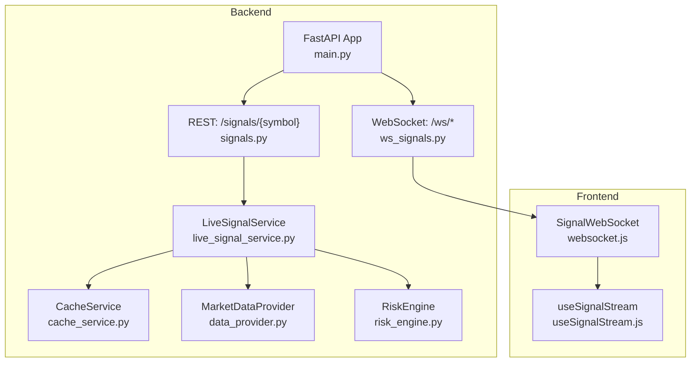
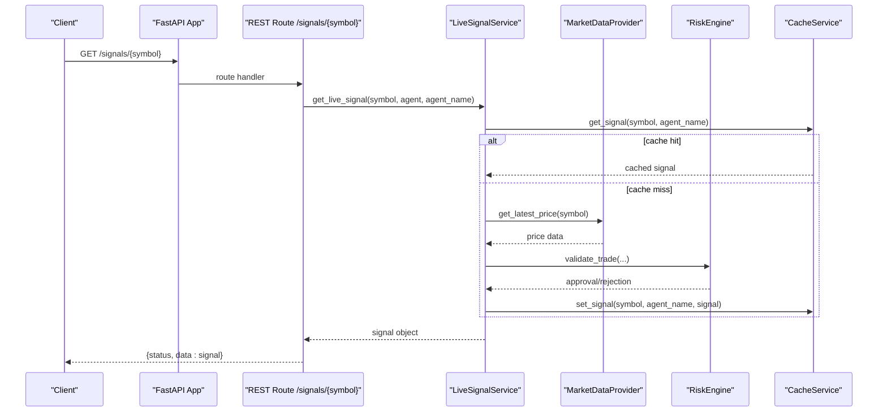
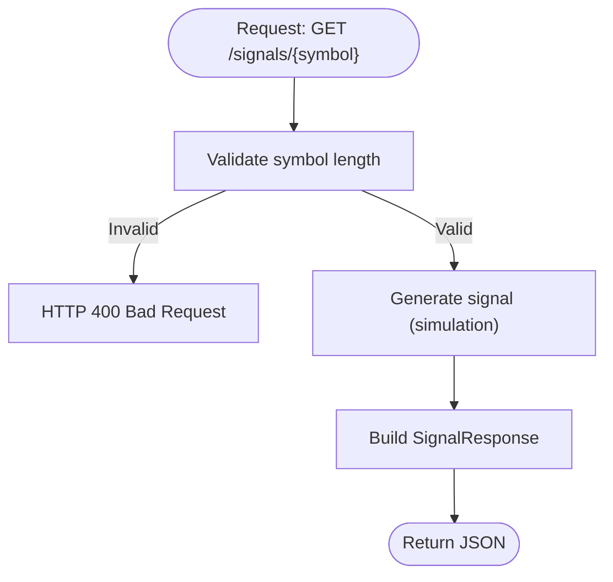
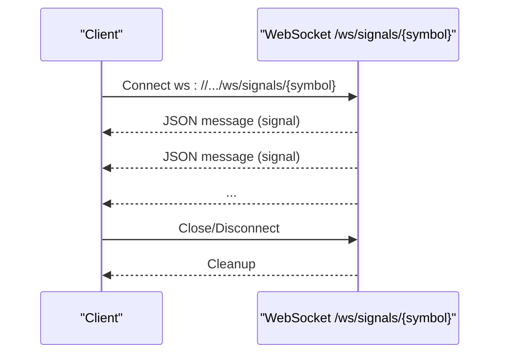
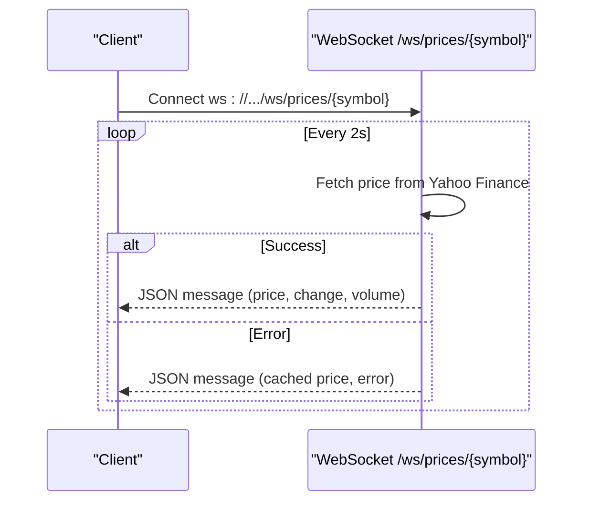
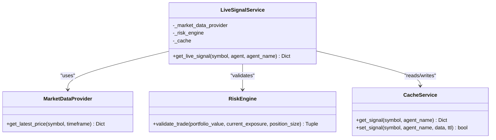
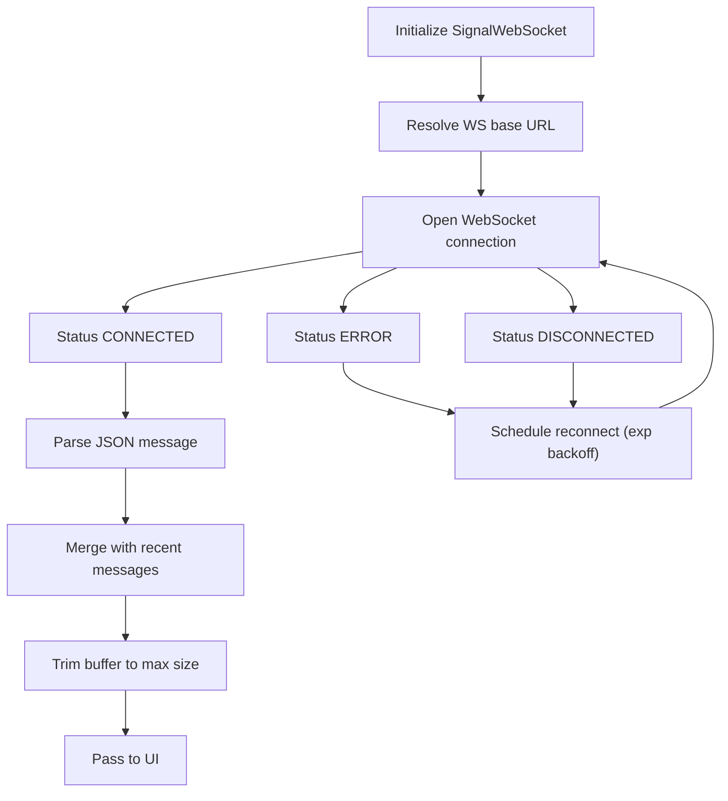
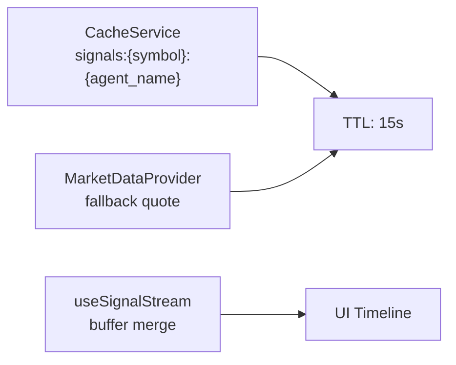
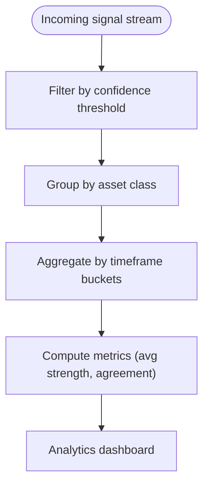
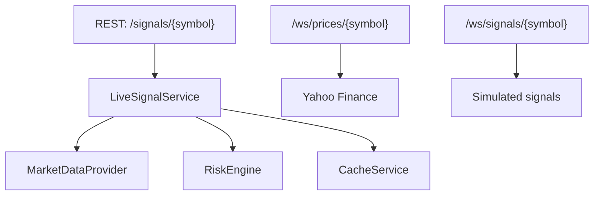

# Signal Management API

<cite>
**Referenced Files in This Document**
- [README.md](file://README.md)
- [main.py](file://backend/api/main.py)
- [signals.py](file://backend/routes/signals.py)
- [ws_signals.py](file://backend/routes/ws_signals.py)
- [live_signal_service.py](file://backend/services/live_signal_service.py)
- [cache_service.py](file://backend/cache/cache_service.py)
- [data_provider.py](file://backend/market/data_provider.py)
- [risk_engine.py](file://backend/risk/risk_engine.py)
- [websocket.js](file://frontend/src/services/websocket.js)
- [useSignalStream.js](file://frontend/src/hooks/useSignalStream.js)
- [signal_integrator.py](file://backend/market/signal_integrator.py)
</cite>

## Table of Contents
1. [Introduction](#introduction)
2. [Project Structure](#project-structure)
3. [Core Components](#core-components)
4. [Architecture Overview](#architecture-overview)
5. [Detailed Component Analysis](#detailed-component-analysis)
6. [Dependency Analysis](#dependency-analysis)
7. [Performance Considerations](#performance-considerations)
8. [Troubleshooting Guide](#troubleshooting-guide)
9. [Conclusion](#conclusion)
10. [Appendices](#appendices)

## Introduction
This document provides comprehensive API documentation for signal management endpoints, covering:
- REST endpoints for retrieving live signals
- Filtering and analytics of signals
- Real-time WebSocket streaming for price and signal feeds
- Signal persistence, replay, and historical access patterns
- Examples of filtering by confidence thresholds, asset classes, and timeframes
- Integration with trading algorithms and risk management
- Error handling and reconnection strategies for WebSocket clients

The system exposes REST and WebSocket endpoints under a FastAPI backend and powers a React frontend with resilient real-time streaming.

## Project Structure
The signal management functionality spans backend routes, services, and frontend hooks:
- REST endpoints: GET /signals/{symbol}
- WebSocket endpoints: /ws/prices/{symbol}, /ws/signals/{symbol}
- Live signal generation and risk validation via LiveSignalService
- Caching for signals and market data
- Multi-source signal integration for advanced analytics

**Diagram sources**
- [main.py:132-137](file://backend/api/main.py#L132-L137)
- [signals.py:62-67](file://backend/routes/signals.py#L62-L67)
- [ws_signals.py:22-140](file://backend/routes/ws_signals.py#L22-L140)
- [live_signal_service.py:23-84](file://backend/services/live_signal_service.py#L23-L84)
- [cache_service.py:58-202](file://backend/cache/cache_service.py#L58-L202)
- [data_provider.py:280-396](file://backend/market/data_provider.py#L280-L396)
- [risk_engine.py:22-226](file://backend/risk/risk_engine.py#L22-L226)
- [websocket.js:32-106](file://frontend/src/services/websocket.js#L32-L106)
- [useSignalStream.js:20-67](file://frontend/src/hooks/useSignalStream.js#L20-L67)

**Section sources**
- [main.py:132-137](file://backend/api/main.py#L132-L137)
- [README.md:216-250](file://README.md#L216-L250)

## Core Components
- REST signal retrieval: GET /signals/{symbol} returns a structured signal object with action, confidence, price, and explanation.
- WebSocket streaming:
  - /ws/prices/{symbol}: real-time price updates with change and volume
  - /ws/signals/{symbol}: simulated live signals with action and confidence
- LiveSignalService: orchestrates market data retrieval, agent-based signal generation, risk validation, and optional caching.
- CacheService: provides 2-level caching (L1 memory + L2 Redis) for signals and market data.
- MarketDataProvider: multi-provider market data fetching with fallback and TTL logic.
- RiskEngine: enforces position sizing, exposure, and drawdown constraints.
- Frontend WebSocket client: resilient connection with exponential backoff and message merging.

**Section sources**
- [signals.py:62-67](file://backend/routes/signals.py#L62-L67)
- [ws_signals.py:22-140](file://backend/routes/ws_signals.py#L22-L140)
- [live_signal_service.py:23-84](file://backend/services/live_signal_service.py#L23-L84)
- [cache_service.py:58-202](file://backend/cache/cache_service.py#L58-L202)
- [data_provider.py:280-396](file://backend/market/data_provider.py#L280-L396)
- [risk_engine.py:22-226](file://backend/risk/risk_engine.py#L22-L226)
- [websocket.js:32-106](file://frontend/src/services/websocket.js#L32-L106)
- [useSignalStream.js:20-67](file://frontend/src/hooks/useSignalStream.js#L20-L67)

## Architecture Overview
The signal management architecture integrates REST and WebSocket endpoints with caching, risk validation, and multi-source market data.

**Diagram sources**
- [main.py:132-137](file://backend/api/main.py#L132-L137)
- [signals.py:62-67](file://backend/routes/signals.py#L62-L67)
- [live_signal_service.py:23-84](file://backend/services/live_signal_service.py#L23-L84)
- [cache_service.py:155-170](file://backend/cache/cache_service.py#L155-L170)
- [data_provider.py:297-341](file://backend/market/data_provider.py#L297-L341)
- [risk_engine.py:72-127](file://backend/risk/risk_engine.py#L72-L127)

## Detailed Component Analysis

### REST Endpoint: GET /signals/{symbol}
- Method: GET
- Path: /signals/{symbol}
- Description: Returns a live signal for the given symbol, including action, confidence, price, and explanation.
- Request
  - Path parameters:
    - symbol: string (max length 12)
- Response
  - Body: SignalResponse
    - status: string
    - data: object containing:
      - symbol: string
      - price: number (float)
      - signal/action: string (BUY/SELL/HOLD)
      - confidence: number (0.0–1.0)
      - explanation: string
      - agent: string (identifier)
- Validation
  - Invalid symbol raises HTTP 400
- Notes
  - In the current implementation, the endpoint simulates a signal; a production system would integrate with LiveSignalService for dynamic generation and risk validation.

**Diagram sources**
- [signals.py:62-67](file://backend/routes/signals.py#L62-L67)

**Section sources**
- [signals.py:62-67](file://backend/routes/signals.py#L62-L67)

### WebSocket Endpoint: /ws/signals/{symbol}
- Path: /ws/signals/{symbol}
- Description: Streams live signals with action and confidence at a regular interval.
- Message format
  - JSON object with:
    - status: string
    - data: object containing:
      - symbol: string
      - price: number (float)
      - signal/action: string (BUY/SELL/HOLD)
      - confidence: number (0.0–1.0)
      - explanation: string
      - agent: string
- Behavior
  - Accepts WebSocket connection
  - Sends periodic messages with simulated price and signal updates
  - Handles disconnections gracefully

**Diagram sources**
- [ws_signals.py:106-140](file://backend/routes/ws_signals.py#L106-L140)

**Section sources**
- [ws_signals.py:106-140](file://backend/routes/ws_signals.py#L106-L140)

### WebSocket Endpoint: /ws/prices/{symbol}
- Path: /ws/prices/{symbol}
- Description: Streams real-time price updates from Yahoo Finance with change and volume.
- Message format
  - JSON object with:
    - status: string
    - data: object containing:
      - symbol: string
      - price: number (float)
      - change: number (float)
      - change_pct: number (float)
      - volume: number (integer)
      - timestamp: ISO string
      - source: string (e.g., yfinance_realtime, cached)
- Behavior
  - Accepts WebSocket connection
  - Polls Yahoo Finance periodically
  - Falls back to cached price on errors
  - Updates every 2 seconds

**Diagram sources**
- [ws_signals.py:22-104](file://backend/routes/ws_signals.py#L22-L104)

**Section sources**
- [ws_signals.py:22-104](file://backend/routes/ws_signals.py#L22-L104)

### Live Signal Service and Risk Integration
- LiveSignalService orchestrates:
  - Optional cache lookup by symbol and agent name
  - Market data retrieval via MarketDataProvider
  - Risk validation via RiskEngine
  - Optional cache write-back
- Risk validation includes:
  - Position size checks
  - Exposure limits
  - Portfolio value assumptions
- Confidence normalization to [0, 1]

**Diagram sources**
- [live_signal_service.py:9-84](file://backend/services/live_signal_service.py#L9-L84)
- [data_provider.py:280-396](file://backend/market/data_provider.py#L280-L396)
- [risk_engine.py:22-226](file://backend/risk/risk_engine.py#L22-L226)
- [cache_service.py:58-202](file://backend/cache/cache_service.py#L58-L202)

**Section sources**
- [live_signal_service.py:23-84](file://backend/services/live_signal_service.py#L23-L84)
- [risk_engine.py:72-127](file://backend/risk/risk_engine.py#L72-L127)
- [cache_service.py:155-170](file://backend/cache/cache_service.py#L155-L170)

### Frontend WebSocket Client and Stream Handling
- SignalWebSocket
  - Resolves WebSocket base URL
  - Manages connection lifecycle with exponential backoff
  - Tracks status transitions
  - Reconnects automatically on close/error
- useSignalStream
  - Merges rapid successive messages
  - Limits message buffer size
  - Normalizes price values for deduplication

**Diagram sources**
- [websocket.js:32-106](file://frontend/src/services/websocket.js#L32-L106)
- [useSignalStream.js:20-67](file://frontend/src/hooks/useSignalStream.js#L20-L67)

**Section sources**
- [websocket.js:32-106](file://frontend/src/services/websocket.js#L32-L106)
- [useSignalStream.js:20-67](file://frontend/src/hooks/useSignalStream.js#L20-L67)

### Signal Persistence, Replay, and Historical Access
- Signal caching
  - CacheService stores signals under namespace "signals:{symbol}:{agent_name}" with TTL
  - Supports L1 memory cache and L2 Redis fallback
- Historical market data
  - MarketDataProvider supports multiple providers and fallback logic
  - TTL varies by timeframe to balance freshness and cost
- Replay capability
  - Frontend merges and buffers recent messages for temporary replay-like behavior
  - For persistent replay, store signals in a dedicated store or database and expose a historical endpoint

**Diagram sources**
- [cache_service.py:155-170](file://backend/cache/cache_service.py#L155-L170)
- [data_provider.py:346-396](file://backend/market/data_provider.py#L346-L396)
- [useSignalStream.js:20-67](file://frontend/src/hooks/useSignalStream.js#L20-L67)

**Section sources**
- [cache_service.py:155-170](file://backend/cache/cache_service.py#L155-L170)
- [data_provider.py:346-396](file://backend/market/data_provider.py#L346-L396)
- [useSignalStream.js:20-67](file://frontend/src/hooks/useSignalStream.js#L20-L67)

### Signal Analytics and Filtering Examples
- Confidence threshold filtering
  - Example: retain only signals with confidence ≥ 0.7
- Asset class filtering
  - Example: filter by sector or exchange code if available in extended schema
- Timeframe aggregation
  - Example: compute rolling average confidence over last N messages
- Multi-source integration
  - Use SignalIntegrator to fuse technical, sentiment, macro, and fundamental signals into a unified signal with strength and confidence

**Diagram sources**
- [signal_integrator.py:686-777](file://backend/market/signal_integrator.py#L686-L777)

**Section sources**
- [signal_integrator.py:686-777](file://backend/market/signal_integrator.py#L686-L777)

## Dependency Analysis
- REST endpoint depends on LiveSignalService for signal generation and risk validation
- LiveSignalService depends on MarketDataProvider for price data, RiskEngine for validation, and CacheService for persistence
- WebSocket endpoints are standalone and simulate data; they can be extended to integrate with LiveSignalService for production

**Diagram sources**
- [signals.py:62-67](file://backend/routes/signals.py#L62-L67)
- [live_signal_service.py:23-84](file://backend/services/live_signal_service.py#L23-L84)
- [data_provider.py:280-396](file://backend/market/data_provider.py#L280-L396)
- [risk_engine.py:22-226](file://backend/risk/risk_engine.py#L22-L226)
- [cache_service.py:58-202](file://backend/cache/cache_service.py#L58-L202)
- [ws_signals.py:22-140](file://backend/routes/ws_signals.py#L22-L140)

**Section sources**
- [main.py:132-137](file://backend/api/main.py#L132-L137)
- [signals.py:62-67](file://backend/routes/signals.py#L62-L67)
- [ws_signals.py:22-140](file://backend/routes/ws_signals.py#L22-L140)

## Performance Considerations
- WebSocket intervals
  - Prices and signals streams update every 2 seconds; adjust for latency vs. bandwidth trade-offs
- Cache TTLs
  - Signal TTL is 15s; market data TTL varies by timeframe to balance freshness and cost
- Provider fallback
  - MarketDataProvider rotates among configured providers and applies circuit breaker logic to avoid overloaded endpoints
- Frontend buffering
  - useSignalStream merges rapid messages and caps buffer size to prevent memory pressure

[No sources needed since this section provides general guidance]

## Troubleshooting Guide
- WebSocket reconnection
  - SignalWebSocket implements exponential backoff with a maximum number of attempts; on exhaustion, status becomes EXHAUSTED
  - On manual reconnect, closes with code 1000 and reopens cleanly
- Disconnected streams
  - On error, WS sends cached price and schedules reconnect; on close codes 1000/1001 treated as intentional disconnect
- Risk rejection
  - LiveSignalService returns a REJECTED signal with explanation when risk validation fails
- HTTP 400 on REST
  - Occurs when symbol is missing or exceeds maximum length

**Section sources**
- [websocket.js:82-106](file://frontend/src/services/websocket.js#L82-L106)
- [websocket.js:74-79](file://frontend/src/services/websocket.js#L74-L79)
- [live_signal_service.py:66-73](file://backend/services/live_signal_service.py#L66-L73)
- [signals.py:64-66](file://backend/routes/signals.py#L64-L66)

## Conclusion
The signal management system provides a robust foundation for retrieving, filtering, and streaming trading signals. REST endpoints offer deterministic signal retrieval, while WebSocket endpoints deliver low-latency streams suitable for dashboards and trading interfaces. Integration with LiveSignalService, MarketDataProvider, RiskEngine, and CacheService enables scalable, risk-aware signal generation. The frontend WebSocket client ensures resilient connectivity with automatic reconnection and message merging.

[No sources needed since this section summarizes without analyzing specific files]

## Appendices

### API Definitions

- GET /signals/{symbol}
  - Path parameters:
    - symbol: string (required)
  - Response body:
    - status: string
    - data: object
      - symbol: string
      - price: number
      - signal/action: string (BUY/SELL/HOLD)
      - confidence: number (0.0–1.0)
      - explanation: string
      - agent: string

- WebSocket /ws/prices/{symbol}
  - Message fields:
    - status: string
    - data:
      - symbol: string
      - price: number
      - change: number
      - change_pct: number
      - volume: number
      - timestamp: string (ISO)
      - source: string

- WebSocket /ws/signals/{symbol}
  - Message fields:
    - status: string
    - data:
      - symbol: string
      - price: number
      - signal/action: string (BUY/SELL/HOLD)
      - confidence: number (0.0–1.0)
      - explanation: string
      - agent: string

**Section sources**
- [signals.py:62-67](file://backend/routes/signals.py#L62-L67)
- [ws_signals.py:22-140](file://backend/routes/ws_signals.py#L22-L140)

### Filtering Examples

- Confidence threshold
  - Keep signals where confidence ≥ 0.7
- Asset class
  - Filter by sector or exchange code if present in extended schema
- Timeframe
  - Aggregate last N messages per minute/hour

**Section sources**
- [signal_integrator.py:686-777](file://backend/market/signal_integrator.py#L686-L777)

### Integration with Trading Algorithms
- Use LiveSignalService to generate risk-approved signals
- Persist signals via CacheService for downstream analytics
- Stream signals via WebSocket for real-time dashboards and algorithm triggers

**Section sources**
- [live_signal_service.py:23-84](file://backend/services/live_signal_service.py#L23-L84)
- [cache_service.py:155-170](file://backend/cache/cache_service.py#L155-L170)
- [ws_signals.py:106-140](file://backend/routes/ws_signals.py#L106-L140)