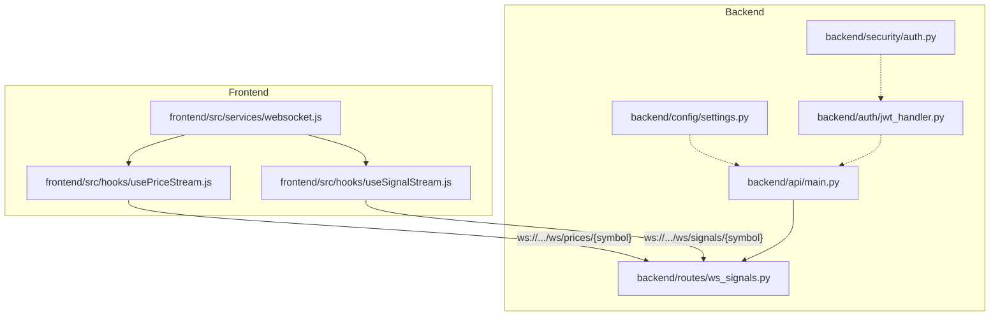
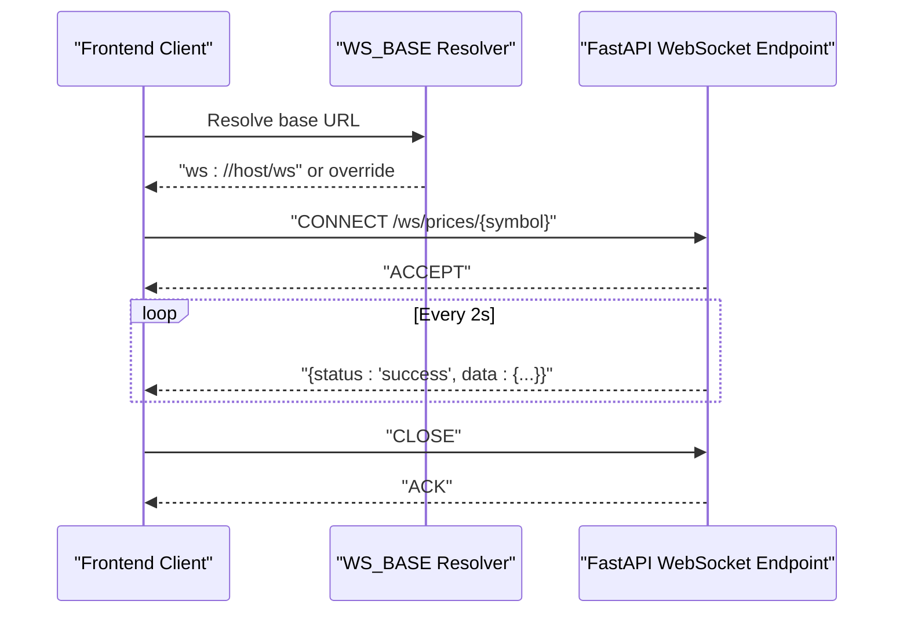
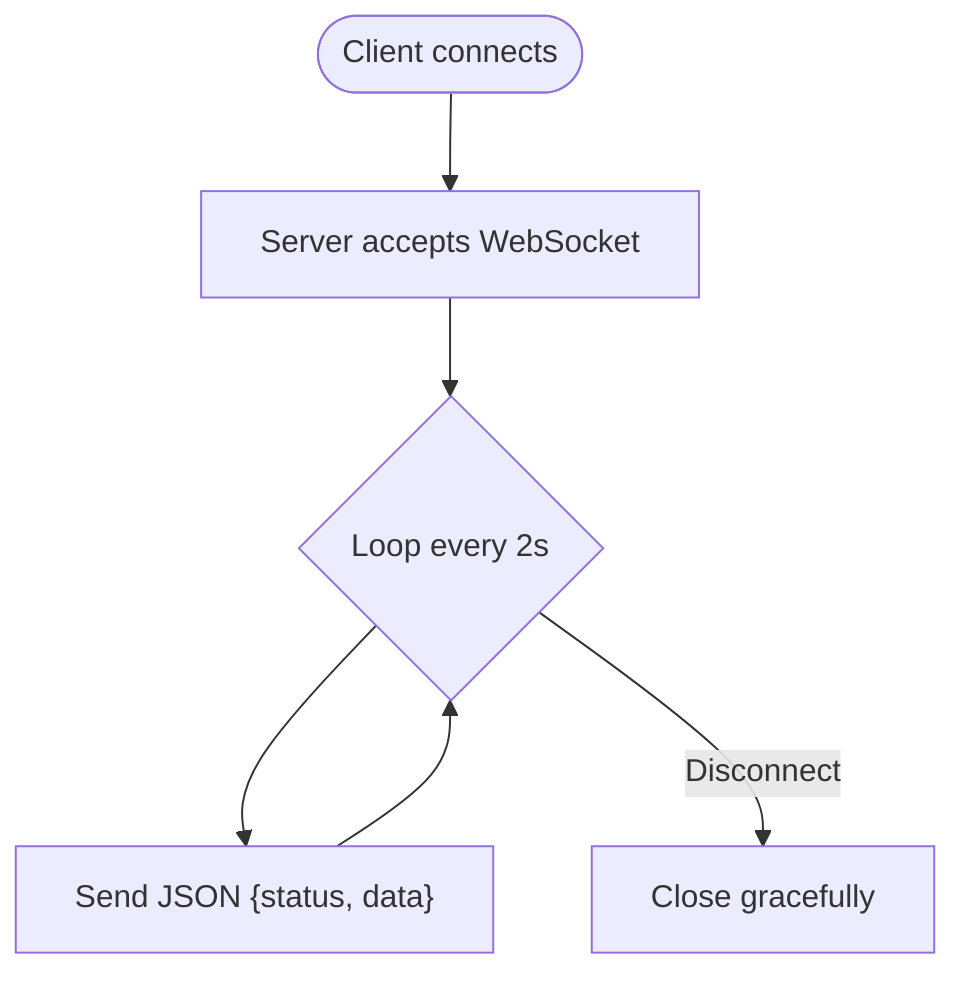
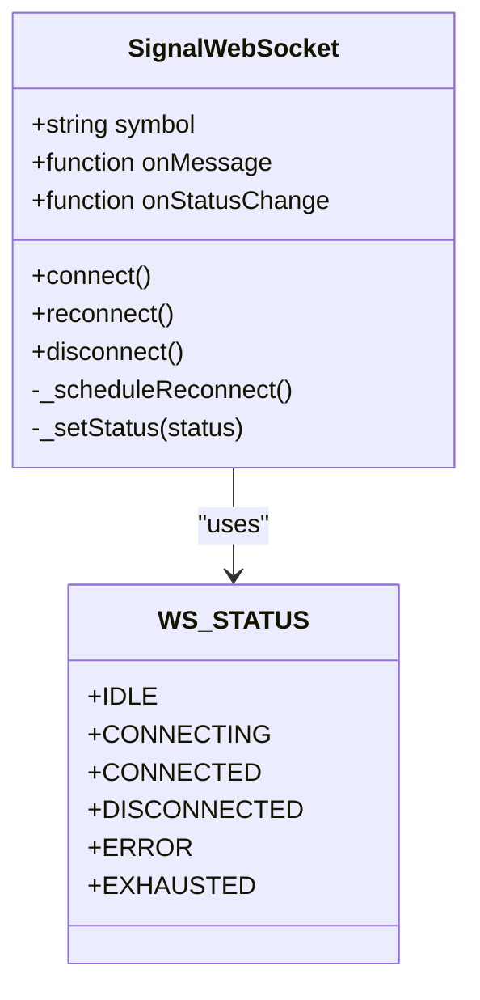
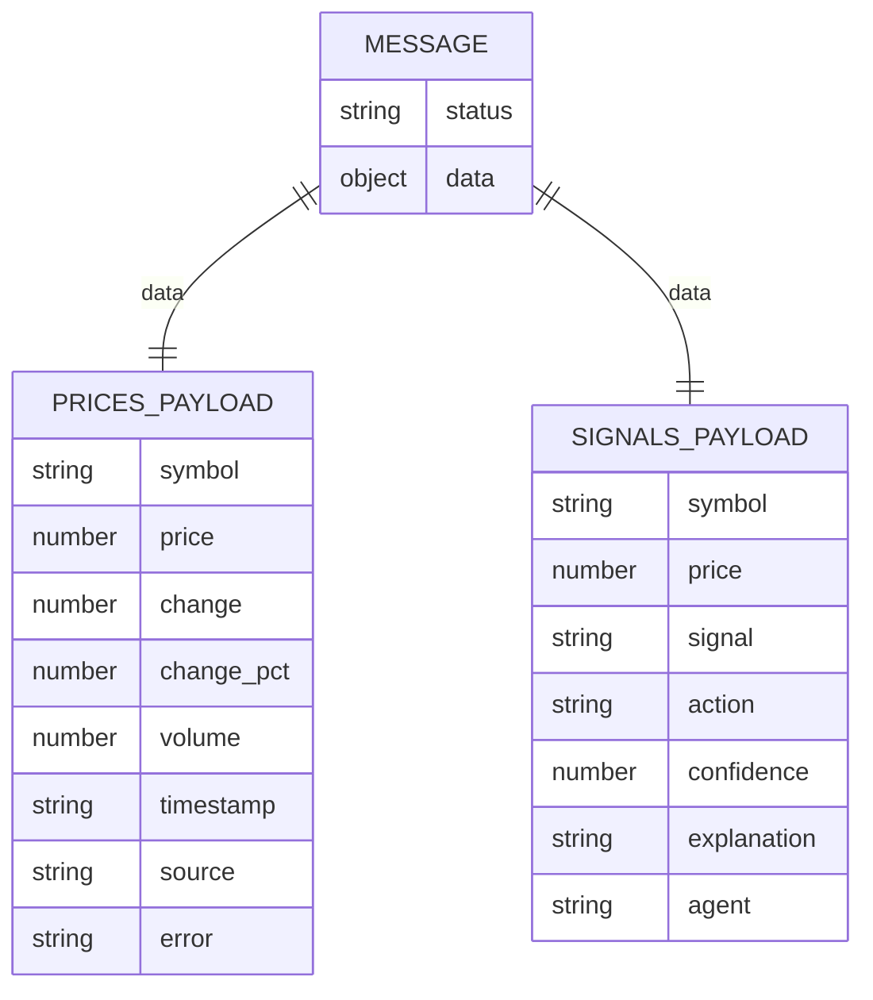
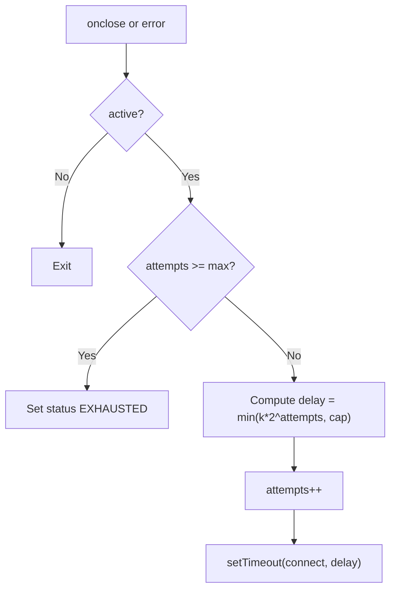
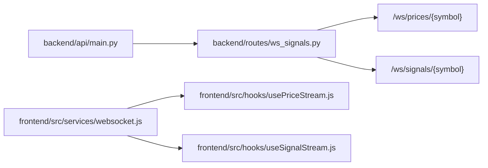

# WebSocket API

<cite>
**Referenced Files in This Document**
- [ws_signals.py](file://backend/routes/ws_signals.py)
- [main.py](file://backend/api/main.py)
- [websocket.js](file://frontend/src/services/websocket.js)
- [usePriceStream.js](file://frontend/src/hooks/usePriceStream.js)
- [useSignalStream.js](file://frontend/src/hooks/useSignalStream.js)
- [settings.py](file://backend/config/settings.py)
- [jwt_handler.py](file://backend/auth/jwt_handler.py)
- [auth.py](file://backend/security/auth.py)
- [realtime_stream_processor.py](file://FinAgents/memory/realtime_stream_processor.py)
</cite>

## Table of Contents
1. [Introduction](#introduction)
2. [Project Structure](#project-structure)
3. [Core Components](#core-components)
4. [Architecture Overview](#architecture-overview)
5. [Detailed Component Analysis](#detailed-component-analysis)
6. [Dependency Analysis](#dependency-analysis)
7. [Performance Considerations](#performance-considerations)
8. [Troubleshooting Guide](#troubleshooting-guide)
9. [Conclusion](#conclusion)
10. [Appendices](#appendices)

## Introduction
This document specifies the WebSocket API for real-time data streaming in the Agentic Trading Application. It covers connection establishment, message formats, subscription management, event handling patterns, authentication, heartbeat mechanisms, error handling, reconnection logic, channel semantics, and performance considerations. It also documents client-side integration patterns and security best practices.

## Project Structure
The WebSocket API is implemented as FastAPI WebSocket endpoints under a dedicated router and consumed by React hooks and a reusable WebSocket client in the frontend. The backend exposes two primary channels:
- /ws/prices/{symbol}: real-time price updates
- /ws/signals/{symbol}: real-time trading signals

The frontend provides:
- A WebSocket base URL resolver supporting environment overrides
- A reusable SignalWebSocket class for signal streams
- React hooks for price and signal streams with auto-reconnect and deduplication

**Diagram sources**
- [main.py](file://backend/api/main.py#L137)
- [ws_signals.py](file://backend/routes/ws_signals.py#L22)
- [websocket.js](file://frontend/src/services/websocket.js#L1)
- [usePriceStream.js](file://frontend/src/hooks/usePriceStream.js#L1)
- [useSignalStream.js](file://frontend/src/hooks/useSignalStream.js#L1)
- [settings.py](file://backend/config/settings.py#L1)
- [jwt_handler.py](file://backend/auth/jwt_handler.py#L1)
- [auth.py](file://backend/security/auth.py#L1)

**Section sources**
- [main.py](file://backend/api/main.py#L137)
- [ws_signals.py](file://backend/routes/ws_signals.py#L22)
- [websocket.js](file://frontend/src/services/websocket.js#L1)
- [usePriceStream.js](file://frontend/src/hooks/usePriceStream.js#L1)
- [useSignalStream.js](file://frontend/src/hooks/useSignalStream.js#L1)

## Core Components
- Backend WebSocket endpoints:
  - Prices stream: /ws/prices/{symbol}
  - Signals stream: /ws/signals/{symbol}
- Frontend WebSocket client and hooks:
  - SignalWebSocket class for signal streams
  - usePriceStream hook for price streams
  - useSignalStream hook for signal streams
- Configuration:
  - WebSocket base URL resolution
  - CORS and host/port settings

Key behaviors:
- Messages are JSON with a top-level status and data payload.
- The backend sends periodic updates (2-second intervals) for both channels.
- Frontend implements exponential backoff reconnection and basic deduplication/merge for signals.

**Section sources**
- [ws_signals.py](file://backend/routes/ws_signals.py#L22)
- [ws_signals.py](file://backend/routes/ws_signals.py#L106)
- [websocket.js](file://frontend/src/services/websocket.js#L32)
- [usePriceStream.js](file://frontend/src/hooks/usePriceStream.js#L16)
- [useSignalStream.js](file://frontend/src/hooks/useSignalStream.js#L20)
- [settings.py](file://backend/config/settings.py#L33)

## Architecture Overview
The WebSocket API follows a simple publish-subscribe pattern:
- Clients connect to a specific symbol channel.
- The server emits periodic updates.
- Clients handle messages, errors, and reconnections.

**Diagram sources**
- [websocket.js](file://frontend/src/services/websocket.js#L1)
- [ws_signals.py](file://backend/routes/ws_signals.py#L22)

## Detailed Component Analysis

### Backend WebSocket Endpoints
- Route registration:
  - The WebSocket router is included under the /ws prefix.
- /ws/prices/{symbol}:
  - Accepts WebSocket connection.
  - Streams price updates with change, change percentage, volume, and timestamp.
  - Implements fallback to cached data on upstream failures.
- /ws/signals/{symbol}:
  - Accepts WebSocket connection.
  - Streams simulated trading signals with action, confidence, explanation, and agent metadata.

**Diagram sources**
- [ws_signals.py](file://backend/routes/ws_signals.py#L22)
- [ws_signals.py](file://backend/routes/ws_signals.py#L106)

**Section sources**
- [main.py](file://backend/api/main.py#L137)
- [ws_signals.py](file://backend/routes/ws_signals.py#L22)
- [ws_signals.py](file://backend/routes/ws_signals.py#L106)

### Frontend WebSocket Client and Hooks
- WebSocket base URL resolution:
  - Supports explicit ws/wss URLs, relative paths, and defaults to the current origin with /ws suffix.
- SignalWebSocket class:
  - Manages connection lifecycle, status transitions, and exponential backoff reconnection.
  - Parses incoming JSON and forwards normalized messages to callbacks.
- usePriceStream hook:
  - Connects to /ws/prices/{symbol}.
  - Merges incoming updates into a single price object with metadata.
  - Implements exponential backoff reconnection with a configurable max attempts.
- useSignalStream hook:
  - Connects to /ws/signals/{symbol}.
  - Deduplicates and merges rapid successive messages keyed by symbol, action, price, and agent.
  - Limits history size and tracks update counts.

**Diagram sources**
- [websocket.js](file://frontend/src/services/websocket.js#L32)
- [websocket.js](file://frontend/src/services/websocket.js#L23)

**Section sources**
- [websocket.js](file://frontend/src/services/websocket.js#L1)
- [websocket.js](file://frontend/src/services/websocket.js#L32)
- [usePriceStream.js](file://frontend/src/hooks/usePriceStream.js#L16)
- [useSignalStream.js](file://frontend/src/hooks/useSignalStream.js#L20)

### Message Formats

- Common envelope:
  - status: "success" indicates normal operation; clients should still handle parsing errors.
  - data: Channel-specific payload object.
- /ws/prices/{symbol} payload fields:
  - symbol: Requested uppercase symbol.
  - price: Current price rounded to two decimals.
  - change: Absolute change from previous close.
  - change_pct: Percent change from previous close.
  - volume: Trading volume.
  - timestamp: ISO timestamp of the update.
  - source: "yfinance_realtime", "cached", or "error_fallback".
  - error: Present when fallback occurs due to upstream failure.
- /ws/signals/{symbol} payload fields:
  - symbol: Requested uppercase symbol.
  - price: Current simulated price.
  - signal/action: One of BUY, SELL, HOLD.
  - confidence: Confidence score in [0.48, 0.91].
  - explanation: Human-readable rationale for the signal.
  - agent: Originating agent identifier (e.g., "momentum").

**Diagram sources**
- [ws_signals.py](file://backend/routes/ws_signals.py#L53)
- [ws_signals.py](file://backend/routes/ws_signals.py#L120)

**Section sources**
- [ws_signals.py](file://backend/routes/ws_signals.py#L53)
- [ws_signals.py](file://backend/routes/ws_signals.py#L120)

### Subscription Management and Channels
- Channels:
  - /ws/prices/{symbol}
  - /ws/signals/{symbol}
- Subscription semantics:
  - No explicit subscribe/unsubscribe control frames are implemented in the referenced code.
  - Clients connect to a symbol-specific channel and receive periodic updates until closed.
- Event types:
  - Prices: price updates with computed change and volume.
  - Signals: trading signals with confidence and explanation.

Note: The backend includes a WebSocket manager class that tracks connections and subscriptions. While not currently wired to the public WebSocket endpoints in the referenced files, it establishes a foundation for future subscription-based routing.

**Section sources**
- [ws_signals.py](file://backend/routes/ws_signals.py#L22)
- [ws_signals.py](file://backend/routes/ws_signals.py#L106)
- [realtime_stream_processor.py](file://FinAgents/memory/realtime_stream_processor.py#L288)

### Authentication and Authorization
- The WebSocket endpoints in the referenced files do not enforce authentication.
- Authentication is handled via JWT for HTTP routes; JWT utilities and token creation/verification are present in the backend.
- Recommendation: For production, secure WebSocket endpoints with JWT tokens passed via query parameters or custom headers, and validate tokens in the WebSocket accept handler.

**Section sources**
- [ws_signals.py](file://backend/routes/ws_signals.py#L22)
- [ws_signals.py](file://backend/routes/ws_signals.py#L106)
- [jwt_handler.py](file://backend/auth/jwt_handler.py#L23)
- [auth.py](file://backend/security/auth.py#L24)

### Heartbeat Mechanisms
- No explicit heartbeat or ping/pong frames are implemented in the referenced WebSocket endpoints.
- Clients may implement application-level keepalive by sending empty frames or relying on transport keepalive.

**Section sources**
- [ws_signals.py](file://backend/routes/ws_signals.py#L22)
- [ws_signals.py](file://backend/routes/ws_signals.py#L106)

### Error Handling and Reconnection
- Backend:
  - On exceptions, the prices endpoint sends a cached/fallback message and retries shortly.
  - Both endpoints catch WebSocket disconnects and exit cleanly.
- Frontend:
  - SignalWebSocket: Tracks status, schedules exponential backoff reconnection up to a max attempt count.
  - usePriceStream: Exponential backoff reconnection with a configurable cap and clears timers on disconnect.
  - useSignalStream: Uses SignalWebSocket for reconnection and maintains a capped message history with merge logic.

**Diagram sources**
- [websocket.js](file://frontend/src/services/websocket.js#L82)

**Section sources**
- [ws_signals.py](file://backend/routes/ws_signals.py#L83)
- [websocket.js](file://frontend/src/services/websocket.js#L82)
- [usePriceStream.js](file://frontend/src/hooks/usePriceStream.js#L56)
- [useSignalStream.js](file://frontend/src/hooks/useSignalStream.js#L20)

### Connection URL Patterns
- Base URL resolution supports:
  - Explicit ws:// or wss://
  - Relative path (/ws) resolved to current origin with proper scheme
  - Defaults to ws://127.0.0.1:8000/ws when not in browser context
- Final URL construction:
  - Prices: WS_BASE + /ws/prices/{symbol}
  - Signals: WS_BASE + /ws/signals/{symbol}

**Section sources**
- [websocket.js](file://frontend/src/services/websocket.js#L1)
- [usePriceStream.js](file://frontend/src/hooks/usePriceStream.js#L22)
- [websocket.js](file://frontend/src/services/websocket.js#L55)

### Security Considerations
- Transport security: Prefer wss:// in production; ensure TLS termination at the gateway.
- Authentication: Add JWT validation in WebSocket accept handlers.
- Rate limiting: Enforce per-client rate limits and backpressure to prevent abuse.
- Origin policy: Align with CORS settings for the WebSocket base URL.
- Secrets: Do not expose tokens in logs or client-side code.

**Section sources**
- [settings.py](file://backend/config/settings.py#L36)
- [jwt_handler.py](file://backend/auth/jwt_handler.py#L23)
- [auth.py](file://backend/security/auth.py#L24)

## Dependency Analysis
- Backend:
  - WebSocket endpoints depend on FastAPI’s WebSocket support and asyncio sleep for periodic updates.
  - The main app wires the WebSocket router under /ws.
- Frontend:
  - Hooks depend on the SignalWebSocket class and WS_BASE resolution.
  - useSignalStream depends on a merge-and-deduplicate strategy keyed by symbol, action, price, and agent.

**Diagram sources**
- [main.py](file://backend/api/main.py#L137)
- [ws_signals.py](file://backend/routes/ws_signals.py#L22)
- [websocket.js](file://frontend/src/services/websocket.js#L1)
- [usePriceStream.js](file://frontend/src/hooks/usePriceStream.js#L1)
- [useSignalStream.js](file://frontend/src/hooks/useSignalStream.js#L1)

**Section sources**
- [main.py](file://backend/api/main.py#L137)
- [ws_signals.py](file://backend/routes/ws_signals.py#L22)
- [websocket.js](file://frontend/src/services/websocket.js#L1)

## Performance Considerations
- Update cadence: Both channels emit every 2 seconds; tune for latency vs. bandwidth.
- Client-side buffering: useSignalStream caps message history; adjust maxMessages for memory footprint.
- Deduplication: useSignalStream merges rapid successive messages within a short window to reduce rendering churn.
- Backpressure: Consider adding server-side rate limits and queue depth checks to protect the server.
- Bandwidth optimization: Use compact field sets and avoid unnecessary re-renders by leveraging derived metrics and memoization.

[No sources needed since this section provides general guidance]

## Troubleshooting Guide
- Connection fails immediately:
  - Verify WS_BASE resolves to the correct host and scheme.
  - Ensure the backend is reachable and the /ws route is mounted.
- Frequent reconnections:
  - Check network stability and server availability.
  - Confirm exponential backoff is functioning and max attempts are sufficient.
- Stale or cached data:
  - For prices, cached fallback indicates upstream failure; monitor error field and source.
- Signal duplication:
  - useSignalStream deduplicates by key; verify the key composition and merge window.

**Section sources**
- [websocket.js](file://frontend/src/services/websocket.js#L82)
- [usePriceStream.js](file://frontend/src/hooks/usePriceStream.js#L56)
- [useSignalStream.js](file://frontend/src/hooks/useSignalStream.js#L20)
- [ws_signals.py](file://backend/routes/ws_signals.py#L83)

## Conclusion
The WebSocket API provides low-latency streaming for prices and signals with straightforward client integration. The backend endpoints are simple and robust, while the frontend offers resilient connection management and efficient client-side processing. For production, add authentication, rate limiting, and heartbeat mechanisms to ensure reliability and security.

[No sources needed since this section summarizes without analyzing specific files]

## Appendices

### API Reference

- Base URL resolution
  - Environment override: VITE_WS_URL
  - Defaults to ws://host:port/ws or wss://host:port/ws depending on page protocol
- Endpoints
  - GET /ws/prices/{symbol}
    - Returns periodic price updates with change, volume, and timestamp.
  - GET /ws/signals/{symbol}
    - Returns periodic trading signals with action, confidence, explanation, and agent.

**Section sources**
- [websocket.js](file://frontend/src/services/websocket.js#L1)
- [ws_signals.py](file://backend/routes/ws_signals.py#L22)
- [ws_signals.py](file://backend/routes/ws_signals.py#L106)