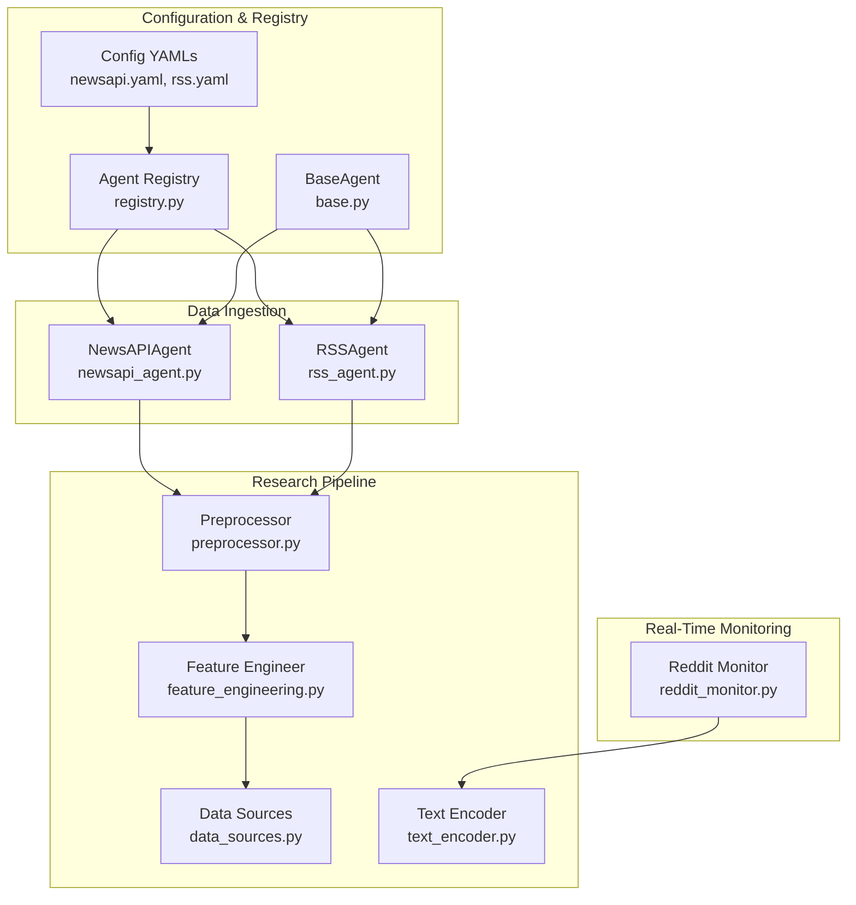
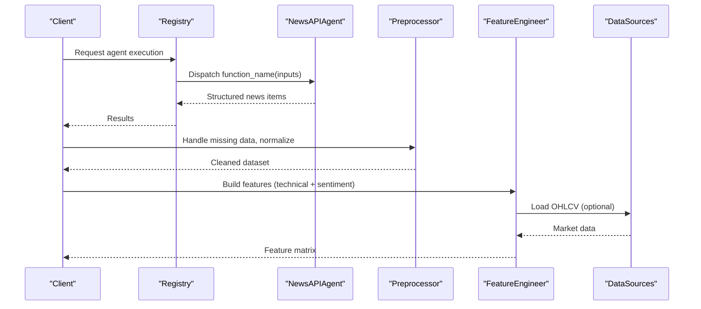
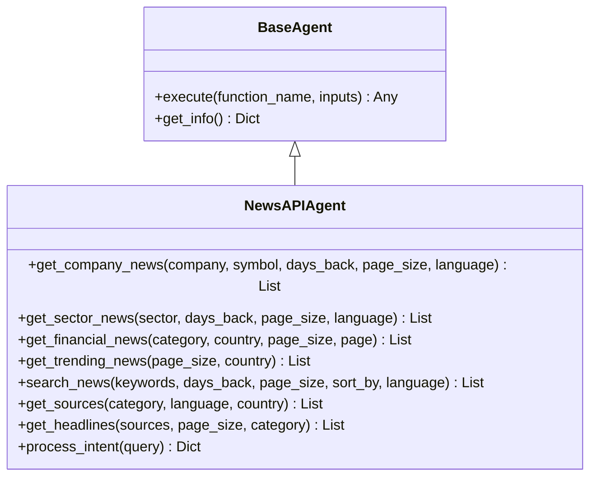
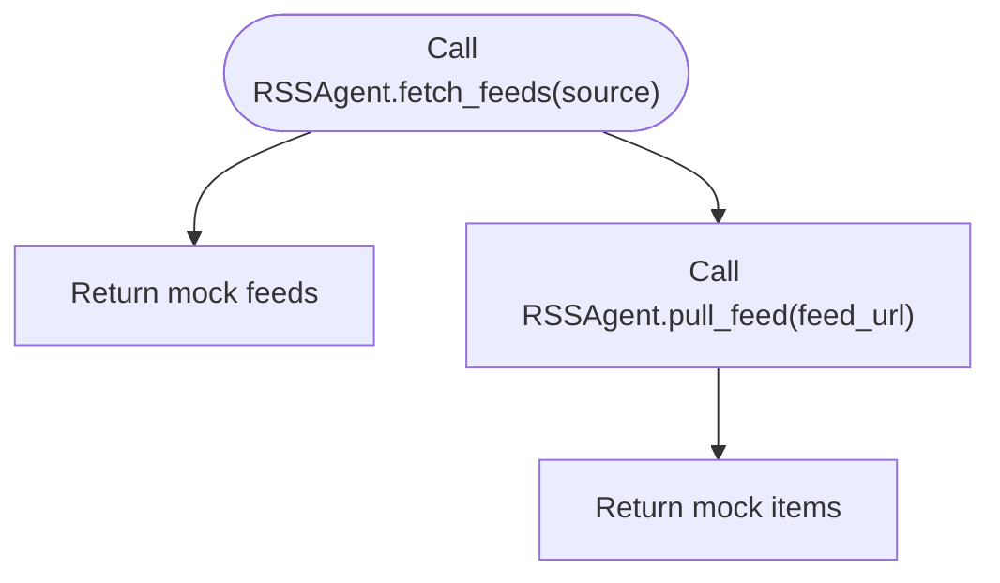
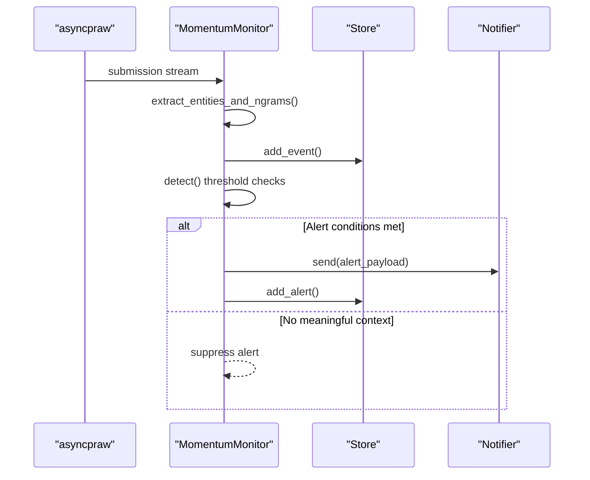
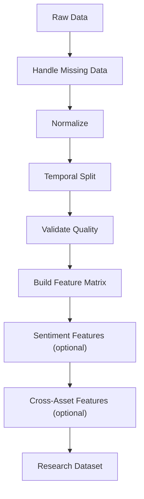
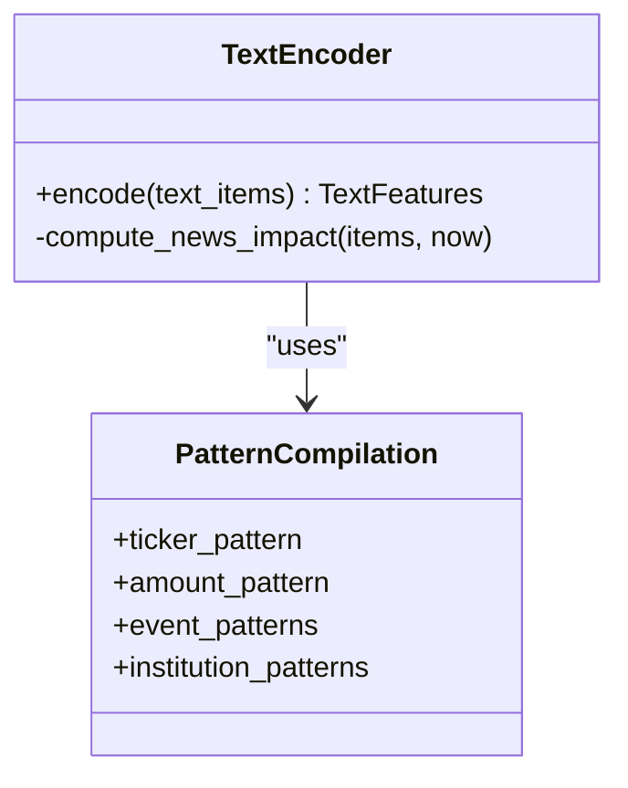
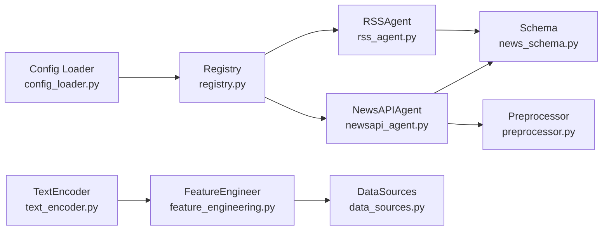

# Alternative Data Sources

<cite>
**Referenced Files in This Document**
- [newsapi_agent.py](file://FinAgents/agent_pools/data_agent_pool/agents/news/newsapi_agent.py)
- [rss_agent.py](file://FinAgents/agent_pools/data_agent_pool/agents/news/rss_agent.py)
- [reddit_monitor.py](file://scripts/reddit_monitor.py)
- [newsapi.yaml](file://FinAgents/agent_pools/data_agent_pool/config/newsapi.yaml)
- [rss.yaml](file://FinAgents/agent_pools/data_agent_pool/config/rss.yaml)
- [news_schema.py](file://FinAgents/agent_pools/data_agent_pool/schema/news_schema.py)
- [base.py](file://FinAgents/agent_pools/data_agent_pool/base.py)
- [registry.py](file://FinAgents/agent_pools/data_agent_pool/registry.py)
- [config_loader.py](file://FinAgents/agent_pools/data_agent_pool/config_loader.py)
- [preprocessor.py](file://FinAgents/research/data_pipeline/preprocessor.py)
- [feature_engineering.py](file://FinAgents/research/data_pipeline/feature_engineering.py)
- [data_sources.py](file://FinAgents/research/data_pipeline/data_sources.py)
- [text_encoder.py](file://FinAgents/research/multimodal/text_encoder.py)
</cite>

## Table of Contents
1. [Introduction](#introduction)
2. [Project Structure](#project-structure)
3. [Core Components](#core-components)
4. [Architecture Overview](#architecture-overview)
5. [Detailed Component Analysis](#detailed-component-analysis)
6. [Dependency Analysis](#dependency-analysis)
7. [Performance Considerations](#performance-considerations)
8. [Troubleshooting Guide](#troubleshooting-guide)
9. [Conclusion](#conclusion)
10. [Appendices](#appendices)

## Introduction
This document explains how alternative data sources are integrated for agentic trading applications. It covers structured news via NewsAPI, market commentary via RSS feeds, and social sentiment via Reddit monitoring. It also documents the data preprocessing pipeline, including NLP-based sentiment analysis, entity extraction, and event categorization, and outlines real-time monitoring workflows and correlation with price movements. Configuration examples and integration points for trading signals are included.

## Project Structure
The alternative data stack is organized around:
- Data agents for ingestion (NewsAPI, RSS)
- Real-time social monitoring (Reddit)
- Unified configuration and registry
- Research-grade preprocessing and feature engineering
- NLP text encoding for sentiment and entities

**Diagram sources**
- [newsapi_agent.py:1-620](file://FinAgents/agent_pools/data_agent_pool/agents/news/newsapi_agent.py#L1-L620)
- [rss_agent.py:1-20](file://FinAgents/agent_pools/data_agent_pool/agents/news/rss_agent.py#L1-L20)
- [reddit_monitor.py:1-561](file://scripts/reddit_monitor.py#L1-L561)
- [newsapi.yaml:1-15](file://FinAgents/agent_pools/data_agent_pool/config/newsapi.yaml#L1-L15)
- [rss.yaml:1-13](file://FinAgents/agent_pools/data_agent_pool/config/rss.yaml#L1-L13)
- [registry.py:1-141](file://FinAgents/agent_pools/data_agent_pool/registry.py#L1-L141)
- [base.py:1-61](file://FinAgents/agent_pools/data_agent_pool/base.py#L1-L61)
- [preprocessor.py:1-404](file://FinAgents/research/data_pipeline/preprocessor.py#L1-L404)
- [feature_engineering.py:1-354](file://FinAgents/research/data_pipeline/feature_engineering.py#L1-L354)
- [data_sources.py:1-617](file://FinAgents/research/data_pipeline/data_sources.py#L1-L617)
- [text_encoder.py:331-434](file://FinAgents/research/multimodal/text_encoder.py#L331-L434)

**Section sources**
- [newsapi_agent.py:1-620](file://FinAgents/agent_pools/data_agent_pool/agents/news/newsapi_agent.py#L1-L620)
- [rss_agent.py:1-20](file://FinAgents/agent_pools/data_agent_pool/agents/news/rss_agent.py#L1-L20)
- [reddit_monitor.py:1-561](file://scripts/reddit_monitor.py#L1-L561)
- [newsapi.yaml:1-15](file://FinAgents/agent_pools/data_agent_pool/config/newsapi.yaml#L1-L15)
- [rss.yaml:1-13](file://FinAgents/agent_pools/data_agent_pool/config/rss.yaml#L1-L13)
- [news_schema.py:1-32](file://FinAgents/agent_pools/data_agent_pool/schema/news_schema.py#L1-L32)
- [base.py:1-61](file://FinAgents/agent_pools/data_agent_pool/base.py#L1-L61)
- [registry.py:1-141](file://FinAgents/agent_pools/data_agent_pool/registry.py#L1-L141)
- [config_loader.py:1-23](file://FinAgents/agent_pools/data_agent_pool/config_loader.py#L1-L23)
- [preprocessor.py:1-404](file://FinAgents/research/data_pipeline/preprocessor.py#L1-L404)
- [feature_engineering.py:1-354](file://FinAgents/research/data_pipeline/feature_engineering.py#L1-L354)
- [data_sources.py:1-617](file://FinAgents/research/data_pipeline/data_sources.py#L1-L617)
- [text_encoder.py:331-434](file://FinAgents/research/multimodal/text_encoder.py#L331-L434)

## Core Components
- NewsAPIAgent: Fetches structured financial news, supports company, sector, trending, and keyword searches; optionally integrates an LLM planner to orchestrate tool execution.
- RSSAgent: Skeleton for RSS feed ingestion; currently returns mock data and serves as a placeholder for RSS parsing and enrichment.
- Reddit Monitor: Real-time streaming monitor for subreddits with entity extraction, sentiment (optional), and alerting based on burst detection and velocity.
- Configuration: YAML configs define endpoints, intervals, and constraints; schema enforces typed configuration.
- Registry and BaseAgent: Centralized registration and dynamic execution interface for agents.
- Research Pipeline: Preprocessing, normalization, temporal splitting, and quality validation; feature engineering including sentiment features; data sources for OHLCV and synthetic news.
- Text Encoder: Aggregates sentiment and entities from text streams for downstream modeling.

**Section sources**
- [newsapi_agent.py:20-620](file://FinAgents/agent_pools/data_agent_pool/agents/news/newsapi_agent.py#L20-L620)
- [rss_agent.py:4-20](file://FinAgents/agent_pools/data_agent_pool/agents/news/rss_agent.py#L4-L20)
- [reddit_monitor.py:170-561](file://scripts/reddit_monitor.py#L170-L561)
- [newsapi.yaml:1-15](file://FinAgents/agent_pools/data_agent_pool/config/newsapi.yaml#L1-L15)
- [rss.yaml:1-13](file://FinAgents/agent_pools/data_agent_pool/config/rss.yaml#L1-L13)
- [news_schema.py:17-32](file://FinAgents/agent_pools/data_agent_pool/schema/news_schema.py#L17-L32)
- [registry.py:89-141](file://FinAgents/agent_pools/data_agent_pool/registry.py#L89-L141)
- [base.py:11-61](file://FinAgents/agent_pools/data_agent_pool/base.py#L11-L61)
- [preprocessor.py:43-404](file://FinAgents/research/data_pipeline/preprocessor.py#L43-L404)
- [feature_engineering.py:17-354](file://FinAgents/research/data_pipeline/feature_engineering.py#L17-L354)
- [data_sources.py:19-617](file://FinAgents/research/data_pipeline/data_sources.py#L19-L617)
- [text_encoder.py:331-434](file://FinAgents/research/multimodal/text_encoder.py#L331-L434)

## Architecture Overview
The system integrates structured and unstructured data:
- Structured ingestion: NewsAPIAgent and RSSAgent produce normalized news items.
- Unstructured ingestion: Reddit Monitor streams submissions/comments, extracts entities and optionally computes sentiment.
- Processing: Preprocessor normalizes and validates; FeatureEngineer builds sentiment and cross-asset features; DataSources manage OHLCV and synthetic data.
- Outputs: Feature matrices enriched with sentiment and event signals suitable for ML/trading models.

**Diagram sources**
- [registry.py:89-141](file://FinAgents/agent_pools/data_agent_pool/registry.py#L89-L141)
- [newsapi_agent.py:148-487](file://FinAgents/agent_pools/data_agent_pool/agents/news/newsapi_agent.py#L148-L487)
- [preprocessor.py:55-238](file://FinAgents/research/data_pipeline/preprocessor.py#L55-L238)
- [feature_engineering.py:29-354](file://FinAgents/research/data_pipeline/feature_engineering.py#L29-L354)
- [data_sources.py:75-132](file://FinAgents/research/data_pipeline/data_sources.py#L75-L132)

## Detailed Component Analysis

### NewsAPIAgent
- Responsibilities:
  - Fetch company, sector, financial, trending, and keyword news.
  - Optional LLM-driven planning to orchestrate multiple tool calls.
  - Thread-pool execution for synchronous operations.
- Key capabilities:
  - Company-specific and sector-specific queries with date-range filters.
  - Headlines and sources discovery.
  - Structured article normalization with metadata.
- Integration:
  - Uses NewsAPI endpoints and environment-based API key.
  - Supports configurable constraints and default intervals.

**Diagram sources**
- [base.py:11-61](file://FinAgents/agent_pools/data_agent_pool/base.py#L11-L61)
- [newsapi_agent.py:20-620](file://FinAgents/agent_pools/data_agent_pool/agents/news/newsapi_agent.py#L20-L620)

**Section sources**
- [newsapi_agent.py:35-620](file://FinAgents/agent_pools/data_agent_pool/agents/news/newsapi_agent.py#L35-L620)
- [newsapi.yaml:1-15](file://FinAgents/agent_pools/data_agent_pool/config/newsapi.yaml#L1-L15)
- [news_schema.py:17-21](file://FinAgents/agent_pools/data_agent_pool/schema/news_schema.py#L17-L21)

### RSSAgent
- Responsibilities:
  - Skeleton for RSS ingestion; returns mock feed items and URLs.
- Future enhancements:
  - Implement RSS parsing, deduplication, and enrichment similar to NewsAPIAgent.

**Diagram sources**
- [rss_agent.py:8-20](file://FinAgents/agent_pools/data_agent_pool/agents/news/rss_agent.py#L8-L20)

**Section sources**
- [rss_agent.py:4-20](file://FinAgents/agent_pools/data_agent_pool/agents/news/rss_agent.py#L4-L20)
- [rss.yaml:1-13](file://FinAgents/agent_pools/data_agent_pool/config/rss.yaml#L1-L13)
- [news_schema.py:23-26](file://FinAgents/agent_pools/data_agent_pool/schema/news_schema.py#L23-L26)

### Reddit Monitor
- Real-time streaming:
  - Submissions and comments from configured subreddits.
  - Bucketed counters for entities, authors, subreddits, upvotes, and comments.
- Detection and alerting:
  - Velocity and acceleration thresholds, optional Kleinberg burst and Hawkes branching ratio.
  - Tiered alerts with top contexts (threads, subreddits, authors).
- Optional sentiment:
  - FinBERT-based sentiment on top titles when enabled.

**Diagram sources**
- [reddit_monitor.py:460-521](file://scripts/reddit_monitor.py#L460-L521)
- [reddit_monitor.py:374-438](file://scripts/reddit_monitor.py#L374-L438)
- [reddit_monitor.py:98-162](file://scripts/reddit_monitor.py#L98-L162)

**Section sources**
- [reddit_monitor.py:170-561](file://scripts/reddit_monitor.py#L170-L561)

### Data Preprocessing Pipeline
- Missing data handling, normalization (zscore/minmax/robust), temporal splitting, and quality validation.
- Research dataset creation with labels and metadata.
- Sentiment feature computation from news items with rolling aggregations.

**Diagram sources**
- [preprocessor.py:55-392](file://FinAgents/research/data_pipeline/preprocessor.py#L55-L392)
- [feature_engineering.py:237-354](file://FinAgents/research/data_pipeline/feature_engineering.py#L237-L354)
- [data_sources.py:19-617](file://FinAgents/research/data_pipeline/data_sources.py#L19-L617)

**Section sources**
- [preprocessor.py:43-404](file://FinAgents/research/data_pipeline/preprocessor.py#L43-L404)
- [feature_engineering.py:17-354](file://FinAgents/research/data_pipeline/feature_engineering.py#L17-L354)
- [data_sources.py:19-617](file://FinAgents/research/data_pipeline/data_sources.py#L19-L617)

### NLP Text Encoding and Entity Extraction
- TextEncoder compiles patterns for tickers, amounts, events, and institutions.
- Encodes lists of text items into per-item features and aggregated vectors including sentiment, magnitude, entity density, and temporal impact.

**Diagram sources**
- [text_encoder.py:331-434](file://FinAgents/research/multimodal/text_encoder.py#L331-L434)

**Section sources**
- [text_encoder.py:331-434](file://FinAgents/research/multimodal/text_encoder.py#L331-L434)

## Dependency Analysis
- Registry loads YAML configs and instantiates agents with typed schemas.
- BaseAgent provides a uniform interface for dynamic dispatch.
- NewsAPIAgent depends on NewsAPI configuration and environment variables.
- FeatureEngineer consumes NewsItem objects and OHLCV data to produce features.

**Diagram sources**
- [config_loader.py:12-23](file://FinAgents/agent_pools/data_agent_pool/config_loader.py#L12-L23)
- [registry.py:82-124](file://FinAgents/agent_pools/data_agent_pool/registry.py#L82-L124)
- [newsapi_agent.py:35-44](file://FinAgents/agent_pools/data_agent_pool/agents/news/newsapi_agent.py#L35-L44)
- [rss_agent.py:5-6](file://FinAgents/agent_pools/data_agent_pool/agents/news/rss_agent.py#L5-L6)
- [news_schema.py:17-32](file://FinAgents/agent_pools/data_agent_pool/schema/news_schema.py#L17-L32)
- [preprocessor.py:43-404](file://FinAgents/research/data_pipeline/preprocessor.py#L43-L404)
- [feature_engineering.py:237-354](file://FinAgents/research/data_pipeline/feature_engineering.py#L237-L354)
- [data_sources.py:54-132](file://FinAgents/research/data_pipeline/data_sources.py#L54-L132)
- [text_encoder.py:331-434](file://FinAgents/research/multimodal/text_encoder.py#L331-L434)

**Section sources**
- [registry.py:89-141](file://FinAgents/agent_pools/data_agent_pool/registry.py#L89-L141)
- [newsapi_agent.py:35-620](file://FinAgents/agent_pools/data_agent_pool/agents/news/newsapi_agent.py#L35-L620)
- [rss_agent.py:4-20](file://FinAgents/agent_pools/data_agent_pool/agents/news/rss_agent.py#L4-L20)
- [news_schema.py:17-32](file://FinAgents/agent_pools/data_agent_pool/schema/news_schema.py#L17-L32)
- [preprocessor.py:43-404](file://FinAgents/research/data_pipeline/preprocessor.py#L43-L404)
- [feature_engineering.py:17-354](file://FinAgents/research/data_pipeline/feature_engineering.py#L17-L354)
- [data_sources.py:54-132](file://FinAgents/research/data_pipeline/data_sources.py#L54-L132)
- [text_encoder.py:331-434](file://FinAgents/research/multimodal/text_encoder.py#L331-L434)

## Performance Considerations
- Rate limiting and timeouts: Configure per-agent constraints in YAML to avoid throttling.
- Asynchronous streaming: Use thread pools judiciously; NewsAPIAgent employs a thread pool for synchronous operations.
- Real-time processing: Reddit monitor buckets updates; tune bucket seconds and history buckets for responsiveness vs. stability.
- Memory footprint: SQLite-backed storage persists events and alerts; ensure periodic maintenance and indexing for large histories.
- Model inference: Optional FinBERT sentiment adds latency; enable only when needed.

[No sources needed since this section provides general guidance]

## Troubleshooting Guide
- Missing API keys:
  - NewsAPIAgent requires a valid API key via environment variable or config.
- Configuration validation:
  - Ensure YAML files match schema types; errors surface during config load.
- Agent execution:
  - BaseAgent’s dynamic dispatch raises attribute errors if a function name is not found.
- Reddit credentials:
  - Missing or invalid credentials cause immediate failure; verify client ID, secret, and user agent.

**Section sources**
- [newsapi_agent.py:39,491-493:39-39](file://FinAgents/agent_pools/data_agent_pool/agents/news/newsapi_agent.py#L39-L39)
- [newsapi.yaml:10-15](file://FinAgents/agent_pools/data_agent_pool/config/newsapi.yaml#L10-L15)
- [config_loader.py:12-23](file://FinAgents/agent_pools/data_agent_pool/config_loader.py#L12-L23)
- [base.py:45-48](file://FinAgents/agent_pools/data_agent_pool/base.py#L45-L48)
- [reddit_monitor.py:524-538](file://scripts/reddit_monitor.py#L524-L538)

## Conclusion
The alternative data stack integrates structured and unstructured sources with a robust preprocessing and feature engineering pipeline. NewsAPIAgent and RSSAgent provide structured ingestion, while Reddit Monitor delivers real-time social sentiment. The research pipeline normalizes and enriches data with sentiment and cross-asset features, enabling correlation studies with price movements and integration into trading signals.

[No sources needed since this section summarizes without analyzing specific files]

## Appendices

### Configuration Examples
- NewsAPI configuration highlights:
  - Endpoints, default interval, authentication key, and constraints.
- RSS configuration highlights:
  - Base URL, default endpoint, interval, and constraints.

**Section sources**
- [newsapi.yaml:1-15](file://FinAgents/agent_pools/data_agent_pool/config/newsapi.yaml#L1-L15)
- [rss.yaml:1-13](file://FinAgents/agent_pools/data_agent_pool/config/rss.yaml#L1-L13)

### Integration with Trading Signals
- Feature engineering:
  - Technical indicators, statistical features, sentiment features, and cross-asset features form the basis for ML/trading models.
- Data sources:
  - OHLCV caching and synthetic data generation support backtesting and research.
- Text encoding:
  - Aggregated sentiment and entity features can be joined with market features for modeling.

**Section sources**
- [feature_engineering.py:29-354](file://FinAgents/research/data_pipeline/feature_engineering.py#L29-L354)
- [data_sources.py:54-132](file://FinAgents/research/data_pipeline/data_sources.py#L54-L132)
- [text_encoder.py:331-434](file://FinAgents/research/multimodal/text_encoder.py#L331-L434)